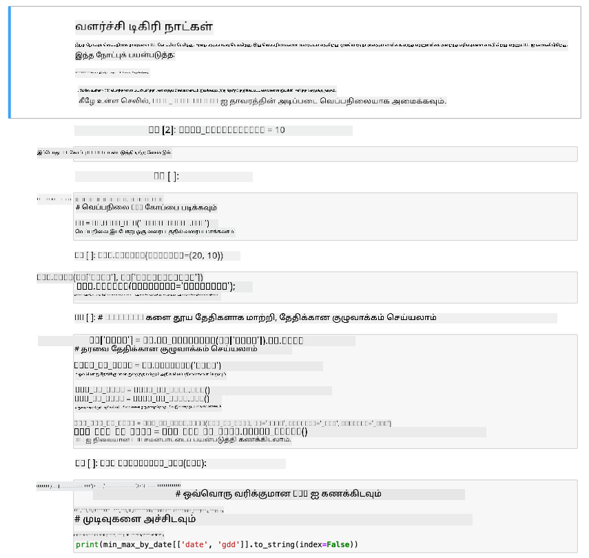

<!--
CO_OP_TRANSLATOR_METADATA:
{
  "original_hash": "1e21b012c6685f8bf73e0e76cdca3347",
  "translation_date": "2025-10-11T12:37:42+00:00",
  "source_file": "2-farm/lessons/1-predict-plant-growth/assignment.md",
  "language_code": "ta"
}
-->
# ஜூபிடர் நோட்புக் மூலம் GDD தரவுகளை காட்சிப்படுத்துதல்

## வழிமுறைகள்

இந்த பாடத்தில் நீங்கள் IoT சென்சார் மூலம் GDD தரவுகளை சேகரித்தீர்கள். நல்ல GDD தரவுகளை பெற, பல நாட்களுக்கு தரவுகளை சேகரிக்க வேண்டும். வெப்பநிலை தரவுகளை காட்சிப்படுத்தவும் GDD-ஐ கணக்கிடவும் உதவ, [ஜூபிடர் நோட்புக்](https://jupyter.org) போன்ற கருவிகளை பயன்படுத்தலாம்.

முதலில் சில நாட்களுக்கு தரவுகளை சேகரிக்க தொடங்குங்கள். உங்கள் IoT சாதனம் இயங்கும் போது உங்கள் சர்வர் குறியீடு தொடர்ந்து இயங்க வேண்டும் என்பதை உறுதிப்படுத்த வேண்டும், இதற்காக உங்கள் பவர் மேலாண்மை அமைப்புகளை சரிசெய்யவும் அல்லது [இந்த சிஸ்டத்தை செயல்பாட்டில் வைத்த Python ஸ்கிரிப்ட்](https://github.com/jaqsparow/keep-system-active) போன்றவற்றை இயக்கவும்.

வெப்பநிலை தரவுகளை சேகரித்த பிறகு, இந்த ரெப்போவில் உள்ள ஜூபிடர் நோட்புக் மூலம் அதை காட்சிப்படுத்தவும் GDD-ஐ கணக்கிடவும் முடியும். ஜூபிடர் நோட்புக் குறியீடு மற்றும் வழிமுறைகளை *செல்* எனப்படும் தொகுதிகளில் கலக்கிறது, பொதுவாக Python குறியீடு. நீங்கள் வழிமுறைகளை படித்து, ஒவ்வொரு குறியீடு தொகுதியையும் ஒன்றன் பின் ஒன்றாக இயக்கலாம். குறியீட்டை திருத்தவும் முடியும். உதாரணமாக, இந்த நோட்புக்கில் உங்கள் தாவரத்திற்கான GDD-ஐ கணக்கிட பயன்படுத்தப்படும் அடிப்படை வெப்பநிலையை நீங்கள் திருத்தலாம்.

1. `gdd-calculation` என்ற ஒரு கோப்புறையை உருவாக்கவும்

1. [gdd.ipynb](./code-notebook/gdd.ipynb) கோப்பை பதிவிறக்கம் செய்து `gdd-calculation` கோப்புறையில் நகலெடுக்கவும்.

1. MQTT சர்வர் உருவாக்கிய `temperature.csv` கோப்பை நகலெடுக்கவும்

1. `gdd-calculation` கோப்புறையில் புதிய Python மெய்நிகர் சூழலை உருவாக்கவும்.

1. ஜூபிடர் நோட்புக்குகளுக்கான சில pip தொகுப்புகளை நிறுவவும், தரவுகளை நிர்வகிக்கவும் மற்றும் வரைபடம் வரையவும் தேவையான நூலகங்களை நிறுவவும்:

    ```sh
    pip install --upgrade pip
    pip install pandas
    pip install matplotlib
    pip install jupyter
    ```

1. ஜூபிடர் நோட்புக்கை இயக்கவும்:

    ```sh
    jupyter notebook gdd.ipynb
    ```

    ஜூபிடர் தொடங்கும் மற்றும் உங்கள் உலாவியில் நோட்புக்கை திறக்கும். நோட்புக்கில் உள்ள வழிமுறைகளை பின்பற்றி அளிக்கப்பட்ட வெப்பநிலைகளை காட்சிப்படுத்தவும், வளர்ச்சி டிகிரி நாட்களை கணக்கிடவும்.

    

## மதிப்பீடு

| அளவுகோல் | சிறந்தது | போதுமானது | மேம்பாடு தேவை |
| -------- | --------- | -------- | ----------------- |
| தரவுகளை சேகரித்தல் | குறைந்தது 2 முழு நாட்களின் தரவுகளை சேகரிக்கவும் | குறைந்தது 1 முழு நாளின் தரவுகளை சேகரிக்கவும் | சில தரவுகளை சேகரிக்கவும் |
| GDD-ஐ கணக்கிடுதல் | நோட்புக்கை வெற்றிகரமாக இயக்கி GDD-ஐ கணக்கிடவும் | நோட்புக்கை வெற்றிகரமாக இயக்கவும் | நோட்புக்கை இயக்க முடியவில்லை |

---

**குறிப்பு**:  
இந்த ஆவணம் [Co-op Translator](https://github.com/Azure/co-op-translator) என்ற AI மொழிபெயர்ப்பு சேவையைப் பயன்படுத்தி மொழிபெயர்க்கப்பட்டுள்ளது. நாங்கள் துல்லியத்திற்காக முயற்சிக்கின்றோம், ஆனால் தானியங்கி மொழிபெயர்ப்புகளில் பிழைகள் அல்லது தவறான தகவல்கள் இருக்கக்கூடும் என்பதை தயவுசெய்து கவனத்தில் கொள்ளவும். அதன் தாய்மொழியில் உள்ள மூல ஆவணம் அதிகாரப்பூர்வ ஆதாரமாக கருதப்பட வேண்டும். முக்கியமான தகவல்களுக்கு, தொழில்முறை மனித மொழிபெயர்ப்பு பரிந்துரைக்கப்படுகிறது. இந்த மொழிபெயர்ப்பைப் பயன்படுத்துவதால் ஏற்படும் எந்த தவறான புரிதல்கள் அல்லது தவறான விளக்கங்களுக்கு நாங்கள் பொறுப்பல்ல.