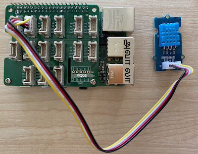

<!--
CO_OP_TRANSLATOR_METADATA:
{
  "original_hash": "7678f7c67b97ee52d5727496dcd7d346",
  "translation_date": "2025-10-11T12:33:46+00:00",
  "source_file": "2-farm/lessons/1-predict-plant-growth/pi-temp.md",
  "language_code": "ta"
}
-->
# வெப்பநிலை அளவிடுதல் - ராஸ்பெரி பை

இந்த பாடத்தின் இந்த பகுதியில், உங்கள் ராஸ்பெரி பையில் வெப்பநிலை சென்சரை சேர்க்கப் போகிறீர்கள்.

## ஹார்ட்வேர்கள்

நீங்கள் பயன்படுத்தப் போகும் சென்சர் [DHT11 ஈரப்பதம் மற்றும் வெப்பநிலை சென்சர்](https://www.seeedstudio.com/Grove-Temperature-Humidity-Sensor-DHT11.html) ஆகும், இது இரண்டு சென்சர்களை ஒரே தொகுப்பில் இணைக்கிறது. இது மிகவும் பிரபலமானது, வெப்பநிலை, ஈரப்பதம் மற்றும் சில சமயங்களில் வளிமண்டல அழுத்தத்தை இணைக்கும் பல வணிக சென்சர்கள் உள்ளன. வெப்பநிலை சென்சர் கூறு ஒரு எதிர்மறை வெப்பநிலை குணகம் (NTC) தெர்மிஸ்டர் ஆகும், இது வெப்பநிலை அதிகரிக்கும்போது எதிர்ப்பு குறையும்.

இது ஒரு டிஜிட்டல் சென்சர் ஆகும், எனவே இது ஒரு டிஜிட்டல் சிக்னலை உருவாக்க ஒரு ADC-ஐ கொண்டுள்ளது, இது வெப்பநிலை மற்றும் ஈரப்பதம் தரவுகளை மைக்ரோகண்ட்ரோலர் படிக்க உதவுகிறது.

### வெப்பநிலை சென்சரை இணைக்கவும்

Grove வெப்பநிலை சென்சரை ராஸ்பெரி பைக்கு இணைக்கலாம்.

#### பணிகள்

வெப்பநிலை சென்சரை இணைக்கவும்


1. Grove கேபிளின் ஒரு முனையை ஈரப்பதம் மற்றும் வெப்பநிலை சென்சரின் சாக்கெட்டில் செருகவும். இது ஒரு வழியில் மட்டுமே செல்லும்.

1. ராஸ்பெரி பை ஆஃப் நிலையில் இருக்கும் போது, Grove கேபிளின் மற்றொரு முனையை பை-யில் இணைக்கப்பட்ட Grove Base hat-இல் **D5** என்று குறிக்கப்பட்ட டிஜிட்டல் சாக்கெட்டில் இணைக்கவும். இந்த சாக்கெட் GPIO பின்களுக்குப் பக்கத்தில் உள்ள வரிசையில் இடது பக்கம் இரண்டாவது சாக்கெட்டாகும்.



## வெப்பநிலை சென்சரை நிரலாக்கம் செய்யவும்

இப்போது இணைக்கப்பட்ட வெப்பநிலை சென்சரை பயன்படுத்த சாதனத்தை நிரலாக்கலாம்.

### பணிகள்

சாதனத்தை நிரலாக்கவும்.

1. பையை ஆன் செய்து, அது தொடங்கும் வரை காத்திருக்கவும்.

1. VS Code-ஐ தொடங்கவும், நேரடியாக பையில் அல்லது Remote SSH extension மூலம் இணைக்கவும்.

    > ⚠️ [பாடம் 1-இல் VS Code-ஐ அமைத்து தொடங்குவதற்கான வழிமுறைகளை](../../../1-getting-started/lessons/1-introduction-to-iot/pi.md) தேவைப்பட்டால் பார்க்கலாம்.

1. டெர்மினலில் இருந்து, `pi` பயனர் ஹோம் டைரக்டரியில் `temperature-sensor` என்ற புதிய கோப்பகத்தை உருவாக்கவும். இந்த கோப்பகத்தில் `app.py` என்ற கோப்பை உருவாக்கவும்:

    ```sh
    mkdir temperature-sensor
    cd temperature-sensor
    touch app.py
    ```

1. இந்த கோப்பகத்தை VS Code-இல் திறக்கவும்.

1. வெப்பநிலை மற்றும் ஈரப்பதம் சென்சரை பயன்படுத்த, கூடுதல் Pip பாக்கேஜ் நிறுவப்பட வேண்டும். VS Code-இல் உள்ள டெர்மினலில் இருந்து, பையில் இந்த Pip பாக்கேஜை நிறுவ கீழே உள்ள கட்டளையை இயக்கவும்:

    ```sh
    pip3 install seeed-python-dht
    ```

1. தேவையான நூலகங்களை இறக்குமதி செய்ய `app.py` கோப்பில் கீழே உள்ள குறியீட்டை சேர்க்கவும்:

    ```python
    import time
    from seeed_dht import DHT
    ```

    `from seeed_dht import DHT` என்ற அறிக்கையால் `seeed_dht` மாட்யூலில் இருந்து Grove வெப்பநிலை சென்சருடன் தொடர்பு கொள்ள `DHT` சென்சர் வகுப்பை இறக்குமதி செய்கிறது.

1. மேலே உள்ள குறியீட்டிற்குப் பிறகு, வெப்பநிலை சென்சரை நிர்வகிக்கும் வகுப்பின் ஒரு உதாரணத்தை உருவாக்க கீழே உள்ள குறியீட்டை சேர்க்கவும்:

    ```python
    sensor = DHT("11", 5)
    ```

    இது **D**igital **H**umidity மற்றும் **T**emperature சென்சரை நிர்வகிக்கும் `DHT` வகுப்பின் ஒரு உதாரணத்தை அறிவிக்கிறது. முதல் அளவுரு பயன்படுத்தப்படும் சென்சர் *DHT11* சென்சர் என்று குறிக்கிறது - நீங்கள் பயன்படுத்தும் நூலகம் இந்த சென்சரின் பிற மாறுபாடுகளை ஆதரிக்கிறது. இரண்டாவது அளவுரு சென்சர் Grove base hat-இல் டிஜிட்டல் போர்ட் `D5`-இல் இணைக்கப்பட்டுள்ளது என்று குறிக்கிறது.

    > ✅ நினைவில் கொள்ளுங்கள், அனைத்து சாக்கெட்டுகளுக்கும் தனித்துவமான பின் எண்கள் உள்ளன. பின்கள் 0, 2, 4, மற்றும் 6 analog பின்கள், பின்கள் 5, 16, 18, 22, 24, மற்றும் 26 டிஜிட்டல் பின்கள்.

1. வெப்பநிலை சென்சர் மதிப்பை சோதித்து அதை கன்சோலில் அச்சிட ஒரு முடிவில்லாத லூப்பை மேலே உள்ள குறியீட்டிற்குப் பிறகு சேர்க்கவும்:

    ```python
    while True:
        _, temp = sensor.read()
        print(f'Temperature {temp}°C')
    ```

    `sensor.read()`-க்கு அழைப்பு ஈரப்பதம் மற்றும் வெப்பநிலை ஆகியவற்றின் ஒரு டியூப்பிளை திருப்புகிறது. நீங்கள் வெப்பநிலை மதிப்பை மட்டுமே தேவைப்படுகிறீர்கள், எனவே ஈரப்பதம் புறக்கணிக்கப்படுகிறது. பின்னர் வெப்பநிலை மதிப்பு கன்சோலில் அச்சிடப்படுகிறது.

1. லூப்பின் இறுதியில் பத்து விநாடிகளுக்கான சிறிய ஓய்வை சேர்க்கவும், ஏனெனில் வெப்பநிலை நிலைகள் தொடர்ந்து சோதிக்கப்பட தேவையில்லை. ஓய்வு சாதனத்தின் மின்சார நுகர்வை குறைக்கிறது.

    ```python
    time.sleep(10)
    ```

1. VS Code டெர்மினலில் இருந்து, உங்கள் Python பயன்பாட்டை இயக்க கீழே உள்ளதை இயக்கவும்:

    ```sh
    python3 app.py
    ```

    நீங்கள் கன்சோலில் வெப்பநிலை மதிப்புகளை காணலாம். சென்சரை சூடாக்க ஏதாவது ஒன்றைப் பயன்படுத்தவும், உதாரணமாக உங்கள் விரலை அதில் அழுத்தவும் அல்லது மதிப்புகள் மாறுவதைக் காண ஒரு விசிறியைப் பயன்படுத்தவும்:

    ```output
    pi@raspberrypi:~/temperature-sensor $ python3 app.py 
    Temperature 26°C
    Temperature 26°C
    Temperature 28°C
    Temperature 30°C
    Temperature 32°C
    ```

> 💁 இந்த குறியீட்டை [code-temperature/pi](../../../../../2-farm/lessons/1-predict-plant-growth/code-temperature/pi) கோப்பகத்தில் காணலாம்.

😀 உங்கள் வெப்பநிலை சென்சர் நிரல் வெற்றிகரமாக முடிந்தது!

---

**குறிப்பு**:  
இந்த ஆவணம் [Co-op Translator](https://github.com/Azure/co-op-translator) என்ற AI மொழிபெயர்ப்பு சேவையைப் பயன்படுத்தி மொழிபெயர்க்கப்பட்டுள்ளது. நாங்கள் துல்லியத்திற்காக முயற்சிக்கின்றோம், ஆனால் தானியங்கி மொழிபெயர்ப்புகளில் பிழைகள் அல்லது தவறான தகவல்கள் இருக்கக்கூடும் என்பதை கவனத்தில் கொள்ளவும். அதன் தாய்மொழியில் உள்ள மூல ஆவணம் அதிகாரப்பூர்வ ஆதாரமாக கருதப்பட வேண்டும். முக்கியமான தகவல்களுக்கு, தொழில்முறை மனித மொழிபெயர்ப்பு பரிந்துரைக்கப்படுகிறது. இந்த மொழிபெயர்ப்பைப் பயன்படுத்துவதால் ஏற்படும் எந்த தவறான புரிதல்கள் அல்லது தவறான விளக்கங்களுக்கு நாங்கள் பொறுப்பல்ல.