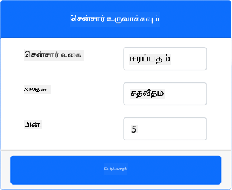
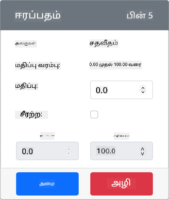
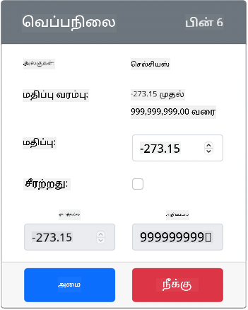

<!--
CO_OP_TRANSLATOR_METADATA:
{
  "original_hash": "70e5a428b607cd5a9a4f422c2a4df03d",
  "translation_date": "2025-10-11T12:32:43+00:00",
  "source_file": "2-farm/lessons/1-predict-plant-growth/virtual-device-temp.md",
  "language_code": "ta"
}
-->
# வெப்பநிலை அளிக்கவும் - மெய்நிகர் IoT சாதனம்

இந்த பாடத்தின் இந்த பகுதியில், உங்கள் மெய்நிகர் IoT சாதனத்தில் வெப்பநிலை சென்சரைச் சேர்க்கப் போகிறீர்கள்.

## மெய்நிகர் ஹார்ட்வேர்கள்

மெய்நிகர் IoT சாதனம் சிமுலேட்டட் Grove Digital Humidity மற்றும் Temperature சென்சரைப் பயன்படுத்தும். இது Raspberry Pi மற்றும் பிசிகல் Grove DHT11 சென்சரைப் பயன்படுத்துவதற்கான அனுபவத்தை ஒரே மாதிரியாக வைத்திருக்கிறது.

இந்த சென்சர் **வெப்பநிலை சென்சர்** மற்றும் **ஈரப்பதம் சென்சர்** ஆகியவற்றை இணைக்கிறது, ஆனால் இந்த லேபில் நீங்கள் வெப்பநிலை சென்சர் கூறு மட்டுமே ஆர்வமாக இருக்கிறீர்கள். ஒரு பிசிகல் IoT சாதனத்தில், வெப்பநிலை சென்சர் [தெர்மிஸ்டர்](https://wikipedia.org/wiki/Thermistor) ஆக இருக்கும், இது வெப்பநிலை மாற்றத்தின்போது எதிர்ப்பு மாற்றத்தை உணர்ந்து வெப்பநிலையை அளக்கும். வெப்பநிலை சென்சர்கள் பொதுவாக டிஜிட்டல் சென்சர்கள் ஆகும், அவை உள்ளே எதிர்ப்பை வெப்பநிலையாக (செல்சியஸ், கெல்வின் அல்லது பாரன்ஹீட்) மாற்றுகின்றன.

### CounterFit-க்கு சென்சர்களைச் சேர்க்கவும்

மெய்நிகர் ஈரப்பதம் மற்றும் வெப்பநிலை சென்சரைப் பயன்படுத்த, CounterFit பயன்பாட்டில் இரண்டு சென்சர்களையும் சேர்க்க வேண்டும்.

#### பணிகள் - CounterFit-க்கு சென்சர்களைச் சேர்க்கவும்

CounterFit பயன்பாட்டில் ஈரப்பதம் மற்றும் வெப்பநிலை சென்சர்களைச் சேர்க்கவும்.

1. உங்கள் கணினியில் `temperature-sensor` என்ற கோப்பகத்தில் ஒரு புதிய Python பயன்பாட்டை உருவாக்கி, `app.py` என்ற ஒரு கோப்புடன் Python மெய்நிகர் சூழலை உருவாக்கி, CounterFit pip தொகுப்புகளைச் சேர்க்கவும்.

    > ⚠️ [CounterFit Python திட்டத்தை உருவாக்குவதற்கும் அமைப்பதற்கும் பாடம் 1-இல் உள்ள வழிமுறைகளை](../../../1-getting-started/lessons/1-introduction-to-iot/virtual-device.md) தேவையானால் பார்க்கலாம்.

1. DHT11 சென்சருக்கான CounterFit ஷிமை நிறுவ ஒரு கூடுதல் Pip தொகுப்பை நிறுவவும். மெய்நிகர் சூழல் செயல்படுத்தப்பட்டுள்ள டெர்மினலில் இருந்து இதை நிறுவுவது உறுதிப்படுத்தவும்.

    ```sh
    pip install counterfit-shims-seeed-python-dht
    ```

1. CounterFit வலை பயன்பாடு இயங்குகிறதா என்பதை உறுதிப்படுத்தவும்.

1. ஒரு ஈரப்பதம் சென்சரை உருவாக்கவும்:

    1. *Sensors* பகுதியின் *Create sensor* பெட்டியில், *Sensor type* பெட்டியைத் திறந்து *Humidity* என்பதைத் தேர்ந்தெடுக்கவும்.

    1. *Units* ஐ *Percentage* ஆகவே விட்டு விடவும்.

    1. *Pin* ஐ *5* ஆக அமைத்திருக்க வேண்டும்.

    1. **Add** பொத்தானைத் தேர்ந்தெடுத்து Pin 5-ல் ஈரப்பதம் சென்சரை உருவாக்கவும்.

    

    ஈரப்பதம் சென்சர் உருவாக்கப்பட்டு சென்சர் பட்டியலில் தோன்றும்.

    

1. ஒரு வெப்பநிலை சென்சரை உருவாக்கவும்:

    1. *Sensors* பகுதியின் *Create sensor* பெட்டியில், *Sensor type* பெட்டியைத் திறந்து *Temperature* என்பதைத் தேர்ந்தெடுக்கவும்.

    1. *Units* ஐ *Celsius* ஆகவே விட்டு விடவும்.

    1. *Pin* ஐ *6* ஆக அமைத்திருக்க வேண்டும்.

    1. **Add** பொத்தானைத் தேர்ந்தெடுத்து Pin 6-ல் வெப்பநிலை சென்சரை உருவாக்கவும்.

    

    வெப்பநிலை சென்சர் உருவாக்கப்பட்டு சென்சர் பட்டியலில் தோன்றும்.

    

## வெப்பநிலை சென்சர் பயன்பாட்டை நிரலாக்கவும்

இப்போது CounterFit சென்சர்களைப் பயன்படுத்தி வெப்பநிலை சென்சர் பயன்பாட்டை நிரலாக்கலாம்.

### பணிகள் - வெப்பநிலை சென்சர் பயன்பாட்டை நிரலாக்கவும்

வெப்பநிலை சென்சர் பயன்பாட்டை நிரலாக்கவும்.

1. `temperature-sensor` பயன்பாடு VS Code-இல் திறக்கப்பட்டுள்ளதா என்பதை உறுதிப்படுத்தவும்.

1. `app.py` கோப்பைத் திறக்கவும்.

1. CounterFit-க்கு பயன்பாட்டை இணைக்க `app.py` கோப்பின் மேல் பக்கத்தில் பின்வரும் குறியீட்டைச் சேர்க்கவும்:

    ```python
    from counterfit_connection import CounterFitConnection
    CounterFitConnection.init('127.0.0.1', 5000)
    ```

1. தேவையான நூலகங்களை இறக்குமதி செய்ய `app.py` கோப்பில் பின்வரும் குறியீட்டைச் சேர்க்கவும்:

    ```python
    import time
    from counterfit_shims_seeed_python_dht import DHT
    ```

    `from seeed_dht import DHT` என்ற அறிக்கையால் `counterfit_shims_seeed_python_dht` தொகுப்பில் உள்ள ஷிமைப் பயன்படுத்தி மெய்நிகர் Grove வெப்பநிலை சென்சருடன் தொடர்பு கொள்ள `DHT` சென்சர் வகுப்பை இறக்குமதி செய்கிறது.

1. மேலே உள்ள குறியீட்டிற்குப் பிறகு, மெய்நிகர் ஈரப்பதம் மற்றும் வெப்பநிலை சென்சரை நிர்வகிக்கும் வகுப்பின் ஒரு உதாரணத்தை உருவாக்க பின்வரும் குறியீட்டைச் சேர்க்கவும்:

    ```python
    sensor = DHT("11", 5)
    ```

    இது மெய்நிகர் **D**igital **H**umidity மற்றும் **T**emperature சென்சரை நிர்வகிக்கும் `DHT` வகுப்பின் ஒரு உதாரணத்தை அறிவிக்கிறது. முதல் அளவுரு பயன்படுத்தப்படும் சென்சர் ஒரு மெய்நிகர் *DHT11* சென்சர் என்பதை குறிக்கிறது. இரண்டாவது அளவுரு சென்சர் `5` போர்ட்டில் இணைக்கப்பட்டிருப்பதை குறிக்கிறது.

    > 💁 CounterFit இந்த இணைந்த ஈரப்பதம் மற்றும் வெப்பநிலை சென்சரை 2 சென்சர்களுடன் இணைப்பதன் மூலம் சிமுலேட் செய்கிறது, `DHT` வகுப்பு உருவாக்கப்படும் போது கொடுக்கப்பட்ட பினில் ஒரு ஈரப்பதம் சென்சர் மற்றும் அடுத்த பினில் இயங்கும் வெப்பநிலை சென்சர். ஈரப்பதம் சென்சர் பின் 5-ல் இருந்தால், ஷிம் வெப்பநிலை சென்சரை பின் 6-ல் எதிர்பார்க்கிறது.

1. வெப்பநிலை சென்சர் மதிப்பை முறைப்போக்கி மற்றும் அதை கன்சோலில் அச்சிட ஒரு முடிவில்லாத லூப்பை மேலே உள்ள குறியீட்டிற்குப் பிறகு சேர்க்கவும்:

    ```python
    while True:
        _, temp = sensor.read()
        print(f'Temperature {temp}°C')
    ```

    `sensor.read()` க்கு அழைப்பு ஈரப்பதம் மற்றும் வெப்பநிலையின் ஒரு டியூப்பிளை திருப்புகிறது. நீங்கள் வெப்பநிலை மதிப்பை மட்டுமே தேவைப்படுகிறீர்கள், எனவே ஈரப்பதம் புறக்கணிக்கப்படுகிறது. வெப்பநிலை மதிப்பு கன்சோலில் அச்சிடப்படுகிறது.

1. சாதனத்தின் மின்சார நுகர்வை குறைக்க, லூப்பின் இறுதியில் பத்து விநாடிகளுக்கான சிறிய தூக்கத்தைச் சேர்க்கவும், ஏனெனில் வெப்பநிலை நிலைகளை தொடர்ந்து சரிபார்க்க தேவையில்லை.

    ```python
    time.sleep(10)
    ```

1. VS Code டெர்மினலில் மெய்நிகர் சூழல் செயல்படுத்தப்பட்ட நிலையில், Python பயன்பாட்டை இயக்க பின்வரும் கட்டளையை இயக்கவும்:

    ```sh
    python app.py
    ```

1. CounterFit பயன்பாட்டில், பயன்பாட்டால் வாசிக்கப்படும் வெப்பநிலை சென்சரின் மதிப்பை மாற்றவும். இதை இரண்டு வழிகளில் செய்யலாம்:

    * வெப்பநிலை சென்சருக்கான *Value* பெட்டியில் ஒரு எண்ணை உள்ளிடவும், பின்னர் **Set** பொத்தானைத் தேர்ந்தெடுக்கவும். நீங்கள் உள்ளிடும் எண் சென்சரால் திருப்பப்படும் மதிப்பாக இருக்கும்.

    * *Random* செக்பாக்ஸைச் சரிபார்க்கவும், *Min* மற்றும் *Max* மதிப்புகளை உள்ளிடவும், பின்னர் **Set** பொத்தானைத் தேர்ந்தெடுக்கவும். ஒவ்வொரு முறையும் சென்சர் ஒரு மதிப்பை வாசிக்கும்போது, ​​அது *Min* மற்றும் *Max* இடையிலான ஒரு சீரற்ற எண்ணை வாசிக்கும்.

    நீங்கள் அமைக்கும் மதிப்புகள் கன்சோலில் தோன்றும். *Value* அல்லது *Random* அமைப்புகளை மாற்றி மதிப்பு மாற்றத்தைப் பார்க்கவும்.

    ```output
    (.venv) ➜  temperature-sensor python app.py
    Temperature 28.25°C
    Temperature 30.71°C
    Temperature 25.17°C
    ```

> 💁 இந்த குறியீட்டை [code-temperature/virtual-device](../../../../../2-farm/lessons/1-predict-plant-growth/code-temperature/virtual-device) கோப்பகத்தில் காணலாம்.

😀 உங்கள் வெப்பநிலை சென்சர் நிரல் வெற்றிகரமாக முடிந்தது!

---

**குறிப்பு**:  
இந்த ஆவணம் [Co-op Translator](https://github.com/Azure/co-op-translator) என்ற AI மொழிபெயர்ப்பு சேவையைப் பயன்படுத்தி மொழிபெயர்க்கப்பட்டுள்ளது. நாங்கள் துல்லியத்திற்காக முயற்சிக்கிறோம், ஆனால் தானியக்க மொழிபெயர்ப்புகளில் பிழைகள் அல்லது தவறான தகவல்கள் இருக்கக்கூடும் என்பதை தயவுசெய்து கவனத்தில் கொள்ளுங்கள். அதன் தாய்மொழியில் உள்ள மூல ஆவணம் அதிகாரப்பூர்வ ஆதாரமாக கருதப்பட வேண்டும். முக்கியமான தகவல்களுக்கு, தொழில்முறை மனித மொழிபெயர்ப்பு பரிந்துரைக்கப்படுகிறது. இந்த மொழிபெயர்ப்பைப் பயன்படுத்துவதால் ஏற்படும் எந்த தவறான புரிதல்கள் அல்லது தவறான விளக்கங்களுக்கு நாங்கள் பொறுப்பல்ல.