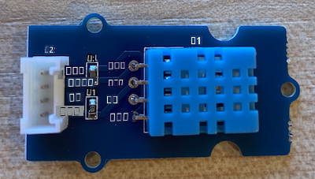

<!--
CO_OP_TRANSLATOR_METADATA:
{
  "original_hash": "59263d094f20b302053888cd236880c3",
  "translation_date": "2025-10-11T12:34:36+00:00",
  "source_file": "2-farm/lessons/1-predict-plant-growth/wio-terminal-temp.md",
  "language_code": "ta"
}
-->
# வெப்பநிலை அளிக்கவும் - Wio Terminal

இந்த பாடத்தின் இந்த பகுதியில், நீங்கள் உங்கள் Wio Terminal-க்கு ஒரு வெப்பநிலை சென்சரை சேர்த்து, அதிலிருந்து வெப்பநிலை மதிப்புகளைப் படிக்கப் போகிறீர்கள்.

## ஹார்ட்வேர்கள்

Wio Terminal-க்கு ஒரு வெப்பநிலை சென்சர் தேவை.

நீங்கள் பயன்படுத்தப் போகும் சென்சர் [DHT11 ஈரப்பதம் மற்றும் வெப்பநிலை சென்சர்](https://www.seeedstudio.com/Grove-Temperature-Humidity-Sensor-DHT11.html) ஆகும், இது இரண்டு சென்சர்களை ஒரே தொகுப்பில் இணைக்கிறது. இது மிகவும் பிரபலமானது, வெப்பநிலை, ஈரப்பதம் மற்றும் சில சமயங்களில் வளிமண்டல அழுத்தத்தை இணைக்கும் பல வணிக சென்சர்கள் உள்ளன. வெப்பநிலை சென்சர் கூறு ஒரு negative temperature coefficient (NTC) thermistor ஆகும், இது வெப்பநிலை அதிகரிக்கும்போது எதிர்ப்பு குறையும் ஒரு thermistor ஆகும்.

இது ஒரு டிஜிட்டல் சென்சர், எனவே இது ஒரு டிஜிட்டல் சிக்னலை உருவாக்க ADC-ஐ கொண்டுள்ளது, இது வெப்பநிலை மற்றும் ஈரப்பதம் தரவுகளை மைக்ரோகண்ட்ரோலர் படிக்க உதவுகிறது.

### வெப்பநிலை சென்சரை இணைக்கவும்

Grove வெப்பநிலை சென்சரை Wio Terminal-இன் டிஜிட்டல் போர்ட்டுடன் இணைக்கலாம்.

#### பணிகள் - வெப்பநிலை சென்சரை இணைக்கவும்

வெப்பநிலை சென்சரை இணைக்கவும்.



1. Grove கேபிளின் ஒரு முனையை ஈரப்பதம் மற்றும் வெப்பநிலை சென்சரின் சாக்கெட்டில் செருகவும். இது ஒரு வழியில் மட்டுமே செல்லும்.

1. உங்கள் Wio Terminal-ஐ உங்கள் கணினி அல்லது பிற மின்சப்ளையிலிருந்து துண்டித்த பிறகு, Grove கேபிளின் மற்ற முனையை Wio Terminal-இன் திரையைப் பார்க்கும் போது வலது பக்க Grove சாக்கெட்டில் இணைக்கவும். இது மின்சார பொத்தானிலிருந்து மிகத் தொலைவில் உள்ள சாக்கெட்.


## வெப்பநிலை சென்சரை நிரலாக்கவும்

இப்போது Wio Terminal-ஐ இணைக்கப்பட்ட வெப்பநிலை சென்சரைப் பயன்படுத்த நிரலாக்கலாம்.

### பணிகள் - வெப்பநிலை சென்சரை நிரலாக்கவும்

சாதனத்தை நிரலாக்கவும்.

1. PlatformIO-ஐப் பயன்படுத்தி புதிய Wio Terminal திட்டத்தை உருவாக்கவும். இந்த திட்டத்தை `temperature-sensor` என்று அழைக்கவும். `setup` செயல்பாட்டில் சீரியல் போர்ட்டை அமைக்க குறியீட்டைச் சேர்க்கவும்.

    > ⚠️ [திட்டம் 1, பாடம் 1-இல் PlatformIO திட்டத்தை உருவாக்குவதற்கான வழிமுறைகளைத் தேவைப்பட்டால் பார்க்கலாம்](../../../1-getting-started/lessons/1-introduction-to-iot/wio-terminal.md#create-a-platformio-project).

1. Seeed Grove Humidity மற்றும் Temperature சென்சர் நூலகத்திற்கான நூலக சார்பை திட்டத்தின் `platformio.ini` கோப்பில் சேர்க்கவும்:

    ```ini
    lib_deps =
        seeed-studio/Grove Temperature And Humidity Sensor @ 1.0.1
    ```

    > ⚠️ [திட்டம் 1, பாடம் 4-இல் PlatformIO திட்டத்திற்கு நூலகங்களைச் சேர்ப்பதற்கான வழிமுறைகளைத் தேவைப்பட்டால் பார்க்கலாம்](../../../1-getting-started/lessons/4-connect-internet/wio-terminal-mqtt.md#install-the-wifi-and-mqtt-arduino-libraries).

1. `#include <Arduino.h>`-க்கு கீழே, கோப்பின் மேல் பக்கத்தில் பின்வரும் `#include` இயக்கங்களைச் சேர்க்கவும்:

    ```cpp
    #include <DHT.h>
    #include <SPI.h>
    ```

    இது சென்சருடன் தொடர்பு கொள்ள தேவையான கோப்புகளை இறக்குமதி செய்கிறது. `DHT.h` தலைப்பு கோப்பு சென்சருக்கான குறியீட்டை கொண்டுள்ளது, மேலும் `SPI.h` தலைப்பைச் சேர்ப்பது பயன்பாடு தொகுக்கப்படும் போது சென்சருடன் பேச தேவையான குறியீடு இணைக்கப்படுவதை உறுதிசெய்கிறது.

1. `setup` செயல்பாட்டுக்கு முன், DHT சென்சரை அறிவிக்கவும்:

    ```cpp
    DHT dht(D0, DHT11);
    ```

    இது **D**igital **H**umidity மற்றும் **T**emperature சென்சரை நிர்வகிக்கும் `DHT` வகுப்பின் ஒரு உதாரணத்தை அறிவிக்கிறது. இது Wio Terminal-இன் வலது பக்க Grove சாக்கெட்டில் `D0` போர்ட்டுடன் இணைக்கப்பட்டுள்ளது. இரண்டாவது அளவுரு பயன்படுத்தப்படும் சென்சர் *DHT11* சென்சர் என்பதை குறியிடுகிறது - நீங்கள் பயன்படுத்தும் நூலகம் இந்த சென்சரின் பிற மாறுபாடுகளை ஆதரிக்கிறது.

1. `setup` செயல்பாட்டில், சீரியல் இணைப்பை அமைக்க குறியீட்டைச் சேர்க்கவும்:

    ```cpp
    void setup()
    {
        Serial.begin(9600);
    
        while (!Serial)
            ; // Wait for Serial to be ready
    
        delay(1000);
    }
    ```

1. கடைசி `delay`-க்கு பிறகு, `setup` செயல்பாட்டின் முடிவில் DHT சென்சரை தொடங்க ஒரு அழைப்பைச் சேர்க்கவும்:

    ```cpp
    dht.begin();
    ```

1. `loop` செயல்பாட்டில், சென்சரை அழைக்கவும் மற்றும் வெப்பநிலையை சீரியல் போர்ட்டில் அச்சிடவும் குறியீட்டைச் சேர்க்கவும்:

    ```cpp
    void loop()
    {
        float temp_hum_val[2] = {0};
        dht.readTempAndHumidity(temp_hum_val);
        Serial.print("Temperature: ");
        Serial.print(temp_hum_val[1]);
        Serial.println ("°C");
    
        delay(10000);
    }
    ```

    இந்த குறியீடு 2 floats கொண்ட ஒரு காலியான வரிசையை அறிவிக்கிறது, மேலும் இதை `DHT` உதாரணத்தில் `readTempAndHumidity` அழைப்புக்கு அனுப்புகிறது. இந்த அழைப்பு வரிசையை 2 மதிப்புகளுடன் நிரப்புகிறது - ஈரப்பதம் வரிசையின் 0வது உருப்படியில் செல்கிறது (C++ வரிசைகள் 0-ஆதாரமாக இருப்பதால், 0வது உருப்படி வரிசையின் 'முதல்' உருப்படி), மற்றும் வெப்பநிலை 1வது உருப்படியில் செல்கிறது.

    வெப்பநிலை வரிசையின் 1வது உருப்படியில் இருந்து படிக்கப்படுகிறது மற்றும் சீரியல் போர்ட்டில் அச்சிடப்படுகிறது.

    > 🇺🇸 வெப்பநிலை செல்சியஸில் படிக்கப்படுகிறது. அமெரிக்கர்களுக்கு, இதை ஃபாரன்ஹீட்டாக மாற்ற, படிக்கப்படும் செல்சியஸ் மதிப்பை 5-ஆல் வகுக்கவும், பின்னர் 9-ஆல் பெருக்கவும், பின்னர் 32 சேர்க்கவும். உதாரணமாக, 20°C வெப்பநிலை ((20/5)*9) + 32 = 68°F ஆக மாறுகிறது.

1. குறியீட்டை Wio Terminal-க்கு கட்டமைக்கவும் மற்றும் பதிவேற்றவும்.

    > ⚠️ [திட்டம் 1, பாடம் 1-இல் PlatformIO திட்டத்தை உருவாக்குவதற்கான வழிமுறைகளைத் தேவைப்பட்டால் பார்க்கலாம்](../../../1-getting-started/lessons/1-introduction-to-iot/wio-terminal.md#write-the-hello-world-app).

1. பதிவேற்றப்பட்ட பிறகு, சீரியல் மானிட்டரைப் பயன்படுத்தி வெப்பநிலையை கண்காணிக்கலாம்:

    ```output
    > Executing task: platformio device monitor <
    
    --- Available filters and text transformations: colorize, debug, default, direct, hexlify, log2file, nocontrol, printable, send_on_enter, time
    --- More details at http://bit.ly/pio-monitor-filters
    --- Miniterm on /dev/cu.usbmodem1201  9600,8,N,1 ---
    --- Quit: Ctrl+C | Menu: Ctrl+T | Help: Ctrl+T followed by Ctrl+H ---
    Temperature: 25.00°C
    Temperature: 25.00°C
    Temperature: 25.00°C
    Temperature: 24.00°C
    ```

> 💁 இந்த குறியீட்டை [code-temperature/wio-terminal](../../../../../2-farm/lessons/1-predict-plant-growth/code-temperature/wio-terminal) கோப்பகத்தில் காணலாம்.

😀 உங்கள் வெப்பநிலை சென்சர் நிரல் வெற்றிகரமாக முடிந்தது!

---

**அறிவிப்பு**:  
இந்த ஆவணம் [Co-op Translator](https://github.com/Azure/co-op-translator) என்ற AI மொழிபெயர்ப்பு சேவையை பயன்படுத்தி மொழிபெயர்க்கப்பட்டுள்ளது. நாங்கள் துல்லியத்திற்காக முயற்சிக்கிறோம், ஆனால் தானியங்கி மொழிபெயர்ப்புகளில் பிழைகள் அல்லது தவறுகள் இருக்கக்கூடும் என்பதை தயவுசெய்து கவனத்தில் கொள்ளவும். அதன் சொந்த மொழியில் உள்ள மூல ஆவணம் அதிகாரப்பூர்வ ஆதாரமாக கருதப்பட வேண்டும். முக்கியமான தகவல்களுக்கு, தொழில்முறை மனித மொழிபெயர்ப்பு பரிந்துரைக்கப்படுகிறது. இந்த மொழிபெயர்ப்பைப் பயன்படுத்துவதால் ஏற்படும் எந்த தவறான புரிதல்களுக்கும் அல்லது தவறான விளக்கங்களுக்கும் நாங்கள் பொறுப்பல்ல.