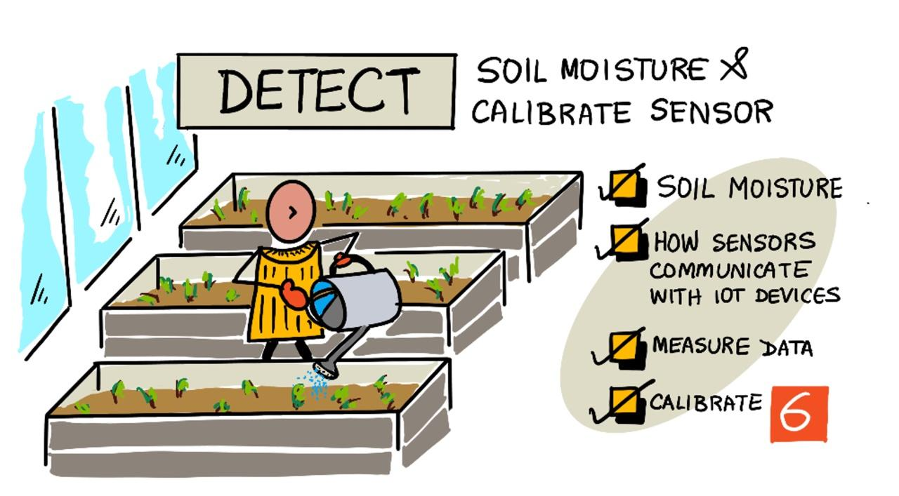
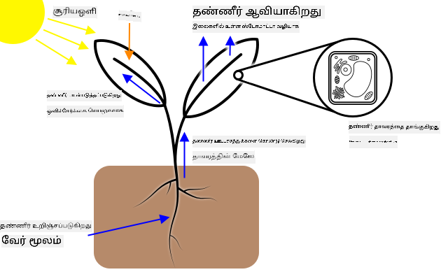
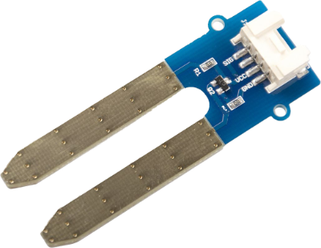
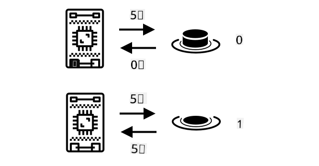
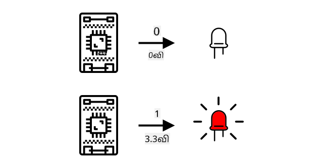
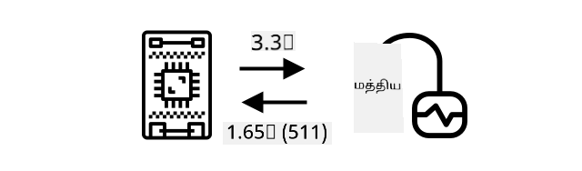
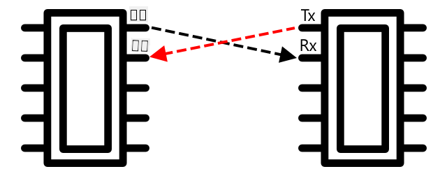
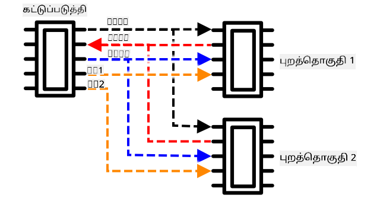
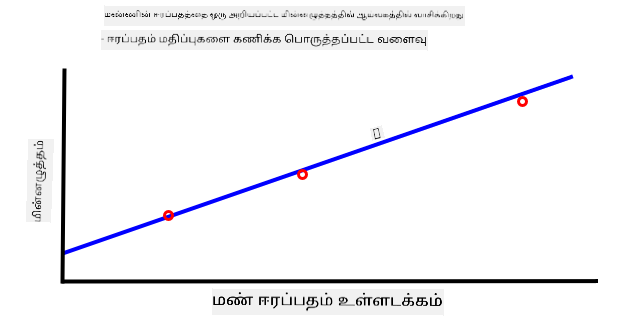
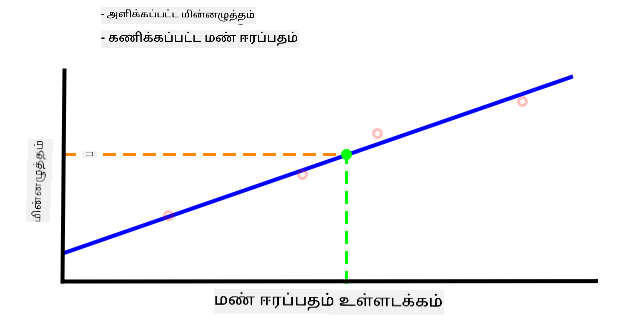

<!--
CO_OP_TRANSLATOR_METADATA:
{
  "original_hash": "4fb20273d299dc8d07a8f06c9cd0cdd9",
  "translation_date": "2025-10-11T12:25:52+00:00",
  "source_file": "2-farm/lessons/2-detect-soil-moisture/README.md",
  "language_code": "ta"
}
-->
# மண் ஈரப்பதத்தை கண்டறிதல்

> ஸ்கெட்ச் நோட்: [நித்யா நரசிம்மன்](https://github.com/nitya). படத்தை கிளிக் செய்து பெரிய பதிப்பைப் பாருங்கள்.

இந்த பாடம் [IoT for Beginners Project 2 - Digital Agriculture series](https://youtube.com/playlist?list=PLmsFUfdnGr3yCutmcVg6eAUEfsGiFXgcx) மற்றும் [Microsoft Reactor](https://developer.microsoft.com/reactor/?WT.mc_id=academic-17441-jabenn) மூலம் கற்பிக்கப்பட்டது.

## பாடத்திற்கு முன் கேள்வி

[பாடத்திற்கு முன் கேள்வி](https://black-meadow-040d15503.1.azurestaticapps.net/quiz/11)

## அறிமுகம்

கடந்த பாடத்தில், சுற்றுச்சூழல் பண்புகளை அளந்து தாவர வளர்ச்சியை கணிக்க எப்படி பயன்படுத்துவது என்பதைப் பார்த்தோம். வெப்பநிலையை கட்டுப்படுத்த முடியும், ஆனால் இது செலவானது, கட்டுப்படுத்தப்பட்ட சூழல்களை தேவைப்படுத்துகிறது. தாவரங்களுக்கு எளிதாக கட்டுப்படுத்தக்கூடிய சுற்றுச்சூழல் பண்புகளில் எளிதானது தண்ணீர் - இது பெரிய அளவிலான பாசன அமைப்புகளிலிருந்து சிறிய குழந்தைகள் தங்கள் தோட்டங்களை தண்ணீர் ஊற்றுவதற்கான வரை தினசரி கட்டுப்படுத்தப்படுகிறது.

இந்த பாடத்தில், மண் ஈரப்பதத்தை அளவிடுவது பற்றி நீங்கள் கற்றுக்கொள்வீர்கள், மேலும் அடுத்த பாடத்தில் தானியங்கி நீர்ப்பாசன அமைப்பை எப்படி கட்டுப்படுத்துவது என்பதை கற்றுக்கொள்வீர்கள். இந்த பாடம் மூன்றாவது சென்சாரை அறிமுகப்படுத்துகிறது; நீங்கள் ஏற்கனவே ஒளி சென்சார் மற்றும் வெப்பநிலை சென்சாரை பயன்படுத்தியுள்ளீர்கள். எனவே, இந்த பாடத்தில் சென்சார்கள் மற்றும் செயல்படுத்துபவர்கள் IoT சாதனங்களுடன் எப்படி தொடர்பு கொள்ளுகின்றன என்பதைப் பற்றி மேலும் அறிந்து கொள்ளவும், மண் ஈரப்பதம் சென்சார் IoT சாதனத்திற்கு தரவை அனுப்புவது எப்படி என்பதைப் பற்றி அறியவும்.

இந்த பாடத்தில் நாம் கற்றுக்கொள்ளப்போகிறோம்:

* [மண் ஈரப்பதம்](../../../../../2-farm/lessons/2-detect-soil-moisture)
* [சென்சார்கள் IoT சாதனங்களுடன் எப்படி தொடர்பு கொள்ளுகின்றன](../../../../../2-farm/lessons/2-detect-soil-moisture)
* [மண்ணில் ஈரப்பதம் அளவுகளை அளவிடுதல்](../../../../../2-farm/lessons/2-detect-soil-moisture)
* [சென்சார் காலிப்ரேஷன்](../../../../../2-farm/lessons/2-detect-soil-moisture)

## மண் ஈரப்பதம்

தாவரங்கள் வளர தண்ணீர் தேவை. தாவரத்தின் முழு உடலிலும் தண்ணீரை உறிஞ்சுகின்றன, பெரும்பாலானவை வேர்வழியாக உறிஞ்சுகின்றன. தாவரங்கள் மூன்று முக்கிய காரணங்களுக்காக தண்ணீரைப் பயன்படுத்துகின்றன:

* [ஒளிச்சேர்க்கை](https://wikipedia.org/wiki/Photosynthesis) - தாவரங்கள் தண்ணீர், கார்பன் டைஆக்சைடு மற்றும் ஒளியுடன் இரசாயன மாற்றத்தை உருவாக்கி கார்போஹைட்ரேட்கள் மற்றும் ஆக்சிஜனை உருவாக்குகின்றன.
* [வியர்வை](https://wikipedia.org/wiki/Transpiration) - தாவரங்கள் தண்ணீரை காற்றிலிருந்து தாவரத்திற்குள் கார்பன் டைஆக்சைடு பரவுவதற்காக பயன்படுத்துகின்றன. இந்த செயல்முறை தாவரத்தின் சுற்றிலும் ஊட்டச்சத்துக்களை எடுத்துச் செல்கிறது மற்றும் தாவரத்தை குளிர்ச்சியாக வைத்திருக்கிறது, மனிதர்கள் வியர்வை சிந்துவது போல.
* அமைப்பு - தாவரங்கள் தங்கள் அமைப்பை பராமரிக்க தண்ணீர் தேவைப்படுகிறது - அவை 90% தண்ணீரைக் கொண்டுள்ளன (மனிதர்கள் 60% மட்டுமே), மேலும் இந்த தண்ணீர் செல்களை உறுதியாக வைத்திருக்கிறது. தாவரத்திற்கு போதுமான தண்ணீர் இல்லையென்றால், அது வாடி இறந்து விடும்.

✅ ஆராய்ச்சி செய்யுங்கள்: வியர்வை மூலம் எவ்வளவு தண்ணீர் இழக்கப்படுகிறது?

வேர்கள் தாவர வளர்ச்சிக்கு தேவையான தண்ணீரை தாவரங்கள் வளரும் மண்ணில் உள்ள ஈரத்திலிருந்து பெறுகின்றன. மண்ணில் தண்ணீர் குறைவாக இருந்தால், தாவரங்கள் வளர போதுமான அளவு தண்ணீரை உறிஞ்ச முடியாது; மண்ணில் தண்ணீர் அதிகமாக இருந்தால், வேர்கள் செயல்பட தேவையான ஆக்சிஜனை உறிஞ்ச முடியாது. இது வேர்கள் இறப்பதற்கு வழிவகுக்கும், மேலும் தாவரங்கள் வாழ்வதற்கு தேவையான ஊட்டச்சத்துக்களை பெற முடியாது.

விவசாயி சிறந்த தாவர வளர்ச்சியைப் பெற, மண் மிக ஈரமாகவும், மிக வறண்டதாகவும் இருக்கக்கூடாது. IoT சாதனங்கள் மண் ஈரப்பதத்தை அளவிட்டு, விவசாயி தேவையான போது மட்டுமே தண்ணீர் ஊற்ற உதவ முடியும்.

### மண் ஈரப்பதத்தை அளவிடும் வழிகள்

மண் ஈரப்பதத்தை அளவிட பல்வேறு வகையான சென்சார்கள் உள்ளன:

* ரெசிஸ்டிவ் - ரெசிஸ்டிவ் சென்சாரில் மண்ணில் இரண்டு சோதனைகள் செலுத்தப்படும். ஒரு சோதனையில் மின்சாரம் அனுப்பப்பட்டு, மற்றொன்றில் பெறப்படும். சென்சார் மண்ணின் எதிர்ப்பை அளவிடுகிறது - இரண்டாவது சோதனையில் மின்சாரம் எவ்வளவு குறைகிறது என்பதை அளவிடுகிறது. தண்ணீர் மின்சாரத்தை நன்றாக கடத்தும், எனவே மண்ணின் தண்ணீர் உள்ளடக்கம் அதிகமாக இருந்தால், எதிர்ப்பு குறைவாக இருக்கும்.

    

    > 💁 இரண்டு மின்சார உலோக துண்டுகளை (உதாரணமாக ஆணிகள்) பயன்படுத்தி, அவற்றை சில செ.மீ. இடைவெளியில் பிரித்து, மின்சார அளவீட்டியைப் பயன்படுத்தி எதிர்ப்பை அளவிட்டு, ஒரு ரெசிஸ்டிவ் மண் ஈரப்பதம் சென்சாரை உருவாக்கலாம்.

* கேபாசிடிவ் - கேபாசிடிவ் ஈரத்தன்மை சென்சார் மின்னழுத்தத்தை அளவிடும். மண்ணின் ஈரத்தன்மை அளவுக்கு ஏற்ப மின்னழுத்தம் மாறும், இது IoT சாதனத்தால் அளவிடப்படும் மின்னழுத்தமாக மாற்றப்படும். மண் ஈரமாக இருக்கும் போது, வெளியே வரும் மின்னழுத்தம் குறைவாக இருக்கும்.

    

இவை இரண்டும் அனலாக் சென்சார்கள், மண்ணின் ஈரத்தன்மையை குறிக்க மின்னழுத்தத்தை திருப்பி அனுப்புகின்றன. இந்த மின்னழுத்தம் உங்கள் குறியீட்டிற்கு எப்படி செல்கிறது என்பதைப் பார்ப்பதற்கு முன், சென்சார்கள் மற்றும் செயல்படுத்துபவர்கள் IoT சாதனங்களுடன் எப்படி தொடர்பு கொள்ளுகின்றன என்பதைப் பார்ப்போம்.

## சென்சார்கள் IoT சாதனங்களுடன் எப்படி தொடர்பு கொள்ளுகின்றன

இந்த பாடங்களில் இதுவரை நீங்கள் பல சென்சார்கள் மற்றும் செயல்படுத்துபவர்களைப் பற்றி கற்றுக்கொண்டுள்ளீர்கள், மேலும் நீங்கள் இயந்திர உபகரண ஆய்வுகளைச் செய்திருந்தால், இவை உங்கள் IoT டெவலப்பர் கிட் உடன் தொடர்பு கொண்டுள்ளன. ஆனால் இந்த தொடர்பு எப்படி வேலை செய்கிறது? மண் ஈரப்பதம் சென்சாரிலிருந்து எதிர்ப்பு அளவீடு உங்கள் குறியீட்டில் பயன்படுத்தக்கூடிய எண்ணாக எப்படி மாறுகிறது?

பெரும்பாலான சென்சார்கள் மற்றும் செயல்படுத்துபவர்களுடன் தொடர்பு கொள்ள, உங்களுக்கு சில உபகரணங்கள் மற்றும் தொடர்பு நெறிமுறைகள் தேவைப்படும் - தரவை அனுப்பவும் பெறவும் நன்கு வரையறுக்கப்பட்ட வழி. உதாரணமாக, ஒரு கேபாசிடிவ் மண் ஈரப்பதம் சென்சாரை எடுத்துக்கொள்ளுங்கள்:

* இந்த சென்சார் IoT சாதனத்துடன் எப்படி இணைக்கப்படுகிறது?
* இது அனலாக் சிக்னலாக மின்னழுத்தத்தை அளவிடுமானால், இது ஒரு ADC தேவைப்படும், மேலும் இந்த மதிப்பு மாறும் மின்னழுத்தமாக 0கள் மற்றும் 1கள் அனுப்பப்படும் - ஆனால் ஒவ்வொரு பிட்டும் எவ்வளவு நேரம் அனுப்பப்படுகிறது?
* சென்சார் ஒரு டிஜிட்டல் மதிப்பை திருப்பினால், அது 0கள் மற்றும் 1களின் ஓர் ஓட்டமாக இருக்கும், மீண்டும் ஒவ்வொரு பிட்டும் எவ்வளவு நேரம் அனுப்பப்படுகிறது?
* மின்னழுத்தம் 0.1 வினாடிக்கு அதிகமாக இருந்தால், அது ஒரு 1 பிட்டா, அல்லது 2 தொடர்ச்சியான 1 பிட்டுகளா, அல்லது 10 ஆக இருக்குமா?
* எண் எப்போது தொடங்குகிறது? `00001101` 25 ஆகும், அல்லது முதல் 5 பிட்டுகள் முந்தைய மதிப்பின் முடிவா?

உபகரணங்கள் தரவை அனுப்புவதற்கும் பெறுவதற்கும் உட்பட்ட முறையில் சரியாக அனுப்பப்படுவதற்கும், பெறப்படுவதற்கும் உறுதிசெய்யும் தொடர்பு நெறிமுறைகளை வழங்குகின்றன.

### பொதுப் பயன்பாட்டு உள்ளீடு வெளியீடு (GPIO) முள்

GPIO என்பது உங்கள் IoT சாதனத்துடன் உபகரணங்களை இணைக்க பயன்படுத்தக்கூடிய முள் தொகுப்பாகும், மேலும் Raspberry Pi அல்லது Wio Terminal போன்ற IoT டெவலப்பர் கிட்களில் பொதுவாக கிடைக்கின்றன. இந்த பிரிவில் உள்ள பல்வேறு தொடர்பு நெறிமுறைகளை நீங்கள் GPIO முள் வழியாக பயன்படுத்தலாம். சில GPIO முள் மின்னழுத்தத்தை வழங்குகின்றன, பொதுவாக 3.3V அல்லது 5V, சில முள் தரை முள் ஆகும், மற்றவை மின்னழுத்தத்தை அனுப்ப (வெளியீடு) அல்லது பெற (உள்ளீடு) நிரலாக்கமாக அமைக்கப்படலாம்.

> 💁 மின்சார சுற்று நீங்கள் பயன்படுத்தும் சுற்று வழியாக மின்னழுத்தத்தை தரைக்கு இணைக்க வேண்டும். மின்னழுத்தத்தை நீங்கள் பேட்டரியின் நேர்ம (+ve) முனையமாகவும், தரையை எதிர்ம (-ve) முனையமாகவும் நினைக்கலாம்.

GPIO முள் சில டிஜிட்டல் சென்சார்கள் மற்றும் செயல்படுத்துபவர்களுடன் நேரடியாக பயன்படுத்தலாம், நீங்கள் on அல்லது off மதிப்புகளை மட்டுமே கவலைப்படும்போது - on என்பது உயர், off என்பது குறைவு என்று குறிப்பிடப்படுகிறது. சில உதாரணங்கள்:

* பொத்தான். நீங்கள் ஒரு 5V முள் மற்றும் ஒரு உள்ளீடு முள் இடையே ஒரு பொத்தானை இணைக்கலாம். நீங்கள் பொத்தானை அழுத்தும்போது, அது 5V முள் மற்றும் உள்ளீடு முள் வழியாக ஒரு சுற்றை முடிக்கிறது. குறியீட்டிலிருந்து, நீங்கள் உள்ளீடு முளில் மின்னழுத்தத்தைப் படிக்கலாம், மேலும் அது உயர் (5V) என்றால், பொத்தான் அழுத்தப்பட்டுள்ளது, அது குறைவு (0v) என்றால், பொத்தான் அழுத்தப்படவில்லை. உண்மையான மின்னழுத்தம் படிக்கப்படாது, மாறாக, மின்னழுத்தம் ஒரு வரம்புக்கு மேல் அல்லது இல்லை என்பதைப் பொறுத்து 1 அல்லது 0 டிஜிட்டல் சிக்னலாக கிடைக்கும்.

    

* LED. நீங்கள் ஒரு LED ஐ ஒரு வெளியீடு முள் மற்றும் ஒரு தரை முள் இடையே இணைக்கலாம் (ஒரு ரெசிஸ்டர் பயன்படுத்த வேண்டும், இல்லையெனில் LED எரிந்து விடும்). குறியீட்டிலிருந்து, நீங்கள் வெளியீடு முளை உயர் என்று அமைக்கலாம், மேலும் இது 3.3V அனுப்பும், 3.3V முள், LED வழியாக, தரை முள் வரை ஒரு சுற்றை உருவாக்கும். இது LED ஐ ஒளிரச் செய்யும்.

    

மேம்பட்ட சென்சார்கள் மற்றும் செயல்படுத்துபவர்களுக்காக, நீங்கள் GPIO முள் வழியாக டிஜிட்டல் தரவை நேரடியாக அனுப்ப மற்றும் பெற பயன்படுத்தலாம், அல்லது ADCs மற்றும் DACs கொண்ட கட்டுப்பாட்டுச் சாளரங்கள் வழியாக அனலாக் சென்சார்கள் மற்றும் செயல்படுத்துபவர்களுடன் பேசலாம்.

> 💁 நீங்கள் Raspberry Pi ஐ இந்த ஆய்வுகளுக்கு பயன்படுத்தினால், Grove Base Hat அனலாக் சென்சார் சிக்னல்களை டிஜிட்டலாக மாற்றுவதற்கான உபகரணங்களை கொண்டுள்ளது, இது GPIO வழியாக அனுப்புகிறது.

✅ உங்கள் IoT சாதனத்தில் GPIO முள் இருந்தால், இந்த முள்களை கண்டறிந்து, எந்த முள் மின்னழுத்தம், தரை அல்லது நிரலாக்கத்திற்கானது என்பதை காட்டும் வரைபடத்தை கண்டறியவும்.

### அனலாக் முள்

Arduino சாதனங்கள் போன்ற சில சாதனங்கள் அனலாக் முள்களை வழங்குகின்றன. இவை GPIO முள் போலவே உள்ளன, ஆனால் டிஜிட்டல் சிக்னல்களை மட்டுமல்லாமல், மின்னழுத்த வரம்புகளை எண் மதிப்புகளாக மாற்ற ADC கொண்டுள்ளன. பொதுவாக ADC 10-பிட் தீர்மானத்துடன் இருக்கும், இது மின்னழுத்தங்களை 0-1,023 மதிப்பாக மாற்றுகிறது.

உதாரணமாக, 3.3V போர்டில், சென்சார் 3.3V திருப்பினால், திரும்பும் மதிப்பு 1,023 இருக்கும். திரும்பும் மின்னழுத்தம் 1.65v இருந்தால், திரும்பும் மதிப்பு 511 இருக்கும்.

> 💁 Nightlight - பாடம் 3 இல், ஒளி சென்சார் 0-1,023 மதிப்பை திருப்பியது. நீங்கள் Wio Terminal ஐ பயன்படுத்தினால், சென்சார் ஒரு அனலாக் முளுடன் இணைக்கப்பட்டது. நீங்கள் Raspberry Pi ஐ பயன்படுத்தினால், சென்சார் GPIO முள் வழியாக தொடர்பு கொள்ள ADC கொண்ட அடிப்படை ஹாட் அனலாக் முளுடன் இணைக்கப்பட்டது. மெய்நிகர் சாதனம் ஒரு அனலாக் முளை ஒத்திகை செய்ய 0-1,023 மதிப்பை அனுப்ப அமைக்கப்பட்டது.

மண் ஈரப்பதம் சென்சார்கள் மின்னழுத்தத்தை நம்புகின்றன, எனவே அனலாக் முள் பயன்படுத்தி 0-1,023 மதிப்புகளை தருகின்றன.

### இன்டர்இன்டிக்ரேட்டட் சர்கிட் (I2C)

I2C, *I-squared-C* என்று உச்சரிக்கப்படுகிறது, இது பல கட்டுப்பாளர்கள் மற்றும் பல புறசார்பு சாதனங்களுக்கான நெறிமுறை, எந்த இணைக்கப்பட்ட சாதனமும் I2C பஸ்ஸில் (தரவை மாற்றும் தொடர்பு அமைப்பு) கட்டுப்பாளராக அல்லது புறசார்பாக செயல்பட முடியும். தரவுகள் முகவரியிடப்பட்ட தொகுதிகளாக அனுப்பப்படுகின்றன, ஒவ்வொரு தொகுதியும் அது நோக்கி அனுப்பப்படும் இணைக்கப்பட்ட சாதனத்தின் முகவரியை கொண்டுள்ளது.

> 💁 இந்த மாடல் முன்பு master/slave என்று குறிப்பிடப்பட்டது, ஆனால் அடிமைத்தனத்துடன் தொடர்புடையதால் இந்த சொற்கள் பயன்படுத்தப்படுவதில்லை. [Open Source Hardware Association controller/peripheral](https://www.oshwa.org/a-resolution-to-redefine-spi-signal-names/) என்பதை ஏற்றுக்கொண்டுள்ளது, ஆனால் பழைய சொற்களை நீங்கள் இன்னும் காணலாம்.

சாதனங்கள் I2C பஸ்ஸுடன் இணைக்கும்போது ஒரு முகவரியைப் பெறுகின்றன, இது சாதனத்தில் கடினமாக குறியிடப்பட்டுள்ளது. உதாரணமாக, Seeed நிறுவனத்தின் ஒவ்வொரு வகை Grove சென்சாருக்கும் ஒரே முகவரி உள்ளது, எனவே அனைத்து ஒளி சென்சார்கள் ஒரே முகவரியை கொண்டுள்ளன, அனைத்து பொத்தான்களும் ஒளி சென்சார் முகவரியிலிருந்து வேறுபட்ட முகவரியை கொண்டுள்ளன. சில சாதனங்கள் முகவரியை மாற்றும் வழிகளை கொண்டுள்ளன, ஜம்பர் அமைப்புகளை மாற்றுவதன் மூலம் அல்லது முள் solder செய்வதன் மூலம்.

I2C பஸ்ஸில் 2 முக்கிய கம்பிகள் மற்றும் 2 மின்சார கம்பிகள் உள்ளன:

| கம்பி | பெயர் | விளக்கம் |
| ---- | --------- | ----------- |
| SDA | சீரியல் டேட்டா | இந்த கம்பி சாதனங்களுக்கு இடையே தரவை அனுப்ப பயன்படுத்தப்படுகிறது. |
| SCL | சீரியல் க்ளாக் | இந்த கம்பி
I2C-க்கு வேக வரம்புகள் உள்ளன, இது 3 விதமான முறைகளில் நிரந்தர வேகத்தில் இயங்குகிறது. அதில் மிக வேகமானது High Speed முறையாகும், இது அதிகபட்சமாக 3.4Mbps (மெகாபிட்ஸ் பர செக்கண்ட்) வேகத்தில் இயங்குகிறது, ஆனால் மிக சில சாதனங்கள் மட்டுமே அந்த வேகத்தை ஆதரிக்கின்றன. உதாரணமாக Raspberry Pi, 400Kbps (கிலோபிட்ஸ் பர செக்கண்ட்) வேகத்தில் fast mode-க்கு மட்டுமே வரையறுக்கப்பட்டுள்ளது. Standard mode 100Kbps வேகத்தில் இயங்குகிறது.

> 💁 நீங்கள் Raspberry Pi-யை Grove Base hat உடன் உங்கள் IoT ஹார்ட்வேராக பயன்படுத்தினால், நீங்கள் பல I2C சாக்கெட்டுகளை போர்டில் காணலாம், இதன் மூலம் I2C சென்சார்களுடன் தொடர்பு கொள்ளலாம். Analog Grove சென்சார்கள் கூட ADC மூலம் I2C-ஐ பயன்படுத்தி analog மதிப்புகளை digital தரவாக அனுப்புகின்றன, எனவே நீங்கள் பயன்படுத்திய light sensor ஒரு analog pin-ஐ simulation செய்தது, ஏனெனில் Raspberry Pi digital pins-ஐ மட்டுமே ஆதரிக்கிறது.

### Universal asynchronous receiver-transmitter (UART)

UART என்பது இரண்டு சாதனங்கள் தொடர்பு கொள்ள உதவும் physical circuitry ஆகும். ஒவ்வொரு சாதனத்திற்கும் 2 தொடர்பு பின்கள் உள்ளன - transmit (Tx) மற்றும் receive (Rx), இதில் முதல் சாதனத்தின் Tx பின் இரண்டாவது சாதனத்தின் Rx பினுடன் இணைக்கப்படுகிறது, மேலும் இரண்டாவது சாதனத்தின் Tx பின் முதல் சாதனத்தின் Rx பினுடன் இணைக்கப்படுகிறது. இதன் மூலம் தரவுகள் இரு திசைகளிலும் அனுப்பப்பட முடிகிறது.

* சாதனம் 1 தனது Tx பினிலிருந்து தரவுகளை அனுப்புகிறது, இது சாதனம் 2-இன் Rx பினில் பெறப்படுகிறது.
* சாதனம் 1 தனது Rx பினில் தரவுகளை பெறுகிறது, இது சாதனம் 2-இன் Tx பினிலிருந்து அனுப்பப்படுகிறது.

> 🎓 தரவுகள் ஒவ்வொரு bit-ஆக அனுப்பப்படுகின்றன, இதை *serial* communication என்று அழைக்கப்படுகிறது. பெரும்பாலான operating systems மற்றும் microcontrollers-களில் *serial ports* உள்ளன, அதாவது serial தரவுகளை அனுப்பவும் பெறவும் முடியும், இது உங்கள் code-க்கு கிடைக்கிறது.

UART சாதனங்கள் [baud rate](https://wikipedia.org/wiki/Symbol_rate) (Symbol rate என்றும் அழைக்கப்படுகிறது) கொண்டவை, இது தரவுகள் bits per second-ல் அனுப்பப்படும் மற்றும் பெறப்படும் வேகமாகும். பொதுவான baud rate 9,600 ஆகும், அதாவது 9,600 bits (0s மற்றும் 1s) தரவுகள் ஒவ்வொரு செக்கண்டிலும் அனுப்பப்படுகின்றன.

UART start மற்றும் stop bits-ஐ பயன்படுத்துகிறது - அதாவது இது ஒரு byte (8 bits) தரவுகளை அனுப்பவிருப்பதாக start bit-ஐ அனுப்புகிறது, பின்னர் 8 bits அனுப்பிய பிறகு stop bit-ஐ அனுப்புகிறது.

UART வேகம் hardware-ல் சார்ந்தது, ஆனால் மிக வேகமான செயல்பாடுகளும் 6.5 Mbps (megabits per second, அல்லது ஒரு செக்கண்டில் அனுப்பப்படும் அல்லது பெறப்படும் bits, 0 அல்லது 1) ஐ மீறுவதில்லை.

நீங்கள் GPIO பின்கள் மூலம் UART-ஐ பயன்படுத்தலாம் - நீங்கள் ஒரு பினை Tx ஆகவும் மற்றொன்றை Rx ஆகவும் அமைக்கலாம், பின்னர் இதை மற்றொரு சாதனத்துடன் இணைக்கலாம்.

> 💁 நீங்கள் Raspberry Pi-யை Grove Base hat உடன் உங்கள் IoT ஹார்ட்வேராக பயன்படுத்தினால், நீங்கள் UART சாக்கெட்டை போர்டில் காணலாம், இதன் மூலம் UART protocol-ஐ பயன்படுத்தும் சென்சார்களுடன் தொடர்பு கொள்ளலாம்.

### Serial Peripheral Interface (SPI)

SPI குறுகிய தூரங்களில் தொடர்பு கொள்ள வடிவமைக்கப்பட்டுள்ளது, உதாரணமாக ஒரு microcontroller ஒரு storage சாதனத்துடன் (flash memory போன்றவை) பேச. இது controller/peripheral மாடலில் அடிப்படையாக உள்ளது, இதில் ஒரு controller (சாதாரணமாக IoT சாதனத்தின் processor) பல peripherals-களுடன் தொடர்பு கொள்ளும். controller ஒரு peripheral-ஐ தேர்ந்தெடுத்து தரவுகளை அனுப்புவதன் மூலம் அனைத்தையும் கட்டுப்படுத்துகிறது.

> 💁 I2C போல, controller மற்றும் peripheral என்ற சொற்கள் சமீபத்திய மாற்றங்கள், எனவே நீங்கள் பழைய சொற்களை இன்னும் காணலாம்.

SPI controllers 3 wires-ஐ பயன்படுத்துகின்றன, மேலும் ஒவ்வொரு peripheral-க்கும் 1 extra wire. Peripherals 4 wires-ஐ பயன்படுத்துகின்றன. இந்த wires-ஐ கீழே காணலாம்:

| Wire | Name | Description |
| ---- | --------- | ----------- |
| COPI | Controller Output, Peripheral Input | இந்த wire controller-இல் இருந்து peripheral-க்கு தரவுகளை அனுப்ப பயன்படுத்தப்படுகிறது. |
| CIPO | Controller Input, Peripheral Output | இந்த wire peripheral-இல் இருந்து controller-க்கு தரவுகளை அனுப்ப பயன்படுத்தப்படுகிறது. |
| SCLK | Serial Clock | இந்த wire controller-இன் rate-ல் clock signal-ஐ அனுப்புகிறது. |
| CS   | Chip Select | controller-க்கு பல wires உள்ளன, ஒவ்வொரு peripheral-க்கும் ஒன்று, மற்றும் ஒவ்வொரு wire-ம் தொடர்புடைய peripheral-இன் CS wire-க்கு இணைக்கப்படுகிறது. |

CS wire ஒரு நேரத்தில் ஒரு peripheral-ஐ செயல்படுத்த பயன்படுத்தப்படுகிறது, COPI மற்றும் CIPO wires-ஐ பயன்படுத்தி தொடர்பு கொள்ள. controller மற்ற peripheral-க்கு மாற வேண்டும் என்றால், தற்போதைய செயல்பாட்டில் உள்ள peripheral-இன் CS wire-ஐ செயலிழக்கச் செய்கிறது, பின்னர் அடுத்ததாக தொடர்பு கொள்ள விரும்பும் peripheral-இன் wire-ஐ செயல்படுத்துகிறது.

SPI *full-duplex* ஆகும், அதாவது controller COPI மற்றும் CIPO wires-ஐ பயன்படுத்தி ஒரே நேரத்தில் ஒரே peripheral-இல் இருந்து தரவுகளை அனுப்பவும் பெறவும் முடியும். SPI SCLK wire-ல் clock signal-ஐ பயன்படுத்தி சாதனங்களை ஒத்திசைக்கிறது, எனவே UART-ல் நேரடியாக அனுப்புவது போல start மற்றும் stop bits தேவைப்படாது.

SPI-க்கு வரையறுக்கப்பட்ட வேக வரம்புகள் இல்லை, செயல்பாடுகள் பெரும்பாலும் ஒரு செக்கண்டில் பல megabytes தரவுகளை அனுப்ப முடியும்.

IoT developer kits பெரும்பாலும் GPIO பின்களில் சிலவற்றில் SPI-ஐ ஆதரிக்கின்றன. உதாரணமாக, Raspberry Pi-ல் நீங்கள் GPIO பின்கள் 19, 21, 23, 24 மற்றும் 26-ஐ SPI-க்கு பயன்படுத்தலாம்.

### Wireless

சில சென்சார்கள் Bluetooth (முக்கியமாக Bluetooth Low Energy, BLE), LoRaWAN (**Lo**ng **Ra**nge low power networking protocol), அல்லது WiFi போன்ற wireless protocols-ஐ பயன்படுத்தி தொடர்பு கொள்ள முடியும். இவை IoT சாதனத்துடன் physical-ஆக இணைக்கப்படாத தொலை சென்சார்களுக்கு அனுமதிக்கின்றன.

இது soil moisture சென்சார்களில் ஒரு வணிக உதாரணமாகும். இவை ஒரு வயலில் மண் ஈரப்பதத்தை அளந்து, பின்னர் LoRaWAN மூலம் hub சாதனத்துக்கு தரவுகளை அனுப்பும், இது தரவுகளை செயல்படுத்தும் அல்லது Internet-க்கு அனுப்பும். இது IoT சாதனத்திலிருந்து சென்சாரை விலக்க அனுமதிக்கிறது, power consumption-ஐ குறைக்கும் மற்றும் பெரிய WiFi networks அல்லது நீண்ட கேபிள்கள் தேவைப்படாமல் இருக்கும்.

BLE கைகளை fitness trackers போன்ற advanced சென்சார்களுக்கு பிரபலமாக உள்ளது. இவை பல சென்சார்களை இணைத்து, சென்சார் தரவுகளை BLE மூலம் உங்கள் phone போன்ற IoT சாதனத்திற்கு அனுப்புகின்றன.

✅ உங்கள் உடலில், வீட்டில் அல்லது பள்ளியில் bluetooth சென்சார்கள் உள்ளனவா? இவை வெப்பநிலை சென்சார்கள், occupancy சென்சார்கள், சாதன trackers மற்றும் fitness சாதனங்களை உள்ளடக்கலாம்.

வணிக சாதனங்கள் இணைக்க ஒரு பிரபலமான வழி Zigbee ஆகும். Zigbee WiFi-ஐ பயன்படுத்தி சாதனங்களுக்கு இடையே mesh networks உருவாக்குகிறது, இதில் ஒவ்வொரு சாதனமும் அருகிலுள்ள சாதனங்களுடன் அதிகபட்சமாக இணைக்கிறது, ஒரு spiders web போல பல இணைப்புகளை உருவாக்குகிறது. ஒரு சாதனம் Internet-க்கு ஒரு message அனுப்ப விரும்பும்போது, அது அருகிலுள்ள சாதனங்களுக்கு அனுப்ப முடியும், பின்னர் அவை மற்ற அருகிலுள்ள சாதனங்களுக்கு அனுப்பும், இப்படி coordinator-க்கு சென்றடையும் வரை, பின்னர் Internet-க்கு அனுப்பப்படும்.

> 🐝 Zigbee என்ற பெயர் honey bees-இன் waggle dance-ஐ குறிக்கிறது, அவை தங்கள் beehive-க்கு திரும்பிய பிறகு செய்யும் நடனம்.

## மண்ணில் ஈரப்பதம் அளவிடுங்கள்

நீங்கள் soil moisture sensor, IoT சாதனம் மற்றும் ஒரு house plant அல்லது அருகிலுள்ள மண் பகுதியை பயன்படுத்தி மண்ணின் ஈரப்பதம் அளவிடலாம்.

### Task - மண்ணின் ஈரப்பதம் அளவிடுங்கள்

உங்கள் IoT சாதனத்தை பயன்படுத்தி மண்ணின் ஈரப்பதம் அளவிடுவதற்கான தொடர்புடைய வழிகாட்டுதலை பின்பற்றுங்கள்:

* [Arduino - Wio Terminal](wio-terminal-soil-moisture.md)
* [Single-board computer - Raspberry Pi](pi-soil-moisture.md)
* [Single-board computer - Virtual device](virtual-device-soil-moisture.md)

## சென்சார் calibration

சென்சார்கள் resistance அல்லது capacitance போன்ற electrical properties-ஐ அளவிடுவதில் சார்ந்தவை.

> 🎓 Resistance, ohms (Ω) ஆக அளவிடப்படுகிறது, இது ஒரு பொருளின் வழியாக செல்லும் electric current-க்கு எவ்வளவு opposition உள்ளது என்பதை குறிக்கிறது. ஒரு voltage ஒரு பொருளுக்கு பொருத்தப்பட்டால், அதன் வழியாக செல்லும் current-இன் அளவு பொருளின் resistance-ல் சார்ந்தது. [Wikipedia-இல் electrical resistance பக்கம்](https://wikipedia.org/wiki/Electrical_resistance_and_conductance) பற்றி மேலும் படிக்கலாம்.

> 🎓 Capacitance, farads (F) ஆக அளவிடப்படுகிறது, இது ஒரு component அல்லது circuit electrical energy-ஐ சேகரிக்கவும் சேமிக்கவும் செய்யும் திறனை குறிக்கிறது. [Wikipedia-இல் capacitance பக்கம்](https://wikipedia.org/wiki/Capacitance) பற்றி மேலும் படிக்கலாம்.

இந்த அளவீடுகள் எப்போதும் பயனுள்ளதாக இருக்காது - ஒரு temperature sensor உங்களுக்கு 22.5KΩ அளவீட்டை அளித்தால் என்ன? மாறாக, அளவிடப்பட்ட மதிப்பு பயனுள்ள unit-ஆக மாற்றப்பட வேண்டும், அதாவது அளவிடப்பட்ட மதிப்புகளை அளவிடப்பட்ட அளவுடன் பொருத்தி புதிய அளவீடுகளை சரியான unit-க்கு மாற்ற.

சில சென்சார்கள் முன்கூட்டியே calibrated ஆக வருகின்றன. உதாரணமாக, நீங்கள் கடந்த பாடத்தில் பயன்படுத்திய temperature sensor ஏற்கனவே °C-ல் temperature அளவீட்டை அளிக்க calibrated செய்யப்பட்டுள்ளது. தொழிற்சாலையில் முதல் சென்சார் உருவாக்கப்பட்டபோது, இது பல தெரிந்த temperature-களுக்கு வெளிப்படுத்தப்பட்டு resistance அளவிடப்பட்டது. பின்னர் இது Ω (resistance unit) இருந்து °C-க்கு மாற்ற calculation உருவாக்க பயன்படுத்தப்பட்டது.

> 💁 Resistance-ஐ temperature-இல் இருந்து கணக்கிட formula [Steinhart–Hart equation](https://wikipedia.org/wiki/Steinhart–Hart_equation) என்று அழைக்கப்படுகிறது.

### Soil moisture sensor calibration

Soil moisture gravimetric அல்லது volumetric water content-ஐ பயன்படுத்தி அளவிடப்படுகிறது.

* Gravimetric என்பது ஒரு unit weight மண்ணில் உள்ள நீரின் எடை, இது dry soil-இன் ஒரு கிலோக்கு ஒரு கிலோ நீர் என அளவிடப்படுகிறது.
* Volumetric என்பது ஒரு unit volume மண்ணில் உள்ள நீரின் அளவு, இது dry soil-இன் ஒரு cubic metreக்கு ஒரு cubic metre நீர் என அளவிடப்படுகிறது.

> 🇺🇸 அமெரிக்கர்களுக்கு, units-இன் consistency காரணமாக, இவை கிலோகிராம்கள் அல்லது cubic metres-க்கு பதிலாக pounds அல்லது cubic feet-ல் அளவிடப்படலாம்.

Soil moisture சென்சார்கள் electrical resistance அல்லது capacitance-ஐ அளவிடுகின்றன - இது மண் ஈரப்பதத்தில் மட்டுமல்ல, மண் வகையில் கூட மாறுகிறது, ஏனெனில் மண்ணில் உள்ள கூறுகள் அதன் electrical characteristics-ஐ மாற்றலாம். சென்சார்கள் ideally calibrated செய்யப்பட வேண்டும் - அதாவது சென்சார் readings-ஐ ஒரு விஞ்ஞானமான முறையைப் பயன்படுத்தி கண்டறியப்பட்ட அளவீடுகளுடன் ஒப்பிடுதல். உதாரணமாக, ஒரு lab ஒரு குறிப்பிட்ட வயலின் gravimetric soil moisture-ஐ வருடத்தில் சில முறை மாதிரிகளைப் பயன்படுத்தி கணக்கிட முடியும், மற்றும் இந்த எண்ணங்கள் சென்சாரை calibrate செய்ய பயன்படுத்தப்படலாம், சென்சார் reading-ஐ gravimetric soil moisture-க்கு பொருத்த.

மேலே உள்ள graph ஒரு சென்சாரை calibrate செய்யும் முறையை காட்டுகிறது. Voltage ஒரு soil sample-க்கு capture செய்யப்படுகிறது, பின்னர் lab-ல் ஈரமான எடையை dry எடையுடன் ஒப்பிட்டு அளவிடப்படுகிறது (ஈரமாக எடை அளவிடப்பட்டு, பின்னர் oven-ல் உலர்த்தி dry எடை அளவிடப்படுகிறது). சில readings எடுக்கப்பட்ட பிறகு, இது graph-ல் plot செய்யப்படுகிறது மற்றும் புள்ளிகளுக்கு ஒரு line பொருத்தப்படுகிறது. இந்த line IoT சாதனம் soil moisture sensor readings-ஐ soil moisture அளவீடுகளாக மாற்ற பயன்படுத்தப்படுகிறது.

💁 Resistive soil moisture சென்சார்களுக்கு, voltage மண் ஈரப்பதம் அதிகரிக்கும்போது அதிகரிக்கிறது. Capacitive soil moisture சென்சார்களுக்கு, voltage மண் ஈரப்பதம் அதிகரிக்கும்போது குறைகிறது, எனவே இவை graph-கள் மேலே செல்லாமல் கீழே செல்லும்.

மேலே உள்ள graph ஒரு soil moisture sensor-இன் voltage reading-ஐ காட்டுகிறது, மற்றும் graph-இல் line-ஐ பின்பற்றுவதன் மூலம், actual soil moisture கணக்கிட முடியும்.

இந்த முறையால் விவசாயி ஒரு வயலுக்கான சில lab அளவீடுகளை மட்டுமே பெற வேண்டும், பின்னர் IoT சாதனங்களை soil moisture அளவிட பயன்படுத்த முடியும் - அளவீடுகளை எடுக்கும் நேரத்தை மிகவும் வேகமாக்குகிறது.

---

## 🚀 சவால்

Resistive மற்றும் capacitive soil moisture சென்சார்களுக்கு பல வேறுபாடுகள் உள்ளன. இந்த வேறுபாடுகள் என்ன, மற்றும் விவசாயி பயன்படுத்துவதற்கு எந்த வகை (இல்லை என்றால்) சிறந்தது? இந்த பதில் வளர்ந்து வரும் நாடுகள் மற்றும் வளர்ந்த நாடுகளில் மாறுமா?

## Post-lecture quiz

[Post-lecture quiz](https://black-meadow-040d15503.1.azurestaticapps.net/quiz/12)

## Review & Self Study

சென்சார்கள் மற்றும் actuators பயன்படுத்தும் hardware மற்றும் protocols பற்றி படிக்கவும்:

* [GPIO Wikipedia பக்கம்](https://wikipedia.org/wiki/General-purpose_input/output)
* [UART Wikipedia பக்கம்](https://wikipedia.org/wiki/Universal_asynchronous_receiver-transmitter)
* [SPI Wikipedia பக்கம்](https://wikipedia.org/wiki/Serial_Peripheral_Interface)
* [I2C Wikipedia பக்கம்](https://wikipedia.org/wiki/I²C)
* [Zigbee Wikipedia பக்கம்](https://wikipedia.org/wiki/Zigbee)

## Assignment

[உங்கள் சென்சாரை calibrate செய்யுங்கள்](assignment.md)

---

**குறிப்பு**:  
இந்த ஆவணம் [Co-op Translator](https://github.com/Azure/co-op-translator) என்ற AI மொழிபெயர்ப்பு சேவையை பயன்படுத்தி மொழிபெயர்க்கப்பட்டுள்ளது. எங்கள் தரச்செயல்முறையை உறுதிப்படுத்த முயற்சித்தாலும், தானியக்க மொழிபெயர்ப்புகளில் பிழைகள் அல்லது தவறுகள் இருக்கக்கூடும் என்பதை தயவுசெய்து கவனத்தில் கொள்ளவும். அதன் தாய்மொழியில் உள்ள மூல ஆவணம் அதிகாரப்பூர்வ ஆதாரமாக கருதப்பட வேண்டும். முக்கியமான தகவல்களுக்கு, தொழில்முறை மனித மொழிபெயர்ப்பு பரிந்துரைக்கப்படுகிறது. இந்த மொழிபெயர்ப்பைப் பயன்படுத்துவதால் ஏற்படும் எந்த தவறான புரிதல்கள் அல்லது தவறான விளக்கங்களுக்கு நாங்கள் பொறுப்பல்ல.