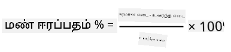
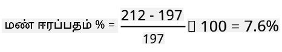

<!--
CO_OP_TRANSLATOR_METADATA:
{
  "original_hash": "506d21b544d5de47406c89ad496a21cd",
  "translation_date": "2025-10-11T12:28:32+00:00",
  "source_file": "2-farm/lessons/2-detect-soil-moisture/assignment.md",
  "language_code": "ta"
}
-->
# உங்கள் சென்சாரை சரிசெய்க

## வழிமுறைகள்

இந்த பாடத்தில் நீங்கள் மண் ஈரப்பதம் சென்சார் வாசிப்புகளை 0-1023 மதிப்புகளாகக் கொண்டீர்கள். இவற்றை உண்மையான மண் ஈரப்பதம் வாசிப்புகளாக மாற்ற, உங்கள் சென்சாரை சரிசெய்ய வேண்டும். இதை மண் மாதிரிகளிலிருந்து வாசிப்புகளை எடுத்து, பின்னர் அவற்றிலிருந்து ஈரமான மண் ஈரப்பதம் உள்ளடக்கத்தை கணக்கிடுவதன் மூலம் செய்யலாம்.

இந்த படிகளை பல முறை மீண்டும் செய்ய வேண்டும், ஒவ்வொரு முறையும் மண்ணின் ஈரத்தன்மை மாறுபட வேண்டும்.

1. மண் ஈரப்பதம் சென்சாரைப் பயன்படுத்தி மண் ஈரப்பதம் வாசிப்பை எடுக்கவும். இந்த வாசிப்பை எழுதிக் கொள்ளவும்.

1. மண்ணின் மாதிரியை எடுத்து, அதை எடுக்கும். இந்த எடையை எழுதிக் கொள்ளவும்.

1. மண்ணை உலர்த்தவும் - 110°C (230°F) வெப்பநிலையில் சில மணி நேரங்கள் ஒரு சூடான அடுப்பில் உலர்த்துவது சிறந்த வழி. நீங்கள் இதை சூரிய ஒளியில் செய்யலாம் அல்லது மண்ணை முழுமையாக உலர்ந்த வரை ஒரு சூடான, உலர்ந்த இடத்தில் வைக்கலாம். இது தூளாகவும் சுலபமாகவும் இருக்க வேண்டும்.

    > 💁 ஆய்வகத்தில் மிகச் சரியான முடிவுகளுக்கு, 48-72 மணி நேரங்கள் ஒரு அடுப்பில் உலர்த்த வேண்டும். உங்கள் பள்ளியில் உலர்த்தும் அடுப்புகள் இருந்தால், நீண்ட நேரம் உலர்த்துவதற்கு அவற்றைப் பயன்படுத்தலாம். நீண்ட நேரம் உலர்த்தினால் மாதிரி அதிகமாக உலர்ந்தும் முடிவுகள் மிகச் சரியாகவும் இருக்கும்.

1. மண்ணை மீண்டும் எடுக்கும்.

    > 🔥 அதை ஒரு அடுப்பில் உலர்த்தியிருந்தால், முதலில் அது குளிர்ந்திருக்க வேண்டும்!

ஈரமான மண் ஈரப்பதம் உள்ளடக்கம் கணக்கிடப்படும்:

* Wwet - ஈரமான மண்ணின் எடை
* Wdry - உலர்ந்த மண்ணின் எடை

உதாரணமாக, நீங்கள் 212g ஈரமான மற்றும் 197g உலர்ந்த மண்ணை கொண்ட மாதிரியை எடுத்துக் கொண்டால்:

* Wwet = 212g
* Wdry = 197g
* 212 - 197 = 15
* 15 / 197 = 0.076
* 0.076 * 100 = 7.6%

இந்த உதாரணத்தில், மண்ணில் 7.6% ஈரமான மண் ஈரப்பதம் உள்ளது.

குறைந்தது 3 மாதிரிகளுக்கான வாசிப்புகளை எடுத்த பிறகு, மண் ஈரப்பதம் % மற்றும் மண் ஈரப்பதம் சென்சார் வாசிப்புக்கான ஒரு கிராஃபை வரைந்து, புள்ளிகளுக்கு சிறந்த பொருத்தமான கோட்டை சேர்க்கவும். பின்னர், ஒரு சென்சார் வாசிப்புக்கான ஈரமான மண் ஈரப்பதம் உள்ளடக்கத்தை, கோட்டிலிருந்து மதிப்பை வாசிப்பதன் மூலம் கணக்கிடலாம்.

## மதிப்பீடு

| அளவுகோல் | சிறந்தது | போதுமானது | மேம்பாடு தேவை |
| -------- | --------- | -------- | ----------------- |
| சரிசெய்தல் தரவுகளை சேகரிக்கவும் | குறைந்தது 3 சரிசெய்தல் மாதிரிகளைப் பதிவு செய்யவும் | குறைந்தது 2 சரிசெய்தல் மாதிரிகளைப் பதிவு செய்யவும் | குறைந்தது 1 சரிசெய்தல் மாதிரியைப் பதிவு செய்யவும் |
| சரிசெய்யப்பட்ட வாசிப்பை செய்யவும் | சரிசெய்தல் கிராஃபை வெற்றிகரமாக வரைந்து, சென்சாரிலிருந்து வாசிப்பை எடுத்து, அதை ஈரமான மண் ஈரப்பதம் உள்ளடக்கமாக மாற்றவும் | சரிசெய்தல் கிராஃபை வெற்றிகரமாக வரைந்து முடிக்கவும் | கிராஃபை வரைந்து முடிக்க முடியவில்லை |

---

**குறிப்பு**:  
இந்த ஆவணம் [Co-op Translator](https://github.com/Azure/co-op-translator) என்ற AI மொழிபெயர்ப்பு சேவையைப் பயன்படுத்தி மொழிபெயர்க்கப்பட்டுள்ளது. நாங்கள் துல்லியத்திற்காக முயற்சிக்கின்றோம், ஆனால் தானியக்க மொழிபெயர்ப்புகளில் பிழைகள் அல்லது தவறான தகவல்கள் இருக்கக்கூடும் என்பதை தயவுசெய்து கவனத்தில் கொள்ளுங்கள். அதன் தாய்மொழியில் உள்ள மூல ஆவணம் அதிகாரப்பூர்வ ஆதாரமாக கருதப்பட வேண்டும். முக்கியமான தகவல்களுக்கு, தொழில்முறை மனித மொழிபெயர்ப்பு பரிந்துரைக்கப்படுகிறது. இந்த மொழிபெயர்ப்பைப் பயன்படுத்துவதால் ஏற்படும் எந்த தவறான புரிதல்கள் அல்லது தவறான விளக்கங்களுக்கு நாங்கள் பொறுப்பல்ல.