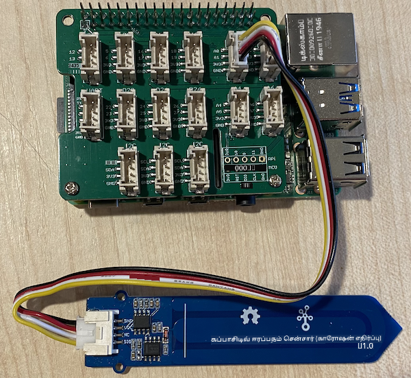

<!--
CO_OP_TRANSLATOR_METADATA:
{
  "original_hash": "9d4d00a47d5d0f3e6ce42c0d1020064a",
  "translation_date": "2025-10-11T12:28:03+00:00",
  "source_file": "2-farm/lessons/2-detect-soil-moisture/pi-soil-moisture.md",
  "language_code": "ta"
}
-->
# மண் ஈரப்பதத்தை அளவிடுதல் - ராஸ்பெரி பை

இந்த பாடத்தின் இந்த பகுதியில், நீங்கள் ஒரு கப்பாசிட்டிவ் மண் ஈரப்பதம் சென்சரை உங்கள் ராஸ்பெரி பையில் சேர்த்து, அதிலிருந்து மதிப்புகளை வாசிக்கப் போகிறீர்கள்.

## ஹார்ட்வேர்கள்

ராஸ்பெரி பைக்கு ஒரு கப்பாசிட்டிவ் மண் ஈரப்பதம் சென்சர் தேவை.

நீங்கள் பயன்படுத்தப் போகும் சென்சர் [Capacitive Soil Moisture Sensor](https://www.seeedstudio.com/Grove-Capacitive-Moisture-Sensor-Corrosion-Resistant.html) ஆகும், இது மண்ணின் ஈரப்பதத்தை அதன் கப்பாசிட்டன்ஸ் மூலம் கண்டறிகிறது. மண்ணின் ஈரப்பதம் மாறும்போது கப்பாசிட்டன்ஸ் மாறும். மண்ணின் ஈரப்பதம் அதிகரிக்கும்போது, மின்னழுத்தம் குறையும்.

இது ஒரு அனலாக் சென்சர் ஆகும், எனவே இது அனலாக் பின்களை பயன்படுத்துகிறது, மேலும் Pi-யில் உள்ள Grove Base Hat-இல் உள்ள 10-bit ADC மூலம் மின்னழுத்தத்தை 1-1,023 வரை டிஜிட்டல் சிக்னலாக மாற்றுகிறது. பின்னர் இது GPIO பின்கள் மூலம் I<sup>2</sup>C வழியாக அனுப்பப்படுகிறது.

### மண் ஈரப்பதம் சென்சரை இணைத்தல்

Grove மண் ஈரப்பதம் சென்சரை ராஸ்பெரி பைக்கு இணைக்கலாம்.

#### பணிகள் - மண் ஈரப்பதம் சென்சரை இணைத்தல்

மண் ஈரப்பதம் சென்சரை இணைக்கவும்.


1. Grove கேபிளின் ஒரு முனையை மண் ஈரப்பதம் சென்சரின் சாக்கெட்டில் செருகவும். இது ஒரு வழியில் மட்டுமே செருகப்படும்.

1. ராஸ்பெரி பை ஆஃப் நிலையில் இருக்கும் போது, Grove கேபிளின் மற்ற முனையை Pi-யில் இணைக்கப்பட்ட Grove Base Hat-இல் **A0** என குறிக்கப்பட்ட அனலாக் சாக்கெட்டில் இணைக்கவும். இந்த சாக்கெட் GPIO பின்களுக்குப் பக்கத்தில் உள்ள சாக்கெட்டுகளின் வரிசையில் வலதுபுறத்தில் இரண்டாவது சாக்கெட் ஆகும்.



1. மண் ஈரப்பதம் சென்சரை மண்ணில் செருகவும். இது 'அதிகபட்ச நிலை கோடு' - சென்சரின் குறுக்கே ஒரு வெள்ளை கோடு கொண்டுள்ளது. இந்த கோட்டிற்கு கீழே சென்சரை செருகவும், ஆனால் அதை மீற வேண்டாம்.


## மண் ஈரப்பதம் சென்சரை நிரலாக்குதல்

இப்போது ராஸ்பெரி பை மண் ஈரப்பதம் சென்சரை பயன்படுத்த நிரலாக்கப்படலாம்.

### பணிகள் - மண் ஈரப்பதம் சென்சரை நிரலாக்குதல்

சாதனத்தை நிரலாக்கவும்.

1. பையை ஆன் செய்து, அது தொடங்கும் வரை காத்திருக்கவும்.

1. VS Code-ஐ தொடங்கவும், நேரடியாக பையில் அல்லது Remote SSH extension மூலம் இணைக்கவும்.

    > ⚠️ [VS Code-ஐ அமைத்து தொடங்குவதற்கான வழிமுறைகளை nightlight - பாடம் 1-ல் பார்க்கலாம்](../../../1-getting-started/lessons/1-introduction-to-iot/pi.md).

1. டெர்மினலில், `pi` பயனர் ஹோம் டைரக்டரியில் `soil-moisture-sensor` என்ற புதிய கோப்பகத்தை உருவாக்கவும். இந்த கோப்பகத்தில் `app.py` என்ற கோப்பை உருவாக்கவும்.

1. இந்த கோப்பகத்தை VS Code-இல் திறக்கவும்.

1. `app.py` கோப்பில் கீழே உள்ள குறியீட்டை சேர்த்து தேவையான நூலகங்களை இறக்குமதி செய்யவும்:

    ```python
    import time
    from grove.adc import ADC
    ```

    `import time` என்ற அறிக்கையால் `time` மாட்யூல் இறக்குமதி செய்யப்படுகிறது, இது பின்னர் இந்த பணியில் பயன்படுத்தப்படும்.

    `from grove.adc import ADC` என்ற அறிக்கையால் Grove Python நூலகங்களில் இருந்து `ADC` இறக்குமதி செய்யப்படுகிறது. இந்த நூலகம் Pi Base Hat-இல் உள்ள அனலாக் டு டிஜிட்டல் கன்வெர்டரை மற்றும் அனலாக் சென்சர்களிலிருந்து மின்னழுத்தங்களை வாசிக்க உதவுகிறது.

1. `ADC` வகுப்பின் ஒரு உதாரணத்தை உருவாக்க கீழே உள்ள குறியீட்டை சேர்க்கவும்:

    ```python
    adc = ADC()
    ```

1. A0 பினில் உள்ள ADC-இல் இருந்து வாசிக்கும் ஒரு முடிவில்லாத லூப்பை சேர்க்கவும், மேலும் முடிவுகளை கன்சோலில் எழுதவும். இந்த லூப் வாசிப்புகளுக்கு இடையில் 10 விநாடிகள் தூங்கலாம்.

    ```python
    while True:
        soil_moisture = adc.read(0)
        print("Soil moisture:", soil_moisture)

        time.sleep(10)
    ```

1. Python பயன்பாட்டை இயக்கவும். மண் ஈரப்பதம் அளவீடுகள் கன்சோலில் எழுதப்பட்டதை நீங்கள் காணலாம். மண்ணில் தண்ணீர் சேர்க்கவும் அல்லது சென்சரை மண்ணிலிருந்து அகற்றவும், மதிப்பு மாறுவதை காணவும்.

    ```output
    pi@raspberrypi:~/soil-moisture-sensor $ python3 app.py 
    Soil moisture: 615
    Soil moisture: 612
    Soil moisture: 498
    Soil moisture: 493
    Soil moisture: 490
    Soil Moisture: 388
    ```

    மேலே உள்ள உதாரண வெளியீட்டில், தண்ணீர் சேர்க்கப்படும் போது மின்னழுத்தம் குறைவதை நீங்கள் காணலாம்.

> 💁 இந்த குறியீட்டை [code/pi](../../../../../2-farm/lessons/2-detect-soil-moisture/code/pi) கோப்பகத்தில் காணலாம்.

😀 உங்கள் மண் ஈரப்பதம் சென்சர் நிரலாக்கம் வெற்றிகரமாக முடிந்தது!

---

**குறிப்பு**:  
இந்த ஆவணம் [Co-op Translator](https://github.com/Azure/co-op-translator) என்ற AI மொழிபெயர்ப்பு சேவையைப் பயன்படுத்தி மொழிபெயர்க்கப்பட்டுள்ளது. எங்கள் தரச்சிறப்பிற்காக முயற்சி செய்தாலும், தானியங்கி மொழிபெயர்ப்புகளில் பிழைகள் அல்லது தவறுகள் இருக்கக்கூடும் என்பதை தயவுசெய்து கவனத்தில் கொள்ளுங்கள். அதன் தாய்மொழியில் உள்ள மூல ஆவணம் அதிகாரப்பூர்வ ஆதாரமாக கருதப்பட வேண்டும். முக்கியமான தகவல்களுக்கு, தொழில்முறை மனித மொழிபெயர்ப்பு பரிந்துரைக்கப்படுகிறது. இந்த மொழிபெயர்ப்பைப் பயன்படுத்துவதால் ஏற்படும் எந்த தவறான புரிதல்கள் அல்லது தவறான விளக்கங்களுக்கு நாங்கள் பொறுப்பல்ல.