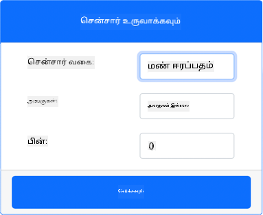

<!--
CO_OP_TRANSLATOR_METADATA:
{
  "original_hash": "2bf65f162bcebd35fbcba5fd245afac4",
  "translation_date": "2025-10-11T12:24:50+00:00",
  "source_file": "2-farm/lessons/2-detect-soil-moisture/virtual-device-soil-moisture.md",
  "language_code": "ta"
}
-->
# மண் ஈரப்பதத்தை அளவிடுதல் - மெய்நிகர் IoT சாதனம்

இந்த பாடத்தின் இந்த பகுதியில், உங்கள் மெய்நிகர் IoT சாதனத்தில் ஒரு கப்பாசிட்டிவ் மண் ஈரப்பதம் சென்சரை சேர்த்து, அதிலிருந்து மதிப்புகளைப் படிக்கப் போகிறீர்கள்.

## மெய்நிகர் ஹார்ட்வேர்கள்

மெய்நிகர் IoT சாதனம் சிமுலேட்டட் Grove கப்பாசிட்டிவ் மண் ஈரப்பதம் சென்சரைப் பயன்படுத்தும். இது Raspberry Pi மற்றும் ஒரு பிசிகல் Grove கப்பாசிட்டிவ் மண் ஈரப்பதம் சென்சரைப் பயன்படுத்துவதற்கான அனுபவத்தை ஒரே மாதிரியாக வைத்திருக்கிறது.

ஒரு பிசிகல் IoT சாதனத்தில், மண் ஈரப்பதம் சென்சர் மண்ணின் ஈரப்பதத்தை அதன் கப்பாசிட்டன்ஸ் மூலம் அளவிடும் கப்பாசிட்டிவ் சென்சராக இருக்கும். மண்ணின் ஈரப்பதம் அதிகரிக்கும்போது, மின்னழுத்தம் குறையும்.

இது ஒரு அனலாக் சென்சர், எனவே 10-பிட் ADC மூலம் 1-1,023 வரையிலான மதிப்பை அளிக்கிறது.

### CounterFit-க்கு மண் ஈரப்பதம் சென்சரைச் சேர்க்கவும்

மெய்நிகர் மண் ஈரப்பதம் சென்சரைப் பயன்படுத்த, அதை CounterFit செயலியில் சேர்க்க வேண்டும்.

#### பணிகள் - CounterFit-க்கு மண் ஈரப்பதம் சென்சரைச் சேர்க்கவும்

CounterFit செயலியில் மண் ஈரப்பதம் சென்சரைச் சேர்க்கவும்.

1. உங்கள் கணினியில் `soil-moisture-sensor` என்ற கோப்புறையில் ஒரு புதிய Python செயலியை உருவாக்கி, `app.py` என்ற ஒரு கோப்புடன் Python மெய்நிகர் சூழலை உருவாக்கி, CounterFit pip தொகுப்புகளைச் சேர்க்கவும்.

    > ⚠️ [CounterFit Python திட்டத்தை உருவாக்குவதற்கும் அமைப்பதற்கும் பாடம் 1-இல் உள்ள வழிமுறைகளைப் பார்க்கலாம்](../../../1-getting-started/lessons/1-introduction-to-iot/virtual-device.md).

1. CounterFit வலை செயலி இயங்குகிறதா என்பதை உறுதிப்படுத்தவும்.

1. மண் ஈரப்பதம் சென்சரை உருவாக்கவும்:

    1. *Sensors* பகுதியின் *Create sensor* பெட்டியில், *Sensor type* பெட்டியைத் திறந்து *Soil Moisture* என்பதைத் தேர்ந்தெடுக்கவும்.

    1. *Units* ஐ *NoUnits* ஆகவே விட்டு விடவும்.

    1. *Pin* ஐ *0* ஆக அமைத்திருக்கிறதா என்பதை உறுதிப்படுத்தவும்.

    1. **Add** பொத்தானைத் தேர்ந்தெடுத்து Pin 0-ல் *Soil Moisture* சென்சரை உருவாக்கவும்.

    

    மண் ஈரப்பதம் சென்சர் உருவாக்கப்பட்டு சென்சர்கள் பட்டியலில் தோன்றும்.

    

## மண் ஈரப்பதம் சென்சர் செயலியை நிரலாக்கவும்

மண் ஈரப்பதம் சென்சர் செயலியை இப்போது CounterFit சென்சர்களைப் பயன்படுத்தி நிரலாக்கலாம்.

### பணிகள் - மண் ஈரப்பதம் சென்சர் செயலியை நிரலாக்கவும்

மண் ஈரப்பதம் சென்சர் செயலியை நிரலாக்கவும்.

1. `soil-moisture-sensor` செயலி VS Code-இல் திறந்திருப்பதை உறுதிப்படுத்தவும்.

1. `app.py` கோப்பைத் திறக்கவும்.

1. CounterFit-க்கு செயலியை இணைக்க `app.py` கோப்பின் மேல் பின்வரும் குறியீட்டைச் சேர்க்கவும்:

    ```python
    from counterfit_connection import CounterFitConnection
    CounterFitConnection.init('127.0.0.1', 5000)
    ```

1. `app.py` கோப்பில் தேவையான நூலகங்களை இறக்குமதி செய்ய பின்வரும் குறியீட்டைச் சேர்க்கவும்:

    ```python
    import time
    from counterfit_shims_grove.adc import ADC
    ```

    `import time` அறிக்கையால் `time` மாட்யூல் இறக்குமதி செய்யப்படுகிறது, இது பின்னர் இந்த பணியில் பயன்படுத்தப்படும்.

    `from counterfit_shims_grove.adc import ADC` அறிக்கையால் CounterFit சென்சருடன் இணைக்கக்கூடிய மெய்நிகர் அனலாக் டு டிஜிட்டல் கன்வெர்டரைப் பயன்படுத்த `ADC` வகுப்பு இறக்குமதி செய்யப்படுகிறது.

1. `ADC` வகுப்பின் ஒரு உதாரணத்தை உருவாக்க பின்வரும் குறியீட்டை இதற்கு கீழே சேர்க்கவும்:

    ```python
    adc = ADC()
    ```

1. Pin 0-ல் இந்த ADC-யிலிருந்து படிக்கும் மற்றும் முடிவுகளை கன்சோலில் எழுதும் ஒரு முடிவில்லா லூப்பைச் சேர்க்கவும். இந்த லூப் பின்னர் படிப்புகளுக்கு இடையில் 10 விநாடிகள் தூங்கலாம்.

    ```python
    while True:
        soil_moisture = adc.read(0)
        print("Soil moisture:", soil_moisture)
    
        time.sleep(10)
    ```

1. CounterFit செயலியில், செயலி படிக்கும் மண் ஈரப்பதம் சென்சரின் மதிப்பை மாற்றவும். இதை இரண்டு வழிகளில் செய்யலாம்:

    * மண் ஈரப்பதம் சென்சருக்கான *Value* பெட்டியில் ஒரு எண்ணை உள்ளிடவும், பின்னர் **Set** பொத்தானைத் தேர்ந்தெடுக்கவும். நீங்கள் உள்ளிடும் எண் சென்சரால் திருப்பி அனுப்பப்படும் மதிப்பாக இருக்கும்.

    * *Random* செக்பாக்ஸைச் சரிபார்த்து, *Min* மற்றும் *Max* மதிப்புகளை உள்ளிடவும், பின்னர் **Set** பொத்தானைத் தேர்ந்தெடுக்கவும். ஒவ்வொரு முறையும் சென்சர் ஒரு மதிப்பைப் படிக்கும்போது, அது *Min* மற்றும் *Max* இடையிலான ஒரு சீரற்ற எண்ணை படிக்கும்.

1. Python செயலியை இயக்கவும். மண் ஈரப்பதம் அளவீடுகள் கன்சோலில் எழுதப்பட்டிருக்கும். *Value* அல்லது *Random* அமைப்புகளை மாற்றி மதிப்பு மாறுவதைப் பாருங்கள்.

    ```output
    (.venv) ➜ soil-moisture-sensor $ python app.py 
    Soil moisture: 615
    Soil moisture: 612
    Soil moisture: 498
    Soil moisture: 493
    Soil moisture: 490
    Soil Moisture: 388
    ```

> 💁 இந்த குறியீட்டை [code/virtual-device](../../../../../2-farm/lessons/2-detect-soil-moisture/code/virtual-device) கோப்புறையில் காணலாம்.

😀 உங்கள் மண் ஈரப்பதம் சென்சர் செயலி வெற்றிகரமாக முடிந்தது!

---

**குறிப்பு**:  
இந்த ஆவணம் [Co-op Translator](https://github.com/Azure/co-op-translator) என்ற AI மொழிபெயர்ப்பு சேவையைப் பயன்படுத்தி மொழிபெயர்க்கப்பட்டுள்ளது. நாங்கள் துல்லியத்திற்காக முயற்சிக்கிறோம், ஆனால் தானியக்க மொழிபெயர்ப்புகளில் பிழைகள் அல்லது தவறான தகவல்கள் இருக்கக்கூடும் என்பதை கவனத்தில் கொள்ளவும். அதன் தாய்மொழியில் உள்ள மூல ஆவணம் அதிகாரப்பூர்வ ஆதாரமாக கருதப்பட வேண்டும். முக்கியமான தகவல்களுக்கு, தொழில்முறை மனித மொழிபெயர்ப்பு பரிந்துரைக்கப்படுகிறது. இந்த மொழிபெயர்ப்பைப் பயன்படுத்துவதால் ஏற்படும் எந்த தவறான புரிதல்கள் அல்லது தவறான விளக்கங்களுக்கு நாங்கள் பொறுப்பல்ல.