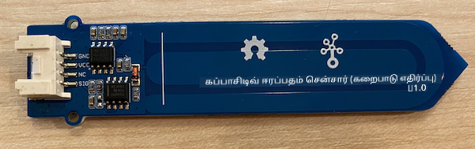
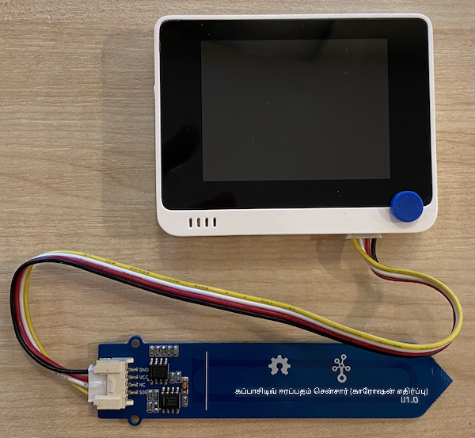
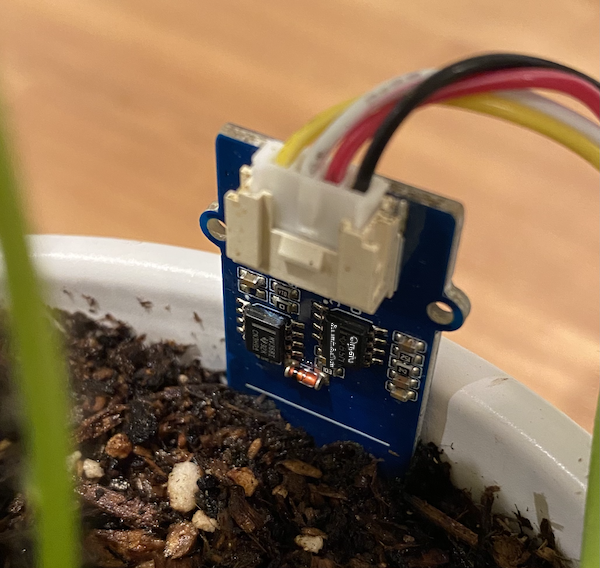

<!--
CO_OP_TRANSLATOR_METADATA:
{
  "original_hash": "0d55caa8c23d73635b7559102cd17b8a",
  "translation_date": "2025-10-11T12:25:24+00:00",
  "source_file": "2-farm/lessons/2-detect-soil-moisture/wio-terminal-soil-moisture.md",
  "language_code": "ta"
}
-->
# மண் ஈரப்பதத்தை அளவிடுதல் - Wio Terminal

இந்த பாடத்தின் இந்த பகுதியில், நீங்கள் உங்கள் Wio Terminal-க்கு ஒரு கப்பாசிட்டிவ் மண் ஈரப்பதம் சென்சரை சேர்த்து, அதிலிருந்து மதிப்புகளைப் படிக்கப் போகிறீர்கள்.

## ஹார்ட்வேர்கள்

Wio Terminal-க்கு ஒரு கப்பாசிட்டிவ் மண் ஈரப்பதம் சென்சர் தேவை.

நீங்கள் பயன்படுத்தப் போகும் சென்சர் [Capacitive Soil Moisture Sensor](https://www.seeedstudio.com/Grove-Capacitive-Moisture-Sensor-Corrosion-Resistant.html) ஆகும், இது மண்ணின் கப்பாசிட்டன்ஸை கண்டறிந்து மண் ஈரப்பதத்தை அளவிடுகிறது. மண்ணின் ஈரப்பதம் அதிகரிக்கும்போது, மின்னழுத்தம் குறையும்.

இது ஒரு அனலாக் சென்சர் ஆகும், எனவே Wio Terminal-இன் அனலாக் பின்களுடன் இணைக்கப்படுகிறது, மற்றும் 0-1,023 மதிப்புகளுக்குள் ஒரு மதிப்பை உருவாக்க ADC-ஐ (Analog-to-Digital Converter) பயன்படுத்துகிறது.

### மண் ஈரப்பதம் சென்சரை இணைத்தல்

Grove மண் ஈரப்பதம் சென்சரை Wio Terminal-இன் அமைக்கக்கூடிய அனலாக்/டிஜிட்டல் போர்டுடன் இணைக்கலாம்.

#### பணிகள் - மண் ஈரப்பதம் சென்சரை இணைத்தல்

மண் ஈரப்பதம் சென்சரை இணைக்கவும்.



1. Grove கேபிளின் ஒரு முனையை மண் ஈரப்பதம் சென்சரின் சாக்கெட்டில் செருகவும். இது ஒரு வழியில் மட்டுமே செருகப்படும்.

1. Wio Terminal உங்கள் கணினி அல்லது பிற மின்சார ஆதாரத்திலிருந்து துண்டிக்கப்பட்ட நிலையில், Grove கேபிளின் மற்ற முனையை Wio Terminal-இன் திரையைப் பார்க்கும் போது வலது பக்க Grove சாக்கெட்டில் இணைக்கவும். இது மின்சார பொத்தானிலிருந்து மிகத் தொலைவில் உள்ள சாக்கெட்.



1. மண் ஈரப்பதம் சென்சரை மண்ணில் செருகவும். இது 'அதிகபட்ச நிலை கோடு' - சென்சரின் மீது ஒரு வெள்ளை கோடு உள்ளது. இந்த கோட்டிற்கு கீழே சென்சரை செருகவும், ஆனால் அதை மீற வேண்டாம்.



1. இப்போது Wio Terminal-ஐ உங்கள் கணினியுடன் இணைக்கலாம்.

## மண் ஈரப்பதம் சென்சரை நிரலாக்குதல்

இப்போது Wio Terminal-ஐ இணைக்கப்பட்ட மண் ஈரப்பதம் சென்சரை பயன்படுத்த நிரலாக்கலாம்.

### பணிகள் - மண் ஈரப்பதம் சென்சரை நிரலாக்குதல்

சாதனத்தை நிரலாக்கவும்.

1. PlatformIO-ஐப் பயன்படுத்தி ஒரு புதிய Wio Terminal திட்டத்தை உருவாக்கவும். இந்த திட்டத்தை `soil-moisture-sensor` என்று அழைக்கவும். `setup` செயல்பாட்டில் சீரியல் போர்டை அமைக்க குறியீட்டைச் சேர்க்கவும்.

    > ⚠️ [திட்டம் 1, பாடம் 1-இல் PlatformIO திட்டத்தை உருவாக்கும் வழிமுறைகளை தேவையானால் பார்க்கலாம்](../../../1-getting-started/lessons/1-introduction-to-iot/wio-terminal.md#create-a-platformio-project).

1. இந்த சென்சருக்கான நூலகம் இல்லை, எனவே நீங்கள் Arduino-வின் [`analogRead`](https://www.arduino.cc/reference/en/language/functions/analog-io/analogread/) செயல்பாட்டைப் பயன்படுத்தி அனலாக் பினிலிருந்து மதிப்புகளைப் படிக்கலாம். முதலில், `setup` செயல்பாட்டில் அனலாக் பினை உள்ளீடாக அமைக்கவும், இதனால் அதிலிருந்து மதிப்புகளைப் படிக்க முடியும்.

    ```cpp
    pinMode(A0, INPUT);
    ```

    இது `A0` பினை, இணைந்த அனலாக்/டிஜிட்டல் பினை, மின்னழுத்தத்தைப் படிக்க முடியும் என உள்ளீடாக அமைக்கிறது.

1. இந்த பினிலிருந்து மின்னழுத்தத்தைப் படிக்க `loop` செயல்பாட்டில் பின்வரும் குறியீட்டைச் சேர்க்கவும்:

    ```cpp
    int soil_moisture = analogRead(A0);
    ```

1. இந்த குறியீட்டின் கீழ், சீரியல் போர்டில் மதிப்பை அச்சிட பின்வரும் குறியீட்டைச் சேர்க்கவும்:

    ```cpp
    Serial.print("Soil Moisture: ");
    Serial.println(soil_moisture);
    ```

1. இறுதியாக 10 விநாடிகள் தாமதத்தைச் சேர்க்கவும்:

    ```cpp
    delay(10000);
    ```

1. குறியீட்டை உருவாக்கி Wio Terminal-க்கு பதிவேற்றவும்.

    > ⚠️ [திட்டம் 1, பாடம் 1-இல் PlatformIO திட்டத்தை உருவாக்கும் வழிமுறைகளை தேவையானால் பார்க்கலாம்](../../../1-getting-started/lessons/1-introduction-to-iot/wio-terminal.md#write-the-hello-world-app).

1. பதிவேற்றப்பட்டவுடன், சீரியல் மானிட்டரைப் பயன்படுத்தி மண் ஈரப்பதத்தை கண்காணிக்கலாம். மண்ணில் தண்ணீரைச் சேர்க்கவும் அல்லது சென்சரை மண்ணிலிருந்து அகற்றவும், மதிப்பு எப்படி மாறுகிறது என்பதைப் பாருங்கள்.

    ```output
    > Executing task: platformio device monitor <
    
    --- Available filters and text transformations: colorize, debug, default, direct, hexlify, log2file, nocontrol, printable, send_on_enter, time
    --- More details at http://bit.ly/pio-monitor-filters
    --- Miniterm on /dev/cu.usbmodem1201  9600,8,N,1 ---
    --- Quit: Ctrl+C | Menu: Ctrl+T | Help: Ctrl+T followed by Ctrl+H ---
    Soil Moisture: 526
    Soil Moisture: 529
    Soil Moisture: 521
    Soil Moisture: 494
    Soil Moisture: 454
    Soil Moisture: 456
    Soil Moisture: 395
    Soil Moisture: 388
    Soil Moisture: 394
    Soil Moisture: 391
    ```

    மேலே உள்ள எடுத்துக்காட்டு வெளியீட்டில், தண்ணீர் சேர்க்கப்பட்டபோது மின்னழுத்தம் குறைவதை நீங்கள் காணலாம்.

> 💁 இந்த குறியீட்டை [code/wio-terminal](../../../../../2-farm/lessons/2-detect-soil-moisture/code/wio-terminal) கோப்பகத்தில் காணலாம்.

😀 உங்கள் மண் ஈரப்பதம் சென்சர் நிரல் வெற்றிகரமாக முடிந்தது!

---

**குறிப்பு**:  
இந்த ஆவணம் [Co-op Translator](https://github.com/Azure/co-op-translator) என்ற AI மொழிபெயர்ப்பு சேவையைப் பயன்படுத்தி மொழிபெயர்க்கப்பட்டுள்ளது. நாங்கள் துல்லியத்திற்காக முயற்சிக்கிறோம், ஆனால் தானியங்கி மொழிபெயர்ப்புகளில் பிழைகள் அல்லது தவறான தகவல்கள் இருக்கக்கூடும் என்பதை கவனத்தில் கொள்ளவும். அதன் தாய்மொழியில் உள்ள மூல ஆவணம் அதிகாரப்பூர்வ ஆதாரமாக கருதப்பட வேண்டும். முக்கியமான தகவல்களுக்கு, தொழில்முறை மனித மொழிபெயர்ப்பு பரிந்துரைக்கப்படுகிறது. இந்த மொழிபெயர்ப்பைப் பயன்படுத்துவதால் ஏற்படும் எந்த தவறான புரிதல்கள் அல்லது தவறான விளக்கங்களுக்கு நாங்கள் பொறுப்பல்ல.