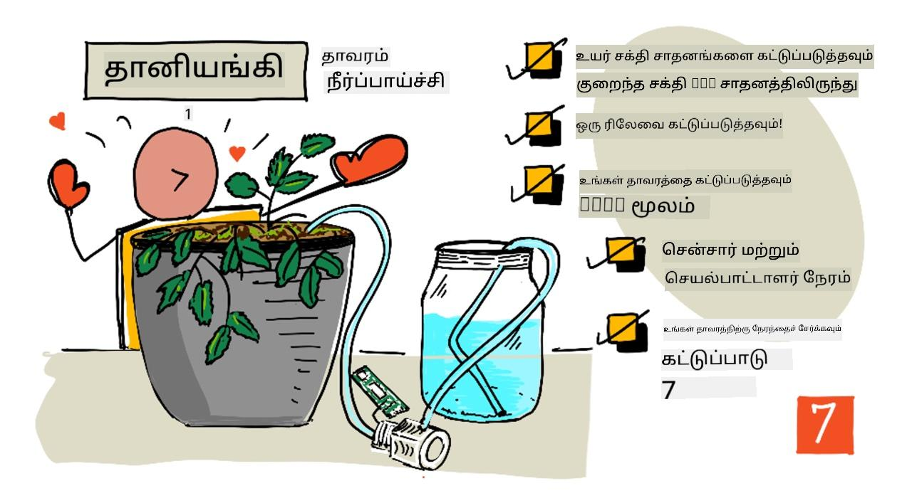
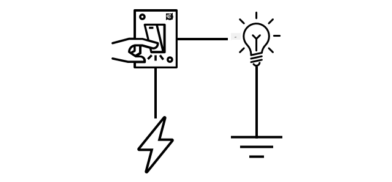
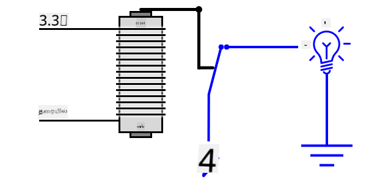
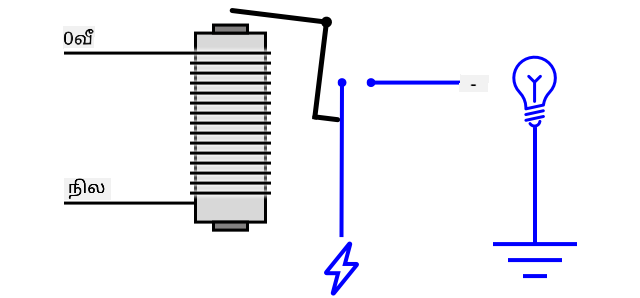
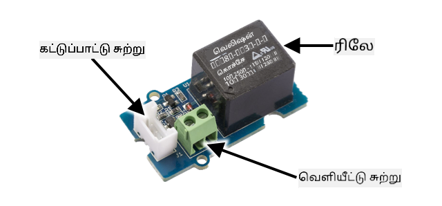
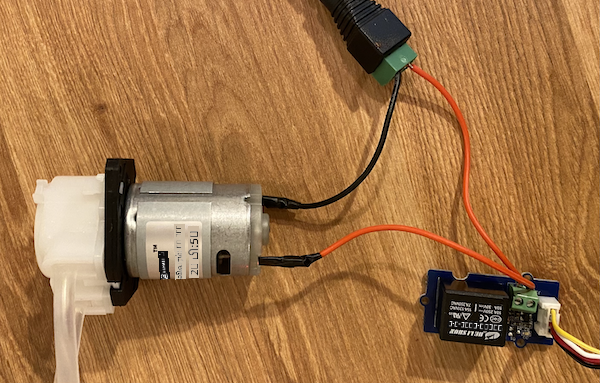
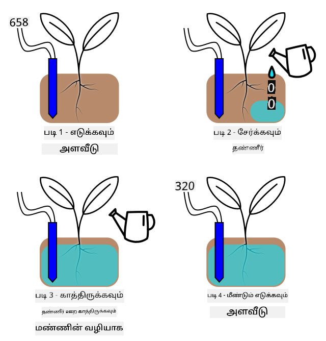

<!--
CO_OP_TRANSLATOR_METADATA:
{
  "original_hash": "f7bb24ba53fb627ddb38a8b24a05e594",
  "translation_date": "2025-10-11T12:44:33+00:00",
  "source_file": "2-farm/lessons/3-automated-plant-watering/README.md",
  "language_code": "ta"
}
-->
# தானியங்கிய தாவர நீர்ப்பாசனம்



> ஸ்கெட்ச் நோட்: [நித்யா நரசிம்மன்](https://github.com/nitya). படத்தை கிளிக் செய்து பெரிய பதிப்பைப் பாருங்கள்.

இந்த பாடம் [IoT for Beginners Project 2 - Digital Agriculture series](https://youtube.com/playlist?list=PLmsFUfdnGr3yCutmcVg6eAUEfsGiFXgcx) என்ற [Microsoft Reactor](https://developer.microsoft.com/reactor/?WT.mc_id=academic-17441-jabenn) மூலம் கற்பிக்கப்பட்டது.

[](https://youtu.be/g9FfZwv9R58)

## பாடத்துக்கு முன் கேள்வி

[பாடத்துக்கு முன் கேள்வி](https://black-meadow-040d15503.1.azurestaticapps.net/quiz/13)

## அறிமுகம்

கடந்த பாடத்தில், மண் ஈரப்பதத்தை கண்காணிப்பது எப்படி என்பதை நீங்கள் கற்றுக்கொண்டீர்கள். இந்த பாடத்தில், மண் ஈரப்பதத்திற்கு பதிலளிக்கும் தானியங்கிய நீர்ப்பாசன அமைப்பின் முக்கிய கூறுகளை உருவாக்குவது எப்படி என்பதை நீங்கள் கற்றுக்கொள்வீர்கள். மேலும், சென்சார்கள் மாற்றங்களுக்கு பதிலளிக்க நேரம் எடுக்கும் விதம் மற்றும் ஆக்டுவேட்டர்கள் சென்சார்களால் அளவிடப்படும் பண்புகளை மாற்ற நேரம் எடுக்கும் விதம் பற்றியும் நீங்கள் கற்றுக்கொள்வீர்கள்.

இந்த பாடத்தில் நாம் கவரும் விஷயங்கள்:

* [குறைந்த சக்தி IoT சாதனத்திலிருந்து அதிக சக்தி சாதனங்களை கட்டுப்படுத்துதல்](../../../../../2-farm/lessons/3-automated-plant-watering)
* [ரிலேவை கட்டுப்படுத்துதல்](../../../../../2-farm/lessons/3-automated-plant-watering)
* [MQTT மூலம் தாவரத்தை கட்டுப்படுத்துதல்](../../../../../2-farm/lessons/3-automated-plant-watering)
* [சென்சார் மற்றும் ஆக்டுவேட்டர் நேரம்](../../../../../2-farm/lessons/3-automated-plant-watering)
* [தாவர கட்டுப்பாட்டு சர்வரில் நேரத்தைச் சேர்த்தல்](../../../../../2-farm/lessons/3-automated-plant-watering)

## குறைந்த சக்தி IoT சாதனத்திலிருந்து அதிக சக்தி சாதனங்களை கட்டுப்படுத்துதல்

IoT சாதனங்கள் குறைந்த மின்னழுத்தத்தை பயன்படுத்துகின்றன. இது சென்சார்கள் மற்றும் LED போன்ற குறைந்த சக்தி ஆக்டுவேட்டர்களுக்கு போதுமானதாக இருந்தாலும், நீர்ப்பாசனத்திற்கு பயன்படுத்தப்படும் நீர்ப்பம்பு போன்ற பெரிய ஹார்ட்வேர்களை கட்டுப்படுத்த இது போதுமானதாக இல்லை. வீட்டுத் தாவரங்களுக்கு பயன்படுத்தக்கூடிய சிறிய பம்புகள் கூட IoT டெவ் கிட் மூலம் அதிக மின்சாரம் இழுக்கின்றன, இது போர்டை சேதப்படுத்தும்.

> 🎓 மின்சாரம், ஆம்ப்ஸ் (A) என அளவிடப்படும், ஒரு சுற்று வழியாக நகரும் மின்சாரத்தின் அளவாகும். மின்னழுத்தம் தள்ளும் சக்தியை வழங்குகிறது, மின்சாரம் தள்ளப்படும் அளவாகும். மின்சாரம் பற்றிய மேலும் தகவலுக்கு [Wikipedia இல் மின்சாரம் பக்கம்](https://wikipedia.org/wiki/Electric_current) பார்க்கவும்.

இதற்கான தீர்வு பம்பை வெளிப்புற மின்சார வழங்கலுடன் இணைத்து, பம்பை இயக்க ஒரு ஆக்டுவேட்டரை பயன்படுத்துவது, இது ஒரு விளக்கை இயக்குவது போலவே. உங்கள் விரல் ஒரு ஸ்விட்சை திருப்புவதற்கு ஒரு சிறிய அளவு சக்தி (உங்கள் உடலில் உள்ள ஆற்றல் வடிவில்) தேவைப்படுகிறது, இது 110v/240v மின்னழுத்தத்தில் இயங்கும் மின்சாரத்தை விளக்குடன் இணைக்கிறது.



> 🎓 [மெயின்ஸ் மின்சாரம்](https://wikipedia.org/wiki/Mains_electricity) என்பது உலகின் பல பகுதிகளில் தேசிய கட்டமைப்பின் மூலம் வீடுகள் மற்றும் வணிகங்களுக்கு வழங்கப்படும் மின்சாரத்தை குறிக்கிறது.

✅ IoT சாதனங்கள் பொதுவாக 3.3V அல்லது 5V வழங்க முடியும், 1 ஆம்ப் (1A) க்கு குறைவான மின்சாரம். இதை மெயின்ஸ் மின்சாரத்துடன் ஒப்பிடுங்கள், இது பெரும்பாலும் 230V (வட அமெரிக்காவில் 120V மற்றும் ஜப்பானில் 100V) ஆகும், மேலும் 30A வரை மின்சாரம் இழுக்கும் சாதனங்களுக்கு சக்தி வழங்க முடியும்.

இதற்கான பல ஆக்டுவேட்டர்கள் உள்ளன, இதில் உங்கள் விரலை திருப்புவது போலவே உள்ள ஸ்விட்சுகளை இணைக்க இயங்கும் மெக்கானிக்கல் சாதனங்கள் அடங்கும். மிகவும் பிரபலமானது ரிலே ஆகும்.

### ரிலேக்கள்

ரிலே என்பது ஒரு எலக்ட்ரோமேக்கானிக்கல் ஸ்விட்ச் ஆகும், இது ஒரு மின்சார சிக்னலை ஒரு மெக்கானிக்கல் இயக்கமாக மாற்றி ஒரு ஸ்விட்சை இயக்குகிறது. ரிலேவின் மையம் ஒரு எலக்ட்ரோமக்னெட் ஆகும்.

> 🎓 [எலக்ட்ரோமக்னெட்கள்](https://wikipedia.org/wiki/Electromagnet) என்பது மின்சாரம் ஒரு கம்பி காய்ச்சல் வழியாக செல்லும்போது உருவாகும் காந்தங்கள் ஆகும். மின்சாரம் இயக்கப்படும் போது, காய்ச்சல் காந்தமாகிறது. மின்சாரம் நிறுத்தப்படும் போது, காய்ச்சல் அதன் காந்தத்தன்மையை இழக்கிறது.



ஒரு ரிலேவில், ஒரு கட்டுப்பாட்டு சுற்று எலக்ட்ரோமக்னெட்டை இயக்குகிறது. எலக்ட்ரோமக்னெட் இயக்கப்பட்டால், இது ஒரு லீவரை இழுக்கிறது, இது ஒரு ஸ்விட்சை நகர்த்துகிறது, ஒரு ஜோடி தொடர்புகளை மூடுகிறது மற்றும் ஒரு வெளியீட்டு சுற்றை முடிக்கிறது.



கட்டுப்பாட்டு சுற்று இயக்கப்படாத போது, எலக்ட்ரோமக்னெட் அணைக்கப்படுகிறது, லீவரை விடுவிக்கிறது மற்றும் தொடர்புகளை திறக்கிறது, வெளியீட்டு சுற்றை அணைக்கிறது. ரிலேக்கள் டிஜிட்டல் ஆக்டுவேட்டர்கள் - ரிலேவுக்கு ஒரு உயர் சிக்னல் அதை இயக்குகிறது, ஒரு குறைந்த சிக்னல் அதை அணைக்கிறது.

வெளியீட்டு சுற்று கூடுதல் ஹார்ட்வேர்களை இயக்க பயன்படுத்தப்படலாம், உதாரணமாக ஒரு நீர்ப்பாசன அமைப்பு. IoT சாதனம் ரிலேவை இயக்க முடியும், வெளியீட்டு சுற்றை முடிக்கிறது, இது நீர்ப்பாசன அமைப்பை இயக்குகிறது, மேலும் தாவரங்கள் நீர்ப்பாசனம் பெறுகின்றன. IoT சாதனம் பின்னர் ரிலேவை அணைக்க முடியும், நீர்ப்பாசன அமைப்புக்கு மின்சாரத்தை துண்டிக்கிறது, நீரை நிறுத்துகிறது.


மேலே உள்ள வீடியோவில், ஒரு ரிலே இயக்கப்படுகிறது. ரிலேவில் உள்ள LED ஒன்று அது இயக்கப்பட்டதை குறிக்க ஒளிர்கிறது (சில ரிலே போர்ட்களில் ரிலே இயக்கப்பட்டதா அல்லது அணைக்கப்பட்டதா என்பதை குறிக்க LEDக்கள் உள்ளன), மேலும் பம்புக்கு மின்சாரம் அனுப்பப்படுகிறது, இது இயக்கப்பட்டு தாவரத்திற்கு நீரை பம்ப் செய்கிறது.

> 💁 ரிலேக்கள் இரண்டு வெளியீட்டு சுற்றுகளுக்கு இடையே மாறவும் பயன்படுத்தப்படலாம், ஒன்றை இயக்கி மற்றொன்றை அணைக்காமல். லீவர் நகரும் போது, இது ஒரு வெளியீட்டு சுற்றை முடிக்கிறது, மற்றொரு வெளியீட்டு சுற்றை முடிக்கிறது, பொதுவாக ஒரு பொதுவான மின்சார இணைப்பு அல்லது பொதுவான மின்காந்த இணைப்பு பகிர்ந்து கொள்ளப்படுகிறது.

✅ ஆராய்ச்சி செய்யுங்கள்: பல வகையான ரிலேக்கள் உள்ளன, கட்டுப்பாட்டு சுற்று மின்சாரம் வழங்கப்பட்டால் ரிலேவை இயக்குமா அல்லது அணைக்குமா, அல்லது பல வெளியீட்டு சுற்றுகள் போன்ற வேறுபாடுகளுடன். இந்த வேறுபாடுகள் பற்றி அறியுங்கள்.

லீவர் நகரும் போது, இது எலக்ட்ரோமக்னெட்டுடன் தொடர்பு கொள்ளும் போது ஒரு தெளிவான கிளிக் ஒலி உண்டாகும்.

> 💁 ஒரு ரிலே மின்சாரத்தை இணைப்பது உண்மையில் ரிலேவுக்கு மின்சாரத்தை துண்டிக்கிறது, ரிலேவை அணைக்கிறது, இது பின்னர் ரிலேவுக்கு மின்சாரம் அனுப்புகிறது, அதை மீண்டும் இயக்குகிறது, இப்படி தொடர்கிறது. இதனால் ரிலே மிகவும் வேகமாக கிளிக் செய்யும், இது ஒரு பசப்பான ஒலியை உருவாக்கும். இது மின்சார கதவுகளின் முதல் பஸ்ஸர்கள் எப்படி வேலை செய்தன என்பதற்கான உதாரணம்.

### ரிலே சக்தி

எலக்ட்ரோமக்னெட்டை இயக்கி லீவரை இழுக்க அதிக சக்தி தேவை இல்லை, இது IoT டெவ் கிட் மூலம் 3.3V அல்லது 5V வெளியீட்டை பயன்படுத்தி கட்டுப்படுத்தப்படலாம். வெளியீட்டு சுற்று ரிலேவின் சக்தியைப் பொறுத்து அதிக சக்தியை ஏற்றுக்கொள்ள முடியும், இதில் மெயின்ஸ் மின்னழுத்தம் அல்லது தொழில்துறை பயன்பாட்டிற்கான அதிக சக்தி நிலைகள் அடங்கும். இவ்வாறு IoT டெவ் கிட் ஒரு நீர்ப்பாசன அமைப்பை கட்டுப்படுத்த முடியும், ஒரு தாவரத்திற்கான சிறிய பம்பிலிருந்து, ஒரு முழு வணிக பண்ணைக்கு ஒரு பெரிய தொழில்துறை அமைப்பிற்கு.



மேலே உள்ள படத்தில் ஒரு கிரோவ் ரிலே காட்டப்பட்டுள்ளது. கட்டுப்பாட்டு சுற்று IoT சாதனத்துடன் இணைக்கப்படுகிறது மற்றும் 3.3V அல்லது 5V பயன்படுத்தி ரிலேவை இயக்க அல்லது அணைக்கிறது. வெளியீட்டு சுற்றில் இரண்டு முனைகள் உள்ளன, இதில் ஒன்று மின்சாரம் அல்லது மின்காந்தமாக இருக்கலாம். வெளியீட்டு சுற்று 250V வரை 10A வரை கையாள முடியும், இது பல மெயின்ஸ் மின்சார சாதனங்களுக்கு போதுமானது. மேலும் அதிக சக்தி நிலைகளை கையாளக்கூடிய ரிலேக்களை நீங்கள் பெறலாம்.



மேலே உள்ள படத்தில், ஒரு USB மின்சார வழங்கலின் +5V முனையத்திலிருந்து ஒரு ரிலேவின் வெளியீட்டு சுற்றின் ஒரு முனைக்கு ஒரு சிவப்பு கம்பி இணைக்கப்பட்டுள்ளது, மேலும் வெளியீட்டு சுற்றின் மற்றொரு முனையத்திலிருந்து பம்புக்கு மற்றொரு சிவப்பு கம்பி இணைக்கப்பட்டுள்ளது. ஒரு கருப்பு கம்பி பம்பை USB மின்சார வழங்கலின் மின்காந்தத்துடன் இணைக்கிறது. ரிலே இயக்கப்பட்டால், இது சுற்றை முடிக்கிறது, பம்புக்கு 5V அனுப்புகிறது, பம்பை இயக்குகிறது.

## ரிலேவை கட்டுப்படுத்துதல்

நீங்கள் உங்கள் IoT டெவ் கிட் மூலம் ஒரு ரிலேவை கட்டுப்படுத்த முடியும்.

### பணிகள் - ரிலேவை கட்டுப்படுத்துதல்

உங்கள் IoT சாதனத்தைப் பயன்படுத்தி ரிலேவை கட்டுப்படுத்துவதற்கான தொடர்புடைய வழிகாட்டுதலைப் பின்பற்றுங்கள்:

* [Arduino - Wio Terminal](wio-terminal-relay.md)
* [Single-board computer - Raspberry Pi](pi-relay.md)
* [Single-board computer - Virtual device](virtual-device-relay.md)

## MQTT மூலம் தாவரத்தை கட்டுப்படுத்துதல்

இப்போது வரை உங்கள் ரிலே ஒரு மண் ஈரப்பதம் அளவீட்டின் அடிப்படையில் IoT சாதனம் மூலம் நேரடியாக கட்டுப்படுத்தப்படுகிறது. ஒரு வணிக நீர்ப்பாசன அமைப்பில், கட்டுப்பாட்டு தார்மீகத்தை மையமாக்கி, பல சென்சார்களிலிருந்து தரவுகளைப் பயன்படுத்தி நீர்ப்பாசனம் செய்ய முடிவு செய்யவும், எந்தவொரு கட்டமைப்பையும் ஒரே இடத்தில் மாற்றவும் அனுமதிக்கப்படும். இதை ஒப்பிட, நீங்கள் MQTT மூலம் ரிலேவை கட்டுப்படுத்தலாம்.

### பணிகள் - MQTT மூலம் ரிலேவை கட்டுப்படுத்துதல்

1. உங்கள் `soil-moisture-sensor` திட்டத்தில் MQTT இணைக்க தொடர்புடைய MQTT நூலகங்கள்/பைப் தொகுப்புகள் மற்றும் குறியீட்டை சேர்க்கவும். கிளையன்ட் ஐடியை உங்கள் ஐடி முன்னோட்டமாக `soilmoisturesensor_client` என பெயரிடவும்.

    > ⚠️ [MQTT இணைப்பதற்கான வழிமுறைகளை திட்டம் 1, பாடம் 4 இல் தேவைப்பட்டால் பார்க்கலாம்](../../../1-getting-started/lessons/4-connect-internet/README.md#connect-your-iot-device-to-mqtt).

1. மண் ஈரப்பதம் அமைப்புகளுடன் டெலிமெட்ரி அனுப்புவதற்கான தொடர்புடைய சாதன குறியீட்டை சேர்க்கவும். டெலிமெட்ரி செய்திக்கான சொத்துக்கு `soil_moisture` என பெயரிடவும்.

    > ⚠️ [MQTT மூலம் டெலிமெட்ரி அனுப்புவதற்கான வழிமுறைகளை திட்டம் 1, பாடம் 4 இல் தேவைப்பட்டால் பார்க்கலாம்](../../../1-getting-started/lessons/4-connect-internet/README.md#send-telemetry-from-your-iot-device).

1. `soil-moisture-sensor-server` என்ற ஒரு கோப்புறையில் டெலிமெட்ரியை சந்திக்கவும் மற்றும் ரிலேவை கட்டுப்படுத்த ஒரு கட்டளையை அனுப்பவும் உள்ளூர் சர்வர் குறியீட்டை உருவாக்கவும். கட்டளை செய்தியில் சொத்துக்கு `relay_on` என பெயரிடவும், மற்றும் கிளையன்ட் ஐடியை உங்கள் ஐடி முன்னோட்டமாக `soilmoisturesensor_server` என அமைக்கவும். இந்த பாடத்தில் நீங்கள் இந்த குறியீட்டை மேலும் சேர்க்க இருப்பதால், திட்டம் 1, பாடம் 4 இல் நீங்கள் எழுதிய சர்வர் குறியீட்டின் அதே அமைப்பை வைத்திருங்கள்.

    > ⚠️ [MQTT மூலம் டெலிமெட்ரி அனுப்புவதற்கான வழிமுறைகளை](../../../1-getting-started/lessons/4-connect-internet/README.md#write-the-server-code) மற்றும் [MQTT மூலம் கட்டளைகளை அனுப்புவதற்கான வழிமுறைகளை](../../../1-getting-started/lessons/4-connect-internet/README.md#send-commands-to-the-mqtt-broker) திட்டம் 1, பாடம் 4 இல் தேவைப்பட்டால் பார்க்கலாம்.

1. `relay_on` சொத்தைப் பயன்படுத்தி, பெறப்பட்ட கட்டளைகளிலிருந்து ரிலேவை கட்டுப்படுத்த தொடர்புடைய சாதன குறியீட்டை சேர்க்கவும். `soil_moisture` 450 ஐ விட அதிகமாக இருந்தால் `relay_on` க்கு true அனுப்பவும், இல்லையெனில் false அனுப்பவும், நீங்கள் IoT சாதனத்திற்கு முன்பு சேர்த்த அதே தார்மீகத்தைப் பயன்படுத்தவும்.

    > ⚠️ [MQTT மூலம் கட்டளைகளுக்கு பதிலளிக்க](../../../1-getting-started/lessons/4-connect-internet/README.md#handle-commands-on-the-iot-device) திட்டம் 1, பாடம் 4 இல் தேவைப்பட்டால் பார்க்கலாம்.

> 💁 இந்த குறியீட்டை [code-mqtt](../../../../../2-farm/lessons/3-automated-plant-watering/code-mqtt) கோப்புறையில் காணலாம்.

உங்கள் சாதனத்தில் மற்றும் உள்ளூர் சர்வரில் குறியீடு இயங்குகிறதா என்பதை உறுதிப்படுத்தி, மண் ஈரப்பதம் நிலைகளை மாற்றுவதன் மூலம் அதை சோதிக்கவும், είτε மெய்நிகர் சென்சார் அனுப்பும் மதிப்புகளை மாற்றுவதன் மூலம், அல்லது மண்ணில் நீரைச் சேர்த்து அல்லது சென்சாரை மண்ணிலிருந்து அகற்றுவதன் மூலம்.

## சென்சார் மற்றும் ஆக்டுவேட்டர் நேரம்

பாடம் 3 இல் நீங்கள் ஒரு நைட்லைட் உருவாக்கினீர்கள் - ஒரு LED, இது ஒரு ஒளி சென்சார் குறைந்த அளவிலான ஒளியை கண்டறிந்தவுடன் இயக்கப்பட்டது. ஒளி சென்சார் ஒளி நிலைகளில் மாற்றத்தை உடனடியாக கண்டறிந்தது, மேலும் சாதனம் விரைவாக பதிலளிக்க முடிந்தது, `loop` செயல்பாட்டில் அல்லது `while True:` லூப்பில் உள்ள தாமதத்தின் நீளத்தால் மட்டுமே கட்டுப்படுத்தப்பட்டது. IoT டெவலப்பராக, நீங்கள் எப்போதும் இவ்வளவு விரைவான பின்னூட்டத்தை நம்ப முடியாது.

### மண் ஈரப்பதத்திற்கான நேரம்

மண் ஈரப்பதம் பற்றிய கடைசி பாடத்தை நீங்கள் ஒரு உட்பட சென்சார் பயன்படுத்தி செய்திருந்தால், தாவரத்தை நீர்ப்பாசனம் செய்த பிறகு மண் ஈரப்பதம் அளவீடு குறைய சில விநாடிகள் எடுத்தது என்பதை நீங்கள் கவனித்திருப்பீர்கள். இது சென்சார் மெதுவாக இருப்பதால் அல்ல, மண்ணில் நீர் ஊற நேரம் எடுப்பதால்.

> 💁 நீங்கள் சென்சாருக்கு மிக அருகில் நீர்ப்பாசனம் செய்திருந்தால், மதிப்பு விரைவாக குறைந்து, பின்னர் மீண்டும் அதிகரித்தது என்பதை நீங்கள் பார்த்திருக்கலாம் - இது சென்சாருக்கு அருகிலுள்ள நீர் மண்ணின் மற்ற பகுதிகளில் பரவுவதால் ஏற்படும், சென்சாரின் அருகிலுள்ள மண்
உங்கள் பண்ணைக்கு ஒரு நீர்ப்பாசன அமைப்பை உருவாக்க வேண்டும் என்று உங்களுக்கு பணிக்கொடுக்கப்பட்டுள்ளது என்று கற்பனை செய்யுங்கள். மண்ணின் வகை அடிப்படையில், வளர்க்கப்படும் தாவரங்களுக்கு தேவையான மண்ணின் ஈரப்பதம் அளவு 400-450 என்ற அனலாக் மின்னழுத்த வாசிப்புடன் பொருந்துகிறது.

நீங்கள் இந்த சாதனத்தை இரவுத்தீபம் போலவே நிரலாக்கலாம் - சென்சார் 450 க்கு மேல் வாசிக்கும் போது, ரிலேவை இயக்கி பம்பை இயக்கவும். பிரச்சினை என்னவென்றால், பம்பில் இருந்து மண்ணின் வழியாக சென்சாருக்கு நீர் செல்ல சில நேரம் ஆகிறது. சென்சார் 450 அளவைக் கண்டறிந்ததும் நீரை நிறுத்திவிடும், ஆனால் பம்ப் மூலம் பாயும் நீர் மண்ணில் ஊறி செல்லும் போது நீரின் அளவு தொடர்ந்து குறையும். இறுதியில், நீர் வீணாகும், மேலும் வேர்களுக்கு சேதம் ஏற்படும் அபாயம் உள்ளது.

✅ நினைவில் கொள்ளுங்கள் - அதிக நீர் தாவரங்களுக்கு குறைவான நீருக்கு சமமாக தீங்கு விளைவிக்கலாம், மேலும் இது ஒரு மதிப்புமிக்க வளத்தை வீணாக்கும்.

சிறந்த தீர்வு என்னவென்றால், செயலி இயக்கப்படும் நேரம் மற்றும் சென்சார் வாசிக்கும் சொத்து மாறும் நேரத்திற்கிடையே ஒரு தாமதம் இருப்பதை புரிந்து கொள்ள வேண்டும். இதன் பொருள், சென்சார் மதிப்பை மீண்டும் அளவிடுவதற்கு முன் ஒரு சில நேரம் காத்திருக்க வேண்டும், மேலும் செயலி மீண்டும் சென்சார் அளவீடு எடுப்பதற்கு முன் ஒரு சில நேரம் நிறுத்தப்பட வேண்டும்.

ஒவ்வொரு முறையும் ரிலே எவ்வளவு நேரம் இயக்கப்பட வேண்டும்? கவனமாக செயல்படுவது நல்லது, ரிலேவை குறுகிய நேரத்திற்கு மட்டுமே இயக்கி, பின்னர் நீர் மண்ணில் ஊறி செல்ல காத்திருந்து, மண்ணின் ஈரப்பதம் அளவுகளை மீண்டும் சரிபார்க்கவும். இறுதியில், நீரை மேலும் சேர்க்க பம்பை மீண்டும் இயக்கலாம், ஆனால் மண்ணிலிருந்து நீரை அகற்ற முடியாது.

> 💁 இந்த வகையான நேர கட்டுப்பாடு நீங்கள் உருவாக்கும் IoT சாதனத்திற்கு, நீங்கள் அளவிடும் சொத்துக்கு மற்றும் பயன்படுத்தப்படும் சென்சார்கள் மற்றும் செயலிகளுக்கு மிகவும் தனிப்பட்டது.


எடுத்துக்காட்டாக, எனக்கு ஒரு ஸ்ட்ராபெர்ரி தாவரம் உள்ளது, அதில் மண்ணின் ஈரப்பதம் சென்சார் மற்றும் ரிலே மூலம் கட்டுப்படுத்தப்படும் பம்ப் உள்ளது. நான் நீரை சேர்க்கும் போது, மண்ணின் ஈரப்பதம் வாசிப்பு நிலைப்படுத்த 20 விநாடிகள் ஆகும் என்று கவனித்தேன். இதன் பொருள், ரிலேவை நிறுத்தி, மண்ணின் ஈரப்பதம் அளவுகளை சரிபார்க்க 20 விநாடிகள் காத்திருக்க வேண்டும். எனக்கு குறைவான நீர் அதிகமாக இருப்பதை விட விருப்பம் - நான் பம்பை மீண்டும் இயக்கலாம், ஆனால் தாவரத்திலிருந்து நீரை அகற்ற முடியாது.



இதன் பொருள், சிறந்த செயல்முறை ஒரு நீர்ப்பாசன சுழற்சியாக இருக்கும், இது பின்வருமாறு:

* பம்பை 5 விநாடிகள் இயக்கவும்
* 20 விநாடிகள் காத்திருக்கவும்
* மண்ணின் ஈரப்பதம் சரிபார்க்கவும்
* தேவையான அளவை விட இன்னும் அதிகமாக இருந்தால், மேலே உள்ள படிகளை மீண்டும் செய்யவும்

5 விநாடிகள் பம்புக்கு மிகவும் நீண்ட நேரமாக இருக்கலாம், குறிப்பாக ஈரப்பதம் அளவுகள் தேவையான அளவை விட சற்று அதிகமாக இருந்தால். எந்த நேரத்தை பயன்படுத்த வேண்டும் என்பதை அறிய சிறந்த வழி அதை முயற்சித்து, சென்சார் தரவுடன் சரிசெய்து, ஒரு நிலையான பின்னூட்டச் சுழற்சியுடன் அமைத்துக்கொள்ள வேண்டும். இது மேலும் நுணுக்கமான நேரத்திற்கும் வழிவகுக்கலாம், உதாரணமாக, மண்ணின் ஈரப்பதம் தேவையான அளவை விட 100 அதிகமாக இருந்தால், பம்பை 1 விநாடி இயக்கவும், 5 விநாடிகள் என்ற நிலையான நேரத்திற்கு பதிலாக.

✅ சில ஆராய்ச்சி செய்யுங்கள்: வேறு நேரக் கருத்துக்கள் உள்ளனவா? மண்ணின் ஈரப்பதம் குறைவாக இருக்கும் போது தாவரத்தை எந்த நேரத்திலும் நீர்ப்பாசனம் செய்யலாமா, அல்லது தாவரங்களை நீர்ப்பாசனம் செய்ய நல்ல மற்றும் மோசமான நேரங்கள் உள்ளனவா?

> 💁 வெளியில் வளர்க்கும் தானியங்கி நீர்ப்பாசன அமைப்புகளை கட்டுப்படுத்துவதில் வானிலை முன்னறிவிப்புகளையும் கருத்தில் கொள்ளலாம். மழை எதிர்பார்க்கப்பட்டால், நீர்ப்பாசனத்தை மழை முடிந்த பிறகு நிறுத்தலாம். அப்போது மண்ணில் ஈரப்பதம் போதுமானதாக இருக்கலாம், இது மழைக்கு முன் நீர்ப்பாசனம் செய்வதை விட மிகவும் திறமையானது.

## உங்கள் தாவர கட்டுப்பாட்டு சர்வரில் நேரத்தைச் சேர்க்கவும்

நீர்ப்பாசன சுழற்சியின் நேர கட்டுப்பாட்டைச் சேர்க்கவும், மேலும் மண்ணின் ஈரப்பதம் அளவுகள் மாறுவதற்காக காத்திருக்கவும் சர்வர் குறியீட்டை மாற்றலாம். ரிலே நேரத்தை கட்டுப்படுத்த சர்வர் தர்க்கம்:

1. தொலைதொடர்பு செய்தி பெறப்பட்டது
1. மண்ணின் ஈரப்பதம் அளவை சரிபார்க்கவும்
1. சரியாக இருந்தால், எதுவும் செய்ய வேண்டாம். வாசிப்பு மிகவும் அதிகமாக இருந்தால் (மண்ணின் ஈரப்பதம் மிகவும் குறைவாக உள்ளது), அப்போது:
    1. ரிலேவை இயக்க கட்டளையை அனுப்பவும்
    1. 5 விநாடிகள் காத்திருக்கவும்
    1. ரிலேவை நிறுத்த கட்டளையை அனுப்பவும்
    1. மண்ணின் ஈரப்பதம் அளவுகள் நிலைப்படுத்த 20 விநாடிகள் காத்திருக்கவும்

நீர்ப்பாசன சுழற்சி, தொலைதொடர்பு செய்தியைப் பெறுவதிலிருந்து மண்ணின் ஈரப்பதம் அளவுகளை மீண்டும் செயல்படுத்த தயாராக இருப்பது வரை, சுமார் 25 விநாடிகள் ஆகும். மண்ணின் ஈரப்பதம் அளவுகளை ஒவ்வொரு 10 விநாடிகளுக்கும் அனுப்புகிறோம், எனவே ஒரு செய்தி பெறப்படும் போது சர்வர் மண்ணின் ஈரப்பதம் அளவுகளை நிலைப்படுத்த காத்திருக்கிறது, இது மற்றொரு நீர்ப்பாசன சுழற்சியைத் தொடங்கலாம்.

இதற்கு வேலை செய்ய இரண்டு விருப்பங்கள் உள்ளன:

* IoT சாதன குறியீட்டை மாற்றி ஒவ்வொரு நிமிடத்திற்கும் தொலைதொடர்பு அனுப்பவும், இவ்வாறு நீர்ப்பாசன சுழற்சி முடிவடையும் முன் அடுத்த செய்தி அனுப்பப்படும்
* நீர்ப்பாசன சுழற்சியின் போது தொலைதொடர்பில் இருந்து விலகவும்

முதல் விருப்பம் பெரிய பண்ணைகளுக்கு எப்போதும் நல்ல தீர்வாக இருக்காது. பண்ணையாளர் நீர்ப்பாசனத்தின் போது மண்ணின் ஈரப்பதம் அளவுகளைப் பிடித்து பின்னர் பகுப்பாய்வுக்கு பயன்படுத்த விரும்பலாம், உதாரணமாக பண்ணையின் வெவ்வேறு பகுதிகளில் நீரின் ஓட்டத்தை அறிந்து மேலும் இலக்கு நோக்கி நீர்ப்பாசனம் செய்ய வழிகாட்ட. இரண்டாவது விருப்பம் சிறந்தது - குறியீடு தொலைதொடர்பை பயன்படுத்த முடியாத போது அதை புறக்கணிக்கிறது, ஆனால் தொலைதொடர்பு இன்னும் பிற சேவைகளுக்கு உள்ளது, அவை அதை சந்திக்கலாம்.

> 💁 IoT தரவுகள் ஒரு சாதனத்திலிருந்து ஒரு சேவைக்கு மட்டுமே அனுப்பப்படுவதில்லை, மாறாக பல சாதனங்கள் தரவுகளை ஒரு ப்ரோக்கருக்கு அனுப்பலாம், மேலும் பல சேவைகள் ப்ரோக்கரில் இருந்து தரவுகளை கேட்கலாம். உதாரணமாக, ஒரு சேவை மண்ணின் ஈரப்பதம் தரவுகளை கேட்டு பின்னர் பகுப்பாய்வுக்கு தரவுத்தொகுப்பில் சேமிக்கலாம். மற்றொரு சேவையும் அதே தொலைதொடர்பை கேட்டு ஒரு நீர்ப்பாசன அமைப்பை கட்டுப்படுத்தலாம்.

### பணி - உங்கள் தாவர கட்டுப்பாட்டு சர்வரில் நேரத்தைச் சேர்க்கவும்

உங்கள் சர்வர் குறியீட்டை 5 விநாடிகள் ரிலே இயக்க, பின்னர் 20 விநாடிகள் காத்திருக்க மாற்றவும்.

1. `soil-moisture-sensor-server` கோப்புறையை VS Code இல் திறக்கவும், இது ஏற்கனவே திறக்கப்படவில்லை என்றால். மெய்நிகர் சூழல் செயல்படுத்தப்பட்டுள்ளதா என்பதை உறுதிப்படுத்தவும்.

1. `app.py` கோப்பை திறக்கவும்

1. உள்ள imports கீழே உள்ள `app.py` கோப்பில் பின்வரும் குறியீட்டைச் சேர்க்கவும்:

    ```python
    import threading
    ```

    Python நூலகங்களில் இருந்து `threading` ஐ இறக்குமதி செய்கிறது, threading காத்திருக்கும் போது Python மற்ற குறியீட்டை செயல்படுத்த அனுமதிக்கிறது.

1. சர்வர் குறியீட்டில் பெறப்படும் தொலைதொடர்பு செய்திகளைச் செயல்படுத்தும் `handle_telemetry` செயல்பாட்டுக்கு முன் பின்வரும் குறியீட்டைச் சேர்க்கவும்:

    ```python
    water_time = 5
    wait_time = 20
    ```

    இது ரிலே எவ்வளவு நேரம் இயக்க வேண்டும் (`water_time`), மேலும் மண்ணின் ஈரப்பதம் சரிபார்க்க காத்திருக்க வேண்டும் (`wait_time`) என்பதை வரையறுக்கிறது.

1. இந்த குறியீட்டின் கீழே பின்வருமாறு சேர்க்கவும்:

    ```python
    def send_relay_command(client, state):
        command = { 'relay_on' : state }
        print("Sending message:", command)
        client.publish(server_command_topic, json.dumps(command))
    ```

    இது `send_relay_command` எனப்படும் ஒரு செயல்பாட்டை வரையறுக்கிறது, இது ரிலேவை கட்டுப்படுத்த MQTT மூலம் ஒரு கட்டளையை அனுப்புகிறது. தொலைதொடர்பு ஒரு அகராதியாக உருவாக்கப்படுகிறது, பின்னர் JSON string ஆக மாற்றப்படுகிறது. `state` இல் அனுப்பப்படும் மதிப்பு ரிலே இயக்கப்பட வேண்டுமா அல்லது நிறுத்தப்பட வேண்டுமா என்பதை நிர்ணயிக்கிறது.

1. `send_relay_code` செயல்பாட்டின் பிறகு பின்வரும் குறியீட்டைச் சேர்க்கவும்:

    ```python
    def control_relay(client):
        print("Unsubscribing from telemetry")
        mqtt_client.unsubscribe(client_telemetry_topic)
    
        send_relay_command(client, True)
        time.sleep(water_time)
        send_relay_command(client, False)
    
        time.sleep(wait_time)
    
        print("Subscribing to telemetry")
        mqtt_client.subscribe(client_telemetry_topic)
    ```

    இது தேவையான நேரத்தை அடிப்படையாகக் கொண்டு ரிலேவை கட்டுப்படுத்த ஒரு செயல்பாட்டை வரையறுக்கிறது. இது தொலைதொடர்பில் இருந்து விலகுவதால் தொடங்குகிறது, இதனால் நீர்ப்பாசனம் நடக்கும்போது மண்ணின் ஈரப்பதம் செய்திகள் செயல்படுத்தப்படாது. அடுத்ததாக, ரிலேவை இயக்க ஒரு கட்டளையை அனுப்புகிறது. பின்னர் `water_time` காத்திருந்து, ரிலேவை நிறுத்த ஒரு கட்டளையை அனுப்புகிறது. இறுதியாக, மண்ணின் ஈரப்பதம் அளவுகள் நிலைப்படுத்த `wait_time` விநாடிகள் காத்திருக்கிறது. பின்னர் தொலைதொடர்பை மீண்டும் சந்திக்கிறது.

1. `handle_telemetry` செயல்பாட்டை பின்வருமாறு மாற்றவும்:

    ```python
    def handle_telemetry(client, userdata, message):
        payload = json.loads(message.payload.decode())
        print("Message received:", payload)
    
        if payload['soil_moisture'] > 450:
            threading.Thread(target=control_relay, args=(client,)).start()
    ```

    இது மண்ணின் ஈரப்பதம் அளவுகளைச் சரிபார்க்கிறது. இது 450 க்கு மேல் இருந்தால், மண்ணுக்கு நீர் தேவைப்படுகிறது, எனவே இது `control_relay` செயல்பாட்டை அழைக்கிறது. இந்த செயல்பாடு ஒரு தனி thread இல் இயக்கப்படுகிறது, பின்னணியில் இயங்குகிறது.

1. உங்கள் IoT சாதனம் இயங்குகிறதா என்பதை உறுதிப்படுத்தி, பின்னர் இந்த குறியீட்டை இயக்கவும். மண்ணின் ஈரப்பதம் அளவுகளை மாற்றி என்ன நடக்கிறது என்பதை கவனிக்கவும் - இது 5 விநாடிகள் இயக்கி, குறைந்தது 20 விநாடிகள் நிறுத்தி, மண்ணின் ஈரப்பதம் அளவுகள் போதுமானதாக இல்லாதால் மட்டுமே மீண்டும் இயக்க வேண்டும்.

    ```output
    (.venv) ➜  soil-moisture-sensor-server ✗ python app.py
    Message received: {'soil_moisture': 457}
    Unsubscribing from telemetry
    Sending message: {'relay_on': True}
    Sending message: {'relay_on': False}
    Subscribing to telemetry
    Message received: {'soil_moisture': 302}
    ```

    ஒரு சிமுலேட்டட் நீர்ப்பாசன அமைப்பில் இதைச் சோதிக்க சிறந்த வழி, உலர்ந்த மண்ணைப் பயன்படுத்தி, ரிலே இயக்கப்படும் போது கையால் நீரை ஊற்றவும், ரிலே நிறுத்தப்படும் போது ஊற்றுவதை நிறுத்தவும்.

> 💁 இந்த குறியீட்டை [code-timing](../../../../../2-farm/lessons/3-automated-plant-watering/code-timing) கோப்புறையில் காணலாம்.

> 💁 உண்மையான நீர்ப்பாசன அமைப்பை உருவாக்க பம்பைப் பயன்படுத்த விரும்பினால், [6V நீர் பம்ப்](https://www.seeedstudio.com/6V-Mini-Water-Pump-p-1945.html) மற்றும் [USB terminal power supply](https://www.adafruit.com/product/3628) ஐ பயன்படுத்தலாம். பம்பிற்கு அல்லது பம்பிலிருந்து மின்சாரம் ரிலே மூலம் இணைக்கப்பட்டுள்ளதை உறுதிப்படுத்தவும்.

---

## 🚀 சவால்

செயலியின் விளைவுகள் சென்சாருக்கு அடைய சில நேரம் ஆகும் என்ற பிரச்சினை உள்ள மற்ற IoT அல்லது மின்சார சாதனங்களை நீங்கள் யோசிக்க முடியுமா? உங்கள் வீட்டில் அல்லது பள்ளியில் சில இருக்கலாம்.

* அவை எந்த சொத்துகளை அளவிடுகின்றன?
* செயலி பயன்படுத்தப்பட்ட பிறகு சொத்து மாற எவ்வளவு நேரம் ஆகிறது?
* சொத்து தேவையான அளவை மீறுவது சரியா?
* தேவையான அளவுக்கு மீண்டும் கொண்டு வர முடியுமா? எப்படி?

## பாடத்திற்குப் பிறகு வினாடி வினா

[பாடத்திற்குப் பிறகு வினாடி வினா](https://black-meadow-040d15503.1.azurestaticapps.net/quiz/14)

## மதிப்பீடு & சுயபடிப்பு

* [ரிலே Wikipedia பக்கம்](https://wikipedia.org/wiki/Relay) இல் ரிலேக்கள் மற்றும் தொலைபேசி பரிமாற்றங்களில் அவற்றின் வரலாற்று பயன்பாட்டைப் பற்றி மேலும் படிக்கவும்.

## பணிக்கட்டளை

[ஒரு திறமையான நீர்ப்பாசன சுழற்சியை உருவாக்கவும்](assignment.md)

---

**அறிவிப்பு**:  
இந்த ஆவணம் [Co-op Translator](https://github.com/Azure/co-op-translator) என்ற AI மொழிபெயர்ப்பு சேவையை பயன்படுத்தி மொழிபெயர்க்கப்பட்டுள்ளது. நாங்கள் துல்லியத்திற்காக முயற்சிக்கிறோம், ஆனால் தானியங்கி மொழிபெயர்ப்புகளில் பிழைகள் அல்லது தவறுகள் இருக்கக்கூடும் என்பதை கவனத்தில் கொள்ளவும். அதன் சொந்த மொழியில் உள்ள மூல ஆவணம் அதிகாரப்பூர்வ ஆதாரமாக கருதப்பட வேண்டும். முக்கியமான தகவல்களுக்கு, தொழில்முறை மனித மொழிபெயர்ப்பு பரிந்துரைக்கப்படுகிறது. இந்த மொழிபெயர்ப்பைப் பயன்படுத்துவதால் ஏற்படும் எந்த தவறான புரிதல்களுக்கும் அல்லது தவறான விளக்கங்களுக்கும் நாங்கள் பொறுப்பல்ல.