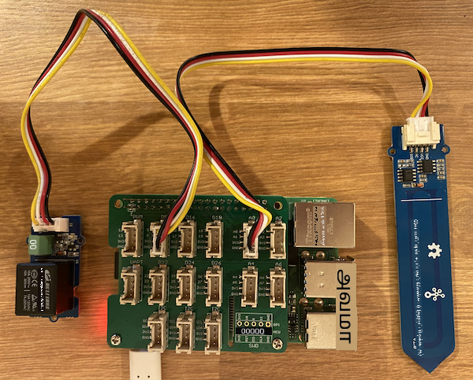

<!--
CO_OP_TRANSLATOR_METADATA:
{
  "original_hash": "66b81165e60f8f169bd52a401b6a0f8b",
  "translation_date": "2025-10-11T12:46:42+00:00",
  "source_file": "2-farm/lessons/3-automated-plant-watering/pi-relay.md",
  "language_code": "ta"
}
-->
# ரிலேவை கட்டுப்படுத்துதல் - ராஸ்பெர்ரி பை

இந்த பாடத்தின் இந்த பகுதியில், மண் ஈரப்பதம் சென்சாருடன் சேர்த்து உங்கள் ராஸ்பெர்ரி பை-க்கு ஒரு ரிலேவை சேர்த்து, மண் ஈரப்பதம் அளவை அடிப்படையாகக் கொண்டு அதை கட்டுப்படுத்துவீர்கள்.

## ஹார்ட்வேர்கள்

ராஸ்பெர்ரி பைக்கு ஒரு ரிலே தேவை.

நீங்கள் பயன்படுத்தும் ரிலே [Grove relay](https://www.seeedstudio.com/Grove-Relay.html) ஆகும், இது ஒரு சாதாரணமாக திறந்த ரிலே (signal அனுப்பப்படாத போது output circuit திறந்த அல்லது இணைக்கப்படாத நிலையில் இருக்கும்) ஆகும், இது 250V மற்றும் 10A வரை output circuits-ஐ கையாள முடியும்.

இது ஒரு டிஜிட்டல் actuator ஆகும், எனவே Grove Base Hat-இல் உள்ள டிஜிட்டல் பின்களுடன் இணைக்கப்படுகிறது.

### ரிலேவை இணைத்தல்

Grove ரிலே ராஸ்பெர்ரி பை-க்கு இணைக்கப்படலாம்.

#### பணிகள்

ரிலேவை இணைக்கவும்.


1. Grove கேபிளின் ஒரு முனையை ரிலேவில் உள்ள சாக்கெட்டில் செருகவும். இது ஒரு வழியில் மட்டுமே செருகப்படும்.

1. ராஸ்பெர்ரி பை ஆஃப் நிலையில் இருக்கும் போது, Grove கேபிளின் மற்ற முனையை **D5** என்று குறிக்கப்பட்ட டிஜிட்டல் சாக்கெட்டில் இணைக்கவும், இது பை-க்கு இணைக்கப்பட்ட Grove Base Hat-இல் உள்ளது. இந்த சாக்கெட் GPIO பின்களுக்குப் பக்கத்தில் உள்ள சாக்கெட்டுகளின் வரிசையில் இடது பக்கம் இரண்டாவது சாக்கெட் ஆகும். மண் ஈரப்பதம் சென்சாரை **A0** சாக்கெட்டில் இணைக்கப்பட்ட நிலையில் விடவும்.



1. மண் ஈரப்பதம் சென்சாரை மண்ணில் செருகவும், இது முந்தைய பாடத்தில் இருந்து ஏற்கனவே செருகப்பட்டிருக்கவில்லை என்றால்.

## ரிலேவை நிரலாக்குதல்

இப்போது ராஸ்பெர்ரி பை இணைக்கப்பட்ட ரிலேவை பயன்படுத்த நிரலாக்கப்படலாம்.

### பணிகள்

சாதனத்தை நிரலாக்கவும்.

1. பை-யை power on செய்யவும் மற்றும் boot ஆக காத்திருக்கவும்.

1. முந்தைய பாடத்தில் இருந்து `soil-moisture-sensor` திட்டத்தை VS Code-இல் திறக்கவும், இது ஏற்கனவே திறக்கப்படவில்லை என்றால். நீங்கள் இந்த திட்டத்தில் சேர்க்கவிருக்கிறீர்கள்.

1. `app.py` கோப்பில் உள்ள import-களின் கீழே பின்வரும் குறியீட்டை சேர்க்கவும்:

    ```python
    from grove.grove_relay import GroveRelay
    ```
  
    இந்த அறிக்கையால் Grove Python libraries-இல் இருந்து `GroveRelay`-ஐ import செய்து Grove ரிலேவை தொடர்பு கொள்ள முடியும்.

1. `ADC` வகுப்பின் அறிவிப்பின் கீழே பின்வரும் குறியீட்டை சேர்த்து ஒரு `GroveRelay` instance உருவாக்கவும்:

    ```python
    relay = GroveRelay(5)
    ```
  
    இது **D5** பினைப் பயன்படுத்தி ஒரு ரிலே உருவாக்குகிறது, நீங்கள் ரிலேவை இணைத்த டிஜிட்டல் பின்.

1. ரிலே வேலை செய்கிறதா என்பதை சோதிக்க, பின்வரும் குறியீட்டை `while True:` loop-இல் சேர்க்கவும்:

    ```python
    relay.on()
    time.sleep(.5)
    relay.off()
    ```
  
    குறியீடு ரிலேவை ஆன் செய்கிறது, 0.5 விநாடிகள் காத்திருக்கிறது, பின்னர் ரிலேவை ஆஃப் செய்கிறது.

1. Python app-ஐ இயக்கவும். ரிலே ஒவ்வொரு 10 விநாடிகளுக்கும் ஆன் மற்றும் ஆஃப் ஆகும், ஆன் மற்றும் ஆஃப் ஆகும் இடையே அரை விநாடி தாமதம் இருக்கும். ரிலே ஆன் ஆகும் போது ஒரு கிளிக் ஒலி கேட்கும், பின்னர் ஆஃப் ஆகும் போது மற்றொரு கிளிக் ஒலி கேட்கும். ரிலே ஆன் ஆகும் போது Grove போர்டில் உள்ள LED ஒளிரும், பின்னர் ஆஃப் ஆகும் போது மங்கும்.

    

## மண் ஈரப்பதம் மூலம் ரிலேவை கட்டுப்படுத்துதல்

இப்போது ரிலே வேலை செய்கிறது, இது மண் ஈரப்பதம் அளவுகளை அடிப்படையாகக் கொண்டு கட்டுப்படுத்தப்படலாம்.

### பணிகள்

ரிலேவை கட்டுப்படுத்தவும்.

1. ரிலேவை சோதிக்க சேர்த்த 3 வரிகளை நீக்கவும். அவற்றை பின்வரும் குறியீட்டால் மாற்றவும்:

    ```python
    if soil_moisture > 450:
        print("Soil Moisture is too low, turning relay on.")
        relay.on()
    else:
        print("Soil Moisture is ok, turning relay off.")
        relay.off()
    ```
  
    இந்த குறியீடு மண் ஈரப்பதம் சென்சாரில் இருந்து மண் ஈரப்பதம் அளவை சரிபார்க்கிறது. இது 450-ஐ மீறினால், ரிலேவை ஆன் செய்கிறது, 450-க்கு கீழே சென்றால் ரிலேவை ஆஃப் செய்கிறது.

    > 💁 Capacitive மண் ஈரப்பதம் சென்சார் குறைவான மண் ஈரப்பதம் அளவைப் படிக்கிறது, மண்ணில் ஈரப்பதம் அதிகமாக இருக்கும் போது, மற்றும் மாறாக.

1. Python app-ஐ இயக்கவும். மண் ஈரப்பதம் அளவைப் பொறுத்து ரிலே ஆன் அல்லது ஆஃப் ஆகும். உலர்ந்த மண்ணில் முயற்சிக்கவும், பின்னர் தண்ணீர் சேர்க்கவும்.

    ```output
    Soil Moisture: 638
    Soil Moisture is too low, turning relay on.
    Soil Moisture: 452
    Soil Moisture is too low, turning relay on.
    Soil Moisture: 347
    Soil Moisture is ok, turning relay off.
    ```
  
> 💁 இந்த குறியீட்டை [code-relay/pi](../../../../../2-farm/lessons/3-automated-plant-watering/code-relay/pi) கோப்புறையில் காணலாம்.

😀 உங்கள் மண் ஈரப்பதம் சென்சார் ரிலேவை கட்டுப்படுத்தும் நிரல் வெற்றிகரமாக முடிந்தது!

---

**அறிவிப்பு**:  
இந்த ஆவணம் [Co-op Translator](https://github.com/Azure/co-op-translator) என்ற AI மொழிபெயர்ப்பு சேவையை பயன்படுத்தி மொழிபெயர்க்கப்பட்டுள்ளது. நாங்கள் துல்லியத்திற்காக முயற்சிக்கிறோம், ஆனால் தானியங்கி மொழிபெயர்ப்புகளில் பிழைகள் அல்லது தவறுகள் இருக்கக்கூடும் என்பதை கவனத்தில் கொள்ளவும். அதன் சொந்த மொழியில் உள்ள மூல ஆவணம் அதிகாரப்பூர்வ ஆதாரமாக கருதப்பட வேண்டும். முக்கியமான தகவல்களுக்கு, தொழில்முறை மனித மொழிபெயர்ப்பு பரிந்துரைக்கப்படுகிறது. இந்த மொழிபெயர்ப்பைப் பயன்படுத்துவதால் ஏற்படும் எந்த தவறான புரிதல்களுக்கும் அல்லது தவறான விளக்கங்களுக்கும் நாங்கள் பொறுப்பல்ல.