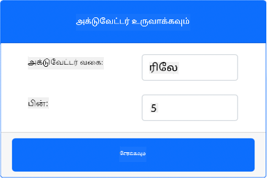
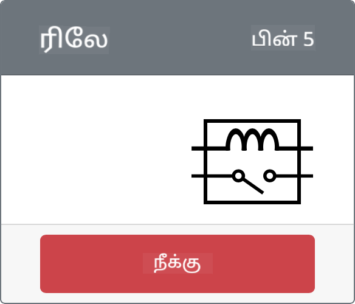

<!--
CO_OP_TRANSLATOR_METADATA:
{
  "original_hash": "f8f541ee945545017a51aaf309aa37c3",
  "translation_date": "2025-10-11T12:47:32+00:00",
  "source_file": "2-farm/lessons/3-automated-plant-watering/virtual-device-relay.md",
  "language_code": "ta"
}
-->
# ரிலேவை கட்டுப்படுத்துதல் - மெய்நிகர் IoT சாதனம்

இந்த பாடத்தின் இந்த பகுதியில், மண் ஈரப்பதம் சென்சாருடன் சேர்த்து உங்கள் மெய்நிகர் IoT சாதனத்தில் ஒரு ரிலேவை சேர்த்து, மண் ஈரப்பதம் அளவை அடிப்படையாகக் கொண்டு அதை கட்டுப்படுத்துவீர்கள்.

## மெய்நிகர் ஹார்ட்வேரு

மெய்நிகர் IoT சாதனம் ஒரு சிமுலேட்டட் Grove ரிலேவை பயன்படுத்தும். இது Raspberry Pi மற்றும் ஒரு பிசிகல் Grove ரிலேவைப் பயன்படுத்துவதற்கான லேபை ஒரே மாதிரியாக வைத்திருக்கிறது.

ஒரு பிசிகல் IoT சாதனத்தில், ரிலே ஒரு சாதாரணமாக திறந்த ரிலே (அதாவது, ரிலேவுக்கு சிக்னல் அனுப்பப்படாதபோது அவுட்புட் சர்க்யூட் திறந்த அல்லது இணைக்கப்படாத நிலையில் இருக்கும்). இவ்வகை ரிலே 250V மற்றும் 10A வரை அவுட்புட் சர்க்யூட்டுகளை கையாள முடியும்.

### CounterFit-க்கு ரிலேவை சேர்க்கவும்

மெய்நிகர் ரிலேவைப் பயன்படுத்த, அதை CounterFit ஆப்பில் சேர்க்க வேண்டும்.

#### பணிகள்

CounterFit ஆப்பில் ரிலேவை சேர்க்கவும்.

1. VS Code-ல் `soil-moisture-sensor` திட்டத்தை கடந்த பாடத்தில் இருந்து திறக்கவும், அது ஏற்கனவே திறக்கப்படவில்லை என்றால். நீங்கள் இந்த திட்டத்தில் சேர்க்கப் போகிறீர்கள்.

1. CounterFit வலை ஆப் இயங்குகிறதா என்பதை உறுதிப்படுத்தவும்.

1. ரிலேவை உருவாக்கவும்:

    1. *Actuators* பானலில் உள்ள *Create actuator* பெட்டியில், *Actuator type* பெட்டியைத் திறந்து *Relay* என்பதைத் தேர்ந்தெடுக்கவும்.

    1. *Pin* ஐ *5* ஆக அமைக்கவும்.

    1. **Add** பொத்தானைத் தேர்ந்தெடுத்து Pin 5-ல் ரிலேவை உருவாக்கவும்.

    

    ரிலே உருவாக்கப்பட்டு actuators பட்டியலில் தோன்றும்.

    

## ரிலேவை நிரலாக்கம் செய்யவும்

மண் ஈரப்பதம் சென்சார் ஆப் இப்போது மெய்நிகர் ரிலேவைப் பயன்படுத்த நிரலாக்கப்படலாம்.

### பணிகள்

மெய்நிகர் சாதனத்தை நிரலாக்கவும்.

1. VS Code-ல் `soil-moisture-sensor` திட்டத்தை கடந்த பாடத்தில் இருந்து திறக்கவும், அது ஏற்கனவே திறக்கப்படவில்லை என்றால். நீங்கள் இந்த திட்டத்தில் சேர்க்கப் போகிறீர்கள்.

1. `app.py` கோப்பில் உள்ள ஏற்கனவே உள்ள இறக்குமதி வரிகளின் கீழே பின்வரும் குறியீட்டைச் சேர்க்கவும்:

    ```python
    from counterfit_shims_grove.grove_relay import GroveRelay
    ```

    இந்த அறிக்கையால் Grove Python shim நூலகங்களில் இருந்து `GroveRelay` இறக்குமதி செய்யப்படுகிறது, இது மெய்நிகர் Grove ரிலேவுடன் தொடர்பு கொள்ள உதவுகிறது.

1. `ADC` வகுப்பின் அறிவிப்பின் கீழே பின்வரும் குறியீட்டைச் சேர்த்து `GroveRelay` இன்ஸ்டன்ஸ் உருவாக்கவும்:

    ```python
    relay = GroveRelay(5)
    ```

    இது **5** பினை பயன்படுத்தி ரிலேவை உருவாக்குகிறது, நீங்கள் ரிலேவை இணைத்த பின்.

1. ரிலே வேலை செய்கிறதா என்பதை சோதிக்க, `while True:` லூப்பில் பின்வருவதைச் சேர்க்கவும்:

    ```python
    relay.on()
    time.sleep(.5)
    relay.off()
    ```

    குறியீடு ரிலேவை ஆன் செய்கிறது, 0.5 விநாடிகள் காத்திருந்து, பின்னர் ரிலேவை ஆஃப் செய்கிறது.

1. Python ஆப்பை இயக்கவும். ரிலே ஒவ்வொரு 10 விநாடிகளுக்கும் ஆன் மற்றும் ஆஃப் ஆகும், ஆன் மற்றும் ஆஃப் ஆகும் இடையில் அரை விநாடி தாமதம் இருக்கும். CounterFit ஆப்பில் மெய்நிகர் ரிலே ஆன் மற்றும் ஆஃப் ஆகும் போது மூடப்பட்டு திறக்கப்பட்டு காணப்படும்.

    

## மண் ஈரப்பதம் மூலம் ரிலேவை கட்டுப்படுத்தவும்

இப்போது ரிலே வேலை செய்கிறது, மண் ஈரப்பதம் அளவீடுகளுக்கு பதிலளிக்க அதை கட்டுப்படுத்தலாம்.

### பணிகள்

ரிலேவை கட்டுப்படுத்தவும்.

1. ரிலேவை சோதிக்க சேர்த்த 3 வரிகளை நீக்கவும். அவற்றின் இடத்தில் பின்வரும் குறியீட்டை மாற்றவும்:

    ```python
    if soil_moisture > 450:
        print("Soil Moisture is too low, turning relay on.")
        relay.on()
    else:
        print("Soil Moisture is ok, turning relay off.")
        relay.off()
    ```

    இந்த குறியீடு மண் ஈரப்பதம் சென்சாரிலிருந்து மண் ஈரப்பதம் அளவைச் சரிபார்க்கிறது. அது 450-ஐ மீறினால், ரிலேவை ஆன் செய்கிறது, 450-க்கு கீழே சென்றால் அதை ஆஃப் செய்கிறது.

    > 💁 கெபாசிடிவ் மண் ஈரப்பதம் சென்சார் குறைவான மண் ஈரப்பதம் அளவைப் படிக்கிறது, மண்ணில் அதிக ஈரப்பதம் உள்ளது, மேலும் மாறாக.

1. Python ஆப்பை இயக்கவும். மண் ஈரப்பதம் அளவுகளுக்கு ஏற்ப ரிலே ஆன் அல்லது ஆஃப் ஆகும். மண் ஈரப்பதம் சென்சாருக்கான *Value* அல்லது *Random* அமைப்புகளை மாற்றி மதிப்பு மாறுவதைப் பாருங்கள்.

    ```output
    Soil Moisture: 638
    Soil Moisture is too low, turning relay on.
    Soil Moisture: 452
    Soil Moisture is too low, turning relay on.
    Soil Moisture: 347
    Soil Moisture is ok, turning relay off.
    ```

> 💁 இந்த குறியீட்டை [code-relay/virtual-device](../../../../../2-farm/lessons/3-automated-plant-watering/code-relay/virtual-device) கோப்புறையில் காணலாம்.

😀 உங்கள் மெய்நிகர் மண் ஈரப்பதம் சென்சார் ரிலேவை கட்டுப்படுத்தும் நிரல் வெற்றிகரமாக முடிந்தது!

---

**குறிப்பு**:  
இந்த ஆவணம் [Co-op Translator](https://github.com/Azure/co-op-translator) என்ற AI மொழிபெயர்ப்பு சேவையைப் பயன்படுத்தி மொழிபெயர்க்கப்பட்டுள்ளது. நாங்கள் துல்லியத்திற்காக முயற்சிக்கின்றோம், ஆனால் தானியங்கி மொழிபெயர்ப்புகளில் பிழைகள் அல்லது தவறான தகவல்கள் இருக்கக்கூடும் என்பதை கவனத்தில் கொள்ளவும். அதன் தாய்மொழியில் உள்ள மூல ஆவணம் அதிகாரப்பூர்வ ஆதாரமாக கருதப்பட வேண்டும். முக்கியமான தகவல்களுக்கு, தொழில்முறை மனித மொழிபெயர்ப்பு பரிந்துரைக்கப்படுகிறது. இந்த மொழிபெயர்ப்பைப் பயன்படுத்துவதால் ஏற்படும் எந்த தவறான புரிதல்கள் அல்லது தவறான விளக்கங்களுக்கு நாங்கள் பொறுப்பல்ல.