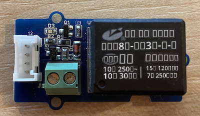
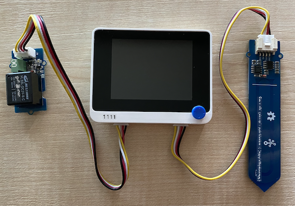

<!--
CO_OP_TRANSLATOR_METADATA:
{
  "original_hash": "f3c5d8afa2ef6a0b425ef8ff20615cb4",
  "translation_date": "2025-10-11T12:44:03+00:00",
  "source_file": "2-farm/lessons/3-automated-plant-watering/wio-terminal-relay.md",
  "language_code": "ta"
}
-->
# ரிலேவை கட்டுப்படுத்துதல் - Wio Terminal

இந்த பாடத்தின் இந்த பகுதியில், மண் ஈரப்பதம் சென்சாருடன் சேர்த்து Wio Terminal-க்கு ஒரு ரிலேவை சேர்த்து, மண் ஈரப்பதம் அளவை அடிப்படையாகக் கொண்டு அதை கட்டுப்படுத்துவீர்கள்.

## ஹார்ட்வேர்கள்

Wio Terminal-க்கு ஒரு ரிலே தேவை.

நீங்கள் பயன்படுத்தும் ரிலே [Grove relay](https://www.seeedstudio.com/Grove-Relay.html) ஆகும், இது சாதாரணமாக திறந்த ரிலே (signal அனுப்பப்படாதபோது output circuit திறந்த நிலையில் இருக்கும் அல்லது இணைக்கப்படாத நிலையில் இருக்கும்) ஆகும், இது 250V மற்றும் 10A வரை output circuits-ஐ கையாள முடியும்.

இது ஒரு டிஜிட்டல் actuator ஆகும், எனவே Wio Terminal-இன் டிஜிட்டல் பின்களுடன் இணைக்கப்படுகிறது. மண் ஈரப்பதம் சென்சார் ஏற்கனவே analog/digital port-இல் இணைக்கப்பட்டுள்ளது, எனவே இது மற்ற port-இல் இணைக்கப்படுகிறது, இது I<sub>2</sub>C மற்றும் டிஜிட்டல் port ஆகும்.

### ரிலேவை இணைக்கவும்

Grove relay Wio Terminal-இன் டிஜிட்டல் port-இல் இணைக்கப்படலாம்.

#### பணிகள்

ரிலேவை இணைக்கவும்.



1. Grove cable-இன் ஒரு முனையை ரிலேவில் உள்ள socket-இல் செருகவும். இது ஒரு வழியில் மட்டுமே செருகப்படும்.

1. Wio Terminal உங்கள் கணினி அல்லது பிற power supply-இல் இருந்து துண்டிக்கப்பட்ட நிலையில், Grove cable-இன் மற்ற முனையை Wio Terminal-இன் திரையைப் பார்க்கும் போது இடது பக்க Grove socket-இல் இணைக்கவும். மண் ஈரப்பதம் சென்சார் வலது பக்க socket-இல் இணைக்கப்பட்ட நிலையில் இருக்கட்டும்.



1. மண் ஈரப்பதம் சென்சாரை மண்ணில் செருகவும், இது முந்தைய பாடத்தில் இருந்து ஏற்கனவே செருகப்பட்டிருக்காவிட்டால்.

## ரிலேவை நிரலாக்கம் செய்யவும்

இப்போது Wio Terminal இணைக்கப்பட்ட ரிலேவை பயன்படுத்த நிரலாக்கப்படலாம்.

### பணிகள்

சாதனத்தை நிரலாக்கவும்.

1. முந்தைய பாடத்தில் இருந்து `soil-moisture-sensor` திட்டத்தை VS Code-இல் திறக்கவும், இது ஏற்கனவே திறக்கப்படவில்லை என்றால். நீங்கள் இந்த திட்டத்தில் சேர்க்கவிருக்கிறீர்கள்.

2. இந்த actuator-க்கு ஒரு library இல்லை - இது ஒரு டிஜிட்டல் actuator ஆகும், இது high அல்லது low signal மூலம் கட்டுப்படுத்தப்படுகிறது. அதை இயக்க, நீங்கள் pin-க்கு high signal (3.3V) அனுப்ப வேண்டும், அதை நிறுத்த low signal (0V) அனுப்ப வேண்டும். Arduino-இன் [`digitalWrite`](https://www.arduino.cc/reference/en/language/functions/digital-io/digitalwrite/) function-ஐ பயன்படுத்தி இதை செய்யலாம். முதலில், `setup` function-இன் கீழே பின்வரும் code-ஐ சேர்த்து, I<sub>2</sub>C/digital port-ஐ output pin ஆக அமைக்கவும், voltage-ஐ ரிலேக்கு அனுப்ப:

    ```cpp
    pinMode(PIN_WIRE_SCL, OUTPUT);
    ```

    `PIN_WIRE_SCL` என்பது I<sub>2</sub>C/digital port-இன் port number ஆகும்.

1. ரிலே வேலை செய்கிறதா என்பதை சோதிக்க, `loop` function-இல், இறுதி `delay`-க்கு கீழே பின்வரும் code-ஐ சேர்க்கவும்:

    ```cpp
    digitalWrite(PIN_WIRE_SCL, HIGH);
    delay(500);
    digitalWrite(PIN_WIRE_SCL, LOW);
    ```

    இந்த code, ரிலே இணைக்கப்பட்ட pin-க்கு high signal-ஐ எழுதுகிறது, அதை இயக்க, 500ms (அரை வினாடி) காத்திருக்கிறது, பின்னர் low signal-ஐ எழுதுகிறது, ரிலேவை நிறுத்த.

1. Code-ஐ Wio Terminal-க்கு build செய்து upload செய்யவும்.

1. Code upload செய்யப்பட்டவுடன், ரிலே ஒவ்வொரு 10 வினாடிகளுக்கும் ஒரு முறை இயக்கப்படும் மற்றும் நிறுத்தப்படும், இயக்கம் மற்றும் நிறுத்தம் இடையே அரை வினாடி தாமதம் இருக்கும். ரிலே இயக்கப்படும் போது click செய்யும், பின்னர் click செய்து நிறுத்தப்படும். ரிலே இயக்கப்படும் போது Grove board-இல் உள்ள LED ஒளிரும், பின்னர் ரிலே நிறுத்தப்படும் போது LED அணைந்துவிடும்.

    

## மண் ஈரப்பதம் மூலம் ரிலேவை கட்டுப்படுத்துதல்

இப்போது ரிலே வேலை செய்கிறது, இது மண் ஈரப்பதம் அளவீடுகளுக்கு பதிலளிக்க கட்டுப்படுத்தப்படலாம்.

### பணிகள்

ரிலேவை கட்டுப்படுத்தவும்.

1. ரிலேவை சோதிக்க சேர்த்த 3 வரி code-ஐ நீக்கவும். அதை பின்வரும் code-ஆல் மாற்றவும்:

    ```cpp
    if (soil_moisture > 450)
    {
        Serial.println("Soil Moisture is too low, turning relay on.");
        digitalWrite(PIN_WIRE_SCL, HIGH);
    }
    else
    {
        Serial.println("Soil Moisture is ok, turning relay off.");
        digitalWrite(PIN_WIRE_SCL, LOW);
    }
    ```

    இந்த code மண் ஈரப்பதம் சென்சாரில் இருந்து மண் ஈரப்பதம் அளவை சரிபார்க்கிறது. அது 450-க்கு மேல் இருந்தால், ரிலேவை இயக்குகிறது, 450-க்கு கீழே சென்றால், அதை நிறுத்துகிறது.

    > 💁 Capacitive மண் ஈரப்பதம் சென்சார் குறைவான மண் ஈரப்பதம் அளவைப் படிக்கிறது, மண்ணில் ஈரப்பதம் அதிகமாக இருக்கும், மற்றும் மாறாக.

1. Code-ஐ Wio Terminal-க்கு build செய்து upload செய்யவும்.

1. Serial monitor மூலம் சாதனத்தை கண்காணிக்கவும். மண் ஈரப்பதம் அளவைப் பொறுத்து ரிலே இயக்கப்படும் அல்லது நிறுத்தப்படும். உலர்ந்த மண்ணில் முயற்சிக்கவும், பின்னர் தண்ணீர் சேர்க்கவும்.

    ```output
    Soil Moisture: 638
    Soil Moisture is too low, turning relay on.
    Soil Moisture: 452
    Soil Moisture is too low, turning relay on.
    Soil Moisture: 347
    Soil Moisture is ok, turning relay off.
    ```

> 💁 இந்த code-ஐ [code-relay/wio-terminal](../../../../../2-farm/lessons/3-automated-plant-watering/code-relay/wio-terminal) கோப்பகத்தில் காணலாம்.

😀 உங்கள் மண் ஈரப்பதம் சென்சார் ரிலேவை கட்டுப்படுத்தும் நிரல் வெற்றிகரமாக முடிந்தது!

---

**குறிப்பு**:  
இந்த ஆவணம் [Co-op Translator](https://github.com/Azure/co-op-translator) என்ற AI மொழிபெயர்ப்பு சேவையைப் பயன்படுத்தி மொழிபெயர்க்கப்பட்டுள்ளது. நாங்கள் துல்லியத்திற்காக முயற்சிக்கின்றோம், ஆனால் தானியக்க மொழிபெயர்ப்புகளில் பிழைகள் அல்லது தவறான தகவல்கள் இருக்கக்கூடும் என்பதை கவனத்தில் கொள்ளவும். அதன் தாய்மொழியில் உள்ள மூல ஆவணம் அதிகாரப்பூர்வ ஆதாரமாக கருதப்பட வேண்டும். முக்கியமான தகவல்களுக்கு, தொழில்முறை மனித மொழிபெயர்ப்பு பரிந்துரைக்கப்படுகிறது. இந்த மொழிபெயர்ப்பைப் பயன்படுத்துவதால் ஏற்படும் எந்த தவறான புரிதல்கள் அல்லது தவறான விளக்கங்களுக்கு நாங்கள் பொறுப்பல்ல.