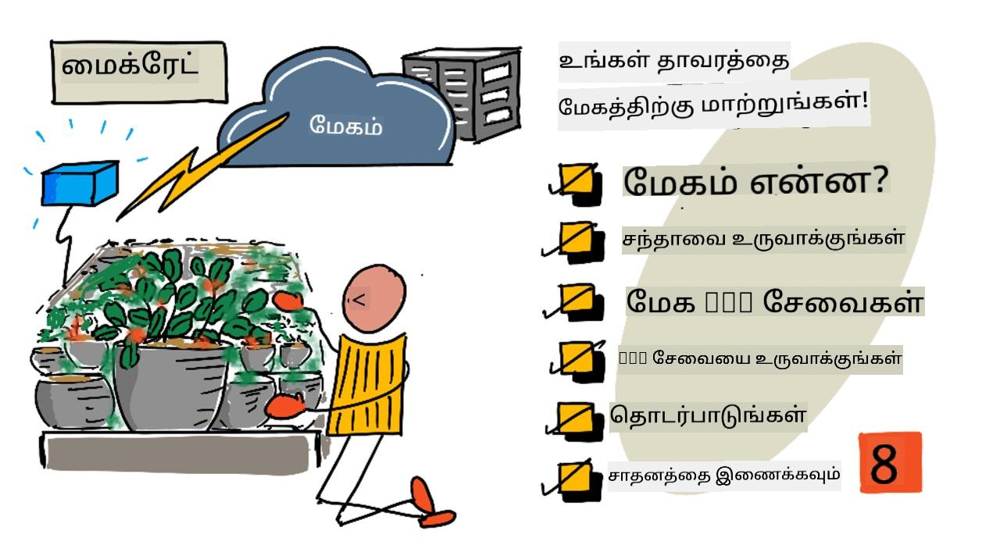
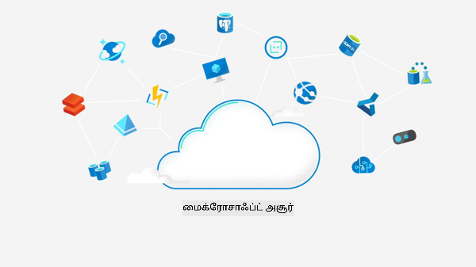

<!--
CO_OP_TRANSLATOR_METADATA:
{
  "original_hash": "4d8e7a066d75b625e7a979c14157041d",
  "translation_date": "2025-10-11T12:29:43+00:00",
  "source_file": "2-farm/lessons/4-migrate-your-plant-to-the-cloud/README.md",
  "language_code": "ta"
}
-->
# உங்கள் தாவரத்தை கிளவுட் சேவைக்கு மாற்றுங்கள்



> ஸ்கெட்ச் நோட்: [நித்யா நரசிம்மன்](https://github.com/nitya). பெரிய படத்தை பார்க்க படத்தை கிளிக் செய்யவும்.

இந்த பாடம் [IoT for Beginners Project 2 - Digital Agriculture series](https://youtube.com/playlist?list=PLmsFUfdnGr3yCutmcVg6eAUEfsGiFXgcx) என்ற [Microsoft Reactor](https://developer.microsoft.com/reactor/?WT.mc_id=academic-17441-jabenn) தொடர் பாடங்களில் ஒன்றாக கற்பிக்கப்பட்டது.

[](https://youtu.be/bNxjopXkhvk)

## பாடத்திற்கு முன் வினாடி வினா

[பாடத்திற்கு முன் வினாடி வினா](https://black-meadow-040d15503.1.azurestaticapps.net/quiz/15)

## அறிமுகம்

கடந்த பாடத்தில், உங்கள் தாவரத்தை ஒரு MQTT ப்ரோக்கருடன் இணைத்து, ஒரு சர்வர் கோடிலிருந்து ரிலேவை கட்டுப்படுத்துவது எப்படி என்பதை கற்றுக்கொண்டீர்கள். இது வீட்டிலிருந்து வணிக பண்ணைகளுக்கு வரை பயன்படுத்தப்படும் இணைய இணைக்கப்பட்ட தானியங்கி நீர்ப்பாசன அமைப்பின் மையமாக செயல்படுகிறது.

IoT சாதனம் பொதுவான MQTT ப்ரோக்கருடன் தொடர்பு கொண்டது, இது அடிப்படைகளை விளக்குவதற்கான ஒரு வழியாக இருந்தது. ஆனால் இது மிகவும் நம்பகமான அல்லது பாதுகாப்பான வழி அல்ல. இந்த பாடத்தில், கிளவுட் மற்றும் பொதுவான கிளவுட் சேவைகள் வழங்கும் IoT திறன்களைப் பற்றி நீங்கள் கற்றுக்கொள்வீர்கள். மேலும், உங்கள் தாவரத்தை பொதுவான MQTT ப்ரோக்கரிலிருந்து இந்த கிளவுட் சேவைகளில் ஒன்றுக்கு மாற்றுவது எப்படி என்பதை கற்றுக்கொள்வீர்கள்.

இந்த பாடத்தில் நாம் கற்றுக்கொள்ளப்போகிறோம்:

* [கிளவுட் என்றால் என்ன?](../../../../../2-farm/lessons/4-migrate-your-plant-to-the-cloud)
* [கிளவுட் சந்தாதாரத்தை உருவாக்கவும்](../../../../../2-farm/lessons/4-migrate-your-plant-to-the-cloud)
* [கிளவுட் IoT சேவைகள்](../../../../../2-farm/lessons/4-migrate-your-plant-to-the-cloud)
* [கிளவுடில் ஒரு IoT சேவையை உருவாக்கவும்](../../../../../2-farm/lessons/4-migrate-your-plant-to-the-cloud)
* [IoT Hub உடன் தொடர்பு கொள்ளவும்](../../../../../2-farm/lessons/4-migrate-your-plant-to-the-cloud)
* [உங்கள் சாதனத்தை IoT சேவைக்கு இணைக்கவும்](../../../../../2-farm/lessons/4-migrate-your-plant-to-the-cloud)

## கிளவுட் என்றால் என்ன?

கிளவுட் வருவதற்கு முன், ஒரு நிறுவனம் தனது ஊழியர்களுக்கு (தரவுத்தொகுப்புகள் அல்லது கோப்பு சேமிப்பு போன்றவை) அல்லது பொதுமக்களுக்கு (வலைத்தளங்கள் போன்றவை) சேவைகளை வழங்க விரும்பினால், அவர்கள் ஒரு தரவுத்தள மையத்தை அமைத்து இயக்க வேண்டும். இது சில கணினிகளுடன் ஒரு அறையிலிருந்து பல கணினிகளுடன் ஒரு கட்டிடம் வரை மாறுபடும். நிறுவனம் அனைத்தையும் நிர்வகிக்க வேண்டும், அதாவது:

* கணினிகளை வாங்குதல்
* ஹார்ட்வேர் பராமரிப்பு
* மின்சாரம் மற்றும் குளிரூட்டல்
* நெட்வொர்க்கிங்
* பாதுகாப்பு, கட்டிடத்தையும் கணினிகளில் உள்ள மென்பொருளையும் பாதுகாப்பது
* மென்பொருள் நிறுவல் மற்றும் புதுப்பிப்புகள்

இது மிகவும் செலவாக இருக்கலாம், பல திறமையான ஊழியர்களை தேவைப்படுத்தும், மேலும் தேவையான போது மாற்றம் செய்ய மிகவும் மெதுவாக இருக்கும். உதாரணமாக, ஒரு ஆன்லைன் கடை ஒரு பண்டிகை பருவத்திற்கு முன் திட்டமிட வேண்டியிருந்தால், அவர்கள் பல மாதங்களுக்கு முன்பே கூடுதல் ஹார்ட்வேர் வாங்கி, அதை அமைத்து, மென்பொருளை நிறுவி, விற்பனை செயல்முறையை இயக்க வேண்டும். பண்டிகை பருவம் முடிந்ததும் விற்பனை மீண்டும் குறைந்துவிட்டால், அவர்கள் பணம் செலுத்திய கணினிகள் அடுத்த பிஸியான பருவம் வரை செயலற்ற நிலையில் இருக்கும்.

✅ இது நிறுவனங்களுக்கு விரைவாக செயல்பட உதவுமா? ஒரு பிரபலமான பிரபலத்தின் ஆடைகளை அணிந்ததன் மூலம் ஒரு ஆன்லைன் ஆடை விற்பனையாளர் திடீரென பிரபலமடைந்தால், திடீர் ஆர்டர்களின் வருகையை ஆதரிக்க தேவையான கணினி சக்தியை அவர்கள் விரைவாக அதிகரிக்க முடியுமா?

### மற்றவரின் கணினி

கிளவுட் பெரும்பாலும் 'மற்றவரின் கணினி' என்று நகைச்சுவையாக குறிப்பிடப்படுகிறது. ஆரம்பக் கருத்து எளிமையானது - கணினிகளை வாங்குவதற்குப் பதிலாக, மற்றவரின் கணினியை வாடகைக்கு எடுக்கலாம். மற்றவர்கள், கிளவுட் கணினி வழங்குநர்கள், பெரிய தரவுத்தள மையங்களை நிர்வகிப்பார்கள். அவர்கள் ஹார்ட்வேர் வாங்கி நிறுவுதல், மின்சாரம் மற்றும் குளிரூட்டல், நெட்வொர்க்கிங், கட்டிட பாதுகாப்பு, ஹார்ட்வேர் மற்றும் மென்பொருள் புதுப்பிப்புகள் போன்ற அனைத்தையும் பொறுப்பேற்கிறார்கள். வாடிக்கையாளராக, உங்களுக்கு தேவையான கணினிகளை வாடகைக்கு எடுத்து, தேவை அதிகரிக்கும்போது அதிகமாகவும், தேவை குறையும்போது குறைவாகவும் வாடகைக்கு எடுக்கலாம். இந்த கிளவுட் தரவுத்தள மையங்கள் உலகம் முழுவதும் உள்ளன.


இந்த தரவுத்தள மையங்கள் பல சதுர கிலோமீட்டர் பரப்பளவில் இருக்கலாம். மேலே உள்ள படங்கள் சில ஆண்டுகளுக்கு முன்பு மைக்ரோசாஃப்ட் கிளவுட் தரவுத்தள மையத்தில் எடுக்கப்பட்டவை, ஆரம்ப அளவையும் திட்டமிடப்பட்ட விரிவாக்கத்தையும் காட்டுகின்றன. விரிவாக்கத்திற்காக சுத்தம் செய்யப்பட்ட பகுதி 5 சதுர கிலோமீட்டருக்கு மேல் உள்ளது.

> 💁 இந்த தரவுத்தள மையங்கள் மிகப்பெரிய அளவிலான மின்சாரத்தை தேவைப்படுத்துவதால், சிலவற்றுக்கு தங்களுக்கே சொந்த மின்நிலையங்கள் உள்ளன. அவை மிகவும் சுற்றுச்சூழலுக்கு உகந்தவை. சிறிய தரவுத்தள மையங்களின் எண்ணிக்கையை விட இவை அதிக திறனுடன் இயங்குகின்றன, பெரும்பாலும் புதுப்பிக்கத்தக்க ஆற்றலால் இயங்குகின்றன, மற்றும் கழிவுகளை குறைக்க, தண்ணீர் பயன்பாட்டை குறைக்க, மற்றும் தரவுத்தள மையங்களை அமைக்க வெட்டப்பட்ட காடுகளை மீண்டும் வளர்க்க கிளவுட் வழங்குநர்கள் கடுமையாக உழைக்கிறார்கள். இதைப் பற்றிய மேலும் தகவலுக்கு [Azure sustainability site](https://azure.microsoft.com/global-infrastructure/sustainability/?WT.mc_id=academic-17441-jabenn) பார்க்கவும்.

✅ சில ஆராய்ச்சிகளைச் செய்யுங்கள்: [Microsoft Azure](https://azure.microsoft.com/?WT.mc_id=academic-17441-jabenn) அல்லது [GCP from Google](https://cloud.google.com) போன்ற முக்கியமான கிளவுட்களைப் பற்றி படியுங்கள். அவர்களிடம் எத்தனை தரவுத்தள மையங்கள் உள்ளன, அவை உலகின் எந்தெந்த இடங்களில் உள்ளன?

கிளவுட் சேவைகளைப் பயன்படுத்துவதன் மூலம் நிறுவனங்கள் செலவுகளை குறைக்க முடியும், மேலும் அவர்கள் சிறந்த முறையில் செய்யும் செயல்பாடுகளில் கவனம் செலுத்த முடியும். இதனால், அவர்கள் தனிப்பட்ட தரவுத்தள மையங்களை வாடகைக்கு எடுக்கவோ அல்லது வாங்கவோ தேவையில்லை. அதற்கு பதிலாக, அவர்கள் கிளவுட் வழங்குநருக்கு ஒரு மாதாந்திர கட்டணத்தை செலுத்தி அனைத்தையும் பராமரிக்க அனுமதிக்கலாம்.

கிளவுட் வழங்குநர் பொருளாதார அளவீடுகளைப் பயன்படுத்தி செலவுகளை குறைக்க முடியும், குறைந்த செலவில் கணினிகளை மொத்தமாக வாங்குதல், பராமரிப்புக்கான வேலைச்சுமையை குறைக்க கருவிகளை மேம்படுத்துதல், மற்றும் கிளவுட் சேவையை மேம்படுத்த தங்களுக்கே உரிய ஹார்ட்வேர் வடிவமைத்து கட்டுதல் போன்றவற்றில் முதலீடு செய்வார்கள்.

### மைக்ரோசாஃப்ட் Azure

Azure என்பது மைக்ரோசாஃப்ட் நிறுவனத்தின் டெவலப்பர் கிளவுட் ஆகும், மேலும் இந்த பாடங்களில் நீங்கள் பயன்படுத்தப்போகும் கிளவுட் இதுவே. கீழே உள்ள வீடியோ Azure பற்றிய ஒரு சுருக்கமான பார்வையை வழங்குகிறது:

[](https://www.microsoft.com/videoplayer/embed/RE4Ibng?WT.mc_id=academic-17441-jabenn)

## கிளவுட் சந்தாதாரத்தை உருவாக்கவும்

கிளவுட் சேவைகளைப் பயன்படுத்த, நீங்கள் ஒரு கிளவுட் வழங்குநருடன் சந்தாதாரமாக பதிவு செய்ய வேண்டும். இந்த பாடத்திற்காக, நீங்கள் மைக்ரோசாஃப்ட் Azure சந்தாதாரமாக பதிவு செய்ய வேண்டும். உங்களிடம் ஏற்கனவே Azure சந்தா இருந்தால், இந்த பணியை தவிர்க்கலாம். இங்கு விவரிக்கப்பட்டுள்ள சந்தா விவரங்கள் எழுதும் நேரத்தில் சரியாக உள்ளன, ஆனால் மாற்றப்படலாம்.

> 💁 நீங்கள் இந்த பாடங்களை உங்கள் பள்ளி மூலம் அணுகினால், உங்களுக்கு ஏற்கனவே ஒரு Azure சந்தா கிடைக்கக்கூடும். உங்கள் ஆசிரியரிடம் சரிபார்க்கவும்.

Azure சந்தா பெறுவதற்கு இரண்டு வகையான இலவச சந்தாக்கள் உள்ளன:

* **Azure for Students** - இது 18 வயதுக்கு மேற்பட்ட மாணவர்களுக்காக வடிவமைக்கப்பட்ட சந்தா. இந்த சந்தாவிற்கு பதிவு செய்ய நீங்கள் கிரெடிட் கார்டு தேவைப்படாது, மேலும் நீங்கள் ஒரு மாணவராக இருப்பதை உறுதிப்படுத்த உங்கள் பள்ளி மின்னஞ்சல் முகவரியைப் பயன்படுத்த வேண்டும். பதிவு செய்தவுடன், கிளவுட் வளங்களைப் பயன்படுத்த US$100 மற்றும் IoT சேவையின் இலவச பதிப்பை பெறுவீர்கள். இது 12 மாதங்கள் செல்லுபடியாகும், மேலும் நீங்கள் தொடர்ந்து மாணவராக இருந்தால் ஒவ்வொரு ஆண்டும் புதுப்பிக்கலாம்.

* **Azure இலவச சந்தா** - இது மாணவரல்லாதவர்களுக்கு வழங்கப்படும் சந்தா. இந்த சந்தாவிற்கு பதிவு செய்ய நீங்கள் கிரெடிட் கார்டு தேவைப்படும், ஆனால் உங்கள் கார்டு கட்டணம் வசூலிக்கப்படாது, இது வெறும் நீங்கள் உண்மையான மனிதர் என்பதை உறுதிப்படுத்த மட்டுமே பயன்படுத்தப்படுகிறது. நீங்கள் முதல் 30 நாட்களில் எந்த சேவையிலும் பயன்படுத்த $200 கிரெடிட் மற்றும் Azure சேவைகளின் இலவச நிலைகளைப் பெறுவீர்கள். உங்கள் கிரெடிட் முடிந்த பிறகு, உங்கள் கார்டு கட்டணம் வசூலிக்கப்படாது, நீங்கள் அதை 'pay as you go' சந்தாவாக மாற்றாவிட்டால்.

> 💁 மைக்ரோசாஃப்ட் 18 வயதுக்கு குறைவான மாணவர்களுக்கு Azure for Students Starter சந்தாவை வழங்குகிறது, ஆனால் எழுதும் நேரத்தில் இது எந்த IoT சேவைகளையும் ஆதரிக்கவில்லை.

### பணி - ஒரு இலவச கிளவுட் சந்தாவிற்கு பதிவு செய்யவும்

நீங்கள் 18 வயதுக்கு மேற்பட்ட மாணவராக இருந்தால், நீங்கள் Azure for Students சந்தாவிற்கு பதிவு செய்யலாம். நீங்கள் உங்கள் பள்ளி மின்னஞ்சல் முகவரியுடன் சரிபார்க்க வேண்டும். இதை இரண்டு வழிகளில் செய்யலாம்:

* [education.github.com/pack](https://education.github.com/pack) இல் GitHub மாணவர் டெவலப்பர் தொகுப்பிற்கு பதிவு செய்யவும். இது உங்களுக்கு GitHub மற்றும் Microsoft Azure உட்பட பல கருவிகள் மற்றும் சலுகைகளை அணுக அனுமதிக்கிறது. டெவலப்பர் தொகுப்பிற்கு பதிவு செய்த பிறகு, நீங்கள் Azure for Students சலுகையை செயல்படுத்தலாம்.

* நேரடியாக [azure.microsoft.com/free/students](https://azure.microsoft.com/free/students/?WT.mc_id=academic-17441-jabenn) இல் Azure for Students கணக்கிற்கு பதிவு செய்யவும்.

> ⚠️ உங்கள் பள்ளி மின்னஞ்சல் முகவரி அங்கீகரிக்கப்படவில்லை என்றால், [இந்த ரெப்போவில் ஒரு பிரச்சினையை எழுப்பவும்](https://github.com/Microsoft/IoT-For-Beginners/issues), மேலும் அதை Azure for Students அனுமதி பட்டியலில் சேர்க்க முடியுமா என்பதை நாங்கள் பார்ப்போம்.

நீங்கள் மாணவரல்லாதவராக இருந்தால், அல்லது செல்லுபடியாகும் பள்ளி மின்னஞ்சல் முகவரி இல்லாவிட்டால், நீங்கள் Azure இலவச சந்தாவிற்கு பதிவு செய்யலாம்.

* [azure.microsoft.com/free](https://azure.microsoft.com/free/?WT.mc_id=academic-17441-jabenn) இல் Azure இலவச சந்தாவிற்கு பதிவு செய்யவும்.

## கிளவுட் IoT சேவைகள்

நீங்கள் பயன்படுத்திய பொதுவான சோதனை MQTT ப்ரோக்கர் கற்றுக்கொள்ள ஒரு சிறந்த கருவியாக இருந்தாலும், வணிக சூழலில் பயன்படுத்துவதற்கு சில குறைகள் உள்ளன:

* நம்பகத்தன்மை - இது எந்த நேரத்திலும் நிறுத்தப்படக்கூடிய உத்தரவாதமற்ற ஒரு இலவச சேவை
* பாதுகாப்பு - இது பொதுவானது, எனவே யாரும் உங்கள் டெலிமெட்ரியை கேட்கவோ அல்லது உங்கள் ஹார்ட்வேர் கட்டுப்படுத்த கட்டளைகளை அனுப்பவோ முடியும்
* செயல்திறன் - இது சில சோதனை செய்திகளுக்காக மட்டுமே வடிவமைக்கப்பட்டுள்ளது, எனவே அதிக எண்ணிக்கையிலான செய்திகளை அனுப்பும் போது இது சரியாக செயல்படாது
* கண்டறிதல் - எந்த சாதனங்கள் இணைக்கப்பட்டுள்ளன என்பதை அறிய வழியில்லை

கிளவுட் IoT சேவைகள் இந்த பிரச்சினைகளைத் தீர்க்கின்றன. இவை நம்பகத்தன்மையை உறுதிசெய்யும் பெரிய கிளவுட் வழங்குநர்களால் பராமரிக்கப்படுகின்றன. ஹேக்கர்கள் உங்கள் தரவுகளைப் படிக்கவோ அல்லது தவறான கட்டளைகளை அனுப்பவோ முடியாதவாறு பாதுகாப்பு அம்சங்கள் உள்ளடக்கப்பட்டுள்ளன. மேலும், இவை அதிக செயல்திறன் கொண்டவை, தினமும் பல மில்லியன் செய்திகளை கையாள முடியும், தேவைக்கு ஏற்ப கிளவுட் அளவீடுகளைப் பயன்படுத்துகின்றன.

> 💁 இந்த நன்மைகளுக்காக நீங்கள் மாதாந்திர கட்டணத்தை செலுத்த வேண்டும், ஆனால் பெரும்பாலான கிளவுட் வழங்குநர்கள் IoT சேவையின் இலவச பதிப்பை வழங்குகிறார்கள், இது ஒரு டெவலப்பருக்கு சேவையைப் பற்றி கற்றுக்கொள்ள போதுமானது. இந்த பாடத்தில் நீங்கள் ஒரு இலவச பதிப்பைப் பயன்படுத்துவீர்கள்.

IoT சாதனங்கள் ஒரு கிளவுட் சேவைக்கு சாதன SDK (சேவையின் அம்சங்களுடன் வேலை செய்யும் குறியீட்டை வழங்கும் ஒரு நூலகம்) அல்லது நேரடியாக MQTT அல்லது HTTP போன்ற தொடர்பு நெறிமுறையின் மூலம் இணைக
Azure-இல் கிடைக்கும் மேக சேவைகளை வலை அடிப்படையிலான போர்டல் அல்லது கட்டளைகள் வரிசை இடைமுகம் (CLI) மூலம் அமைக்கலாம். இந்த பணிக்கான CLI-ஐ நீங்கள் பயன்படுத்துவீர்கள்.

### பணிக்குறிப்பு - Azure CLI-ஐ நிறுவவும்

Azure CLI-ஐ பயன்படுத்த, முதலில் உங்கள் PC அல்லது Mac-ல் அதை நிறுவ வேண்டும்.

1. CLI-ஐ நிறுவ [Azure CLI ஆவணங்களை](https://docs.microsoft.com/cli/azure/install-azure-cli?WT.mc_id=academic-17441-jabenn) பின்பற்றவும்.

1. Azure CLI பல விரிவாக்கங்களை ஆதரிக்கிறது, இது பல்வேறு Azure சேவைகளை நிர்வகிக்க திறன்களை சேர்க்கிறது. உங்கள் கட்டளைகள் வரிசை அல்லது டெர்மினலில் இருந்து கீழே உள்ள கட்டளையை இயக்கி IoT விரிவாக்கத்தை நிறுவவும்:

    ```sh
    az extension add --name azure-iot
    ```

1. Azure CLI-இல் இருந்து உங்கள் Azure சந்தாவிற்கு உள்நுழைய கீழே உள்ள கட்டளையை இயக்கவும்:

    ```sh
    az login
    ```

    உங்கள் இயல்புநிலை உலாவியில் ஒரு வலைப்பக்கம் தொடங்கப்படும். Azure சந்தாவிற்கு நீங்கள் பதிவு செய்த கணக்கைப் பயன்படுத்தி உள்நுழையவும். உள்நுழைந்த பிறகு, உலாவி தாவலை மூடலாம்.

1. உங்களிடம் பல Azure சந்தாக்கள் இருந்தால், உதாரணமாக பள்ளி வழங்கிய ஒன்று மற்றும் உங்கள் சொந்த Azure for Students சந்தா, நீங்கள் பயன்படுத்த விரும்பும் ஒன்றைத் தேர்ந்தெடுக்க வேண்டும். உங்களுக்குக் கிடைக்கும் அனைத்து சந்தாக்களைப் பட்டியலிட கீழே உள்ள கட்டளையை இயக்கவும்:

    ```sh
    az account list --output table
    ```

    வெளியீட்டில், ஒவ்வொரு சந்தாவின் பெயரையும் அதன் `SubscriptionId` உடன் காணலாம்.

    ```output
    ➜  ~ az account list --output table
    Name                    CloudName    SubscriptionId                        State    IsDefault
    ----------------------  -----------  ------------------------------------  -------  -----------
    School-subscription     AzureCloud   cb30cde9-814a-42f0-a111-754cb788e4e1  Enabled  True
    Azure for Students      AzureCloud   fa51c31b-162c-4599-add6-781def2e1fbf  Enabled  False
    ```

    நீங்கள் பயன்படுத்த விரும்பும் சந்தாவைத் தேர்ந்தெடுக்க கீழே உள்ள கட்டளையை பயன்படுத்தவும்:

    ```sh
    az account set --subscription <SubscriptionId>
    ```

    `<SubscriptionId>` ஐ நீங்கள் பயன்படுத்த விரும்பும் சந்தாவின் Id-ஆக மாற்றவும். இந்த கட்டளையை இயக்கிய பிறகு, உங்கள் கணக்குகளைப் பட்டியலிட கட்டளையை மீண்டும் இயக்கவும். நீங்கள் அமைத்த சந்தாவிற்கு `IsDefault` பத்தியில் `True` எனக் குறிக்கப்படும்.

### பணிக்குறிப்பு - ஒரு Resource Group உருவாக்கவும்

Azure சேவைகள், IoT Hub instance-கள், virtual machine-கள், தரவுத்தொகைகள் அல்லது AI சேவைகள் போன்றவை **resources** என அழைக்கப்படுகின்றன. ஒவ்வொரு resource-ம் **Resource Group** எனப்படும் ஒரு அல்லது அதற்கு மேற்பட்ட resources-களின் தர்க்கரீதியான குழுவில் இருக்க வேண்டும்.

> 💁 Resource Group-களைப் பயன்படுத்துவதால், பல சேவைகளை ஒரே நேரத்தில் நிர்வகிக்க முடியும். உதாரணமாக, இந்த திட்டத்திற்கான அனைத்து பாடங்களையும் முடித்த பிறகு, resource group-ஐ நீக்கலாம், அதில் உள்ள அனைத்து resources-களும் தானாகவே நீக்கப்படும்.

1. உலகம் முழுவதும் பல Azure தரவுத்தொகைகள் உள்ளன, அவை பகுதிகளாகப் பிரிக்கப்பட்டுள்ளன. Azure resource அல்லது resource group-ஐ உருவாக்கும்போது, அதை எங்கு உருவாக்க வேண்டும் என்பதை குறிப்பிட வேண்டும். இடங்களின் பட்டியலைப் பெற கீழே உள்ள கட்டளையை இயக்கவும்:

    ```sh
    az account list-locations --output table
    ```

    நீங்கள் இடங்களின் பட்டியலைப் பார்க்கலாம். இந்த பட்டியல் நீளமாக இருக்கும்.

    > 💁 எழுதும் நேரத்தில், நீங்கள் 65 இடங்களில் deploy செய்யலாம்.

    ```output
        ➜  ~ az account list-locations --output table
    DisplayName               Name                 RegionalDisplayName
    ------------------------  -------------------  -------------------------------------
    East US                   eastus               (US) East US
    East US 2                 eastus2              (US) East US 2
    South Central US          southcentralus       (US) South Central US
    ...
    ```

    உங்களுக்கு அருகிலுள்ள பகுதியின் `Name` பத்தியில் உள்ள மதிப்பை குறித்துக் கொள்ளவும். [Azure geographies பக்கம்](https://azure.microsoft.com/global-infrastructure/geographies/?WT.mc_id=academic-17441-jabenn) வரைபடத்தில் பகுதிகளைப் பார்க்கலாம்.

1. `soil-moisture-sensor` எனப்படும் resource group-ஐ உருவாக்க கீழே உள்ள கட்டளையை இயக்கவும். Resource group பெயர்கள் உங்கள் சந்தாவில் தனித்துவமாக இருக்க வேண்டும்.

    ```sh
    az group create --name soil-moisture-sensor \
                    --location <location>
    ```

    `<location>` ஐ நீங்கள் முன்னதாகத் தேர்ந்தெடுத்த இடத்துடன் மாற்றவும்.

### பணிக்குறிப்பு - ஒரு IoT Hub உருவாக்கவும்

இப்போது உங்கள் resource group-இல் IoT Hub resource-ஐ உருவாக்கலாம்.

1. உங்கள் IoT Hub resource-ஐ உருவாக்க கீழே உள்ள கட்டளையை பயன்படுத்தவும்:

    ```sh
    az iot hub create --resource-group soil-moisture-sensor \
                      --sku F1 \
                      --partition-count 2 \
                      --name <hub_name>
    ```

    `<hub_name>` ஐ உங்கள் hub-க்கு ஒரு பெயருடன் மாற்றவும். இந்த பெயர் உலகளாவிய அளவில் தனித்துவமாக இருக்க வேண்டும் - அதாவது, வேறு யாரும் உருவாக்கிய IoT Hub-க்கு இதே பெயர் இருக்க முடியாது. இந்த பெயர் hub-ஐ சுட்டும் URL-இல் பயன்படுத்தப்படும், எனவே தனித்துவமாக இருக்க வேண்டும். `soil-moisture-sensor-` போன்ற ஒன்றைப் பயன்படுத்தி, சில சீரற்ற வார்த்தைகள் அல்லது உங்கள் பெயரை இறுதியில் சேர்க்கவும்.

    `--sku F1` விருப்பம் இலவச tier-ஐ பயன்படுத்தச் சொல்கிறது. இலவச tier ஒரு நாளைக்கு 8,000 செய்திகளை ஆதரிக்கிறது மற்றும் முழு விலை tier-களின் பெரும்பாலான அம்சங்களை வழங்குகிறது.

    > 🎓 Azure சேவைகளின் விலை நிலைகள் tier-கள் என அழைக்கப்படுகின்றன. ஒவ்வொரு tier-க்கும் வெவ்வேறு செலவு மற்றும் வெவ்வேறு அம்சங்கள் அல்லது தரவுத் தொகைகள் உள்ளன.

    > 💁 விலை பற்றிய மேலும் அறிய, [Azure IoT Hub விலை வழிகாட்டி](https://azure.microsoft.com/pricing/details/iot-hub/?WT.mc_id=academic-17441-jabenn) பார்க்கலாம்.

    `--partition-count 2` விருப்பம் IoT Hub ஆதரிக்கும் தரவின் ஓடுகளின் எண்ணிக்கையை வரையறுக்கிறது, பல partitions தரவுத் தடையை குறைக்கிறது, பல விஷயங்கள் IoT Hub-இல் இருந்து வாசிக்கவும் எழுதவும் செய்யும்போது. Partition-கள் இந்த பாடங்களின் வரம்புக்கு வெளியே உள்ளன, ஆனால் இலவச tier IoT Hub உருவாக்க இந்த மதிப்பு அமைக்கப்பட வேண்டும்.

    > 💁 ஒரு subscription-க்கு ஒரு இலவச tier IoT Hub மட்டுமே இருக்க முடியும்.

IoT Hub உருவாக்கப்படும். இதை முடிக்க ஒரு நிமிடம் அல்லது அதற்கு மேல் ஆகலாம்.

## IoT Hub-இன் மூலம் தொடர்பு கொள்ளவும்

முந்தைய பாடத்தில், நீங்கள் MQTT-ஐ பயன்படுத்தி வெவ்வேறு தலைப்புகளில் செய்திகளை அனுப்பி, பெறினீர்கள், வெவ்வேறு தலைப்புகள் வெவ்வேறு நோக்கங்களைக் கொண்டிருந்தன. வெவ்வேறு தலைப்புகளில் செய்திகளை அனுப்புவதற்குப் பதிலாக, IoT Hub-இன் மூலம் சாதனம் Hub-இன் மூலம் தொடர்பு கொள்ள அல்லது Hub சாதனத்துடன் தொடர்பு கொள்ள பல வரையறுக்கப்பட்ட வழிகள் உள்ளன.

> 💁 IoT Hub மற்றும் உங்கள் சாதனத்திற்கிடையேயான இந்த தொடர்பு MQTT, HTTPS அல்லது AMQP-ஐ பயன்படுத்தி செயல்படலாம்.

* சாதனத்திலிருந்து மேகத்திற்கான (D2C) செய்திகள் - இவை சாதனத்திலிருந்து IoT Hub-க்கு அனுப்பப்படும் செய்திகள், உதாரணமாக தொலைமுகம். பின்னர் உங்கள் பயன்பாட்டு குறியீட்டால் IoT Hub-இல் இருந்து வாசிக்கலாம்.

    > 🎓 IoT Hub ஒரு Azure சேவையான [Event Hubs](https://docs.microsoft.com/azure/event-hubs/?WT.mc_id=academic-17441-jabenn) ஐ பயன்படுத்துகிறது. Hub-க்கு அனுப்பப்பட்ட செய்திகளை வாசிக்க குறியீடு எழுதும்போது, அவற்றை Event-கள் என அழைக்கலாம்.

* மேகத்திலிருந்து சாதனத்திற்கான (C2D) செய்திகள் - இவை பயன்பாட்டு குறியீட்டிலிருந்து IoT Hub வழியாக IoT சாதனத்திற்கான செய்திகள்.

* நேரடி முறை கோரிக்கைகள் - இவை IoT Hub வழியாக IoT சாதனத்திற்கான பயன்பாட்டு குறியீட்டிலிருந்து அனுப்பப்படும் செய்திகள், சாதனம் ஏதாவது செய்ய வேண்டும், உதாரணமாக actuator-ஐ கட்டுப்படுத்த வேண்டும். இந்த செய்திகளுக்கு பதில் தேவை, எனவே உங்கள் பயன்பாட்டு குறியீடு இது வெற்றிகரமாக செயல்படுத்தப்பட்டதா என்பதைச் சொல்ல முடியும்.

* சாதன இரட்டையர்கள் - இவை JSON ஆவணங்கள், சாதனம் மற்றும் IoT Hub இடையே ஒத்திசைக்கப்படுகின்றன, மற்றும் அமைப்புகள் அல்லது சாதனத்தால் அறிவிக்கப்படும் பிற பண்புகளைச் சேமிக்க பயன்படுத்தப்படுகின்றன, அல்லது IoT Hub மூலம் (அறியப்பட்ட) சாதனத்தில் அமைக்கப்பட வேண்டும்.

IoT Hub செய்திகளை மற்றும் நேரடி முறை கோரிக்கைகளை ஒரு கட்டமைக்கப்பட்ட காலத்திற்கு (இயல்புநிலை ஒரு நாள்) சேமிக்க முடியும், எனவே ஒரு சாதனம் அல்லது பயன்பாட்டு குறியீடு இணைப்பை இழந்தால், அது மீண்டும் இணைக்கும்போது ஆஃப்லைனில் இருந்தபோது அனுப்பப்பட்ட செய்திகளை மீண்டும் பெற முடியும். சாதன இரட்டையர்கள் IoT Hub-இல் நிரந்தரமாக வைத்திருக்கப்படுகின்றன, எனவே எந்த நேரத்திலும் ஒரு சாதனம் மீண்டும் இணைக்க முடியும் மற்றும் சமீபத்திய சாதன இரட்டையரைப் பெற முடியும்.

✅ சில ஆராய்ச்சி செய்யவும்: [Device-to-cloud communications guidance](https://docs.microsoft.com/azure/iot-hub/iot-hub-devguide-d2c-guidance?WT.mc_id=academic-17441-jabenn) மற்றும் [Cloud-to-device communications guidance](https://docs.microsoft.com/azure/iot-hub/iot-hub-devguide-c2d-guidance?WT.mc_id=academic-17441-jabenn) ஆகியவற்றை IoT Hub ஆவணங்களில் படிக்கவும்.

## உங்கள் சாதனத்தை IoT சேவையுடன் இணைக்கவும்

Hub உருவாக்கப்பட்ட பிறகு, உங்கள் IoT சாதனம் அதனுடன் இணைக்க முடியும். பதிவு செய்யப்பட்ட சாதனங்கள் மட்டுமே சேவையுடன் இணைக்க முடியும், எனவே முதலில் உங்கள் சாதனத்தை பதிவு செய்ய வேண்டும். நீங்கள் பதிவு செய்யும்போது, சாதனம் இணைக்க பயன்படுத்தக்கூடிய ஒரு இணைப்பு string-ஐ பெறலாம். இந்த இணைப்பு string சாதனத்திற்கே தனித்துவமானது, மேலும் IoT Hub, சாதனம் மற்றும் இந்த சாதனம் இணைக்க அனுமதிக்கும் ரகசிய விசையைப் பற்றிய தகவல்களை உள்ளடக்கியது.

> 🎓 இணைப்பு string என்பது ஒரு சேவையுடன் இணைக்க தேவையான தகவல்களை உள்ளடக்கிய உரைத் துண்டுக்கான பொதுவான சொற்றொடர். இவை IoT Hub-கள், தரவுத்தொகைகள் மற்றும் பல சேவைகளுடன் இணைக்க பயன்படுத்தப்படுகின்றன. இவை பொதுவாக சேவைக்கான அடையாளம், உதாரணமாக URL, மற்றும் ரகசிய தகவல்கள் போன்றவற்றைக் கொண்டிருக்கும். இவை SDK-களுக்கு சேவையுடன் இணைக்க அனுப்பப்படுகின்றன.

> ⚠️ இணைப்பு string-களை பாதுகாப்பாக வைத்திருக்க வேண்டும்! பாதுகாப்பு பற்றிய மேலும் விவரங்கள் எதிர்கால பாடத்தில் கையாளப்படும்.

### பணிக்குறிப்பு - உங்கள் IoT சாதனத்தை பதிவு செய்யவும்

Azure CLI-ஐப் பயன்படுத்தி உங்கள் IoT Hub-இல் IoT சாதனத்தை பதிவு செய்யலாம்.

1. சாதனத்தை பதிவு செய்ய கீழே உள்ள கட்டளையை இயக்கவும்:

    ```sh
    az iot hub device-identity create --device-id soil-moisture-sensor \
                                      --hub-name <hub_name>
    ```

    `<hub_name>` ஐ நீங்கள் IoT Hub-க்கு பயன்படுத்திய பெயருடன் மாற்றவும்.

    இது `soil-moisture-sensor` என ID கொண்ட சாதனத்தை உருவாக்கும்.

1. உங்கள் IoT சாதனம் SDK-ஐப் பயன்படுத்தி IoT Hub-இன் மூலம் இணைக்கும்போது, Hub-இன் URL மற்றும் ரகசிய விசையை வழங்கும் இணைப்பு string-ஐ பயன்படுத்த வேண்டும். இணைப்பு string-ஐ பெற கீழே உள்ள கட்டளையை இயக்கவும்:

    ```sh
    az iot hub device-identity connection-string show --device-id soil-moisture-sensor \
                                                      --output table \
                                                      --hub-name <hub_name>
    ```

    `<hub_name>` ஐ நீங்கள் IoT Hub-க்கு பயன்படுத்திய பெயருடன் மாற்றவும்.

1. வெளியீட்டில் காணப்படும் இணைப்பு string-ஐ சேமிக்கவும், பின்னர் அதை நீங்கள் தேவைப்படும்.

### பணிக்குறிப்பு - உங்கள் IoT சாதனத்தை மேகத்துடன் இணைக்கவும்

உங்கள் IoT சாதனத்தை மேகத்துடன் இணைக்க தொடர்புடைய வழிகாட்டியைப் பின்பற்றவும்:

* [Arduino - Wio Terminal](wio-terminal-connect-hub.md)
* [Single-board computer - Raspberry Pi/Virtual IoT device](single-board-computer-connect-hub.md)

### பணிக்குறிப்பு - நிகழ்வுகளை கண்காணிக்கவும்

தற்போது, உங்கள் சர்வர் குறியீட்டை புதுப்பிக்க மாட்டீர்கள். அதற்கு பதிலாக, Azure CLI-ஐப் பயன்படுத்தி உங்கள் IoT சாதனத்திலிருந்து நிகழ்வுகளை கண்காணிக்கலாம்.

1. உங்கள் IoT சாதனம் soil moisture தொலைமுக மதிப்புகளை அனுப்பும் நிலையில் இருக்க வேண்டும்.

1. உங்கள் கட்டளைகள் வரிசை அல்லது டெர்மினலில் கீழே உள்ள கட்டளையை இயக்கி IoT Hub-க்கு அனுப்பப்பட்ட செய்திகளை கண்காணிக்கவும்:

    ```sh
    az iot hub monitor-events --hub-name <hub_name>
    ```

    `<hub_name>` ஐ நீங்கள் IoT Hub-க்கு பயன்படுத்திய பெயருடன் மாற்றவும்.

    உங்கள் IoT சாதனம் அனுப்பும் செய்திகளை console output-இல் காணலாம்.

    ```output
    Starting event monitor, use ctrl-c to stop...
    {
        "event": {
            "origin": "soil-moisture-sensor",
            "module": "",
            "interface": "",
            "component": "",
            "payload": "{\"soil_moisture\": 376}"
        }
    },
    {
        "event": {
            "origin": "soil-moisture-sensor",
            "module": "",
            "interface": "",
            "component": "",
            "payload": "{\"soil_moisture\": 381}"
        }
    }
    ```

    `payload`-இன் உள்ளடக்கம் உங்கள் IoT சாதனம் அனுப்பிய செய்தியுடன் பொருந்தும்.

    > எழுதும் நேரத்தில், `az iot` விரிவாக்கம் Apple Silicon-இல் முழுமையாக செயல்படவில்லை. நீங்கள் Apple Silicon சாதனத்தைப் பயன்படுத்தினால், [Azure IoT Tools for Visual Studio Code](https://docs.microsoft.com/en-us/azure/iot-hub/iot-hub-vscode-iot-toolkit-cloud-device-messaging) போன்ற வேறு வழியைப் பயன்படுத்தி செய்திகளை கண்காணிக்க வேண்டும்.

1. இந்த செய்திகளுக்கு தானாகவே பல பண்புகள் இணைக்கப்படுகின்றன, உதாரணமாக, அவை அனுப்பப்பட்ட நேரம். இவை *annotations* என அழைக்கப்படுகின்றன. அனைத்து செய்தி annotations-ஐப் பார்க்க கீழே உள்ள கட்டளையை பயன்படுத்தவும்:

    ```sh
    az iot hub monitor-events --properties anno --hub-name <hub_name>
    ```

    `<hub_name>` ஐ நீங்கள் IoT Hub-க்கு பயன்படுத்திய பெயருடன் மாற்றவும்.

    உங்கள் IoT சாதனம் அனுப்பும் செய்திகளை console output-இல் காணலாம்.

    ```output
    Starting event monitor, use ctrl-c to stop...
    {
        "event": {
            "origin": "soil-moisture-sensor",
            "module": "",
            "interface": "",
            "component": "",
            "properties": {},
            "annotations": {
                "iothub-connection-device-id": "soil-moisture-sensor",
                "iothub-connection-auth-method": "{\"scope\":\"device\",\"type\":\"sas\",\"issuer\":\"iothub\",\"acceptingIpFilterRule\":null}",
                "iothub-connection-auth-generation-id": "637553997165220462",
                "iothub-enqueuedtime": 1619976150288,
                "iothub-message-source": "Telemetry",
                "x-opt-sequence-number": 1379,
                "x-opt-offset": "550576",
                "x-opt-enqueued-time": 1619976150277
            },
            "payload": "{\"soil_moisture\": 381}"
        }
    }
    ```

    annotations-இல் உள்ள நேர மதிப்புகள் [UNIX time](https://wikipedia.org/wiki/Unix_time) ஆக இருக்கும், இது 1970 ஜனவரி 1<sup>ம்</sup> தேதி நள்ளிரவு முதல் வினாடிகளின் எண்ணிக்கையை பிரதிநிதித்துவப்படுத்தும்.

    நீங்கள் முடித்த பிறகு event monitor-இல் இருந்து வெளியேறவும்.

### பணிக்குறிப்பு - உங்கள் IoT சாதனத்தை கட்டுப்படுத்தவும்

Azure CLI-ஐப் பயன்படுத்தி உங்கள் IoT சாதனத்தில் நேரடி முறைகளை அழைக்கவும்.

1. உங்கள் கட்டளைகள் வரிசை அல்லது டெர்மினலில் கீழே உள்ள கட்டளையை இயக்கி IoT சாதனத்தில் `relay_on` முறையை invoke செய்யவும்:

    ```sh
    az iot hub invoke-device-method --device-id soil-moisture-sensor \
                                    --method-name relay_on \
                                    --method-payload '{}' \
                                    --hub-name <hub_name>
    ```

    `<hub_name>` ஐ நீங்கள் IoT Hub-க்கு பயன்படுத்திய பெயருடன் மாற்றவும்.

    இது `method-name` மூலம் குறிப்பிடப்பட்ட முறைக்கான நேரடி முறை கோரிக்கையை அனுப்பும். நேரடி முறைகள் முறைக்கான தரவுகளை உள்ளடக்கிய payload-ஐ எடுத்துக்கொள்ள முடியும், மேலும் இது `method-payload` அளவுருவில் JSON ஆக குறிப்பிடப்படலாம்.

    நீங்கள் relay-ஐ இயக்குவதைப் பார்க்கலாம், மற்றும் உங்கள் IoT சாதனத்திலிருந்து தொடர்புடைய output-ஐ காணலாம்:

    ```output
    Direct method received -  relay_on
    ```

1. மேலே உள்ள படியை மீண்டும் செய்யவும், ஆனால் `--method-name` ஐ `relay_off` ஆக அமைக்கவும். நீங்கள் relay-ஐ அணைக்கவும், மற்றும் IoT சாதனத்திலிருந்து தொடர்புடைய output-ஐ காணலாம்.

---

## 🚀 சவால்

IoT Hub-இன் இலவச tier ஒரு நாளைக்கு 8,000 செய்திகளை அனுமதிக்கிறது. நீங்கள் எழுதிய குறியீடு ஒவ்வொரு 10 வினாடிகளுக்கும் தொலைமுக செய்திகளை அனுப்புகிறது. ஒவ்வொரு 10 வினாடிகளுக்கும் ஒரு செய்தி ஒரு நாளைக்கு எத்தனை செய்திகளை அனுப்பும்?

மண் ஈரப்பதம் அளவீடுகள் எவ்வளவு அடிக்கடி அனுப்பப்பட வேண்டும் என்று யோசிக்கவும்? இலவச tier-இல் இருக்கவும், தேவையான அளவுக்கு அடிக்கடி, ஆனால் அதிகமாக இல்லாமல் உங்கள் குறியீட்டை எப்படி மாற்றலாம்? நீங்கள் இரண்டாவது சாதனத்தைச் சேர்க்க விரும்பினால் என்ன?

## பாடத்திற்குப் பிந்தைய வினாடி வினா

[பாடத்திற்குப் பிந்தைய வினாடி வினா](https://black-meadow-040d15503.1.azurestaticapps.net/quiz/16)

## மதிப்பீடு & சுயபடிப்பு

IoT Hub SDK Arduino மற்றும் Python இரண்டிற்கும் திறந்த மூலமாக உள்ளது. GitHub-இல் உள்ள குறியீடு repos-களில் IoT Hub அம்சங்களுடன் வேலை செய்ய பல மாதிரிகள் உள்ளன.

* நீங்கள் Wio Terminal-ஐப் பயன்படுத்தினால், [GitHub-இல் Arduino மாதிரிகளை](https://github.com/Azure/azure-iot-pal-arduino/tree/master/pal/samples) பார்க்கவும்.
* நீங்கள் Raspberry Pi அல்லது மெய்நிகர் சாதனத்தை பயன்படுத்துகிறீர்கள் என்றால், [GitHub இல் உள்ள Python மாதிரிகளை](https://github.com/Azure/azure-iot-sdk-python/tree/master/azure-iot-hub/samples) பார்க்கவும்

## பணிக்கட்டளை

[மேக சேவைகள் பற்றி அறிக](assignment.md)

---

**குறிப்பு**:  
இந்த ஆவணம் [Co-op Translator](https://github.com/Azure/co-op-translator) என்ற AI மொழிபெயர்ப்பு சேவையை பயன்படுத்தி மொழிபெயர்க்கப்பட்டுள்ளது. எங்கள் தரச்செயல்முறையை உறுதிப்படுத்த முயற்சிக்கிறோம், ஆனால் தானியங்கி மொழிபெயர்ப்புகளில் பிழைகள் அல்லது தவறுகள் இருக்கக்கூடும் என்பதை கவனத்தில் கொள்ளவும். அதன் இயல்பான மொழியில் உள்ள மூல ஆவணம் அதிகாரப்பூர்வ ஆதாரமாக கருதப்பட வேண்டும். முக்கியமான தகவல்களுக்கு, தொழில்முறை மனித மொழிபெயர்ப்பு பரிந்துரைக்கப்படுகிறது. இந்த மொழிபெயர்ப்பைப் பயன்படுத்துவதால் ஏற்படும் எந்த தவறான புரிதல்கள் அல்லது தவறான விளக்கங்களுக்கு நாங்கள் பொறுப்பல்ல.