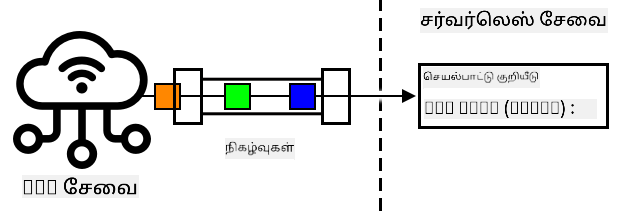
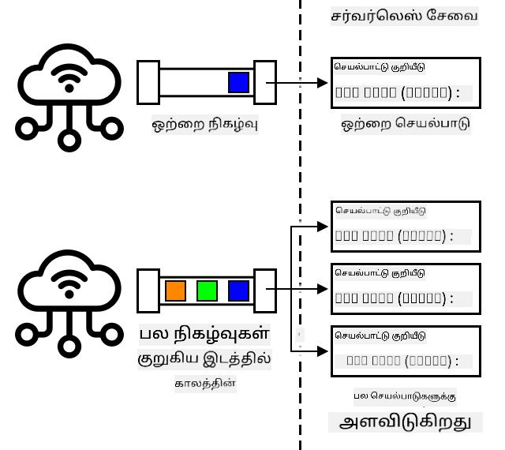
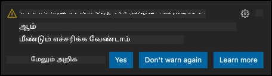

<!--
CO_OP_TRANSLATOR_METADATA:
{
  "original_hash": "5f2d2f4a5a023c93ab34a0cc5b47c0c4",
  "translation_date": "2025-10-11T12:38:03+00:00",
  "source_file": "2-farm/lessons/5-migrate-application-to-the-cloud/README.md",
  "language_code": "ta"
}
-->
# உங்கள் பயன்பாட்டு லாஜிக்கை கிளவுடுக்கு மாற்றவும்


> ஸ்கெட்ச் நோட்: [நித்யா நரசிம்மன்](https://github.com/nitya). படத்தை கிளிக் செய்து பெரிய பதிப்பைப் பாருங்கள்.

இந்த பாடம் [IoT for Beginners Project 2 - Digital Agriculture series](https://youtube.com/playlist?list=PLmsFUfdnGr3yCutmcVg6eAUEfsGiFXgcx) மற்றும் [Microsoft Reactor](https://developer.microsoft.com/reactor/?WT.mc_id=academic-17441-jabenn) மூலம் கற்பிக்கப்பட்டது.

[](https://youtu.be/VVZDcs5u1_I)

## பாடத்திற்கு முன் கேள்வி

[பாடத்திற்கு முன் கேள்வி](https://black-meadow-040d15503.1.azurestaticapps.net/quiz/17)

## அறிமுகம்

கடந்த பாடத்தில், உங்கள் தாவர மண் ஈரப்பதம் கண்காணிப்பு மற்றும் ரிலே கட்டுப்பாட்டை கிளவுட் அடிப்படையிலான IoT சேவைக்கு இணைப்பது எப்படி என்பதை நீங்கள் கற்றுக்கொண்டீர்கள். அடுத்த படியாக, ரிலே நேரத்தை கட்டுப்படுத்தும் சர்வர் கோடை கிளவுடுக்கு மாற்ற வேண்டும். இந்த பாடத்தில், சர்வர்லெஸ் செயல்பாடுகளைப் பயன்படுத்தி இதை எப்படி செய்வது என்பதை நீங்கள் கற்றுக்கொள்வீர்கள்.

இந்த பாடத்தில் நாம் கவரும் விஷயங்கள்:

* [சர்வர்லெஸ் என்றால் என்ன?](../../../../../2-farm/lessons/5-migrate-application-to-the-cloud)
* [சர்வர்லெஸ் பயன்பாட்டை உருவாக்குங்கள்](../../../../../2-farm/lessons/5-migrate-application-to-the-cloud)
* [IoT Hub நிகழ்வு டிரிகரை உருவாக்குங்கள்](../../../../../2-farm/lessons/5-migrate-application-to-the-cloud)
* [சர்வர்லெஸ் கோடில் இருந்து நேரடி முறை கோரிக்கைகளை அனுப்புங்கள்](../../../../../2-farm/lessons/5-migrate-application-to-the-cloud)
* [உங்கள் சர்வர்லெஸ் கோடை கிளவுடில் பிரசுரிக்கவும்](../../../../../2-farm/lessons/5-migrate-application-to-the-cloud)

## சர்வர்லெஸ் என்றால் என்ன?

சர்வர்லெஸ், அல்லது சர்வர்லெஸ் கணினி செயல்பாடு, பல்வேறு நிகழ்வுகளுக்கு பதிலளிக்கும் வகையில் கிளவுடில் சிறிய கோடுகளின் தொகுதிகளை உருவாக்குவது ஆகும். நிகழ்வு நிகழும் போது உங்கள் கோடு இயக்கப்படும், மேலும் நிகழ்வின் தகவல்கள் கோடுக்கு அனுப்பப்படும். இந்த நிகழ்வுகள் வலை கோரிக்கைகள், ஒரு கியூவில் செய்திகளை வைப்பது, தரவுத்தொகுப்பில் மாற்றங்கள், அல்லது IoT சாதனங்கள் IoT சேவைக்கு அனுப்பும் செய்திகளை உள்ளடக்கலாம்.



> 💁 நீங்கள் தரவுத்தொகுப்பு டிரிகர்களைப் பயன்படுத்தியிருந்தால், இது ஒரு வரிசையைச் சேர்ப்பது போன்ற நிகழ்வால் இயக்கப்படும் கோடு என்று நினைக்கலாம்.



உங்கள் கோடு நிகழ்வு நிகழும் போது மட்டுமே இயக்கப்படும், மற்ற நேரங்களில் உங்கள் கோடு செயல்படாது. நிகழ்வு நிகழும் போது, உங்கள் கோடு ஏற்றப்பட்டு இயக்கப்படும். இது சர்வர்லெஸ் முறை மிகவும் அளவீட்டுக்குரியதாக இருக்கிறது - பல நிகழ்வுகள் ஒரே நேரத்தில் நிகழ்ந்தால், கிளவுட் வழங்குநர் உங்கள் செயல்பாட்டை தேவையான அளவுக்கு ஒரே நேரத்தில் இயக்க முடியும். ஆனால், நிகழ்வுகளுக்கு இடையே தகவல்களைப் பகிர வேண்டும் என்றால், அதை நினைவகத்தில் சேமிக்காமல் தரவுத்தொகுப்பில் சேமிக்க வேண்டும்.

உங்கள் கோடு ஒரு செயல்பாடாக எழுதப்படும், இது நிகழ்வின் விவரங்களை ஒரு அளவுருவாக எடுத்துக்கொள்ளும். இந்த சர்வர்லெஸ் செயல்பாடுகளை எழுத பல்வேறு நிரலாக்க மொழிகளை நீங்கள் பயன்படுத்தலாம்.

> 🎓 சர்வர்லெஸ் "Functions as a service (FaaS)" என்றும் அழைக்கப்படுகிறது, ஏனெனில் ஒவ்வொரு நிகழ்வு டிரிகரும் கோடில் ஒரு செயல்பாடாக செயல்படுகிறது.

சர்வர்லெஸ் என்ற பெயர் இருந்தாலும், இது உண்மையில் சர்வர்களைப் பயன்படுத்துகிறது. பெயரிடப்பட்ட காரணம், ஒரு டெவலப்பராக நீங்கள் உங்கள் கோடு இயக்குவதற்கான சர்வர்களைப் பற்றி கவலைப்பட வேண்டியதில்லை; உங்கள் கோடு ஒரு நிகழ்வுக்கு பதிலளிக்க வேண்டும் என்பதையே நீங்கள் கவலைப்படுகிறீர்கள். கிளவுட் வழங்குநர் சர்வர்லெஸ் *runtime* மூலம் சர்வர்கள், நெட்வொர்க், சேமிப்பு, CPU, நினைவகம் மற்றும் உங்கள் கோடு இயக்குவதற்கான அனைத்தையும் நிர்வகிக்கிறார். இந்த முறை நீங்கள் சர்வருக்கு அடிப்படையாக பணம் செலுத்த முடியாது, ஏனெனில் சர்வர் இல்லை. உங்கள் கோடு இயக்கப்படும் நேரத்திற்கும், பயன்படுத்தப்படும் நினைவக அளவிற்கும் நீங்கள் பணம் செலுத்த வேண்டும்.

> 💰 சர்வர்லெஸ் என்பது கிளவுடில் கோடு இயக்குவதற்கான மிகக் குறைந்த செலவான வழிகளில் ஒன்றாகும். உதாரணமாக, எழுதும் நேரத்தில், ஒரு கிளவுட் வழங்குநர் உங்கள் சர்வர்லெஸ் செயல்பாடுகள் மாதத்திற்கு 1,000,000 முறை இயக்கப்படுவதற்கு முன் கட்டணம் வசூலிக்கவில்லை, அதற்குப் பிறகு 1,000,000 செயல்பாடுகளுக்கு US$0.20 வசூலிக்கிறார். உங்கள் கோடு இயக்கப்படாத நேரத்தில், நீங்கள் பணம் செலுத்த வேண்டியதில்லை.

IoT டெவலப்பராக, சர்வர்லெஸ் முறை மிகவும் பொருத்தமானது. உங்கள் கோடு, கிளவுட்-ஹோஸ்டட் IoT சேவைக்கு இணைக்கப்பட்ட எந்த IoT சாதனத்திலிருந்தும் அனுப்பப்படும் செய்திகளுக்கு பதிலளிக்க அழைக்கப்படும். உங்கள் கோடு அனுப்பப்படும் அனைத்து செய்திகளையும் கையாளும், ஆனால் தேவையான நேரத்தில் மட்டுமே இயக்கப்படும்.

✅ நீங்கள் MQTT மூலம் செய்திகளை கேட்கும் சர்வர் கோடாக எழுதிய கோடுகளை மீண்டும் பாருங்கள். இது கிளவுடில் சர்வர்லெஸ் மூலம் எப்படி இயக்கப்படும்? சர்வர்லெஸ் கணினி செயல்பாட்டை ஆதரிக்க கோடு எப்படி மாற்றப்பட வேண்டும் என்று நீங்கள் நினைக்கிறீர்கள்?

> 💁 சர்வர்லெஸ் முறை, கோடு இயக்குவதற்கு கூடுதல் கிளவுட் சேவைகளுக்கு நகர்கிறது. உதாரணமாக, கிளவுடில் சர்வர்லெஸ் தரவுத்தொகுப்புகள் கிடைக்கின்றன, இது ஒரு சர்வர்லெஸ் விலைமுறையைப் பயன்படுத்துகிறது, நீங்கள் தரவுத்தொகுப்பில் செய்யும் ஒவ்வொரு கோரிக்கைக்கும் பணம் செலுத்த வேண்டும், உதாரணமாக ஒரு கேள்வி அல்லது சேர்க்கை. கோரிக்கையைச் சேவையளிக்க செய்யப்படும் வேலை அடிப்படையில் விலை நிர்ணயமாக இருக்கும். உதாரணமாக, ஒரு முதன்மை விசையை எதிர்த்து ஒரு வரிசையைத் தேர்ந்தெடுப்பது, பல அட்டவணைகளை இணைத்து ஆயிரக்கணக்கான வரிசைகளைத் திருப்பும் சிக்கலான செயல்பாட்டை விட குறைவாக செலவாகும்.

## சர்வர்லெஸ் பயன்பாட்டை உருவாக்குங்கள்

Microsoft-இன் சர்வர்லெஸ் கணினி சேவை Azure Functions என்று அழைக்கப்படுகிறது.


கீழே உள்ள குறுகிய வீடியோவில் Azure Functions பற்றிய ஒரு கண்ணோட்டம் உள்ளது:

[](https://www.youtube.com/watch?v=8-jz5f_JyEQ)

> 🎥 மேலே உள்ள படத்தை கிளிக் செய்து வீடியோவைப் பாருங்கள்.

✅ ஒரு நிமிடம் எடுத்துக்கொண்டு [Microsoft Azure Functions ஆவணங்களில்](https://docs.microsoft.com/azure/azure-functions/functions-overview?WT.mc_id=academic-17441-jabenn) Azure Functions பற்றிய கண்ணோட்டத்தைப் படிக்கவும்.

Azure Functions எழுத, நீங்கள் உங்கள் விருப்ப மொழியில் Azure Functions பயன்பாட்டைத் தொடங்க வேண்டும். Azure Functions Python, JavaScript, TypeScript, C#, F#, Java மற்றும் Powershell ஆகியவற்றை ஆதரிக்கிறது. இந்த பாடத்தில் Python-இல் Azure Functions பயன்பாட்டை எழுதுவது எப்படி என்பதை நீங்கள் கற்றுக்கொள்வீர்கள்.

> 💁 Azure Functions தனிப்பயன் ஹாண்ட்லர்களையும் ஆதரிக்கிறது, எனவே HTTP கோரிக்கைகளை ஆதரிக்கும் எந்த மொழியிலும் உங்கள் செயல்பாடுகளை எழுதலாம், COBOL போன்ற பழைய மொழிகளையும்.

Functions பயன்பாடுகள் ஒரு அல்லது அதற்கு மேற்பட்ட *டிரிகர்களைக்* கொண்டிருக்கும் - நிகழ்வுகளுக்கு பதிலளிக்கும் செயல்பாடுகள். ஒரு Functions பயன்பாட்டில் பல டிரிகர்கள் இருக்கலாம், அனைத்தும் பொதுவான கட்டமைப்பைப் பகிர்ந்து கொள்ளும். உதாரணமாக, உங்கள் Functions பயன்பாட்டின் கட்டமைப்பு கோப்பில் உங்கள் IoT Hub-இன் இணைப்பு விவரங்கள் இருக்கலாம், மேலும் பயன்பாட்டில் உள்ள அனைத்து செயல்பாடுகளும் இதைப் பயன்படுத்தி இணைந்து நிகழ்வுகளை கேட்கலாம்.

### பணிகள் - Azure Functions கருவிகளை நிறுவுங்கள்

> எழுதும் நேரத்தில், Azure Functions கோடு கருவிகள் Apple Silicon-இல் Python திட்டங்களுடன் முழுமையாக வேலை செய்யவில்லை. நீங்கள் Intel அடிப்படையிலான Mac, Windows PC அல்லது Linux PC-ஐ பயன்படுத்த வேண்டும்.

Azure Functions-இன் ஒரு சிறந்த அம்சம், நீங்கள் அவற்றை உள்ளூரில் இயக்க முடியும். கிளவுடில் பயன்படுத்தப்படும் runtime உங்கள் கணினியில் இயக்கப்படலாம், இது IoT செய்திகளுக்கு பதிலளிக்கும் கோடுகளை எழுத அனுமதிக்கிறது மற்றும் அதை உள்ளூரில் இயக்க முடியும். நிகழ்வுகள் கையாளப்படும் போது உங்கள் கோடுகளை டிபக் செய்யவும் முடியும். உங்கள் கோடு சரியாக இருக்கும்போது, அதை கிளவுடில் பிரசுரிக்கலாம்.

Azure Functions கருவிகள் CLI ஆக கிடைக்கின்றன, இது Azure Functions Core Tools என்று அழைக்கப்படுகிறது.

1. [Azure Functions Core Tools ஆவணங்களில்](https://docs.microsoft.com/azure/azure-functions/functions-run-local?WT.mc_id=academic-17441-jabenn) உள்ள வழிமுறைகளைப் பின்பற்றி Azure Functions Core Tools-ஐ நிறுவவும்.

1. VS Code-க்கு Azure Functions நீட்டிப்பை நிறுவவும். இந்த நீட்டிப்பு Azure Functions உருவாக்க, டிபக் மற்றும் பிரசுரிக்க ஆதரவு வழங்குகிறது. [Azure Functions நீட்டிப்பு ஆவணங்களில்](https://marketplace.visualstudio.com/items?WT.mc_id=academic-17441-jabenn&itemName=ms-azuretools.vscode-azurefunctions) உள்ள வழிமுறைகளைப் பார்க்கவும்.

Azure Functions பயன்பாட்டை கிளவுடில் பிரசுரிக்கும்போது, பயன்பாட்டு கோப்புகள் மற்றும் பதிவு கோப்புகள் போன்றவற்றை சேமிக்க சிறிய அளவிலான கிளவுட் சேமிப்பு தேவைப்படும். உங்கள் Functions பயன்பாட்டை உள்ளூரில் இயக்கும்போது, நீங்கள் கிளவுட் சேமிப்புடன் இணைக்க வேண்டும், ஆனால் உண்மையான கிளவுட் சேமிப்பை பயன்படுத்துவதற்கு பதிலாக, [Azurite](https://github.com/Azure/Azurite) என்ற சேமிப்பு எமுலேட்டரை பயன்படுத்தலாம். இது உள்ளூரில் இயக்கப்படும், ஆனால் கிளவுட் சேமிப்பைப் போல செயல்படும்.

> 🎓 Azure-இல், Azure Functions பயன்படுத்தும் சேமிப்பு Azure Storage Account ஆகும். இந்த கணக்குகள் கோப்புகள், ப்ளாப்கள், அட்டவணைகளில் தரவுகள் அல்லது கியூவில் தரவுகளை சேமிக்க முடியும். நீங்கள் பல பயன்பாடுகளுக்கு ஒரு சேமிப்பு கணக்கைப் பகிரலாம், உதாரணமாக ஒரு Functions பயன்பாடு மற்றும் ஒரு வலை பயன்பாடு.

1. Azurite ஒரு Node.js பயன்பாடாகும், எனவே நீங்கள் Node.js-ஐ நிறுவ வேண்டும். [Node.js இணையதளத்தில்](https://nodejs.org/) பதிவிறக்கம் மற்றும் நிறுவல் வழிமுறைகளை நீங்கள் காணலாம். Mac பயன்படுத்தினால், [Homebrew](https://formulae.brew.sh/formula/node) மூலம் அதை நிறுவலாம்.

1. கீழே உள்ள கட்டளையைப் பயன்படுத்தி Azurite-ஐ நிறுவவும் (`npm` என்பது Node.js-ஐ நிறுவும்போது நிறுவப்படும் ஒரு கருவி):

    ```sh
    npm install -g azurite
    ```

1. Azurite தரவுகளை சேமிக்க பயன்படுத்த ஒரு `azurite` என்ற கோப்புறையை உருவாக்கவும்:

    ```sh
    mkdir azurite
    ```

1. Azurite-ஐ இயக்கி, இந்த புதிய கோப்புறையைச் செலுத்தவும்:

    ```sh
    azurite --location azurite
    ```

    Azurite சேமிப்பு எமுலேட்டர் தொடங்கும் மற்றும் உள்ளூர் Functions runtime இணைக்க தயாராக இருக்கும்.

    ```output
    ➜  ~ azurite --location azurite  
    Azurite Blob service is starting at http://127.0.0.1:10000
    Azurite Blob service is successfully listening at http://127.0.0.1:10000
    Azurite Queue service is starting at http://127.0.0.1:10001
    Azurite Queue service is successfully listening at http://127.0.0.1:10001
    Azurite Table service is starting at http://127.0.0.1:10002
    Azurite Table service is successfully listening at http://127.0.0.1:10002
    ```

### பணிகள் - Azure Functions திட்டத்தை உருவாக்குங்கள்

Azure Functions CLI புதிய Functions பயன்பாட்டை உருவாக்க பயன்படுத்தப்படலாம்.

1. உங்கள் Functions பயன்பாட்டிற்கான ஒரு கோப்புறையை உருவாக்கி அதில் செல்லவும். இதற்கு `soil-moisture-trigger` என்று பெயரிடவும்.

    ```sh
    mkdir soil-moisture-trigger
    cd soil-moisture-trigger
    ```

1. Python மெய்நிகர் சூழலை இந்த கோப்புறையில் உருவாக்கவும்:

    ```sh
    python3 -m venv .venv
    ```

1. மெய்நிகர் சூழலை செயல்படுத்தவும்:

    * Windows-ல்:
        * நீங்கள் Command Prompt அல்லது Windows Terminal வழியாக Command Prompt பயன்படுத்தினால், கீழே உள்ளதை இயக்கவும்:

            ```cmd
            .venv\Scripts\activate.bat
            ```

        * PowerShell பயன்படுத்தினால், கீழே உள்ளதை இயக்கவும்:

            ```powershell
            .\.venv\Scripts\Activate.ps1
            ```

    * macOS அல்லது Linux-ல், கீழே உள்ளதை இயக்கவும்:

        ```cmd
        source ./.venv/bin/activate
        ```

    > 💁 இந்த கட்டளைகள் நீங்கள் மெய்நிகர் சூழலை உருவாக்கிய இடத்திலிருந்து இயக்கப்பட வேண்டும். `.venv` கோப்புறைக்கு நீங்கள் செல்ல வேண்டியதில்லை; நீங்கள் மெய்நிகர் சூழலை செயல்படுத்தும் கட்டளையை இயக்க வேண்டும்.

1. Functions பயன்பாட்டை இந்த கோப்புறையில் உருவாக்க கீழே உள்ள கட்டளையை இயக்கவும்:

    ```sh
    func init --worker-runtime python soil-moisture-trigger
    ```

    இது தற்போதைய கோப்புறையில் மூன்று கோப்புகளை உருவாக்கும்:

    * `host.json` - இந்த JSON ஆவணம் உங்கள் Functions பயன்பாட்டிற்கான அமைப்புகளை கொண்டுள்ளது. இந்த அமைப்புகளை நீங்கள் மாற்ற வேண்டியதில்லை.
    * `local.settings.json` - இந்த JSON ஆவணம் உங்கள் பயன்பாடு உள்ளூரில் இயக்கப்படும் போது பயன்படுத்தும் அமைப்புகளை கொண்டுள்ளது, உதாரணமாக உங்கள் IoT Hub-க்கு இணைப்பு சரங்கள். இந்த அமைப்புகள் உள்ளூர் மட்டுமே, மேலும் மூலக் கோடில் சேர்க்கப்படக்கூடாது. பயன்பாட்டை கிளவுடில் பிரசுரிக்கும்போது, இந்த அமைப்புகள் பிரசுரிக்கப்படாது; பதிலாக உங்கள் அமைப்புகள் பயன்பாட்டு அமைப்புகளில் இருந்து ஏற்றப்படும். இது இந்த பாடத்தில் பின்னர் கவரப்படும்.
    * `requirements.txt` - இது [Pip தேவைகள் கோப்பு](https://pip.pypa.io/en/stable/user_guide/#requirements-files) ஆகும், இது உங்கள் Functions பயன்பாட்டை இயக்க தேவையான Pip தொகுப்புகளை கொண்டுள்ளது.

1. Functions பயன்பாடு பயன்படுத்தும் சேமிப்பு கணக்கிற்கான அமைப்பு `local.settings.json` கோப்பில் உள்ளது. இது காலியாக இருக்கும், எனவே அமைக்க வேண்டும். Azurite உள்ளூர் சேமிப்பு எமுலேட்டருடன் இணைக்க, இந்த மதிப்பை கீழே உள்ளவாறு அமைக்கவும்:

    ```json
    "AzureWebJobsStorage": "UseDevelopmentStorage=true",
    ```

1. தேவையான Pip தொகுப்புகளை தேவைகள் கோப்பைப் பயன்படுத்தி நிறுவவும்:

    ```sh
    pip install -r requirements.txt
    ```

    > 💁 தேவையான Pip தொகுப்புகள் இந்த கோப்பில் இருக்க வேண்டும், எனவே Functions பயன்பாட்டை கிளவுடில் பிரசுரிக்கும்போது, runtime சரியான தொகுப்புகளை நிறுவுவதை உறுதிப்படுத்த முடியும்.

1. எல்லாம் சரியாக வேலை செய்கிறது என்பதை சோதிக்க, Functions runtime-ஐ தொடங்கலாம். இதை செய்ய கீழே உள்ள கட்டளையை இயக்கவும்:

    ```sh
    func start
    ```

    runtime தொடங்கும் மற்றும் எந்த வேலை செயல்பாடுகளையும் (டிரிகர்கள்) கண்டறியவில்லை என்று தெரிவிக்கும்.

    ```output
    (.venv) ➜  soil-moisture-trigger func start
    Found Python version 3.9.1 (python3).
    
    Azure Functions Core Tools
    Core Tools Version:       3.0.3442 Commit hash: 6bfab24b2743f8421475d996402c398d2fe4a9e0  (64-bit)
    Function Runtime Version: 3.0.15417.0
    
    [2021-05-05T01:24:46.795Z] No job functions found.
    ```

    > ⚠️ Firewall அறிவிப்பு வந்தால், `func` பயன்பாட்டிற்கு உங்கள் நெட்வொர்க்கில் படிக்க மற்றும் எழுத அனுமதி அளிக்க வேண்டும்.

    > ⚠️ macOS பயன்படுத்தினால், வெளியீட்டில் எச்சரிக்கைகள் இருக்கலாம்:
    >
    > ```output
    > (.venv) ➜  soil-moisture-trigger func start
    > Found Python version 3.9.1 (python3).
    >
    > Azure Functions Core Tools
    > Core Tools Version:       3.0.3442 Commit hash: 6bfab24b2743f8421475d996402c398d2fe4a9e0  (64-bit)
    > Function Runtime Version: 3.0.15417.0
    >
    > [2021-06-16T08:18:28.315Z] Cannot create directory for shared memory usage: /dev/shm/AzureFunctions
    > [2021-06-16T08:18:28.316Z] System.IO.FileSystem: Access to the path '/dev/shm/AzureFunctions' is denied. Operation not permitted.
    > [2021-06-16T08:18:30.361Z] No job functions found.
    > ```
    >
    > Functions பயன்பாடு சரியாக தொடங்கும் மற்றும் செயல்படும் செயல்பாடுகளை பட்டியலிடும் வரை இதை நீங்கள் புறக்கணிக்கலாம்.

1. `ctrl+c` அழுத்தி Functions பயன்பாட்டை நிறுத்தவும்.

1. தற்போதைய கோப்புறையை VS Code-ல் திறக்கவும், VS Code-ஐ திறந்து இந்த கோப்புறையைத் திறக்கவும் அல்லது கீழே உள்ள கட்டளையை இயக்கவும்:

    ```sh
    code .
    ```

VS Code உங்கள் Functions திட்டத்தை கண்டறிந்து, கீழே உள்ள அறிவிப்பை காட்டும்:

    ```output
    Detected an Azure Functions Project in folder "soil-moisture-trigger" that may have been created outside of
    VS Code. Initialize for optimal use with VS Code?
    ```



**Yes** என்பதை தேர்ந்தெடுக்கவும்.

1. Python virtual environment VS Code terminal-ல் இயங்குகிறதா என்பதை உறுதிப்படுத்தவும். தேவையானால் அதை நிறுத்தி மீண்டும் தொடங்கவும்.

## IoT Hub நிகழ்வு டிரிகரை உருவாக்கவும்

Functions app என்பது உங்கள் serverless code-க்கு ஒரு shell ஆகும். IoT Hub நிகழ்வுகளுக்கு பதிலளிக்க, நீங்கள் இந்த app-க்கு ஒரு IoT Hub டிரிகரை சேர்க்கலாம். இந்த டிரிகர் IoT Hub-க்கு அனுப்பப்படும் செய்திகளின் ஸ்ட்ரீமுடன் இணைக்கவும், அவற்றுக்கு பதிலளிக்கவும் வேண்டும். இந்த செய்திகளின் ஸ்ட்ரீமைப் பெற, உங்கள் டிரிகர் IoT Hub-களின் *event hub compatible endpoint*-க்கு இணைக்க வேண்டும்.

IoT Hub என்பது Azure Event Hubs எனப்படும் மற்றொரு Azure சேவையை அடிப்படையாகக் கொண்டது. Event Hubs என்பது செய்திகளை அனுப்பவும், பெறவும் உதவும் ஒரு சேவையாகும், IoT Hub இதை IoT சாதனங்களுக்கான அம்சங்களைச் சேர்க்க விரிவாக்குகிறது. IoT Hub-ல் இருந்து செய்திகளைப் படிக்க நீங்கள் இணைக்கும் முறை Event Hubs-ஐப் பயன்படுத்தும் முறை போலவே இருக்கும்.

✅ ஆராய்ச்சி செய்யவும்: [Azure Event Hubs documentation](https://docs.microsoft.com/azure/event-hubs/event-hubs-about?WT.mc_id=academic-17441-jabenn) இல் Event Hubs பற்றிய மேலோட்டத்தை படிக்கவும். அடிப்படை அம்சங்கள் IoT Hub-க்கு எப்படி ஒப்பிடப்படுகின்றன?

IoT சாதனம் IoT Hub-க்கு இணைக்க, அனுமதிக்கப்பட்ட சாதனங்கள் மட்டுமே இணைக்க முடியும் என்பதை உறுதிப்படுத்தும் ஒரு ரகசிய விசையை பயன்படுத்த வேண்டும். செய்திகளைப் படிக்க இணைக்கும் போது கூட இதே பொருந்தும்; உங்கள் code-க்கு IoT Hub பற்றிய விவரங்களுடன் ஒரு ரகசிய விசையை கொண்ட ஒரு connection string தேவைப்படும்.

> 💁 நீங்கள் பெறும் இயல்பான connection string-க்கு **iothubowner** அனுமதிகள் உள்ளன, இது அதை பயன்படுத்தும் எந்த code-க்கும் IoT Hub-ல் முழு அனுமதிகளை வழங்குகிறது. சாத்தியமான குறைந்த அளவிலான அனுமதிகளுடன் இணைக்க வேண்டும். இது அடுத்த பாடத்தில் கற்றுக்கொள்ளப்படும்.

உங்கள் டிரிகர் இணைக்கப்பட்டவுடன், IoT Hub-க்கு அனுப்பப்படும் ஒவ்வொரு செய்திக்கும் function உள்ள code அழைக்கப்படும், எந்த சாதனம் அனுப்பியது என்றாலும். டிரிகர் செய்தியை ஒரு parameter ஆக அனுப்பும்.

### Task - Event Hub compatible endpoint connection string பெறவும்

1. IoT Hub-களின் Event Hub compatible endpoint-க்கு connection string பெற, VS Code terminal-ல் கீழே உள்ள கட்டளையை இயக்கவும்:

    ```sh
    az iot hub connection-string show --default-eventhub \
                                      --output table \
                                      --hub-name <hub_name>
    ```

`<hub_name>` ஐ உங்கள் IoT Hub-க்கு நீங்கள் பயன்படுத்திய பெயருடன் மாற்றவும்.

1. VS Code-ல், `local.settings.json` கோப்பை திறக்கவும். `Values` பிரிவில் கீழே உள்ள கூடுதல் மதிப்பைச் சேர்க்கவும்:

    ```json
    "IOT_HUB_CONNECTION_STRING": "<connection string>"
    ```

`<connection string>` ஐ முந்தைய படியில் இருந்து பெறப்பட்ட மதிப்புடன் மாற்றவும். இது செல்லுபடியாகும் JSON ஆக இருக்க, மேலே உள்ள வரிக்கு பின் ஒரு கமாவைச் சேர்க்க வேண்டும்.

### Task - நிகழ்வு டிரிகரை உருவாக்கவும்

இப்போது நீங்கள் நிகழ்வு டிரிகரை உருவாக்க தயாராக உள்ளீர்கள்.

1. `soil-moisture-trigger` கோப்பகத்திற்குள் இருந்து VS Code terminal-ல் கீழே உள்ள கட்டளையை இயக்கவும்:

    ```sh
    func new --name iot-hub-trigger --template "Azure Event Hub trigger"
    ```

இது `iot-hub-trigger` எனப்படும் புதிய Function-ஐ உருவாக்குகிறது. டிரிகர் IoT Hub-ல் Event Hub compatible endpoint-க்கு இணைக்கப்படும், எனவே நீங்கள் Event Hub டிரிகரைப் பயன்படுத்தலாம். குறிப்பாக IoT Hub டிரிகர் இல்லை.

இது `soil-moisture-trigger` கோப்பகத்திற்குள் `iot-hub-trigger` எனப்படும் ஒரு கோப்பகத்தை உருவாக்கும், இது இந்த function-ஐ கொண்டிருக்கும். இந்த கோப்பகத்தில் கீழே உள்ள கோப்புகள் இருக்கும்:

* `__init__.py` - இது டிரிகரை கொண்ட Python code கோப்பாகும், Python module ஆக இந்த கோப்பகத்தை மாற்ற Python கோப்பு பெயர் மரபை பயன்படுத்துகிறது.

    இந்த கோப்பில் கீழே உள்ள code இருக்கும்:

    ```python
    import logging

    import azure.functions as func


    def main(event: func.EventHubEvent):
        logging.info('Python EventHub trigger processed an event: %s',
                    event.get_body().decode('utf-8'))
    ```

    டிரிகரின் மையம் `main` function ஆகும். IoT Hub-ல் இருந்து நிகழ்வுகளுடன் இந்த function அழைக்கப்படும். இந்த function-க்கு `event` எனப்படும் ஒரு parameter உள்ளது, இது `EventHubEvent` ஆகும். IoT Hub-க்கு ஒவ்வொரு செய்தியும் அனுப்பப்படும் போது, இந்த function `event` எனும் parameter-ஆக அந்த செய்தியை அனுப்பும், மற்றும் முந்தைய பாடத்தில் நீங்கள் பார்த்த annotations போன்ற பண்புகளை அனுப்பும்.

    இந்த function-ன் மையம் நிகழ்வை பதிவு செய்கிறது.

* `function.json` - இது டிரிகருக்கான configuration-ஐ கொண்டுள்ளது. முக்கிய configuration `bindings` எனப்படும் பிரிவில் உள்ளது. Azure Functions மற்றும் பிற Azure சேவைகளுக்கு இடையிலான இணைப்புக்கு binding எனப்படும். இந்த function-க்கு Event Hub-க்கு ஒரு input binding உள்ளது - இது Event Hub-க்கு இணைக்கிறது மற்றும் தரவுகளைப் பெறுகிறது.

    > 💁 நீங்கள் output bindings-ஐ கூட வைத்திருக்கலாம், எனவே function-ன் output மற்றொரு சேவைக்கு அனுப்பப்படும். உதாரணமாக, நீங்கள் ஒரு database-க்கு output binding-ஐ சேர்த்து, IoT Hub நிகழ்வை function-ல் இருந்து திருப்பி அனுப்பலாம், இது database-ல் தானாக சேர்க்கப்படும்.

    `bindings` பிரிவில் binding-க்கான configuration அடங்கும். முக்கியமான மதிப்புகள்:

  * `"type": "eventHubTrigger"` - இது function-க்கு Event Hub-ல் இருந்து நிகழ்வுகளை கேட்க வேண்டும் என்பதைச் சொல்கிறது
  * `"name": "events"` - இது Event Hub நிகழ்வுகளுக்கு பயன்படுத்த வேண்டிய parameter பெயர். Python code-ல் உள்ள `main` function-ல் உள்ள parameter பெயருடன் இது பொருந்துகிறது.
  * `"direction": "in"` - இது ஒரு input binding, Event Hub-ல் இருந்து தரவு function-க்கு வருகிறது
  * `"connection": ""` - இது connection string-ஐ படிக்க settings-ல் உள்ள பெயரை வரையறுக்கிறது. உள்ளூர் முறையில் இயக்கும்போது, இது `local.settings.json` கோப்பில் இருந்து இந்த settings-ஐ படிக்கும்.

    > 💁 connection string `function.json` கோப்பில் சேமிக்க முடியாது, இது settings-ல் இருந்து படிக்க வேண்டும். இது உங்கள் connection string-ஐ தவறுதலாக வெளிப்படுத்துவதைத் தடுக்கிறது.

1. [Azure Functions template-ல் உள்ள பிழை](https://github.com/Azure/azure-functions-templates/issues/1250) காரணமாக, `function.json`-ல் `cardinality` புலத்திற்கு தவறான மதிப்பு உள்ளது. இந்த புலத்தை `many`-இல் இருந்து `one`-க்கு மாற்றவும்:

    ```json
    "cardinality": "one",
    ```

1. `function.json` கோப்பில் `"connection"`-ன் மதிப்பை `local.settings.json` கோப்பில் நீங்கள் சேர்த்த புதிய மதிப்பைச் சுட்டிக்காட்டும் வகையில் புதுப்பிக்கவும்:

    ```json
    "connection": "IOT_HUB_CONNECTION_STRING",
    ```

    > 💁 நினைவில் கொள்ளவும் - இது settings-ஐ சுட்டிக்காட்ட வேண்டும், connection string-ஐ உள்ளடக்கக்கூடாது.

1. Connection string `eventHubName` மதிப்பை கொண்டுள்ளது, எனவே `function.json` கோப்பில் இதற்கான மதிப்பு காலியாக இருக்க வேண்டும். இந்த மதிப்பை காலியாக மாற்றவும்:

    ```json
    "eventHubName": "",
    ```

### Task - நிகழ்வு டிரிகரை இயக்கவும்

1. IoT Hub நிகழ்வு மானிட்டரை இயக்கவில்லை என்பதை உறுதிப்படுத்தவும். Functions app மற்றும் நிகழ்வு மானிட்டர் ஒரே நேரத்தில் இயங்கினால், Functions app இணைக்க முடியாது மற்றும் நிகழ்வுகளைப் பயன்படுத்த முடியாது.

    > 💁 பல app-கள் IoT Hub endpoint-களுக்கு *consumer groups* பயன்படுத்தி இணைக்க முடியும். இவை அடுத்த பாடத்தில் கற்றுக்கொள்ளப்படும்.

1. Functions app-ஐ இயக்க, VS Code terminal-ல் கீழே உள்ள கட்டளையை இயக்கவும்:

    ```sh
    func start
    ```

    Functions app தொடங்கும், மற்றும் `iot-hub-trigger` function-ஐ கண்டறியும். இது கடந்த ஒரு நாளில் IoT Hub-க்கு ஏற்கனவே அனுப்பப்பட்ட எந்த நிகழ்வுகளையும் செயல்படுத்தும்.

@@CODE_BLOCK-25@@
    ஒவ்வொரு function அழைப்பும் `Executing 'Functions.iot-hub-trigger'`/`Executed 'Functions.iot-hub-trigger'` எனும் output-ல் சுற்றி இருக்கும், எனவே ஒவ்வொரு function அழைப்பிலும் எத்தனை செய்திகள் செயல்படுத்தப்பட்டன என்பதை நீங்கள் காணலாம்.

1. உங்கள் IoT சாதனம் இயங்குகிறதா என்பதை உறுதிப்படுத்தவும். Functions app-ல் புதிய மண் ஈரப்பதம் செய்திகளை நீங்கள் காணலாம்.

1. Functions app-ஐ நிறுத்தி மீண்டும் தொடங்கவும். இது முந்தைய செய்திகளை மீண்டும் செயல்படுத்தாது, புதிய செய்திகளை மட்டுமே செயல்படுத்தும்.

> 💁 VS Code உங்கள் Functions-ஐ debugging-ஐ ஆதரிக்கிறது. ஒவ்வொரு code வரியின் தொடக்கத்தில் click செய்து அல்லது code வரியில் cursor வைத்து *Run -> Toggle breakpoint* தேர்ந்தெடுத்து அல்லது `F9` அழுத்தி break points அமைக்கலாம். Debugger-ஐ தொடங்க *Run -> Start debugging* தேர்ந்தெடுக்கவும், `F5` அழுத்தவும், அல்லது *Run and debug* pane-ஐத் தேர்ந்தெடுத்து **Start debugging** பொத்தானைத் தேர்ந்தெடுக்கவும். இதனால் செயல்படுத்தப்படும் நிகழ்வுகளின் விவரங்களை நீங்கள் காணலாம்.

#### Troubleshooting

* நீங்கள் கீழே உள்ள பிழையைப் பெறினால்:

    ```output
    The listener for function 'Functions.iot-hub-trigger' was unable to start. Microsoft.WindowsAzure.Storage: Connection refused. System.Net.Http: Connection refused. System.Private.CoreLib: Connection refused.
    ```

    Azurite இயங்குகிறதா, மற்றும் `local.settings.json` கோப்பில் `AzureWebJobsStorage`-ஐ `UseDevelopmentStorage=true` என அமைத்துள்ளீர்களா என்பதைச் சரிபார்க்கவும்.

* நீங்கள் கீழே உள்ள பிழையைப் பெறினால்:

    ```output
    System.Private.CoreLib: Exception while executing function: Functions.iot-hub-trigger. System.Private.CoreLib: Result: Failure Exception: AttributeError: 'list' object has no attribute 'get_body'
    ```

    `function.json` கோப்பில் `cardinality`-ஐ `one` என அமைத்துள்ளீர்களா என்பதைச் சரிபார்க்கவும்.

* நீங்கள் கீழே உள்ள பிழையைப் பெறினால்:

    ```output
    Azure.Messaging.EventHubs: The path to an Event Hub may be specified as part of the connection string or as a separate value, but not both.  Please verify that your connection string does not have the `EntityPath` token if you are passing an explicit Event Hub name. (Parameter 'connectionString').
    ```

    `function.json` கோப்பில் `eventHubName`-ஐ காலியாக அமைத்துள்ளீர்களா என்பதைச் சரிபார்க்கவும்.

## Serverless code-ல் இருந்து நேரடி முறை கோரிக்கைகளை அனுப்பவும்

இப்போது உங்கள் Functions app Event Hub compatible endpoint-ஐப் பயன்படுத்தி IoT Hub-ல் இருந்து செய்திகளை கேட்கிறது. நீங்கள் IoT சாதனங்களுக்கு கட்டளைகளை அனுப்ப வேண்டும். இது IoT Hub-க்கு *Registry Manager* வழியாக ஒரு வேறுபட்ட இணைப்பைப் பயன்படுத்தி செய்யப்படுகிறது. Registry Manager என்பது IoT Hub-க்கு எந்த சாதனங்கள் பதிவு செய்யப்பட்டுள்ளன என்பதைப் பார்க்கவும், cloud-இல் இருந்து சாதனங்களுக்கு செய்திகளை அனுப்பவும், நேரடி முறை கோரிக்கைகளை அனுப்பவும் அல்லது device twin-ஐ புதுப்பிக்கவும் உதவும் ஒரு கருவியாகும். இதை IoT Hub-ல் IoT சாதனங்களை பதிவு செய்ய, புதுப்பிக்க அல்லது நீக்கவும் பயன்படுத்தலாம்.

Registry Manager-க்கு இணைக்க, connection string தேவைப்படும்.

### Task - Registry Manager connection string பெறவும்

1. Connection string பெற, கீழே உள்ள கட்டளையை இயக்கவும்:

    ```sh
    az iot hub connection-string show --policy-name service \
                                      --output table \
                                      --hub-name <hub_name>
    ```

    `<hub_name>` ஐ உங்கள் IoT Hub-க்கு நீங்கள் பயன்படுத்திய பெயருடன் மாற்றவும்.

    Connection string *ServiceConnect* கொள்கைக்கானது `--policy-name service` parameter-ஐப் பயன்படுத்தி கோரப்படுகிறது. Connection string-ஐ நீங்கள் கோரும்போது, அந்த connection string எந்த அனுமதிகளை வழங்கும் என்பதை நீங்கள் குறிப்பிடலாம். ServiceConnect கொள்கை உங்கள் code-க்கு IoT சாதனங்களுக்கு இணைக்கவும், செய்திகளை அனுப்பவும் அனுமதிக்கிறது.

    ✅ ஆராய்ச்சி செய்யவும்: [IoT Hub permissions documentation](https://docs.microsoft.com/azure/iot-hub/iot-hub-devguide-security#iot-hub-permissions?WT.mc_id=academic-17441-jabenn) இல் பல்வேறு கொள்கைகளைப் பற்றி படிக்கவும்.

1. VS Code-ல், `local.settings.json` கோப்பை திறக்கவும். `Values` பிரிவில் கீழே உள்ள கூடுதல் மதிப்பைச் சேர்க்கவும்:

    ```json
    "REGISTRY_MANAGER_CONNECTION_STRING": "<connection string>"
    ```

    `<connection string>` ஐ முந்தைய படியில் இருந்து பெறப்பட்ட மதிப்புடன் மாற்றவும். இது செல்லுபடியாகும் JSON ஆக இருக்க, மேலே உள்ள வரிக்கு பின் ஒரு கமாவைச் சேர்க்க வேண்டும்.

### Task - சாதனத்திற்கு நேரடி முறை கோரிக்கையை அனுப்பவும்

1. Registry Manager-க்கு SDK ஒரு Pip package வழியாக கிடைக்கிறது. `requirements.txt` கோப்பில் கீழே உள்ள வரியைச் சேர்த்து இந்த package-க்கு dependency-ஐச் சேர்க்கவும்:

    ```sh
    azure-iot-hub
    ```

1. VS Code terminal-ல் virtual environment செயல்படுத்தப்பட்டுள்ளதா என்பதை உறுதிப்படுத்தி, Pip packages-ஐ நிறுவ கீழே உள்ள கட்டளையை இயக்கவும்:

    ```sh
    pip install -r requirements.txt
    ```

1. `__init__.py` கோப்பில் கீழே உள்ள imports-ஐச் சேர்க்கவும்:

    ```python
    import json
    import os
    from azure.iot.hub import IoTHubRegistryManager
    from azure.iot.hub.models import CloudToDeviceMethod
    ```

    இது சில system libraries-ஐ, Registry Manager-ஐ மற்றும் நேரடி முறை கோரிக்கைகளை அனுப்ப libraries-ஐ import செய்கிறது.

1. `main` method-இன் உள்ளே உள்ள code-ஐ நீக்கவும், ஆனால் method-ஐ வைத்திருக்கவும்.

1. `main` method-இல் கீழே உள்ள code-ஐச் சேர்க்கவும்:

    ```python
    body = json.loads(event.get_body().decode('utf-8'))
    device_id = event.iothub_metadata['connection-device-id']

    logging.info(f'Received message: {body} from {device_id}')
    ```

    இந்த code IoT சாதனம் அனுப்பிய JSON செய்தியை event body-இல் இருந்து எடுக்கிறது.

    இது annotations-ல் இருந்து சாதன ID-ஐ பெறுகிறது. Event body-இல் சாதனம் அனுப்பிய தகவல்கள் உள்ளன, `iothub_metadata` dictionary IoT Hub-ல் அமைக்கப்பட்ட பண்புகளை கொண்டுள்ளது, உதாரணமாக அனுப்பிய சாதன ID மற்றும் செய்தி அனுப்பப்பட்ட நேரம்.

    இந்த தகவல் பதிவு செய்யப்படுகிறது. Functions app-ஐ உள்ளூர் முறையில் இயக்கும்போது இந்த பதிவு terminal-ல் காணப்படும்.

1. இதற்கு கீழே, கீழே உள்ள code-ஐச் சேர்க்கவும்:

    ```python
    soil_moisture = body['soil_moisture']

    if soil_moisture > 450:
        direct_method = CloudToDeviceMethod(method_name='relay_on', payload='{}')
    else:
        direct_method = CloudToDeviceMethod(method_name='relay_off', payload='{}')
    ```

    இந்த code செய்தியில் இருந்து மண் ஈரப்பதத்தை பெறுகிறது. அதன் மதிப்பைச் சரிபார்த்து, `relay_on` அல்லது `relay_off` நேரடி முறை கோரிக்கைக்கான உதவிக்கருவியை உருவாக்குகிறது. Method request-க்கு payload தேவையில்லை, எனவே காலியான JSON ஆவணம் அனுப்பப்படுகிறது.

1. இதற்கு கீழே, கீழே உள்ள code-ஐச் சேர்க்கவும்:

    ```python
    logging.info(f'Sending direct method request for {direct_method.method_name} for device {device_id}')

    registry_manager_connection_string = os.environ['REGISTRY_MANAGER_CONNECTION_STRING']
    registry_manager = IoTHubRegistryManager(registry_manager_connection_string)
    ```

    இந்த code `local.settings.json` கோப்பில் இருந்து `REGISTRY_MANAGER_CONNECTION_STRING`-ஐ ஏற்றுகிறது. இந்த கோப்பில் உள்ள மதிப்புகள் சூழல் மாறிகள் (environment variables) ஆக கிடைக்கின்றன, மற்றும் `os.environ` function-ஐப் பயன்படுத்தி படிக்கலாம், இது அனைத்து சூழல் மாறிகளின் dictionary-ஐ திருப்புகிறது.

    > 💁 இந்த code cloud-இல் deploy செய்யப்படும் போது, `local.settings.json` கோப்பில் உள்ள மதிப்புகள் *Application Settings* ஆக அமைக்கப்படும், மற்றும் இவை சூழல் மாறிகளிலிருந்து படிக்கப்படும்.

    இந்த code connection string-ஐப் பயன்படுத்தி Registry Manager உதவிக்கருவியின் instance-ஐ உருவாக்குகிறது.

1. இதற்கு கீழே, கீழே உள்ள code-ஐச் சேர்க்கவும்:

    ```python
    registry_manager.invoke_device_method(device_id, direct_method)

    logging.info('Direct method request sent!')
    ```

    இந்த code Registry Manager-ஐ IoT சாதனம் அனுப்பிய தகவலுக்கு நேரடி முறை கோரிக்கையை அனுப்பச் சொல்கிறது.
> 💁 நீங்கள் முந்தைய பாடங்களில் MQTT பயன்படுத்தி உருவாக்கிய செயலியின் பதிப்புகளில், ரிலே கட்டுப்பாட்டு கட்டளைகள் அனைத்து சாதனங்களுக்கும் அனுப்பப்பட்டன. குறியீடு நீங்கள் ஒரு சாதனத்தை மட்டுமே வைத்திருப்பீர்கள் என்று கருதியது. இந்த பதிப்பு ஒரு சாதனத்திற்கு மட்டுமே முறை கோரிக்கையை அனுப்புகிறது, எனவே நீங்கள் பல மண் ஈரப்பதம் சென்சார்கள் மற்றும் ரிலே அமைப்புகளை வைத்திருந்தால், சரியான நேரடி முறை கோரிக்கையை சரியான சாதனத்திற்கு அனுப்ப இது வேலை செய்யும்.

1. Functions செயலியை இயக்கவும், உங்கள் IoT சாதனம் தரவுகளை அனுப்புகிறதா என்பதை உறுதிப்படுத்தவும். செய்திகள் செயலாக்கப்படுவதையும் நேரடி முறை கோரிக்கைகள் அனுப்பப்படுவதையும் நீங்கள் காணலாம். மண் ஈரப்பதம் சென்சாரை மண்ணில் உள்ளே மற்றும் வெளியே நகர்த்தி மதிப்புகள் மாறுவதையும் ரிலே ஆன் மற்றும் ஆஃப் ஆகுவதையும் காணலாம்.

> 💁 இந்த குறியீட்டை [code/functions](../../../../../2-farm/lessons/5-migrate-application-to-the-cloud/code/functions) கோப்புறையில் காணலாம்.

## உங்கள் சர்வர்லெஸ் குறியீட்டை மேகத்தில் பிரசுரிக்கவும்

உங்கள் குறியீடு தற்போது உள்ளடகமாக வேலை செய்கிறது, எனவே அடுத்த படி Functions App ஐ மேகத்தில் பிரசுரிப்பது.

### பணிகள் - மேக வளங்களை உருவாக்கவும்

Functions செயலியை Azure இல் உள்ள Functions App வளத்தில் பிரசுரிக்க வேண்டும், இது உங்கள் IoT Hub க்காக நீங்கள் உருவாக்கிய Resource Group இல் இருக்கும். மேலும், நீங்கள் உள்ளடகமாக இயக்கும் எமுலேட்டட் ஒன்றை மாற்ற Azure இல் ஒரு Storage Account உருவாக்க வேண்டும்.

1. ஒரு Storage Account உருவாக்க கீழே உள்ள கட்டளையை இயக்கவும்:

    ```sh
    az storage account create --resource-group soil-moisture-sensor \
                              --sku Standard_LRS \
                              --name <storage_name> 
    ```

    `<storage_name>` ஐ உங்கள் Storage Account க்கான பெயருடன் மாற்றவும். இது URL இல் பயன்படுத்தப்படும் பெயரின் ஒரு பகுதியாக இருப்பதால் உலகளாவிய அளவில் தனித்துவமானதாக இருக்க வேண்டும். இந்த பெயருக்கு சிறிய எழுத்துக்கள் மற்றும் எண்களை மட்டுமே பயன்படுத்தலாம், வேறு எழுத்துக்கள் இல்லை, மேலும் இது 24 எழுத்துகளுக்கு மட்டுமே வரையறுக்கப்பட்டுள்ளது. `sms` போன்ற ஒன்றை பயன்படுத்தி, அதன் இறுதியில் சில சீரற்ற வார்த்தைகள் அல்லது உங்கள் பெயரைச் சேர்க்கவும்.

    `--sku Standard_LRS` விலை நிலையைத் தேர்ந்தெடுக்கிறது, குறைந்த செலவுடைய பொதுவான கணக்கைத் தேர்ந்தெடுக்கிறது. சேமிப்பகத்திற்கு இலவச நிலை இல்லை, மேலும் நீங்கள் பயன்படுத்துவதற்கே செலுத்த வேண்டும். செலவுகள் மிகவும் குறைவாக உள்ளன, மிக அதிக செலவுடைய சேமிப்பகத்திற்கும் ஒரு மாதத்திற்கு ஒரு ஜிகாபைட் சேமிப்பதற்கு US$0.05 க்கும் குறைவாக உள்ளது.

    ✅ விலை பற்றிய தகவல்களை [Azure Storage Account விலை பக்கம்](https://azure.microsoft.com/pricing/details/storage/?WT.mc_id=academic-17441-jabenn) இல் படிக்கவும்.

1. Functions App உருவாக்க கீழே உள்ள கட்டளையை இயக்கவும்:

    ```sh
    az functionapp create --resource-group soil-moisture-sensor \
                          --runtime python \
                          --functions-version 3 \
                          --os-type Linux \
                          --consumption-plan-location <location> \
                          --storage-account <storage_name> \
                          --name <functions_app_name>
    ```

    `<location>` ஐ முந்தைய பாடத்தில் Resource Group உருவாக்கிய இடத்துடன் மாற்றவும்.

    `<storage_name>` ஐ நீங்கள் முந்தைய படியில் உருவாக்கிய Storage Account பெயருடன் மாற்றவும்.

    `<functions_app_name>` ஐ உங்கள் Functions App க்கான தனித்துவமான பெயருடன் மாற்றவும். இது URL இல் பயன்படுத்தப்படும் பெயரின் ஒரு பகுதியாக இருப்பதால் உலகளாவிய அளவில் தனித்துவமானதாக இருக்க வேண்டும். `soil-moisture-sensor-` போன்ற ஒன்றை பயன்படுத்தி, அதன் இறுதியில் சில சீரற்ற வார்த்தைகள் அல்லது உங்கள் பெயரைச் சேர்க்கவும்.

    `--functions-version 3` விருப்பம் Azure Functions இன் பதிப்பை அமைக்கிறது. பதிப்பு 3 சமீபத்திய பதிப்பு.

    `--os-type Linux` Functions runtime ஐ Linux ஐ OS ஆக பயன்படுத்தச் சொல்லுகிறது. Functions ஐ Linux அல்லது Windows இல் ஹோஸ்ட் செய்யலாம், பயன்படுத்தப்படும் நிரலாக்க மொழியைப் பொறுத்து. Python செயலிகள் Linux இல் மட்டுமே ஆதரிக்கப்படுகின்றன.

### பணிகள் - உங்கள் செயலி அமைப்புகளைப் பதிவேற்றவும்

நீங்கள் உங்கள் Functions App ஐ உருவாக்கிய போது, IoT Hub க்கான இணைப்பு strings க்கான `local.settings.json` கோப்பில் சில அமைப்புகளை சேமித்தீர்கள். இவை உங்கள் Functions App இல் Application Settings ஆக Azure இல் எழுதப்பட வேண்டும், உங்கள் குறியீட்டால் பயன்படுத்தப்படுவதற்காக.

> 🎓 `local.settings.json` கோப்பு உள்ளடக மேம்பாட்டு அமைப்புகளுக்காக மட்டுமே, மேலும் இவை GitHub போன்ற மூல குறியீடு கட்டுப்பாட்டில் சரிபார்க்கப்படக்கூடாது. மேகத்தில் பிரசுரிக்கப்பட்ட போது, Application Settings பயன்படுத்தப்படுகின்றன. Application Settings என்பது மேகத்தில் ஹோஸ்ட் செய்யப்பட்ட key/value ஜோடிகள் ஆகும், மேலும் உங்கள் குறியீட்டில் அல்லது runtime மூலம் IoT Hub க்கு உங்கள் குறியீட்டை இணைக்கும் போது சூழல் மாறிகள் மூலம் வாசிக்கப்படுகின்றன.

1. Functions App Application Settings இல் `IOT_HUB_CONNECTION_STRING` அமைப்பை அமைக்க கீழே உள்ள கட்டளையை இயக்கவும்:

    ```sh
    az functionapp config appsettings set --resource-group soil-moisture-sensor \
                                          --name <functions_app_name> \
                                          --settings "IOT_HUB_CONNECTION_STRING=<connection string>"
    ```

    `<functions_app_name>` ஐ உங்கள் Functions App க்கான பெயருடன் மாற்றவும்.

    `<connection string>` ஐ உங்கள் `local.settings.json` கோப்பில் உள்ள `IOT_HUB_CONNECTION_STRING` இன் மதிப்புடன் மாற்றவும்.

1. மேலே உள்ள படியை மீண்டும் செய்யவும், ஆனால் `REGISTRY_MANAGER_CONNECTION_STRING` இன் மதிப்பை `local.settings.json` கோப்பில் உள்ள தொடர்புடைய மதிப்புடன் அமைக்கவும்.

இந்த கட்டளைகளை நீங்கள் இயக்கும்போது, Functions App க்கான Application Settings இன் பட்டியலையும் அவை வெளியிடும். உங்கள் மதிப்புகள் சரியாக அமைக்கப்பட்டுள்ளதா என்பதை சரிபார்க்க இதைப் பயன்படுத்தலாம்.

> 💁 நீங்கள் `AzureWebJobsStorage` க்கான மதிப்பை ஏற்கனவே அமைத்துள்ளீர்கள் என்பதை காணலாம். உங்கள் `local.settings.json` கோப்பில், இது உள்ளடக சேமிப்பு எமுலேட்டரைப் பயன்படுத்த ஒரு மதிப்பாக அமைக்கப்பட்டது. நீங்கள் Functions App ஐ உருவாக்கிய போது, நீங்கள் சேமிப்பக கணக்கை ஒரு அளவுருவாக வழங்குகிறீர்கள், மேலும் இது இந்த அமைப்பில் தானாகவே அமைக்கப்படுகிறது.

### பணிகள் - உங்கள் Functions App ஐ மேகத்தில் பிரசுரிக்கவும்

இப்போது Functions App தயாராக உள்ளது, உங்கள் குறியீடு பிரசுரிக்கப்படலாம்.

1. VS Code டெர்மினலில் இருந்து கீழே உள்ள கட்டளையை இயக்கி உங்கள் Functions App ஐ பிரசுரிக்கவும்:

    ```sh
    func azure functionapp publish <functions_app_name>
    ```

    `<functions_app_name>` ஐ உங்கள் Functions App க்கான பெயருடன் மாற்றவும்.

குறியீடு தொகுப்பாகி Functions App க்கு அனுப்பப்படும், அங்கு அது பிரசுரிக்கப்பட்டு தொடங்கப்படும். நிறைய கான்சோல் வெளியீடு இருக்கும், பிரசுரத்தின் உறுதிப்பாட்டுடன் முடிவடையும் மற்றும் பிரசுரிக்கப்பட்ட Functions இன் பட்டியலுடன் முடிவடையும். இந்த வழக்கில் பட்டியலில் trigger மட்டுமே இருக்கும்.

```output
Deployment successful.
Remote build succeeded!
Syncing triggers...
Functions in soil-moisture-sensor:
    iot-hub-trigger - [eventHubTrigger]
```

உங்கள் IoT சாதனம் இயங்குகிறதா என்பதை உறுதிப்படுத்தவும். மண் ஈரப்பதத்தை மாற்றவும், மண் ஈரப்பதம் சென்சாரை மண்ணில் உள்ளே அல்லது வெளியே நகர்த்தவும். மண் ஈரப்பதம் மாறும்போது ரிலே ஆன் மற்றும் ஆஃப் ஆகும் என்பதை நீங்கள் காணலாம்.

---

## 🚀 சவால்

முந்தைய பாடத்தில், நீங்கள் ரிலே நேரத்தை நிர்வகிக்க MQTT செய்திகளிலிருந்து ரிலே ஆன் இருக்கும் போது மற்றும் அது ஆஃப் ஆன பிறகு குறுகிய நேரத்திற்கு விலகுவதன் மூலம் நிர்வகித்தீர்கள். நீங்கள் இங்கு இந்த முறையைப் பயன்படுத்த முடியாது - உங்கள் IoT Hub trigger ஐ நீங்கள் விலக்க முடியாது.

Functions App இல் இதை நீங்கள் எப்படி கையாளலாம் என்று சிந்திக்கவும்.

## பாடத்திற்குப் பிந்தைய வினாடி வினா

[பாடத்திற்குப் பிந்தைய வினாடி வினா](https://black-meadow-040d15503.1.azurestaticapps.net/quiz/18)

## மதிப்பீடு & சுயபடிப்பு

* [Wikipedia இல் Serverless Computing பக்கம்](https://wikipedia.org/wiki/Serverless_computing) இல் Serverless Computing பற்றி படிக்கவும்.
* Azure இல் Serverless ஐ பயன்படுத்துவது மற்றும் மேலும் சில உதாரணங்கள் பற்றிய [Go serverless for your IoT needs Azure blog post](https://azure.microsoft.com/blog/go-serverless-for-your-iot-needs/?WT.mc_id=academic-17441-jabenn) ஐ படிக்கவும்.
* Azure Functions பற்றி மேலும் அறிய [Azure Functions YouTube channel](https://www.youtube.com/c/AzureFunctions) ஐ பார்வையிடவும்.

## பணிக்கட்டளை

[கையேடு ரிலே கட்டுப்பாட்டைச் சேர்க்கவும்](assignment.md)

---

**குறிப்பு**:  
இந்த ஆவணம் [Co-op Translator](https://github.com/Azure/co-op-translator) என்ற AI மொழிபெயர்ப்பு சேவையைப் பயன்படுத்தி மொழிபெயர்க்கப்பட்டுள்ளது. நாங்கள் துல்லியத்திற்காக முயற்சிக்கின்றோம், ஆனால் தானியங்கி மொழிபெயர்ப்புகளில் பிழைகள் அல்லது தவறான தகவல்கள் இருக்கக்கூடும் என்பதை தயவுசெய்து கவனத்தில் கொள்ளுங்கள். அதன் தாய்மொழியில் உள்ள மூல ஆவணம் அதிகாரப்பூர்வ ஆதாரமாக கருதப்பட வேண்டும். முக்கியமான தகவல்களுக்கு, தொழில்முறை மனித மொழிபெயர்ப்பு பரிந்துரைக்கப்படுகிறது. இந்த மொழிபெயர்ப்பைப் பயன்படுத்துவதால் ஏற்படும் எந்த தவறான புரிதல்கள் அல்லது தவறான விளக்கங்களுக்கு நாங்கள் பொறுப்பல்ல.