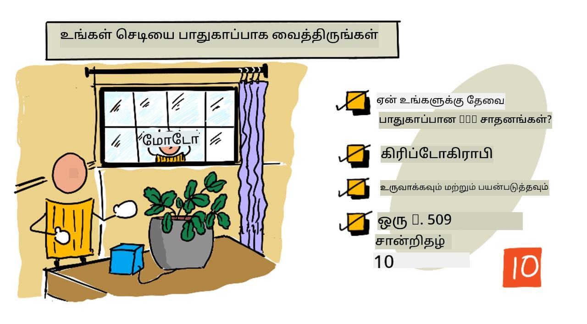
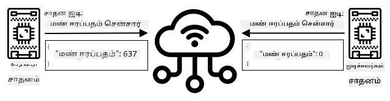
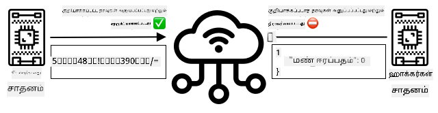
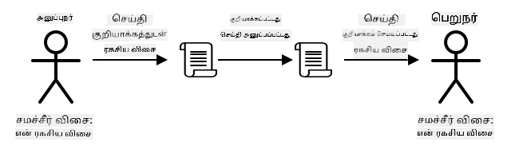
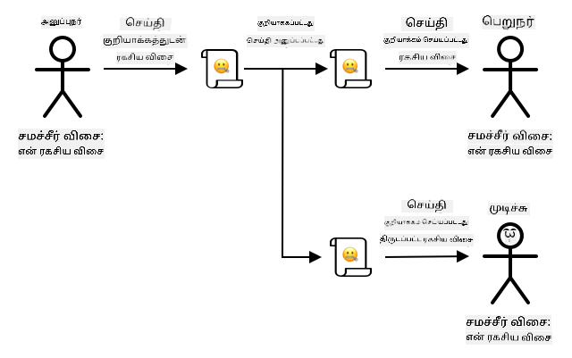
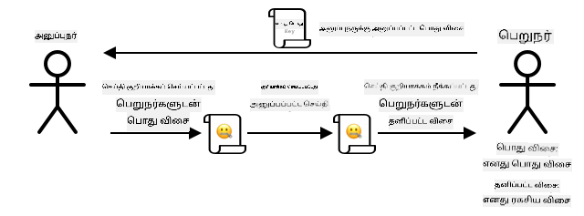
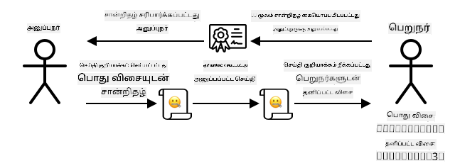

<!--
CO_OP_TRANSLATOR_METADATA:
{
  "original_hash": "81c437c568eee1b0dda1f04e88150d37",
  "translation_date": "2025-10-11T12:41:13+00:00",
  "source_file": "2-farm/lessons/6-keep-your-plant-secure/README.md",
  "language_code": "ta"
}
-->
# உங்கள் செடிகளை பாதுகாப்பாக வைத்திருங்கள்



> ஸ்கெட்ச் நோட்: [நித்யா நரசிம்மன்](https://github.com/nitya). பெரிய பதிப்பை பார்க்க படத்தை கிளிக் செய்யவும்.

## பாடத்திற்கு முன் கேள்வி

[பாடத்திற்கு முன் கேள்வி](https://black-meadow-040d15503.1.azurestaticapps.net/quiz/19)

## அறிமுகம்

கடந்த சில பாடங்களில் நீங்கள் மண் கண்காணிப்பு IoT சாதனத்தை உருவாக்கி அதை மேகத்துடன் இணைத்துள்ளீர்கள். ஆனால், போட்டி விவசாயிகளுக்காக வேலை செய்யும் ஹேக்கர்கள் உங்கள் IoT சாதனங்களை கைப்பற்றினால் என்ன ஆகும்? அவர்கள் மண் ஈரப்பதம் அளவீடுகளை அதிகமாக அனுப்பி உங்கள் செடிகள் தண்ணீர் பெறாமல் இருக்கச் செய்யலாம் அல்லது தண்ணீர் பாய்ச்சும் அமைப்பை எப்போதும் இயக்கி உங்கள் செடிகளை அதிக தண்ணீரால் அழித்து, தண்ணீருக்கான செலவில் உங்களை சிக்கலுக்கு உள்ளாக்கலாம்.

இந்த பாடத்தில் IoT சாதனங்களை பாதுகாப்பாக வைத்திருக்க எப்படி என்பதை நீங்கள் கற்றுக்கொள்வீர்கள். இந்த திட்டத்திற்கான இறுதி பாடமாக, மேக வளங்களை சுத்தம் செய்யவும், செலவுகளை குறைக்கவும் நீங்கள் கற்றுக்கொள்வீர்கள்.

இந்த பாடத்தில் நாம் கவரும் தலைப்புகள்:

* [ஏன் IoT சாதனங்களை பாதுகாப்பாக வைத்திருக்க வேண்டும்?](../../../../../2-farm/lessons/6-keep-your-plant-secure)
* [கிரிப்டோகிராபி](../../../../../2-farm/lessons/6-keep-your-plant-secure)
* [உங்கள் IoT சாதனங்களை பாதுகாப்பாக வைத்திருங்கள்](../../../../../2-farm/lessons/6-keep-your-plant-secure)
* [X.509 சான்றிதழை உருவாக்கி பயன்படுத்துங்கள்](../../../../../2-farm/lessons/6-keep-your-plant-secure)

> 🗑 இந்த திட்டத்தின் இறுதி பாடம் இது, எனவே இந்த பாடத்தையும் பணியையும் முடித்த பிறகு உங்கள் மேக சேவைகளை சுத்தம் செய்ய மறக்காதீர்கள். பணியை முடிக்க சேவைகள் தேவைப்படும், எனவே முதலில் அதை முடிக்க உறுதிப்படுத்துங்கள்.
>
> [திட்டத்தை சுத்தம் செய்யும் வழிகாட்டி](../../../clean-up.md) தேவையானால் இதை எப்படி செய்வது என்பதைப் பார்க்கவும்.

## ஏன் IoT சாதனங்களை பாதுகாப்பாக வைத்திருக்க வேண்டும்?

IoT பாதுகாப்பு என்பது எதிர்பார்க்கப்படும் சாதனங்கள் மட்டுமே உங்கள் மேக IoT சேவையுடன் இணைந்து டெலிமெட்ரி அனுப்புவதையும், உங்கள் மேக சேவை மட்டுமே உங்கள் சாதனங்களுக்கு கட்டளைகளை அனுப்புவதையும் உறுதிப்படுத்துவது ஆகும். IoT தரவுகள் தனிப்பட்டதாகவும் இருக்கலாம், மருத்துவ அல்லது நெருக்கமான தரவுகளை உள்ளடக்கலாம், எனவே இந்த தரவுகள் கசியாமல் இருக்க உங்கள் முழு பயன்பாட்டும் பாதுகாப்பை கருத்தில் கொள்ள வேண்டும்.

உங்கள் IoT பயன்பாடு பாதுகாப்பாக இல்லாவிட்டால், பல அபாயங்கள் உள்ளன:

* போலி சாதனம் தவறான தரவுகளை அனுப்பி உங்கள் பயன்பாடு தவறாக பதிலளிக்கச் செய்யலாம். உதாரணமாக, அவர்கள் தொடர்ந்து அதிக மண் ஈரப்பதம் அளவீடுகளை அனுப்பலாம், இதனால் உங்கள் பாசன அமைப்பு எப்போதும் இயக்கப்படாது, உங்கள் செடிகள் தண்ணீர் இல்லாமல் இறக்கிவிடும்.
* அனுமதியற்ற பயனர்கள் IoT சாதனங்களிலிருந்து தரவுகளை படிக்கலாம், இதில் தனிப்பட்ட அல்லது வணிக முக்கியமான தரவுகள் இருக்கலாம்.
* ஹேக்கர்கள் சாதனத்தை அல்லது இணைக்கப்பட்ட ஹார்ட்வேரை சேதப்படுத்தும் வகையில் கட்டளைகளை அனுப்பலாம்.
* IoT சாதனத்துடன் இணைந்து, ஹேக்கர்கள் கூடுதல் நெட்வொர்க்குகளை அணுகி தனிப்பட்ட அமைப்புகளை அணுகலாம்.
* தீய நோக்குடைய பயனர்கள் தனிப்பட்ட தரவுகளை அணுகி அதை மிரட்டலுக்காக பயன்படுத்தலாம்.

இவை உண்மையான உலக நிகழ்வுகள், மற்றும் அடிக்கடி நடக்கின்றன. சில உதாரணங்கள் முந்தைய பாடங்களில் கொடுக்கப்பட்டன, ஆனால் மேலும் சில இங்கே உள்ளன:

* 2018-ல், ஹேக்கர்கள் ஒரு மீன் தொட்டியின் வெப்பநிலை கட்டுப்பாட்டில் திறந்த WiFi அணுகு புள்ளியை பயன்படுத்தி ஒரு கேசினோவின் நெட்வொர்க்கை அணுகி தரவுகளை திருடினர். [The Hacker News - Casino Gets Hacked Through Its Internet-Connected Fish Tank Thermometer](https://thehackernews.com/2018/04/iot-hacking-thermometer.html)
* 2016-ல், Mirai Botnet Dyn என்ற இணைய சேவை வழங்குநருக்கு எதிராக ஒரு சேவை மறுப்பு தாக்குதலை தொடங்கியது, இதனால் இணையத்தின் பெரிய பகுதிகள் முடங்கின. இந்த Botnet DVRs மற்றும் கேமராக்கள் போன்ற IoT சாதனங்களை இணைக்க மால்வேரைப் பயன்படுத்தியது, அவை இயல்புநிலை பயனர் பெயர்கள் மற்றும் கடவுச்சொற்களை பயன்படுத்தின. [The Guardian - DDoS attack that disrupted internet was largest of its kind in history, experts say](https://www.theguardian.com/technology/2016/oct/26/ddos-attack-dyn-mirai-botnet)
* Spiral Toys, CloudPets இணைக்கப்பட்ட பொம்மைகளின் பயனர் தரவுகளை இணையத்தில் பொதுவாக கிடைக்க வைத்தது. [Troy Hunt - Data from connected CloudPets teddy bears leaked and ransomed, exposing kids' voice messages](https://www.troyhunt.com/data-from-connected-cloudpets-teddy-bears-leaked-and-ransomed-exposing-kids-voice-messages/).
* Strava, நீங்கள் ஓடிக்கொண்டிருந்த பாதையை காட்டி, அந்நியர்கள் உங்கள் வீட்டை எளிதாக கண்டறிய அனுமதித்தது. [Kim Komndo - Fitness app could lead a stranger right to your home — change this setting](https://www.komando.com/security-privacy/strava-fitness-app-privacy/755349/).

✅ ஒரு ஆராய்ச்சி செய்யுங்கள்: IoT ஹேக்குகள் மற்றும் IoT தரவுகளின் மீறல்களை, குறிப்பாக இணையத்துடன் இணைக்கப்பட்ட பல் தூரிகைகள் அல்லது எடை அளவீடுகள் போன்ற தனிப்பட்ட பொருட்களுடன் தொடர்புடையவற்றை தேடுங்கள். இந்த ஹேக்குகள் பாதிக்கப்பட்டவர்களுக்கோ அல்லது வாடிக்கையாளர்களுக்கோ என்ன தாக்கத்தை ஏற்படுத்தும் என்று சிந்தியுங்கள்.

> 💁 பாதுகாப்பு என்பது மிகப்பெரிய தலைப்பு, இந்த பாடம் உங்கள் சாதனத்தை மேகத்துடன் இணைப்பதற்கான அடிப்படைகளை மட்டுமே தொடும். தரவுகள் மாற்றங்களை கண்காணித்தல், சாதனங்களை நேரடியாக ஹேக்குதல், அல்லது சாதன அமைப்புகளில் மாற்றங்கள் போன்றவை இந்த பாடத்தில் கவரப்படாது. IoT ஹேக்கிங் ஒரு பெரிய அச்சுறுத்தலாக இருப்பதால், [Azure Defender for IoT](https://azure.microsoft.com/services/azure-defender-for-iot/?WT.mc_id=academic-17441-jabenn) போன்ற கருவிகள் உருவாக்கப்பட்டுள்ளன. இந்த கருவிகள் உங்கள் கணினியில் இருக்கும் வைரஸ் எதிர்ப்பு மற்றும் பாதுகாப்பு கருவிகளுக்கு ஒத்ததாக இருக்கும், ஆனால் சிறிய, குறைந்த சக்தி கொண்ட IoT சாதனங்களுக்கு வடிவமைக்கப்பட்டவை.

## கிரிப்டோகிராபி

ஒரு சாதனம் IoT சேவையுடன் இணைக்கும்போது, அது தன்னை அடையாளம் காண ID ஐ பயன்படுத்துகிறது. இந்த ID க்ளோன் செய்யப்படலாம் - ஒரு ஹேக்கர் ஒரு தீய நோக்குடைய சாதனத்தை அமைத்து, உண்மையான சாதனத்தின் ID ஐ பயன்படுத்தி தவறான தரவுகளை அனுப்பலாம்.



இதற்கான தீர்வு, அனுப்பப்படும் தரவுகளை ஒரு குழப்பமான வடிவமாக மாற்றுவது, சாதனத்திற்கும் மேகத்திற்கும் மட்டுமே தெரிந்த ஒரு மதிப்பைப் பயன்படுத்தி. இந்த செயல்முறை *குறியாக்கம்* என்று அழைக்கப்படுகிறது, மற்றும் தரவுகளை குறியாக்கம் செய்ய பயன்படுத்தப்படும் மதிப்பு *குறியாக்க விசை* என்று அழைக்கப்படுகிறது.



மேக சேவை பின்னர் தரவுகளை வாசிக்கக்கூடிய வடிவமாக மாற்றும், *குறியாக்கம்* என்று அழைக்கப்படும் ஒரு செயல்முறையைப் பயன்படுத்தி, அதே குறியாக்க விசையையோ அல்லது *குறியாக்க விசையையோ* பயன்படுத்தி. குறியாக்க செய்தியை விசை மூலம் குறியாக்கம் செய்ய முடியாவிட்டால், சாதனம் ஹேக்கப்பட்டுள்ளது, மற்றும் செய்தி நிராகரிக்கப்படும்.

குறியாக்கம் மற்றும் குறியாக்கம் செய்யும் தொழில்நுட்பம் *கிரிப்டோகிராபி* என்று அழைக்கப்படுகிறது.

### ஆரம்ப கால கிரிப்டோகிராபி

கிரிப்டோகிராபியின் ஆரம்ப கால வகைகள் 3,500 ஆண்டுகளுக்கு முந்தையவை, மாற்று சைபர்களாக இருந்தன. மாற்று சைபர்கள் ஒரு எழுத்தை மற்றொரு எழுத்துடன் மாற்றுவது. உதாரணமாக, [Caesar cipher](https://wikipedia.org/wiki/Caesar_cipher) என்பது எழுத்துக்களை ஒரு குறிப்பிட்ட அளவுக்கு மாற்றுவது, குறியாக்க செய்தியை அனுப்பும் நபரும், பெறும் நபரும் எத்தனை எழுத்துக்களை மாற்ற வேண்டும் என்பதை மட்டும் அறிந்திருப்பார்கள்.

[Vigenère cipher](https://wikipedia.org/wiki/Vigenère_cipher) இதை மேலும் மேம்படுத்தி, எழுத்துக்களை மாற்ற வார்த்தைகளை பயன்படுத்தியது, இதனால் மூல உரையில் உள்ள ஒவ்வொரு எழுத்தும் ஒரு மாறுபட்ட அளவுக்கு மாற்றப்பட்டது, எப்போதும் ஒரே எண்ணிக்கையிலிருந்து மாற்றப்படாமல்.

கிரிப்டோகிராபி பல்வேறு நோக்கங்களுக்காக பயன்படுத்தப்பட்டது, உதாரணமாக, பழமையான மெசபொட்டாமியாவில் ஒரு பாண்டு கண்ணாடி ரெசிபியை பாதுகாப்பது, இந்தியாவில் ரகசிய காதல் குறிப்புகளை எழுதுவது, அல்லது பழமையான எகிப்திய மந்திரங்களை ரகசியமாக வைத்திருப்பது.

### நவீன கிரிப்டோகிராபி

நவீன கிரிப்டோகிராபி மிகவும் மேம்பட்டது, ஆரம்ப கால முறைகளை விட உடைக்க கடினமாக உள்ளது. நவீன கிரிப்டோகிராபி சிக்கலான கணிதங்களை பயன்படுத்தி தரவுகளை குறியாக்கம் செய்கிறது, இது பல்வேறு விசைகளை முயற்சிக்கும் தாக்குதல்களை (brute force attacks) சாத்தியமாக்காது.

குறியாக்கம் பாதுகாப்பான தொடர்புகளுக்கு பல்வேறு வழிகளில் பயன்படுத்தப்படுகிறது. நீங்கள் GitHub-ல் இந்த பக்கத்தைப் படிக்கிறீர்கள் என்றால், இணையதள முகவரியில் *HTTPS* என்று தொடங்குவது கவனிக்கலாம், இது உங்கள் உலாவி மற்றும் GitHub-இன் இணைய சேவையகங்களுக்கிடையிலான தொடர்பு குறியாக்கம் செய்யப்பட்டிருப்பதை குறிக்கிறது. உங்கள் உலாவி மற்றும் GitHub இடையே பாயும் இணைய போக்குவரத்தை யாராவது படிக்க முடிந்தால், அவர்கள் தரவுகளை வாசிக்க முடியாது, ஏனெனில் அது குறியாக்கம் செய்யப்பட்டிருக்கும். உங்கள் கணினி கூட உங்கள் ஹார்ட்டிஸ்கில் உள்ள அனைத்து தரவுகளையும் குறியாக்கம் செய்யலாம், யாராவது அதை திருடினால், உங்கள் கடவுச்சொல்லை இல்லாமல் உங்கள் தரவுகளை வாசிக்க முடியாது.

> 🎓 HTTPS என்பது HyperText Transfer Protocol **Secure** என்பதற்கான சுருக்கமாகும்.

துரதிர்ஷ்டவசமாக, எல்லாம் பாதுகாப்பாக இல்லை. சில சாதனங்களுக்கு எந்த பாதுகாப்பும் இல்லை, சில சாதனங்கள் உடைக்க எளிதான விசைகளை பயன்படுத்தி பாதுகாக்கப்பட்டுள்ளன, அல்லது ஒரே வகையான அனைத்து சாதனங்களும் ஒரே விசையைப் பயன்படுத்துகின்றன. WiFi அல்லது Bluetooth மூலம் இணைக்க மிகவும் தனிப்பட்ட IoT சாதனங்கள் அனைத்தும் ஒரே கடவுச்சொல்லை கொண்டிருப்பதாகக் கூறப்பட்டுள்ளன. நீங்கள் உங்கள் சாதனத்துடன் இணைக்க முடிந்தால், மற்றவரின் சாதனத்துடன் இணைக்க முடியும். ஒருமுறை இணைக்கப்பட்டால், நீங்கள் மிகவும் தனிப்பட்ட தரவுகளை அணுகலாம், அல்லது அவர்களின் சாதனத்தை கட்டுப்படுத்தலாம்.

> 💁 நவீன கிரிப்டோகிராபியின் சிக்கல்களும், குறியாக்கத்தை உடைக்க பில்லியன் ஆண்டுகள் ஆகும் என்ற கூற்றுகளும் இருந்தாலும், குவாண்டம் கணினி வளர்ச்சியால் அனைத்து அறியப்பட்ட குறியாக்கங்களையும் மிகவும் குறுகிய காலத்தில் உடைக்க முடியும் என்ற சாத்தியங்கள் உருவாகியுள்ளன!

### சமமற்ற மற்றும் சமமான விசைகள்

குறியாக்கம் இரண்டு வகைகளில் வருகிறது - சமமான மற்றும் சமமற்ற.

**சமமான** குறியாக்கம் தரவுகளை குறியாக்கம் செய்யவும் குறியாக்கம் செய்யவும் ஒரே விசையை பயன்படுத்துகிறது. அனுப்புநரும் பெறுநரும் ஒரே விசையை அறிந்திருக்க வேண்டும். இது குறைவான பாதுகாப்பானது, ஏனெனில் விசை எப்படியாவது பகிரப்பட வேண்டும். அனுப்புநர் குறியாக்க செய்தியை பெறுநருக்கு அனுப்ப, அனுப்புநர் முதலில் விசையை அனுப்ப வேண்டியிருக்கும்.



விசை போக்குவரத்தில் திருடப்பட்டால், அல்லது அனுப்புநர் அல்லது பெறுநர் ஹேக்கிங் செய்யப்பட்டு விசை கண்டுபிடிக்கப்பட்டால், குறியாக்கம் உடைக்கப்படும்.



**சமமற்ற** குறியாக்கம் 2 விசைகளை பயன்படுத்துகிறது - குறியாக்க விசை மற்றும் குறியாக்க விசை, பொதுவாக பொதுவான/தனிப்பட்ட விசை ஜோடி என்று குறிப்பிடப்படுகிறது. பொதுவான விசை செய்தியை குறியாக்கம் செய்ய பயன்படுத்தப்படுகிறது, ஆனால் அதை குறியாக்கம் செய்ய பயன்படுத்த முடியாது, தனிப்பட்ட விசை செய்தியை குறியாக்கம் செய்ய பயன்படுத்தப்படுகிறது, ஆனால் அதை குறியாக்கம் செய்ய முடியாது.



பெறுநர் தனது பொதுவான விசையை பகிர்கிறார், மற்றும் அனுப்புநர் இதை பயன்படுத்தி செய்தியை குறியாக்கம் செய்கிறார். ஒரு முறை செய்தி அனுப்பப்பட்ட பிறகு, பெறுநர் தனது தனிப்பட்ட விசையைப் பயன்படுத்தி அதை குறியாக்கம் செய்கிறார். சமமற்ற குறியாக்கம் அதிக பாதுகாப்பானது, ஏனெனில் தனிப்பட்ட விசை பெறுநரால் தனிப்பட்டதாக வைத்திருக்கப்படுகிறது மற்றும் ஒருபோதும் பகிரப்படாது. யாரும் பொதுவான விசையைப் பெறலாம், ஏனெனில் இது செய்திகளை குறியாக்கம் செய்ய மட்டுமே பயன்படுத்தப்படுகிறது.

சமமான குறியாக்கம் சமமற்ற குறியாக்கத்தை விட வேகமாக உள்ளது, சமமற்றது அதிக பாதுகாப்பானது. சில அமைப்புகள் இரண்டையும் பயன்படுத்தும் - சமமற்ற குறியாக்கத்தை பயன்படுத்தி சமமான விசையை குறியாக்கம் செய்து பகிர, பின்னர் அனைத்து தரவுகளையும் குறியாக்கம் செய்ய சமமான விசையை பயன்படுத்தும். இது அனுப்புநர் மற்றும் பெறுநருக்கு இடையே சமமான விசையை பகிர்வதை அதிக பாதுகாப்பாகவும், தரவுகளை குறியாக்கம் மற்றும் குறியாக்கம் செய்ய வேகமாகவும் செய்கிறது.

## உங்கள் IoT சாதனங்களை பாதுகாப்பாக வைத்திருங்கள்

IoT சாதனங்களை சமமான அல்லது சமமற்ற குறியாக்கத்தைப் பயன்படுத்தி பாதுகாக்கலாம். சமமானது எளிதானது, ஆனால் குறைவான பாதுகாப்பானது.

### சமமான விசைகள்

நீங்கள் உங்கள் IoT சாதனத்தை IoT Hub உடன் தொடர்பு கொள்ள அமைத்தபோது, நீங்கள் ஒரு இணைப்பு சரத்தை (connection string) பயன்படுத்தினீர்கள். ஒரு உதாரண இணைப்பு சரம்:

```output
HostName=soil-moisture-sensor.azure-devices.net;DeviceId=soil-moisture-sensor;SharedAccessKey=Bhry+ind7kKEIDxubK61RiEHHRTrPl7HUow8cEm/mU0=
```

இந்த இணைப்பு சரம் மூன்று பகுதிகளால் பிரிக்கப்பட்டுள்ளது, ஒவ்வொரு பகுதியும் ஒரு விசை மற்றும் ஒரு மதிப்புடன்:

| விசை | மதிப்பு | விளக்கம் |
| --- | ----- | ----------- |
| HostName | `soil-moisture-sensor.azure-devices.net` | IoT Hub இன் URL |
| DeviceId | `soil-moisture-sensor` | சாதனத்தின் தனித்துவமான ID |
| SharedAccessKey | `Bhry+ind7kKEIDxubK61RiEHHRTrPl7HUow8cEm/mU0=` | IoT Hub மற்றும் சாதனத்திற்கும் தெரிந்த ஒரு சமமான விசை |

இந்த இணைப்பு சரத்தின் கடைசி பகுதி, `SharedAccessKey`, IoT Hub மற்றும் சாதனத்திற்கும் தெரிந்த சமமான விசையாகும். இந்த விசை சாதனத்திலிருந்து மேகத்திற்கோ அல்லது மேகத்திலிருந்து சாதனத்திற்கோ அனுப்பப்படாது. இதற்கு பதிலாக அனுப்பப்படும் அல்லது பெறப்படும் தரவுகளை குறியாக்கம் செய்ய இது பயன்படுத்தப்படுகிறது.

✅ ஒரு பரிசோதனை செய்யுங்கள். உங்கள் IoT சாதனத்தை இணைக்கும் போது இணைப்பு சரத்தின் `SharedAccessKey` பகுதியை மாற்றினால் என்ன நடக்கும் என்று நீங்கள் நினைக்கிறீர்கள்? அதை முயற்சிக்கவும்.

சாதனம் முதலில் இணைக்க முயற்சிக்கும் போது, அது URL, ஒரு காலக்கெடு (சாதாரணமாக தற்போதைய நேரத்திலிருந்து 1 நாள்) மற்றும் ஒரு கையொப்பம் கொண்ட ஒரு Shared Access Signature (SAS) டோக்கனை அனுப்புகிறது. இந்த கையொப்பம் URL மற்றும் காலக்கெடு `SharedAccessKey` மூலம் குறியாக்கம் செய்யப்பட்டதாகும்.

IoT Hub இந்த கையொப்பத்தை `SharedAccessKey` மூலம் குறியாக்கம் செய்கிறது, மற்றும் குறியாக்கம் செய்யப்பட்ட மதிப்பு URL மற்றும்
💁 உங்கள் IoT சாதனத்திற்கு சரியான நேரத்தை தெரிந்துகொள்ள வேண்டும், ஏனெனில் காலாவதியான நேரம் காரணமாக, சாதாரணமாக [NTP](https://wikipedia.org/wiki/Network_Time_Protocol) சர்வரில் இருந்து நேரத்தைப் படிக்க வேண்டும். நேரம் சரியாக இல்லையெனில், இணைப்பு தோல்வியடையும்.

இணைப்புக்குப் பிறகு, சாதனத்திலிருந்து IoT Hub-க்கு அனுப்பப்படும் அனைத்து தரவுகளும் அல்லது IoT Hub-லிருந்து சாதனத்திற்கு அனுப்பப்படும் அனைத்து தரவுகளும் பகிரப்பட்ட அணுகல் விசையால் குறியாக்கம் செய்யப்படும்.

✅ பல சாதனங்கள் ஒரே இணைப்பு string-ஐப் பகிர்ந்தால் என்ன நடக்கும் என்று நீங்கள் நினைக்கிறீர்களா?

💁 இந்த விசையை குறியீட்டில் சேமிப்பது மோசமான பாதுகாப்பு நடைமுறையாகும். ஒரு ஹேக்கர் உங்கள் மூலக் குறியீட்டைப் பெறினால், அவர்கள் உங்கள் விசையைப் பெற முடியும். மேலும், குறியீட்டை புதுப்பிக்க ஒவ்வொரு சாதனத்திற்கும் குறியீட்டை மீண்டும் தொகுக்க வேண்டியதால், குறியீட்டை வெளியிடுவது கடினமாக இருக்கும். இந்த விசையை IoT சாதனத்தில் குறியாக்கப்பட்ட மதிப்புகளைச் சேமிக்கும் ஒரு ஹார்ட்வேரின் பாதுகாப்பு மாடியிலிருந்து ஏற்றுவது சிறந்தது.

IoT கற்றுக்கொள்வதில், நீங்கள் முன்பே செய்தபடி, இந்த விசையை குறியீட்டில் வைக்க எளிதாக இருக்கும், ஆனால் இந்த விசை பொதுவான மூலக் குறியீட்டு கட்டுப்பாட்டில் சரிபார்க்கப்படாதது என்பதை உறுதிப்படுத்த வேண்டும்.

சாதனங்களுக்கு 2 விசைகள் மற்றும் 2 தொடர்புடைய இணைப்பு strings உள்ளன. இது விசைகளை சுழற்சியடையச் செய்ய உதவுகிறது - அதாவது முதல் விசை பாதிக்கப்பட்டால் மற்றொன்றுக்கு மாறி, முதல் விசையை மீண்டும் உருவாக்கலாம்.

### X.509 சான்றிதழ்கள்

நீங்கள் பொதுவான/தனிப்பட்ட விசை ஜோடியுடன் அசிமெட்ரிக் குறியாக்கத்தைப் பயன்படுத்தும்போது, உங்கள் பொதுவான விசையை தரவுகளை அனுப்ப விரும்பும் யாருக்கும் வழங்க வேண்டும். பிரச்சினை என்னவென்றால், உங்கள் விசையைப் பெறும் நபர் அது உண்மையில் உங்கள் பொதுவான விசையா, அல்லது யாரோ உங்களைப் போல நடிக்கிறார்களா என்பதை எப்படி உறுதிப்படுத்த முடியும்? விசையை வழங்குவதற்குப் பதிலாக, நீங்கள் ஒரு சான்றிதழில் உங்கள் பொதுவான விசையை வழங்கலாம், இது ஒரு நம்பகமான மூன்றாம் தரப்பால் சரிபார்க்கப்பட்டுள்ளது, இது X.509 சான்றிதழ் என்று அழைக்கப்படுகிறது.

X.509 சான்றிதழ்கள் பொதுவான/தனிப்பட்ட விசை ஜோடியின் பொதுவான விசை பகுதியை உள்ளடக்கிய டிஜிட்டல் ஆவணங்கள். இவை பொதுவாக [சான்றிதழ் அதிகாரங்கள்](https://wikipedia.org/wiki/Certificate_authority) (CAs) என்று அழைக்கப்படும் நம்பகமான அமைப்புகளால் வழங்கப்படுகின்றன மற்றும் CA மூலம் டிஜிட்டலாக கையொப்பமிடப்பட்டு, விசை செல்லுபடியாகும் மற்றும் உங்களிடமிருந்து வருகிறது என்பதை குறிக்கிறது. நீங்கள் சான்றிதழை நம்புகிறீர்கள், மேலும் சான்றிதழ் கூறும் நபரிடமிருந்து பொதுவான விசை வந்தது என்பதை நம்புகிறீர்கள், ஏனெனில் நீங்கள் CA-ஐ நம்புகிறீர்கள், இது ஒரு நாட்டின் பாஸ்போர்ட் அல்லது ஓட்டுநர் உரிமத்தை நம்புவது போல. சான்றிதழ்கள் பணம் செலவாகும், எனவே நீங்கள் 'சுய கையொப்பம்' செய்யலாம், அதாவது சோதனை நோக்கங்களுக்காக உங்களால் கையொப்பமிடப்பட்ட சான்றிதழை உருவாக்கலாம்.

💁 உற்பத்தி வெளியீட்டிற்காக சுய கையொப்பமிடப்பட்ட சான்றிதழை ஒருபோதும் பயன்படுத்தக்கூடாது.

இந்த சான்றிதழ்களில் பல துறைகள் உள்ளன, அதில் பொதுவான விசை யாரிடமிருந்து வந்தது, CA-வின் விவரங்கள், அது எவ்வளவு காலத்திற்கு செல்லுபடியாகும், மற்றும் பொதுவான விசை ஆகியவை அடங்கும். சான்றிதழைப் பயன்படுத்துவதற்கு முன், அது முதன்மை CA மூலம் கையொப்பமிடப்பட்டது என்பதை சரிபார்ப்பது நல்ல நடைமுறையாகும்.

✅ சான்றிதழில் உள்ள துறைகளின் முழு பட்டியலை [Microsoft Understanding X.509 Public Key Certificates tutorial](https://docs.microsoft.com/azure/iot-hub/tutorial-x509-certificates?WT.mc_id=academic-17441-jabenn#certificate-fields) இல் படிக்கலாம்.

X.509 சான்றிதழ்களைப் பயன்படுத்தும்போது, அனுப்புநரும் பெறுநரும் தங்களது சொந்த பொதுவான மற்றும் தனிப்பட்ட விசைகளை வைத்திருப்பார்கள், மேலும் X.509 சான்றிதழ்களையும் வைத்திருப்பார்கள், இது பொதுவான விசையை உள்ளடக்கியது. அவர்கள் X.509 சான்றிதழ்களை பரிமாற்றி, IoT Hub-க்கு அனுப்பும் தரவுகளை குறியாக்குவதற்கு ஒருவரின் பொதுவான விசையைப் பயன்படுத்தி, IoT Hub-லிருந்து பெறும் தரவுகளை குறியாக்கம் செய்ய தங்களது தனிப்பட்ட விசையைப் பயன்படுத்துகிறார்கள்.



X.509 சான்றிதழ்களைப் பயன்படுத்துவதன் ஒரு பெரிய நன்மை என்னவென்றால், அவற்றை சாதனங்களுக்கு இடையே பகிரலாம். நீங்கள் ஒரு சான்றிதழை உருவாக்கி, அதை IoT Hub-க்கு பதிவேற்றி, உங்கள் அனைத்து சாதனங்களுக்கும் இதைப் பயன்படுத்தலாம். ஒவ்வொரு சாதனமும் IoT Hub-லிருந்து பெறும் செய்திகளை குறியாக்கம் செய்ய தனிப்பட்ட விசையை மட்டும் தெரிந்துகொள்ள வேண்டும்.

IoT Hub-க்கு அனுப்பும் செய்திகளை குறியாக்கம் செய்ய உங்கள் சாதனம் பயன்படுத்தும் சான்றிதழ் Microsoft மூலம் வெளியிடப்பட்டுள்ளது. இது Azure சேவைகள் பல பயன்படுத்தும் ஒரே சான்றிதழ், மேலும் சில நேரங்களில் SDKக்களில் உள்ளடக்கப்பட்டுள்ளது.

💁 நினைவில் கொள்ளுங்கள், பொதுவான விசை என்பது பொதுவானது - பொதுவான Azure விசை Azure-க்கு அனுப்பப்படும் தரவுகளை குறியாக்கம் செய்ய மட்டுமே பயன்படுத்தப்படலாம், அதை குறியாக்கம் செய்ய முடியாது, எனவே அதை எங்கும் பகிரலாம், மூலக் குறியீட்டிலும். உதாரணமாக, நீங்கள் அதை [Azure IoT C SDK source code](https://github.com/Azure/azure-iot-sdk-c/blob/master/certs/certs.c) இல் காணலாம்.

✅ X.509 சான்றிதழ்களுடன் பல தொழில்நுட்ப சொற்கள் உள்ளன. நீங்கள் [The layman’s guide to X.509 certificate jargon](https://techcommunity.microsoft.com/t5/internet-of-things/the-layman-s-guide-to-x-509-certificate-jargon/ba-p/2203540?WT.mc_id=academic-17441-jabenn) இல் சில சொற்களின் வரையறைகளைப் படிக்கலாம்.

## X.509 சான்றிதழை உருவாக்கி பயன்படுத்தவும்

X.509 சான்றிதழை உருவாக்குவதற்கான படிகள்:

1. பொதுவான/தனிப்பட்ட விசை ஜோடியை உருவாக்கவும். பொதுவான/தனிப்பட்ட விசை ஜோடியை உருவாக்க மிகவும் பரவலாக பயன்படுத்தப்படும் ஆல்காரிதம் [Rivest–Shamir–Adleman](https://wikipedia.org/wiki/RSA_(cryptosystem))(RSA) என்று அழைக்கப்படுகிறது.

1. பொதுவான விசையை தொடர்புடைய தரவுடன் கையொப்பமிட CA அல்லது சுய கையொப்பமிடுவதற்காக சமர்ப்பிக்கவும்.

Azure CLI-யில் IoT Hub-ல் புதிய சாதன அடையாளத்தை உருவாக்கவும், பொதுவான/தனிப்பட்ட விசை ஜோடியை தானாக உருவாக்கவும், சுய கையொப்பமிடப்பட்ட சான்றிதழை உருவாக்கவும் கட்டளைகள் உள்ளன.

💁 Azure CLI-யை பயன்படுத்துவதற்குப் பதிலாக, விரிவான படிகளைப் பார்க்க விரும்பினால், [Using OpenSSL to create self-signed certificates tutorial in the Microsoft IoT Hub documentation](https://docs.microsoft.com/azure/iot-hub/tutorial-x509-self-sign?WT.mc_id=academic-17441-jabenn) இல் காணலாம்.

### Task - X.509 சான்றிதழைப் பயன்படுத்தி சாதன அடையாளத்தை உருவாக்கவும்

1. புதிய சாதன அடையாளத்தை பதிவு செய்ய, விசைகள் மற்றும் சான்றிதழ்களை தானாக உருவாக்கும் கீழே உள்ள கட்டளையை இயக்கவும்:

    ```sh
    az iot hub device-identity create --device-id soil-moisture-sensor-x509 \
                                      --am x509_thumbprint \
                                      --output-dir . \
                                      --hub-name <hub_name>
    ```

    `<hub_name>` ஐ உங்கள் IoT Hub-க்கான பெயருடன் மாற்றவும்.

    இது `soil-moisture-sensor-x509` என்ற ID கொண்ட சாதனத்தை உருவாக்கும், இது நீங்கள் கடந்த பாடத்தில் உருவாக்கிய சாதன அடையாளத்திலிருந்து வேறுபட்டது. இந்த கட்டளையும் தற்போதைய கோப்பகத்தில் 2 கோப்புகளை உருவாக்கும்:

    * `soil-moisture-sensor-x509-key.pem` - இந்த கோப்பு சாதனத்திற்கான தனிப்பட்ட விசையை உள்ளடக்கியது.
    * `soil-moisture-sensor-x509-cert.pem` - இது சாதனத்திற்கான X.509 சான்றிதழ் கோப்பு.

    இந்த கோப்புகளை பாதுகாப்பாக வைத்திருங்கள்! தனிப்பட்ட விசை கோப்பு பொதுவான மூலக் குறியீட்டு கட்டுப்பாட்டில் சரிபார்க்கப்படக்கூடாது.

### Task - உங்கள் சாதனக் குறியீட்டில் X.509 சான்றிதழைப் பயன்படுத்தவும்

X.509 சான்றிதழைப் பயன்படுத்தி உங்கள் IoT சாதனத்தை மேகத்துடன் இணைக்க தொடர்புடைய வழிகாட்டுதலைப் பின்பற்றவும்:

* [Arduino - Wio Terminal](wio-terminal-x509.md)
* [Single-board computer - Raspberry Pi/Virtual IoT device](single-board-computer-x509.md)

---

## 🚀 சவால்

Resource Groups மற்றும் IoT Hubs போன்ற Azure சேவைகளை உருவாக்க, நிர்வகிக்க மற்றும் நீக்க பல வழிகள் உள்ளன. ஒரு வழி [Azure Portal](https://portal.azure.com?WT.mc_id=academic-17441-jabenn) - இது உங்கள் Azure சேவைகளை நிர்வகிக்க GUI வழங்கும் வலை அடிப்படையிலான இடைமுகம்.

[portal.azure.com](https://portal.azure.com?WT.mc_id=academic-17441-jabenn) க்கு செல்லவும் மற்றும் போர்டலை ஆராயவும். போர்டல் மூலம் IoT Hub ஒன்றை உருவாக்கி, அதை நீக்க முடியுமா என்பதைப் பாருங்கள்.

**Hint** - போர்டல் மூலம் சேவைகளை உருவாக்கும்போது, Resource Group ஐ முன்கூட்டியே உருவாக்க தேவையில்லை, சேவையை உருவாக்கும் போது ஒன்றை உருவாக்கலாம். நீங்கள் முடித்தவுடன் அதை நீக்குவதை உறுதிப்படுத்துங்கள்!

Azure Portal பற்றிய ஆவணங்கள், பயிற்சிகள் மற்றும் வழிகாட்டுதல்களை [Azure portal documentation](https://docs.microsoft.com/azure/azure-portal/?WT.mc_id=academic-17441-jabenn) இல் காணலாம்.

## Post-lecture quiz

[Post-lecture quiz](https://black-meadow-040d15503.1.azurestaticapps.net/quiz/20)

## Review & Self Study

* [History of cryptography page on Wikipedia](https://wikipedia.org/wiki/History_of_cryptography) இல் குறியாக்கத்தின் வரலாற்றைப் படிக்கவும்.
* [X.509 page on Wikipedia](https://wikipedia.org/wiki/X.509) இல் X.509 சான்றிதழ்களைப் படிக்கவும்.

## Assignment

[புதிய IoT சாதனத்தை உருவாக்கவும்](assignment.md)

---

**அறிவிப்பு**:  
இந்த ஆவணம் [Co-op Translator](https://github.com/Azure/co-op-translator) என்ற AI மொழிபெயர்ப்பு சேவையை பயன்படுத்தி மொழிபெயர்க்கப்பட்டுள்ளது. நாங்கள் துல்லியத்திற்காக முயற்சிக்கிறோம், ஆனால் தானியங்கி மொழிபெயர்ப்புகளில் பிழைகள் அல்லது துல்லியக்குறைவுகள் இருக்கக்கூடும் என்பதை தயவுசெய்து கவனத்தில் கொள்ளவும். அதன் சொந்த மொழியில் உள்ள மூல ஆவணம் அதிகாரப்பூர்வ ஆதாரமாக கருதப்பட வேண்டும். முக்கியமான தகவல்களுக்கு, தொழில்முறை மனித மொழிபெயர்ப்பு பரிந்துரைக்கப்படுகிறது. இந்த மொழிபெயர்ப்பைப் பயன்படுத்துவதால் ஏற்படும் எந்த தவறான புரிதல்களுக்கும் அல்லது தவறான விளக்கங்களுக்கும் நாங்கள் பொறுப்பல்ல.