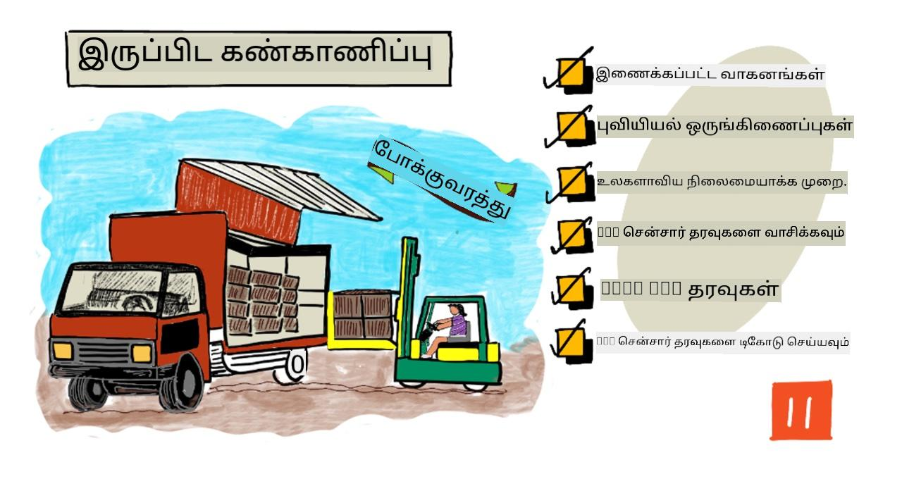
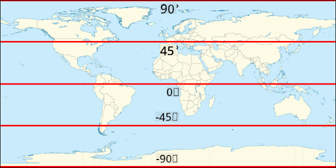
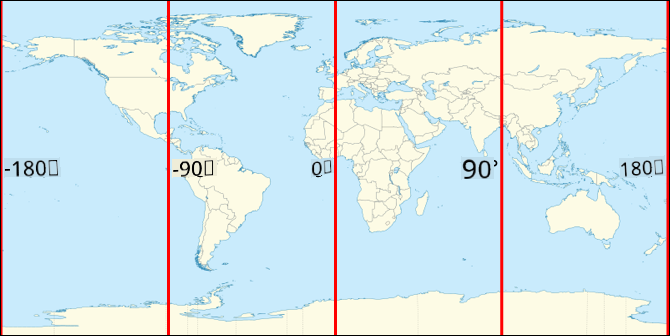
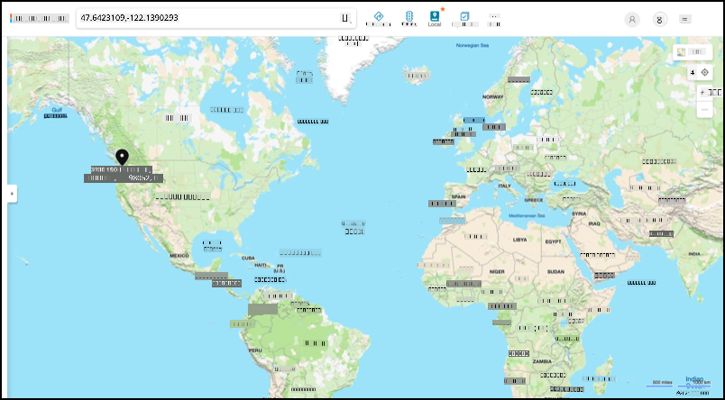
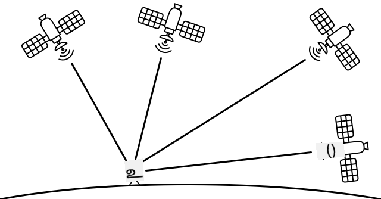

<!--
CO_OP_TRANSLATOR_METADATA:
{
  "original_hash": "52ed2bd997d08040f79a1a6ef2bac958",
  "translation_date": "2025-10-11T11:57:21+00:00",
  "source_file": "3-transport/lessons/1-location-tracking/README.md",
  "language_code": "ta"
}
-->
# இடம் கண்காணிப்பு

> ஸ்கெட்ச் நோட்: [நித்யா நரசிம்மன்](https://github.com/nitya). படத்தை கிளிக் செய்து பெரிய பதிப்பைப் பாருங்கள்.

## முன்னோட்ட கேள்வி

[முன்னோட்ட கேள்வி](https://black-meadow-040d15503.1.azurestaticapps.net/quiz/21)

## அறிமுகம்

விவசாயியிடமிருந்து நுகர்வோருக்கு உணவுப் பொருட்களை கொண்டு செல்லும் முக்கிய செயல்முறை, பொருட்களை பெட்டிகளில் ஏற்றி, லாரிகள், கப்பல்கள், விமானங்கள் அல்லது பிற வணிக போக்குவரத்து வாகனங்களில் கொண்டு சென்று, உணவை எங்காவது வழங்குவது - நேரடியாக வாடிக்கையாளருக்கு அல்லது மையக் களஞ்சியத்திற்கு அல்லது சுத்திகரிப்பு நிலையத்திற்கு. விவசாயத்திலிருந்து நுகர்வோருக்கு உணவுப் பொருட்கள் செல்லும் முழு செயல்முறை *சப்ளை சேன்* என அழைக்கப்படுகிறது. அரிசோனா மாநில பல்கலைக்கழகத்தின் W. P. Carey School of Business வழங்கிய வீடியோ, சப்ளை சேன் மற்றும் அதன் மேலாண்மை பற்றிய விரிவான விளக்கத்தை வழங்குகிறது.

> 🎥 மேலே உள்ள படத்தை கிளிக் செய்து வீடியோவைப் பாருங்கள்

IoT சாதனங்களைச் சேர்ப்பது உங்கள் சப்ளை சேனை மிகவும் மேம்படுத்த முடியும், பொருட்கள் எங்கு உள்ளன என்பதை நிர்வகிக்க, போக்குவரத்து மற்றும் பொருட்களின் கையாளுதலை சிறப்பாக திட்டமிட, மற்றும் பிரச்சினைகளுக்கு விரைவாக பதிலளிக்க உதவுகிறது.

லாரிகள் போன்ற வாகனங்களின் படையினை நிர்வகிக்கும் போது, ஒவ்வொரு நேரத்திலும் ஒவ்வொரு வாகனம் எங்கு உள்ளது என்பதை அறிந்துகொள்வது பயனுள்ளதாக இருக்கும். வாகனங்களில் GPS சென்சார்கள் பொருத்தப்பட்டு, அவற்றின் இருப்பிடத்தை IoT அமைப்புகளுக்கு அனுப்பி, உரிமையாளர்கள் அவற்றின் இருப்பிடத்தை கண்டறிய, எடுத்த பாதையைப் பார்க்க, மற்றும் அவை இலக்கை அடைய எப்போது வரும் என்பதை அறிய முடியும். பெரும்பாலான வாகனங்கள் WiFi கவரேஜ் வெளியே இயங்குவதால், இத்தகைய தரவுகளை அனுப்ப செலுலார் நெட்வொர்க்குகளைப் பயன்படுத்துகின்றன. சில நேரங்களில் GPS சென்சார், மின்னணு பதிவு புத்தகங்கள் போன்ற சிக்கலான IoT சாதனங்களில் உள்ளடக்கமாக இருக்கும். இந்த சாதனங்கள், வாகனம் எவ்வளவு நேரம் பயணத்தில் இருந்தது என்பதை கண்காணித்து, டிரைவர்கள் உள்ளூர் சட்டங்களில் வேலை நேரம் தொடர்பான விதிமுறைகளை பின்பற்றுகிறார்களா என்பதை உறுதிப்படுத்துகின்றன.

இந்த பாடத்தில், Global Positioning System (GPS) சென்சாரைப் பயன்படுத்தி வாகனத்தின் இருப்பிடத்தை கண்காணிப்பது எப்படி என்பதை நீங்கள் கற்றுக்கொள்வீர்கள்.

இந்த பாடத்தில் நாம் கவரும் தலைப்புகள்:

* [இணைக்கப்பட்ட வாகனங்கள்](../../../../../3-transport/lessons/1-location-tracking)
* [புவியியல் கோர்டினேட்கள்](../../../../../3-transport/lessons/1-location-tracking)
* [குளோபல் பொசிஷனிங் சிஸ்டம் (GPS)](../../../../../3-transport/lessons/1-location-tracking)
* [GPS சென்சார் தரவுகளைப் படிக்க](../../../../../3-transport/lessons/1-location-tracking)
* [NMEA GPS தரவுகள்](../../../../../3-transport/lessons/1-location-tracking)
* [GPS சென்சார் தரவுகளை டிகோடு செய்ய](../../../../../3-transport/lessons/1-location-tracking)

## இணைக்கப்பட்ட வாகனங்கள்

IoT, பொருட்களை கொண்டு செல்லும் முறையை மாற்றி, *இணைக்கப்பட்ட வாகனங்கள்* எனப்படும் வாகனங்களின் படையினை உருவாக்குகிறது. இந்த வாகனங்கள், அவற்றின் இருப்பிடத்தை மற்றும் பிற சென்சார் தரவுகளை மைய IT அமைப்புகளுக்கு தெரிவிக்கின்றன. இணைக்கப்பட்ட வாகனங்களின் பல்வேறு நன்மைகள் உள்ளன:

* **இருப்பிட கண்காணிப்பு** - நீங்கள் எந்த நேரத்திலும் வாகனம் எங்கு உள்ளது என்பதை கண்டறிய முடியும், இது:

  * வாகனம் இலக்கை அடையவிருக்கும் போது எச்சரிக்கைகளைப் பெற, இறக்குமதி குழுவை தயாரிக்க
  * திருடப்பட்ட வாகனங்களை கண்டறிய
  * இருப்பிட மற்றும் பாதை தரவுகளை போக்குவரத்து பிரச்சினைகளுடன் இணைத்து, பயணத்தின் நடுவில் வாகனங்களை மறுபாதை அமைக்க
  * வரி விதிமுறைகளை பின்பற்ற. சில நாடுகள், பொது சாலைகளில் ஓட்டப்பட்ட மைலேஜ் அடிப்படையில் வாகனங்களுக்கு வரி விதிக்கின்றன (உதாரணமாக [நியூசிலாந்தின் RUC](https://www.nzta.govt.nz/vehicles/licensing-rego/road-user-charges/)), எனவே வாகனம் பொது சாலைகளில் இருக்கிறதா அல்லது தனியார் சாலைகளில் இருக்கிறதா என்பதை அறிந்து, செலுத்த வேண்டிய வரியை கணக்கிட எளிதாக இருக்கும்.
  * பழுது ஏற்பட்டால் பராமரிப்பு குழுக்களை அனுப்ப எங்கு இருக்க வேண்டும் என்பதை அறிய

* **டிரைவர் டெலிமெட்ரி** - டிரைவர்கள் வேக வரம்புகளை பின்பற்றுகிறார்களா, சரியான வேகத்தில் திரும்புகிறார்களா, திறமையாக பிரேக் செய்கிறார்களா, மற்றும் பாதுகாப்பாக ஓட்டுகிறார்களா என்பதை உறுதிப்படுத்த. இணைக்கப்பட்ட வாகனங்களில் சம்பவங்களை பதிவு செய்ய கேமராக்கள் இருக்கலாம். இது காப்புறுதியுடன் இணைக்கப்படலாம், நல்ல டிரைவர்களுக்கு குறைந்த விகிதங்களை வழங்க.

* **டிரைவர் நேர விதிமுறைகள்** - டிரைவர்கள் சட்டப்படி அனுமதிக்கப்பட்ட நேரத்திற்குள் மட்டுமே ஓட்டுகிறார்களா என்பதை உறுதிப்படுத்த, என்ஜினை ஆன் மற்றும் ஆஃப் செய்யும் நேரங்களை அடிப்படையாகக் கொண்டு.

இந்த நன்மைகள் ஒன்றுடன் ஒன்று இணைக்கப்படலாம் - உதாரணமாக, டிரைவர் நேர விதிமுறைகளை இருப்பிட கண்காணிப்புடன் இணைத்து, டிரைவர்கள் அனுமதிக்கப்பட்ட ஓட்ட நேரத்திற்குள் இலக்கை அடைய முடியாவிட்டால், அவர்களை மறுபாதை அமைக்க. இவை வாகன-குறிப்பிட்ட டெலிமெட்ரி, உதாரணமாக வெப்பநிலை கட்டுப்பாட்டில் உள்ள லாரிகளின் வெப்பநிலை தரவுடன் இணைக்கப்படலாம், பொருட்களை வெப்பநிலையில் வைத்திருக்க முடியாத பாதையை தவிர்க்க வாகனங்களை மறுபாதை அமைக்க.

> 🎓 **லாஜிஸ்டிக்ஸ்** என்பது பொருட்களை ஒரு இடத்திலிருந்து மற்றொரு இடத்திற்கு கொண்டு செல்லும் செயல்முறை, உதாரணமாக விவசாயத்திலிருந்து சூப்பர் மார்க்கெட்டுக்கு ஒரு அல்லது அதற்கு மேற்பட்ட களஞ்சியங்களின் மூலம். விவசாயி டமாட்டோ பெட்டிகளை பேக் செய்து, அவற்றை லாரியில் ஏற்றி மையக் களஞ்சியத்திற்கு கொண்டு செல்ல, பின்னர் பல்வேறு வகையான பொருட்களுடன் கூடிய இரண்டாவது லாரியில் சூப்பர் மார்க்கெட்டுக்கு கொண்டு செல்லப்படுகின்றன.

வாகன கண்காணிப்பின் முக்கிய கூறு GPS - பூமியின் எந்த இடத்திலும் இருப்பிடத்தை கண்டறிய முடியும். இந்த பாடத்தில் GPS சென்சாரைப் பயன்படுத்துவது எப்படி என்பதை நீங்கள் கற்றுக்கொள்வீர்கள், முதலில் பூமியில் ஒரு இடத்தை வரையறுப்பது எப்படி என்பதை கற்றுக்கொள்வதுடன் தொடங்குங்கள்.

## புவியியல் கோர்டினேட்கள்

புவியியல் கோர்டினேட்கள் பூமியின் மேற்பரப்பில் புள்ளிகளை வரையறுக்க பயன்படுத்தப்படுகின்றன, இது கணினி திரையில் ஒரு பிக்சலுக்கு கோர்டினேட்களை வரையறுப்பது அல்லது க்ராஸ் ஸ்டிட்சில் தையல் இடங்களை அமைப்பது போன்றது. ஒரு புள்ளிக்கான கோர்டினேட்கள் ஜோடியாக இருக்கும். உதாரணமாக, Microsoft Campus, Redmond, Washington, USA 47.6423109, -122.1390293 இல் அமைந்துள்ளது.

### அகலவியல் மற்றும் நீளவியல்

பூமி ஒரு கோளம் - மூன்று பரிமாண வட்டம். இதனால், புள்ளிகள் 360 டிகிரிகளாகப் பிரிக்கப்பட்டு வரையறுக்கப்படுகின்றன, இது வட்டங்களின் ஜியோமெட்ரி போலவே. அகலவியல் வடக்கு முதல் தெற்கு வரை டிகிரிகளின் எண்ணிக்கையை அளக்கிறது, நீளவியல் கிழக்கு முதல் மேற்கு வரை டிகிரிகளின் எண்ணிக்கையை அளக்கிறது.

> 💁 வட்டங்கள் ஏன் 360 டிகிரிகளாகப் பிரிக்கப்பட்டன என்பது யாருக்கும் உண்மையில் தெரியவில்லை. [Degree (angle) பக்கம் Wikipedia](https://wikipedia.org/wiki/Degree_(angle)) சில சாத்தியமான காரணங்களை உள்ளடக்கியது.

அகலவியல், பூமியைச் சுற்றி வட்டமாக ஓடும் கோடுகளைப் பயன்படுத்தி அளக்கப்படுகிறது, சமவெளியைப் பிளந்து, வடக்கு மற்றும் தெற்கு அரை கோளங்களை 90° ஆகப் பிரிக்கிறது. சமவெளி 0° இல் உள்ளது, வட துருவம் 90° இல் உள்ளது, இது 90° வடக்கு என்றும் அழைக்கப்படுகிறது, மற்றும் தென் துருவம் -90° இல் உள்ளது, இது 90° தெற்கு என்றும் அழைக்கப்படுகிறது.

நீளவியல் கிழக்கு மற்றும் மேற்கு அளவிடப்படும் டிகிரிகளின் எண்ணிக்கையாக அளவிடப்படுகிறது. நீளவியலின் 0° மூலமாக *Prime Meridian* அழைக்கப்படுகிறது, இது 1884 இல் வரையறுக்கப்பட்டு, [British Royal Observatory, Greenwich, England](https://wikipedia.org/wiki/Royal_Observatory,_Greenwich) வழியாக வட துருவத்திலிருந்து தென் துருவத்திற்கு செல்லும் கோடாக உள்ளது.

> 🎓 **Meridian** என்பது வட துருவத்திலிருந்து தென் துருவத்திற்கு செல்லும் கற்பனை நேர்கோடு, அரை வட்டமாக உருவாக்குகிறது.

ஒரு புள்ளியின் நீளவியலை அளவிட, Prime Meridian இல் இருந்து அந்த புள்ளி வழியாக செல்லும் Meridian வரை சமவெளியைச் சுற்றி டிகிரிகளின் எண்ணிக்கையை அளவிட வேண்டும். நீளவியல் -180° (180° மேற்கு) முதல் 0° (Prime Meridian) வரை, 180° (180° கிழக்கு) வரை செல்கிறது. 180° மற்றும் -180° ஒரே புள்ளியை குறிக்கின்றன, இது *antimeridian* அல்லது 180th meridian என அழைக்கப்படுகிறது. இது Prime Meridian இன் எதிர்மறை பக்கம் பூமியின் எதிர்மறை புள்ளியில் உள்ள Meridian ஆகும்.

> 💁 **Antimeridian**, International Date Line உடன் குழப்பப்படக்கூடாது, இது சுமார் அதே இடத்தில் உள்ளது, ஆனால் நேர்கோடு அல்ல, மற்றும் புவியியல்-அரசியல் எல்லைகளைச் சுற்றி மாறுகிறது.

✅ ஆராய்ச்சி செய்யுங்கள்: உங்கள் தற்போதைய இருப்பிடத்தின் அகலவியல் மற்றும் நீளவியலை கண்டறிய முயற்சிக்கவும்.

### டிகிரிகள், நிமிடங்கள் மற்றும் விநாடிகள் vs தசம டிகிரிகள்

பாரம்பரியமாக, அகலவியல் மற்றும் நீளவியல் டிகிரிகளின் அளவீடுகள் *sexagesimal numbering* அல்லது *base-60* பயன்படுத்தி செய்யப்பட்டன, இது பழங்கால பாபிலோனியர்கள் பயன்படுத்திய எண்ணிக்கை முறை, அவர்கள் நேரம் மற்றும் தூரத்தை முதலில் அளவிட்டு பதிவு செய்தனர். நீங்கள் தினசரி sexagesimal பயன்படுத்துகிறீர்கள், ஆனால் அதை உணராமல் இருக்கலாம் - மணிநேரங்களை 60 நிமிடங்களாகவும், நிமிடங்களை 60 விநாடிகளாகவும் பிரிக்க.

நீளவியல் மற்றும் அகலவியல் டிகிரிகள், நிமிடங்கள் மற்றும் விநாடிகளில் அளவிடப்படுகின்றன, ஒரு நிமிடம் 1/60 டிகிரியாகவும், 1 விநாடி 1/60 நிமிடமாகவும் இருக்கும்.

உதாரணமாக, சமவெளியில்:

* 1° அகலவியல் **111.3 கிலோமீட்டர்கள்**
* 1 நிமிடம் அகலவியல் 111.3/60 = **1.855 கிலோமீட்டர்கள்**
* 1 விநாடி அகலவியல் 1.855/60 = **0.031 கிலோமீட்டர்கள்**

நிமிடத்திற்கான சின்னம் ஒரு ஒற்றை குறியீடு, விநாடிக்கான சின்னம் இரட்டை குறியீடு. உதாரணமாக, 2 டிகிரிகள், 17 நிமிடங்கள், மற்றும் 43 விநாடிகள் 2°17'43" என எழுதப்படும். விநாடிகளின் பாகங்கள் தசமமாக வழங்கப்படும், உதாரணமாக அரை விநாடி 0°0'0.5" ஆக இருக்கும்.

கணினிகள் base-60 இல் வேலை செய்யாது, எனவே GPS தரவுகளை பெரும்பாலான கணினி அமைப்புகளில் பயன்படுத்தும்போது இந்த கோர்டினேட்கள் தசம டிகிரிகளாக வழங்கப்படுகின்றன. உதாரணமாக, 2°17'43" என்பது 2.295277 ஆகும். டிகிரி சின்னம் பொதுவாக விடப்படுகிறது.

ஒரு புள்ளிக்கான கோர்டினேட்கள் எப்போதும் `latitude, longitude` என வழங்கப்படும், எனவே Microsoft Campus இன் 47.6423109,-122.117198:

* அகலவியல் 47.6423109 (சமவெளியில் இருந்து 47.6423109 டிகிரிகள் வடக்கு)
* நீளவியல் -122.1390293 (Prime Meridian இல் இருந்து 122.1390293 டிகிரிகள் மேற்கு).

## குளோபல் பொசிஷனிங் சிஸ்டம் (GPS)

GPS அமைப்புகள் பூமியைச் சுற்றி சுற்றும் பல செயற்கைக்கோள்களைப் பயன்படுத்தி உங்கள் இருப்பிடத்தை கண்டறிகின்றன. நீங்கள் GPS அமைப்புகளை பயன்படுத்தியிருக்கலாம், ஆனால் அதை உணராமல் இருக்கலாம் - உங்கள் தொலைபேசியில் Apple Maps அல்லது Google Maps போன்ற வரைபட பயன்பாட்டில் உங்கள் இருப்பிடத்தை கண்டறிய, அல்லது Uber அல்லது Lyft போன்ற ரைடு ஹெய்லிங் பயன்பாட்டில் உங்கள் பயணம் எங்கு உள்ளது என்பதைப் பார்க்க, அல்லது உங்கள் காரில் *satellite navigation* (sat-nav) பயன்படுத்தும்போது.

> 🎓 **Satellite navigation** இல் உள்ள satellites என்பது GPS satellites தான்!

GPS அமைப்புகள், ஒவ்வொரு செயற்கைக்கோளின் தற்போதைய இருப்பிடத்துடன் ஒரு சிக்னலை அனுப்பும், மற்றும் துல்லியமான நேரத்தை அனுப்பும். இந்த சிக்னல்கள் ரேடியோ அலைகள் மூலம் அனுப்பப்படுகின்றன, மற்றும் GPS சென்சாரில் உள்ள ஆன்டெனா மூலம் கண்டறியப்படுகின்றன. GPS சென்சார் இந்த சிக்னல்களை கண்டறிந்து, தற்போதைய நேரத்தைப் பயன்படுத்தி, அந்த செயற்கைக்கோளிலிருந்து சென்சாருக்கு சிக்னல் வந்த நேரத்தை அளவிடுகிறது. ரேடியோ அலைகளின் வேகம் நிலையானது என்பதால், GPS சென்சார் அனுப்பப்பட்ட நேரத்தைப் பயன்படுத்தி, சென்சார் அந்த செயற்கைக்கோளிலிருந்து எவ்வளவு தூரத்தில் உள்ளது என்பதை கண்டறிய முடியும். குறைந்தது 3 செயற்கைக்கோள்களின் தரவுகளை இணைத்து, அனுப்பப்பட்ட இருப்பிடங்களுடன், GPS சென்சார் பூமியில் அதன் இருப்பிடத்தை கண்டறிய முடியும்.

> 💁 GPS சென்சார்கள் ரேடியோ அலைகளை கண்டறிய ஆன்டெனாக்களை தேவைப்படும். லாரிகள் மற்றும் கார்களில் உள்ள GPS ஆன்டெனாக்கள், நல்ல சிக்னல் பெறுவதற்காக, பொதுவாக கண்ணாடி அல்லது கூரையில் அமைக்கப்பட்டுள்ளன. நீங்கள் தனி GPS அமைப்பை பயன்படுத்தினால், உதாரணமாக ஸ்மார்ட்போன் அல்லது IoT சாதனம், GPS அமைப்பில் அல்லது தொலைபேசியில் உள்ள ஆன்டெனாவுக்கு வானத்தை தெளிவாக பார்க்கும் இடம் தேவை, உதாரணமாக உங்கள் கண்ணாடியில் மவுண்ட் செய்ய வேண்டும்.

GPS செயற்கைக்கோள்கள் பூமியைச் சுற்றி செல்கின்றன, சென்சாரின் மேல் ஒரு நிலையான புள்ளியில் இல்லை, எனவே இருப்பிட தரவுகளில் அகலவியல் மற்றும் நீளவியலுடன் கடல் மட்டத்திலிருந்து உயரமும் அடங்கும்.

GPS, அமெரிக்க இராணுவத்தால் கட்டுப்படுத்தப்பட்ட துல்லியத்தில் 5 மீட்டர் வரை வரையறுக்கப்பட்டிருந்தது. இந்த வரையறை 2000 இல் நீக்கப்பட்டது, 30 சென்டிமீட்டர் துல்லியத்தை அனுமதிக்கிறது. இந்த துல்லியத்தைப் பெறுவது சிக்னல்களின் இடையூறுகளால் எப்போதும் சாத்தியமாகாது.

✅ உங்கள் தொலைபேசியில் ஒரு ஸ்மார்ட்போன் இருந்தால், வரைபட பயன்ப
உங்கள் IoT சாதனத்தைப் பயன்படுத்தி GPS தரவைக் கற்றுக்கொள்ள தொடர்புடைய வழிகாட்டியைப் பின்பற்றவும்:

* [Arduino - Wio Terminal](wio-terminal-gps-sensor.md)
* [Single-board computer - Raspberry Pi](pi-gps-sensor.md)
* [Single-board computer - Virtual device](virtual-device-gps-sensor.md)

## NMEA GPS தரவுகள்

நீங்கள் உங்கள் கோடுகளை இயக்கியபோது, வெளியீட்டில் அர்த்தமற்ற எழுத்துக்கள் போல தோன்றும் விஷயங்களைப் பார்த்திருக்கலாம். இது உண்மையில் நிலையான GPS தரவுகள், மேலும் இதற்கு எல்லாம் ஒரு பொருள் உள்ளது.

GPS சென்சார்கள் NMEA செய்திகளைப் பயன்படுத்தி தரவுகளை வெளியிடுகின்றன, இது NMEA 0183 நிலையானத்தைப் பயன்படுத்துகிறது. NMEA என்பது [National Marine Electronics Association](https://www.nmea.org) என்ற அமெரிக்க வர்த்தக அமைப்பின் சுருக்கமாகும், இது கடல் மின்னணு சாதனங்களுக்கு இடையேயான தொடர்புக்கு தரநிலைகளை அமைக்கிறது.

> 💁 இந்த தரநிலை தனியுரிமமானது மற்றும் குறைந்தபட்சம் US$2,000க்கு விற்கப்படுகிறது, ஆனால் பொதுமக்கள் துறையில் இதைப் பற்றிய போதுமான தகவல்கள் உள்ளதால், பெரும்பாலான தரநிலைகள் ரிவர்ஸ் என்ஜினியர் செய்யப்பட்டு திறந்த மூல மற்றும் பிற வணிகமற்ற கோடுகளில் பயன்படுத்தப்படலாம்.

இந்த செய்திகள் உரை அடிப்படையிலானவை. ஒவ்வொரு செய்தியும் `$` எழுத்தால் தொடங்கும் *வாக்கியம்* கொண்டுள்ளது, பின்னர் செய்தியின் மூலத்தை குறிக்க 2 எழுத்துக்கள் (எ.கா. GP அமெரிக்க GPS அமைப்புக்கு, GN GLONASS, ரஷிய GPS அமைப்புக்கு), மற்றும் செய்தியின் வகையை குறிக்க 3 எழுத்துக்கள். செய்தியின் மீதம் கமாவால் பிரிக்கப்பட்ட புலங்களைக் கொண்டுள்ளது, மேலும் புதிய வரி எழுத்தில் முடிகிறது.

பெறக்கூடிய செய்திகளின் சில வகைகள்:

| வகை | விளக்கம் |
| ---- | ----------- |
| GGA | GPS நிலை தரவுகள், GPS சென்சாரின் அகல, நீளம் மற்றும் உயரம், மேலும் இந்த நிலையை கணக்கிட பார்க்கும் செயற்கைக்கோள்களின் எண்ணிக்கையுடன். |
| ZDA | தற்போதைய தேதி மற்றும் நேரம், உள்ளூர் நேர மண்டலத்துடன். |
| GSV | பார்வையில் உள்ள செயற்கைக்கோள்களின் விவரங்கள் - GPS சென்சார் சிக்னல்களை கண்டறியக்கூடிய செயற்கைக்கோள்கள். |

> 💁 GPS தரவுகளில் நேர முத்திரைகள் அடங்கும், எனவே உங்கள் IoT சாதனம் GPS சென்சாரிலிருந்து நேரத்தைப் பெற முடியும், NTP சர்வர் அல்லது உள் நேரம்-உண்மையான கடிகாரம் மீது சார்ந்திராமல்.

GGA செய்தி `(dd)dmm.mmmm` வடிவத்தில் தற்போதைய இடத்தை, மேலும் திசையை குறிக்க ஒரு எழுத்தை உள்ளடக்கியது. இந்த வடிவத்தில் `d` என்பது டிகிரிகள், `m` என்பது நிமிடங்கள், மேலும் நிமிடங்களின் தசமமாக வினாடிகள். உதாரணமாக, 2°17'43" என்பது 217.716666667 - 2 டிகிரிகள், 17.716666667 நிமிடங்கள்.

திசை எழுத்து அகலத்திற்கு `N` அல்லது `S` ஆக இருக்கலாம் வடக்கு அல்லது தெற்கு குறிக்க, மற்றும் நீளத்திற்கு `E` அல்லது `W` ஆக இருக்கலாம் கிழக்கு அல்லது மேற்கு குறிக்க. உதாரணமாக, அகலம் 2°17'43" என்றால் `N` என்ற திசை எழுத்து இருக்கும், -2°17'43" என்றால் `S` என்ற திசை எழுத்து இருக்கும்.

உதாரணமாக - NMEA வாக்கியம் `$GNGGA,020604.001,4738.538654,N,12208.341758,W,1,3,,164.7,M,-17.1,M,,*67`

* அகலத்தின் பகுதி `4738.538654,N`, இது தசம டிகிரிகளில் 47.6423109 ஆக மாறுகிறது. `4738.538654` என்பது 47.6423109, மேலும் திசை `N` (வடக்கு), எனவே இது நேர்மக அகலம்.

* நீளத்தின் பகுதி `12208.341758,W`, இது தசம டிகிரிகளில் -122.1390293 ஆக மாறுகிறது. `12208.341758` என்பது 122.1390293°, மேலும் திசை `W` (மேற்கு), எனவே இது எதிர்மறை நீளம்.

## GPS சென்சார் தரவுகளை டிகோடு செய்யவும்

Raw NMEA தரவுகளைப் பயன்படுத்துவதற்குப் பதிலாக, அதை பயனுள்ள வடிவமாக டிகோடு செய்வது நல்லது. Raw NMEA செய்திகளில் இருந்து பயனுள்ள தரவுகளை எடுக்க உதவும் பல திறந்த மூல நூலகங்கள் உள்ளன.

### பணிகள் - GPS சென்சார் தரவுகளை டிகோடு செய்யவும்

உங்கள் IoT சாதனத்தைப் பயன்படுத்தி GPS சென்சார் தரவுகளை டிகோடு செய்ய தொடர்புடைய வழிகாட்டியைப் பின்பற்றவும்:

* [Arduino - Wio Terminal](wio-terminal-gps-decode.md)
* [Single-board computer - Raspberry Pi/Virtual IoT device](single-board-computer-gps-decode.md)

---

## 🚀 சவால்

உங்கள் சொந்த NMEA டிகோடரை எழுதுங்கள்! NMEA வாக்கியங்களை டிகோடு செய்ய மூன்றாம் தரப்பு நூலகங்களை நம்புவதற்குப் பதிலாக, NMEA வாக்கியங்களில் இருந்து அகலம் மற்றும் நீளத்தை எடுக்க உங்கள் சொந்த டிகோடரை எழுத முடியுமா?

## பாடத்திற்குப் பிந்தைய வினாடி வினா

[பாடத்திற்குப் பிந்தைய வினாடி வினா](https://black-meadow-040d15503.1.azurestaticapps.net/quiz/22)

## மதிப்பீடு மற்றும் சுயபயிற்சி

* [Geographic coordinate system page on Wikipedia](https://wikipedia.org/wiki/Geographic_coordinate_system) இல் புவியியல் கோடினேட் பற்றிய மேலும் தகவல்களை படிக்கவும்.
* [Prime Meridian page on Wikipedia](https://wikipedia.org/wiki/Prime_meridian#Prime_meridian_on_other_planetary_bodies) இல் பூமியைத் தவிர பிற விண்மீன் உடல்களில் பிரதான மெரிடியன்கள் பற்றிய தகவல்களை படிக்கவும்.
* EU, ஜப்பான், ரஷியா, இந்தியா மற்றும் அமெரிக்கா போன்ற உலக அரசாங்கங்கள் மற்றும் அரசியல் ஒன்றியங்களின் பல்வேறு GPS அமைப்புகளை ஆராயவும்.

## பணிக்கட்டளை

[மற்ற GPS தரவுகளை ஆராயவும்](assignment.md)

---

**குறிப்பு**:  
இந்த ஆவணம் [Co-op Translator](https://github.com/Azure/co-op-translator) என்ற AI மொழிபெயர்ப்பு சேவையை பயன்படுத்தி மொழிபெயர்க்கப்பட்டுள்ளது. எங்கள் நோக்கம் துல்லியமாக இருக்க வேண்டும் என்பதுதான், ஆனால் தானியங்கி மொழிபெயர்ப்புகளில் பிழைகள் அல்லது தவறுகள் இருக்கக்கூடும் என்பதை தயவுசெய்து கவனத்தில் கொள்ளவும். அதன் தாய்மொழியில் உள்ள மூல ஆவணம் அதிகாரப்பூர்வ ஆதாரமாக கருதப்பட வேண்டும். முக்கியமான தகவல்களுக்கு, தொழில்முறை மனித மொழிபெயர்ப்பு பரிந்துரைக்கப்படுகிறது. இந்த மொழிபெயர்ப்பைப் பயன்படுத்துவதால் ஏற்படும் எந்த தவறான புரிதல்கள் அல்லது தவறான விளக்கங்களுக்கு நாங்கள் பொறுப்பல்ல.