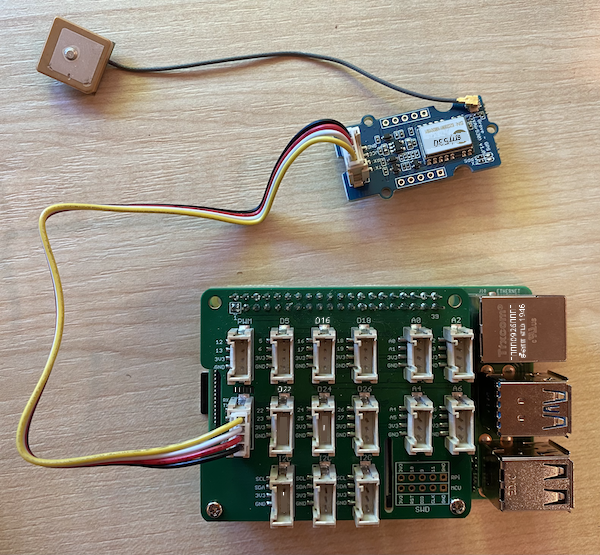

<!--
CO_OP_TRANSLATOR_METADATA:
{
  "original_hash": "3b2448c7ab4e9673e77e35a50c5e350d",
  "translation_date": "2025-10-11T11:59:00+00:00",
  "source_file": "3-transport/lessons/1-location-tracking/pi-gps-sensor.md",
  "language_code": "ta"
}
-->
# GPS தரவுகளைப் படிக்கவும் - ராஸ்பெர்ரி பை

இந்த பாடத்தின் இந்த பகுதியில், நீங்கள் உங்கள் ராஸ்பெர்ரி பையில் GPS சென்சரை சேர்த்து, அதிலிருந்து மதிப்புகளைப் படிக்கப் போகிறீர்கள்.

## ஹார்ட்வேர்கள்

ராஸ்பெர்ரி பைக்கு GPS சென்சர் தேவை.

நீங்கள் பயன்படுத்தப் போகும் சென்சர் [Grove GPS Air530 சென்சர்](https://www.seeedstudio.com/Grove-GPS-Air530-p-4584.html) ஆகும். இந்த சென்சர் பல GPS அமைப்புகளுடன் இணைந்து விரைவான மற்றும் துல்லியமான தகவல்களை வழங்க முடியும். இந்த சென்சர் இரண்டு பகுதிகளால் உருவாக்கப்பட்டுள்ளது - சென்சரின் மைய எலக்ட்ரானிக்ஸ் மற்றும் செயற்கைக்கோள்களிலிருந்து வானலைகளைப் பெற ஒரு மெல்லிய கம்பியால் இணைக்கப்பட்ட வெளிப்புற ஆண்டெனா.

இது ஒரு UART சென்சர், எனவே GPS தரவுகளை UART வழியாக அனுப்புகிறது.

## GPS சென்சரை இணைக்கவும்

Grove GPS சென்சரை ராஸ்பெர்ரி பையுடன் இணைக்கலாம்.

### பணிகள் - GPS சென்சரை இணைக்கவும்

GPS சென்சரை இணைக்கவும்.


1. Grove கேபிளின் ஒரு முனையை GPS சென்சரின் சாக்கெட்டில் செருகவும். இது ஒரு வழியில் மட்டுமே செருகப்படும்.

1. ராஸ்பெர்ரி பை ஆஃப் நிலையில் இருக்கும் போது, Grove கேபிளின் மற்ற முனையை பை-யில் இணைக்கப்பட்ட Grove Base ஹாட்டின் **UART** என்று குறிக்கப்பட்ட UART சாக்கெட்டில் இணைக்கவும். இந்த சாக்கெட் நடுத்தர வரிசையில் உள்ளது, SD கார்டு ஸ்லாட்டின் அருகில், USB போர்ட்கள் மற்றும் ஈதர்நெட் சாக்கெட்டின் எதிர் முனையில்.

    

1. GPS சென்சரை அதன் இணைக்கப்பட்ட ஆண்டெனாவுடன் வானத்தை காணக்கூடிய இடத்தில் அமைக்கவும் - சிறந்தது ஒரு திறந்த ஜன்னலின் அருகில் அல்லது வெளியில். ஆண்டெனாவுக்கு எந்த தடையும் இல்லாமல் தெளிவான சிக்னலைப் பெறுவது எளிதாக இருக்கும்.

## GPS சென்சரை நிரலாக்கவும்

இப்போது ராஸ்பெர்ரி பை இணைக்கப்பட்ட GPS சென்சரை பயன்படுத்த நிரலாக்கப்படலாம்.

### பணிகள் - GPS சென்சரை நிரலாக்கவும்

சாதனத்தை நிரலாக்கவும்.

1. பையை ஆன் செய்து, அது தொடங்கும் வரை காத்திருக்கவும்.

1. GPS சென்சருக்கு 2 LEDகள் உள்ளன - தரவுகள் அனுப்பப்படும் போது மின்மினிக்கும் நீல LED மற்றும் செயற்கைக்கோள்களிலிருந்து தரவுகளைப் பெறும் போது ஒவ்வொரு விநாடியும் மின்மினிக்கும் பச்சை LED. பையை ஆன் செய்தபோது நீல LED மின்மினிக்கிறதா என்பதை உறுதிப்படுத்தவும். சில நிமிடங்களுக்குப் பிறகு பச்சை LED மின்மினிக்கும் - இல்லையெனில், ஆண்டெனாவை மறுபதினமையாக்க வேண்டியிருக்கும்.

1. VS Code-ஐ தொடங்கவும், நேரடியாக பையில் அல்லது Remote SSH நீட்டிப்பின் மூலம் இணைக்கவும்.

    > ⚠️ [பாடம் 1-ல் VS Code அமைப்பதற்கும் தொடங்குவதற்கும் தேவையான வழிமுறைகளை](../../../1-getting-started/lessons/1-introduction-to-iot/pi.md) நீங்கள் பார்க்கலாம்.

1. Bluetooth-ஐ ஆதரிக்கும் புதிய ராஸ்பெர்ரி பை பதிப்புகளுடன், Bluetooth-க்கு பயன்படுத்தப்படும் சீரியல் போர்டுக்கும் Grove UART போர்டுக்கு பயன்படுத்தப்படும் சீரியல் போர்டுக்கும் மோதல் உள்ளது. இதை சரிசெய்ய, பின்வருவன செய்யவும்:

    1. VS Code டெர்மினலில் இருந்து, `nano` என்ற உள்ளமைக்கப்பட்ட டெர்மினல் உரைத் தொகுப்பியைப் பயன்படுத்தி `/boot/config.txt` கோப்பை பின்வரும் கட்டளையைப் பயன்படுத்தி திருத்தவும்:

        ```sh
        sudo nano /boot/config.txt
        ```

        > இந்த கோப்பை VS Code மூலம் திருத்த முடியாது, ஏனெனில் நீங்கள் `sudo` அனுமதிகளைப் பயன்படுத்தி திருத்த வேண்டும், இது உயர்ந்த அனுமதி. VS Code இந்த அனுமதியில் இயங்காது.

    1. கோப்பின் இறுதிக்கு செல்ல உங்கள் கர்சர் விசைகளைப் பயன்படுத்தவும். பின்னர் கீழே உள்ள குறியீட்டை நகலெடுத்து கோப்பின் இறுதியில் ஒட்டவும்:

        ```ini
        dtoverlay=pi3-miniuart-bt
        dtoverlay=pi3-disable-bt
        enable_uart=1
        ```

        உங்கள் சாதனத்திற்கான சாதாரண விசைப்பலகை குறுக்குவழிகளைப் பயன்படுத்தி ஒட்டலாம் (`Ctrl+v` Windows, Linux அல்லது Raspberry Pi OS-ல், `Cmd+v` macOS-ல்).

    1. இந்த கோப்பைச் சேமித்து, `Ctrl+x` அழுத்தி nano-இல் இருந்து வெளியேறவும். மாற்றிய பஃபரைச் சேமிக்க விரும்புகிறீர்களா என்று கேட்கப்பட்டால் `y` அழுத்தவும், பின்னர் `/boot/config.txt`-ஐ மீட்டெடுக்க விரும்புகிறீர்கள் என்பதை உறுதிப்படுத்த `enter` அழுத்தவும்.

        > நீங்கள் தவறு செய்தால், சேமிக்காமல் வெளியேறலாம், பின்னர் இந்த படிகளை மீண்டும் செய்யலாம்.

    1. nano-இல் `/boot/cmdline.txt` கோப்பை பின்வரும் கட்டளையைப் பயன்படுத்தி திருத்தவும்:

        ```sh
        sudo nano /boot/cmdline.txt
        ```

    1. இந்த கோப்பில் இடைவெளிகளால் பிரிக்கப்பட்ட பல முக்கிய/மதிப்பு ஜோடிகள் உள்ளன. `console` என்ற முக்கியத்திற்கான எந்த முக்கிய/மதிப்பு ஜோடிகளையும் நீக்கவும். அவை பொதுவாக இதுபோல இருக்கும்:

        ```output
        console=serial0,115200 console=tty1 
        ```

        இந்த நுழைவுகளுக்கு கர்சர் விசைகளைப் பயன்படுத்தி செல்லலாம், பின்னர் சாதாரண `del` அல்லது `backspace` விசைகளைப் பயன்படுத்தி நீக்கலாம்.

        உதாரணமாக, உங்கள் அசல் கோப்பு இதுபோல இருந்தால்:

        ```output
        console=serial0,115200 console=tty1 root=PARTUUID=058e2867-02 rootfstype=ext4 elevator=deadline fsck.repair=yes rootwait
        ```

        புதிய பதிப்பு இதுபோல இருக்கும்:

        ```output
        root=PARTUUID=058e2867-02 rootfstype=ext4 elevator=deadline fsck.repair=yes rootwait
        ```

    1. மேலே உள்ள படிகளைப் பின்பற்றி இந்த கோப்பைச் சேமித்து nano-இல் இருந்து வெளியேறவும்.

    1. உங்கள் பையை மறுதொடக்கம் செய்யவும், பின்னர் பை மறுதொடக்கம் செய்யப்பட்ட பிறகு VS Code-இல் மீண்டும் இணைக்கவும்.

1. டெர்மினலில் இருந்து, `pi` பயனரின் ஹோம் டைரக்டரியில் `gps-sensor` என்ற புதிய கோப்பகத்தை உருவாக்கவும். இந்த கோப்பகத்தில் `app.py` என்ற கோப்பை உருவாக்கவும்.

1. இந்த கோப்பகத்தை VS Code-இல் திறக்கவும்.

1. GPS மாட்யூல் UART தரவுகளை சீரியல் போர்டில் அனுப்புகிறது. Python குறியீட்டிலிருந்து சீரியல் போர்டுடன் தொடர்பு கொள்ள `pyserial` Pip தொகுப்பை நிறுவவும்:

    ```sh
    pip3 install pyserial
    ```

1. உங்கள் `app.py` கோப்பில் பின்வரும் குறியீட்டைச் சேர்க்கவும்:

    ```python
    import time
    import serial
    
    serial = serial.Serial('/dev/ttyAMA0', 9600, timeout=1)
    serial.reset_input_buffer()
    serial.flush()
    
    def print_gps_data(line):
        print(line.rstrip())
    
    while True:
        line = serial.readline().decode('utf-8')
    
        while len(line) > 0:
            print_gps_data(line)
            line = serial.readline().decode('utf-8')
    
        time.sleep(1)
    ```

    இந்த குறியீடு `pyserial` Pip தொகுப்பிலிருந்து `serial` மாட்யூலை இறக்குமதி செய்கிறது. பின்னர் `/dev/ttyAMA0` சீரியல் போர்டுடன் இணைக்கிறது - இது Grove Pi Base Hat அதன் UART போர்டுக்கு பயன்படுத்தும் சீரியல் போர்டின் முகவரி. பின்னர் இந்த சீரியல் இணைப்பிலிருந்து ஏற்கனவே உள்ள தரவுகளை அழிக்கிறது.

    அடுத்ததாக, `print_gps_data` என்ற ஒரு செயல்பாடு வரையறுக்கப்படுகிறது, இது அதற்கு அனுப்பப்படும் வரியை கன்சோலில் அச்சிடுகிறது.

    அடுத்ததாக, குறியீடு நிரந்தரமாக மடல்கிறது, ஒவ்வொரு மடலிலும் சீரியல் போர்டிலிருந்து அதிக அளவிலான உரை வரிகளைப் படிக்கிறது. ஒவ்வொரு வரிக்கும் `print_gps_data` செயல்பாட்டை அழைக்கிறது.

    அனைத்து தரவுகளும் படிக்கப்பட்ட பிறகு, மடல் 1 விநாடி தூங்குகிறது, பின்னர் மீண்டும் முயற்சிக்கிறது.

1. இந்த குறியீட்டை இயக்கவும். GPS சென்சரின் மூல வெளிப்பாட்டை நீங்கள் காணலாம், இது பின்வருவன போன்றதாக இருக்கும்:

    ```output
    $GNGGA,020604.001,4738.538654,N,12208.341758,W,1,3,,164.7,M,-17.1,M,,*67
    $GPGSA,A,1,,,,,,,,,,,,,,,*1E
    $BDGSA,A,1,,,,,,,,,,,,,,,*0F
    $GPGSV,1,1,00*79
    $BDGSV,1,1,00*68
    ```

    > உங்கள் குறியீட்டை நிறுத்தி மீண்டும் தொடங்கும்போது பின்வரும் பிழைகளில் ஒன்றை நீங்கள் பெறுகிறீர்கள் என்றால், உங்கள் while மடலில் `try - except` பிளாக்கைச் சேர்க்கவும்.

      ```output
      UnicodeDecodeError: 'utf-8' codec can't decode byte 0x93 in position 0: invalid start byte
      UnicodeDecodeError: 'utf-8' codec can't decode byte 0xf1 in position 0: invalid continuation byte
      ```

    ```python
    while True:
        try:
            line = serial.readline().decode('utf-8')
              
            while len(line) > 0:
                print_gps_data()
                line = serial.readline().decode('utf-8')
      
        # There's a random chance the first byte being read is part way through a character.
        # Read another full line and continue.

        except UnicodeDecodeError:
            line = serial.readline().decode('utf-8')

    time.sleep(1)
    ```

> 💁 இந்த குறியீட்டை [code-gps/pi](../../../../../3-transport/lessons/1-location-tracking/code-gps/pi) கோப்பகத்தில் காணலாம்.

😀 உங்கள் GPS சென்சர் நிரலாக்கம் வெற்றிகரமாக முடிந்தது!

---

**குறிப்பு**:  
இந்த ஆவணம் [Co-op Translator](https://github.com/Azure/co-op-translator) என்ற AI மொழிபெயர்ப்பு சேவையைப் பயன்படுத்தி மொழிபெயர்க்கப்பட்டுள்ளது. நாங்கள் துல்லியத்திற்காக முயற்சிக்கிறோம், ஆனால் தானியங்கி மொழிபெயர்ப்புகளில் பிழைகள் அல்லது தவறான தகவல்கள் இருக்கக்கூடும் என்பதை தயவுசெய்து கவனத்தில் கொள்ளுங்கள். அதன் தாய்மொழியில் உள்ள மூல ஆவணம் அதிகாரப்பூர்வ ஆதாரமாக கருதப்பட வேண்டும். முக்கியமான தகவல்களுக்கு, தொழில்முறை மனித மொழிபெயர்ப்பு பரிந்துரைக்கப்படுகிறது. இந்த மொழிபெயர்ப்பைப் பயன்படுத்துவதால் ஏற்படும் எந்த தவறான புரிதல்கள் அல்லது தவறான விளக்கங்களுக்கு நாங்கள் பொறுப்பல்ல.