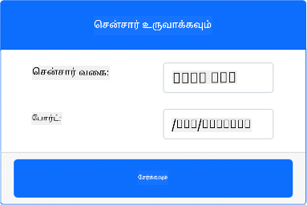
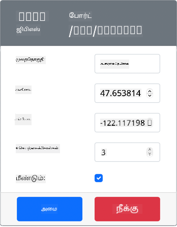
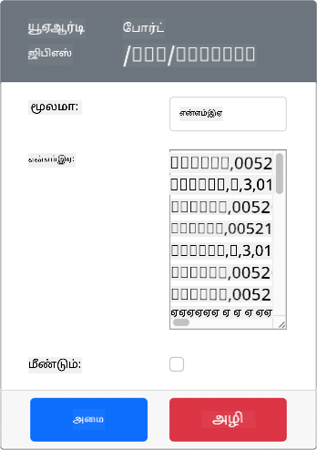
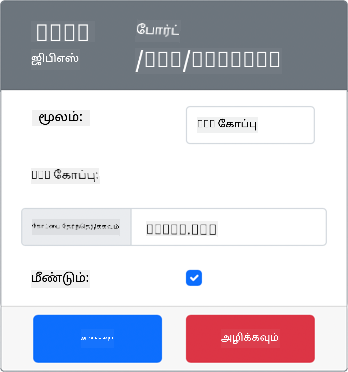

<!--
CO_OP_TRANSLATOR_METADATA:
{
  "original_hash": "64f18a8f8aaa1fef5e7320e0992d8b3a",
  "translation_date": "2025-10-11T11:59:51+00:00",
  "source_file": "3-transport/lessons/1-location-tracking/virtual-device-gps-sensor.md",
  "language_code": "ta"
}
-->
# GPS தரவுகளைப் படிக்கவும் - மெய்நிகர் IoT சாதனம்

இந்த பாடத்தின் இந்த பகுதியில், உங்கள் மெய்நிகர் IoT சாதனத்தில் GPS சென்சரைச் சேர்த்து, அதிலிருந்து மதிப்புகளைப் படிக்கப் போகிறீர்கள்.

## மெய்நிகர் ஹார்ட்வேர்கள்

மெய்நிகர் IoT சாதனம், சீரியல் போர்ட் மூலம் UART-க்கு அணுகக்கூடிய சிமுலேட்டட் GPS சென்சரைப் பயன்படுத்தும்.

ஒரு இயல்பான GPS சென்சரில் GPS செயற்கைக்கோள்களிலிருந்து வானலைகளைப் பெற ஒரு ஆன்டெனா இருக்கும், மேலும் GPS சிக்னல்களை GPS தரவாக மாற்றும். மெய்நிகர் பதிப்பு இதை சிமுலேட் செய்வதற்காக, நீங்கள் ஒரு அகலாங்கம் மற்றும் நீளாங்கத்தை அமைக்கலாம், மூல NMEA வாக்கியங்களை அனுப்பலாம் அல்லது பல இடங்களுடன் GPX கோப்பை பதிவேற்றலாம், அவை வரிசையாக திரும்ப பெறப்படும்.

> 🎓 NMEA வாக்கியங்கள் இந்த பாடத்தில் பின்னர் கற்றுக்கொள்ளப்படும்

### CounterFit-க்கு சென்சரைச் சேர்க்கவும்

மெய்நிகர் GPS சென்சரைப் பயன்படுத்த, நீங்கள் அதை CounterFit பயன்பாட்டில் சேர்க்க வேண்டும்.

#### பணிகள் - CounterFit-க்கு சென்சரைச் சேர்க்கவும்

CounterFit பயன்பாட்டில் GPS சென்சரைச் சேர்க்கவும்.

1. உங்கள் கணினியில் `gps-sensor` என்ற கோப்புறையில் ஒரு புதிய Python பயன்பாட்டை உருவாக்கி, `app.py` என்ற ஒரு கோப்புடன் Python மெய்நிகர் சூழலை உருவாக்கி, CounterFit pip தொகுப்புகளைச் சேர்க்கவும்.

    > ⚠️ [CounterFit Python திட்டத்தை உருவாக்குவதற்கும் அமைப்பதற்கும் பாடம் 1-இல் உள்ள வழிமுறைகளைப் பார்க்கலாம்](../../../1-getting-started/lessons/1-introduction-to-iot/virtual-device.md).

1. UART அடிப்படையிலான சென்சர்களுடன் சீரியல் இணைப்பின் மூலம் தொடர்பு கொள்ள CounterFit ஷிமை நிறுவ கூடுதல் Pip தொகுப்பை நிறுவவும். மெய்நிகர் சூழல் செயல்படுத்தப்பட்ட ஒரு டெர்மினலில் இருந்து இதை நிறுவுகிறீர்கள் என்பதை உறுதிப்படுத்தவும்.

    ```sh
    pip install counterfit-shims-serial
    ```

1. CounterFit வலை பயன்பாடு இயங்குகிறது என்பதை உறுதிப்படுத்தவும்.

1. GPS சென்சரை உருவாக்கவும்:

    1. *Sensors* பகுதியின் *Create sensor* பெட்டியில், *Sensor type* பெட்டியைத் திறந்து *UART GPS* என்பதைத் தேர்ந்தெடுக்கவும்.

    1. *Port* ஐ */dev/ttyAMA0* ஆகவே விடவும்.

    1. **Add** பொத்தானைத் தேர்ந்தெடுத்து `/dev/ttyAMA0` போர்டில் GPS சென்சரை உருவாக்கவும்.

    

    GPS சென்சர் உருவாக்கப்பட்டு சென்சர்கள் பட்டியலில் தோன்றும்.

    

## GPS சென்சரை நிரலாக்கவும்

மெய்நிகர் IoT சாதனம் இப்போது மெய்நிகர் GPS சென்சரைப் பயன்படுத்த நிரலாக்கப்படலாம்.

### பணிகள் - GPS சென்சரை நிரலாக்கவும்

GPS சென்சர் பயன்பாட்டை நிரலாக்கவும்.

1. `gps-sensor` பயன்பாடு VS Code-இல் திறக்கப்பட்டிருக்க வேண்டும்.

1. `app.py` கோப்பைத் திறக்கவும்.

1. CounterFit-க்கு பயன்பாட்டை இணைக்க `app.py`-யின் மேல் பக்கத்தில் பின்வரும் குறியீட்டைச் சேர்க்கவும்:

    ```python
    from counterfit_connection import CounterFitConnection
    CounterFitConnection.init('127.0.0.1', 5000)
    ```

1. CounterFit சீரியல் போர்ட் நூலகத்தைச் சேர்த்து, தேவையான நூலகங்களை இறக்குமதி செய்ய பின்வரும் குறியீட்டை இதற்கு கீழே சேர்க்கவும்:

    ```python
    import time
    import counterfit_shims_serial
    
    serial = counterfit_shims_serial.Serial('/dev/ttyAMA0')
    ```

    இந்த குறியீடு `counterfit_shims_serial` Pip தொகுப்பிலிருந்து `serial` மாடியுளை இறக்குமதி செய்கிறது. பின்னர், `/dev/ttyAMA0` சீரியல் போர்டுடன் இணைக்கிறது - இது மெய்நிகர் GPS சென்சர் அதன் UART போர்ட்டிற்காக பயன்படுத்தும் சீரியல் போர்ட்டின் முகவரி.

1. சீரியல் போர்ட்டிலிருந்து படிக்கவும் மற்றும் மதிப்புகளை கன்சோலில் அச்சிடவும் பின்வரும் குறியீட்டை இதற்கு கீழே சேர்க்கவும்:

    ```python
    def print_gps_data(line):
        print(line.rstrip())
    
    while True:
        line = serial.readline().decode('utf-8')
    
        while len(line) > 0:
            print_gps_data(line)
            line = serial.readline().decode('utf-8')
    
        time.sleep(1)
    ```

    `print_gps_data` என்ற ஒரு செயல்பாடு வரையறுக்கப்படுகிறது, இது அதற்கு அனுப்பப்பட்ட வரியை கன்சோலில் அச்சிடுகிறது.

    பின்னர் குறியீடு நிரந்தரமாக மடல்கிறது, ஒவ்வொரு மடலிலும் சீரியல் போர்ட்டிலிருந்து அதிகபட்சமாக வரிகளைப் படிக்கிறது. ஒவ்வொரு வரிக்கும் `print_gps_data` செயல்பாட்டை அழைக்கிறது.

    அனைத்து தரவுகளும் படிக்கப்பட்ட பிறகு, மடல் 1 விநாடி தூங்குகிறது, பின்னர் மீண்டும் முயற்சிக்கிறது.

1. இந்த குறியீட்டை இயக்கவும், CounterFit பயன்பாடு இயங்கும் டெர்மினலுக்கு மாறாக வேறு ஒரு டெர்மினலில் இருந்து இயக்குகிறீர்கள் என்பதை உறுதிப்படுத்தவும், எனவே CounterFit பயன்பாடு தொடர்ந்து இயங்கும்.

1. CounterFit பயன்பாட்டிலிருந்து GPS சென்சரின் மதிப்பை மாற்றவும். இதைச் செய்ய நீங்கள் பின்வரும் வழிகளில் ஒன்றை பயன்படுத்தலாம்:

    * **Source** ஐ `Lat/Lon` ஆக அமைத்து, GPS நிலையைப் பெற பயன்படுத்தப்படும் தெளிவான அகலாங்கம், நீளாங்கம் மற்றும் செயற்கைக்கோள் எண்ணிக்கையை அமைக்கவும். இந்த மதிப்பு ஒருமுறை மட்டுமே அனுப்பப்படும், எனவே **Repeat** பெட்டியைச் சரிபார்த்து தரவுகளை ஒவ்வொரு விநாடிக்கும் மீண்டும் அனுப்பவும்.

      

    * **Source** ஐ `NMEA` ஆக அமைத்து, NMEA வாக்கியங்களை உரை பெட்டியில் சேர்க்கவும். இந்த மதிப்புகள் அனைத்தும் அனுப்பப்படும், ஒவ்வொரு புதிய GGA (நிலை நிலை) வாக்கியத்தைப் படிக்க 1 விநாடி தாமதம் இருக்கும்.

      

      [nmeagen.org](https://www.nmeagen.org) போன்ற ஒரு கருவியைப் பயன்படுத்தி, வரைபடத்தில் வரைந்து இந்த வாக்கியங்களை உருவாக்கலாம். இந்த மதிப்புகள் ஒருமுறை மட்டுமே அனுப்பப்படும், எனவே **Repeat** பெட்டியைச் சரிபார்த்து, அனைத்தும் அனுப்பப்பட்ட பிறகு ஒவ்வொரு விநாடிக்கும் மீண்டும் அனுப்பவும்.

    * **Source** ஐ GPX கோப்பாக அமைத்து, GPX கோப்பை இடங்களுடன் பதிவேற்றவும். [AllTrails](https://www.alltrails.com/) போன்ற பிரபலமான வரைபட மற்றும் நடைபயிற்சி தளங்களில் இருந்து GPX கோப்புகளை பதிவிறக்கலாம். இந்த கோப்புகள் ஒரு பாதையாக பல GPS இடங்களை கொண்டிருக்கும், மேலும் GPS சென்சர் ஒவ்வொரு புதிய இடத்தையும் 1 விநாடி இடைவெளியில் திருப்பி வழங்கும்.

      

      இந்த மதிப்புகள் ஒருமுறை மட்டுமே அனுப்பப்படும், எனவே **Repeat** பெட்டியைச் சரிபார்த்து, அனைத்தும் அனுப்பப்பட்ட பிறகு ஒவ்வொரு விநாடிக்கும் மீண்டும் அனுப்பவும்.

    GPS அமைப்புகளை நீங்கள் உள்ளீடு செய்த பிறகு, **Set** பொத்தானைத் தேர்ந்தெடுத்து இந்த மதிப்புகளை சென்சருக்கு உறுதிப்படுத்தவும்.

1. GPS சென்சரின் மூல வெளியீட்டை நீங்கள் காண்பீர்கள், இது பின்வருமாறு இருக்கும்:

    ```output
    $GNGGA,020604.001,4738.538654,N,12208.341758,W,1,3,,164.7,M,-17.1,M,,*67
    $GNGGA,020604.001,4738.538654,N,12208.341758,W,1,3,,164.7,M,-17.1,M,,*67
    ```

> 💁 இந்த குறியீட்டை [code-gps/virtual-device](../../../../../3-transport/lessons/1-location-tracking/code-gps/virtual-device) கோப்புறையில் காணலாம்.

😀 உங்கள் GPS சென்சர் செயல்பாடு வெற்றிகரமாக முடிந்தது!

---

**குறிப்பு**:  
இந்த ஆவணம் [Co-op Translator](https://github.com/Azure/co-op-translator) என்ற AI மொழிபெயர்ப்பு சேவையைப் பயன்படுத்தி மொழிபெயர்க்கப்பட்டுள்ளது. நாங்கள் துல்லியத்திற்காக முயற்சிக்கின்றோம், ஆனால் தானியக்க மொழிபெயர்ப்புகளில் பிழைகள் அல்லது தவறான தகவல்கள் இருக்கக்கூடும் என்பதை தயவுசெய்து கவனத்தில் கொள்ளுங்கள். அதன் தாய்மொழியில் உள்ள மூல ஆவணம் அதிகாரப்பூர்வ ஆதாரமாக கருதப்பட வேண்டும். முக்கியமான தகவல்களுக்கு, தொழில்முறை மனித மொழிபெயர்ப்பு பரிந்துரைக்கப்படுகிறது. இந்த மொழிபெயர்ப்பைப் பயன்படுத்துவதால் ஏற்படும் எந்த தவறான புரிதல்கள் அல்லது தவறான விளக்கங்களுக்கு நாங்கள் பொறுப்பல்ல.