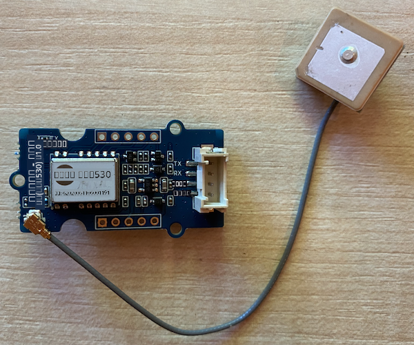
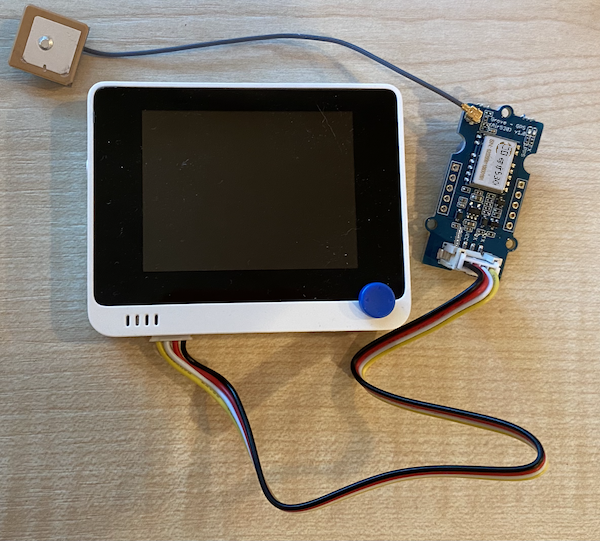

<!--
CO_OP_TRANSLATOR_METADATA:
{
  "original_hash": "da6ae0a795cf06be33d23ca5b8493fc8",
  "translation_date": "2025-10-11T11:56:51+00:00",
  "source_file": "3-transport/lessons/1-location-tracking/wio-terminal-gps-sensor.md",
  "language_code": "ta"
}
-->
# GPS தரவுகளைப் படிக்கவும் - Wio Terminal

இந்த பாடத்தின் இந்த பகுதியில், நீங்கள் உங்கள் Wio Terminal-க்கு GPS சென்சரைச் சேர்த்து, அதிலிருந்து மதிப்புகளைப் படிக்கப் போகிறீர்கள்.

## ஹார்ட்வேர்கள்

Wio Terminal-க்கு GPS சென்சர் தேவை.

நீங்கள் பயன்படுத்தப் போகும் சென்சர் [Grove GPS Air530 சென்சர்](https://www.seeedstudio.com/Grove-GPS-Air530-p-4584.html) ஆகும். இந்த சென்சர் பல GPS அமைப்புகளுடன் இணைந்து விரைவான மற்றும் துல்லியமான தகவல்களை வழங்க முடியும். இந்த சென்சர் இரண்டு பகுதிகளால் உருவாக்கப்பட்டுள்ளது - சென்சரின் மைய எலக்ட்ரானிக்ஸ் மற்றும் செயற்கைக்கோள்களிலிருந்து வானலைகளைப் பெற ஒரு மெல்லிய கம்பியால் இணைக்கப்பட்ட வெளிப்புற ஆண்டெனா.

இது ஒரு UART சென்சர், எனவே GPS தரவுகளை UART வழியாக அனுப்புகிறது.

### GPS சென்சரை இணைக்கவும்

Grove GPS சென்சரை Wio Terminal-க்கு இணைக்கலாம்.

#### பணிகள் - GPS சென்சரை இணைக்கவும்

GPS சென்சரை இணைக்கவும்.



1. Grove கேபிளின் ஒரு முனையை GPS சென்சரின் சாக்கெட்டில் செருகவும். இது ஒரு வழியில் மட்டுமே செருகப்படும்.

1. உங்கள் Wio Terminal உங்கள் கணினி அல்லது பிற மின்சார ஆதாரத்திலிருந்து துண்டிக்கப்பட்ட நிலையில், Grove கேபிளின் மற்ற முனையை Wio Terminal-இன் திரையைப் பார்க்கும் போது இடது பக்க Grove சாக்கெட்டில் இணைக்கவும். இது மின்சார பொத்தானுக்கு அருகிலுள்ள சாக்கெட்.

    

1. GPS சென்சரை அமைக்கவும், அதனுடன் இணைக்கப்பட்ட ஆண்டெனாவுக்கு வானத்தைப் பார்க்கும் திறன் இருக்க வேண்டும் - சிறந்தது ஒரு திறந்த ஜன்னலின் அருகில் அல்லது வெளியில். ஆண்டெனாவுக்கு எந்த தடையும் இல்லாமல் தெளிவான சிக்னலைப் பெறுவது எளிதாக இருக்கும்.

1. இப்போது Wio Terminal-ஐ உங்கள் கணினிக்கு இணைக்கலாம்.

1. GPS சென்சருக்கு 2 LEDகள் உள்ளன - தரவுகள் அனுப்பும்போது மின்மினுக்கும் நீல LED மற்றும் செயற்கைக்கோள்களிலிருந்து தரவுகளைப் பெறும் போது ஒவ்வொரு விநாடிக்கும் மின்மினுக்கும் பச்ச LED. Wio Terminal-ஐ இயக்கும் போது நீல LED மின்மினுக்கிறதா என்பதை உறுதிப்படுத்தவும். சில நிமிடங்களுக்குப் பிறகு பச்ச LED மின்மினுக்கும் - இல்லையெனில், ஆண்டெனாவை மறுபதினிடப்படுத்த வேண்டியிருக்கும்.

## GPS சென்சரை நிரலாக்கவும்

இப்போது Wio Terminal-ஐ இணைக்கப்பட்ட GPS சென்சரைப் பயன்படுத்த நிரலாக்கலாம்.

### பணிகள் - GPS சென்சரை நிரலாக்கவும்

சாதனத்தை நிரலாக்கவும்.

1. PlatformIO-ஐப் பயன்படுத்தி புதிய Wio Terminal திட்டத்தை உருவாக்கவும். இந்த திட்டத்தை `gps-sensor` என்று அழைக்கவும். `setup` செயல்பாட்டில் சீரியல் போர்ட்டை அமைக்க குறியீட்டைச் சேர்க்கவும்.

1. `main.cpp` கோப்பின் மேல் பக்கத்தில் பின்வரும் சேர்க்கை இயக்கத்தைச் சேர்க்கவும். இது UART க்கான இடது பக்க Grove போர்ட்டை அமைக்க செயல்பாடுகளுடன் ஒரு தலைப்பு கோப்பைச் சேர்க்கிறது.

    ```cpp
    #include <wiring_private.h>
    ```

1. இதற்கு கீழே, UART போர்ட்டுடன் சீரியல் போர்ட்டு இணைப்பை அறிவிக்க பின்வரும் கோடுகளைச் சேர்க்கவும்:

    ```cpp
    static Uart Serial3(&sercom3, PIN_WIRE_SCL, PIN_WIRE_SDA, SERCOM_RX_PAD_1, UART_TX_PAD_0);
    ```

1. சில உள் சிக்னல் ஹேண்ட்லர்களை இந்த சீரியல் போர்ட்டுக்கு மறுதிசை திருப்ப சில குறியீடுகளைச் சேர்க்க வேண்டும். `Serial3` அறிவிப்புக்கு கீழே பின்வரும் குறியீடுகளைச் சேர்க்கவும்:

    ```cpp
    void SERCOM3_0_Handler()
    {
        Serial3.IrqHandler();
    }
    
    void SERCOM3_1_Handler()
    {
        Serial3.IrqHandler();
    }
    
    void SERCOM3_2_Handler()
    {
        Serial3.IrqHandler();
    }
    
    void SERCOM3_3_Handler()
    {
        Serial3.IrqHandler();
    }
    ```

1. `Serial` போர்ட்டு அமைக்கப்படும் `setup` செயல்பாட்டில், பின்வரும் குறியீடுகளைப் பயன்படுத்தி UART சீரியல் போர்ட்டை அமைக்கவும்:

    ```cpp
    Serial3.begin(9600);

    while (!Serial3)
        ; // Wait for Serial3 to be ready

    delay(1000);
    ```

1. `setup` செயல்பாட்டில் இந்த குறியீடுகளுக்கு கீழே, Grove பினை சீரியல் போர்ட்டுடன் இணைக்க பின்வரும் குறியீடுகளைச் சேர்க்கவும்:

    ```cpp
    pinPeripheral(PIN_WIRE_SCL, PIO_SERCOM_ALT);
    ```

1. `loop` செயல்பாட்டுக்கு முன் பின்வரும் செயல்பாட்டைச் சேர்க்கவும், இது GPS தரவுகளை சீரியல் மானிட்டருக்கு அனுப்புகிறது:

    ```cpp
    void printGPSData()
    {
        Serial.println(Serial3.readStringUntil('\n'));
    }
    ```

1. `loop` செயல்பாட்டில், UART சீரியல் போர்ட்டிலிருந்து படிக்கவும் மற்றும் சீரியல் மானிட்டருக்கு வெளியீட்டை அச்சிட பின்வரும் குறியீடுகளைச் சேர்க்கவும்:

    ```cpp
    while (Serial3.available() > 0)
    {
        printGPSData();
    }
    
    delay(1000);
    ```

    இந்த குறியீடு UART சீரியல் போர்ட்டிலிருந்து படிக்கிறது. `readStringUntil` செயல்பாடு ஒரு முடிவுக்குறி எழுத்து வரை படிக்கிறது, இந்தக் கட்டத்தில் புதிய வரி. இது முழு NMEA வாக்கியத்தைப் படிக்கும் (NMEA வாக்கியங்கள் புதிய வரி எழுத்துடன் முடிவடைகின்றன). UART சீரியல் போர்ட்டிலிருந்து தரவுகளைப் படிக்க முடிந்தவரை, அது படிக்கப்படுகிறது மற்றும் `printGPSData` செயல்பாட்டின் மூலம் சீரியல் மானிட்டருக்கு அனுப்பப்படுகிறது. மேலும் தரவுகளைப் படிக்க முடியாதபோது, `loop` 1 விநாடி (1,000ms) தாமதமாகிறது.

1. குறியீட்டை Wio Terminal-க்கு உருவாக்கி பதிவேற்றவும்.

1. பதிவேற்றப்பட்டவுடன், சீரியல் மானிட்டரைப் பயன்படுத்தி GPS தரவுகளை கண்காணிக்கலாம்.

    ```output
    > Executing task: platformio device monitor <
    
    --- Available filters and text transformations: colorize, debug, default, direct, hexlify, log2file, nocontrol, printable, send_on_enter, time
    --- More details at http://bit.ly/pio-monitor-filters
    --- Miniterm on /dev/cu.usbmodem1201  9600,8,N,1 ---
    --- Quit: Ctrl+C | Menu: Ctrl+T | Help: Ctrl+T followed by Ctrl+H ---
    $GNGGA,020604.001,4738.538654,N,12208.341758,W,1,3,,164.7,M,-17.1,M,,*67
    $GPGSA,A,1,,,,,,,,,,,,,,,*1E
    $BDGSA,A,1,,,,,,,,,,,,,,,*0F
    $GPGSV,1,1,00*79
    $BDGSV,1,1,00*68
    ```

> 💁 இந்த குறியீட்டை [code-gps/wio-terminal](../../../../../3-transport/lessons/1-location-tracking/code-gps/wio-terminal) கோப்புறையில் காணலாம்.

😀 உங்கள் GPS சென்சர் நிரல் வெற்றிகரமாக முடிந்தது!

---

**குறிப்பு**:  
இந்த ஆவணம் [Co-op Translator](https://github.com/Azure/co-op-translator) என்ற AI மொழிபெயர்ப்பு சேவையைப் பயன்படுத்தி மொழிபெயர்க்கப்பட்டுள்ளது. நாங்கள் துல்லியத்திற்காக முயற்சிக்கின்றோம், ஆனால் தானியங்கி மொழிபெயர்ப்புகளில் பிழைகள் அல்லது தவறான தகவல்கள் இருக்கக்கூடும் என்பதை கவனத்தில் கொள்ளவும். அதன் தாய்மொழியில் உள்ள மூல ஆவணம் அதிகாரப்பூர்வ ஆதாரமாகக் கருதப்பட வேண்டும். முக்கியமான தகவல்களுக்கு, தொழில்முறை மனித மொழிபெயர்ப்பு பரிந்துரைக்கப்படுகிறது. இந்த மொழிபெயர்ப்பைப் பயன்படுத்துவதால் ஏற்படும் எந்த தவறான புரிதல்கள் அல்லது தவறான விளக்கங்களுக்கு நாங்கள் பொறுப்பல்ல.