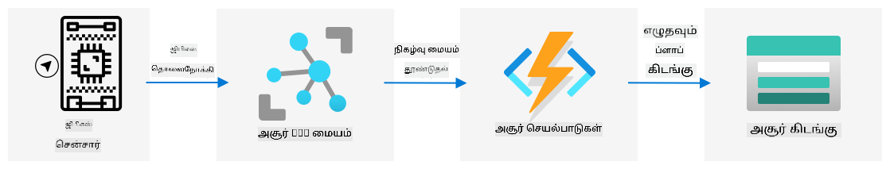

<!--
CO_OP_TRANSLATOR_METADATA:
{
  "original_hash": "e345843ccfeb7261d81500d19c64d476",
  "translation_date": "2025-10-11T12:03:46+00:00",
  "source_file": "3-transport/lessons/2-store-location-data/README.md",
  "language_code": "ta"
}
-->
# கடை இடம் தரவுகள்


> ஸ்கெட்ச்: [நித்யா நரசிம்மன்](https://github.com/nitya). படத்தை கிளிக் செய்து பெரிய பதிப்பைப் பாருங்கள்.

## பாடத்திற்கு முன் வினாடி வினா

[பாடத்திற்கு முன் வினாடி வினா](https://black-meadow-040d15503.1.azurestaticapps.net/quiz/23)

## அறிமுகம்

கடந்த பாடத்தில், GPS சென்சாரைப் பயன்படுத்தி இடம் தரவுகளைப் பிடிக்க எப்படி என்பதை நீங்கள் கற்றுக்கொண்டீர்கள். உணவுடன் கூடிய ஒரு லாரியின் இடத்தை மற்றும் அதன் பயணத்தை காட்சிப்படுத்த இந்த தரவுகளை பயன்படுத்த, அதை மேகத்தில் உள்ள IoT சேவைக்கு அனுப்பி, பின்னர் எங்காவது சேமிக்க வேண்டும்.

இந்த பாடத்தில், IoT தரவுகளை சேமிக்க பல்வேறு வழிகளைப் பற்றி கற்றுக்கொள்வீர்கள், மேலும் உங்கள் IoT சேவையிலிருந்து தரவுகளை சேமிக்க சர்வர்லெஸ் குறியீட்டை பயன்படுத்த கற்றுக்கொள்வீர்கள்.

இந்த பாடத்தில் நாம் கவரும் தலைப்புகள்:

* [கட்டமைக்கப்பட்ட மற்றும் கட்டமைக்கப்படாத தரவுகள்](../../../../../3-transport/lessons/2-store-location-data)
* [GPS தரவுகளை IoT Hub-க்கு அனுப்புதல்](../../../../../3-transport/lessons/2-store-location-data)
* [ஹாட், வார்மு மற்றும் கோல்ட் பாதைகள்](../../../../../3-transport/lessons/2-store-location-data)
* [GPS நிகழ்வுகளை சர்வர்லெஸ் குறியீட்டைப் பயன்படுத்தி கையாளுதல்](../../../../../3-transport/lessons/2-store-location-data)
* [Azure சேமிப்பு கணக்குகள்](../../../../../3-transport/lessons/2-store-location-data)
* [உங்கள் சர்வர்லெஸ் குறியீட்டை சேமிப்புடன் இணைத்தல்](../../../../../3-transport/lessons/2-store-location-data)

## கட்டமைக்கப்பட்ட மற்றும் கட்டமைக்கப்படாத தரவுகள்

கணினி அமைப்புகள் தரவுகளை கையாளுகின்றன, மேலும் இந்த தரவுகள் பல்வேறு வடிவங்களில் மற்றும் அளவுகளில் இருக்கும். இது ஒற்றை எண்களிலிருந்து, பெரிய அளவிலான உரை, வீடியோக்கள் மற்றும் படங்கள், மற்றும் IoT தரவுகள் வரை மாறக்கூடும். தரவுகள் பொதுவாக இரண்டு வகைகளில் பிரிக்கப்படலாம் - *கட்டமைக்கப்பட்ட* தரவுகள் மற்றும் *கட்டமைக்கப்படாத* தரவுகள்.

* **கட்டமைக்கப்பட்ட தரவுகள்** என்பது நன்கு வரையறுக்கப்பட்ட, கடினமான அமைப்புடன் கூடியது, இது மாற்றமில்லாமல் இருக்கும் மற்றும் பொதுவாக தொடர்புடைய தரவுகளின் அட்டவணைகளுக்கு பொருந்தும். ஒரு உதாரணம், ஒரு நபரின் பெயர், பிறந்த தேதி மற்றும் முகவரியை உள்ளடக்கிய விவரங்கள்.

* **கட்டமைக்கப்படாத தரவுகள்** என்பது நன்கு வரையறுக்கப்பட்ட, கடினமான அமைப்பில்லாதது, மேலும் இது அடிக்கடி அமைப்பை மாற்றக்கூடியது. ஒரு உதாரணம், எழுதப்பட்ட ஆவணங்கள் அல்லது எக்செல் ஷீட்டுகள் போன்ற ஆவணங்கள்.

✅ ஆராய்ச்சி செய்யுங்கள்: கட்டமைக்கப்பட்ட மற்றும் கட்டமைக்கப்படாத தரவுகளுக்கான பிற உதாரணங்களை நீங்கள் யோசிக்க முடியுமா?

> 💁 Semi-structured தரவுகளும் உள்ளது, இது கட்டமைக்கப்பட்டதாக இருந்தாலும், நிலையான அட்டவணைகளில் பொருந்தாது.

IoT தரவுகள் பொதுவாக கட்டமைக்கப்படாத தரவாகக் கருதப்படுகிறது.

ஒரு பெரிய வணிக பண்ணைக்கு வாகனங்களின் படையெடுப்பில் IoT சாதனங்களைச் சேர்த்தால் எப்படி இருக்கும் என்று கற்பனை செய்யுங்கள். நீங்கள் வாகனத்தின் வகைக்கு ஏற்ப வெவ்வேறு சாதனங்களைப் பயன்படுத்த விரும்பலாம். உதாரணமாக:

* பண்ணை வாகனங்கள், டிராக்டர்கள் போன்றவற்றுக்கு, அவை சரியான நிலங்களில் வேலை செய்கிறதா என்பதை உறுதிப்படுத்த GPS தரவுகளை நீங்கள் விரும்புகிறீர்கள்.
* உணவுகளை கிடங்குகளுக்கு கொண்டு செல்லும் டெலிவரி லாரிகளுக்கு, நீங்கள் GPS தரவுகளையும், வேகம் மற்றும் துரிதம் தரவுகளையும், ஓட்டுநர் பாதுகாப்பாக ஓட்டுகிறாரா என்பதை உறுதிப்படுத்தவும், ஓட்டுநர் அடையாளம் மற்றும் தொடக்கம்/நிறுத்தம் தரவுகளை உள்ளடக்கியது, உள்ளூர் சட்டங்களில் வேலை நேரத்திற்கான ஒழுங்குமுறையை உறுதிப்படுத்தவும்.
* குளிரூட்டப்பட்ட லாரிகளுக்கு, உணவு மிகவும் சூடாகவோ அல்லது குளிராகவோ மாறாமல் போகாமல் இருப்பதை உறுதிப்படுத்த வெப்பநிலை தரவுகளையும் நீங்கள் விரும்புகிறீர்கள்.

இந்த தரவுகள் தொடர்ந்து மாறக்கூடும். உதாரணமாக, IoT சாதனம் லாரி கேபினில் இருந்தால், அது அனுப்பும் தரவுகள் டிரெய்லர் மாறும்போது மாறக்கூடும், உதாரணமாக, குளிரூட்டப்பட்ட டிரெய்லர் பயன்படுத்தப்படும் போது மட்டுமே வெப்பநிலை தரவுகளை அனுப்புகிறது.

✅ வேறு எந்த IoT தரவுகள் பிடிக்கப்படலாம்? லாரிகள் ஏற்றக்கூடிய சுமைகள் மற்றும் பராமரிப்பு தரவுகளைப் பற்றி யோசிக்கவும்.

இந்த தரவுகள் வாகனத்திலிருந்து வாகனத்திற்கு மாறுபடும், ஆனால் இது அனைத்தும் ஒரே IoT சேவைக்கு அனுப்பப்படுகிறது. IoT சேவை இந்த கட்டமைக்கப்படாத தரவுகளை செயல்படுத்த, அதை தேடவோ அல்லது பகுப்பாய்வு செய்யவோ அனுமதிக்கும் ஒரு முறையில் சேமிக்க வேண்டும், ஆனால் இந்த தரவுகளின் வெவ்வேறு அமைப்புகளுடன் வேலை செய்ய வேண்டும்.

### SQL மற்றும் NoSQL சேமிப்பு

தரவுகளை சேமிக்கவும், தேடவும் அனுமதிக்கும் சேவைகள் தரவுத்தொகுப்புகள் ஆகும். தரவுத்தொகுப்புகள் இரண்டு வகைகளில் வருகின்றன - SQL மற்றும் NoSQL.

#### SQL தரவுத்தொகுப்புகள்

முதல் தரவுத்தொகுப்புகள் தொடர்புடைய தரவுத்தொகுப்பு மேலாண்மை அமைப்புகள் (RDBMS) அல்லது தொடர்புடைய தரவுத்தொகுப்புகள் ஆகும். இவை SQL தரவுத்தொகுப்புகள் என்றும் அழைக்கப்படுகின்றன, ஏனெனில் Structured Query Language (SQL) பயன்படுத்தி அவற்றுடன் தொடர்பு கொள்ள, தரவுகளை சேர்க்க, நீக்க, புதுப்பிக்க அல்லது தேட. இந்த தரவுத்தொகுப்புகள் ஒரு ஸ்கீமாவை கொண்டுள்ளது - நன்கு வரையறுக்கப்பட்ட தரவுகளின் அட்டவணைகள், எக்செல் ஷீட்டுக்கு ஒத்ததாக.
> ⚠️ நீங்கள் [IoT Hub நிகழ்வு டிரிகரை உருவாக்கும் வழிமுறைகளை, திட்டம் 2, பாடம் 5](../../../2-farm/lessons/5-migrate-application-to-the-cloud/README.md#create-an-iot-hub-event-trigger) இல் காணலாம்.

1. `local.settings.json` கோப்பில் Event Hub இணக்கமான எண்ட்பாயிண்ட் இணைப்பு சரத்தை அமைக்கவும், அந்த நுழைவு கீயை `function.json` கோப்பில் பயன்படுத்தவும்.

1. Azurite பயன்பாட்டை உள்ளூர் சேமிப்பு எமுலேட்டராக பயன்படுத்தவும்.

1. உங்கள் functions app ஐ இயக்கி, GPS சாதனத்திலிருந்து நிகழ்வுகளை பெறுகிறது என்பதை உறுதிப்படுத்தவும். உங்கள் IoT சாதனமும் இயக்கத்தில் இருந்து GPS தரவை அனுப்புகிறது என்பதை உறுதிப்படுத்தவும்.

    ```output
    Python EventHub trigger processed an event: {"gps": {"lat": 47.73481, "lon": -122.25701}}
    ```

## Azure சேமிப்பு கணக்குகள்


Azure சேமிப்பு கணக்குகள் பல்வேறு முறைகளில் தரவை சேமிக்க உதவும் ஒரு பொதுவான சேமிப்பு சேவையாகும். நீங்கள் தரவை blobs, queues, tables அல்லது கோப்புகளாக சேமிக்கலாம், மேலும் அவற்றை ஒரே நேரத்தில் செய்யலாம்.

### Blob சேமிப்பு

*Blob* என்ற வார்த்தை binary large objects என்பதைக் குறிக்கிறது, ஆனால் எந்த அமைப்பற்ற தரவையும் குறிக்க பயன்படுகிறது. IoT தரவைக் கொண்ட JSON ஆவணங்கள் முதல் படங்கள் மற்றும் திரைப்பட கோப்புகள் வரை எந்த தரவையும் blob சேமிப்பில் சேமிக்கலாம். Blob சேமிப்பில் *containers* என்ற கருத்து உள்ளது, இது relational database இல் tables போன்ற buckets ஆகும். இந்த containers பல கோப்புறைகளை கொண்டிருக்கலாம், மேலும் ஒவ்வொரு கோப்புறையும் பிற கோப்புறைகளை கொண்டிருக்கலாம், உங்கள் கணினி hard disk இல் கோப்புகள் சேமிக்கப்படும் முறையைப் போன்றது.

இந்த பாடத்தில் IoT தரவை சேமிக்க blob சேமிப்பைப் பயன்படுத்துவீர்கள்.

✅ ஆராய்ச்சி செய்யுங்கள்: [Azure Blob Storage](https://docs.microsoft.com/azure/storage/blobs/storage-blobs-overview?WT.mc_id=academic-17441-jabenn) பற்றி படிக்கவும்.

### Table சேமிப்பு

Table சேமிப்பு semi-structured தரவை சேமிக்க உதவுகிறது. Table சேமிப்பு உண்மையில் ஒரு NoSQL தரவுத்தொகுப்பாகும், எனவே முன்னதாக tables இன் வரையறுக்கப்பட்ட தொகுப்பை தேவைப்படாது, ஆனால் இது ஒரு அல்லது அதற்கு மேற்பட்ட tables இல் தரவை சேமிக்க வடிவமைக்கப்பட்டுள்ளது, ஒவ்வொரு வரியையும் வரையறுக்க தனித்துவமான கீகளை கொண்டுள்ளது.

✅ ஆராய்ச்சி செய்யுங்கள்: [Azure Table Storage](https://docs.microsoft.com/azure/storage/tables/table-storage-overview?WT.mc_id=academic-17441-jabenn) பற்றி படிக்கவும்.

### Queue சேமிப்பு

Queue சேமிப்பு 64KB அளவுள்ள செய்திகளை ஒரு queue இல் சேமிக்க உதவுகிறது. நீங்கள் செய்திகளை queue இன் பின்புறத்தில் சேர்க்கலாம், மேலும் அவற்றை முன்னிலையிலிருந்து வாசிக்கலாம். Queue-கள் செய்திகளை நிரந்தரமாக சேமிக்கின்றன, சேமிப்பு இடம் இருக்கும் வரை, எனவே செய்திகளை நீண்ட காலத்திற்கு சேமிக்க அனுமதிக்கிறது. பின்னர் தேவையான போது வாசிக்கலாம். உதாரணமாக, GPS தரவை செயல்படுத்த மாதாந்திர வேலை செய்ய விரும்பினால், நீங்கள் அதை ஒரு மாதத்திற்கு தினசரி ஒரு queue இல் சேர்க்கலாம், பின்னர் மாதத்தின் முடிவில் queue இல் உள்ள அனைத்து செய்திகளையும் செயல்படுத்தலாம்.

✅ ஆராய்ச்சி செய்யுங்கள்: [Azure Queue Storage](https://docs.microsoft.com/azure/storage/queues/storage-queues-introduction?WT.mc_id=academic-17441-jabenn) பற்றி படிக்கவும்.

### File சேமிப்பு

File சேமிப்பு என்பது cloud இல் கோப்புகளை சேமிப்பதாகும், மேலும் எந்த apps அல்லது சாதனங்களும் தொழில்துறை தரநிலை நெறிமுறைகளைப் பயன்படுத்தி இணைக்கலாம். நீங்கள் கோப்புகளை file சேமிப்பில் எழுதலாம், பின்னர் அதை உங்கள் PC அல்லது Mac இல் drive ஆக mount செய்யலாம்.

✅ ஆராய்ச்சி செய்யுங்கள்: [Azure File Storage](https://docs.microsoft.com/azure/storage/files/storage-files-introduction?WT.mc_id=academic-17441-jabenn) பற்றி படிக்கவும்.

## உங்கள் serverless code ஐ சேமிப்புடன் இணைக்கவும்

இப்போது உங்கள் function app IoT Hub-இல் இருந்து செய்திகளை சேமிக்க blob சேமிப்புடன் இணைக்க வேண்டும். இதைச் செய்ய 2 வழிகள் உள்ளன:

* Function code-இல் blob சேமிப்புடன் Python SDK ஐப் பயன்படுத்தி இணைக்கவும், மேலும் தரவை blobs ஆக எழுதவும்.
* Output function binding ஐப் பயன்படுத்தி function-இன் return value ஐ blob சேமிப்புடன் bind செய்யவும், மேலும் blob தானாக சேமிக்கப்பட வேண்டும்.

இந்த பாடத்தில், blob சேமிப்புடன் தொடர்பு கொள்ள Python SDK ஐப் பயன்படுத்துவீர்கள்.



தரவு JSON blob ஆக பின்வரும் வடிவத்தில் சேமிக்கப்படும்:

```json
{
    "device_id": <device_id>,
    "timestamp" : <time>,
    "gps" :
    {
        "lat" : <latitude>,
        "lon" : <longitude>
    }
}
```

### Task - உங்கள் serverless code ஐ சேமிப்புடன் இணைக்கவும்

1. ஒரு Azure சேமிப்பு கணக்கை உருவாக்கவும். இதற்கு `gps<உங்கள் பெயர்>` போன்ற பெயரை அமைக்கவும்.

    > ⚠️ நீங்கள் [சேமிப்பு கணக்கை உருவாக்கும் வழிமுறைகளை, திட்டம் 2, பாடம் 5](../../../2-farm/lessons/5-migrate-application-to-the-cloud/README.md#task---create-the-cloud-resources) இல் காணலாம்.

    முந்தைய திட்டத்திலிருந்து ஒரு சேமிப்பு கணக்கை வைத்திருந்தால், அதை மீண்டும் பயன்படுத்தலாம்.

    > 💁 நீங்கள் இந்த சேமிப்பு கணக்கை பின்னர் Azure Functions app ஐ deploy செய்ய பயன்படுத்த முடியும்.

1. சேமிப்பு கணக்கிற்கான இணைப்பு சரத்தை பெற பின்வரும் கட்டளையை இயக்கவும்:

    ```sh
    az storage account show-connection-string --output table \
                                              --name <storage_name>
    ```

    `<storage_name>` ஐ நீங்கள் உருவாக்கிய சேமிப்பு கணக்கின் பெயருடன் மாற்றவும்.

1. `local.settings.json` கோப்பில் உங்கள் சேமிப்பு கணக்கின் இணைப்பு சரத்திற்கான புதிய நுழைவை சேர்க்கவும், முந்தைய படியில் இருந்து பெறப்பட்ட மதிப்பைப் பயன்படுத்தவும். இதற்கு `STORAGE_CONNECTION_STRING` என்று பெயரிடவும்.

1. Azure சேமிப்பு Pip packages ஐ நிறுவ `requirements.txt` கோப்பில் பின்வரும் சேர்க்கவும்:

    ```sh
    azure-storage-blob
    ```

    உங்கள் virtual environment இல் இந்த packages ஐ நிறுவவும்.

    > பிழை ஏற்பட்டால், உங்கள் virtual environment இல் Pip பதிப்பை பின்வரும் கட்டளையைப் பயன்படுத்தி சமீபத்திய பதிப்புக்கு மேம்படுத்தவும், பின்னர் மீண்டும் முயற்சிக்கவும்:
    >
    > ```sh
    > pip install --upgrade pip
    > ```

1. `iot-hub-trigger` இல் உள்ள `__init__.py` கோப்பில் பின்வரும் import statements ஐ சேர்க்கவும்:

    ```python
    import json
    import os
    import uuid
    from azure.storage.blob import BlobServiceClient, PublicAccess
    ```

    `json` system module JSON ஐ வாசிக்கவும் எழுதவும் பயன்படுத்தப்படும், `os` system module இணைப்பு சரத்தை வாசிக்க பயன்படுத்தப்படும், `uuid` system module GPS வாசிப்புக்கான தனித்துவமான ID ஐ உருவாக்க பயன்படுத்தப்படும்.

    `azure.storage.blob` package blob சேமிப்புடன் வேலை செய்ய Python SDK ஐ கொண்டுள்ளது.

1. `main` முறைமையின் முன் பின்வரும் உதவியாளர் செயல்பாட்டைச் சேர்க்கவும்:

    ```python
    def get_or_create_container(name):
        connection_str = os.environ['STORAGE_CONNECTION_STRING']
        blob_service_client = BlobServiceClient.from_connection_string(connection_str)
    
        for container in blob_service_client.list_containers():
            if container.name == name:
                return blob_service_client.get_container_client(container.name)
        
        return blob_service_client.create_container(name, public_access=PublicAccess.Container)
    ```

    Python blob SDK-இல் container ஐ உருவாக்க உதவியாளர் முறைமையில்லை. இந்த code `local.settings.json` கோப்பிலிருந்து (அல்லது cloud-இல் deploy செய்யப்பட்ட பிறகு Application Settings-இல் இருந்து) இணைப்பு சரத்தை ஏற்றுகிறது, பின்னர் blob சேமிப்பு கணக்குடன் தொடர்பு கொள்ள `BlobServiceClient` வகுப்பை உருவாக்குகிறது. இது blob சேமிப்பு கணக்கிற்கான அனைத்து containers-ஐ loop செய்து, வழங்கப்பட்ட பெயருடன் ஒன்றைத் தேடுகிறது - ஒன்று கிடைத்தால், container-இன் `ContainerClient` வகுப்பை திருப்புகிறது, இது blobs-ஐ உருவாக்க container-இன் தொடர்பு கொள்ள உதவும். ஒன்று கிடைக்கவில்லை என்றால், container உருவாக்கப்பட்டு புதிய container-இன் client திருப்பப்படுகிறது.

    புதிய container உருவாக்கப்பட்டபோது, container-இல் உள்ள blobs-ஐ கேள்வி கேட்க public access வழங்கப்படுகிறது. இது GPS தரவை map-இல் visualization செய்ய அடுத்த பாடத்தில் பயன்படுத்தப்படும்.

1. மண் ஈரப்பதம் தரவுடன் முந்தைய code-இல் இருந்தது போல, இந்த code-இல் ஒவ்வொரு நிகழ்வையும் சேமிக்க விரும்புகிறோம், எனவே `main` செயல்பாட்டில் `for event in events:` loop-இல், `logging` அறிக்கையின் கீழ் பின்வரும் code ஐச் சேர்க்கவும்:

    ```python
    device_id = event.iothub_metadata['connection-device-id']
    blob_name = f'{device_id}/{str(uuid.uuid1())}.json'
    ```

    இந்த code நிகழ்வு metadata-இல் இருந்து சாதன ID ஐப் பெறுகிறது, பின்னர் அதை blob பெயரை உருவாக்க பயன்படுத்துகிறது. Blobs கோப்புறைகளில் சேமிக்கப்படலாம், மேலும் சாதன ID கோப்புறையின் பெயராக பயன்படுத்தப்படும், எனவே ஒவ்வொரு சாதனத்திற்கும் அதன் GPS நிகழ்வுகள் ஒரு கோப்புறையில் இருக்கும். Blob பெயர் இந்த கோப்புறை, பின்னர் ஆவணத்தின் பெயர், forward slashes கொண்டு பிரிக்கப்பட்டது, Linux மற்றும் macOS பாதைகள் போன்றது (Windows-க்கும் ஒத்ததாக, ஆனால் Windows back slashes ஐப் பயன்படுத்துகிறது). ஆவணத்தின் பெயர் Python `uuid` module ஐப் பயன்படுத்தி உருவாக்கப்பட்ட தனித்துவமான ID ஆகும், `json` கோப்பு வகையுடன்.

    உதாரணமாக, `gps-sensor` சாதன ID க்கான blob பெயர் `gps-sensor/a9487ac2-b9cf-11eb-b5cd-1e00621e3648.json` போன்றதாக இருக்கலாம்.

1. இதற்குக் கீழே பின்வரும் code ஐச் சேர்க்கவும்:

    ```python
    container_client = get_or_create_container('gps-data')
    blob = container_client.get_blob_client(blob_name)
    ```

    இந்த code `get_or_create_container` உதவியாளர் வகுப்பைப் பயன்படுத்தி container client ஐப் பெறுகிறது, பின்னர் blob பெயரைப் பயன்படுத்தி blob client object ஐப் பெறுகிறது. இந்த blob clients ஏற்கனவே உள்ள blobs-ஐ குறிக்கலாம், அல்லது இந்த வழக்கில், புதிய blob ஐ குறிக்கலாம்.

1. இதற்குப் பிறகு பின்வரும் code ஐச் சேர்க்கவும்:

    ```python
    event_body = json.loads(event.get_body().decode('utf-8'))
    blob_body = {
        'device_id' : device_id,
        'timestamp' : event.iothub_metadata['enqueuedtime'],
        'gps': event_body['gps']
    }
    ```

    இது blob சேமிப்பில் எழுதப்படும் blob உடலமைப்பை உருவாக்குகிறது. இது சாதன ID, IoT Hub-க்கு தகவல்தொகுப்பு அனுப்பப்பட்ட நேரம், மற்றும் தகவல்தொகுப்பிலிருந்து GPS இணக்கங்களை கொண்ட JSON ஆவணமாகும்.

    > 💁 தகவல் IoT Hub-க்கு அனுப்பப்பட்ட நேரத்தை பெறுவது முக்கியம், தற்போதைய நேரத்தைப் பெறுவதற்கு பதிலாக. Functions App இயக்கத்தில் இல்லாத போது தகவல் hub-இல் சில நேரம் இருக்கலாம்.

1. இதற்குக் கீழே பின்வரும் code ஐச் சேர்க்கவும்:

    ```python
    logging.info(f'Writing blob to {blob_name} - {blob_body}')
    blob.upload_blob(json.dumps(blob_body).encode('utf-8'))
    ```

    இந்த code blob எழுதப்பட உள்ளது என்பதை அதன் விவரங்களுடன் பதிவு செய்கிறது, பின்னர் blob உடலமைப்பை புதிய blob-இன் உள்ளடக்கமாக பதிவேற்றுகிறது.

1. Functions app ஐ இயக்கவும். GPS நிகழ்வுகளுக்கான blobs எழுதப்படுவதை output-இல் காணலாம்:

    ```output
    [2021-05-21T01:31:14.325Z] Python EventHub trigger processed an event: {"gps": {"lat": 47.73092, "lon": -122.26206}}
    ...
    [2021-05-21T01:31:14.351Z] Writing blob to gps-sensor/4b6089fe-ba8d-11eb-bc7b-1e00621e3648.json - {'device_id': 'gps-sensor', 'timestamp': '2021-05-21T00:57:53.878Z', 'gps': {'lat': 47.73092, 'lon': -122.26206}}
    ```

    > 💁 IoT Hub நிகழ்வு மானிட்டரை ஒரே நேரத்தில் இயக்கவில்லை என்பதை உறுதிப்படுத்தவும்.

> 💁 இந்த code ஐ [code/functions](../../../../../3-transport/lessons/2-store-location-data/code/functions) கோப்புறையில் காணலாம்.

### Task - பதிவேற்றப்பட்ட blobs ஐ சரிபார்க்கவும்

1. உருவாக்கப்பட்ட blobs ஐப் பார்க்க, [Azure Storage Explorer](https://azure.microsoft.com/features/storage-explorer/?WT.mc_id=academic-17441-jabenn) ஐப் பயன்படுத்தலாம், இது உங்கள் சேமிப்பு கணக்குகளைப் பார்க்கவும் நிர்வகிக்கவும் உதவும் இலவச கருவி, அல்லது CLI மூலம் பார்க்கலாம்.

    1. CLI ஐப் பயன்படுத்த, முதலில் ஒரு account key தேவைப்படும். இந்த key ஐப் பெற பின்வரும் கட்டளையை இயக்கவும்:

        ```sh
        az storage account keys list --output table \
                                     --account-name <storage_name>
        ```

        `<storage_name>` ஐ சேமிப்பு கணக்கின் பெயருடன் மாற்றவும்.

        `key1` இன் மதிப்பை நகலெடுக்கவும்.

    1. Container-இல் உள்ள blobs ஐ பட்டியலிட பின்வரும் கட்டளையை இயக்கவும்:

        ```sh
        az storage blob list --container-name gps-data \
                             --output table \
                             --account-name <storage_name> \
                             --account-key <key1>
        ```

        `<storage_name>` ஐ சேமிப்பு கணக்கின் பெயருடன் மாற்றவும், மற்றும் `<key1>` ஐ நீங்கள் முந்தைய படியில் நகலெடுத்த `key1` மதிப்புடன் மாற்றவும்.

        இது container-இல் உள்ள அனைத்து blobs ஐ பட்டியலிடும்:

        ```output
        Name                                                  Blob Type    Blob Tier    Length    Content Type              Last Modified              Snapshot
        ----------------------------------------------------  -----------  -----------  --------  ------------------------  -------------------------  ----------
        gps-sensor/1810d55e-b9cf-11eb-9f5b-1e00621e3648.json  BlockBlob    Hot          45        application/octet-stream  2021-05-21T00:54:27+00:00
        gps-sensor/18293e46-b9cf-11eb-9f5b-1e00621e3648.json  BlockBlob    Hot          45        application/octet-stream  2021-05-21T00:54:28+00:00
        gps-sensor/1844549c-b9cf-11eb-9f5b-1e00621e3648.json  BlockBlob    Hot          45        application/octet-stream  2021-05-21T00:54:28+00:00
        gps-sensor/1894d714-b9cf-11eb-9f5b-1e00621e3648.json  BlockBlob    Hot          45        application/octet-stream  2021-05-21T00:54:28+00:00
        ```

    1. பின்வரும் கட்டளையைப் பயன்படுத்தி blobs-இல் ஒன்றை பதிவிறக்கவும்:

        ```sh
        az storage blob download --container-name gps-data \
                                 --account-name <storage_name> \
                                 --account-key <key1> \
                                 --name <blob_name> \
                                 --file <file_name>
        ```

        `<storage_name>` ஐ சேமிப்பு கணக்கின் பெயருடன் மாற்றவும், மற்றும் `<key1>` ஐ நீங்கள் முந்தைய படியில் நகலெடுத்த `key1` மதிப்புடன் மாற்றவும்.

        `<blob_name>` ஐ output-இன் `Name` column-இல் உள்ள முழு பெயருடன், கோப்புறையின் பெயரையும் சேர்த்து மாற்றவும். `<file_name>` ஐ உள்ளூர் கோப்பின் பெயருடன் மாற்றவும், blob ஐ சேமிக்க.

    பதிவிறக்கம் செய்யப்பட்ட பிறகு, JSON கோப்பை VS Code-இல் திறக்கவும், மேலும் GPS இடம் விவரங்களை கொண்ட blob ஐ காணலாம்:

    ```json
    {"device_id": "gps-sensor", "timestamp": "2021-05-21T00:57:53.878Z", "gps": {"lat": 47.73092, "lon": -122.26206}}
    ```

### Task - உங்கள் Functions App ஐ cloud-இல் deploy செய்யவும்

இப்போது உங்கள் Function app வேலை செய்கிறது, அதை cloud-இல் deploy செய்யலாம்.

1. புதிய Azure Functions app ஐ உருவாக்கவும், நீங்கள் முந்தைய படியில் உருவாக்கிய சேமிப்பு கணக்கைப் பயன்படுத்தவும். இதற்கு `gps-sensor-` போன்ற பெயரை அமைக்கவும், மேலும் unique identifier ஐ இறுதியில் சேர்க்கவும், சில random வார்த்தைகள் அல்லது உங்கள் பெயரைப் போன்றது.

    > ⚠️ நீங்கள் [Functions app ஐ உருவாக்கும் வழிமுறைகளை, திட்டம் 2, பாடம் 5](../../../2-farm/lessons/5-migrate-application-to-the-cloud/README.md#task---create-the-cloud-resources) இல் காணலாம்.

1. `IOT_HUB_CONNECTION_STRING` மற்றும் `STORAGE_CONNECTION_STRING` மதிப்புகளை Application Settings-இல் upload செய்யவும்.

    > ⚠️ நீங்கள் [Application Settings ஐ upload செய்யும் வழிமுறைகளை, திட்டம் 2, பாடம் 5](../../../2-farm/lessons/5-migrate-application-to-the-cloud/README.md#task---upload-your-application-settings) இல் காணலாம்.

1. உங்கள் local Functions app ஐ cloud-இல் deploy செய்யவும்.

    > ⚠️ நீங்கள் [Functions app ஐ deploy செய்யும் வழிமுறைகளை, திட்டம் 2, பாடம் 5](../../../2-farm/lessons/5-migrate-application-to-the-cloud/README.md#task---deploy-your-functions-app-to-the-cloud) இல் காணலாம்.

---

## 🚀 சவால்

GPS தரவு முழுமையாக துல்லியமாக இல்லை, மேலும் கண்டறியப்படும் இடங்கள் சில மீட்டர்கள் வரை தவறாக இருக்கலாம், குறிப்பாக சுரங்கங்களில் மற்றும் உயரமான கட்டடங்கள் உள்ள பகுதிகளில்.

சேட்டிலைட் வழிகாட்டி இதை எப்படி சமாளிக்க முடியும்? உங்கள் sat-nav-க்கு உங்கள் இடத்தைச் சரியாக கணிக்க என்ன தரவுகள் உள்ளன?

## Post-lecture quiz

[Post-lecture quiz](https://black-meadow-040d15503.1.azurestaticapps.net/quiz/24)

## Review & Self Study

* Wikipedia-இல் [Data model page](https://wikipedia.org/wiki/Data_model) இல் structured data பற்றி படிக்கவும்.
* Wikipedia-இல் [Semi-structured data page](https://wikipedia.org/wiki/Semi-structured_data) இல் semi-structured data பற்றி படிக்கவும்.
* Wikipedia-இல் [Unstructured data page](https://wikipedia.org/wiki/Unstructured_data) இல் unstructured data பற்றி படிக்கவும்.
* Azure Storage மற்றும் அதன் பல்வேறு சேமிப்பு வகைகள் பற்றிய மேலும் தகவல்களை [Azure Storage ஆவணங்களில்](https://docs.microsoft.com/azure/storage/?WT.mc_id=academic-17441-jabenn) படிக்கவும்

## பணிக்கூற்று

[செயல்பாட்டு பிணைப்புகளை ஆராயவும்](assignment.md)

---

**குறிப்பு**:  
இந்த ஆவணம் [Co-op Translator](https://github.com/Azure/co-op-translator) என்ற AI மொழிபெயர்ப்பு சேவையைப் பயன்படுத்தி மொழிபெயர்க்கப்பட்டுள்ளது. எங்கள் தரச்செயல்முறைகளுக்கு முழு முயற்சி எடுத்தாலும், தானியங்கி மொழிபெயர்ப்புகளில் பிழைகள் அல்லது தவறுகள் இருக்கக்கூடும் என்பதை தயவுசெய்து கவனத்தில் கொள்ளவும். அதன் தாய்மொழியில் உள்ள மூல ஆவணம் அதிகாரப்பூர்வ ஆதாரமாக கருதப்பட வேண்டும். முக்கியமான தகவல்களுக்கு, தொழில்முறை மனித மொழிபெயர்ப்பு பரிந்துரைக்கப்படுகிறது. இந்த மொழிபெயர்ப்பைப் பயன்படுத்துவதால் ஏற்படும் எந்த தவறான புரிதல்கள் அல்லது தவறான விளக்கங்களுக்கு நாங்கள் பொறுப்பல்ல.