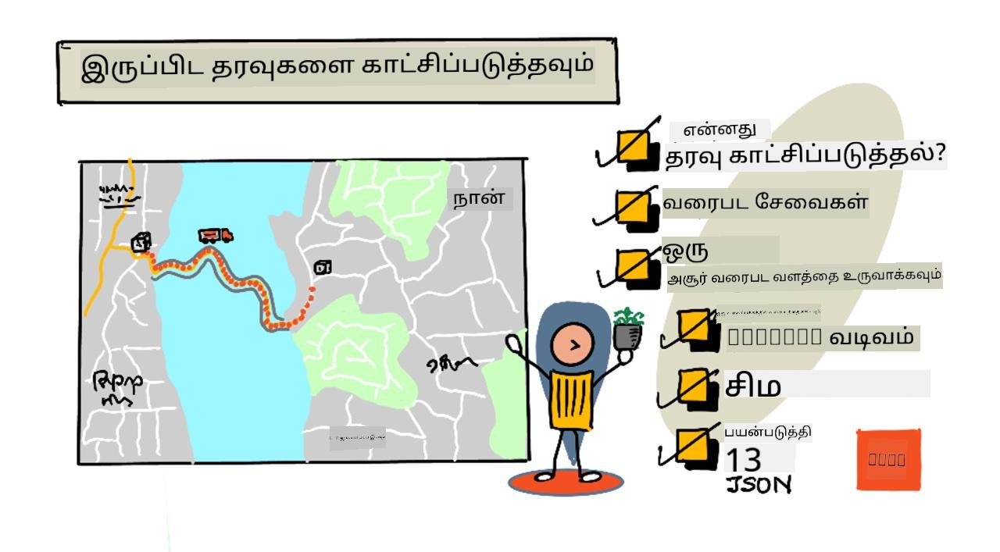
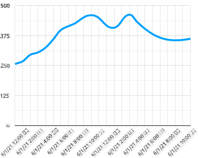
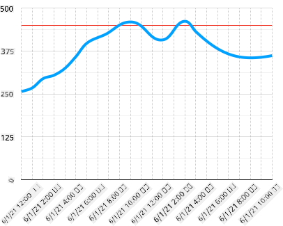
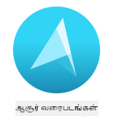
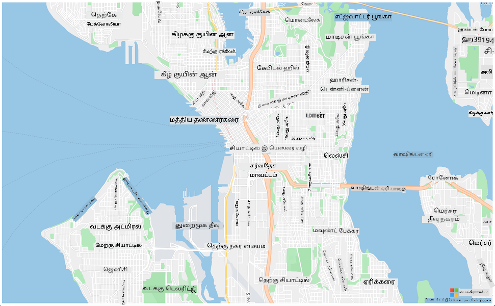
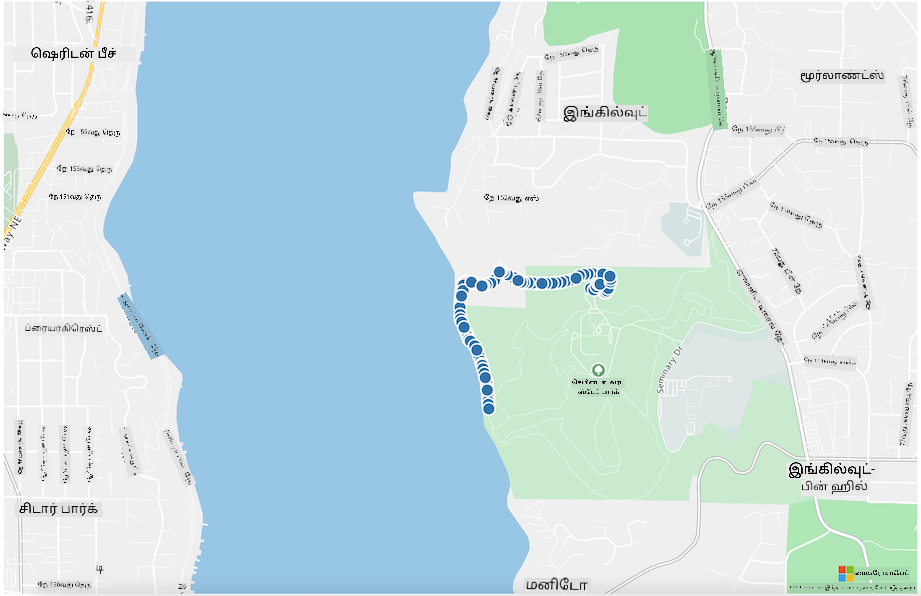

<!--
CO_OP_TRANSLATOR_METADATA:
{
  "original_hash": "9095c61445c2bca7245ef9b59a186a11",
  "translation_date": "2025-10-11T12:01:05+00:00",
  "source_file": "3-transport/lessons/3-visualize-location-data/README.md",
  "language_code": "ta"
}
-->
# இடம் தரவுகளை காட்சிப்படுத்துதல்



> ஸ்கெட்ச் நோட்: [நித்யா நரசிம்மன்](https://github.com/nitya). படத்தை கிளிக் செய்து பெரிய பதிப்பைப் பாருங்கள்.

இந்த வீடியோ Azure Maps மற்றும் IoT பற்றிய ஒரு கண்ணோட்டத்தை வழங்குகிறது, இது இந்த பாடத்தில் கற்றுக்கொள்ளப்படும்.

[](https://www.youtube.com/watch?v=P5i2GFTtb2s)

> 🎥 மேலே உள்ள படத்தை கிளிக் செய்து வீடியோவைப் பாருங்கள்

## பாடத்திற்கு முன் வினாடி வினா

[பாடத்திற்கு முன் வினாடி வினா](https://black-meadow-040d15503.1.azurestaticapps.net/quiz/25)

## அறிமுகம்

கடந்த பாடத்தில், உங்கள் சென்சார்களிலிருந்து GPS தரவுகளை சேகரித்து, சேமிப்பகத்தில் சேமிக்க சர்வர்லெஸ் கோடுகளை பயன்படுத்துவது எப்படி என்பதை நீங்கள் கற்றுக்கொண்டீர்கள். இப்போது அந்த புள்ளிகளை Azure Maps-ல் காட்சிப்படுத்துவது எப்படி என்பதை நீங்கள் கற்றுக்கொள்வீர்கள். ஒரு வலைப்பக்கத்தில் ஒரு வரைபடத்தை உருவாக்குவது, GeoJSON தரவுத் வடிவமைப்பைப் பற்றி அறிந்து, உங்கள் வரைபடத்தில் சேகரிக்கப்பட்ட GPS புள்ளிகளை வரைபடத்தில் சித்தரிப்பது எப்படி என்பதை நீங்கள் கற்றுக்கொள்வீர்கள்.

இந்த பாடத்தில் நாம் கற்றுக்கொள்ளப் போவது:

* [தரவுக் காட்சிப்படுத்தல் என்றால் என்ன](../../../../../3-transport/lessons/3-visualize-location-data)
* [வரைபட சேவைகள்](../../../../../3-transport/lessons/3-visualize-location-data)
* [Azure Maps வளத்தை உருவாக்குதல்](../../../../../3-transport/lessons/3-visualize-location-data)
* [ஒரு வலைப்பக்கத்தில் ஒரு வரைபடத்தை காட்டுதல்](../../../../../3-transport/lessons/3-visualize-location-data)
* [GeoJSON வடிவமைப்பு](../../../../../3-transport/lessons/3-visualize-location-data)
* [GeoJSON-ஐப் பயன்படுத்தி GPS தரவுகளை வரைபடத்தில் சித்தரித்தல்](../../../../../3-transport/lessons/3-visualize-location-data)

> 💁 இந்த பாடத்தில் HTML மற்றும் JavaScript பற்றிய சிறிய அளவிலான அறிவு தேவைப்படும். HTML மற்றும் JavaScript-ஐப் பயன்படுத்தி வலை வளர்ச்சி பற்றி மேலும் அறிய விரும்பினால், [Web development for beginners](https://github.com/microsoft/Web-Dev-For-Beginners) ஐப் பாருங்கள்.

## தரவுக் காட்சிப்படுத்தல் என்றால் என்ன

தரவுக் காட்சிப்படுத்தல் என்பது தரவுகளை மனிதர்களுக்கு எளிதாக புரிந்துகொள்ளும் வகையில் காட்சிப்படுத்துவது ஆகும். இது பொதுவாக வரைபடங்கள் மற்றும் கிராஃப்களுடன் தொடர்புடையது, ஆனால் தரவுகளை மனிதர்களுக்கு எளிதாக புரிந்துகொள்ளவும், முடிவுகளை எடுக்கவும் உதவுவதற்கான எந்தவொரு காட்சிப்படுத்தல் முறையும் இதன் கீழ் வருகிறது.

ஒரு எளிய உதாரணமாக - பண்ணை திட்டத்தில் நீங்கள் மண் ஈரப்பதம் அளவுகளை சேகரித்தீர்கள். 2021 ஜூன் 1-ஆம் தேதி ஒவ்வொரு மணித்தியாலத்திலும் சேகரிக்கப்பட்ட மண் ஈரப்பதம் தரவுகளின் அட்டவணை கீழே உள்ளதுபோல் இருக்கும்:

| தேதி             | அளவீடு |
| ---------------- | ------: |
| 01/06/2021 00:00 |     257 |
| 01/06/2021 01:00 |     268 |
| 01/06/2021 02:00 |     295 |
| 01/06/2021 03:00 |     305 |
| 01/06/2021 04:00 |     325 |
| 01/06/2021 05:00 |     359 |
| 01/06/2021 06:00 |     398 |
| 01/06/2021 07:00 |     410 |
| 01/06/2021 08:00 |     429 |
| 01/06/2021 09:00 |     451 |
| 01/06/2021 10:00 |     460 |
| 01/06/2021 11:00 |     452 |
| 01/06/2021 12:00 |     420 |
| 01/06/2021 13:00 |     408 |
| 01/06/2021 14:00 |     431 |
| 01/06/2021 15:00 |     462 |
| 01/06/2021 16:00 |     432 |
| 01/06/2021 17:00 |     402 |
| 01/06/2021 18:00 |     387 |
| 01/06/2021 19:00 |     360 |
| 01/06/2021 20:00 |     358 |
| 01/06/2021 21:00 |     354 |
| 01/06/2021 22:00 |     356 |
| 01/06/2021 23:00 |     362 |

மனிதர்களுக்கு இந்த தரவுகளைப் புரிந்துகொள்வது கடினமாக இருக்கலாம். இது அர்த்தமற்ற எண்களின் சுவர் போன்றது. இந்த தரவுகளை காட்சிப்படுத்தும் முதல் படியாக, அதை ஒரு கோட்படத்தில் வரைபடமாக்கலாம்:



இதை மேலும் மேம்படுத்த, மண் ஈரப்பதம் அளவீடு 450-ல் தானியங்கி நீர்ப்பாசன அமைப்பு இயக்கப்பட்ட போது ஒரு கோடு சேர்க்கலாம்:



இந்த கோட்படம் மண் ஈரப்பதம் அளவுகள் என்னவென்று மட்டுமல்லாமல், நீர்ப்பாசன அமைப்பு இயக்கப்பட்ட புள்ளிகளையும் விரைவாக காட்டுகிறது.

கோட்படங்கள் மட்டுமல்ல, தரவுகளை காட்சிப்படுத்தும் கருவிகள். வானிலை கண்காணிக்கும் IoT சாதனங்கள், வானிலை நிலைகளை சின்னங்களைக் கொண்டு காட்சிப்படுத்தும் வலைப் பயன்பாடுகள் அல்லது மொபைல் பயன்பாடுகளை கொண்டிருக்கலாம், உதாரணமாக மேக சின்னம் மேகமூட்டமான நாட்களுக்கு, மழை மேக சின்னம் மழை நாட்களுக்கு. தரவுகளை காட்சிப்படுத்த பல வழிகள் உள்ளன, சில தீவிரமானவை, சில வேடிக்கையானவை.

✅ நீங்கள் தரவுகளை காட்சிப்படுத்திய விதங்களைப் பற்றி சிந்தியுங்கள். எந்த முறைகள் தெளிவாக இருந்தன, மற்றும் எந்த முறைகள் விரைவாக முடிவுகளை எடுக்க உதவின?

மனிதர்களுக்கு விரைவாக முடிவுகளை எடுக்க உதவும் சிறந்த காட்சிப்படுத்தல்களே சிறந்தவை. உதாரணமாக, தொழில்துறை இயந்திரங்களின் அனைத்து அளவீடுகளையும் காட்டும் அளவீட்டு சுவர்கள் புரிந்துகொள்ள கடினமாக இருக்கும், ஆனால் ஏதோ தவறாக நடந்தால் ஒரு மின்மினக்கும் சிவப்பு விளக்கு மனிதனுக்கு முடிவெடுக்க உதவுகிறது. சில நேரங்களில் சிறந்த காட்சிப்படுத்தல் ஒரு மின்மினக்கும் விளக்காக இருக்கலாம்!

GPS தரவுகளுடன் வேலை செய்யும்போது, தரவுகளை ஒரு வரைபடத்தில் சித்தரிப்பது தெளிவான காட்சிப்படுத்தலாக இருக்கலாம். ஒரு வரைபடம், உதாரணமாக, டெலிவரி லாரிகளை காட்டும் வரைபடம், ஒரு செயலாக்க ஆலையில் பணியாளர்கள் லாரிகள் எப்போது வரும் என்பதைப் பார்க்க உதவுகிறது. இந்த வரைபடம் லாரிகளின் தற்போதைய இடங்களை மட்டுமல்லாமல், லாரியின் உள்ளடக்கத்தைப் பற்றிய ஒரு கருத்தை வழங்கினால், ஆலை பணியாளர்கள் அதற்கேற்ப திட்டமிடலாம் - ஒரு குளிர்சாதன லாரி அருகில் இருப்பதை அவர்கள் பார்த்தால், குளிர்சாதனத்தில் இடத்தை தயாரிக்கலாம்.

## வரைபட சேவைகள்

வரைபடங்களுடன் வேலை செய்வது ஒரு சுவாரஸ்யமான பயிற்சி, மற்றும் Bing Maps, Leaflet, Open Street Maps, Google Maps போன்ற பலவற்றை தேர்வு செய்யலாம். இந்த பாடத்தில், நீங்கள் [Azure Maps](https://azure.microsoft.com/services/azure-maps/?WT.mc_id=academic-17441-jabenn) மற்றும் உங்கள் GPS தரவுகளை காட்சிப்படுத்த அது எப்படி உதவுகிறது என்பதை கற்றுக்கொள்வீர்கள்.



Azure Maps என்பது "புதிய வரைபட தரவுகளைப் பயன்படுத்தி வலை மற்றும் மொபைல் பயன்பாடுகளுக்கு புவியியல் சூழலை வழங்கும் புவியியல் சேவைகள் மற்றும் SDKகளின் தொகுப்பு." டெவலப்பர்கள் அழகான, இடைமுகம் கொண்ட வரைபடங்களை உருவாக்குவதற்கான கருவிகளைப் பெறுகிறார்கள், அவை பரிந்துரைக்கப்பட்ட போக்குவரத்து பாதைகள், போக்குவரத்து சம்பவங்கள் பற்றிய தகவல், உள்ளக வழிசெலுத்தல், தேடல் திறன்கள், உயரம் தகவல், வானிலை சேவைகள் மற்றும் பலவற்றை செய்ய முடியும்.

✅ சில [வரைபட குறியீடு மாதிரிகளை](https://docs.microsoft.com/samples/browse?WT.mc_id=academic-17441-jabenn&products=azure-maps) சோதிக்கவும்.

நீங்கள் வரைபடங்களை வெற்று கேன்வாஸ், டைல்கள், செயற்கைக்கோள் படங்கள், சாலைகள் superimposed செயற்கைக்கோள் படங்கள், பல வகையான grayscale வரைபடங்கள், shaded relief வரைபடங்கள், இரவு காட்சி வரைபடங்கள், மற்றும் ஒரு உயர் மாறுபாடு வரைபடம் போன்ற பல வடிவங்களில் காட்சிப்படுத்தலாம். [Azure Event Grid](https://azure.microsoft.com/services/event-grid/?WT.mc_id=academic-17441-jabenn) உடன் ஒருங்கிணைப்பதன் மூலம் உங்கள் வரைபடங்களில் நேரடி புதுப்பிப்புகளைப் பெறலாம். உங்கள் வரைபடத்தின் நடத்தை மற்றும் தோற்றத்தை கட்டுப்படுத்த, பின்ச், டிராக், கிளிக் போன்ற நிகழ்வுகளுக்கு வரைபடம் பதிலளிக்க அனுமதிக்கும் பல கட்டுப்பாடுகளை நீங்கள் இயக்கலாம். உங்கள் வரைபடத்தின் தோற்றத்தை கட்டுப்படுத்த, புள்ளிகள், கோடுகள், பல்கோணங்கள், வெப்ப வரைபடங்கள் மற்றும் பலவற்றை உள்ளடக்கிய அடுக்குகளை நீங்கள் சேர்க்கலாம். எந்த வகையான வரைபடத்தை நீங்கள் செயல்படுத்துகிறீர்கள் என்பது உங்கள் SDK தேர்வில் निर्भर.

Azure Maps APIக்களை அதன் [REST API](https://docs.microsoft.com/javascript/api/azure-maps-rest/?WT.mc_id=academic-17441-jabenn&view=azure-maps-typescript-latest), அதன் [Web SDK](https://docs.microsoft.com/azure/azure-maps/how-to-use-map-control?WT.mc_id=academic-17441-jabenn), அல்லது, நீங்கள் ஒரு மொபைல் பயன்பாட்டை உருவாக்கினால், அதன் [Android SDK](https://docs.microsoft.com/azure/azure-maps/how-to-use-android-map-control-library?WT.mc_id=academic-17441-jabenn&pivots=programming-language-java-android) மூலம் அணுகலாம்.

இந்த பாடத்தில், உங்கள் சென்சாரின் GPS இடத்தின் பாதையை வரைபடத்தில் வரைய Web SDK-ஐ நீங்கள் பயன்படுத்துவீர்கள்.

## Azure Maps வளத்தை உருவாக்குதல்

முதலில் Azure Maps கணக்கை உருவாக்க வேண்டும்.

### பணிகள் - Azure Maps வளத்தை உருவாக்குதல்

1. உங்கள் Terminal அல்லது Command Prompt-ல் கீழே உள்ள கட்டளையை இயக்கி உங்கள் `gps-sensor` resource group-ல் Azure Maps வளத்தை உருவாக்கவும்:

    ```sh
    az maps account create --name gps-sensor \
                           --resource-group gps-sensor \
                           --accept-tos \
                           --sku S1
    ```

    இது `gps-sensor` என்ற Azure Maps வளத்தை உருவாக்கும். பயன்படுத்தப்படும் tier `S1`, இது பல அம்சங்களை உள்ளடக்கிய ஒரு கட்டண tier ஆகும், ஆனால் இலவசமாக பரந்த அளவிலான அழைப்புகளை வழங்குகிறது.

    > 💁 Azure Maps-ஐப் பயன்படுத்தும் செலவைப் பார்க்க, [Azure Maps விலைப் பக்கம்](https://azure.microsoft.com/pricing/details/azure-maps/?WT.mc_id=academic-17441-jabenn) ஐப் பாருங்கள்.

1. Maps வளத்திற்கான API key தேவைப்படும். இந்த key ஐப் பெற கீழே உள்ள கட்டளையைப் பயன்படுத்தவும்:

    ```sh
    az maps account keys list --name gps-sensor \
                              --resource-group gps-sensor \
                              --output table
    ```

    `PrimaryKey` மதிப்பை நகலெடுக்கவும்.

## ஒரு வலைப்பக்கத்தில் ஒரு வரைபடத்தை காட்டுதல்

இப்போது உங்கள் வரைபடத்தை ஒரு வலைப்பக்கத்தில் காட்சிப்படுத்துவது அடுத்த படியாகும். உங்கள் சிறிய வலை பயன்பாட்டிற்காக ஒரு `html` கோப்பை மட்டுமே பயன்படுத்துவோம்; உற்பத்தி அல்லது குழு சூழலில், உங்கள் வலை பயன்பாடு அதிகமான பகுதிகளை கொண்டிருக்கும்!

### பணிகள் - ஒரு வலைப்பக்கத்தில் ஒரு வரைபடத்தை காட்டுதல்

1. உங்கள் உள்ளூர் கணினியில் ஒரு கோப்புறையில் index.html என்ற கோப்பை உருவாக்கவும். ஒரு வரைபடத்தை வைத்திருக்க HTML markup ஐச் சேர்க்கவும்:

    ```html
    <html>
    <head>
        <style>
            #myMap {
                width:100%;
                height:100%;
            }
        </style>
    </head>
    
    <body onload="init()">
        <div id="myMap"></div>
    </body>
    </html>
    ```

    வரைபடம் `myMap` `div`-ல் ஏற்றப்படும். சில ஸ்டைல்கள் அதை பக்கத்தின் அகலம் மற்றும் உயரத்தைப் பரப்ப அனுமதிக்கின்றன.

    > 🎓 ஒரு `div` என்பது ஒரு வலைப்பக்கத்தின் ஒரு பகுதி, இது பெயரிடப்பட்டு ஸ்டைல் செய்யப்படலாம்.

1. திறக்கும் `<head>` tag-க்கு கீழே, வரைபட காட்சியை கட்டுப்படுத்த ஒரு வெளிப்புற ஸ்டைல் ஷீட்டை மற்றும் அதன் நடத்தை நிர்வகிக்க Web SDK-இன் ஒரு வெளிப்புற ஸ்கிரிப்டைச் சேர்க்கவும்:

    ```html
    <link rel="stylesheet" href="https://atlas.microsoft.com/sdk/javascript/mapcontrol/2/atlas.min.css" type="text/css" />
    <script src="https://atlas.microsoft.com/sdk/javascript/mapcontrol/2/atlas.min.js"></script>
    ```

    இந்த ஸ்டைல் ஷீட் வரைபடம் எப்படி தோன்றுகிறது என்பதை உள்ளடக்கியது, மற்றும் ஸ்கிரிப்ட் கோப்பு வரைபடத்தை ஏற்றுவதற்கான குறியீடுகளை உள்ளடக்கியது. இந்த குறியீட்டைச் சேர்ப்பது C++ header files ஐ சேர்ப்பது அல்லது Python modules ஐ இறக்குமதி செய்வது போன்றது.

1. அந்த ஸ்கிரிப்டின் கீழ், வரைபடத்தை தொடங்க ஒரு ஸ்கிரிப்ட் பிளாக்கைச் சேர்க்கவும்.

    ```javascript
    <script type='text/javascript'>
        function init() {
            var map = new atlas.Map('myMap', {
                center: [-122.26473, 47.73444],
                zoom: 12,
                authOptions: {
                    authType: "subscriptionKey",
                    subscriptionKey: "<subscription_key>",

                }
            });
        }
    </script>
    ```

    `<subscription_key>` ஐ உங்கள் Azure Maps கணக்கிற்கான API key-யுடன் மாற்றவும்.

    உங்கள் `index.html` பக்கத்தை ஒரு வலை உலாவியில் திறந்தால், ஒரு வரைபடம் ஏற்றப்பட்டு, சியாட்டில் பகுதியில் மையமாக இருக்கும்.

    

    ✅ உங்கள் வரைபட காட்சியை மாற்ற zoom மற்றும் center அளவுருக்களுடன் பரிசோதிக்கவும். உங்கள் தரவின் latitude மற்றும் longitude-க்கு இணையான வெவ்வேறு கோர்டினேட்களைச் சேர்த்து வரைபடத்தை மறு மையமாக்கலாம்.

> 💁 உள்ளூர் வலை பயன்பாடுகளுடன் வேலை செய்ய ஒரு சிறந்த வழி [http-server](https://www.npmjs.com/package/http-server) ஐ நிறுவுவது. [node.js](https://nodejs.org/) மற்றும் [npm](https://www.npmjs.com/) நிறுவப்பட்டிருக்க வேண்டும். இந்த கருவியைப் பயன்படுத்துவதற்கு முன். இந்த கருவிகள் நிறுவப்பட்ட பிறகு, உங்கள் `index.html` கோப்பின் இருப்பிடத்திற்கு செல்லவும் மற்றும் `http-server` என تایپ செய்யவும். வலை பயன்பாடு ஒரு உள்ளூர் வலைசர்வரில் திறக்கப்படும் [http://127.0.0.1:8080/](http://127.0.0.1:8080/).

## GeoJSON வடிவமைப்பு

இப்போது உங்கள் வலை பயன்பாடு வரைபடத்துடன் காட்சிப்படுத்தப்பட்டுள்ளது, உங்கள் சேமிப்பு கணக்கிலிருந்து GPS தரவுகளை எடுத்து, வரைபடத்தின் மேல் அடுக்கில் மார்க்கர்களாக காட்சிப்படுத்த வேண்டும். அதைச் செய்யும் முன், Azure Maps-க்கு தேவைப்படும் [GeoJSON](https://wikipedia.org/wiki/GeoJSON) வடிவமைப்பைப் பார்ப்போம்.

[GeoJSON](https://geojson.org/) என்பது புவியியல் குறிப்பிட்ட தரவுகளைச் சமாளிக்க சிறப்பு வடிவமைப்புடன் JSON ஸ்பெசிபிகேஷனின் ஒரு திறந்த தரநிலை ஆகும். [geojson.io](https://geojson.io) ஐப் பயன்படுத்தி மாதிரி தரவுகளை சோதிப்பதன் மூலம் இதைப் பற்றி நீங்கள் கற்றுக்கொள்ளலாம், இது GeoJSON கோப்புகளை பிழைதிருத்துவதற்கான ஒரு பயனுள்ள கருவியாகவும் உள்ளது.

GeoJSON மாதிரி தரவுகள் இவ்வாறு இருக்கும்:

```json
{
  "type": "FeatureCollection",
  "features": [
    {
      "type": "Feature",
      "geometry": {
        "type": "Point",
        "coordinates": [
          -2.10237979888916,
          57.164918677004714
        ]
      }
    }
  ]
}
```

முக்கியமாக, `FeatureCollection`-இன் உள்ளே `Feature` என அடுக்கப்பட்டுள்ள தரவின் அமைப்பு. அதன் உள்ளே `geometry` மற்றும் `coordinates` latitude மற்றும் longitude ஐக் குறிக்கின்றன.

✅ உங்கள் geoJSON ஐ உருவாக்கும்போது, பொருளில் `latitude` மற்றும் `longitude` வரிசையை கவனமாக பார்க்கவும், இல்லையெனில் உங்கள் புள்ளிகள் சரியான இடத்தில் தோன்றாது! GeoJSON புள்ளிகளுக்கு `lon,lat` வரிசையில் தரவுகளை எதிர்பார்க்கிறது, `lat,lon` அல்ல.
`Geometry` பல வகைகளாக இருக்கலாம், உதாரணமாக ஒரு புள்ளி அல்லது பலகோணம். இந்த எடுத்துக்காட்டில், இது இரண்டு கோர்டினேட் கொண்ட ஒரு புள்ளியாக உள்ளது, அதாவது நீளவியல் மற்றும் அகலவியல்.

✅ Azure Maps பொதுவான GeoJSON-ஐ மட்டுமின்றி சில [மேம்படுத்தப்பட்ட அம்சங்களை](https://docs.microsoft.com/azure/azure-maps/extend-geojson?WT.mc_id=academic-17441-jabenn) ஆதரிக்கிறது, இதில் வட்டங்கள் மற்றும் பிற வடிவங்களை வரைபடம் வரைதல் போன்றவை அடங்கும்.

## GeoJSON பயன்படுத்தி GPS தரவுகளை வரைபடத்தில் காண்பிக்கவும்

முந்தைய பாடத்தில் நீங்கள் உருவாக்கிய சேமிப்பகத்திலிருந்து தரவுகளை பயன்படுத்த தயாராக இருக்கிறீர்கள். நினைவூட்டலுக்காக, இது blob சேமிப்பகத்தில் பல கோப்புகளாக சேமிக்கப்பட்டுள்ளது, எனவே நீங்கள் கோப்புகளை பெறவும், அவற்றை Azure Maps தரவுகளை பயன்படுத்த parse செய்யவும் வேண்டும்.

### பணிகள் - வலைப்பக்கத்திலிருந்து சேமிப்பகத்தை அணுக கான்பிகர் செய்யவும்

உங்கள் சேமிப்பகத்திற்குச் செல்லும் அழைப்பைச் செய்யும்போது, உங்கள் உலாவியின் console-இல் பிழைகள் தோன்றும் என்பதை நீங்கள் கவனிக்கலாம். இதற்குக் காரணம், [CORS](https://developer.mozilla.org/docs/Web/HTTP/CORS) அனுமதிகளை இந்த சேமிப்பகத்தில் அமைக்க வேண்டும், இதனால் வெளிப்புற வலை பயன்பாடுகள் அதன் தரவுகளைப் படிக்க முடியும்.

> 🎓 CORS என்பது "Cross-Origin Resource Sharing" என்பதற்கான சுருக்கமாகும், இது பாதுகாப்பு காரணங்களுக்காக Azure-இல் வெளிப்படையாக அமைக்கப்பட வேண்டும். இது நீங்கள் எதிர்பார்க்காத தளங்கள் உங்கள் தரவுகளை அணுகுவதைத் தடுக்கிறது.

1. CORS-ஐ இயக்க கீழே உள்ள கட்டளையை இயக்கவும்:

    ```sh
    az storage cors add --methods GET \
                        --origins "*" \
                        --services b \
                        --account-name <storage_name> \
                        --account-key <key1>
    ```

    `<storage_name>`-ஐ உங்கள் சேமிப்பக கணக்கின் பெயருடன் மாற்றவும். `<key1>`-ஐ உங்கள் சேமிப்பக கணக்கிற்கான கணக்கு விசையுடன் மாற்றவும்.

    இந்த கட்டளை எந்தவொரு வலைத்தளத்தையும் (wildcard `*` என்பது எதுவும்) *GET* கோரிக்கையைச் செய்ய அனுமதிக்கிறது, அதாவது உங்கள் சேமிப்பக கணக்கிலிருந்து தரவுகளைப் பெற. `--services b` என்பது இந்த அமைப்பை blob-களுக்கு மட்டுமே பொருந்தும் என்று பொருள்.

### பணிகள் - GPS தரவுகளை சேமிப்பகத்திலிருந்து ஏற்றவும்

1. `init` செயல்பாட்டின் முழு உள்ளடக்கத்தை கீழே உள்ள குறியீடு மூலம் மாற்றவும்:

    ```javascript
    fetch("https://<storage_name>.blob.core.windows.net/gps-data/?restype=container&comp=list")
        .then(response => response.text())
        .then(str => new window.DOMParser().parseFromString(str, "text/xml"))
        .then(xml => {
            let blobList = Array.from(xml.querySelectorAll("Url"));
                blobList.forEach(async blobUrl => {
                    loadJSON(blobUrl.innerHTML)                
        });
    })
    .then( response => {
        map = new atlas.Map('myMap', {
            center: [-122.26473, 47.73444],
            zoom: 14,
            authOptions: {
                authType: "subscriptionKey",
                subscriptionKey: "<subscription_key>",
    
            }
        });
        map.events.add('ready', function () {
            var source = new atlas.source.DataSource();
            map.sources.add(source);
            map.layers.add(new atlas.layer.BubbleLayer(source));
            source.add(features);
        })
    })
    ```

    `<storage_name>`-ஐ உங்கள் சேமிப்பக கணக்கின் பெயருடன் மாற்றவும். `<subscription_key>`-ஐ உங்கள் Azure Maps கணக்கிற்கான API விசையுடன் மாற்றவும்.

    இங்கு பல விஷயங்கள் நடக்கின்றன. முதலில், குறியீடு உங்கள் blob கெண்டெய்னரில் இருந்து GPS தரவுகளை உங்கள் சேமிப்பக கணக்கின் பெயரைப் பயன்படுத்தி உருவாக்கப்பட்ட URL முடிவில் இருந்து பெறுகிறது. இந்த URL `gps-data`-இல் இருந்து பெறுகிறது, இது வளவகை கெண்டெய்னர் (`restype=container`) என்பதை குறிக்கிறது, மற்றும் அனைத்து blob-களின் தகவல்களை பட்டியலிடுகிறது. இந்த பட்டியல் blob-களைத் தானாகவே திருப்பாது, ஆனால் ஒவ்வொரு blob-க்கும் URL-ஐ திருப்பும், இது blob தரவுகளை ஏற்ற பயன்படுத்தப்படலாம்.

    > 💁 இந்த URL-ஐ உங்கள் உலாவியில் வைத்து உங்கள் கெண்டெய்னரில் உள்ள அனைத்து blob-களின் விவரங்களைப் பார்க்கலாம். ஒவ்வொரு உருப்படியும் `Url` பண்புக்கூறை கொண்டிருக்கும், இதை உங்கள் உலாவியில் blob உள்ளடக்கங்களைப் பார்க்க ஏற்றலாம்.

    இந்த குறியீடு ஒவ்வொரு blob-ஐ ஏற்றுகிறது, `loadJSON` செயல்பாட்டை அழைக்கிறது, இது அடுத்ததாக உருவாக்கப்படும். பின்னர், வரைபடக் கட்டுப்பாட்டை உருவாக்குகிறது மற்றும் `ready` நிகழ்வுக்கான குறியீட்டைச் சேர்க்கிறது. இந்த நிகழ்வு, வரைபடம் வலைப்பக்கத்தில் காட்டப்படும் போது அழைக்கப்படுகிறது.

    `ready` நிகழ்வு Azure Maps தரவ மூலத்தை உருவாக்குகிறது - இது GeoJSON தரவங்களை உள்ளடக்கிய ஒரு கெண்டெய்னர், இது பின்னர் நிரப்பப்படும். இந்த தரவ மூலத்தைப் பயன்படுத்தி ஒரு பபிள் லேயர் உருவாக்கப்படுகிறது - அதாவது GeoJSON-இல் உள்ள ஒவ்வொரு புள்ளியின் மையத்தில் வரைபடத்தில் வட்டங்கள்.

1. `init` செயல்பாட்டின் கீழே உங்கள் ஸ்கிரிப்ட் பிளாக்கில் `loadJSON` செயல்பாட்டைச் சேர்க்கவும்:

    ```javascript
    var map, features;

    function loadJSON(file) {
        var xhr = new XMLHttpRequest();
        features = [];
        xhr.onreadystatechange = function () {
            if (xhr.readyState === XMLHttpRequest.DONE) {
                if (xhr.status === 200) {
                    gps = JSON.parse(xhr.responseText)
                    features.push(
                        new atlas.data.Feature(new atlas.data.Point([parseFloat(gps.gps.lon), parseFloat(gps.gps.lat)]))
                    )
                }
            }
        };
        xhr.open("GET", file, true);
        xhr.send();
    }    
    ```

    இந்த செயல்பாடு JSON தரவத்தை parse செய்ய fetch செயல்பாட்டால் அழைக்கப்படுகிறது, மற்றும் longitude மற்றும் latitude கோர்டினேட்களாக geoJSON-ஆக மாற்றுகிறது.
    parse செய்யப்பட்டதும், தரவம் geoJSON `Feature`-இன் ஒரு பகுதியாக அமைக்கப்படுகிறது. வரைபடம் ஆரம்பிக்கப்படும், மற்றும் உங்கள் தரவம் வரைபடத்தில் காட்டும் பாதையின் சுற்றிலும் சிறிய வட்டங்கள் தோன்றும்:

1. HTML பக்கத்தை உங்கள் உலாவியில் ஏற்றவும். இது வரைபடத்தை ஏற்றும், பின்னர் சேமிப்பகத்திலிருந்து அனைத்து GPS தரவுகளையும் ஏற்றும் மற்றும் அதை வரைபடத்தில் காண்பிக்கும்.

    

> 💁 இந்த குறியீட்டை [code](../../../../../3-transport/lessons/3-visualize-location-data/code) கோப்புறையில் காணலாம்.

---

## 🚀 சவால்

மார்க்கர்களை நிலையான தரவாக ஒரு வரைபடத்தில் காட்டுவது நல்லது. நேரத்திற்கேற்ப timestamped json கோப்புகளைப் பயன்படுத்தி மார்க்கர்களின் பாதையை காட்ட அனிமேஷனைச் சேர்க்க இந்த வலை பயன்பாட்டை மேம்படுத்த முடியுமா? வரைபடங்களில் அனிமேஷனைப் பயன்படுத்துவதற்கான [சில எடுத்துக்காட்டுகள்](https://azuremapscodesamples.azurewebsites.net/) இங்கே உள்ளன.

## பாடத்திற்குப் பிந்தைய வினாடி வினா

[பாடத்திற்குப் பிந்தைய வினாடி வினா](https://black-meadow-040d15503.1.azurestaticapps.net/quiz/26)

## மதிப்பீடு & சுயபயிற்சி

Azure Maps குறிப்பாக IoT சாதனங்களுடன் வேலை செய்ய மிகவும் பயனுள்ளதாக உள்ளது.

* [Microsoft docs-இல் Azure Maps ஆவணங்களில்](https://docs.microsoft.com/azure/azure-maps/tutorial-iot-hub-maps?WT.mc_id=academic-17441-jabenn) சில பயன்பாடுகளை ஆராயவும்.
* [Microsoft Learn-இல் Azure Maps-ஐப் பயன்படுத்தி உங்கள் முதல் வழி கண்டறியும் பயன்பாட்டை உருவாக்கும் சுய-வழிகாட்டும் கற்றல் தொகுப்புடன்](https://docs.microsoft.com/learn/modules/create-your-first-app-with-azure-maps/?WT.mc_id=academic-17441-jabenn) உங்கள் வரைபடம் உருவாக்கும் மற்றும் வழிகாட்டும் அறிவை ஆழமாக்கவும்.

## பணிக்கட்டளை

[உங்கள் பயன்பாட்டை வெளியிடவும்](assignment.md)

---

**குறிப்பு**:  
இந்த ஆவணம் [Co-op Translator](https://github.com/Azure/co-op-translator) என்ற AI மொழிபெயர்ப்பு சேவையைப் பயன்படுத்தி மொழிபெயர்க்கப்பட்டுள்ளது. நாங்கள் துல்லியத்திற்காக முயற்சிக்கின்றோம், ஆனால் தானியங்கி மொழிபெயர்ப்புகளில் பிழைகள் அல்லது தவறான தகவல்கள் இருக்கக்கூடும் என்பதை கவனத்தில் கொள்ளவும். அதன் தாய்மொழியில் உள்ள மூல ஆவணம் அதிகாரப்பூர்வ ஆதாரமாக கருதப்பட வேண்டும். முக்கியமான தகவல்களுக்கு, தொழில்முறை மனித மொழிபெயர்ப்பு பரிந்துரைக்கப்படுகிறது. இந்த மொழிபெயர்ப்பைப் பயன்படுத்துவதால் ஏற்படும் எந்த தவறான புரிதல்கள் அல்லது தவறான விளக்கங்களுக்கு நாங்கள் பொறுப்பல்ல.