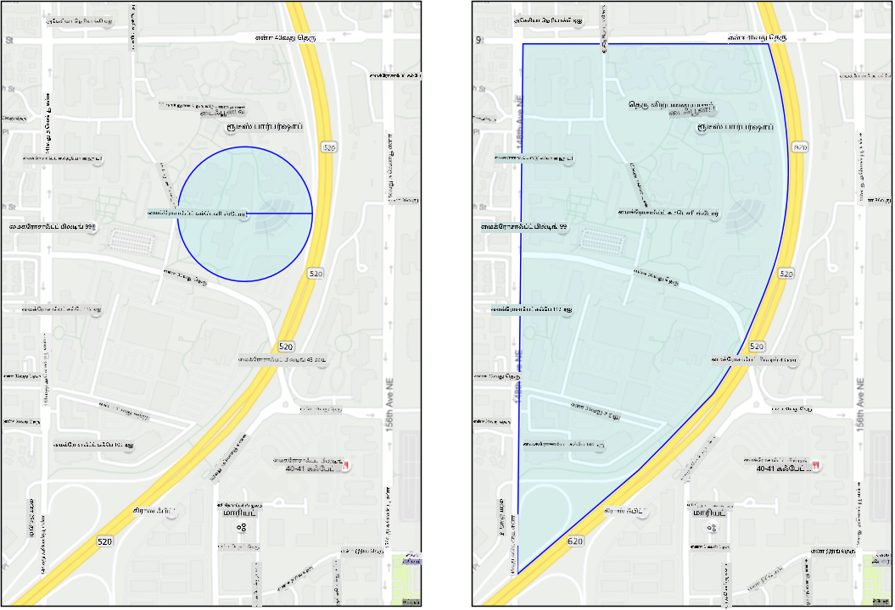
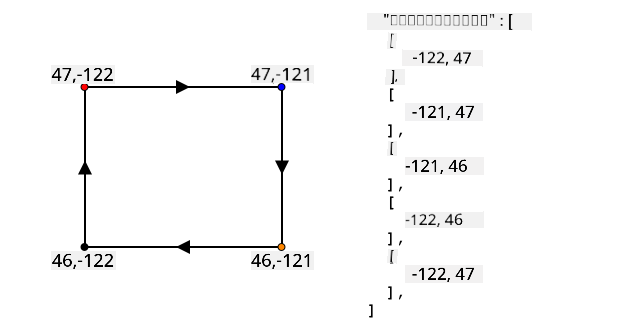
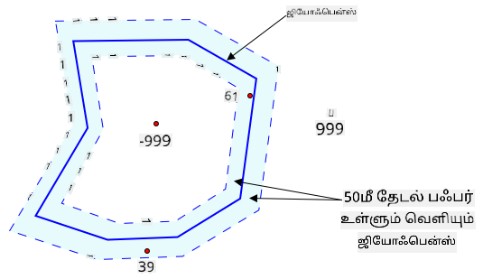
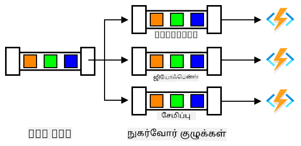

<!--
CO_OP_TRANSLATOR_METADATA:
{
  "original_hash": "078ae664c7b686bf069545e9a5fc95b2",
  "translation_date": "2025-10-11T11:54:16+00:00",
  "source_file": "3-transport/lessons/4-geofences/README.md",
  "language_code": "ta"
}
-->
# ஜியோஃபென்ஸ்


> ஸ்கெட்ச் நோட்: [நித்யா நரசிம்மன்](https://github.com/nitya). படத்தை கிளிக் செய்து பெரிய பதிப்பைப் பாருங்கள்.

இந்த வீடியோ ஜியோஃபென்ஸ் மற்றும் Azure Maps-ல் அவற்றைப் பயன்படுத்துவது பற்றிய ஒரு கண்ணோட்டத்தை வழங்குகிறது. இந்த பாடத்தில் கற்றுக்கொள்ளப்படும் தலைப்புகள்:

[](https://www.youtube.com/watch?v=nsrgYhaYNVY)

> 🎥 மேலே உள்ள படத்தை கிளிக் செய்து வீடியோவைப் பாருங்கள்

## பாடத்திற்கு முன் வினாடி வினா

[பாடத்திற்கு முன் வினாடி வினா](https://black-meadow-040d15503.1.azurestaticapps.net/quiz/27)

## அறிமுகம்

கடந்த 3 பாடங்களில், உங்கள் பண்ணையில் இருந்து செயலாக்க மையத்திற்குச் செல்லும் லாரிகளை IoT மூலம் கண்டறிந்தீர்கள். GPS தரவுகளைப் பதிவு செய்து, அதை கிளவுடில் சேமித்து, வரைபடத்தில் காட்சிப்படுத்தினீர்கள். உங்கள் சப்ளை சேனின் செயல்திறனை அதிகரிக்க அடுத்த படியாக, லாரி செயலாக்க மையத்திற்குச் செல்லும் முன் ஒரு எச்சரிக்கையைப் பெறுவது. இதனால், லாரி வந்தவுடன் அதை இறக்குவதற்கான குழுவினர் ஃபோர்க்லிஃப்ட் மற்றும் பிற உபகரணங்களுடன் தயாராக இருக்க முடியும். இதனால், லாரியை விரைவாக இறக்க முடியும், மேலும் லாரி மற்றும் டிரைவரின் காத்திருப்பு நேரத்திற்காக நீங்கள் செலவிட வேண்டியதில்லை.

இந்த பாடத்தில், ஜியோஃபென்ஸ் பற்றி கற்றுக்கொள்வீர்கள் - செயலாக்க மையத்திற்குச் செல்லும் 2 கிமீ சுற்றளவுக்குள் உள்ள பகுதி போன்ற வரையறுக்கப்பட்ட புவியியல் பகுதிகள். GPS கோர்டினேட்கள் ஜியோஃபென்ஸின் உள்ளே அல்லது வெளியே உள்ளதா என்பதை சோதிக்கவும், உங்கள் GPS சென்சார் ஒரு பகுதியை வந்தடைந்ததா அல்லது விட்டு சென்றதா என்பதைப் பார்க்கவும் கற்றுக்கொள்வீர்கள்.

இந்த பாடத்தில் நாம் கற்றுக்கொள்ளப் போவது:

* [ஜியோஃபென்ஸ் என்றால் என்ன](../../../../../3-transport/lessons/4-geofences)
* [ஜியோஃபென்ஸை வரையறுக்கவும்](../../../../../3-transport/lessons/4-geofences)
* [ஜியோஃபென்ஸுக்கு எதிராக புள்ளிகளை சோதிக்கவும்](../../../../../3-transport/lessons/4-geofences)
* [சர்வர்லெஸ் கோடில் ஜியோஃபென்ஸைப் பயன்படுத்தவும்](../../../../../3-transport/lessons/4-geofences)

> 🗑 இந்த திட்டத்தின் கடைசி பாடம் இது. எனவே, இந்த பாடத்தையும் பணியையும் முடித்த பிறகு, உங்கள் கிளவுட் சேவைகளை சுத்தம் செய்ய மறக்க வேண்டாம். பணியை முடிக்க சேவைகள் தேவைப்படும், எனவே முதலில் அதை முடிக்க உறுதிப்படுத்துங்கள்.
>
> [திட்டத்தை சுத்தம் செய்யும் வழிகாட்டி](../../../clean-up.md) தேவையானால் இதைப் பார்க்கவும்.

## ஜியோஃபென்ஸ் என்றால் என்ன

ஜியோஃபென்ஸ் என்பது ஒரு உண்மையான புவியியல் பகுதியின் கற்பனைச் சுற்றுச்சுவர். ஜியோஃபென்ஸ் ஒரு புள்ளி மற்றும் ஒரு ஆரை அடிப்படையாகக் கொண்ட வட்டமாக (உதாரணமாக ஒரு கட்டிடம் சுற்றியுள்ள 100 மீட்டர் அகலமான வட்டம்) அல்லது ஒரு பள்ளி மண்டலம், நகர எல்லைகள், அல்லது பல்கலைக்கழகம் அல்லது அலுவலக வளாகம் போன்ற பகுதியை உள்ளடக்கிய பாளிகனாக வரையறுக்கப்படலாம்.



> 💁 நீங்கள் ஏற்கனவே ஜியோஃபென்ஸைப் பயன்படுத்தியிருக்கலாம். iOS நினைவூட்டல் செயலி அல்லது Google Keep மூலம் ஒரு இடத்தை அடிப்படையாகக் கொண்ட நினைவூட்டலை அமைத்திருந்தால், நீங்கள் ஜியோஃபென்ஸைப் பயன்படுத்தியிருக்கிறீர்கள். இந்த செயலிகள் கொடுக்கப்பட்ட இடத்தை அடிப்படையாகக் கொண்டு ஜியோஃபென்ஸை அமைத்து, உங்கள் போன் ஜியோஃபென்ஸில் நுழைந்தவுடன் உங்களை எச்சரிக்கின்றன.

ஜியோஃபென்ஸின் உள்ளே அல்லது வெளியே ஒரு வாகனம் உள்ளதா என்பதை அறிய பல காரணங்கள் உள்ளன:

* இறக்குவதற்கான தயாரிப்பு - ஒரு வாகனம் தளத்தில் வந்துவிட்டது என்பதை அறிய ஒரு அறிவிப்பு கிடைப்பது குழுவினரை வாகனத்தை இறக்க தயாராக இருக்க உதவுகிறது, இதனால் வாகனத்தின் காத்திருப்பு நேரம் குறைகிறது. இது ஒரு டிரைவருக்கு குறைந்த காத்திருப்பு நேரத்துடன் ஒரு நாளில் அதிக டெலிவரிகளைச் செய்ய அனுமதிக்கிறது.
* வரி இணக்கம் - சில நாடுகள், உதாரணமாக நியூசிலாந்து, டீசல் வாகனங்களுக்கு பொதுவழிகளில் மட்டுமே வாகன எடையை அடிப்படையாகக் கொண்டு சாலை வரிகளை வசூலிக்கின்றன. ஜியோஃபென்ஸைப் பயன்படுத்துவதால், பண்ணைகள் அல்லது மரக்கட்டைகள் போன்ற தளங்களில் தனிப்பட்ட சாலைகளில் செலுத்தப்பட்ட மைலேஜ் மற்றும் பொதுவழிகளில் செலுத்தப்பட்ட மைலேஜ் ஆகியவற்றை கண்காணிக்க முடியும்.
* திருட்டை கண்காணித்தல் - ஒரு வாகனம் ஒரு குறிப்பிட்ட பகுதியிலேயே இருக்க வேண்டும், உதாரணமாக ஒரு பண்ணையில், ஆனால் அது ஜியோஃபென்ஸை விட்டு சென்றால், அது திருடப்பட்டிருக்கலாம்.
* இட இணக்கம் - வேலை தளம், பண்ணை அல்லது தொழிற்சாலை போன்ற சில பகுதிகள் குறிப்பிட்ட வாகனங்களுக்கு அனுமதிக்கப்படாமல் இருக்கலாம், உதாரணமாக செயற்கை உரங்கள் மற்றும் பூச்சிக்கொல்லிகள் கொண்ட வாகனங்களை ஆர்கானிக் விளைச்சல்களை வளர்க்கும் வயல்களிலிருந்து விலக்கி வைக்க வேண்டும். ஜியோஃபென்ஸில் நுழைந்தால், வாகனம் இணக்கத்திற்குப் புறம்பாக உள்ளது, மேலும் டிரைவருக்கு அறிவிப்பு வழங்கலாம்.

✅ ஜியோஃபென்ஸைப் பயன்படுத்துவதற்கான பிற வழிகளை நீங்கள் யோசிக்க முடியுமா?

Azure Maps, நீங்கள் கடந்த பாடத்தில் GPS தரவுகளை காட்சிப்படுத்த பயன்படுத்திய சேவை, ஜியோஃபென்ஸை வரையறுக்கவும், பின்னர் ஒரு புள்ளி ஜியோஃபென்ஸின் உள்ளே அல்லது வெளியே உள்ளதா என்பதை சோதிக்கவும் அனுமதிக்கிறது.

## ஜியோஃபென்ஸை வரையறுக்கவும்

ஜியோஃபென்ஸ்கள் GeoJSON பயன்படுத்தி வரையறுக்கப்படுகின்றன, கடந்த பாடத்தில் வரைபடத்தில் சேர்க்கப்பட்ட புள்ளிகளுடன் ஒரே மாதிரியானது. இந்த வழக்கில், `Point` மதிப்புகளின் `FeatureCollection` ஆக இல்லாமல், இது `Polygon` கொண்ட `FeatureCollection` ஆக இருக்கும்.

```json
{
   "type": "FeatureCollection",
   "features": [
     {
       "type": "Feature",
       "geometry": {
         "type": "Polygon",
         "coordinates": [
           [
             [
               -122.13393688201903,
               47.63829579223815
             ],
             [
               -122.13389128446579,
               47.63782047131512
             ],
             [
               -122.13240802288054,
               47.63783312249837
             ],
             [
               -122.13238388299942,
               47.63829037035086
             ],
             [
               -122.13393688201903,
               47.63829579223815
             ]
           ]
         ]
       },
       "properties": {
         "geometryId": "1"
       }
     }
   ]
}
```

பாளிகனில் உள்ள ஒவ்வொரு புள்ளியும் ஒரு நீளவியல், அகலவியல் ஜோடி ஆக வரையறுக்கப்படுகிறது, மேலும் இந்த புள்ளிகள் ஒரு வரிசையில் `coordinates` என அமைக்கப்படுகின்றன. கடந்த பாடத்தில் `Point`-இல், `coordinates` என்பது அகலவியல் மற்றும் நீளவியல் ஆகிய 2 மதிப்புகளை கொண்ட ஒரு வரிசையாக இருந்தது, `Polygon`-இல் இது 2 மதிப்புகளை கொண்ட வரிசைகளின் வரிசையாக இருக்கும், நீளவியல், அகலவியல்.

> 💁 நினைவில் கொள்ளுங்கள், GeoJSON புள்ளிகளுக்கு `longitude, latitude` பயன்படுத்துகிறது, `latitude, longitude` அல்ல.

பாளிகன் கோர்டினேட்கள் வரிசையில் பாளிகனில் உள்ள புள்ளிகளின் எண்ணிக்கையை விட 1 அதிகமான உள்ளீடு இருக்கும், கடைசி உள்ளீடு முதல் புள்ளியுடன் ஒரே மாதிரியானது, பாளிகனை மூடுகிறது. உதாரணமாக, ஒரு செவ்வகத்திற்கு 5 புள்ளிகள் இருக்கும்.



மேலே உள்ள படத்தில், ஒரு செவ்வகம் உள்ளது. பாளிகன் கோர்டினேட்கள் மேல் இடது பக்கம் 47,-122-ல் தொடங்கி, வலது பக்கம் 47,-121-க்கு நகர்கிறது, பின்னர் கீழே 46,-121-க்கு நகர்கிறது, பின்னர் வலது பக்கம் 46,-122-க்கு நகர்கிறது, பின்னர் தொடக்க புள்ளிக்கு மீண்டும் மேலே 47,-122-க்கு நகர்கிறது. இது பாளிகனுக்கு 5 புள்ளிகளை வழங்குகிறது - மேல் இடது பக்கம், மேல் வலது பக்கம், கீழ் வலது பக்கம், கீழ் இடது பக்கம், பின்னர் அதை மூடுவதற்கு மேல் இடது பக்கம்.

✅ உங்கள் வீடு அல்லது பள்ளியைச் சுற்றி ஒரு GeoJSON பாளிகனை உருவாக்க முயற்சிக்கவும். [GeoJSON.io](https://geojson.io/) போன்ற ஒரு கருவியைப் பயன்படுத்தவும்.

### பணிகள் - ஜியோஃபென்ஸை வரையறுக்கவும்

Azure Maps-ல் ஜியோஃபென்ஸைப் பயன்படுத்த, முதலில் அதை உங்கள் Azure Maps கணக்கில் பதிவேற்ற வேண்டும். பதிவேற்றப்பட்ட பிறகு, ஜியோஃபென்ஸுக்கு எதிராக ஒரு புள்ளியை சோதிக்க நீங்கள் பயன்படுத்தக்கூடிய ஒரு தனித்துவமான ஐடி கிடைக்கும். Azure Maps-க்கு ஜியோஃபென்ஸ்களை பதிவேற்ற, நீங்கள் maps web API-ஐ பயன்படுத்த வேண்டும். [curl](https://curl.se) எனப்படும் ஒரு கருவியைப் பயன்படுத்தி Azure Maps web API-ஐ அழைக்கலாம்.

> 🎓 Curl என்பது வலை முடுக்கங்களுக்கு எதிராக கோரிக்கைகளைச் செய்ய ஒரு கட்டளைகள் கருவி.

1. நீங்கள் Linux, macOS அல்லது சமீபத்திய Windows 10 பதிப்பைப் பயன்படுத்தினால், நீங்கள் ஏற்கனவே curl நிறுவியிருக்கலாம். உங்கள் டெர்மினல் அல்லது கட்டளை வரியில் பின்வரும் கட்டளையை இயக்கி சரிபார்க்கவும்:

    ```sh
    curl --version
    ```

    curl பதிப்புத் தகவலை நீங்கள் காணவில்லை என்றால், [curl downloads page](https://curl.se/download.html) மூலம் அதை நிறுவ வேண்டும்.

    > 💁 நீங்கள் Postman-ல் அனுபவம் வாய்ந்தவராக இருந்தால், நீங்கள் விரும்பினால் அதை மாற்றாகப் பயன்படுத்தலாம்.

1. பாளிகனை உள்ளடக்கிய ஒரு GeoJSON கோப்பை உருவாக்கவும். உங்கள் GPS சென்சாரைப் பயன்படுத்தி இதை சோதிக்கப் போகிறீர்கள், எனவே உங்கள் தற்போதைய இடத்தைச் சுற்றி ஒரு பாளிகனை உருவாக்கவும். மேலே கொடுக்கப்பட்ட GeoJSON எடுத்துக்காட்டைத் திருத்துவதன் மூலம் அல்லது [GeoJSON.io](https://geojson.io/) போன்ற ஒரு கருவியைப் பயன்படுத்தி நீங்கள் இதை கையேடு மூலம் உருவாக்கலாம்.

    GeoJSON ஒரு `FeatureCollection`-ஐ உள்ளடக்க வேண்டும், இது `Polygon` வகை `geometry` கொண்ட ஒரு `Feature`-ஐ கொண்டிருக்க வேண்டும்.

    நீங்கள் **கடினமாக** `geometry` உருப்படியின் அதே நிலைமையில் `properties` உருப்படியைச் சேர்க்க வேண்டும், மேலும் இது `geometryId`-ஐ கொண்டிருக்க வேண்டும்:

    ```json
    "properties": {
        "geometryId": "1"
    }
    ```

    [GeoJSON.io](https://geojson.io/) பயன்படுத்தினால், JSON கோப்பைப் பதிவிறக்கிய பிறகு அல்லது செயலியில் JSON திருத்தியில், நீங்கள் கையேடு மூலம் இந்த உருப்படியை காலியான `properties` உருப்படியில் சேர்க்க வேண்டும்.

    இந்த `geometryId` இந்த கோப்பில் தனித்துவமாக இருக்க வேண்டும். பல `Features`-களாக பல ஜியோஃபென்ஸ்களை ஒரே GeoJSON கோப்பில் `FeatureCollection`-இல் பதிவேற்றலாம், ஒவ்வொன்றும் வெவ்வேறு `geometryId` கொண்டிருக்க வேண்டும். பாளிகன்கள் வெவ்வேறு கோப்பில் வெவ்வேறு நேரத்தில் பதிவேற்றப்பட்டால் ஒரே `geometryId` கொண்டிருக்கலாம்.

1. இந்த கோப்பை `geofence.json` என சேமிக்கவும், மேலும் உங்கள் டெர்மினல் அல்லது கன்சோலில் இது சேமிக்கப்பட்ட இடத்திற்கு செல்லவும்.

1. ஜியோஃபென்ஸை உருவாக்க பின்வரும் curl கட்டளையை இயக்கவும்:

    ```sh
    curl --request POST 'https://atlas.microsoft.com/mapData/upload?api-version=1.0&dataFormat=geojson&subscription-key=<subscription_key>' \
         --header 'Content-Type: application/json' \
         --include \
         --data @geofence.json
    ```

    URL-இல் `<subscription_key>` ஐ உங்கள் Azure Maps கணக்கின் API விசையுடன் மாற்றவும்.

    URL `https://atlas.microsoft.com/mapData/upload` API மூலம் வரைபட தரவுகளை பதிவேற்ற பயன்படுத்தப்படுகிறது. அழைப்பு `api-version` அளவுருவைச் சேர்க்கிறது, இது Azure Maps API-யை எந்த பதிப்பைப் பயன்படுத்த வேண்டும் என்பதை குறிப்பிடுகிறது. இது API-யை காலத்திற்கேற்ப மாற்ற அனுமதிக்கிறது, ஆனால் பின்தங்க இணக்கத்துடன். பதிவேற்றப்படும் தர வடிவம் `geojson` ஆக அமைக்கப்பட்டுள்ளது.

    இது POST கோரிக்கையை பதிவேற்ற API-க்கு இயக்கும் மற்றும் `location` எனப்படும் தலைப்பின் பட்டியலுடன் பதில்களைத் திருப்பும்.

    ```output
    content-type: application/json
    location: https://us.atlas.microsoft.com/mapData/operations/1560ced6-3a80-46f2-84b2-5b1531820eab?api-version=1.0
    x-ms-azuremaps-region: West US 2
    x-content-type-options: nosniff
    strict-transport-security: max-age=31536000; includeSubDomains
    x-cache: CONFIG_NOCACHE
    date: Sat, 22 May 2021 21:34:57 GMT
    content-length: 0
    ```

    > 🎓 ஒரு வலை முடுக்கத்தை அழைக்கும் போது, நீங்கள் `?` ஐச் சேர்த்து `key=value` என முக்கிய மதிப்புகளைச் சேர்த்து, `&` மூலம் முக்கிய மதிப்புகளைப் பிரித்து அழைப்பு அளவுருக்களைச் சேர்க்கலாம்.

1. Azure Maps உடனடியாக இதை செயலாக்காது, எனவே பதிவேற்ற கோரிக்கை முடிந்ததா என்பதை `location` தலைப்பில் கொடுக்கப்பட்ட URL-ஐப் பயன்படுத்தி சரிபார்க்க வேண்டும். இந்த `location` URL-க்கு உங்கள் சந்தா விசையைச் சேர்க்க வேண்டும், `&subscription-key=<subscription_key>` ஐ URL-ன் இறுதியில் சேர்த்து, `<subscription_key>` ஐ உங்கள் Azure Maps கணக்கின் API விசையுடன் மாற்றவும். பின்வரும் கட்டளையை இயக்கவும்:

    ```sh
    curl --request GET '<location>&subscription-key=<subscription_key>'
    ```

    `<location>` ஐ `location` தலைப்பின் மதிப்புடன் மாற்றவும், `<subscription_key>` ஐ உங்கள் Azure Maps கணக்கின் API விசையுடன் மாற்றவும்.

1. பதிலில் `status` மதிப்பைச் சரிபார்க்கவும். இது `Succeeded` ஆக இல்லையெனில், ஒரு நிமிடம் காத்திருந்து மீண்டும் முயற்சிக்கவும்.

1. `status` `Succeeded` ஆக வந்தவுடன், பதிலில் உள்ள `resourceLocation` ஐப் பாருங்கள். இது GeoJSON பொருளுக்கான தனித்துவமான ஐடி (UDID) பற்றிய விவரங்களை உள்ளடக்கியது. UDID என்பது `metadata/`-க்கு பிறகு உள்ள மதிப்பு, மேலும் `api-version` ஐ உள்ளடக்காது. உதாரணமாக, `resourceLocation`:

    ```json
    {
      "resourceLocation": "https://us.atlas.microsoft.com/mapData/metadata/7c3776eb-da87-4c52-ae83-caadf980323a?api-version=1.0"
    }
    ```

    இருந்தால், UDID `7c3776eb-da87-4c52-ae83-caadf980323a` ஆக இருக்கும்.

    இந்த UDID-ஐ ஒரு நகலை வைத்திருங்கள், ஜியோஃபென்ஸை சோதிக்க இதை நீங்கள் தேவைப்படும்.

## ஜியோஃபென்ஸுக்கு எதிராக புள்ளிகளை சோதிக்கவும்

பாளிகன் Azure Maps-க்கு பதிவேற்றப்பட்ட பிறகு, ஒரு புள்ளி ஜியோஃபென்ஸின் உள்ளே அல்லது வெளியே உள்ளதா என்பதை நீங்கள் சோதிக்கலாம். ஜியோஃபென்ஸின் UDID மற்றும் சோதிக்க வேண்டிய புள்ளியின் அகலவியல் மற்றும் நீளவியல் ஆகியவற்றைச் சேர்த்து ஒரு வலை API கோரிக்கையைச் செய்ய வேண்டும்.

இந்த கோரிக்கையைச் செய்யும்போது, `searchBuffer` எனப்படும் ஒரு மதிப்பையும் சேர்க்கலாம். இது முடிவுகளை திருப்பும்போது Maps API எவ்வளவு துல்லியமாக இருக்க வேண்டும் என்பதைச் சொல்கிறது. காரணம் GPS சரியாக துல்லியமாக இல்லை, மேலும் இடங்கள் சில மீட்டர்கள் அல்லது அதற்கு மேல் தவறாக இருக்கலாம். தேடல் பஃபருக்கான இயல்பான மதிப்பு 50m ஆகும், ஆனால் நீங்கள் 0m முதல் 500m வரை மதிப்புகளை அமைக்கலாம்.

API அழைப்பிலிருந்து முடிவுகள் திரும்பும்போது, முடிவுகளில் ஒரு பகுதி `distance` ஆகும், இது ஜியோஃபென்ஸின் விளிம்பில் உள்ள மிக அருகிலுள்ள புள்ளிக்கு அளவிடப்படுகிறது. புள்ளி ஜியோஃபென்ஸின் வெளியே இருந்தால், மதிப்பு நேர்மையாக இருக்கும், ஜியோஃபென்ஸின் உள்ளே இருந்தால், மதிப்பு எதிர்மறையாக இருக்கும். இந்த தூரம் தேடல் பஃபருக்கு குறைவாக இருந்தால், உண்மையான தூரம் மீட்டர்களில் திரும்பும், இல்லையெனில் மதிப்பு 999 அல்லது -999 ஆக இருக்கும். 999 என்பது புள்ளி தேடல் பஃபருக்கு வெளியே ஜியோஃபென்ஸின் வெளியே உள்ளது என்பதைக் குறிக்கிறது, -999 என்பது புள்ளி தேடல் பஃபருக்கு வெளியே ஜியோஃபென்ஸின் உள்ளே உள்ளது என்பதைக் குறிக்கிறது.



மேலே உள்ள படத்தில், ஜியோஃபென்ஸுக்கு 50m தேடல் பஃபர் உள்ளது.

* ஜியோஃபென்ஸின் மையத்தில் உள்ள ஒரு புள்ளி, தேடல் பஃபருக்குள் நன்றாக உள்ளது, **-999** தூரம் கொண்டுள்ளது.
* தேடல் பஃபருக்கு வெளியே நன்றாக உள்ள ஒரு புள்ளி **999** தூரம் கொண்டுள்ளது.
* ஜியோஃபென்ஸின் உள்ளே மற்றும் தேடல் பஃபருக்குள் உள்ள ஒரு புள்ளி, ஜியோஃபென்ஸுக்கு 
மேலுள்ள படத்தில், Microsoft campus இன் ஒரு பகுதியை geofence மூலம் குறிக்கப்பட்டுள்ளது. சிவப்பு கோடு 520 வழியாக ஒரு லாரி செல்கிறது, GPS வாசிப்புகளைச் சுட்டிக்காட்டும் வட்டங்களுடன். இவற்றில் பெரும்பாலானவை 520 வழியாக சரியாக உள்ளன, ஆனால் geofence உள்ளே ஒரு தவறான வாசிப்பு உள்ளது. அந்த வாசிப்பு சரியாக இருக்க முடியாது - 520 இல் இருந்து campus-க்கு திடீரென மாறி, பின்னர் மீண்டும் 520-க்கு திரும்புவதற்கான சாலைகள் இல்லை. இந்த geofence ஐ சரிபார்க்கும் குறியீடு, geofence சோதனையின் முடிவுகளை செயல்படுத்துவதற்கு முன் முந்தைய வாசிப்புகளை கருத்தில் கொள்ள வேண்டும்.

✅ GPS வாசிப்பு சரியாக இருக்கக்கூடியதா என்பதைச் சரிபார்க்க நீங்கள் மேலும் எந்த தகவல்களை தேவைப்படும்?

### பணிகள் - geofence மீது புள்ளிகளைச் சோதிக்க

1. வலை API கேள்விக்கான URL ஐ உருவாக்கத் தொடங்குங்கள். வடிவம்:

    ```output
    https://atlas.microsoft.com/spatial/geofence/json?api-version=1.0&deviceId=gps-sensor&subscription-key=<subscription-key>&udid=<UDID>&lat=<lat>&lon=<lon>
    ```

    `<subscription_key>` ஐ உங்கள் Azure Maps கணக்கிற்கான API விசையுடன் மாற்றவும்.

    `<UDID>` ஐ முந்தைய பணியில் இருந்து geofence இன் UDID உடன் மாற்றவும்.

    `<lat>` மற்றும் `<lon>` ஐ நீங்கள் சோதிக்க விரும்பும் அகல மற்றும் நீள கோடுகளுடன் மாற்றவும்.

    இந்த URL `https://atlas.microsoft.com/spatial/geofence/json` API ஐ பயன்படுத்தி GeoJSON மூலம் வரையறுக்கப்பட்ட geofence ஐ கேட்கிறது. இது `1.0` API பதிப்பை இலக்காகக் கொண்டுள்ளது. `deviceId` அளவுரு தேவைப்படும் மற்றும் அகல மற்றும் நீள கோடுகள் எங்கு வந்தன என்பதைச் சொல்லும் சாதனத்தின் பெயராக இருக்க வேண்டும்.

    இயல்புநிலை தேடல் பஃபர் 50m ஆகும், மேலும் நீங்கள் `searchBuffer=<distance>` என்ற கூடுதல் அளவுருவைச் சேர்த்து, `<distance>` ஐ மீட்டர் அளவில் தேடல் பஃபர் தூரமாக அமைத்து, 0 முதல் 500 வரை மாற்றலாம்.

1. curl ஐப் பயன்படுத்தி இந்த URL-க்கு GET கோரிக்கையைச் செய்யவும்:

    ```sh
    curl --request GET '<URL>'
    ```

    > 💁 நீங்கள் `BadRequest` என்ற பதில் குறியீட்டை பெறுகிறீர்கள், மற்றும் பிழை:
    >
    > ```output
    > Invalid GeoJSON: All feature properties should contain a geometryId, which is used for identifying the geofence.
    > ```
    >
    > உங்கள் GeoJSON இல் `properties` பகுதி `geometryId` உடன் இல்லை. நீங்கள் உங்கள் GeoJSON ஐ சரிசெய்து, மேலே உள்ள படிகளை மீண்டும் செய்ய வேண்டும், பின்னர் புதிய UDID ஐப் பெற வேண்டும்.

1. பதில் GeoJSON ஐ உருவாக்க பயன்படுத்தப்பட்ட ஒவ்வொரு பாளையத்திற்கும் ஒரு `geometries` பட்டியலைக் கொண்டிருக்கும். ஒவ்வொரு பாளையத்திற்கும் 3 முக்கிய புலங்கள் உள்ளன: `distance`, `nearestLat` மற்றும் `nearestLon`.

    ```output
    {
        "geometries": [
            {
                "deviceId": "gps-sensor",
                "udId": "7c3776eb-da87-4c52-ae83-caadf980323a",
                "geometryId": "1",
                "distance": 999.0,
                "nearestLat": 47.645875,
                "nearestLon": -122.142713
            }
        ],
        "expiredGeofenceGeometryId": [],
        "invalidPeriodGeofenceGeometryId": []
    }
    ```

    * `nearestLat` மற்றும் `nearestLon` என்பது சோதிக்கப்படும் இடத்திற்கு மிக அருகிலுள்ள geofence இன் விளிம்பில் உள்ள புள்ளியின் அகல மற்றும் நீள கோடுகள்.

    * `distance` என்பது சோதிக்கப்படும் இடத்திலிருந்து geofence இன் விளிம்பில் மிக அருகிலுள்ள புள்ளிக்கு உள்ள தூரம். எதிர்மறை எண்கள் geofence உள்ளே, நேர்மறை எண்கள் வெளியே. இந்த மதிப்பு 50 (இயல்புநிலை தேடல் பஃபர்) அல்லது 999 க்கும் குறைவாக இருக்கும்.

1. geofence உள்ளே மற்றும் வெளியே உள்ள இடங்களுடன் இதை பலமுறை மீண்டும் செய்யவும்.

## serverless குறியீட்டிலிருந்து geofences ஐப் பயன்படுத்தவும்

இப்போது உங்கள் Functions app இல் புதிய trigger ஐச் சேர்த்து IoT Hub GPS நிகழ்வு தரவுகளை geofence உடன் சோதிக்கலாம்.

### Consumer groups

முந்தைய பாடங்களில் இருந்து நீங்கள் நினைவில் வைத்திருப்பீர்கள், IoT Hub hub-க்கு வந்துவிட்ட ஆனால் செயல்படுத்தப்படாத நிகழ்வுகளை மீண்டும் இயக்க அனுமதிக்கும். ஆனால் பல triggers இணைந்தால் என்ன நடக்கும்? எந்த trigger எந்த நிகழ்வுகளை செயல்படுத்தியது என்பதை அது எப்படி தெரிந்துகொள்ளும்?

பதில் அது முடியாது! அதற்கு பதிலாக, நீங்கள் நிகழ்வுகளைப் படிக்க தனித்தனியான இணைப்புகளை வரையறுக்கலாம், ஒவ்வொன்றும் படிக்காத செய்திகளை மீண்டும் இயக்கத்தை நிர்வகிக்க முடியும். இவை *consumer groups* என்று அழைக்கப்படுகின்றன. நீங்கள் endpoint-க்கு இணைக்கும் போது, நீங்கள் எந்த consumer group-க்கு இணைக்க விரும்புகிறீர்கள் என்பதை குறிப்பிடலாம். உங்கள் பயன்பாட்டின் ஒவ்வொரு கூறமும் ஒரு consumer group-க்கு இணைக்கும்.



கோட்பாட்டில் ஒவ்வொரு consumer group-க்கும் 5 பயன்பாடுகள் வரை இணைக்கலாம், மேலும் அவை அனைத்தும் செய்திகளை வந்தவுடன் பெறும். ஒவ்வொரு consumer group-க்கும் ஒரு பயன்பாட்டை அணுகுவது சிறந்த நடைமுறையாகும், duplicate செய்தி செயலாக்கத்தைத் தவிர்க்கவும், மற்றும் மீண்டும் தொடங்கும்போது அனைத்து காத்திருக்கும் செய்திகளும் சரியாக செயல்படுத்தப்படுவதை உறுதிசெய்யவும். உதாரணமாக, உங்கள் Functions app ஐ உள்ளூரில் தொடங்கினால், மேலும் அதை மேகத்தில் இயக்கினால், அவை இரண்டும் செய்திகளை செயல்படுத்தும், storage account இல் duplicate blobs சேமிக்கப்படும்.

முந்தைய பாடத்தில் நீங்கள் உருவாக்கிய IoT Hub trigger இற்கான `function.json` கோப்பை நீங்கள் மதிப்பாய்வு செய்தால், event hub trigger binding பகுதியில் consumer group ஐ காணலாம்:

```json
"consumerGroup": "$Default"
```

நீங்கள் IoT Hub ஐ உருவாக்கும்போது, இயல்புநிலை consumer group `$Default` உருவாக்கப்படும். நீங்கள் கூடுதல் trigger ஐச் சேர்க்க விரும்பினால், நீங்கள் புதிய consumer group ஐப் பயன்படுத்தி இதைச் சேர்க்கலாம்.

> 💁 இந்த பாடத்தில், GPS தரவுகளை சேமிக்க பயன்படுத்திய trigger க்கு மாறாக geofence ஐ சோதிக்க புதிய function ஐ நீங்கள் பயன்படுத்துவீர்கள். இது consumer groups ஐ எப்படி பயன்படுத்துவது மற்றும் குறியீட்டை தனித்தனியாகப் பிரிக்க எப்படி பயன்படுத்துவது என்பதை காட்டுகிறது. உற்பத்தி பயன்பாட்டில் இதை நீங்கள் பல வழிகளில் வடிவமைக்கலாம் - இரண்டையும் ஒரு function இல் சேர்த்தல், geofence ஐச் சோதிக்க ஒரு function ஐ இயக்க storage account இல் trigger ஐப் பயன்படுத்துதல், அல்லது பல functions ஐப் பயன்படுத்துதல். 'சரியான வழி' என்று எதுவும் இல்லை, இது உங்கள் பயன்பாட்டின் மற்ற பகுதிகள் மற்றும் உங்கள் தேவைகளின் அடிப்படையில் இருக்கும்.

### Task - புதிய consumer group ஐ உருவாக்கவும்

1. உங்கள் IoT Hub க்கு `geofence` என்ற புதிய consumer group ஐ உருவாக்க கீழே உள்ள கட்டளையை இயக்கவும்:

    ```sh
    az iot hub consumer-group create --name geofence \
                                     --hub-name <hub_name>
    ```

    `<hub_name>` ஐ உங்கள் IoT Hub க்கு நீங்கள் பயன்படுத்திய பெயருடன் மாற்றவும்.

1. IoT Hub க்கான அனைத்து consumer groups ஐ நீங்கள் காண விரும்பினால், கீழே உள்ள கட்டளையை இயக்கவும்:

    ```sh
    az iot hub consumer-group list --output table \
                                   --hub-name <hub_name>
    ```

    `<hub_name>` ஐ உங்கள் IoT Hub க்கு நீங்கள் பயன்படுத்திய பெயருடன் மாற்றவும். இது அனைத்து consumer groups ஐ பட்டியலிடும்.

    ```output
    Name      ResourceGroup
    --------  ---------------
    $Default  gps-sensor
    geofence  gps-sensor
    ```

> 💁 நீங்கள் முந்தைய பாடத்தில் IoT Hub event monitor ஐ இயக்கிய போது, அது `$Default` consumer group-க்கு இணைக்கப்பட்டது. இதுவே event monitor மற்றும் event trigger ஐ இயக்க முடியாததற்கான காரணம். நீங்கள் இரண்டையும் இயக்க விரும்பினால், உங்கள் function apps க்கான consumer groups ஐப் பயன்படுத்தலாம், மற்றும் event monitor க்கு `$Default` ஐ வைத்திருக்கலாம்.

### Task - புதிய IoT Hub trigger ஐ உருவாக்கவும்

1. முந்தைய பாடத்தில் நீங்கள் உருவாக்கிய `gps-trigger` function app இல் புதிய IoT Hub event trigger ஐச் சேர்க்கவும். இந்த function ஐ `geofence-trigger` என்று அழைக்கவும்.

    > ⚠️ [Project 2, Lesson 5 இல் IoT Hub event trigger ஐ உருவாக்கும் வழிமுறைகளை](../../../2-farm/lessons/5-migrate-application-to-the-cloud/README.md#create-an-iot-hub-event-trigger) தேவையானால் பார்க்கலாம்.

1. `function.json` கோப்பில் IoT Hub இணைப்பு string ஐ அமைக்கவும். `local.settings.json` அனைத்து triggers இல் பகிரப்படும்.

1. `function.json` கோப்பில் `consumerGroup` இன் மதிப்பை புதிய `geofence` consumer group ஐ குறிப்பிடுவதற்கு புதுப்பிக்கவும்:

    ```json
    "consumerGroup": "geofence"
    ```

1. இந்த trigger இல் உங்கள் Azure Maps கணக்கிற்கான subscription key ஐ நீங்கள் பயன்படுத்த வேண்டும், எனவே `local.settings.json` கோப்பில் `MAPS_KEY` என்ற புதிய entry ஐச் சேர்க்கவும்.

1. Functions App ஐ இயக்கி, இது இணைக்கப்பட்டு செய்திகளை செயல்படுத்துகிறதா என்பதை உறுதிசெய்யவும். முந்தைய பாடத்தில் இருந்து `iot-hub-trigger` கூட இயக்கப்படும் மற்றும் blobs ஐ storage க்கு பதிவேற்றும்.

    > blob storage இல் duplicate GPS வாசிப்புகளைத் தவிர்க்க, மேகத்தில் நீங்கள் இயக்கிய Functions App ஐ நிறுத்தலாம். இதைச் செய்ய, கீழே உள்ள கட்டளையைப் பயன்படுத்தவும்:
    >
    > ```sh
    > az functionapp stop --resource-group gps-sensor \
    >                     --name <functions_app_name>
    > ```
    >
    > `<functions_app_name>` ஐ உங்கள் Functions App க்கு நீங்கள் பயன்படுத்திய பெயருடன் மாற்றவும்.
    >
    > பின்னர் இதை மீண்டும் தொடங்க கீழே உள்ள கட்டளையைப் பயன்படுத்தலாம்:
    >
    > ```sh
    > az functionapp start --resource-group gps-sensor \
    >                     --name <functions_app_name>
    > ```
    >
    > `<functions_app_name>` ஐ உங்கள் Functions App க்கு நீங்கள் பயன்படுத்திய பெயருடன் மாற்றவும்.

### Task - trigger இல் இருந்து geofence ஐ சோதிக்கவும்

இந்த பாடத்தின் ஆரம்பத்தில் நீங்கள் geofence ஐ கேட்டு ஒரு புள்ளி உள்ளே அல்லது வெளியே உள்ளதா என்பதைப் பார்த்தீர்கள். உங்கள் trigger இல் இருந்து இதே போன்ற வலை கேள்வியைச் செய்யலாம்.

1. geofence ஐ கேட்க, அதன் UDID தேவைப்படும். இந்த மதிப்புடன் `local.settings.json` கோப்பில் `GEOFENCE_UDID` என்ற புதிய entry ஐச் சேர்க்கவும்.

1. புதிய `geofence-trigger` trigger இன் `__init__.py` கோப்பைத் திறக்கவும்.

1. கோப்பின் மேல் பக்கத்தில் கீழே உள்ள import ஐச் சேர்க்கவும்:

    ```python
    import json
    import os
    import requests
    ```

    `requests` package வலை API அழைப்புகளைச் செய்ய அனுமதிக்கிறது. Azure Maps Python SDK இல்லை, Python குறியீட்டிலிருந்து இதைப் பயன்படுத்த நீங்கள் வலை API அழைப்புகளைச் செய்ய வேண்டும்.

1. Maps subscription key ஐப் பெற `main` முறைமையின் தொடக்கத்தில் கீழே உள்ள 2 வரிகளைச் சேர்க்கவும்:

    ```python
    maps_key = os.environ['MAPS_KEY']
    geofence_udid = os.environ['GEOFENCE_UDID']    
    ```

1. `for event in events` loop இல், ஒவ்வொரு நிகழ்விலிருந்தும் அகல மற்றும் நீள கோடுகளைப் பெற கீழே உள்ளதைச் சேர்க்கவும்:

    ```python
    event_body = json.loads(event.get_body().decode('utf-8'))
    lat = event_body['gps']['lat']
    lon = event_body['gps']['lon']
    ```

    இந்த குறியீடு JSON ஐ dictionary ஆக மாற்றுகிறது, பின்னர் `gps` புலத்திலிருந்து `lat` மற்றும் `lon` ஐ எடுக்கிறது.

1. `requests` ஐப் பயன்படுத்தும்போது, curl உடன் நீண்ட URL ஐ உருவாக்குவதற்குப் பதிலாக, URL பகுதியை மட்டும் பயன்படுத்தி அளவுருக்களை dictionary ஆகக் கொடுக்கலாம். அழைக்க வேண்டிய URL ஐ வரையறுத்து அளவுருக்களை அமைக்க கீழே உள்ள குறியீட்டைச் சேர்க்கவும்:

    ```python
    url = 'https://atlas.microsoft.com/spatial/geofence/json'

    params = {
        'api-version': 1.0,
        'deviceId': 'gps-sensor',
        'subscription-key': maps_key,
        'udid' : geofence_udid,
        'lat' : lat,
        'lon' : lon
    }
    ```

    `params` dictionary இல் உள்ள உருப்படிகள் curl மூலம் வலை API ஐ அழைக்கும் போது நீங்கள் பயன்படுத்திய key-value ஜோடிகளுடன் பொருந்தும்.

1. வலை API ஐ அழைக்க கீழே உள்ள குறியீட்டைச் சேர்க்கவும்:

    ```python
    response = requests.get(url, params=params)
    response_body = json.loads(response.text)
    ```

    இது URL ஐ அளவுருக்களுடன் அழைக்கிறது, மற்றும் பதில் object ஐப் பெறுகிறது.

1. இதற்கு கீழே உள்ள குறியீட்டைச் சேர்க்கவும்:

    ```python
    distance = response_body['geometries'][0]['distance']

    if distance == 999:
        logging.info('Point is outside geofence')
    elif distance > 0:
        logging.info(f'Point is just outside geofence by a distance of {distance}m')
    elif distance == -999:
        logging.info(f'Point is inside geofence')
    else:
        logging.info(f'Point is just inside geofence by a distance of {distance}m')
    ```

    இந்த குறியீடு 1 geometry ஐ எடுத்துக்கொள்கிறது, மற்றும் அந்த geometry இல் distance ஐ எடுக்கிறது. distance அடிப்படையில் வெவ்வேறு செய்திகளை பதிவு செய்கிறது.

1. இந்த குறியீட்டை இயக்கவும். GPS கோர்டினேட்டுகள் geofence உள்ளே அல்லது வெளியே உள்ளதா, 50m உள்ளே இருந்தால் distance உடன், logging output இல் நீங்கள் காணலாம். உங்கள் GPS சென்சாரின் இடத்தை அடிப்படையாகக் கொண்ட geofences உடன் இந்த குறியீட்டை முயற்சிக்கவும், சென்சாரை நகர்த்த முயற்சிக்கவும் (உதாரணமாக மொபைல் போனில் WiFi மூலம் tether செய்யப்பட்டது, அல்லது virtual IoT சாதனத்தில் வேறு கோர்டினேட்டுகளுடன்) இந்த மாற்றத்தைப் பார்க்க.

1. நீங்கள் தயாராக இருக்கும்போது, இந்த குறியீட்டை மேகத்தில் உங்கள் Functions app க்கு deploy செய்யவும். புதிய Application Settings ஐ deploy செய்ய மறக்க வேண்டாம்.

    > ⚠️ [Project 2, Lesson 5 இல் Application Settings ஐ upload செய்யும் வழிமுறைகளை](../../../2-farm/lessons/5-migrate-application-to-the-cloud/README.md#task---upload-your-application-settings) தேவையானால் பார்க்கலாம்.

    > ⚠️ [Project 2, Lesson 5 இல் Functions app ஐ deploy செய்யும் வழிமுறைகளை](../../../2-farm/lessons/5-migrate-application-to-the-cloud/README.md#task---deploy-your-functions-app-to-the-cloud) தேவையானால் பார்க்கலாம்.

> 💁 இந்த குறியீட்டை [code/functions](../../../../../3-transport/lessons/4-geofences/code/functions) கோப்புறையில் காணலாம்.

---

## 🚀 சவால்

இந்த பாடத்தில் நீங்கள் ஒரு polygon கொண்ட GeoJSON கோப்பைப் பயன்படுத்தி ஒரு geofence ஐச் சேர்த்தீர்கள். `properties` பகுதியில் `geometryId` மதிப்புகள் வேறுபட்டால், ஒரே நேரத்தில் பல polygons ஐ upload செய்யலாம்.

பல polygons கொண்ட GeoJSON கோப்பை upload செய்து, GPS கோர்டினேட்டுகள் எந்த polygon க்கு மிக அருகிலோ அல்லது உள்ளே உள்ளதோ என்பதை கண்டறிய உங்கள் குறியீட்டை சரிசெய்ய முயற்சிக்கவும்.

## Post-lecture quiz

[Post-lecture quiz](https://black-meadow-040d15503.1.azurestaticapps.net/quiz/28)

## மதிப்பாய்வு & சுயபடிப்பு

* [Geofencing page on Wikipedia](https://en.wikipedia.org/wiki/Geo-fence) இல் geofences மற்றும் அவற்றின் பயன்பாடுகள் பற்றிய மேலும் வாசிக்கவும்.
* [Microsoft Azure Maps Spatial - Get Geofence documentation](https://docs.microsoft.com/rest/api/maps/spatial/getgeofence?WT.mc_id=academic-17441-jabenn) இல் Azure Maps geofencing API பற்றிய மேலும் வாசிக்கவும்.
* [Features and terminology in Azure Event Hubs - Event consumers documentation on Microsoft docs](https://docs.microsoft.com/azure/event-hubs/event-hubs-features?WT.mc_id=academic-17441-jabenn#event-consumers) இல் consumer groups பற்றிய மேலும் வாசிக்கவும்.

## Assignment

[Send notifications using Twilio](assignment.md)

---

**குறிப்பு**:  
இந்த ஆவணம் [Co-op Translator](https://github.com/Azure/co-op-translator) என்ற AI மொழிபெயர்ப்பு சேவையை பயன்படுத்தி மொழிபெயர்க்கப்பட்டுள்ளது. எங்கள் தரச்செயல்முறையை உறுதிப்படுத்த முயற்சிக்கிறோம், ஆனால் தானியக்க மொழிபெயர்ப்புகளில் பிழைகள் அல்லது தவறான தகவல்கள் இருக்கக்கூடும் என்பதை கவனத்தில் கொள்ளவும். அதன் இயல்பான மொழியில் உள்ள மூல ஆவணம் அதிகாரப்பூர்வ ஆதாரமாக கருதப்பட வேண்டும். முக்கியமான தகவல்களுக்கு, தொழில்முறை மனித மொழிபெயர்ப்பு பரிந்துரைக்கப்படுகிறது. இந்த மொழிபெயர்ப்பைப் பயன்படுத்துவதால் ஏற்படும் எந்த தவறான புரிதல்கள் அல்லது தவறான விளக்கங்களுக்கு நாங்கள் பொறுப்பல்ல.