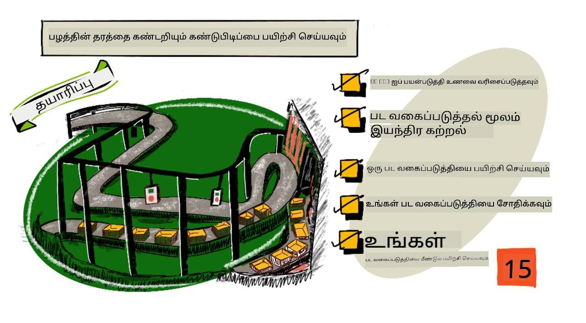
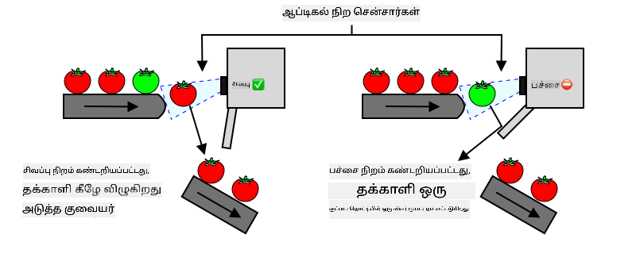
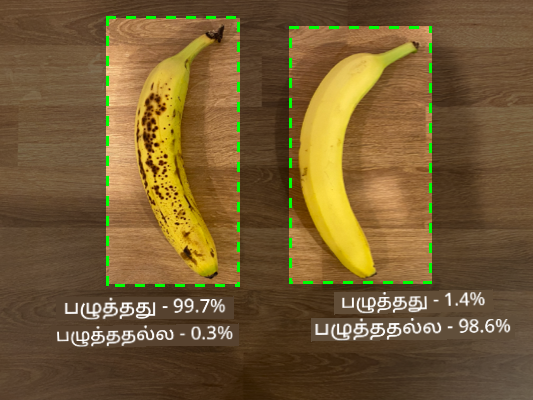
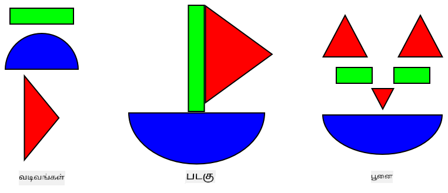
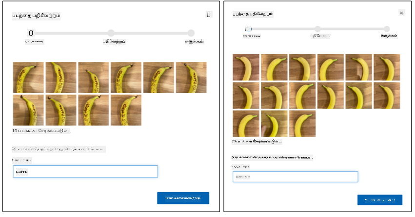
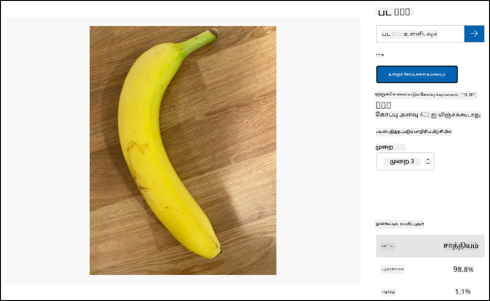

<!--
CO_OP_TRANSLATOR_METADATA:
{
  "original_hash": "f5e63c916d2dd97d58be12aaf76bd9f1",
  "translation_date": "2025-10-11T11:48:32+00:00",
  "source_file": "4-manufacturing/lessons/1-train-fruit-detector/README.md",
  "language_code": "ta"
}
-->
# பழம் தரத்தை கண்டறிய பயிற்சி



> சித்திரம்: [நித்யா நரசிம்மன்](https://github.com/nitya). பெரிய பதிப்பை பார்க்க படத்தை கிளிக் செய்யவும்.

இந்த வீடியோ Azure Custom Vision சேவையின் சுருக்கத்தை வழங்குகிறது, இது இந்த பாடத்தில் கற்றுக்கொள்ளப்படும்.

[](https://www.youtube.com/watch?v=TETcDLJlWR4)

> 🎥 மேலே உள்ள படத்தை கிளிக் செய்து வீடியோவைப் பாருங்கள்

## பாடத்திற்கு முன் கேள்வி

[பாடத்திற்கு முன் கேள்வி](https://black-meadow-040d15503.1.azurestaticapps.net/quiz/29)

## அறிமுகம்

சமீபத்தில் குத்தகை பெற்ற கலைமையான நுண்ணறிவு (AI) மற்றும் இயந்திர கற்றல் (ML) இன்று உள்ள டெவலப்பர்களுக்கு பல திறன்களை வழங்குகிறது. ML மாதிரிகள் படங்களில் பல்வேறு விஷயங்களை அடையாளம் காண பயிற்சி பெற முடியும், அதில் பழங்கள் முழுமையாக பழுத்ததா என்பதை அடையாளம் காண முடியும். இது IoT சாதனங்களில் பயன்படுத்தி, பழங்களை அறுவடை செய்யும் போது அல்லது தொழிற்சாலைகள் அல்லது கிடங்குகளில் செயலாக்கத்தின் போது வரிசைப்படுத்த உதவுகிறது.

இந்த பாடத்தில் நீங்கள் படங்களை வகைப்படுத்துவது பற்றி கற்றுக்கொள்வீர்கள் - ML மாதிரிகளைப் பயன்படுத்தி பல்வேறு விஷயங்களை அடையாளம் காண. நீங்கள் ஒரு பட வகைப்படுத்தியை பயிற்சி செய்து, நல்ல பழம் மற்றும் மோசமான பழம், முழுமையாக பழுத்ததா அல்லது பழுத்ததில்லை, காயம் அல்லது அழுகியதா என்பதை அடையாளம் காண கற்றுக்கொள்வீர்கள்.

இந்த பாடத்தில் நாம் கற்றுக்கொள்ளப் போவது:

* [AI மற்றும் ML-ஐ உணவுகளை வரிசைப்படுத்த பயன்படுத்துவது](../../../../../4-manufacturing/lessons/1-train-fruit-detector)
* [இயந்திர கற்றலின் மூலம் பட வகைப்படுத்தல்](../../../../../4-manufacturing/lessons/1-train-fruit-detector)
* [ஒரு பட வகைப்படுத்தியை பயிற்சி செய்யுங்கள்](../../../../../4-manufacturing/lessons/1-train-fruit-detector)
* [உங்கள் பட வகைப்படுத்தியை சோதிக்கவும்](../../../../../4-manufacturing/lessons/1-train-fruit-detector)
* [உங்கள் பட வகைப்படுத்தியை மீண்டும் பயிற்சி செய்யுங்கள்](../../../../../4-manufacturing/lessons/1-train-fruit-detector)

## AI மற்றும் ML-ஐ உணவுகளை வரிசைப்படுத்த பயன்படுத்துவது

உலக மக்கள் தொகையை உணவளிக்குவது கடினம், குறிப்பாக அனைவருக்கும் உணவு மலிவாக கிடைக்க வேண்டும் என்ற விலையில். மிகப்பெரிய செலவுகளில் ஒன்று தொழிலாளர்கள், எனவே விவசாயிகள் தங்கள் தொழிலாளர் செலவுகளை குறைக்க தானியங்கி மற்றும் IoT போன்ற கருவிகளை அதிகமாக பயன்படுத்துகிறார்கள். கையால் அறுவடை செய்வது கடினமான வேலை (மற்றும் பெரும்பாலும் முதுகு வலியூட்டும் வேலை), மேலும் இது குறிப்பாக பணக்கார நாடுகளில் இயந்திரங்களால் மாற்றப்படுகிறது. இயந்திரங்களைப் பயன்படுத்தி அறுவடை செய்வதில் செலவுகளைச் சேமிக்க முடிந்தாலும், ஒரு குறைபாடு உள்ளது - அறுவடை செய்யும் போது உணவுகளை வரிசைப்படுத்தும் திறன்.

அனைத்து பயிர்களும் ஒரே நேரத்தில் முழுமையாக பழுத்துவிடாது. உதாரணமாக, தக்காளி போன்ற பயிர்களில், பெரும்பாலானவை அறுவடை செய்ய தயாராக இருக்கும் போது சில பச்சை பழங்கள் இன்னும் கொடியில் இருக்கலாம். இவற்றை முன்கூட்டியே அறுவடை செய்வது வீணாக இருந்தாலும், விவசாயிக்கு இயந்திரங்களைப் பயன்படுத்தி அனைத்தையும் அறுவடை செய்து, பின்னர் முழுமையாக பழுத்தாதவற்றை அகற்றுவது மலிவாகவும் எளிதாகவும் இருக்கும்.

✅ விவசாய நிலங்களில் அல்லது உங்கள் தோட்டத்தில் வளர்ந்து கொண்டிருக்கும் அல்லது கடைகளில் உள்ள பல்வேறு பழங்கள் அல்லது காய்கறிகளைப் பாருங்கள். அவை அனைத்தும் ஒரே நிலைமையிலா, அல்லது வேறுபாடுகளை காண்கிறீர்களா?

தானியக்க அறுவடை உணவுகளை வரிசைப்படுத்தும் செயல்பாட்டை அறுவடை செய்யும் இடத்திலிருந்து தொழிற்சாலைக்கு மாற்றியது. உணவு நீண்ட கன்வேயர் பெல்ட்களில் பயணம் செய்து, தரத்திற்கேற்ப தேவையான தரத்தை பூர்த்தி செய்யாதவற்றை அகற்றும் குழுக்களால் தேர்ந்தெடுக்கப்பட்டது. இயந்திரங்களின் மூலம் அறுவடை மலிவாக இருந்தாலும், உணவுகளை கையால் வரிசைப்படுத்துவதற்கும் செலவு இருந்தது.



அடுத்த பரிணாமம் இயந்திரங்களைப் பயன்படுத்தி வரிசைப்படுத்துவது, இது அறுவடை இயந்திரத்தில் அல்லது செயலாக்க ஆலைகளில் உள்ளடக்கப்பட்டது. இந்த இயந்திரங்களின் முதல் தலைமுறை நிறங்களை கண்டறிய ஒளி சென்சார்களைப் பயன்படுத்தியது, லீவர்கள் அல்லது காற்றின் பஃப்களைப் பயன்படுத்தி பச்சை தக்காளிகளை கழிவுப்பெட்டியில் தள்ள, சிவப்பு தக்காளிகளை கன்வேயர் பெல்ட்களின் நெட்வொர்க்கில் தொடர அனுமதித்தது.

இந்த வீடியோவில், தக்காளிகள் ஒரு கன்வேயர் பெல்டிலிருந்து மற்றொன்றுக்கு விழும் போது, பச்சை தக்காளிகள் கண்டறியப்பட்டு லீவர்களால் ஒரு பெட்டியில் தள்ளப்படுகின்றன.

✅ இந்த ஒளி சென்சார்கள் சரியாக வேலை செய்ய தொழிற்சாலையில் அல்லது வயலில் எந்த நிலைமைகள் தேவைப்படும்?

இந்த வரிசைப்படுத்தும் இயந்திரங்களின் சமீபத்திய பரிணாமங்கள் AI மற்றும் ML-ஐ பயன்படுத்தி, நல்ல பழங்களை மோசமானவற்றிலிருந்து வேறுபடுத்த பயிற்சி பெற்ற மாதிரிகளைப் பயன்படுத்துகிறது, பச்சை தக்காளி மற்றும் சிவப்பு தக்காளி போன்ற தெளிவான நிற வேறுபாடுகளால் மட்டுமல்லாமல், நோய் அல்லது காயம் போன்ற நுண்ணிய தோற்ற வேறுபாடுகளால்.

## இயந்திர கற்றலின் மூலம் பட வகைப்படுத்தல்

சாதாரண நிரலாக்கம் என்பது நீங்கள் தரவை எடுத்து, தரவுக்கு ஒரு ஆல்கொரிதத்தைப் பயன்படுத்தி, வெளியீட்டை பெறுவது. உதாரணமாக, கடந்த திட்டத்தில் நீங்கள் GPS கோர்டினேட்கள் மற்றும் ஒரு ஜியோஃபென்ஸை எடுத்தீர்கள், Azure Maps வழங்கிய ஒரு ஆல்கொரிதத்தைப் பயன்படுத்தி, அந்த புள்ளி ஜியோஃபென்ஸின் உள்ளே அல்லது வெளியே உள்ளதா என்பதைப் பெறினீர்கள். நீங்கள் மேலும் தரவை உள்ளிடுகிறீர்கள், மேலும் வெளியீட்டை பெறுகிறீர்கள்.


Machine learning இதை மாற்றுகிறது - நீங்கள் தரவுடன் மற்றும் அறியப்பட்ட வெளியீடுகளுடன் தொடங்குகிறீர்கள், மேலும் machine learning ஆல்கொரிதம் தரவிலிருந்து கற்றுக்கொள்கிறது. பின்னர் நீங்கள் இந்த பயிற்சி பெற்ற ஆல்கொரிதத்தை, *machine learning model* அல்லது *model* என்று அழைக்கப்படும், எடுத்து புதிய தரவை உள்ளிடி புதிய வெளியீட்டை பெறலாம்.

> 🎓 machine learning ஆல்கொரிதம் தரவிலிருந்து கற்றுக்கொள்வது *training* என்று அழைக்கப்படுகிறது. உள்ளீடுகள் மற்றும் அறியப்பட்ட வெளியீடுகள் *training data* என்று அழைக்கப்படுகிறது.

உதாரணமாக, நீங்கள் ஒரு மாதிரிக்கு கோடிக்கணக்கான முழுமையாக பழுத்தாத வாழைப்பழங்களின் படங்களை உள்ளீட்டு பயிற்சி தரவாக வழங்கலாம், பயிற்சி வெளியீட்டை `unripe` என்று அமைத்து, மேலும் கோடிக்கணக்கான முழுமையாக பழுத்த வாழைப்பழங்களின் படங்களை `ripe` என்று அமைத்து பயிற்சி தரவாக வழங்கலாம். ML ஆல்கொரிதம் இந்த தரவின் அடிப்படையில் ஒரு மாதிரியை உருவாக்கும். பின்னர் நீங்கள் இந்த மாதிரிக்கு ஒரு புதிய வாழைப்பழத்தின் படத்தை வழங்கினால், அது புதிய படத்தில் உள்ள வாழைப்பழம் முழுமையாக பழுத்ததா அல்லது முழுமையாக பழுத்ததில்லை என்பதை கணிக்க முடியும்.

> 🎓 ML மாதிரிகளின் முடிவுகள் *predictions* என்று அழைக்கப்படுகிறது.



ML மாதிரிகள் இரட்டை முடிவுகளை வழங்காது, மாறாக சாத்தியக்கூறுகளை வழங்கும். உதாரணமாக, ஒரு மாதிரி ஒரு வாழைப்பழத்தின் படத்தை வழங்கப்பட்டு `ripe` 99.7% மற்றும் `unripe` 0.3% என்று கணிக்கலாம். உங்கள் குறியீடு சிறந்த கணிப்பைத் தேர்ந்தெடுத்து, வாழைப்பழம் முழுமையாக பழுத்தது என்று முடிவு செய்யும்.

படங்களை கண்டறிய பயன்படுத்தப்படும் ML மாதிரி *image classifier* என்று அழைக்கப்படுகிறது - இது குறிச்சொற்களுடன் கூடிய படங்களை வழங்கி, இந்த குறிச்சொற்களின் அடிப்படையில் புதிய படங்களை வகைப்படுத்துகிறது.

> 💁 இது ஒரு மிக எளிமைப்படுத்தப்பட்ட விளக்கம், மேலும் குறிச்சொற்களுடன் கூடிய வெளியீடுகள் தேவையில்லாமல் மாதிரிகளை பயிற்சி செய்ய பல்வேறு வழிகள் உள்ளன, உதாரணமாக *unsupervised learning*. ML பற்றி மேலும் அறிய விரும்பினால், [ML for beginners, Machine Learning பற்றிய 24 பாடங்களின் பாடத்திட்டத்தை](https://aka.ms/ML-beginners) பாருங்கள்.

## ஒரு பட வகைப்படுத்தியை பயிற்சி செய்யுங்கள்

ஒரு பட வகைப்படுத்தியை வெற்றிகரமாக பயிற்சி செய்ய, கோடிக்கணக்கான படங்கள் தேவை. ஆனால், கோடிக்கணக்கான அல்லது பில்லியன் கணக்கான பல்வேறு படங்களில் பயிற்சி பெற்ற ஒரு பட வகைப்படுத்தியை நீங்கள் மீண்டும் பயன்படுத்தி, ஒரு சிறிய தொகுப்பை பயன்படுத்தி மீண்டும் பயிற்சி செய்து சிறந்த முடிவுகளைப் பெறலாம், இது *transfer learning* என்று அழைக்கப்படும்.

> 🎓 Transfer learning என்பது ஒரு புதிய தரவின் அடிப்படையில் ஒரு புதிய மாதிரிக்கு ஒரு உள்ளமைந்த ML மாதிரியின் கற்றலை மாற்றுவது.

ஒரு பட வகைப்படுத்தி பல்வேறு வகையான படங்களில் பயிற்சி பெற்ற பிறகு, அதன் உள்ளமைப்புகள் வடிவங்கள், நிறங்கள் மற்றும் முறைமைகளை அடையாளம் காண சிறந்ததாக இருக்கும். Transfer learning மூலம் மாதிரி ஏற்கனவே கற்றுக்கொண்டதைப் பயன்படுத்தி புதிய படங்களை அடையாளம் காண முடியும்.



இதை குழந்தைகளின் வடிவ புத்தகங்களைப் போலவே நினைக்கலாம், ஒரு மிதவெளி, ஒரு செங்குத்து மற்றும் ஒரு முக்கோணத்தை அடையாளம் காண முடிந்தால், அவை ஒரு படகோ அல்லது ஒரு பூனையோ உருவாக்க முடியும். பட வகைப்படுத்தி வடிவங்களை அடையாளம் காண முடியும், மேலும் transfer learning மூலம் எந்த அமைப்புகள் ஒரு படகோ அல்லது ஒரு பூனையோ - அல்லது ஒரு முழுமையாக பழுத்த வாழைப்பழம் என்பதை கற்றுக்கொள்கிறது.

இதற்கான உதவியாக பல கருவிகள் உள்ளன, அதில் சில cloud-based சேவைகள் உங்கள் மாதிரியை பயிற்சி செய்ய உதவுகிறது, பின்னர் அதை web APIs மூலம் பயன்படுத்த முடியும்.

> 💁 இந்த மாதிரிகளை பயிற்சி செய்ய அதிக கணினி சக்தி தேவை, பொதுவாக Graphics Processing Units அல்லது GPUs மூலம். உங்கள் Xbox-ல் விளையாட்டுகளை அசத்தலாக காட்டும் அதே சிறப்பு ஹார்ட்வேர்கள் machine learning மாதிரிகளை பயிற்சி செய்யவும் பயன்படுத்தப்படலாம். Cloud-ஐப் பயன்படுத்துவதன் மூலம், நீங்கள் இந்த மாதிரிகளை பயிற்சி செய்ய தேவையான கணினி சக்தியை, உங்களுக்கு தேவையான நேரத்திற்கு மட்டுமே வாடகைக்கு பெறலாம்.

## Custom Vision

Custom Vision என்பது cloud-ல் அடிப்படையிலான ஒரு கருவி, இது பட வகைப்படுத்திகளை பயிற்சி செய்ய உதவுகிறது. இது குறைந்த எண்ணிக்கையிலான படங்களைப் பயன்படுத்தி ஒரு வகைப்படுத்தியை பயிற்சி செய்ய அனுமதிக்கிறது. நீங்கள் ஒரு web portal, web API அல்லது SDK மூலம் படங்களைப் பதிவேற்ற முடியும், ஒவ்வொரு படத்திற்கும் அந்த படத்தின் வகைப்படுத்தலைக் கொண்ட *tag* கொடுக்க முடியும். பின்னர் நீங்கள் மாதிரியை பயிற்சி செய்து, அது எவ்வளவு நன்றாக செயல்படுகிறது என்பதை சோதிக்கலாம். நீங்கள் மாதிரியில் திருப்தி அடைந்த பிறகு, அதை web API அல்லது SDK மூலம் அணுகக்கூடிய பதிப்புகளை வெளியிடலாம்.


> 💁 Custom Vision மாதிரியை வகைப்படுத்தல் ஒன்றுக்கு குறைந்தது 5 படங்களுடன் பயிற்சி செய்யலாம், ஆனால் அதிகமாக இருப்பது சிறந்தது. குறைந்தது 30 படங்களுடன் சிறந்த முடிவுகளைப் பெறலாம்.

Custom Vision என்பது Microsoft-இன் AI கருவிகளின் வரிசையின் ஒரு பகுதியாகும், இது Cognitive Services என்று அழைக்கப்படுகிறது. இவை AI கருவிகள், அவற்றை எந்த பயிற்சியும் இல்லாமல் அல்லது குறைந்த அளவு பயிற்சியுடன் பயன்படுத்த முடியும். இதில் பேச்சு அடையாளம் காணுதல் மற்றும் மொழிபெயர்ப்பு, மொழி புரிதல் மற்றும் படங்களை பகுப்பாய்வு ஆகியவை அடங்கும். இவை Azure-இல் இலவச நிலைமையில் கிடைக்கின்றன.

> 💁 இலவச நிலைமையானது ஒரு மாதிரியை உருவாக்க, அதை பயிற்சி செய்ய, பின்னர் அதை மேம்பாட்டு பணிக்காக பயன்படுத்துவதற்கு போதுமானது. Microsoft ஆவணங்களில் உள்ள [Custom Vision Limits and quotas பக்கம்](https://docs.microsoft.com/azure/cognitive-services/custom-vision-service/limits-and-quotas?WT.mc_id=academic-17441-jabenn) இலவச நிலைமையின் வரம்புகளைப் பற்றி படிக்கலாம்.

### பணிகள் - ஒரு cognitive services resource உருவாக்கவும்

Custom Vision-ஐ பயன்படுத்த, முதலில் Azure CLI-ஐப் பயன்படுத்தி Azure-இல் இரண்டு cognitive services resources உருவாக்க வேண்டும், ஒன்று Custom Vision training க்காக மற்றும் மற்றொன்று Custom Vision prediction க்காக.

1. இந்த திட்டத்திற்காக `fruit-quality-detector` என்ற Resource Group ஒன்றை உருவாக்கவும்.

1. இலவச Custom Vision training resource உருவாக்க கீழே உள்ள கட்டளையைப் பயன்படுத்தவும்:

    ```sh
    az cognitiveservices account create --name fruit-quality-detector-training \
                                        --resource-group fruit-quality-detector \
                                        --kind CustomVision.Training \
                                        --sku F0 \
                                        --yes \
                                        --location <location>
    ```

    `<location>` ஐ Resource Group உருவாக்கிய இடத்துடன் மாற்றவும்.

    இது உங்கள் Resource Group-இல் Custom Vision training resource ஒன்றை உருவாக்கும். இது `fruit-quality-detector-training` என்று அழைக்கப்படும் மற்றும் `F0` sku ஐப் பயன்படுத்தும், இது இலவச நிலை. `--yes` விருப்பம் cognitive services-இன் விதிமுறைகள் மற்றும் நிபந்தனைகளை நீங்கள் ஒப்புக்கொள்கிறீர்கள் என்பதைக் குறிக்கிறது.

> 💁 நீங்கள் ஏற்கனவே எந்தவொரு Cognitive Services-ஐப் பயன்படுத்த இலவச கணக்கை வைத்திருந்தால் `S0` sku ஐப் பயன்படுத்தவும்.

1. இலவச Custom Vision prediction resource உருவாக்க கீழே உள்ள கட்டளையைப் பயன்படுத்தவும்:

    ```sh
    az cognitiveservices account create --name fruit-quality-detector-prediction \
                                        --resource-group fruit-quality-detector \
                                        --kind CustomVision.Prediction \
                                        --sku F0 \
                                        --yes \
                                        --location <location>
    ```

    `<location>` ஐ Resource Group உருவாக்கிய இடத்துடன் மாற்றவும்.

    இது உங்கள் Resource Group-இல் Custom Vision prediction resource ஒன்றை உருவாக்கும். இது `fruit-quality-detector-prediction` என்று அழைக்கப்படும் மற்றும் `F0` sku ஐப் பயன்படுத்தும், இது இலவச நிலை. `--yes` விருப்பம் cognitive services-இன் விதிமுறைகள் மற்றும் நிபந்தனைகளை நீங்கள் ஒப்புக்கொள்கிறீர்கள் என்பதைக் குறிக்கிறது.

### பணிகள் - ஒரு image classifier project உருவாக்கவும்

1. [CustomVision.ai](https://customvision.ai) Custom Vision portal ஐத் தொடங்கவும், மேலும் உங்கள் Azure கணக்கிற்கான Microsoft கணக்குடன் உள்நுழையவும்.

1. Microsoft ஆவணங்களில் உள்ள [build a classifier quickstart-இன் புதிய Project பகுதியை உருவாக்க](https://docs.microsoft.com/azure/cognitive-services/custom-vision-service/getting-started-build-a-classifier?WT.mc_id=academic-17441-jabenn#create-a-new-project) பின்பற்றவும். UI மாற்றப்படலாம், மேலும் இந்த ஆவணங்கள் எப்போதும் மிகவும் புதுப்பிக்கப்பட்ட குறிப்பாக இருக்கும்.

    உங்கள் திட்டத்தை `fruit-quality-detector` என்று அழைக்கவும்.

    உங்கள் திட்டத்தை உருவாக்கும்போது, நீங்கள் முன்பு உருவாக்கிய `fruit-quality-detector-training` resource ஐப் பயன்படுத்தவும். *Classification* project வகையை, *Multiclass* classification வகையை, மற்றும் *Food* domain ஐப் பயன்படுத்தவும்.

    

✅ உங்கள் image classifier க்கான Custom Vision UI ஐ ஆராய சில நேரம் செலவிடுங்கள்.

### பணிகள் - உங்கள் image classifier project ஐ பயிற்சி செய்யுங்கள்

ஒரு image classifier ஐ பயிற்சி செய்ய, பல்வேறு தரமான பழங்களின் படங்கள் தேவை, நல்ல மற்றும் மோசமான தரத்தை குறிக்க, உதாரணமாக ஒரு முழுமையாக பழுத்த மற்றும் ஒரு முழுமையாக பழுத்ததல்லாத வாழைப்பழம்.

> 💁 இந்த வகைப்படுத்திகள் எந்தவொரு விஷயங்களின் படங்களையும் வகைப்படுத்த முடியும், என
> 💁 ஒவ்வொரு குறிச்சொல்லுக்கும் வகைப்படுத்தப்படும் பொருளுடன் தொடர்பில்லாத குறிப்பிட்ட பின்னணிகள் அல்லது குறிப்பிட்ட பொருட்கள் இருக்கக்கூடாது. இல்லையெனில் வகைப்படுத்தி பின்னணியை அடிப்படையாகக் கொண்டு வகைப்படுத்தலாம். ஒரு சருமப் புற்றுநோய் வகைப்படுத்தி இருந்தது, இது சாதாரண மற்றும் புற்றுநோய்க்கான மச்சங்களைப் பயிற்சி செய்தது, ஆனால் புற்றுநோய்க்கான மச்சங்கள் அனைத்தும் ruler-களுடன் இருந்தன, அளவைக் கணக்கிடுவதற்காக. இறுதியில், அந்த வகைப்படுத்தி ruler-களை அடையாளம் காண 100% சரியாக இருந்தது, புற்றுநோய்க்கான மச்சங்களை அல்ல.

பட வகைப்படுத்திகள் மிகவும் குறைந்த தீர்மானத்தில் இயங்குகின்றன. உதாரணமாக Custom Vision 10240x10240 வரை பயிற்சி மற்றும் கணிப்பு படங்களை எடுத்துக்கொள்ள முடியும், ஆனால் 227x227 அளவில் படங்களைப் பயிற்சி செய்து மாடலை இயக்குகிறது. பெரிய படங்கள் இந்த அளவுக்கு சுருக்கப்படும், எனவே நீங்கள் வகைப்படுத்தும் பொருள் படத்தில் பெரிய பகுதியை எடுத்துக்கொள்ள வேண்டும், இல்லையெனில் அது வகைப்படுத்தி பயன்படுத்தும் சிறிய படத்தில் மிகவும் சிறியதாக இருக்கலாம்.

1. உங்கள் வகைப்படுத்திக்கான படங்களைச் சேகரிக்கவும். ஒவ்வொரு குறிச்சொல்லுக்கும் வகைப்படுத்தியைப் பயிற்சி செய்ய குறைந்தபட்சம் 5 படங்கள் தேவைப்படும், ஆனால் அதிகமாக இருந்தால் நல்லது. வகைப்படுத்தியைச் சோதிக்க கூடுதல் சில படங்களும் தேவைப்படும். இந்த படங்கள் அனைத்தும் ஒரே பொருளின் வெவ்வேறு படங்களாக இருக்க வேண்டும். உதாரணமாக:

    * 2 பழுத்த வாழைப்பழங்களைப் பயன்படுத்தி, ஒவ்வொன்றையும் வெவ்வேறு கோணங்களில் சில படங்களை எடுக்கவும், குறைந்தபட்சம் 7 படங்கள் (5 பயிற்சிக்காக, 2 சோதிக்க), ஆனால் அதிகமாக இருந்தால் நல்லது.

        

    * 2 பழுத்தாத வாழைப்பழங்களுடன் இதே செயல்முறையை மீண்டும் செய்யவும்.

    நீங்கள் குறைந்தபட்சம் 10 பயிற்சி படங்களை, குறைந்தபட்சம் 5 பழுத்த மற்றும் 5 பழுத்தாத, மற்றும் 4 சோதனை படங்களை, 2 பழுத்த, 2 பழுத்தாத, வைத்திருக்க வேண்டும். உங்கள் படங்கள் png அல்லது jpeg வடிவில், 6MB-க்கு குறைவாக இருக்க வேண்டும். உதாரணமாக, நீங்கள் iPhone-இல் உருவாக்கினால், அவை உயர் தீர்மான HEIC படங்களாக இருக்கலாம், எனவே அவற்றை மாற்றி சுருக்க வேண்டும். அதிக படங்கள் இருந்தால் நல்லது, மேலும் பழுத்த மற்றும் பழுத்தாதவற்றின் எண்ணிக்கை சமமாக இருக்க வேண்டும்.

    நீங்கள் பழுத்த மற்றும் பழுத்தாத பழங்களை இரண்டையும் இல்லாமல் இருந்தால், நீங்கள் வெவ்வேறு பழங்களை அல்லது உங்களிடம் உள்ள எந்த இரண்டு பொருட்களையும் பயன்படுத்தலாம். நீங்கள் [images](../../../../../4-manufacturing/lessons/1-train-fruit-detector/images) கோப்பகத்தில் உள்ள பழுத்த மற்றும் பழுத்தாத வாழைப்பழங்களின் உதாரண படங்களைப் பயன்படுத்தலாம்.

1. [Microsoft docs-இல் build a classifier quickstart-இன் upload and tag images பகுதியை](https://docs.microsoft.com/azure/cognitive-services/custom-vision-service/getting-started-build-a-classifier?WT.mc_id=academic-17441-jabenn#upload-and-tag-images) பின்பற்றி உங்கள் பயிற்சி படங்களைப் பதிவேற்றவும். பழுத்த பழங்களை `ripe` என குறிக்கவும், மற்றும் பழுத்தாத பழங்களை `unripe` என குறிக்கவும்.

    

1. [Microsoft docs-இல் build a classifier quickstart-இன் train the classifier பகுதியை](https://docs.microsoft.com/azure/cognitive-services/custom-vision-service/getting-started-build-a-classifier?WT.mc_id=academic-17441-jabenn#train-the-classifier) பின்பற்றி உங்கள் பதிவேற்றப்பட்ட படங்களில் பட வகைப்படுத்தியைப் பயிற்சி செய்யவும்.

    உங்களுக்கு பயிற்சி வகையைத் தேர்ந்தெடுக்க ஒரு விருப்பம் வழங்கப்படும். **Quick Training** ஐத் தேர்ந்தெடுக்கவும்.

வகைப்படுத்தி பின்னர் பயிற்சி செய்யும். பயிற்சி முடிவடைய சில நிமிடங்கள் ஆகும்.

> 🍌 நீங்கள் வகைப்படுத்தியைப் பயிற்சி செய்யும் போது உங்கள் பழங்களை சாப்பிட முடிவு செய்தால், முதலில் சோதிக்க போதுமான படங்கள் உள்ளதா என்பதை உறுதிப்படுத்தவும்!

## உங்கள் பட வகைப்படுத்தியைச் சோதிக்கவும்

உங்கள் வகைப்படுத்தி பயிற்சி முடிந்தவுடன், புதிய படத்தை வகைப்படுத்துவதற்காக அதைச் சோதிக்கலாம்.

### பணிகள் - உங்கள் பட வகைப்படுத்தியைச் சோதிக்கவும்

1. [Microsoft docs-இல் test your model documentation](https://docs.microsoft.com/azure/cognitive-services/custom-vision-service/test-your-model?WT.mc_id=academic-17441-jabenn#test-your-model) ஐப் பின்பற்றி உங்கள் பட வகைப்படுத்தியைச் சோதிக்கவும். நீங்கள் முன்பே உருவாக்கிய சோதனை படங்களைப் பயன்படுத்தவும், பயிற்சிக்க பயன்படுத்திய எந்த படங்களையும் பயன்படுத்த வேண்டாம்.

    

1. உங்களிடம் உள்ள அனைத்து சோதனை படங்களையும் முயற்சிக்கவும் மற்றும் சாத்தியங்களை கவனிக்கவும்.

## உங்கள் பட வகைப்படுத்தியை மீண்டும் பயிற்சி செய்யவும்

நீங்கள் உங்கள் வகைப்படுத்தியைச் சோதிக்கும்போது, அது நீங்கள் எதிர்பார்த்த முடிவுகளை வழங்காமல் இருக்கலாம். பட வகைப்படுத்திகள் ஒரு படத்தில் என்ன இருக்கிறது என்பதைப் பற்றிய கணிப்புகளை, ஒரு குறிப்பிட்ட குறிச்சொல்லுடன் பொருந்தும் படத்தின் குறிப்பிட்ட அம்சங்கள் சாத்தியமாக உள்ளன என்பதின் அடிப்படையில் செய்கின்றன. அது படத்தில் என்ன இருக்கிறது என்பதைப் புரிந்துகொள்ளாது - அது வாழைப்பழம் என்ன அல்லது ஒரு வாழைப்பழத்தை படகாக மாறாமல் என்ன செய்கிறது என்பதைப் புரிந்துகொள்ளாது. அது தவறாக பெறும் படங்களுடன் மீண்டும் பயிற்சி செய்வதன் மூலம் உங்கள் வகைப்படுத்தியை மேம்படுத்தலாம்.

ஒவ்வொரு முறையும் நீங்கள் quick test விருப்பத்தைப் பயன்படுத்தி ஒரு கணிப்பைச் செய்யும் போது, படம் மற்றும் முடிவுகள் சேமிக்கப்படும். இந்த படங்களை உங்கள் மாடலை மீண்டும் பயிற்சி செய்ய பயன்படுத்தலாம்.

### பணிகள் - உங்கள் பட வகைப்படுத்தியை மீண்டும் பயிற்சி செய்யவும்

1. [Microsoft docs-இல் use the predicted image for training documentation](https://docs.microsoft.com/azure/cognitive-services/custom-vision-service/test-your-model?WT.mc_id=academic-17441-jabenn#use-the-predicted-image-for-training) ஐப் பின்பற்றி உங்கள் மாடலை மீண்டும் பயிற்சி செய்யவும், ஒவ்வொரு படத்திற்கும் சரியான குறிச்சொல்லைப் பயன்படுத்தவும்.

1. உங்கள் மாடல் மீண்டும் பயிற்சி செய்யப்பட்டதும், புதிய படங்களில் சோதிக்கவும்.

---

## 🚀 சவால்

நீங்கள் வாழைப்பழங்களில் பயிற்சி செய்யப்பட்ட மாடலுடன் ஸ்ட்ராபெரி படம் அல்லது ஒரு காற்று நிரப்பப்பட்ட வாழைப்பழம், அல்லது வாழைப்பழ உடையில் ஒரு மனிதர், அல்லது Simpsons போன்ற மஞ்சள் கார்ட்டூன் கதாபாத்திரம் போன்றவற்றைப் பயன்படுத்தினால் என்ன நடக்கும் என்று நீங்கள் நினைக்கிறீர்கள்?

முயற்சி செய்து கணிப்புகளைப் பாருங்கள். [Bing Image search](https://www.bing.com/images/trending) ஐப் பயன்படுத்தி முயற்சிக்க படங்களைப் பெறலாம்.

## பாடத்திற்குப் பிந்தைய வினாடி வினா

[பாடத்திற்குப் பிந்தைய வினாடி வினா](https://black-meadow-040d15503.1.azurestaticapps.net/quiz/30)

## மதிப்பீடு மற்றும் சுயபயிற்சி

* நீங்கள் உங்கள் வகைப்படுத்தியைப் பயிற்சி செய்தபோது, *Precision*, *Recall*, மற்றும் *AP* ஆகிய மதிப்புகளைப் பார்த்திருப்பீர்கள், இது உருவாக்கப்பட்ட மாடலை மதிப்பீடு செய்கிறது. [Microsoft docs-இல் build a classifier quickstart-இன் evaluate the classifier பகுதியை](https://docs.microsoft.com/azure/cognitive-services/custom-vision-service/getting-started-build-a-classifier?WT.mc_id=academic-17441-jabenn#evaluate-the-classifier) பயன்படுத்தி இந்த மதிப்புகள் என்ன என்பதைப் படிக்கவும்.
* [Microsoft docs-இல் how to improve your Custom Vision model](https://docs.microsoft.com/azure/cognitive-services/custom-vision-service/getting-started-improving-your-classifier?WT.mc_id=academic-17441-jabenn) ஐப் பயன்படுத்தி உங்கள் வகைப்படுத்தியை மேம்படுத்துவது எப்படி என்பதைப் படிக்கவும்.

## பணிகள்

[பல பழங்கள் மற்றும் காய்கறிகளுக்கான உங்கள் வகைப்படுத்தியைப் பயிற்சி செய்யவும்](assignment.md)

---

**அறிவிப்பு**:  
இந்த ஆவணம் [Co-op Translator](https://github.com/Azure/co-op-translator) என்ற AI மொழிபெயர்ப்பு சேவையை பயன்படுத்தி மொழிபெயர்க்கப்பட்டுள்ளது. நாங்கள் துல்லியத்திற்காக முயற்சிக்கிறோம், ஆனால் தானியங்கி மொழிபெயர்ப்புகளில் பிழைகள் அல்லது தவறுகள் இருக்கக்கூடும் என்பதை கவனத்தில் கொள்ளவும். அதன் சொந்த மொழியில் உள்ள மூல ஆவணம் அதிகாரப்பூர்வ ஆதாரமாக கருதப்பட வேண்டும். முக்கியமான தகவல்களுக்கு, தொழில்முறை மனித மொழிபெயர்ப்பு பரிந்துரைக்கப்படுகிறது. இந்த மொழிபெயர்ப்பைப் பயன்படுத்துவதால் ஏற்படும் எந்த தவறான புரிதல்களுக்கும் அல்லது தவறான விளக்கங்களுக்கும் நாங்கள் பொறுப்பல்ல.