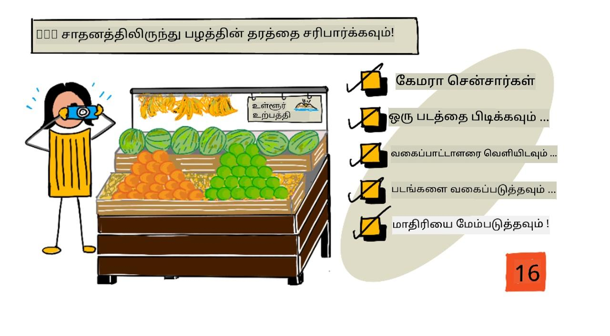
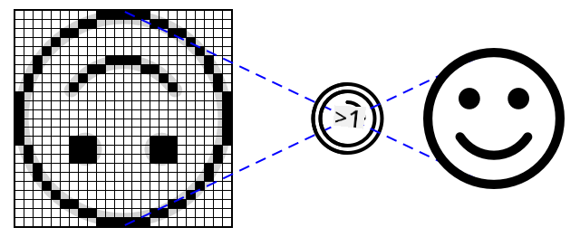
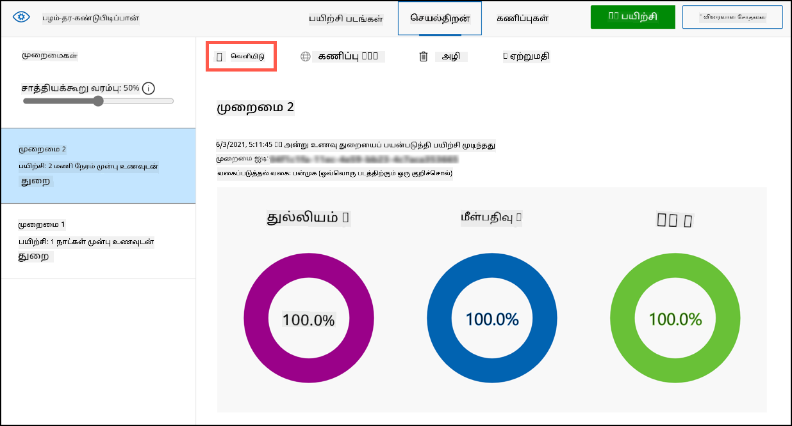
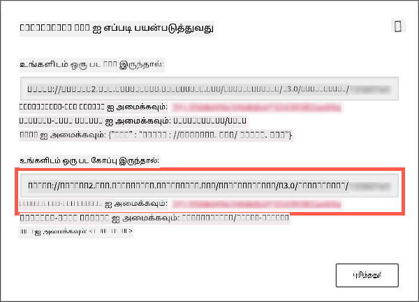

<!--
CO_OP_TRANSLATOR_METADATA:
{
  "original_hash": "557f4ee96b752e0651d2e6e74aa6bd14",
  "translation_date": "2025-10-11T11:46:21+00:00",
  "source_file": "4-manufacturing/lessons/2-check-fruit-from-device/README.md",
  "language_code": "ta"
}
-->
# IoT சாதனத்திலிருந்து பழத்தின் தரத்தை சரிபார்க்கவும்



> ஸ்கெட்ச் நோட்: [நித்யா நரசிம்மன்](https://github.com/nitya). படத்தை கிளிக் செய்து பெரிய பதிப்பைப் பாருங்கள்.

## பாடத்திற்கு முன் வினாடி வினா

[பாடத்திற்கு முன் வினாடி வினா](https://black-meadow-040d15503.1.azurestaticapps.net/quiz/31)

## அறிமுகம்

கடந்த பாடத்தில் நீங்கள் படங்களின் வகைப்பாட்டாளர்களைப் பற்றி கற்றீர்கள், மேலும் அவற்றை நல்ல மற்றும் கெட்ட பழங்களை கண்டறிய பயிற்சி செய்யும் முறையை கற்றீர்கள். இந்த பட வகைப்பாட்டாளரை IoT பயன்பாட்டில் பயன்படுத்த, நீங்கள் ஒரு வகையான கேமராவைப் பயன்படுத்தி படத்தைப் பிடிக்க வேண்டும், மேலும் இந்த படத்தை வகைப்படுத்துவதற்காக கிளவுடுக்கு அனுப்ப வேண்டும்.

இந்த பாடத்தில், கேமரா சென்சார்கள் மற்றும் IoT சாதனத்துடன் அவற்றைப் பயன்படுத்தி படத்தை எடுப்பது எப்படி என்பதை நீங்கள் கற்றுக்கொள்வீர்கள். மேலும் IoT சாதனத்திலிருந்து பட வகைப்பாட்டாளரை அழைப்பது எப்படி என்பதை கற்றுக்கொள்வீர்கள்.

இந்த பாடத்தில் நாம் கவரும் தலைப்புகள்:

* [கேமரா சென்சார்கள்](../../../../../4-manufacturing/lessons/2-check-fruit-from-device)
* [IoT சாதனத்தைப் பயன்படுத்தி படத்தை எடுப்பது](../../../../../4-manufacturing/lessons/2-check-fruit-from-device)
* [உங்கள் பட வகைப்பாட்டாளரை வெளியிடுங்கள்](../../../../../4-manufacturing/lessons/2-check-fruit-from-device)
* [IoT சாதனத்திலிருந்து படங்களை வகைப்படுத்துங்கள்](../../../../../4-manufacturing/lessons/2-check-fruit-from-device)
* [மாதிரியை மேம்படுத்துங்கள்](../../../../../4-manufacturing/lessons/2-check-fruit-from-device)

## கேமரா சென்சார்கள்

கேமரா சென்சார்கள் என்பது IoT சாதனத்துடன் இணைக்கக்கூடிய கேமராக்கள். இவை நிலையான படங்களை எடுக்கவோ அல்லது வீடியோ ஸ்ட்ரீமிங்கை பிடிக்கவோ பயன்படுகின்றன. சில கேமராக்கள் மூலப்பட தரவுகளை திருப்பி அனுப்பும், மற்றவை JPEG அல்லது PNG போன்ற படக் கோப்புகளாக பட தரவுகளை சுருக்கி அனுப்பும். IoT சாதனங்களுடன் வேலை செய்யும் கேமராக்கள் பொதுவாக சிறிய மற்றும் குறைந்த தீர்மானத்துடன் இருக்கும், ஆனால் நீங்கள் உயர் தீர்மான கேமராக்களைப் பெறலாம், அவை சிறந்த தொலைபேசிகளுக்கு இணையாக இருக்கும். மாற்றக்கூடிய லென்ஸ்கள், பல கேமரா அமைப்புகள், இன்ஃப்ரா-ரெட் வெப்ப கேமராக்கள் அல்லது UV கேமராக்கள் போன்றவை கிடைக்கின்றன.



பொதுவாக கேமரா சென்சார்கள் ஒவ்வொரு பிக்சலிலும் ஒரு ஃபோட்டோடைட் உள்ள பட சென்சார்களைப் பயன்படுத்துகின்றன. ஒரு லென்ஸ் படத்தை பட சென்சாரில் மையமாக்குகிறது, மேலும் ஆயிரக்கணக்கான அல்லது கோடிக்கணக்கான ஃபோட்டோடைட்கள் ஒவ்வொன்றிலும் விழும் வெளிச்சத்தை கண்டறிந்து அதை பிக்சல் தரவாக பதிவு செய்கின்றன.

> 💁 லென்ஸ்கள் படங்களை தலைகீழாக மாற்றுகின்றன, கேமரா சென்சார் பின்னர் படத்தை சரியான வழியில் திருப்புகிறது. இது உங்கள் கண்களில் கூட அதே மாதிரியே உள்ளது - நீங்கள் காணும் விஷயம் உங்கள் கண்களின் பின்புறத்தில் தலைகீழாக கண்டறியப்படுகிறது, மேலும் உங்கள் மூளை அதை சரிசெய்கிறது.

> 🎓 பட சென்சார் "ஆக்டிவ்-பிக்சல் சென்சார்" (APS) என்று அழைக்கப்படுகிறது, மேலும் APS இன் மிகவும் பிரபலமான வகை "காம்ப்ளிமென்டரி மெட்டல்-ஆக்சைடு செமிகண்டக்டர் சென்சார்" அல்லது CMOS ஆகும். கேமரா சென்சார்களுக்கு "CMOS சென்சார்" என்ற சொல்லை நீங்கள் கேள்விப்பட்டிருக்கலாம்.

கேமரா சென்சார்கள் டிஜிட்டல் சென்சார்கள், டிஜிட்டல் தரவாக பட தரவுகளை அனுப்புகின்றன, பொதுவாக தொடர்பு வழங்கும் ஒரு நூலகத்தின் உதவியுடன். கேமராக்கள் SPI போன்ற நெறிமுறைகளைப் பயன்படுத்தி பெரிய அளவிலான தரவுகளை அனுப்ப இணைக்கின்றன - ஒரு வெப்பநிலை சென்சார் போன்ற சென்சாரிலிருந்து ஒரு எண் அளவிலான தரவுகளை விட படங்கள் மிகவும் பெரியவை.

✅ IoT சாதனங்களின் பட அளவின் வரம்புகள் என்ன? குறிப்பாக மைக்ரோகண்ட்ரோலர் ஹார்ட்வேரில் உள்ள கட்டுப்பாடுகளைப் பற்றி சிந்தியுங்கள்.

## IoT சாதனத்தைப் பயன்படுத்தி படத்தை எடுப்பது

உங்கள் IoT சாதனத்தைப் பயன்படுத்தி வகைப்படுத்தப்பட வேண்டிய படத்தை எடுக்கலாம்.

### பணிகள் - IoT சாதனத்தைப் பயன்படுத்தி படத்தை எடுப்பது

உங்கள் IoT சாதனத்தைப் பயன்படுத்தி படத்தை எடுப்பதற்கான தொடர்புடைய வழிகாட்டுதலைப் பின்பற்றுங்கள்:

* [Arduino - Wio Terminal](wio-terminal-camera.md)
* [Single-board computer - Raspberry Pi](pi-camera.md)
* [Single-board computer - Virtual device](virtual-device-camera.md)

## உங்கள் பட வகைப்பாட்டாளரை வெளியிடுங்கள்

கடந்த பாடத்தில் நீங்கள் உங்கள் பட வகைப்பாட்டாளரை பயிற்சி செய்தீர்கள். உங்கள் IoT சாதனத்திலிருந்து அதை பயன்படுத்துவதற்கு முன், நீங்கள் மாதிரியை வெளியிட வேண்டும்.

### மாதிரி திருத்தங்கள்

கடந்த பாடத்தில் உங்கள் மாதிரி பயிற்சி செய்யும்போது, **Performance** தாவலில் பக்கத்தில் திருத்தங்கள் காண்பிக்கப்படுவதை நீங்கள் கவனித்திருக்கலாம். முதலில் மாதிரியை பயிற்சி செய்தபோது, *Iteration 1* பயிற்சியில் இருந்தது. கணிப்பிடப்படுத்தப்பட்ட படங்களைப் பயன்படுத்தி மாதிரியை மேம்படுத்தியபோது, *Iteration 2* பயிற்சியில் இருந்தது.

ஒவ்வொரு முறையும் நீங்கள் மாதிரியை பயிற்சி செய்தால், ஒரு புதிய திருத்தம் கிடைக்கும். இது வெவ்வேறு தரவுத்தொகுப்புகளில் பயிற்சி செய்யப்பட்ட உங்கள் மாதிரியின் வெவ்வேறு பதிப்புகளை கண்காணிக்க உதவும். **Quick Test** செய்யும்போது, ஒரு டிராப்-டவுன் உங்களுக்குக் கிடைக்கும், இது மூலம் பல திருத்தங்களின் முடிவுகளை ஒப்பிடலாம்.

ஒரு திருத்தத்தில் நீங்கள் திருப்தி அடைந்தால், அதை வெளியிட்டு வெளிப்புற பயன்பாடுகளால் பயன்படுத்தப்படுவதற்குத் தயாராக்கலாம். இவ்வாறு, உங்கள் சாதனங்கள் பயன்படுத்தும் வெளியிடப்பட்ட பதிப்பு இருக்கும், பின்னர் புதிய பதிப்பில் பல திருத்தங்களைச் செய்து வேலை செய்யலாம், பின்னர் அதில் திருப்தி அடைந்த பிறகு அதை வெளியிடலாம்.

### பணிகள் - ஒரு திருத்தத்தை வெளியிடுங்கள்

Custom Vision போர்ட்டலிலிருந்து திருத்தங்கள் வெளியிடப்படுகின்றன.

1. [CustomVision.ai](https://customvision.ai) போர்ட்டலைத் தொடங்குங்கள் மற்றும் உள்நுழையுங்கள். உங்கள் `fruit-quality-detector` திட்டத்தைத் திறக்கவும்.

1. மேலே உள்ள விருப்பங்களில் **Performance** தாவலைத் தேர்ந்தெடுக்கவும்.

1. பக்கத்தில் உள்ள *Iterations* பட்டியலில் இருந்து சமீபத்திய திருத்தத்தைத் தேர்ந்தெடுக்கவும்.

1. அந்த திருத்தத்திற்கான **Publish** பொத்தானைத் தேர்ந்தெடுக்கவும்.

    

1. *Publish Model* உரையாடல் பெட்டியில், *Prediction resource* ஐ நீங்கள் கடந்த பாடத்தில் உருவாக்கிய `fruit-quality-detector-prediction` வளமாக அமைக்கவும். பெயரை `Iteration2` ஆகவே விட்டு, **Publish** பொத்தானைத் தேர்ந்தெடுக்கவும்.

1. வெளியிடப்பட்ட பிறகு, **Prediction URL** பொத்தானைத் தேர்ந்தெடுக்கவும். இது கணிப்பு API விவரங்களை காட்டும், மேலும் உங்கள் IoT சாதனத்திலிருந்து மாதிரியை அழைக்க நீங்கள் இதைத் தேவைப்படும். கீழே உள்ள பகுதி *If you have an image file* என்று லேபிள் செய்யப்பட்டுள்ளது, இது நீங்கள் தேவைப்படும் விவரங்கள். URL ஐ நகலெடுக்கவும், இது கீழே உள்ள மாதிரியானதாக இருக்கும்:

    ```output
    https://<location>.api.cognitive.microsoft.com/customvision/v3.0/Prediction/<id>/classify/iterations/Iteration2/image
    ```

    இதில் `<location>` நீங்கள் உங்கள் Custom Vision வளத்தை உருவாக்கிய இடமாக இருக்கும், மேலும் `<id>` எழுத்துகள் மற்றும் எண்களால் ஆன நீண்ட ID ஆக இருக்கும்.

    *Prediction-Key* மதிப்பையும் நகலெடுக்கவும். இது ஒரு பாதுகாப்பான விசை, நீங்கள் மாதிரியை அழைக்கும் போது இதை அனுப்ப வேண்டும். இந்த விசையை அனுப்பும் பயன்பாடுகள் மட்டுமே மாதிரியைப் பயன்படுத்த அனுமதிக்கப்படும், மற்ற பயன்பாடுகள் நிராகரிக்கப்படும்.

    

✅ ஒரு புதிய திருத்தம் வெளியிடப்பட்டால், அதற்கு ஒரு வேறுபட்ட பெயர் இருக்கும். IoT சாதனம் எந்த திருத்தத்தைப் பயன்படுத்துகிறது என்பதை நீங்கள் எப்படி மாற்றுவீர்கள்?

## IoT சாதனத்திலிருந்து படங்களை வகைப்படுத்துங்கள்

இப்போது இந்த இணைப்பு விவரங்களைப் பயன்படுத்தி IoT சாதனத்திலிருந்து பட வகைப்பாட்டாளரை அழைக்கலாம்.

### பணிகள் - IoT சாதனத்திலிருந்து படங்களை வகைப்படுத்துங்கள்

உங்கள் IoT சாதனத்தைப் பயன்படுத்தி படங்களை வகைப்படுத்துவதற்கான தொடர்புடைய வழிகாட்டுதலைப் பின்பற்றுங்கள்:

* [Arduino - Wio Terminal](wio-terminal-classify-image.md)
* [Single-board computer - Raspberry Pi/Virtual IoT device](single-board-computer-classify-image.md)

## மாதிரியை மேம்படுத்துங்கள்

IoT சாதனத்துடன் இணைக்கப்பட்ட கேமராவைப் பயன்படுத்தும்போது நீங்கள் பெறும் முடிவுகள் நீங்கள் எதிர்பார்க்கும் அளவுக்கு பொருந்தாது என்று நீங்கள் காணலாம். கணிப்புகள் உங்கள் கணினியில் இருந்து பதிவேற்றப்பட்ட படங்களைப் பயன்படுத்துவதில் உள்ள துல்லியத்துடன் ஒப்பிடும்போது சரியாக இருக்காது. இது மாதிரி பயிற்சி செய்யப்பட்ட தரவுகள் மற்றும் கணிப்புகளுக்கு பயன்படுத்தப்படும் தரவுகள் வேறுபடுவதால் ஏற்படுகிறது.

சிறந்த முடிவுகளைப் பெற, கணிப்புகளுக்கு பயன்படுத்தப்படும் படங்களுடன் மிகவும் ஒத்த படங்களைப் பயன்படுத்தி மாதிரியை பயிற்சி செய்ய வேண்டும். உதாரணமாக, உங்கள் போன் கேமராவைப் பயன்படுத்தி பயிற்சிக்கான படங்களைப் பிடித்திருந்தால், படத்தின் தரம், தெளிவு மற்றும் நிறம் IoT சாதனத்துடன் இணைக்கப்பட்ட கேமராவுக்கு மாறுபடும்.


மேலே உள்ள படத்தில், இடது பக்கம் Raspberry Pi கேமராவைப் பயன்படுத்தி எடுக்கப்பட்டது, வலது பக்கம் அதே வாழைப்பழத்தை அதே இடத்தில் iPhone பயன்படுத்தி எடுக்கப்பட்டது. தரத்தில் குறிப்பிடத்தக்க வேறுபாடு உள்ளது - iPhone படம் தெளிவாகவும், பிரகாசமான நிறங்களுடன் மற்றும் அதிக மாறுபாட்டுடன் உள்ளது.

✅ IoT சாதனம் பிடிக்கும் படங்கள் தவறான கணிப்புகளை வழங்குவதற்கு இன்னும் என்ன காரணமாக இருக்கலாம்? IoT சாதனம் பயன்படுத்தப்படும் சூழலைப் பற்றி சிந்தியுங்கள், படத்தைப் பிடிக்க எந்த காரணிகள் பாதிக்கலாம்?

மாதிரியை மேம்படுத்த, IoT சாதனத்திலிருந்து பிடிக்கப்பட்ட படங்களைப் பயன்படுத்தி அதை மீண்டும் பயிற்சி செய்யலாம்.

### பணிகள் - மாதிரியை மேம்படுத்துங்கள்

1. உங்கள் IoT சாதனத்தைப் பயன்படுத்தி பல பழங்களின் (முதிர்ந்த மற்றும் முதிராத) படங்களை வகைப்படுத்துங்கள்.

1. Custom Vision போர்ட்டலில், *Predictions* தாவலில் உள்ள படங்களைப் பயன்படுத்தி மாதிரியை மீண்டும் பயிற்சி செய்யுங்கள்.

    > ⚠️ [முதல் பாடத்தில் உங்கள் வகைப்பாட்டாளரை மீண்டும் பயிற்சி செய்யும் வழிமுறைகளைப் பார்க்கலாம்](../1-train-fruit-detector/README.md#retrain-your-image-classifier).

1. உங்கள் படங்கள் முதலில் பயிற்சி செய்ய பயன்படுத்திய படங்களுடன் மிகவும் வேறுபட்டதாக இருந்தால், *Training Images* தாவலில் உள்ள அனைத்து முதன்மை படங்களையும் தேர்ந்தெடுத்து **Delete** பொத்தானைத் தேர்ந்தெடுத்து அழிக்கலாம். ஒரு படத்தைத் தேர்ந்தெடுக்க, உங்கள் கருவியை அதன் மீது நகர்த்தவும், ஒரு டிக் தோன்றும், அந்த டிக்கை தேர்ந்தெடுக்க அல்லது தேர்வு செய்யாமல் விடவும்.

1. மாதிரியின் புதிய திருத்தத்தை பயிற்சி செய்து, மேலே உள்ள படிகள் மூலம் அதை வெளியிடுங்கள்.

1. உங்கள் குறியீட்டில் உள்ள endpoint URL ஐ புதுப்பித்து, பயன்பாட்டை மீண்டும் இயக்குங்கள்.

1. கணிப்புகளின் முடிவுகளில் திருப்தி அடையும் வரை இந்த படிகளை மீண்டும் செய்யுங்கள்.

---

## 🚀 சவால்

படத்தின் தீர்மானம் அல்லது வெளிச்சம் கணிப்பில் எவ்வளவு பாதிப்பை ஏற்படுத்துகிறது?

உங்கள் சாதன குறியீட்டில் படங்களின் தீர்மானத்தை மாற்றி, படங்களின் தரத்தில் மாற்றம் ஏற்படுகிறதா என்பதைப் பாருங்கள். மேலும் வெளிச்சத்தை மாற்றி முயற்சிக்கவும்.

நீங்கள் பண்ணைகள் அல்லது தொழிற்சாலைகளுக்கு விற்க ஒரு உற்பத்தி சாதனத்தை உருவாக்கினால், அது எப்போதும் நிலையான முடிவுகளை வழங்குவதற்காக நீங்கள் எப்படி உறுதிசெய்வீர்கள்?

## பாடத்திற்கு பின் வினாடி வினா

[பாடத்திற்கு பின் வினாடி வினா](https://black-meadow-040d15503.1.azurestaticapps.net/quiz/32)

## மதிப்பீடு மற்றும் சுயபயிற்சி

நீங்கள் Custom Vision போர்ட்டல் பயன்படுத்தி உங்கள் மாதிரியை பயிற்சி செய்தீர்கள். இது படங்கள் கிடைப்பதை நம்புகிறது - மற்றும் உண்மையான உலகில் உங்கள் சாதனத்தின் கேமரா பிடிக்கும் படங்களைப் பொருந்தும் பயிற்சி தரவுகளைப் பெற முடியாது. IoT சாதனத்திலிருந்து பிடிக்கப்பட்ட படங்களைப் பயன்படுத்தி ஒரு மாதிரியை பயிற்சி செய்ய, பயிற்சி API ஐ நேரடியாக உங்கள் சாதனத்திலிருந்து பயிற்சி செய்ய பயன்படுத்தலாம்.

* [Custom Vision SDK விரைவான தொடக்க வழிகாட்டுதலில்](https://docs.microsoft.com/azure/cognitive-services/custom-vision-service/quickstarts/image-classification?WT.mc_id=academic-17441-jabenn&tabs=visual-studio&pivots=programming-language-python) பயிற்சி API பற்றி படிக்கவும்.

## பணிக்கட்டளை

[கணிப்பு முடிவுகளுக்கு பதிலளிக்கவும்](assignment.md)

---

**அறிவிப்பு**:  
இந்த ஆவணம் [Co-op Translator](https://github.com/Azure/co-op-translator) என்ற AI மொழிபெயர்ப்பு சேவையை பயன்படுத்தி மொழிபெயர்க்கப்பட்டுள்ளது. நாங்கள் துல்லியத்திற்காக முயற்சிக்கிறோம், ஆனால் தானியங்கி மொழிபெயர்ப்புகளில் பிழைகள் அல்லது தவறுகள் இருக்கக்கூடும் என்பதை கவனத்தில் கொள்ளவும். அதன் சொந்த மொழியில் உள்ள மூல ஆவணம் அதிகாரப்பூர்வ ஆதாரமாக கருதப்பட வேண்டும். முக்கியமான தகவல்களுக்கு, தொழில்முறை மனித மொழிபெயர்ப்பு பரிந்துரைக்கப்படுகிறது. இந்த மொழிபெயர்ப்பைப் பயன்படுத்துவதால் ஏற்படும் எந்த தவறான புரிதல்களுக்கும் அல்லது தவறான விளக்கங்களுக்கும் நாங்கள் பொறுப்பல்ல.