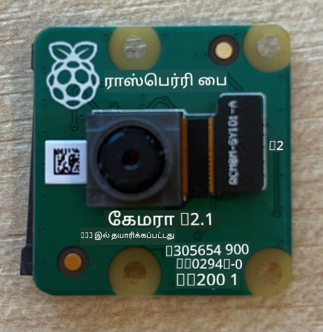
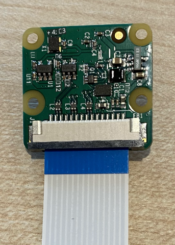
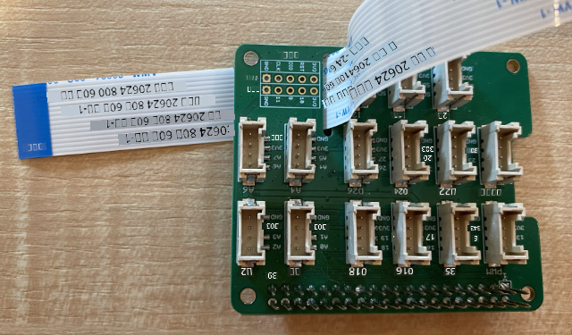
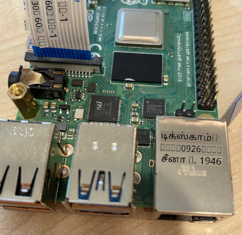
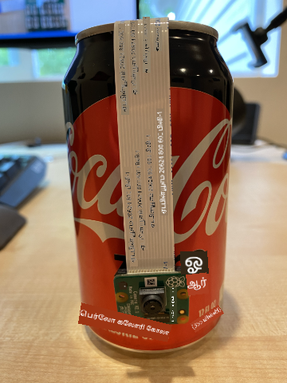

<!--
CO_OP_TRANSLATOR_METADATA:
{
  "original_hash": "c677667095f6133eee418c7e53615d05",
  "translation_date": "2025-10-11T11:43:57+00:00",
  "source_file": "4-manufacturing/lessons/2-check-fruit-from-device/pi-camera.md",
  "language_code": "ta"
}
-->
# படம் பிடிக்கவும் - ராஸ்பெர்ரி பை

இந்த பாடத்தின் இந்த பகுதியில், உங்கள் ராஸ்பெர்ரி பையில் கேமரா சென்சரை சேர்த்து, அதிலிருந்து படங்களைப் படிக்கப் போகிறீர்கள்.

## ஹார்ட்வேர்கள்

ராஸ்பெர்ரி பைக்கு ஒரு கேமரா தேவை.

நீங்கள் பயன்படுத்தப் போகும் கேமரா [ராஸ்பெர்ரி பை கேமரா மாட்யூல்](https://www.raspberrypi.org/products/camera-module-v2/) ஆகும். இந்த கேமரா ராஸ்பெர்ரி பைக்காக வடிவமைக்கப்பட்டுள்ளது மற்றும் பை-யில் உள்ள ஒரு தனிப்பட்ட இணைப்பின் மூலம் இணைக்கப்படுகிறது.

> 💁 இந்த கேமரா [Camera Serial Interface, Mobile Industry Processor Interface Alliance](https://wikipedia.org/wiki/Camera_Serial_Interface) எனப்படும் MIPI-CSI என்ற ஒரு நெறிமுறையைப் பயன்படுத்துகிறது. இது படங்களை அனுப்புவதற்கான ஒரு தனிப்பட்ட நெறிமுறை.

## கேமராவை இணைக்கவும்

கேமராவை ராஸ்பெர்ரி பைக்கு ரிப்பன் கேபிள் மூலம் இணைக்கலாம்.

### பணிகள் - கேமராவை இணைக்கவும்



1. பையை ஆஃப் செய்யவும்.

1. கேமராவுடன் வரும் ரிப்பன் கேபிளை கேமராவுடன் இணைக்கவும். இதற்காக, ஹோல்டரில் உள்ள கருப்பு பிளாஸ்டிக் கிளிப்பை மெதுவாக வெளியே இழுத்து, கேபிளை சாக்கெட்டில் நுழைக்கவும். கேபிளின் நீல பக்கம் லென்ஸை விட்டு விலகி இருக்க வேண்டும், மெட்டல் பின் ஸ்ட்ரிப்ஸ் லென்ஸை நோக்கி இருக்க வேண்டும். கேபிள் முழுவதும் உள்ளே சென்ற பிறகு, கருப்பு பிளாஸ்டிக் கிளிப்பை மீண்டும் இடத்தில் தள்ளவும்.

    கேபிளை திறந்து, சாக்கெட்டில் நுழைக்கும் முறை பற்றிய அனிமேஷனை [ராஸ்பெர்ரி பை கேமரா மாட்யூல் தொடங்கும் ஆவணத்தில்](https://projects.raspberrypi.org/en/projects/getting-started-with-picamera/2) காணலாம்.

    

1. பையில் இருந்து Grove Base Hat-ஐ அகற்றவும்.

1. Grove Base Hat-இல் உள்ள கேமரா ஸ்லாட்டின் வழியாக ரிப்பன் கேபிளை செலுத்தவும். கேபிளின் நீல பக்கம் **A0**, **A1** போன்ற அனலாக் போர்டுகளை நோக்கி இருக்க வேண்டும்.

    

1. ரிப்பன் கேபிளை பையில் உள்ள கேமரா போர்டில் நுழைக்கவும். மீண்டும், கருப்பு பிளாஸ்டிக் கிளிப்பை மேலே இழுத்து, கேபிளை நுழைத்து, கிளிப்பை மீண்டும் தள்ளவும். கேபிளின் நீல பக்கம் USB மற்றும் ஈதர்நெட் போர்டுகளை நோக்கி இருக்க வேண்டும்.

    

1. Grove Base Hat-ஐ மீண்டும் பொருத்தவும்.

## கேமராவை நிரலாக்கவும்

இப்போது ராஸ்பெர்ரி பை கேமராவை [PiCamera](https://pypi.org/project/picamera/) பைதான் நூலகத்தைப் பயன்படுத்தி நிரலாக்கலாம்.

### பணிகள் - பழைய கேமரா முறையை இயக்கவும்

துரதிர்ஷ்டவசமாக, ராஸ்பெர்ரி பை OS Bullseye வெளியீட்டுடன், OS உடன் வந்த கேமரா மென்பொருள் மாற்றப்பட்டது, இதனால் இயல்பாக PiCamera வேலை செய்யவில்லை. PiCamera2 எனப்படும் மாற்று உருவாக்கத்தில் உள்ளது, ஆனால் இது இன்னும் பயன்படுத்த தயாராக இல்லை.

தற்காலிகமாக, PiCamera வேலை செய்ய உங்கள் பையை பழைய கேமரா முறையில் அமைக்கலாம். கேமரா சாக்கெட் இயல்பாக முடக்கப்பட்டுள்ளது, ஆனால் பழைய கேமரா மென்பொருளை இயக்குவதால் சாக்கெட் தானாகவே இயக்கப்படும்.

1. பையை ஆன் செய்து, அது தொடங்கும் வரை காத்திருக்கவும்.

1. VS Code-ஐ பையில் நேரடியாக அல்லது Remote SSH நீட்டிப்பு மூலம் இணைத்து தொடங்கவும்.

1. உங்கள் டெர்மினலில் பின்வரும் கட்டளைகளை இயக்கவும்:

    ```sh
    sudo raspi-config nonint do_legacy 0
    sudo reboot
    ```

    இது பழைய கேமரா மென்பொருளை இயக்க ஒரு அமைப்பை மாற்றும், பின்னர் அந்த அமைப்பு செயல்பட பையை மீண்டும் தொடங்கும்.

1. பை மீண்டும் தொடங்கும் வரை காத்திருந்து, பின்னர் VS Code-ஐ மீண்டும் தொடங்கவும்.

### பணிகள் - கேமராவை நிரலாக்கவும்

சாதனத்தை நிரலாக்கவும்.

1. டெர்மினலில் இருந்து, `pi` பயனர் வீட்டுத் தளத்தில் `fruit-quality-detector` என்ற புதிய கோப்புறையை உருவாக்கவும். இந்த கோப்புறையில் `app.py` என்ற கோப்பை உருவாக்கவும்.

1. இந்த கோப்புறையை VS Code-இல் திறக்கவும்.

1. கேமராவுடன் தொடர்பு கொள்ள, PiCamera பைதான் நூலகத்தைப் பயன்படுத்தலாம். பின்வரும் கட்டளையைப் பயன்படுத்தி Pip தொகுப்பை நிறுவவும்:

    ```sh
    pip3 install picamera
    ```

1. உங்கள் `app.py` கோப்பில் பின்வரும் குறியீட்டைச் சேர்க்கவும்:

    ```python
    import io
    import time
    from picamera import PiCamera
    ```

    இந்த குறியீடு தேவையான சில நூலகங்களை இறக்குமதி செய்கிறது, இதில் `PiCamera` நூலகமும் அடங்கும்.

1. கேமராவை தொடங்க பின்வரும் குறியீட்டைச் சேர்க்கவும்:

    ```python
    camera = PiCamera()
    camera.resolution = (640, 480)
    camera.rotation = 0
    
    time.sleep(2)
    ```

    இந்த குறியீடு PiCamera பொருளை உருவாக்குகிறது, தீர்மானத்தை 640x480 ஆக அமைக்கிறது. அதிக தீர்மானங்கள் (3280x2464 வரை) ஆதரிக்கப்படுகின்றன, ஆனால் பட வகைப்பான் மிகவும் சிறிய படங்களில் (227x227) வேலை செய்கிறது, எனவே பெரிய படங்களைப் பிடித்து அனுப்ப தேவையில்லை.

    `camera.rotation = 0` வரி படத்தின் சுழற்சியை அமைக்கிறது. ரிப்பன் கேபிள் கேமராவின் கீழே வருகிறது, ஆனால் உங்கள் கேமரா வகைப்படுத்த வேண்டிய பொருளை எளிதாக நோக்க சுழற்றப்பட்டிருந்தால், இந்த வரியை சுழற்சியின் டிகிரிகளுக்கு மாற்றலாம்.

    

    உதாரணமாக, ரிப்பன் கேபிளை ஏதோ ஒன்றின் மீது தொங்கவிடும்படி suspending செய்தால், கேமராவின் மேல் இருக்கும், அப்போது சுழற்சியை 180 ஆக அமைக்கவும்:

    ```python
    camera.rotation = 180
    ```

    கேமரா தொடங்க சில விநாடிகள் ஆகும், எனவே `time.sleep(2)`.

1. பின்வரும் குறியீட்டைச் சேர்த்து, படத்தை பைனரி தரவாகப் பிடிக்கவும்:

    ```python
    image = io.BytesIO()
    camera.capture(image, 'jpeg')
    image.seek(0)
    ```

    இந்த குறியீடு பைனரி தரவுகளை சேமிக்க `BytesIO` பொருளை உருவாக்குகிறது. கேமராவில் இருந்து படத்தை JPEG கோப்பாகப் படித்து இந்த பொருளில் சேமிக்கிறது. இந்த பொருளில் தரவின் நிலையை அறிய ஒரு நிலை குறியீடு உள்ளது, மேலும் தரவுகளை எழுத முடியும். எனவே `image.seek(0)` வரி நிலையை மீண்டும் தொடக்கத்துக்கு நகர்த்துகிறது.

1. பின்வரும் குறியீட்டைச் சேர்த்து, படத்தை ஒரு கோப்பில் சேமிக்கவும்:

    ```python
    with open('image.jpg', 'wb') as image_file:
        image_file.write(image.read())
    ```

    இந்த குறியீடு `image.jpg` என்ற கோப்பை எழுதுவதற்காக திறக்கிறது, பின்னர் `BytesIO` பொருளிலிருந்து அனைத்து தரவையும் படித்து அந்த கோப்பில் எழுதுகிறது.

    > 💁 நீங்கள் `BytesIO` பொருளுக்கு பதிலாக நேரடியாக ஒரு கோப்பில் படத்தைப் பிடிக்கலாம். இந்த பாடத்தில் பின்னர் படத்தை உங்கள் பட வகைப்பானுக்கு அனுப்ப `BytesIO` பொருளை பயன்படுத்துகிறீர்கள்.

1. கேமராவை ஏதோ ஒன்றை நோக்கி வைத்து, இந்த குறியீட்டை இயக்கவும்.

1. ஒரு படம் பிடிக்கப்பட்டு, தற்போதைய கோப்புறையில் `image.jpg` என்ற பெயரில் சேமிக்கப்படும். இந்த கோப்பை VS Code explorer-இல் காணலாம். கோப்பை தேர்ந்தெடுத்து படத்தைப் பாருங்கள். சுழற்சி தேவைப்பட்டால், `camera.rotation = 0` வரியை மாற்றி, மீண்டும் படம் எடுக்கவும்.

> 💁 இந்த குறியீட்டை [code-camera/pi](../../../../../4-manufacturing/lessons/2-check-fruit-from-device/code-camera/pi) கோப்புறையில் காணலாம்.

😀 உங்கள் கேமரா நிரல் வெற்றிகரமாக முடிந்தது!

---

**குறிப்பு**:  
இந்த ஆவணம் [Co-op Translator](https://github.com/Azure/co-op-translator) என்ற AI மொழிபெயர்ப்பு சேவையைப் பயன்படுத்தி மொழிபெயர்க்கப்பட்டுள்ளது. நாங்கள் துல்லியத்திற்காக முயற்சிக்கிறோம், ஆனால் தானியக்க மொழிபெயர்ப்புகளில் பிழைகள் அல்லது தவறான தகவல்கள் இருக்கக்கூடும் என்பதை தயவுசெய்து கவனத்தில் கொள்ளுங்கள். அதன் தாய்மொழியில் உள்ள மூல ஆவணம் அதிகாரப்பூர்வ ஆதாரமாக கருதப்பட வேண்டும். முக்கியமான தகவல்களுக்கு, தொழில்முறை மனித மொழிபெயர்ப்பு பரிந்துரைக்கப்படுகிறது. இந்த மொழிபெயர்ப்பைப் பயன்படுத்துவதால் ஏற்படும் எந்த தவறான புரிதல்கள் அல்லது தவறான விளக்கங்களுக்கு நாங்கள் பொறுப்பல்ல.