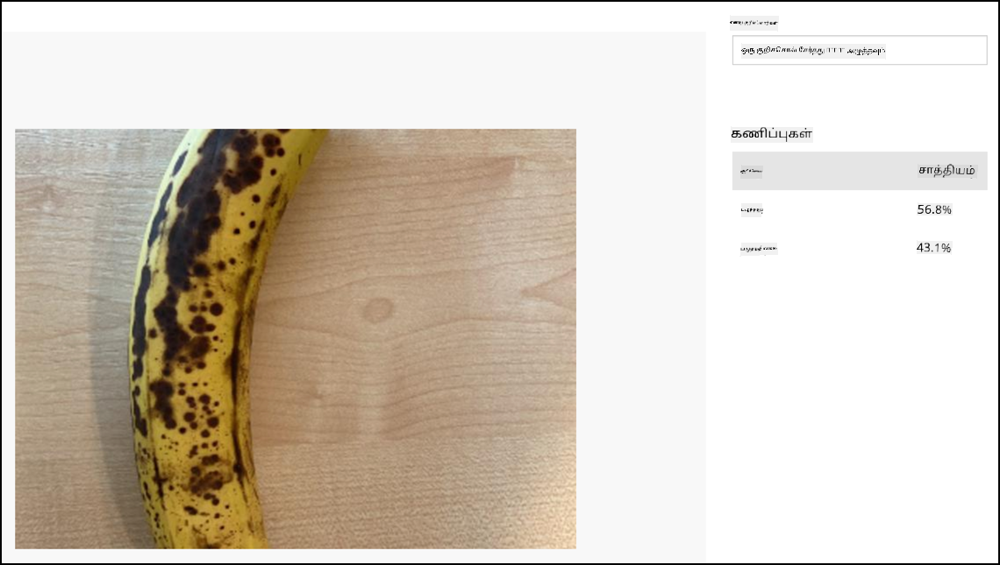

<!--
CO_OP_TRANSLATOR_METADATA:
{
  "original_hash": "e5896207b304ce1abaf065b8acc0cc79",
  "translation_date": "2025-10-11T11:48:07+00:00",
  "source_file": "4-manufacturing/lessons/2-check-fruit-from-device/single-board-computer-classify-image.md",
  "language_code": "ta"
}
-->
# படத்தை வகைப்படுத்துதல் - மெய்நிகர் IoT சாதனம் மற்றும் ராஸ்பெர்ரி பை

இந்த பாடத்தின் இந்த பகுதியில், கேமரா மூலம் பிடிக்கப்பட்ட படத்தை Custom Vision சேவைக்கு அனுப்பி அதை வகைப்படுத்துவீர்கள்.

## படங்களை Custom Vision-க்கு அனுப்புதல்

Custom Vision சேவைக்கு Python SDK உள்ளது, இதன் மூலம் படங்களை வகைப்படுத்தலாம்.

### பணிகள் - படங்களை Custom Vision-க்கு அனுப்புதல்

1. VS Code-ல் `fruit-quality-detector` கோப்புறையை திறக்கவும். நீங்கள் மெய்நிகர் IoT சாதனத்தைப் பயன்படுத்தினால், மெய்நிகர் சூழல் டெர்மினலில் இயங்குகிறதா என்பதை உறுதிப்படுத்தவும்.

1. Custom Vision-க்கு படங்களை அனுப்ப Python SDK ஒரு Pip தொகுப்பாக கிடைக்கிறது. அதை கீழ்க்காணும் கட்டளையைப் பயன்படுத்தி நிறுவவும்:

    ```sh
    pip3 install azure-cognitiveservices-vision-customvision
    ```

1. `app.py` கோப்பின் மேல் பகுதியில் பின்வரும் இறக்குமதி அறிக்கைகளைச் சேர்க்கவும்:

    ```python
    from msrest.authentication import ApiKeyCredentials
    from azure.cognitiveservices.vision.customvision.prediction import CustomVisionPredictionClient
    ```

   இது Custom Vision நூலகங்களில் இருந்து சில மாட்யூல்களை கொண்டு வருகிறது, ஒன்று prediction key மூலம் அங்கீகரிக்கவும், மற்றொன்று Custom Vision-ஐ அழைக்க ஒரு prediction client வகுப்பை வழங்கவும்.

1. கோப்பின் இறுதியில் பின்வரும் குறியீட்டைச் சேர்க்கவும்:

    ```python
    prediction_url = '<prediction_url>'
    prediction_key = '<prediction key>'
    ```

   `<prediction_url>` என்பதை இந்த பாடத்தின் முந்தைய பகுதியில் *Prediction URL* உரையாடலில் இருந்து நகலெடுத்த URL-ஆல் மாற்றவும். `<prediction key>` என்பதை அதே உரையாடலில் இருந்து நகலெடுத்த prediction key-ஆல் மாற்றவும்.

1. *Prediction URL* உரையாடலில் வழங்கப்பட்ட prediction URL REST endpoint-ஐ நேரடியாக அழைக்கும் போது பயன்படுத்த வடிவமைக்கப்பட்டுள்ளது. Python SDK URL-இன் பகுதிகளை வேறு இடங்களில் பயன்படுத்துகிறது. இந்த URL-ஐ தேவையான பகுதிகளாக பிரிக்க பின்வரும் குறியீட்டைச் சேர்க்கவும்:

    ```python
    parts = prediction_url.split('/')
    endpoint = 'https://' + parts[2]
    project_id = parts[6]
    iteration_name = parts[9]
    ```

   இது URL-ஐ பிரிக்கிறது, `https://<location>.api.cognitive.microsoft.com` என்ற endpoint, project ID, மற்றும் வெளியிடப்பட்ட iteration பெயரை எடுக்கிறது.

1. பின்வரும் குறியீட்டை பயன்படுத்தி prediction செய்ய predictor பொருளை உருவாக்கவும்:

    ```python
    prediction_credentials = ApiKeyCredentials(in_headers={"Prediction-key": prediction_key})
    predictor = CustomVisionPredictionClient(endpoint, prediction_credentials)
    ```

   `prediction_credentials` prediction key-ஐ சுற்றி பாதுகாக்கிறது. இதன் மூலம் endpoint-ஐ சுட்டும் prediction client பொருள் உருவாக்கப்படுகிறது.

1. பின்வரும் குறியீட்டை பயன்படுத்தி படத்தை Custom Vision-க்கு அனுப்பவும்:

    ```python
    image.seek(0)
    results = predictor.classify_image(project_id, iteration_name, image)
    ```

   இது படத்தை தொடக்கத்துக்கு திருப்பி, prediction client-க்கு அனுப்புகிறது.

1. இறுதியாக, பின்வரும் குறியீட்டை பயன்படுத்தி முடிவுகளை காண்பிக்கவும்:

    ```python
    for prediction in results.predictions:
        print(f'{prediction.tag_name}:\t{prediction.probability * 100:.2f}%')
    ```

   இது திரும்பிய அனைத்து prediction-களையும் மடக்கி, அவற்றை டெர்மினலில் காண்பிக்கும். திரும்பிய probability-கள் 0-1 வரை உள்ள மிதவை எண்களாக இருக்கும், 0 என்பது அந்த tag-க்கு 0% வாய்ப்பு, 1 என்பது 100% வாய்ப்பு.

   > 💁 பட வகைப்படுத்திகள் பயன்படுத்திய அனைத்து tag-களுக்கும் சதவீதங்களை திரும்ப அளிக்கும். ஒவ்வொரு tag-க்கும் அந்த படத்துடன் பொருந்தும் வாய்ப்பு இருக்கும்.

1. உங்கள் கேமரா சில பழங்கள் அல்லது பொருத்தமான படத் தொகுப்பை நோக்கி இருக்கும்படி உங்கள் குறியீட்டை இயக்கவும், அல்லது மெய்நிகர் IoT சாதனத்தைப் பயன்படுத்தினால் உங்கள் வலைக்கேமில் பழங்கள் தெரியும். நீங்கள் console-ல் வெளியீட்டை காண்பீர்கள்:

    ```output
    (.venv) ➜  fruit-quality-detector python app.py
    ripe:   56.84%
    unripe: 43.16%
    ```

   நீங்கள் எடுத்த படத்தையும், இந்த மதிப்புகளையும் Custom Vision இல் **Predictions** தாவலில் காணலாம்.

   

> 💁 இந்த குறியீட்டை [code-classify/pi](../../../../../4-manufacturing/lessons/2-check-fruit-from-device/code-classify/pi) அல்லது [code-classify/virtual-iot-device](../../../../../4-manufacturing/lessons/2-check-fruit-from-device/code-classify/virtual-iot-device) கோப்புறையில் காணலாம்.

😀 உங்கள் பழ தரம் வகைப்படுத்தும் நிரல் வெற்றிகரமாக முடிந்தது!

---

**குறிப்பு**:  
இந்த ஆவணம் [Co-op Translator](https://github.com/Azure/co-op-translator) என்ற AI மொழிபெயர்ப்பு சேவையைப் பயன்படுத்தி மொழிபெயர்க்கப்பட்டுள்ளது. எங்கள் தரச்செயல்முறைகளுக்கு முழு முயற்சி எடுத்தாலும், தானியங்கி மொழிபெயர்ப்புகளில் பிழைகள் அல்லது தவறுகள் இருக்கக்கூடும் என்பதை தயவுசெய்து கவனத்தில் கொள்ளவும். அதன் தாய்மொழியில் உள்ள மூல ஆவணம் அதிகாரப்பூர்வ ஆதாரமாக கருதப்பட வேண்டும். முக்கியமான தகவல்களுக்கு, தொழில்முறை மனித மொழிபெயர்ப்பு பரிந்துரைக்கப்படுகிறது. இந்த மொழிபெயர்ப்பைப் பயன்படுத்துவதால் ஏற்படும் எந்த தவறான புரிதல்கள் அல்லது தவறான விளக்கங்களுக்கு நாங்கள் பொறுப்பல்ல.