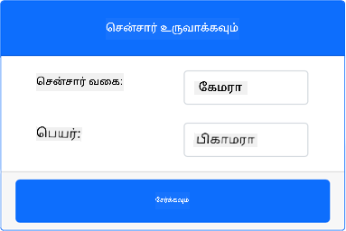
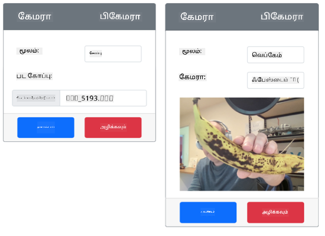

<!--
CO_OP_TRANSLATOR_METADATA:
{
  "original_hash": "3ba7150ffc4a6999f6c3cfb4906ec7df",
  "translation_date": "2025-10-11T11:44:37+00:00",
  "source_file": "4-manufacturing/lessons/2-check-fruit-from-device/virtual-device-camera.md",
  "language_code": "ta"
}
-->
# ஒரு படம் பிடிக்கவும் - மெய்நிகர் IoT ஹார்ட்வேர்கள்

இந்த பாடத்தின் இந்த பகுதியில், உங்கள் மெய்நிகர் IoT சாதனத்தில் கேமரா சென்சரைச் சேர்த்து, அதிலிருந்து படங்களைப் படிக்கப் போகிறீர்கள்.

## ஹார்ட்வேர்கள்

மெய்நிகர் IoT சாதனம் கோப்புகளிலிருந்து அல்லது உங்கள் வலைக்கேமராவிலிருந்து படங்களை அனுப்பும் ஒரு சிமுலேட்டட் கேமராவைப் பயன்படுத்தும்.

### CounterFit-க்கு கேமராவைச் சேர்க்கவும்

மெய்நிகர் கேமராவைப் பயன்படுத்த, நீங்கள் CounterFit பயன்பாட்டில் ஒன்றைச் சேர்க்க வேண்டும்.

#### பணிகள் - CounterFit-க்கு கேமராவைச் சேர்க்கவும்

CounterFit பயன்பாட்டில் கேமராவைச் சேர்க்கவும்.

1. உங்கள் கணினியில் `fruit-quality-detector` என்ற கோப்புறையில் ஒரு புதிய Python பயன்பாட்டை உருவாக்கி, `app.py` என்ற ஒரு கோப்புடன் Python மெய்நிகர் சூழலை உருவாக்கி, CounterFit pip தொகுப்புகளைச் சேர்க்கவும்.

    > ⚠️ [CounterFit Python திட்டத்தை உருவாக்குவதற்கும் அமைப்பதற்கும் பாடம் 1-இல் உள்ள வழிமுறைகளை](../../../1-getting-started/lessons/1-introduction-to-iot/virtual-device.md) தேவைப்பட்டால் பார்க்கலாம்.

1. Camera சென்சர்களுடன் தொடர்பு கொள்ள CounterFit shim-ஐ நிறுவ ஒரு கூடுதல் Pip தொகுப்பை நிறுவவும், இது [Picamera Pip தொகுப்பின்](https://pypi.org/project/picamera/) சில அம்சங்களை சிமுலேட் செய்யும். மெய்நிகர் சூழல் செயல்படுத்தப்பட்டுள்ள டெர்மினலில் இருந்து இதை நிறுவுகிறீர்கள் என்பதை உறுதிப்படுத்தவும்.

    ```sh
    pip install counterfit-shims-picamera
    ```

1. CounterFit வலை பயன்பாடு இயங்குகிறது என்பதை உறுதிப்படுத்தவும்.

1. ஒரு கேமராவை உருவாக்கவும்:

    1. *Sensors* பகுதியின் *Create sensor* பெட்டியில், *Sensor type* பெட்டியைத் திறந்து *Camera* என்பதைத் தேர்ந்தெடுக்கவும்.

    1. *Name* ஐ `Picamera` என அமைக்கவும்.

    1. கேமராவை உருவாக்க **Add** பொத்தானைத் தேர்ந்தெடுக்கவும்.

    

    கேமரா உருவாக்கப்பட்டு சென்சர்கள் பட்டியலில் தோன்றும்.

    

## கேமராவை நிரலாக்கவும்

மெய்நிகர் IoT சாதனம் இப்போது மெய்நிகர் கேமராவைப் பயன்படுத்த நிரலாக்கப்படலாம்.

### பணிகள் - கேமராவை நிரலாக்கவும்

சாதனத்தை நிரலாக்கவும்.

1. `fruit-quality-detector` பயன்பாடு VS Code-இல் திறந்திருப்பதை உறுதிப்படுத்தவும்.

1. `app.py` கோப்பைத் திறக்கவும்.

1. CounterFit-க்கு பயன்பாட்டை இணைக்க `app.py` கோப்பின் மேல் பின்வரும் குறியீட்டைச் சேர்க்கவும்:

    ```python
    from counterfit_connection import CounterFitConnection
    CounterFitConnection.init('127.0.0.1', 5000)
    ```

1. உங்கள் `app.py` கோப்பில் பின்வரும் குறியீட்டைச் சேர்க்கவும்:

    ```python
    import io
    from counterfit_shims_picamera import PiCamera
    ```

    இந்த குறியீடு தேவையான சில நூலகங்களை இறக்குமதி செய்கிறது, இதில் counterfit_shims_picamera நூலகத்திலிருந்து `PiCamera` வகுப்பும் அடங்கும்.

1. கேமராவை தொடங்க பின்வரும் குறியீட்டை இதற்கு கீழே சேர்க்கவும்:

    ```python
    camera = PiCamera()
    camera.resolution = (640, 480)
    camera.rotation = 0
    ```

    இந்த குறியீடு PiCamera பொருளை உருவாக்குகிறது, தீர்மானத்தை 640x480 ஆக அமைக்கிறது. அதிக தீர்மானங்கள் ஆதரிக்கப்படுகின்றன, ஆனால் பட வகைப்பான் மிகவும் சிறிய படங்களில் (227x227) வேலை செய்கிறது, எனவே பெரிய படங்களைப் பிடித்து அனுப்ப தேவையில்லை.

    `camera.rotation = 0` வரி படத்தின் சுழற்சியை டிகிரிகளில் அமைக்கிறது. வலைக்கேமரா அல்லது கோப்பிலிருந்து படத்தை சுழற்ற வேண்டும் என்றால், இதைத் தேவையானபடி அமைக்கவும். உதாரணமாக, ஒரு வலைக்கேமராவில் லேண்ட்ஸ்கேப் முறையில் உள்ள வாழைப்பழத்தின் படத்தை போர்ட்ரெய்ட் முறையாக மாற்ற விரும்பினால், `camera.rotation = 90` என அமைக்கவும்.

1. பின்வரும் குறியீட்டை கீழே சேர்த்து படத்தை பைனரி தரவாகப் பிடிக்கவும்:

    ```python
    image = io.BytesIO()
    camera.capture(image, 'jpeg')
    image.seek(0)
    ```

    இந்த குறியீடு பைனரி தரவத்தை சேமிக்க `BytesIO` பொருளை உருவாக்குகிறது. JPEG கோப்பாக கேமராவிலிருந்து படத்தைப் படித்து இந்த பொருளில் சேமிக்கிறது. இந்த பொருளுக்கு தரவின் எந்த இடத்தில் உள்ளது என்பதை அறிய ஒரு நிலை குறியீடு உள்ளது, எனவே மேலும் தரவுகளை இறுதியில் எழுத முடியும், எனவே `image.seek(0)` வரி இந்த நிலையை மீண்டும் தொடக்கத்துக்கு நகர்த்துகிறது, பின்னர் அனைத்து தரவுகளையும் படிக்க முடியும்.

1. இதற்கு கீழே, படத்தை ஒரு கோப்பில் சேமிக்க பின்வருவதைச் சேர்க்கவும்:

    ```python
    with open('image.jpg', 'wb') as image_file:
        image_file.write(image.read())
    ```

    இந்த குறியீடு `image.jpg` என்ற கோப்பை எழுதுவதற்காக திறக்கிறது, பின்னர் `BytesIO` பொருளிலிருந்து அனைத்து தரவுகளையும் படித்து அந்த கோப்பில் எழுதுகிறது.

    > 💁 நீங்கள் `camera.capture` அழைப்புக்கு கோப்பு பெயரை வழங்குவதன் மூலம் படத்தை நேரடியாக ஒரு கோப்பில் பிடிக்கலாம். `BytesIO` பொருளைப் பயன்படுத்துவதற்கான காரணம், இந்த பாடத்தில் பின்னர் உங்கள் பட வகைப்பானுக்கு படத்தை அனுப்ப முடியும்.

1. CounterFit-இல் கேமரா பிடிக்கும் படத்தை அமைக்கவும். *Source* ஐ *File* ஆக அமைத்து, ஒரு பட கோப்பை பதிவேற்றவும் அல்லது *Source* ஐ *WebCam* ஆக அமைத்து, உங்கள் வலைக்கேமராவிலிருந்து படங்களைப் பிடிக்கவும். ஒரு படம் தேர்ந்தெடுக்கவோ அல்லது உங்கள் வலைக்கேமராவைத் தேர்ந்தெடுக்கவோ **Set** பொத்தானைத் தேர்ந்தெடுக்கவும்.

    

1. ஒரு படம் பிடிக்கப்பட்டு தற்போதைய கோப்புறையில் `image.jpg` என சேமிக்கப்படும். இந்த கோப்பை VS Code எக்ஸ்ப்ளோரரில் காணலாம். கோப்பைத் தேர்ந்தெடுத்து படத்தைப் பாருங்கள். சுழற்சி தேவைப்பட்டால், `camera.rotation = 0` வரியை தேவையானபடி புதுப்பித்து மற்றொரு படத்தை எடுக்கவும்.

> 💁 இந்த குறியீட்டை [code-camera/virtual-iot-device](../../../../../4-manufacturing/lessons/2-check-fruit-from-device/code-camera/virtual-iot-device) கோப்புறையில் காணலாம்.

😀 உங்கள் கேமரா நிரல் வெற்றிகரமாக முடிந்தது!

---

**குறிப்பு**:  
இந்த ஆவணம் [Co-op Translator](https://github.com/Azure/co-op-translator) என்ற AI மொழிபெயர்ப்பு சேவையைப் பயன்படுத்தி மொழிபெயர்க்கப்பட்டுள்ளது. நாங்கள் துல்லியத்திற்காக முயற்சிக்கின்றோம், ஆனால் தானியக்க மொழிபெயர்ப்புகளில் பிழைகள் அல்லது துல்லியக்குறைவுகள் இருக்கக்கூடும் என்பதை கவனத்தில் கொள்ளவும். அதன் தாய்மொழியில் உள்ள மூல ஆவணம் அதிகாரப்பூர்வ ஆதாரமாக கருதப்பட வேண்டும். முக்கியமான தகவல்களுக்கு, தொழில்முறை மனித மொழிபெயர்ப்பு பரிந்துரைக்கப்படுகிறது. இந்த மொழிபெயர்ப்பைப் பயன்படுத்துவதால் ஏற்படும் தவறான புரிதல்கள் அல்லது தவறான விளக்கங்களுக்கு நாங்கள் பொறுப்பல்ல.