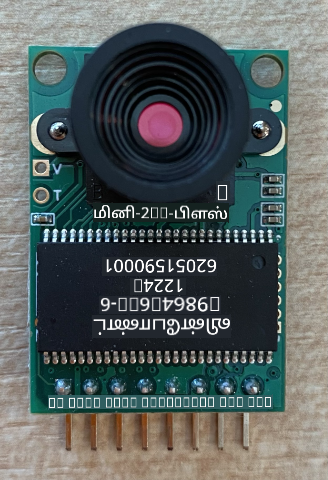
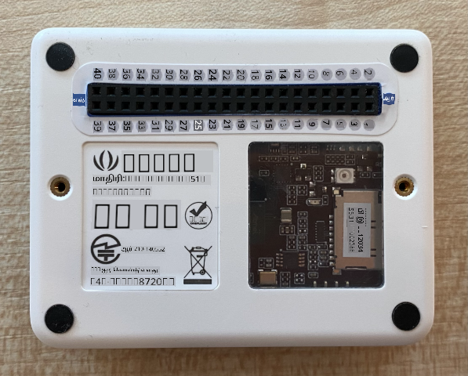
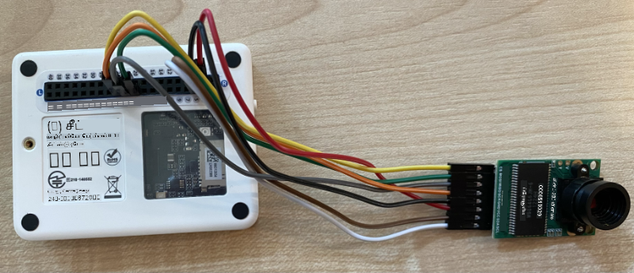

<!--
CO_OP_TRANSLATOR_METADATA:
{
  "original_hash": "160be8c0f558687f6686dca64f10f739",
  "translation_date": "2025-10-11T11:45:13+00:00",
  "source_file": "4-manufacturing/lessons/2-check-fruit-from-device/wio-terminal-camera.md",
  "language_code": "ta"
}
-->
# படம் பிடிக்கவும் - Wio Terminal

இந்த பாடத்தின் இந்த பகுதியில், உங்கள் Wio Terminal-க்கு கேமராவை சேர்த்து, அதிலிருந்து படங்களைப் பிடிக்கப் போகிறீர்கள்.

## ஹார்ட்வேர்கள்

Wio Terminal-க்கு ஒரு கேமரா தேவை.

நீங்கள் பயன்படுத்தப் போகும் கேமரா [ArduCam Mini 2MP Plus](https://www.arducam.com/product/arducam-2mp-spi-camera-b0067-arduino/) ஆகும். இது OV2640 பட சென்சாரை அடிப்படையாகக் கொண்ட 2 மெகாபிக்சல் கேமரா. இது படங்களைப் பிடிக்க SPI இடைமுகத்தின் மூலம் தொடர்பு கொள்ளுகிறது, மேலும் சென்சாரை அமைக்க I<sup>2</sup>C பயன்படுத்துகிறது.

## கேமராவை இணைக்கவும்

ArduCam-க்கு Grove socket இல்லை, அதனால் இது GPIO பின்கள் மூலம் Wio Terminal-க்கு SPI மற்றும் I<sup>2</sup>C பஸ்களை இணைக்கிறது.

### பணிகள் - கேமராவை இணைக்கவும்

கேமராவை இணைக்கவும்.



1. ArduCam அடிப்பகுதியில் உள்ள பின்கள் Wio Terminal-ல் உள்ள GPIO பின்களுடன் இணைக்கப்பட வேண்டும். சரியான பின்களை எளிதாக கண்டறிய, Wio Terminal-க்கு வரும் GPIO பின் ஸ்டிக்கரை பின்களுக்குச் சுற்றி ஒட்டவும்:

    

1. ஜம்பர் வயர்களைப் பயன்படுத்தி, கீழே உள்ள இணைப்புகளைச் செய்யவும்:

    | ArduCAM பின் | Wio Terminal பின் | விளக்கம்                                 |
    | ------------ | ----------------- | --------------------------------------- |
    | CS           | 24 (SPI_CS)       | SPI Chip Select                         |
    | MOSI         | 19 (SPI_MOSI)     | SPI Controller Output, Peripheral Input |
    | MISO         | 21 (SPI_MISO)     | SPI Controller Input, Peripheral Output |
    | SCK          | 23 (SPI_SCLK)     | SPI Serial Clock                        |
    | GND          | 6 (GND)           | மின்சாரம் - 0V                          |
    | VCC          | 4 (5V)            | 5V மின்சாரம்                            |
    | SDA          | 3 (I2C1_SDA)      | I<sup>2</sup>C Serial Data              |
    | SCL          | 5 (I2C1_SCL)      | I<sup>2</sup>C Serial Clock             |

    

    GND மற்றும் VCC இணைப்புகள் ArduCam-க்கு 5V மின்சாரம் வழங்குகின்றன. இது 5V-ல் இயங்குகிறது, ஆனால் Grove சென்சார்கள் 3V-ல் இயங்குகின்றன. இந்த மின்சாரம் சாதனத்தை இயக்கும் USB-C இணைப்பிலிருந்து நேரடியாக வருகிறது.

    > 💁 SPI இணைப்புக்கான ArduCam மற்றும் Wio Terminal பின் பெயர்கள் பழைய பெயரிடும் முறையைப் பயன்படுத்துகின்றன. இந்த பாடத்தில் புதிய பெயரிடும் முறையைப் பயன்படுத்தப்படும், ஆனால் கோடில் பின் பெயர்கள் பயன்படுத்தப்படும் போது பழைய பெயர்கள் பயன்படுத்தப்படும்.

1. இப்போது Wio Terminal-ஐ உங்கள் கணினியுடன் இணைக்கலாம்.

## கேமராவுடன் இணைக்க சாதனத்தை நிரலாக்கவும்

இப்போது Wio Terminal-ஐ இணைக்கப்பட்ட ArduCAM கேமராவை பயன்படுத்த நிரலாக்கலாம்.

### பணிகள் - கேமராவுடன் இணைக்க சாதனத்தை நிரலாக்கவும்

1. PlatformIO-ஐப் பயன்படுத்தி புதிய Wio Terminal திட்டத்தை உருவாக்கவும். இந்த திட்டத்திற்கு `fruit-quality-detector` என்று பெயரிடவும். `setup` செயல்பாட்டில் சீரியல் போர்ட்டை அமைக்க கோடுகளைச் சேர்க்கவும்.

1. WiFi-க்கு இணைக்க கோடுகளைச் சேர்க்கவும், உங்கள் WiFi சான்றுகளை `config.h` என்ற கோப்பில் சேர்க்கவும். `platformio.ini` கோப்பில் தேவையான நூலகங்களைச் சேர்க்க மறக்க வேண்டாம்.

1. ArduCam நூலகம் `platformio.ini` கோப்பில் இருந்து நிறுவக்கூடிய Arduino நூலகமாக கிடைக்கவில்லை. இதை GitHub பக்கத்திலிருந்து மூலமாக நிறுவ வேண்டும். இதைப் பெற நீங்கள்:

    * [https://github.com/ArduCAM/Arduino.git](https://github.com/ArduCAM/Arduino.git) இருந்து ரெப்போவை கிளோன் செய்யலாம்
    * GitHub-ல் [github.com/ArduCAM/Arduino](https://github.com/ArduCAM/Arduino) பக்கத்திற்குச் சென்று **Code** பொத்தானில் இருந்து கோடுகளை zip ஆக பதிவிறக்கலாம்

1. இந்த கோடிலிருந்து `ArduCAM` கோப்புறையை மட்டுமே தேவை. முழு கோப்புறையை உங்கள் திட்டத்தின் `lib` கோப்புறையில் நகலெடுக்கவும்.

    > ⚠️ முழு கோப்புறையை நகலெடுக்க வேண்டும், எனவே கோடு `lib/ArduCam`-ல் இருக்கும். `ArduCam` கோப்புறையின் உள்ளடக்கத்தை மட்டும் `lib` கோப்புறையில் நகலெடுக்க வேண்டாம், முழு கோப்புறையை நகலெடுக்கவும்.

1. ArduCam நூலகக் கோடு பல வகையான கேமராக்களுக்கு வேலை செய்கிறது. நீங்கள் பயன்படுத்த விரும்பும் கேமரா வகை compiler flags மூலம் அமைக்கப்படுகிறது - இது நீங்கள் பயன்படுத்தாத கேமராக்களுக்கு கோடுகளை நீக்குவதன் மூலம் கட்டப்பட்ட நூலகத்தை மிகச் சிறியதாக வைத்திருக்கிறது. OV2640 கேமராவுக்கு நூலகத்தை அமைக்க, `platformio.ini` கோப்பின் இறுதியில் கீழே உள்ளதைச் சேர்க்கவும்:

    ```ini
    build_flags =
        -DARDUCAM_SHIELD_V2
        -DOV2640_CAM
    ```

    இது 2 compiler flags-களை அமைக்கிறது:

      * `ARDUCAM_SHIELD_V2` - கேமரா Arduino போர்டில் உள்ளது என்பதை நூலகத்துக்கு தெரிவிக்கிறது.
      * `OV2640_CAM` - OV2640 கேமராவுக்கான கோடுகளை மட்டும் சேர்க்க நூலகத்துக்கு தெரிவிக்கிறது.

1. `src` கோப்புறையில் `camera.h` என்ற தலைப்பு கோப்பைச் சேர்க்கவும். இது கேமராவுடன் தொடர்பு கொள்ள கோடுகளை கொண்டிருக்கும். இந்த கோப்பில் கீழே உள்ள கோடுகளைச் சேர்க்கவும்:

    ```cpp
    #pragma once
    
    #include <ArduCAM.h>
    #include <Wire.h>
    
    class Camera
    {
    public:
        Camera(int format, int image_size) : _arducam(OV2640, PIN_SPI_SS)
        {
            _format = format;
            _image_size = image_size;
        }
    
        bool init()
        {
            // Reset the CPLD
            _arducam.write_reg(0x07, 0x80);
            delay(100);
    
            _arducam.write_reg(0x07, 0x00);
            delay(100);
    
            // Check if the ArduCAM SPI bus is OK
            _arducam.write_reg(ARDUCHIP_TEST1, 0x55);
            if (_arducam.read_reg(ARDUCHIP_TEST1) != 0x55)
            {
                return false;
            }
                
            // Change MCU mode
            _arducam.set_mode(MCU2LCD_MODE);
    
            uint8_t vid, pid;
    
            // Check if the camera module type is OV2640
            _arducam.wrSensorReg8_8(0xff, 0x01);
            _arducam.rdSensorReg8_8(OV2640_CHIPID_HIGH, &vid);
            _arducam.rdSensorReg8_8(OV2640_CHIPID_LOW, &pid);
            if ((vid != 0x26) && ((pid != 0x41) || (pid != 0x42)))
            {
                return false;
            }
            
            _arducam.set_format(_format);
            _arducam.InitCAM();
            _arducam.OV2640_set_JPEG_size(_image_size);
            _arducam.OV2640_set_Light_Mode(Auto);
            _arducam.OV2640_set_Special_effects(Normal);
            delay(1000);
    
            return true;
        }
    
        void startCapture()
        {
            _arducam.flush_fifo();
            _arducam.clear_fifo_flag();
            _arducam.start_capture();
        }
    
        bool captureReady()
        {
            return _arducam.get_bit(ARDUCHIP_TRIG, CAP_DONE_MASK);
        }
    
        bool readImageToBuffer(byte **buffer, uint32_t &buffer_length)
        {
            if (!captureReady()) return false;
    
            // Get the image file length
            uint32_t length = _arducam.read_fifo_length();
            buffer_length = length;
    
            if (length >= MAX_FIFO_SIZE)
            {
                return false;
            }
            if (length == 0)
            {
                return false;
            }
    
            // create the buffer
            byte *buf = new byte[length];
    
            uint8_t temp = 0, temp_last = 0;
            int i = 0;
            uint32_t buffer_pos = 0;
            bool is_header = false;
    
            _arducam.CS_LOW();
            _arducam.set_fifo_burst();
            
            while (length--)
            {
                temp_last = temp;
                temp = SPI.transfer(0x00);
                //Read JPEG data from FIFO
                if ((temp == 0xD9) && (temp_last == 0xFF)) //If find the end ,break while,
                {
                    buf[buffer_pos] = temp;
    
                    buffer_pos++;
                    i++;
                    
                    _arducam.CS_HIGH();
                }
                if (is_header == true)
                {
                    //Write image data to buffer if not full
                    if (i < 256)
                    {
                        buf[buffer_pos] = temp;
                        buffer_pos++;
                        i++;
                    }
                    else
                    {
                        _arducam.CS_HIGH();
    
                        i = 0;
                        buf[buffer_pos] = temp;
    
                        buffer_pos++;
                        i++;
    
                        _arducam.CS_LOW();
                        _arducam.set_fifo_burst();
                    }
                }
                else if ((temp == 0xD8) & (temp_last == 0xFF))
                {
                    is_header = true;
    
                    buf[buffer_pos] = temp_last;
                    buffer_pos++;
                    i++;
    
                    buf[buffer_pos] = temp;
                    buffer_pos++;
                    i++;
                }
            }
            
            _arducam.clear_fifo_flag();
    
            _arducam.set_format(_format);
            _arducam.InitCAM();
            _arducam.OV2640_set_JPEG_size(_image_size);
    
            // return the buffer
            *buffer = buf;
        }
    
    private:
        ArduCAM _arducam;
        int _format;
        int _image_size;
    };
    ```

    இது ArduCam நூலகங்களைப் பயன்படுத்தி கேமராவை அமைக்கவும், தேவையான போது SPI பஸை பயன்படுத்தி படங்களை எடுக்கவும் குறைந்த நிலை கோடாகும். இது ArduCam-க்கு மிகவும் குறிப்பிட்டதாக உள்ளது, எனவே இது எப்படி வேலை செய்கிறது என்பதை நீங்கள் கவலைப்பட வேண்டியதில்லை.

1. `main.cpp`-ல், மற்ற `include` அறிக்கைகளின் கீழே இந்த புதிய கோப்பைச் சேர்க்கவும் மற்றும் கேமரா வகுப்பின் ஒரு உதாரணத்தை உருவாக்கவும்:

    ```cpp
    #include "camera.h"

    Camera camera = Camera(JPEG, OV2640_640x480);
    ```

    இது JPEG வடிவில் 640x480 தீர்மானத்தில் படங்களை சேமிக்கும் `Camera`-ஐ உருவாக்குகிறது. அதிக தீர்மானங்கள் (3280x2464 வரை) ஆதரிக்கப்படுகின்றன, ஆனால் பட வகைப்பாளர் மிகவும் சிறிய படங்களில் (227x227) வேலை செய்கிறது, எனவே பெரிய படங்களைப் பிடித்து அனுப்ப தேவையில்லை.

1. கேமராவை அமைக்க ஒரு செயல்பாட்டை வரையறுக்க கீழே உள்ள கோடுகளைச் சேர்க்கவும்:

    ```cpp
    void setupCamera()
    {
        pinMode(PIN_SPI_SS, OUTPUT);
        digitalWrite(PIN_SPI_SS, HIGH);
    
        Wire.begin();
        SPI.begin();
    
        if (!camera.init())
        {
            Serial.println("Error setting up the camera!");
        }
    }
    ```

    இந்த `setupCamera` செயல்பாடு SPI chip select pin (`PIN_SPI_SS`) ஐ உயரமாக அமைப்பதன் மூலம் Wio Terminal-ஐ SPI கட்டுப்பாட்டாளராக அமைக்கிறது. பின்னர் இது I<sup>2</sup>C மற்றும் SPI பஸ்களை தொடங்குகிறது. இறுதியாக, கேமரா வகுப்பை ஆரம்பிக்கிறது, இது கேமரா சென்சார் அமைப்புகளை அமைக்கிறது மற்றும் அனைத்தும் சரியாக இணைக்கப்பட்டுள்ளதா என்பதை உறுதிப்படுத்துகிறது.

1. `setup` செயல்பாட்டின் இறுதியில் இந்த செயல்பாட்டை அழைக்கவும்:

    ```cpp
    setupCamera();
    ```

1. இந்த கோடுகளை கட்டமைத்து பதிவேற்றவும், மேலும் சீரியல் மானிட்டரிலிருந்து வெளியீட்டைச் சரிபார்க்கவும். நீங்கள் `Error setting up the camera!` என்பதைப் பார்க்கிறீர்கள் என்றால், ArduCam-க்கு சரியான GPIO பின்களுடன் அனைத்து கேபிள்களும் இணைக்கப்பட்டுள்ளதா என்பதை உறுதிப்படுத்த வயர்களைச் சரிபார்க்கவும், மேலும் அனைத்து ஜம்பர் கேபிள்களும் சரியாக அமர்ந்துள்ளதா என்பதை உறுதிப்படுத்தவும்.

## படம் பிடிக்கவும்

இப்போது Wio Terminal-ஐ ஒரு பொத்தானை அழுத்தும்போது படம் பிடிக்க நிரலாக்கலாம்.

### பணிகள் - படம் பிடிக்கவும்

1. மைக்ரோகண்ட்ரோலர்கள் உங்கள் கோடுகளை தொடர்ந்து இயக்குகின்றன, எனவே ஒரு சென்சாருக்கு பதிலாக படம் எடுப்பதைப் போன்றவற்றைத் தொடங்குவது எளிதல்ல. Wio Terminal-க்கு பொத்தான்கள் உள்ளன, எனவே கேமராவை பொத்தான்களில் ஒன்றால் தொடங்கப்படும்படி அமைக்கலாம். `setup` செயல்பாட்டின் இறுதியில் கீழே உள்ள கோடுகளைச் சேர்க்கவும், இது C பொத்தானை (மூன்று பொத்தான்களில் ஒன்று, பவர் சுவிட்சுக்கு அருகிலுள்ளது) அமைக்கிறது.

    

    ```cpp
    pinMode(WIO_KEY_C, INPUT_PULLUP);
    ```

    `INPUT_PULLUP` முறை ஒரு உள்ளீட்டை மாறாக மாற்றுகிறது. உதாரணமாக, சாதாரணமாக ஒரு பொத்தான் அழுத்தப்படாத போது குறைந்த சிக்னலை அனுப்பும், மேலும் அழுத்தப்பட்டால் அதிக சிக்னலை அனுப்பும். `INPUT_PULLUP` ஆக அமைக்கப்பட்டால், அவை அழுத்தப்படாத போது அதிக சிக்னலை அனுப்பும், மேலும் அழுத்தப்பட்டால் குறைந்த சிக்னலை அனுப்பும்.

1. `loop` செயல்பாட்டுக்கு முன் பொத்தான் அழுத்தத்துக்கு பதிலளிக்க ஒரு காலியான செயல்பாட்டைச் சேர்க்கவும்:

    ```cpp
    void buttonPressed()
    {
        
    }
    ```

1. `loop` முறையில் பொத்தான் அழுத்தப்பட்டால் இந்த செயல்பாட்டை அழைக்கவும்:

    ```cpp
    void loop()
    {
        if (digitalRead(WIO_KEY_C) == LOW)
        {
            buttonPressed();
            delay(2000);
        }
    
        delay(200);
    }
    ```

    இந்த விசை பொத்தான் அழுத்தப்பட்டதா என்பதைச் சரிபார்க்கிறது. அது அழுத்தப்பட்டால், `buttonPressed` செயல்பாடு அழைக்கப்படுகிறது, மேலும் லூப் 2 விநாடிகள் தாமதமாகிறது. இது ஒரு நீண்ட அழுத்தம் இருமுறை பதிவு செய்யப்படாமல் இருக்க பொத்தான் விடப்படுவதற்கான நேரத்தை வழங்குகிறது.

    > 💁 Wio Terminal-ல் உள்ள பொத்தான் `INPUT_PULLUP` ஆக அமைக்கப்பட்டுள்ளது, எனவே அழுத்தப்படாத போது அதிக சிக்னலை அனுப்பும், மேலும் அழுத்தப்பட்டால் குறைந்த சிக்னலை அனுப்பும்.

1. `buttonPressed` செயல்பாட்டில் கீழே உள்ள கோடுகளைச் சேர்க்கவும்:

    ```cpp
    camera.startCapture();
 
    while (!camera.captureReady())
        delay(100);

    Serial.println("Image captured");

    byte *buffer;
    uint32_t length;

    if (camera.readImageToBuffer(&buffer, length))
    {
        Serial.print("Image read to buffer with length ");
        Serial.println(length);

        delete(buffer);
    }
    ```

    இந்த கோடு `startCapture` அழைப்பதன் மூலம் கேமரா பிடிப்பைத் தொடங்குகிறது. கேமரா ஹார்ட்வேர்கள் நீங்கள் கோரும்போது தரவுகளைத் திருப்புவதால் வேலை செய்யவில்லை, அதற்கு பதிலாக நீங்கள் பிடிப்பைத் தொடங்க ஒரு உத்தரவை அனுப்புகிறீர்கள், மேலும் கேமரா பின்னணியில் படம் பிடிக்க, JPEG-ஆக மாற்ற, மற்றும் கேமரா தானாக உள்ளூர் பஃபரில் சேமிக்க வேலை செய்கிறது. `captureReady` அழைப்பு பின்னர் பட பிடிப்பு முடிந்ததா என்பதைச் சரிபார்க்கிறது.

    பிடிப்பு முடிந்தவுடன், கேமராவில் உள்ள பஃபரில் உள்ள பட தரவுகள் `readImageToBuffer` அழைப்புடன் உள்ளூர் பஃபரில் (பைட்களின் வரிசை) நகலெடுக்கப்படுகிறது. பஃபரின் நீளம் பின்னர் சீரியல் மானிட்டருக்கு அனுப்பப்படுகிறது.

1. இந்த கோடுகளை கட்டமைத்து பதிவேற்றவும், மேலும் சீரியல் மானிட்டரில் வெளியீட்டைச் சரிபார்க்கவும். ஒவ்வொரு முறையும் நீங்கள் C பொத்தானை அழுத்தும்போது, ஒரு படம் பிடிக்கப்படும், மேலும் பட அளவு சீரியல் மானிட்டருக்கு அனுப்பப்படும்.

    ```output
    Connecting to WiFi..
    Connected!
    Image captured
    Image read to buffer with length 9224
    Image captured
    Image read to buffer with length 11272
    ```

    வெவ்வேறு படங்களுக்கு வெவ்வேறு அளவுகள் இருக்கும். அவை JPEG-க்களாக சுருக்கப்பட்டுள்ளன, மேலும் JPEG கோப்பின் அளவு தீர்மானத்திற்கு ஏற்ப படத்தில் உள்ளவற்றின் அடிப்படையில் மாறும்.

> 💁 இந்த கோடுகளை [code-camera/wio-terminal](../../../../../4-manufacturing/lessons/2-check-fruit-from-device/code-camera/wio-terminal) கோப்புறையில் காணலாம்.

😀 நீங்கள் உங்கள் Wio Terminal-ஐப் பயன்படுத்தி வெற்றிகரமாக படங்களைப் பிடித்துள்ளீர்கள்.

## விருப்பம் - SD கார்டைப் பயன்படுத்தி கேமரா படங்களைச் சரிபார்க்கவும்

கேமரா பிடித்த படங்களைப் பார்க்க மிக எளிதான வழி, அவற்றை Wio Terminal-ல் உள்ள SD கார்டில் எழுதுவது, பின்னர் உங்கள் கணினியில் அவற்றைப் பார்வையிடுவது. உங்கள் கணினியில் microSD கார்டு மற்றும் microSD கார்டு சாக்கெட் அல்லது அடாப்டர் இருந்தால் இந்த படியைச் செய்யவும்.

Wio Terminal 16GB வரை உள்ள microSD கார்டுகளை மட்டுமே ஆதரிக்கிறது. உங்கள் SD கார்டு பெரியதாக இருந்தால் அது வேலை செய்யாது.

### பணிகள் - SD கார்டைப் பயன்படுத்தி கேமரா படங்களைச் சரிபார்க்கவும்

1. FAT32 அல்லது exFAT ஆக microSD கார்டை உங்கள் கணினியில் உள்ள தொடர்புடைய பயன்பாடுகளைப் பயன்படுத்தி (macOS-ல் Disk Utility, Windows-ல் File Explorer, அல்லது Linux-ல் கட்டளைகள்) வடிவமைக்கவும்.

1. பவர் சுவிட்சின் கீழே உள்ள சாக்கெட்டில் microSD கார்டை செருகவும். அது கிளிக் செய்து இடத்தில் இருக்கும் வரை முழுமையாக உள்ளே செருகவும், நீங்கள் fingernail அல்லது மெல்லிய கருவியைப் பயன்படுத்த வேண்டியிருக்கும்.

1. `main.cpp` கோப்பின் மேல் பக்கத்தில் கீழே உள்ள `include` அறிக்கைகளைச் சேர்க்கவும்:

    ```cpp
    #include "SD/Seeed_SD.h"
    #include <Seeed_FS.h>
    ```

1. `setup` செயல்பாட்டுக்கு முன் கீழே உள்ள செயல்பாட்டைச் சேர்க்கவும்:

    ```cpp
    void setupSDCard()
    {
        while (!SD.begin(SDCARD_SS_PIN, SDCARD_SPI))
        {
            Serial.println("SD Card Error");
        }
    }
    ```

    இது SPI பஸைப் பயன்படுத்தி SD கார்டை அமைக்கிறது.

1. இதை `setup` செயல்பாட்டில் அழைக்கவும்:

    ```cpp
    setupSDCard();
    ```

1. `buttonPressed` செயல்பாட்டுக்கு மேல் கீழே உள்ள கோடுகளைச் சேர்க்கவும்:

    ```cpp
    int fileNum = 1;

    void saveToSDCard(byte *buffer, uint32_t length)
    {
        char buff[16];
        sprintf(buff, "%d.jpg", fileNum);
        fileNum++;
    
        File outFile = SD.open(buff, FILE_WRITE );
        outFile.write(buffer, length);
        outFile.close();

        Serial.print("Image written to file ");
        Serial.println(buff);
    }
    ```

    இது கோப்பு எண்ணிக்கைக்கான ஒரு உலகளாவிய மாறியை வரையறுக்கிறது. இது பட கோப்பு பெயர்களுக்கு பயன்படுத்தப்படுகிறது, எனவே பல படங்கள் அதிகரிக்கும் கோப்பு பெயர்களுடன் பிடிக்கப்படலாம் - `1.jpg`, `2.jpg` போன்றவை.

    பின்னர் `saveToSDCard` வரையறுக்கப்படுகிறது, இது பைட் தரவுகளின் பஃபர் மற்றும் பஃபரின் நீளத்தை எடுத்துக்கொள்கிறது. கோப்பு எண்ணிக்கையைப் பயன்படுத்தி ஒரு கோப்பு பெயர் உருவாக்கப்படுகிறது, மேலும் அடுத்த கோப்புக்கு தயாராக கோப்பு எண்ணிக்கை அதிகரிக்கப்படுகிறது. பஃபரில் உள்ள பைனரி தரவுகள் கோப்பில் எழுதப்படுகிறது.

1. `buttonPressed` செயல்பாட்டில் `saveToSDCard` செயல்பாட்டை அழைக்கவும். அழைப்பு **பஃபர் நீக்கப்படும் முன்** இருக்க வேண்டும்:

    ```cpp
    Serial.print("Image read to buffer with length ");
    Serial.println(length);

    saveToSDCard(buffer, length);
    
    delete(buffer);
    ```

1. இந்த கோடுகளை கட்டமைத்து பதிவேற்றவும், மேலும் சீரியல் மானிட்டரில் வெளியீட்டைச் சரிபார்க்கவும். ஒவ்வொரு முறையும் நீங்கள் C பொத்தானை அழுத்தும்போது, ஒரு படம் பிடிக்கப்படும் மற்றும் SD கார்டில் சேமிக்கப்படும்.

    ```output
    Connecting to WiFi..
    Connected!
    Image captured
    Image read to buffer with length 16392
    Image written to file 1.jpg
    Image captured
    Image read to buffer with length 14344
    Image written to file 2.jpg
    ```

1. microSD கார்டை அணைத்து, அதை சற்று அழுத்தி வெளியேற்றவும், அது வெளியே வரும். இதைச் செய்ய மெல்லிய கருவியைப் பயன்படுத்த வேண்டியிருக்கும். microSD கார்டை உங்கள் கணினியில் செருகி படங்களைப் பார்வையிடவும்.

    

    > 💁 கேமராவின் வெள்ளை சமநிலை சரிசெய்ய சில படங்கள் பிடிக்க நேரிடலாம். நீங்கள் பிடித்த படங்களின் நிறத்தை அடிப்படையாகக் கொண்டு இதை கவனிக்கலாம், முதல் சில படங்கள் நிறம் தவறாக இருக்கலாம். `setup` செயல்பாட்டில் புறக்கணிக்கப்படும் சில படங்களைப் பிடிக்க கோடுகளை மாற்றுவதன் மூலம் இதை எப்போதும் சரிசெய்யலாம்.

---

**குறிப்பு**:  
இந்த ஆவணம் [Co-op Translator](https://github.com/Azure/co-op-translator) என்ற AI மொழிபெயர்ப்பு சேவையை பயன்படுத்தி மொழிபெயர்க்கப்பட்டுள்ளது. எங்கள் நோக்கம் துல்லியமாக இருக்க வேண்டும் என்றாலும், தானியங்கி மொழிபெயர்ப்புகளில் பிழைகள் அல்லது துல்லியமின்மைகள் இருக்கக்கூடும் என்பதை கவனத்தில் கொள்ளவும். அதன் தாய்மொழியில் உள்ள மூல ஆவணம் அதிகாரப்பூர்வ ஆதாரமாக கருதப்பட வேண்டும். முக்கியமான தகவல்களுக்கு, தொழில்முறை மனித மொழிபெயர்ப்பு பரிந்துரைக்கப்படுகிறது. இந்த மொழிபெயர்ப்பைப் பயன்படுத்துவதால் ஏற்படும் தவறான புரிதல்கள் அல்லது தவறான விளக்கங்களுக்கு நாங்கள் பொறுப்பல்ல.