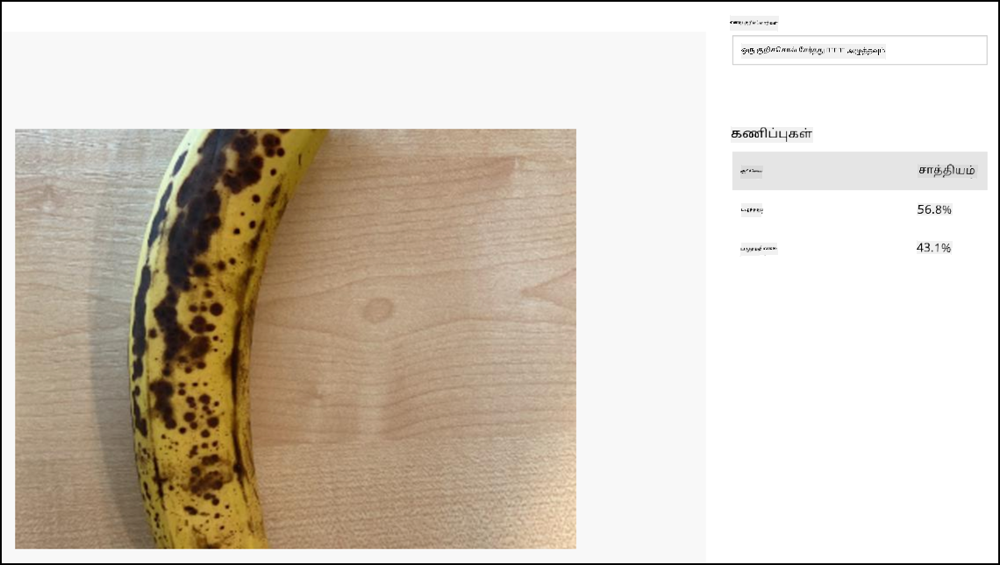

<!--
CO_OP_TRANSLATOR_METADATA:
{
  "original_hash": "32a1f23e7834fbe7715da8c4ebb450b9",
  "translation_date": "2025-10-11T11:47:22+00:00",
  "source_file": "4-manufacturing/lessons/2-check-fruit-from-device/wio-terminal-classify-image.md",
  "language_code": "ta"
}
-->
# ஒரு படத்தை வகைப்படுத்துதல் - Wio Terminal

இந்த பாடத்தின் இந்த பகுதியில், கேமரா மூலம் பிடிக்கப்பட்ட படத்தை Custom Vision சேவைக்கு அனுப்பி அதை வகைப்படுத்துவீர்கள்.

## ஒரு படத்தை வகைப்படுத்துதல்

Custom Vision சேவைக்கு REST API உள்ளது, இதன் மூலம் Wio Terminal பயன்படுத்தி படங்களை வகைப்படுத்தலாம். இந்த REST API HTTPS இணைப்பின் மூலம் அணுகப்படுகிறது - இது ஒரு பாதுகாப்பான HTTP இணைப்பு.

HTTPS முடிவுகளுடன் தொடர்பு கொள்ளும்போது, கிளையண்ட் குறியீடு அணுகப்படும் சர்வரிலிருந்து பொது விசை சான்றிதழை கோர வேண்டும், மேலும் அது அனுப்பும் தகவல்களை குறியாக்கம் செய்ய பயன்படுத்த வேண்டும். உங்கள் வலை உலாவி இதை தானாகவே செய்கிறது, ஆனால் மைக்ரோகண்ட்ரோலர்கள் செய்யாது. நீங்கள் இந்த சான்றிதழை கையேடு மூலம் கோர வேண்டும் மற்றும் REST API க்கு ஒரு பாதுகாப்பான இணைப்பை உருவாக்க அதை பயன்படுத்த வேண்டும். இந்த சான்றிதழ்கள் மாறுவதில்லை, எனவே ஒரு முறை சான்றிதழை பெற்ற பிறகு, அதை உங்கள் பயன்பாட்டில் கடினமாக குறியீடு செய்யலாம்.

இந்த சான்றிதழ்களில் பொது விசைகள் உள்ளன, அவற்றை பாதுகாப்பாக வைத்திருக்க தேவையில்லை. நீங்கள் அவற்றை உங்கள் மூலக் குறியீட்டில் பயன்படுத்தலாம் மற்றும் GitHub போன்ற பொது இடங்களில் பகிரலாம்.

### பணிகள் - SSL கிளையண்டை அமைக்கவும்

1. `fruit-quality-detector` செயலி திட்டத்தை திறக்கவும், அது ஏற்கனவே திறக்கப்படவில்லை என்றால்.

1. `config.h` தலைப்பு கோப்பை திறந்து, பின்வரும் குறியீட்டை சேர்க்கவும்:

    ```cpp
    const char *CERTIFICATE =
        "-----BEGIN CERTIFICATE-----\r\n"
        "MIIF8zCCBNugAwIBAgIQAueRcfuAIek/4tmDg0xQwDANBgkqhkiG9w0BAQwFADBh\r\n"
        "MQswCQYDVQQGEwJVUzEVMBMGA1UEChMMRGlnaUNlcnQgSW5jMRkwFwYDVQQLExB3\r\n"
        "d3cuZGlnaWNlcnQuY29tMSAwHgYDVQQDExdEaWdpQ2VydCBHbG9iYWwgUm9vdCBH\r\n"
        "MjAeFw0yMDA3MjkxMjMwMDBaFw0yNDA2MjcyMzU5NTlaMFkxCzAJBgNVBAYTAlVT\r\n"
        "MR4wHAYDVQQKExVNaWNyb3NvZnQgQ29ycG9yYXRpb24xKjAoBgNVBAMTIU1pY3Jv\r\n"
        "c29mdCBBenVyZSBUTFMgSXNzdWluZyBDQSAwNjCCAiIwDQYJKoZIhvcNAQEBBQAD\r\n"
        "ggIPADCCAgoCggIBALVGARl56bx3KBUSGuPc4H5uoNFkFH4e7pvTCxRi4j/+z+Xb\r\n"
        "wjEz+5CipDOqjx9/jWjskL5dk7PaQkzItidsAAnDCW1leZBOIi68Lff1bjTeZgMY\r\n"
        "iwdRd3Y39b/lcGpiuP2d23W95YHkMMT8IlWosYIX0f4kYb62rphyfnAjYb/4Od99\r\n"
        "ThnhlAxGtfvSbXcBVIKCYfZgqRvV+5lReUnd1aNjRYVzPOoifgSx2fRyy1+pO1Uz\r\n"
        "aMMNnIOE71bVYW0A1hr19w7kOb0KkJXoALTDDj1ukUEDqQuBfBxReL5mXiu1O7WG\r\n"
        "0vltg0VZ/SZzctBsdBlx1BkmWYBW261KZgBivrql5ELTKKd8qgtHcLQA5fl6JB0Q\r\n"
        "gs5XDaWehN86Gps5JW8ArjGtjcWAIP+X8CQaWfaCnuRm6Bk/03PQWhgdi84qwA0s\r\n"
        "sRfFJwHUPTNSnE8EiGVk2frt0u8PG1pwSQsFuNJfcYIHEv1vOzP7uEOuDydsmCjh\r\n"
        "lxuoK2n5/2aVR3BMTu+p4+gl8alXoBycyLmj3J/PUgqD8SL5fTCUegGsdia/Sa60\r\n"
        "N2oV7vQ17wjMN+LXa2rjj/b4ZlZgXVojDmAjDwIRdDUujQu0RVsJqFLMzSIHpp2C\r\n"
        "Zp7mIoLrySay2YYBu7SiNwL95X6He2kS8eefBBHjzwW/9FxGqry57i71c2cDAgMB\r\n"
        "AAGjggGtMIIBqTAdBgNVHQ4EFgQU1cFnOsKjnfR3UltZEjgp5lVou6UwHwYDVR0j\r\n"
        "BBgwFoAUTiJUIBiV5uNu5g/6+rkS7QYXjzkwDgYDVR0PAQH/BAQDAgGGMB0GA1Ud\r\n"
        "JQQWMBQGCCsGAQUFBwMBBggrBgEFBQcDAjASBgNVHRMBAf8ECDAGAQH/AgEAMHYG\r\n"
        "CCsGAQUFBwEBBGowaDAkBggrBgEFBQcwAYYYaHR0cDovL29jc3AuZGlnaWNlcnQu\r\n"
        "Y29tMEAGCCsGAQUFBzAChjRodHRwOi8vY2FjZXJ0cy5kaWdpY2VydC5jb20vRGln\r\n"
        "aUNlcnRHbG9iYWxSb290RzIuY3J0MHsGA1UdHwR0MHIwN6A1oDOGMWh0dHA6Ly9j\r\n"
        "cmwzLmRpZ2ljZXJ0LmNvbS9EaWdpQ2VydEdsb2JhbFJvb3RHMi5jcmwwN6A1oDOG\r\n"
        "MWh0dHA6Ly9jcmw0LmRpZ2ljZXJ0LmNvbS9EaWdpQ2VydEdsb2JhbFJvb3RHMi5j\r\n"
        "cmwwHQYDVR0gBBYwFDAIBgZngQwBAgEwCAYGZ4EMAQICMBAGCSsGAQQBgjcVAQQD\r\n"
        "AgEAMA0GCSqGSIb3DQEBDAUAA4IBAQB2oWc93fB8esci/8esixj++N22meiGDjgF\r\n"
        "+rA2LUK5IOQOgcUSTGKSqF9lYfAxPjrqPjDCUPHCURv+26ad5P/BYtXtbmtxJWu+\r\n"
        "cS5BhMDPPeG3oPZwXRHBJFAkY4O4AF7RIAAUW6EzDflUoDHKv83zOiPfYGcpHc9s\r\n"
        "kxAInCedk7QSgXvMARjjOqdakor21DTmNIUotxo8kHv5hwRlGhBJwps6fEVi1Bt0\r\n"
        "trpM/3wYxlr473WSPUFZPgP1j519kLpWOJ8z09wxay+Br29irPcBYv0GMXlHqThy\r\n"
        "8y4m/HyTQeI2IMvMrQnwqPpY+rLIXyviI2vLoI+4xKE4Rn38ZZ8m\r\n"
        "-----END CERTIFICATE-----\r\n";
    ```

   இது *Microsoft Azure DigiCert Global Root G2 certificate* ஆகும் - இது உலகளாவிய அளவில் பல Azure சேவைகளால் பயன்படுத்தப்படும் சான்றிதழ்களில் ஒன்றாகும்.

   > 💁 இது பயன்படுத்த வேண்டிய சான்றிதழ் என்பதைப் பார்க்க, macOS அல்லது Linux இல் பின்வரும் கட்டளையை இயக்கவும். நீங்கள் Windows பயன்படுத்தினால், இந்த கட்டளையை [Windows Subsystem for Linux (WSL)](https://docs.microsoft.com/windows/wsl/?WT.mc_id=academic-17441-jabenn) பயன்படுத்தி இயக்கலாம்:
   >
    > ```sh
    > openssl s_client -showcerts -verify 5 -connect api.cognitive.microsoft.com:443
    > ```
    >
   > வெளியீட்டில் DigiCert Global Root G2 சான்றிதழ் பட்டியலிடப்படும்.

1. `main.cpp` ஐ திறந்து பின்வரும் include directive ஐ சேர்க்கவும்:

    ```cpp
    #include <WiFiClientSecure.h>
    ```

1. Include directive களின் கீழ், `WifiClientSecure` இன் ஒரு எடுத்துக்காட்டை அறிவிக்கவும்:

    ```cpp
    WiFiClientSecure client;
    ```

   இந்த வகுப்பு HTTPS மூலம் வலை முடிவுகளுடன் தொடர்பு கொள்ள குறியீட்டை கொண்டுள்ளது.

1. `connectWiFi` முறைமையில், WiFiClientSecure ஐ DigiCert Global Root G2 சான்றிதழைப் பயன்படுத்த அமைக்கவும்:

    ```cpp
    client.setCACert(CERTIFICATE);
    ```

### பணிகள் - ஒரு படத்தை வகைப்படுத்தவும்

1. `platformio.ini` கோப்பில் உள்ள `lib_deps` பட்டியலில் பின்வரும் வரியை கூடுதலாக சேர்க்கவும்:

    ```ini
    bblanchon/ArduinoJson @ 6.17.3
    ```

   இது [ArduinoJson](https://arduinojson.org) என்ற Arduino JSON நூலகத்தை இறக்குமதி செய்கிறது, இது REST API இன் JSON பதிலை டிகோடு செய்ய பயன்படுத்தப்படும்.

1. `config.h` இல், Custom Vision சேவியின் prediction URL மற்றும் Key க்கான மாறிலிகளை சேர்க்கவும்:

    ```cpp
    const char *PREDICTION_URL = "<PREDICTION_URL>";
    const char *PREDICTION_KEY = "<PREDICTION_KEY>";
    ```

   `<PREDICTION_URL>` ஐ Custom Vision இன் prediction URL உடன் மாற்றவும். `<PREDICTION_KEY>` ஐ prediction key உடன் மாற்றவும்.

1. `main.cpp` இல், ArduinoJson நூலகத்திற்கான include directive ஐ சேர்க்கவும்:

    ```cpp
    #include <ArduinoJSON.h>
    ```

1. பின்வரும் செயல்பாட்டை `main.cpp` இல் சேர்க்கவும், `buttonPressed` செயல்பாட்டுக்கு மேல்:

    ```cpp
    void classifyImage(byte *buffer, uint32_t length)
    {
        HTTPClient httpClient;
        httpClient.begin(client, PREDICTION_URL);
        httpClient.addHeader("Content-Type", "application/octet-stream");
        httpClient.addHeader("Prediction-Key", PREDICTION_KEY);
    
        int httpResponseCode = httpClient.POST(buffer, length);
    
        if (httpResponseCode == 200)
        {
            String result = httpClient.getString();
    
            DynamicJsonDocument doc(1024);
            deserializeJson(doc, result.c_str());
    
            JsonObject obj = doc.as<JsonObject>();
            JsonArray predictions = obj["predictions"].as<JsonArray>();
    
            for(JsonVariant prediction : predictions) 
            {
                String tag = prediction["tagName"].as<String>();
                float probability = prediction["probability"].as<float>();
    
                char buff[32];
                sprintf(buff, "%s:\t%.2f%%", tag.c_str(), probability * 100.0);
                Serial.println(buff);
            }
        }
    
        httpClient.end();
    }
    ```

   இந்த குறியீடு முதலில் ஒரு `HTTPClient` ஐ அறிவிக்கிறது - இது REST API களுடன் தொடர்பு கொள்ளும் முறைமைகளை கொண்ட ஒரு வகுப்பு. பின்னர், அது கிளையண்டை Azure பொது விசையுடன் அமைக்கப்பட்ட WiFiClientSecure எடுத்துக்காட்டைப் பயன்படுத்தி prediction URL க்கு இணைக்கிறது.

   இணைக்கப்பட்ட பிறகு, இது தலைப்புகளை அனுப்புகிறது - இது REST API க்கு எதிராக செய்யப்படும் கோரிக்கையைப் பற்றிய தகவல்களை கொண்டுள்ளது. `Content-Type` தலைப்பு API அழைப்பு கச்சா பைனரி தரவை அனுப்பும் என்பதை குறிக்கிறது, `Prediction-Key` தலைப்பு Custom Vision prediction key ஐ அனுப்புகிறது.

   அடுத்ததாக, HTTP கிளையண்டில் ஒரு POST கோரிக்கை செய்யப்படுகிறது, இது பைட் வரிசையை பதிவேற்றுகிறது. இந்த பைட் வரிசை இந்த செயல்பாடு அழைக்கப்படும் போது கேமராவில் பிடிக்கப்பட்ட JPEG படத்தை கொண்டிருக்கும்.

   > 💁 POST கோரிக்கைகள் தரவை அனுப்பவும், பதிலைப் பெறவும் பயன்படுத்தப்படுகின்றன. GET கோரிக்கைகள் போன்ற பிற கோரிக்கை வகைகள் தரவை மீட்டெடுக்கின்றன. உங்கள் வலை உலாவி வலைப்பக்கங்களை ஏற்ற GET கோரிக்கைகளை பயன்படுத்துகிறது.

   POST கோரிக்கை ஒரு பதில் நிலை குறியீட்டை திருப்புகிறது. இவை நன்கு வரையறுக்கப்பட்ட மதிப்புகள், 200 என்றால் **OK** - POST கோரிக்கை வெற்றிகரமாக முடிந்தது.

   > 💁 அனைத்து பதில் நிலை குறியீடுகளையும் [List of HTTP status codes page on Wikipedia](https://wikipedia.org/wiki/List_of_HTTP_status_codes) இல் காணலாம்.

   200 திரும்பினால், முடிவுகள் HTTP கிளையண்டிலிருந்து படிக்கப்படும். இது REST API யின் முன்னறிவிப்பு முடிவுகளுடன் ஒரு JSON ஆவணமாக ஒரு உரை பதிலாக இருக்கும். JSON பின்வரும் வடிவத்தில் இருக்கும்:

    ```jSON
    {
        "id":"45d614d3-7d6f-47e9-8fa2-04f237366a16",
        "project":"135607e5-efac-4855-8afb-c93af3380531",
        "iteration":"04f1c1fa-11ec-4e59-bb23-4c7aca353665",
        "created":"2021-06-10T17:58:58.959Z",
        "predictions":[
            {
                "probability":0.5582016,
                "tagId":"05a432ea-9718-4098-b14f-5f0688149d64",
                "tagName":"ripe"
            },
            {
                "probability":0.44179836,
                "tagId":"bb091037-16e5-418e-a9ea-31c6a2920f17",
                "tagName":"unripe"
            }
        ]
    }
    ```

   இங்கு முக்கியமான பகுதி `predictions` வரிசை ஆகும். இது முன்னறிவிப்புகளை கொண்டுள்ளது, ஒவ்வொரு குறிச்சொல்லுக்கும் ஒரு நுழைவு, அதில் குறிச்சொல் பெயரும் சாத்தியமான சதவீதமும் இருக்கும். திரும்பிய சாத்தியங்கள் 0-1 வரை மிதவை எண்களாக இருக்கும், 0 என்பது அந்த குறிச்சொல்லுடன் பொருந்தும் சாத்தியத்தின் 0% ஆகும், 1 என்பது 100% ஆகும்.

   > 💁 பட வகைப்பாளர்கள் பயன்படுத்திய அனைத்து குறிச்சொற்களுக்கும் சதவீதங்களை திருப்புவார்கள். ஒவ்வொரு குறிச்சொல்லுக்கும் அந்த படத்தை அந்த குறிச்சொல்லுடன் பொருந்தும் சாத்தியம் இருக்கும்.

   இந்த JSON டிகோடு செய்யப்படுகிறது, மேலும் ஒவ்வொரு குறிச்சொல்லுக்கும் சாத்தியங்கள் சீரியல் மானிட்டருக்கு அனுப்பப்படுகின்றன.

1. `buttonPressed` செயல்பாட்டில், SD கார்டில் சேமிக்கும் குறியீட்டை `classifyImage` அழைப்புடன் மாற்றவும் அல்லது படம் எழுதப்பட்ட பிறகு, ஆனால் **buffer நீக்கப்படுவதற்கு முன்** அதைச் சேர்க்கவும்:

    ```cpp
    classifyImage(buffer, length);
    ```

   > 💁 நீங்கள் SD கார்டில் சேமிக்கும் குறியீட்டை மாற்றினால், உங்கள் குறியீட்டை சுத்தமாக்க `setupSDCard` மற்றும் `saveToSDCard` செயல்பாடுகளை நீக்கலாம்.

1. உங்கள் குறியீட்டை பதிவேற்றி இயக்கவும். கேமராவை சில பழங்களின் மீது திருப்பி, C பொத்தானை அழுத்தவும். நீங்கள் சீரியல் மானிட்டரில் வெளியீட்டை காணலாம்:

    ```output
    Connecting to WiFi..
    Connected!
    Image captured
    Image read to buffer with length 8200
    ripe:   56.84%
    unripe: 43.16%
    ```

   நீங்கள் எடுத்த படத்தையும், இந்த மதிப்புகளையும் Custom Vision இன் **Predictions** தாவலில் காணலாம்.

   

> 💁 இந்த குறியீட்டை [code-classify/wio-terminal](../../../../../4-manufacturing/lessons/2-check-fruit-from-device/code-classify/wio-terminal) கோப்புறையில் காணலாம்.

😀 உங்கள் பழ தரம் வகைப்பாளர் செயலி வெற்றிகரமாக முடிந்தது!

---

**குறிப்பு**:  
இந்த ஆவணம் [Co-op Translator](https://github.com/Azure/co-op-translator) என்ற AI மொழிபெயர்ப்பு சேவையை பயன்படுத்தி மொழிபெயர்க்கப்பட்டுள்ளது. எங்கள் நோக்கம் துல்லியமாக இருக்க வேண்டும் என்பதுதான், ஆனால் தானியங்கி மொழிபெயர்ப்புகளில் பிழைகள் அல்லது துல்லியமின்மைகள் இருக்கக்கூடும் என்பதை தயவுசெய்து கவனத்தில் கொள்ளவும். அதன் தாய்மொழியில் உள்ள மூல ஆவணம் அதிகாரப்பூர்வ ஆதாரமாக கருதப்பட வேண்டும். முக்கியமான தகவல்களுக்கு, தொழில்முறை மனித மொழிபெயர்ப்பு பரிந்துரைக்கப்படுகிறது. இந்த மொழிபெயர்ப்பைப் பயன்படுத்துவதால் ஏற்படும் எந்த தவறான புரிதல்கள் அல்லது தவறான விளக்கங்களுக்கு நாங்கள் பொறுப்பல்ல.