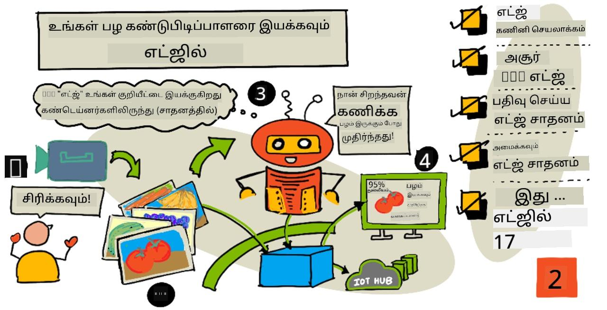
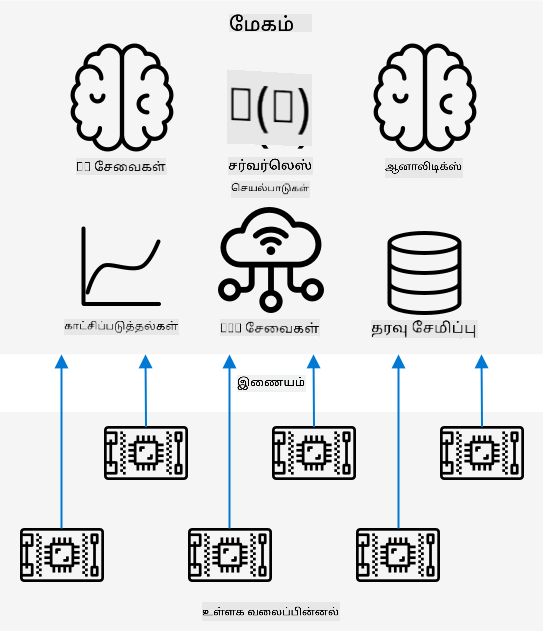
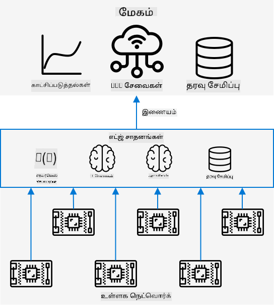
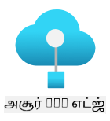
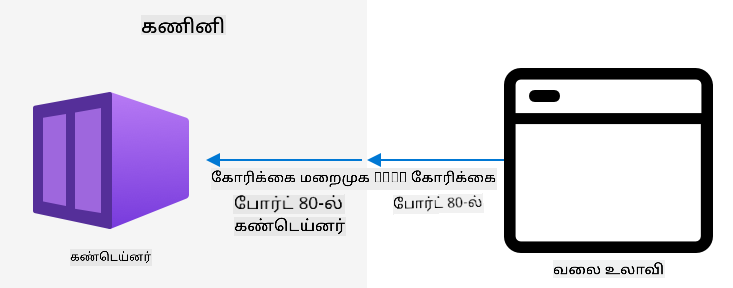
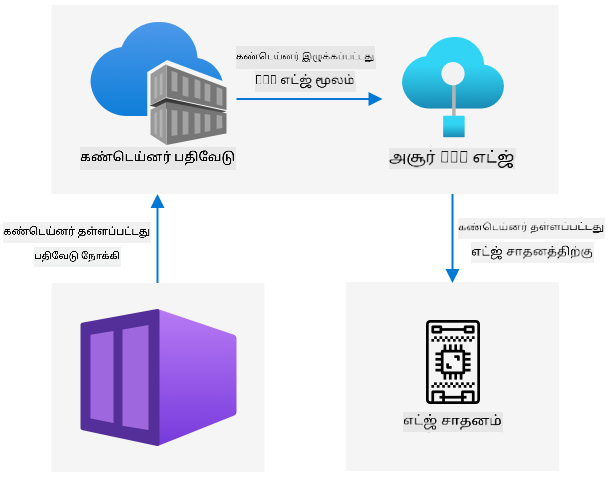

<!--
CO_OP_TRANSLATOR_METADATA:
{
  "original_hash": "2625af24587465c5547ae33d6cc000a5",
  "translation_date": "2025-10-11T11:40:49+00:00",
  "source_file": "4-manufacturing/lessons/3-run-fruit-detector-edge/README.md",
  "language_code": "ta"
}
-->
# உங்கள் பழம் கண்டறியக்கூடிய சாதனத்தை எட்ஜில் இயக்குங்கள்



> சித்திரம்: [நித்யா நரசிம்மன்](https://github.com/nitya). பெரிய பதிப்பை பார்க்க படத்தை கிளிக் செய்யவும்.

இந்த வீடியோ IoT சாதனங்களில் படங்களை வகைப்படுத்தும் செயலியை இயக்குவது பற்றிய ஒரு சுருக்கத்தை வழங்குகிறது, இது இந்த பாடத்தில் உள்ள தலைப்பு.

[](https://www.youtube.com/watch?v=_K5fqGLO8us)

## பாடத்திற்கு முன் கேள்வி

[பாடத்திற்கு முன் கேள்வி](https://black-meadow-040d15503.1.azurestaticapps.net/quiz/33)

## அறிமுகம்

கடந்த பாடத்தில், உங்கள் படங்களை வகைப்படுத்தும் செயலியை பயன்படுத்தி பழம் பழுத்ததா அல்லது பழுத்ததில்லையா என்பதை வகைப்படுத்தினீர்கள். IoT சாதனத்தின் கேமரா மூலம் பிடிக்கப்பட்ட படத்தை இணையத்தில் ஒரு கிளவுட் சேவைக்கு அனுப்பினீர்கள். இந்த அழைப்புகள் நேரம் எடுத்துக்கொள்கின்றன, செலவாகின்றன, மேலும் நீங்கள் பயன்படுத்தும் பட தரவின் வகையைப் பொறுத்து, தனியுரிமை தொடர்பான பிரச்சினைகள் இருக்கக்கூடும்.

இந்த பாடத்தில், நீங்கள் எட்ஜில் இயங்கும் இயந்திர கற்றல் (ML) மாதிரிகளைப் பற்றி கற்றுக்கொள்வீர்கள் - உங்கள் சொந்த நெட்வொர்க்கில் இயங்கும் IoT சாதனங்களில், கிளவுட் சேவைகளில் அல்ல. எட்ஜ் கம்ப்யூட்டிங் மற்றும் கிளவுட் கம்ப்யூட்டிங்கின் நன்மைகள் மற்றும் குறைகள், உங்கள் AI மாதிரியை எட்ஜில் எப்படி பிரசுரிக்க வேண்டும், மற்றும் அதை IoT சாதனத்திலிருந்து எப்படி அணுக வேண்டும் என்பதை நீங்கள் கற்றுக்கொள்வீர்கள்.

இந்த பாடத்தில் நாம் கற்றுக்கொள்ளப்போகிறோம்:

* [எட்ஜ் கம்ப்யூட்டிங்](../../../../../4-manufacturing/lessons/3-run-fruit-detector-edge)
* [Azure IoT Edge](../../../../../4-manufacturing/lessons/3-run-fruit-detector-edge)
* [IoT Edge சாதனத்தை பதிவு செய்யவும்](../../../../../4-manufacturing/lessons/3-run-fruit-detector-edge)
* [IoT Edge சாதனத்தை அமைக்கவும்](../../../../../4-manufacturing/lessons/3-run-fruit-detector-edge)
* [உங்கள் மாதிரியை ஏற்றுமதி செய்யவும்](../../../../../4-manufacturing/lessons/3-run-fruit-detector-edge)
* [பிரசுரத்திற்கான உங்கள் கன்டெய்னரை தயாரிக்கவும்](../../../../../4-manufacturing/lessons/3-run-fruit-detector-edge)
* [உங்கள் கன்டெய்னரை பிரசுரிக்கவும்](../../../../../4-manufacturing/lessons/3-run-fruit-detector-edge)
* [உங்கள் IoT Edge சாதனத்தை பயன்படுத்தவும்](../../../../../4-manufacturing/lessons/3-run-fruit-detector-edge)

## எட்ஜ் கம்ப்யூட்டிங்

எட்ஜ் கம்ப்யூட்டிங் என்பது IoT தரவுகளை உருவாக்கும் இடத்திற்கு όσο அருகில் இருக்கும்விதமாக கணினிகளை வைத்திருப்பதை குறிக்கிறது. இந்த செயல்பாடுகள் கிளவுடில் இல்லாமல், உங்கள் உள்ளக நெட்வொர்க்கில் நடைபெறுகிறது.



இதுவரை உள்ள பாடங்களில், நீங்கள் சாதனங்களை தரவுகளை சேகரித்து, அதை கிளவுடில் அனுப்பி, கிளவுடில் செயல்பாடுகளை அல்லது AI மாதிரிகளை இயக்கி, பகுப்பாய்வு செய்தீர்கள்.



எட்ஜ் கம்ப்யூட்டிங் என்பது சில கிளவுட் சேவைகளை கிளவுடிலிருந்து எட்ஜ் சாதனங்களுக்கு மாற்றுவது, அவை IoT சாதனங்களின் நெட்வொர்க்கில் இயங்குகின்றன. உதாரணமாக, நீங்கள் AI மாதிரிகளை எட்ஜ் சாதனங்களில் இயக்கி பழம் பழுத்ததா என்பதை பகுப்பாய்வு செய்யலாம், மேலும் கிளவுடுக்கு அனுப்புவது, பழுத்த பழங்களின் எண்ணிக்கை போன்ற பகுப்பாய்வுகளை மட்டுமே.

✅ இதுவரை நீங்கள் உருவாக்கிய IoT பயன்பாடுகளை நினைவில் கொள்ளுங்கள். அவற்றில் எந்த பகுதிகளை எட்ஜுக்கு மாற்றலாம்?

### நன்மைகள்

எட்ஜ் கம்ப்யூட்டிங்கின் நன்மைகள்:

1. **வேகம்** - எட்ஜ் கம்ப்யூட்டிங் நேரத்தை மிக்க தரவுகளுக்கு உகந்தது, ஏனெனில் செயல்பாடுகள் சாதனத்தின் நெட்வொர்க்கில் நடைபெறுகிறது, இணையத்தின் வழியாக அழைப்புகளை செய்யாமல். இது அதிக வேகத்தை வழங்குகிறது, ஏனெனில் உள்ளக நெட்வொர்க்குகள் இணைய இணைப்புகளின் வேகத்தை விட அதிகமாக இயங்க முடியும், மேலும் தரவுகள் குறுகிய தூரம் பயணிக்கின்றன.

    > 💁 ஒளி வேகத்தில் தரவுகளை பயணிக்கச் செய்யும் ஆப்டிகல் கேபிள்கள் இணைய இணைப்புகளுக்கு பயன்படுத்தப்பட்டாலும், தரவுகள் கிளவுட் வழங்குநர்களுக்கு உலகம் முழுவதும் பயணிக்க நேரம் எடுக்கும். உதாரணமாக, நீங்கள் யூரோப்பில் இருந்து US கிளவுட் சேவைகளுக்கு தரவுகளை அனுப்பினால், ஆப்டிகல் கேபிளில் அட்லாண்டிக் கடலை கடக்க குறைந்தது 28ms ஆகும், மேலும் தரவுகளை கேபிளுக்கு அனுப்ப, மின்சாரத்தை ஒளி சிக்னல்களாக மாற்ற, மறுபடியும் மாற்ற, மற்றும் கிளவுட் வழங்குநருக்கு அனுப்ப நேரம் எடுக்கும்.

    எட்ஜ் கம்ப்யூட்டிங் குறைந்த நெட்வொர்க் போக்குவரத்தை தேவைப்படுத்துகிறது, உங்கள் தரவுகள் இணைய இணைப்பின் வரையறுக்கப்பட்ட பேண்ட்விட்தில் நெருக்கடியில் சிக்காமல் இருக்க உதவுகிறது.

1. **தொலை அணுகல்** - எட்ஜ் கம்ப்யூட் குறைந்த அல்லது இல்லாத இணைப்பு அல்லது தொடர்ந்து பயன்படுத்த செலவாகும் இணைப்பில் வேலை செய்ய உதவுகிறது. உதாரணமாக, மனிதாபிமான பேரழிவு பகுதிகளில் அல்லது வளர்ந்து வரும் நாடுகளில்.

1. **குறைந்த செலவுகள்** - தரவுகளை சேகரிப்பு, சேமிப்பு, பகுப்பாய்வு, மற்றும் செயல்பாடுகளை எட்ஜ் சாதனத்தில் செய்யும் போது, கிளவுட் சேவைகளை குறைவாக பயன்படுத்துவதால் IoT பயன்பாட்டின் மொத்த செலவை குறைக்க முடியும். AI வேலைப்பாடுகளை GPU அடிப்படையிலான ஹார்ட்வேரில் இயக்கக்கூடிய [Jetson Nano from NVIDIA](https://developer.nvidia.com/embedded/jetson-nano-developer-kit) போன்ற AI ஆக்சிலரேட்டர் போர்டுகள் போன்ற சாதனங்களில் சமீபத்தில் அதிகரிப்பு ஏற்பட்டுள்ளது, இது US$100 க்கும் குறைவாக செலவாகும்.

1. **தனியுரிமை மற்றும் பாதுகாப்பு** - எட்ஜ் கம்ப்யூட்டில், தரவுகள் உங்கள் நெட்வொர்க்கில் தங்கி, கிளவுடுக்கு பதிவேற்றப்படாது. இது பெரும்பாலும் நுண்ணறிவு மற்றும் தனிப்பட்ட தகவல்களுக்கு விரும்பப்படுகிறது, குறிப்பாக தரவுகள் பகுப்பாய்வு செய்யப்பட்ட பிறகு சேமிக்க தேவையில்லாததால், தரவுகள் கசிவுகளின் அபாயத்தை மிகவும் குறைக்கிறது. உதாரணங்கள்: மருத்துவ தரவுகள் மற்றும் பாதுகாப்பு கேமரா காட்சிகள்.

1. **பாதுகாப்பற்ற சாதனங்களை கையாளுதல்** - உங்கள் நெட்வொர்க்குடன் அல்லது இணையத்துடன் நேரடியாக இணைக்க விரும்பாத பாதுகாப்பு குறைபாடுகள் உள்ள சாதனங்கள் இருந்தால், அவற்றை தனி நெட்வொர்க்கில் IoT Edge சாதனத்துடன் இணைக்கலாம். இந்த எட்ஜ் சாதனம் உங்கள் பரந்த நெட்வொர்க்குடன் அல்லது இணையத்துடன் இணைக்கவும், தரவுப் போக்குகளை மேலாண்மை செய்யவும் முடியும்.

1. **இணக்கமற்ற சாதனங்களுக்கு ஆதரவு** - IoT Hub-க்கு இணைக்க முடியாத சாதனங்கள் இருந்தால், உதாரணமாக HTTP இணைப்புகளை மட்டுமே பயன்படுத்தும் சாதனங்கள் அல்லது Bluetooth மட்டுமே கொண்ட சாதனங்கள், IoT Edge சாதனத்தை ஒரு கேட்வே சாதனமாக பயன்படுத்தி, IoT Hub-க்கு செய்திகளை அனுப்பலாம்.

✅ சில ஆராய்ச்சி செய்யுங்கள்: எட்ஜ் கம்ப்யூட்டிங்கிற்கு மேலும் என்ன நன்மைகள் இருக்கலாம்?

### குறைகள்

எட்ஜ் கம்ப்யூட்டிங்கிற்கு சில குறைகள் உள்ளன, கிளவுட் சில சந்தர்ப்பங்களில் விரும்பத்தக்கதாக இருக்கலாம்:

1. **அளவீடு மற்றும் நெகிழ்வுத்தன்மை** - கிளவுட் கம்ப்யூட்டிங் நெட்வொர்க் மற்றும் தரவுத் தேவைகளுக்கு நேரடியாக சரிசெய்ய முடியும், மேலும் சாதனங்களைச் சேர்க்க அல்லது குறைக்க முடியும். மேலும் எட்ஜ் கணினிகளைச் சேர்க்க, சாதனங்களை கையால் சேர்க்க வேண்டும்.

1. **நம்பகத்தன்மை மற்றும் மீட்பு திறன்** - கிளவுட் கம்ப்யூட்டிங் பல இடங்களில் பல சர்வர்களை வழங்குகிறது, மீட்பு மற்றும் பேரழிவு மேலாண்மைக்காக. எட்ஜில் அதே அளவிலான மீட்பு திறனை பெற, பெரிய முதலீடுகள் மற்றும் அதிகமான அமைப்புகள் தேவைப்படும்.

1. **பராமரிப்பு** - கிளவுட் சேவை வழங்குநர்கள் அமைப்பு பராமரிப்பு மற்றும் புதுப்பிப்புகளை வழங்குகிறார்கள்.

✅ சில ஆராய்ச்சி செய்யுங்கள்: எட்ஜ் கம்ப்யூட்டிங்கிற்கு மேலும் என்ன குறைகள் இருக்கலாம்?

கிளவுட் பயன்படுத்துவதற்கான நன்மைகளின் எதிர்மறை அம்சங்களே எட்ஜ் கம்ப்யூட்டிங்கின் குறைகள் - நீங்கள் இந்த சாதனங்களை உருவாக்கி மேலாண்மை செய்ய வேண்டும், கிளவுட் வழங்குநர்களின் திறமை மற்றும் அளவை நம்பாமல்.

சில அபாயங்கள் எட்ஜ் கம்ப்யூட்டிங்கின் இயல்பால் குறைக்கப்படுகின்றன. உதாரணமாக, ஒரு தொழிற்சாலையில் இயந்திரங்களிலிருந்து தரவுகளை சேகரிக்கும் எட்ஜ் சாதனம் இயங்கினால், சில பேரழிவு மீட்பு சூழல்களைப் பற்றி நீங்கள் கவலைப்பட தேவையில்லை. தொழிற்சாலைக்கு மின்சாரம் இல்லாமல் போனால், தரவுகளை உருவாக்கும் இயந்திரங்களும் மின்சாரம் இல்லாமல் இருக்கும், எனவே ஒரு மாற்று எட்ஜ் சாதனம் தேவைப்படாது.

IoT அமைப்புகளுக்கு, நீங்கள் கிளவுட் மற்றும் எட்ஜ் கம்ப்யூட்டிங்கின் கலவையை விரும்புவீர்கள், அமைப்பின் தேவைகள், அதன் வாடிக்கையாளர்கள், மற்றும் பராமரிப்பாளர்களின் அடிப்படையில் ஒவ்வொன்றையும் பயன்படுத்தி.

## Azure IoT Edge



Azure IoT Edge என்பது வேலைப்பாடுகளை கிளவுடிலிருந்து எட்ஜுக்கு நகர்த்த உதவும் ஒரு சேவையாகும். நீங்கள் ஒரு சாதனத்தை எட்ஜ் சாதனமாக அமைக்கலாம், மேலும் கிளவுடிலிருந்து அந்த எட்ஜ் சாதனத்திற்கு குறியீட்டை பிரசுரிக்கலாம். இது கிளவுட் மற்றும் எட்ஜ் திறன்களை கலக்க அனுமதிக்கிறது.

> 🎓 *வேலைப்பாடுகள்* என்பது AI மாதிரிகள், பயன்பாடுகள், அல்லது சர்வர்லெஸ் செயல்பாடுகள் போன்ற எந்த சேவையும் செய்யும் பணிக்கான ஒரு சொல்.

உதாரணமாக, நீங்கள் கிளவுடில் ஒரு படங்களை வகைப்படுத்தும் செயலியை பயிற்றுவிக்கலாம், பின்னர் கிளவுடிலிருந்து அதை ஒரு எட்ஜ் சாதனத்திற்கு பிரசுரிக்கலாம். உங்கள் IoT சாதனம் பின்னர் படங்களை வகைப்படுத்த எட்ஜ் சாதனத்திற்கு அனுப்புகிறது, இணையத்தின் வழியாக படங்களை அனுப்பாமல். நீங்கள் மாதிரியின் புதிய பதிப்பை பிரசுரிக்க வேண்டும் என்றால், அதை கிளவுடில் பயிற்றுவித்து, IoT Edge-ஐப் பயன்படுத்தி எட்ஜ் சாதனத்தில் புதிய பதிப்பை புதுப்பிக்கலாம்.

> 🎓 IoT Edge-க்கு பிரசுரிக்கப்படும் மென்பொருள் *மாட்யூல்கள்* என்று அழைக்கப்படுகிறது. இயல்பாக IoT Edge IoT Hub-இன் தொடர்புகளை நிர்வகிக்கும் மாட்யூல்களை இயக்குகிறது, உதாரணமாக `edgeAgent` மற்றும் `edgeHub` மாட்யூல்கள். நீங்கள் ஒரு படங்களை வகைப்படுத்தும் செயலியை பிரசுரிக்கும்போது, இது கூடுதல் மாட்யூலாக பிரசுரிக்கப்படுகிறது.

IoT Edge IoT Hub-இல் உருவாக்கப்பட்டுள்ளது, எனவே நீங்கள் IoT சாதனங்களை நிர்வகிக்க பயன்படுத்தும் அதே சேவையைப் பயன்படுத்தி எட்ஜ் சாதனங்களை நிர்வகிக்கலாம், அதே அளவிலான பாதுகாப்புடன்.

IoT Edge *கன்டெய்னர்கள்* மூலம் குறியீட்டை இயக்குகிறது - தனித்துவமான பயன்பாடுகள், உங்கள் கணினியில் உள்ள மற்ற பயன்பாடுகளிலிருந்து தனிமைப்படுத்தப்பட்டு இயங்குகின்றன. நீங்கள் ஒரு கன்டெய்னரை இயக்கும்போது, அது உங்கள் கணினிக்குள் ஒரு தனி கணினி போல செயல்படுகிறது, அதன் சொந்த மென்பொருள், சேவைகள் மற்றும் பயன்பாடுகள் இயங்குகின்றன. பெரும்பாலான நேரங்களில், கன்டெய்னர்கள் உங்கள் கணினியில் எதையும் அணுக முடியாது, நீங்கள் ஒரு கோப்புறை போன்றவற்றை பகிர விரும்பினால் மட்டுமே. கன்டெய்னர் பின்னர் ஒரு திறந்த போர்ட்டின் மூலம் சேவைகளை வெளிப்படுத்துகிறது, அதை நீங்கள் உங்கள் நெட்வொர்க்கில் இணைக்கலாம்.



உதாரணமாக, நீங்கள் ஒரு வலைத்தளத்தை போர்ட் 80-ல் இயக்கும் ஒரு கன்டெய்னரை வைத்திருக்கலாம், இது இயல்பான HTTP போர்ட், பின்னர் உங்கள் கணினியில் போர்ட் 80-ல் அதை வெளிப்படுத்தலாம்.

✅ சில ஆராய்ச்சி செய்யுங்கள்: கன்டெய்னர்கள் மற்றும் Docker அல்லது Moby போன்ற சேவைகள் பற்றி படிக்கவும்.

Custom Vision-ஐப் பயன்படுத்தி படங்களை வகைப்படுத்தும் செயலிகளை பதிவிறக்கம் செய்து, கன்டெய்னர்களாக பிரசுரிக்கலாம், நேரடியாக சாதனத்தில் அல்லது IoT Edge வழியாக பிரசுரிக்கலாம். அவை கன்டெய்னரில் இயங்கும் போது, கிளவுட் பதிப்பின் REST API போலவே அணுகலாம், ஆனால் எட்ஜ் சாதனத்தில் இயங்கும் கன்டெய்னரின் எண்ட்பாயிண்டை பயன்படுத்த வேண்டும்.

## IoT Edge சாதனத்தை பதிவு செய்யவும்

IoT Edge சாதனத்தை பயன்படுத்த, அது IoT Hub-இல் பதிவு செய்யப்பட வேண்டும்.

### பணிகள் - IoT Edge சாதனத்தை பதிவு செய்யவும்

1. `fruit-quality-detector` ரிசோர்ஸ் குழுவில் ஒரு IoT Hub உருவாக்கவும். `fruit-quality-detector` அடிப்படையில் ஒரு தனித்துவமான பெயரை கொடுக்கவும்.

1. உங்கள் IoT Hub-இல் `fruit-quality-detector-edge` என்ற IoT Edge சாதனத்தை பதிவு செய்யவும். இதை செய்யும் கட்டளை, ஒரு எட்ஜ் சாதனத்தை பதிவு செய்யும் கட்டளைக்கு ஒத்ததாக இருக்கும், ஆனால் நீங்கள் `--edge-enabled` கொடியை சேர்க்க வேண்டும்.

    ```sh
    az iot hub device-identity create --edge-enabled \
                                      --device-id fruit-quality-detector-edge \
                                      --hub-name <hub_name>
    ```

    `<hub_name>` ஐ உங்கள் IoT Hub-இன் பெயருடன் மாற்றவும்.

1. உங்கள் சாதனத்திற்கான இணைப்பு சரத்தை பெற கீழே உள்ள கட்டளையை பயன்படுத்தவும்:

    ```sh
    az iot hub device-identity connection-string show --device-id fruit-quality-detector-edge \
                                                      --output table \
                                                      --hub-name <hub_name>
    ```

    `<hub_name>` ஐ உங்கள் IoT Hub-இன் பெயருடன் மாற்றவும்.

    வெளியீட்டில் காட்டப்படும் இணைப்பு சரத்தை ஒரு பிரதியை எடுக்கவும்.

## IoT Edge சாதனத்தை அமைக்கவும்

ஒரு எட்ஜ் சாதன பதிவு உங்கள் IoT Hub-இல் உருவாக்கப்பட்ட பிறகு, நீங்கள் எட்ஜ் சாதனத்தை அமைக்கலாம்.

### பணிகள் - IoT Edge Runtime-ஐ நிறுவி தொடங்கவும்

**IoT Edge runtime லினக்ஸ் கன்டெய்னர்களை மட்டுமே இயக்குகிறது.** இது லினக்ஸில் அல்லது Windows-ல் லினக்ஸ் வி.மி.களை (VM) பயன்படுத்தி இயக்க முடியும்.

* உங்கள் IoT சாதனமாக Raspberry Pi-ஐ பயன்படுத்தினால், இது ஆதரிக்கப்படும் லினக்ஸ் பதிப்பை இயக்குகிறது மற்றும் IoT Edge runtime-ஐ ஹோஸ்ட் செய்ய முடியும். [Microsoft docs-ல் Azure IoT Edge-ஐ Linux-க்கு நிறுவும் வழிகாட்டியை](https://docs.microsoft.com/azure/iot-edge/how-to-install-iot-edge?WT.mc_id=academic-17441-jabenn) பின்பற்றி IoT Edge-ஐ நிறுவி, இணைப்பு சரத்தை அமைக்கவும்.

    > 💁 நினைவில் கொள்ளுங்கள், Raspberry Pi OS என்பது Debian Linux-இன் ஒரு மாறுபாடு.

* நீங்கள் Raspberry Pi-ஐ பயன்படுத்தவில்லை, ஆனால் ஒரு லினக்ஸ் கணினி வைத்திருந்தால், IoT Edge runtime-ஐ இயக்க முடியும். [Microsoft docs-ல் Azure IoT Edge-ஐ Linux-க்கு நிறுவும் வழிகாட்டியை](https://docs.microsoft.com/azure/iot-edge/how-to-install-iot-edge?WT.mc_id=academic-17441-jabenn) பின்பற்றி IoT Edge-ஐ நிறுவி, இணைப்பு சரத்தை அமைக்கவும்.

* நீங்கள் Windows-ஐ பயன்படுத்தினால், IoT Edge runtime-ஐ Linux Virtual Machine-ல் நிறுவலாம். [Microsoft docs-ல் Windows சாதனத்தில் IoT Edge மாட்யூலை பிரசுரிக்க விரைவான வழிகாட்டியின் IoT Edge runtime-ஐ நிறுவி தொடங்கும் பகுதியை](https://docs.microsoft.com/azure/iot-edge/quickstart?WT.mc_id=academic-17441-jabenn#install-and-start-the-iot-edge-runtime) பின்பற்றவும். *Deploy a module* பகுதியில் நீங்கள் நிறுத்தலாம்.

* நீங்கள்
நீங்கள் படத்தை வகைப்படுத்தி உருவாக்கிய போது, *Food* டொமைன் பயன்படுத்தப்பட்டது, இது உணவுப் படங்களின் பயிற்சிக்காக சிறப்பாக வடிவமைக்கப்பட்ட மாடல் பதிப்பு. Custom Vision-ல், உங்கள் பயிற்சி தரவுகளைப் பயன்படுத்தி புதிய டொமைனுடன் புதிய மாடலை பயிற்சி செய்ய உங்கள் திட்டத்தின் டொமைனை மாற்றலாம். Custom Vision ஆதரிக்கும் அனைத்து டொமைன்களும் ஸ்டாண்டர்டு மற்றும் காம்பாக்ட் வடிவங்களில் கிடைக்கின்றன.

### பணிகள் - உங்கள் மாடலை Food (compact) டொமைன் மூலம் பயிற்சி செய்யுங்கள்

1. [CustomVision.ai](https://customvision.ai) என்ற Custom Vision போர்ட்டலைத் தொடங்கவும், நீங்கள் ஏற்கனவே திறக்கவில்லை என்றால் உள்நுழையவும். பின்னர் உங்கள் `fruit-quality-detector` திட்டத்தைத் திறக்கவும்.

1. **Settings** பொத்தானை (⚙ ஐகான்) தேர்ந்தெடுக்கவும்.

1. *Domains* பட்டியலில் *Food (compact)* ஐ தேர்ந்தெடுக்கவும்.

1. *Export Capabilities* கீழ், *Basic platforms (Tensorflow, CoreML, ONNX, ...)* தேர்ந்தெடுக்கப்பட்டுள்ளதா என்பதை உறுதிப்படுத்தவும்.

1. Settings பக்கத்தின் கீழே **Save Changes** ஐ தேர்ந்தெடுக்கவும்.

1. **Train** பொத்தானை பயன்படுத்தி மாடலை மீண்டும் பயிற்சி செய்யவும், *Quick training* ஐ தேர்ந்தெடுக்கவும்.

### பணிகள் - உங்கள் மாடலை ஏற்றுமதி செய்யுங்கள்

மாடல் பயிற்சி முடிந்தவுடன், அதை ஒரு கெண்டைனராக ஏற்றுமதி செய்ய வேண்டும்.

1. **Performance** தாவலைத் தேர்ந்தெடுத்து, காம்பாக்ட் டொமைன் மூலம் பயிற்சி செய்யப்பட்ட உங்கள் சமீபத்திய iteration ஐ கண்டறியவும்.

1. மேல் உள்ள **Export** பொத்தானைத் தேர்ந்தெடுக்கவும்.

1. **DockerFile** ஐத் தேர்ந்தெடுத்து, உங்கள் எட்ஜ் சாதனத்துடன் பொருந்தும் பதிப்பைத் தேர்ந்தெடுக்கவும்:

    * நீங்கள் Linux கணினி, Windows கணினி அல்லது Virtual Machine-ல் IoT Edge ஐ இயக்கினால், *Linux* பதிப்பைத் தேர்ந்தெடுக்கவும்.
    * நீங்கள் Raspberry Pi-ல் IoT Edge ஐ இயக்கினால், *ARM (Raspberry Pi 3)* பதிப்பைத் தேர்ந்தெடுக்கவும்.

    > 🎓 Docker என்பது கெண்டைனர்களை நிர்வகிக்க மிகவும் பிரபலமான கருவிகளில் ஒன்றாகும், மேலும் DockerFile என்பது கெண்டைனரை அமைக்க எப்படி என்பதைப் பற்றிய வழிமுறைகளின் தொகுப்பாகும்.

1. Custom Vision-ஐ தொடர்புடைய கோப்புகளை உருவாக்க **Export** ஐத் தேர்ந்தெடுக்கவும், பின்னர் அவற்றை zip கோப்பாக பதிவிறக்க **Download** ஐத் தேர்ந்தெடுக்கவும்.

1. கோப்புகளை உங்கள் கணினியில் சேமித்து, பின்னர் கோப்புறையை unzip செய்யவும்.

## உங்கள் கெண்டைனரை பிரயோகத்திற்கு தயாராக்கவும்



உங்கள் மாடலை பதிவிறக்கம் செய்த பிறகு, அதை ஒரு கெண்டைனராக உருவாக்கி, கெண்டைனர் ரெஜிஸ்ட்ரிக்கு அனுப்ப வேண்டும் - இது கெண்டைனர்களை சேமிக்க நீங்கள் பயன்படுத்தும் ஆன்லைன் இடமாகும். பின்னர் IoT Edge கெண்டைனரை ரெஜிஸ்ட்ரியில் இருந்து பதிவிறக்கம் செய்து உங்கள் சாதனத்திற்கு அனுப்பும்.


இந்த பாடத்திற்கான கெண்டைனர் ரெஜிஸ்ட்ரி Azure Container Registry ஆகும். இது இலவச சேவை அல்ல, எனவே பணத்தைச் சேமிக்க நீங்கள் முடித்தவுடன் உங்கள் [திட்டத்தை சுத்தம் செய்யுங்கள்](../../../clean-up.md).

> 💁 Azure Container Registry பயன்படுத்துவதற்கான செலவுகளை [Azure Container Registry விலை பக்கம்](https://azure.microsoft.com/pricing/details/container-registry/?WT.mc_id=academic-17441-jabenn) இல் காணலாம்.

### பணிகள் - Docker நிறுவவும்

வகைப்படுத்தி கெண்டைனரை உருவாக்கவும், பிரயோகிக்கவும், நீங்கள் [Docker](https://www.docker.com/) ஐ நிறுவ வேண்டும்.

நீங்கள் IoT Edge நிறுவிய சாதனத்திலிருந்து வேறு சாதனத்தில் இருந்து உங்கள் கெண்டைனரை உருவாக்க திட்டமிட்டால் மட்டுமே இதை செய்ய வேண்டும் - IoT Edge நிறுவும் ஒரு பகுதியாக, Docker உங்களுக்கு நிறுவப்படும்.

1. உங்கள் IoT Edge சாதனத்திலிருந்து வேறு சாதனத்தில் Docker கெண்டைனரை உருவாக்கினால், [Docker install page](https://www.docker.com/products/docker-desktop) இல் உள்ள Docker Desktop அல்லது Docker engine நிறுவல் வழிமுறைகளைப் பின்பற்றி Docker ஐ நிறுவவும். நிறுவலுக்குப் பிறகு அது இயங்குகிறதா என்பதை உறுதிப்படுத்தவும்.

### பணிகள் - கெண்டைனர் ரெஜிஸ்ட்ரி வளத்தை உருவாக்கவும்

1. Azure Container Registry வளத்தை உருவாக்க உங்கள் Terminal அல்லது command prompt-ல் பின்வரும் கட்டளையை இயக்கவும்:

    ```sh
    az acr create --resource-group fruit-quality-detector \
                  --sku Basic \
                  --name <Container registry name>
    ```

    `<Container registry name>` ஐ உங்கள் கெண்டைனர் ரெஜிஸ்ட்ரிக்கான தனித்துவமான பெயருடன் மாற்றவும், எழுத்துக்கள் மற்றும் எண்கள் மட்டுமே பயன்படுத்தவும். இதை `fruitqualitydetector` அடிப்படையில் அமைக்கவும். இந்த பெயர் கெண்டைனர் ரெஜிஸ்ட்ரியை அணுக URL இன் ஒரு பகுதியாக மாறுகிறது, எனவே உலகளவில் தனித்துவமானதாக இருக்க வேண்டும்.

1. பின்வரும் கட்டளையைப் பயன்படுத்தி Azure Container Registry-க்கு உள்நுழைக:

    ```sh
    az acr login --name <Container registry name>
    ```

    `<Container registry name>` ஐ உங்கள் கெண்டைனர் ரெஜிஸ்ட்ரி பெயருடன் மாற்றவும்.

1. பின்வரும் கட்டளையைப் பயன்படுத்தி கெண்டைனர் ரெஜிஸ்ட்ரியை நிர்வாக முறையில் அமைக்கவும்:

    ```sh
    az acr update --admin-enabled true \
                 --name <Container registry name>
    ```

    `<Container registry name>` ஐ உங்கள் கெண்டைனர் ரெஜிஸ்ட்ரி பெயருடன் மாற்றவும்.

1. பின்வரும் கட்டளையைப் பயன்படுத்தி உங்கள் கெண்டைனர் ரெஜிஸ்ட்ரிக்கான கடவுச்சொற்களை உருவாக்கவும்:

    ```sh
     az acr credential renew --password-name password \
                             --output table \
                             --name <Container registry name>
    ```

    `<Container registry name>` ஐ உங்கள் கெண்டைனர் ரெஜிஸ்ட்ரி பெயருடன் மாற்றவும்.

    `PASSWORD` மதிப்பை நகலெடுக்கவும், இது உங்களுக்கு பின்னர் தேவைப்படும்.

### பணிகள் - உங்கள் கெண்டைனரை உருவாக்கவும்

Custom Vision-ல் இருந்து நீங்கள் பதிவிறக்கம் செய்தது, கெண்டைனரை எப்படி உருவாக்க வேண்டும் என்பதைப் பற்றிய வழிமுறைகளை கொண்ட DockerFile ஆகும், மேலும் உங்கள் Custom Vision மாடலை ஹோஸ்ட் செய்ய கெண்டைனருக்குள் இயக்கப்படும் பயன்பாட்டு குறியீடு மற்றும் REST API உடன் வருகிறது. Docker ஐ பயன்படுத்தி DockerFile-ல் இருந்து ஒரு டேக் செய்யப்பட்ட கெண்டைனரை உருவாக்கி, அதை உங்கள் கெண்டைனர் ரெஜிஸ்ட்ரிக்கு அனுப்பலாம்.

> 🎓 கெண்டைனர்களுக்கு ஒரு பெயர் மற்றும் பதிப்பை வரையறுக்கும் டேக் வழங்கப்படும். கெண்டைனரை புதுப்பிக்க வேண்டிய போது, அதே டேக் உடன் ஆனால் புதிய பதிப்புடன் அதை உருவாக்கலாம்.

1. உங்கள் டெர்மினல் அல்லது command prompt ஐ திறந்து, Custom Vision-ல் இருந்து பதிவிறக்கம் செய்த unzip செய்யப்பட்ட மாடலுக்கு செல்லவும்.

1. படத்தை உருவாக்கவும், டேக் செய்யவும் பின்வரும் கட்டளையை இயக்கவும்:

    ```sh
    docker build --platform <platform> -t <Container registry name>.azurecr.io/classifier:v1 .
    ```

    `<platform>` ஐ இந்த கெண்டைனர் இயங்கும் தளத்துடன் மாற்றவும். நீங்கள் Raspberry Pi-ல் IoT Edge ஐ இயக்கினால், இதை `linux/armhf` ஆக அமைக்கவும், இல்லையெனில் `linux/amd64` ஆக அமைக்கவும்.

    > 💁 நீங்கள் IoT Edge இயங்கும் சாதனத்திலிருந்து இந்த கட்டளையை இயக்கினால், Raspberry Pi போன்ற உங்கள் சாதனத்திலிருந்து இயக்கினால், தற்போதைய தளத்தை இயல்புநிலை அமைப்பாகக் கொண்டிருப்பதால் `--platform <platform>` பகுதியை தவிர்க்கலாம்.

    `<Container registry name>` ஐ உங்கள் கெண்டைனர் ரெஜிஸ்ட்ரி பெயருடன் மாற்றவும்.

    > 💁 நீங்கள் Linux அல்லது Raspberry Pi OS-ல் இயங்கினால், இந்த கட்டளையை இயக்க `sudo` ஐ பயன்படுத்த வேண்டும்.

    Docker படத்தை உருவாக்கும், தேவையான மென்பொருளை உள்ளடக்கியது. பின்னர் படம் `classifier:v1` என டேக் செய்யப்படும்.

    ```output
    ➜  d4ccc45da0bb478bad287128e1274c3c.DockerFile.Linux docker build --platform linux/amd64 -t  fruitqualitydetectorjimb.azurecr.io/classifier:v1 .
    [+] Building 102.4s (11/11) FINISHED
     => [internal] load build definition from Dockerfile
     => => transferring dockerfile: 131B
     => [internal] load .dockerignore
     => => transferring context: 2B
     => [internal] load metadata for docker.io/library/python:3.7-slim
     => [internal] load build context
     => => transferring context: 905B
     => [1/6] FROM docker.io/library/python:3.7-slim@sha256:b21b91c9618e951a8cbca5b696424fa5e820800a88b7e7afd66bba0441a764d6
     => => resolve docker.io/library/python:3.7-slim@sha256:b21b91c9618e951a8cbca5b696424fa5e820800a88b7e7afd66bba0441a764d6
     => => sha256:b4d181a07f8025e00e0cb28f1cc14613da2ce26450b80c54aea537fa93cf3bda 27.15MB / 27.15MB
     => => sha256:de8ecf497b753094723ccf9cea8a46076e7cb845f333df99a6f4f397c93c6ea9 2.77MB / 2.77MB
     => => sha256:707b80804672b7c5d8f21e37c8396f319151e1298d976186b4f3b76ead9f10c8 10.06MB / 10.06MB
     => => sha256:b21b91c9618e951a8cbca5b696424fa5e820800a88b7e7afd66bba0441a764d6 1.86kB / 1.86kB
     => => sha256:44073386687709c437586676b572ff45128ff1f1570153c2f727140d4a9accad 1.37kB / 1.37kB
     => => sha256:3d94f0f2ca798607808b771a7766f47ae62a26f820e871dd488baeccc69838d1 8.31kB / 8.31kB
     => => sha256:283715715396fd56d0e90355125fd4ec57b4f0773f306fcd5fa353b998beeb41 233B / 233B
     => => sha256:8353afd48f6b84c3603ea49d204bdcf2a1daada15f5d6cad9cc916e186610a9f 2.64MB / 2.64MB
     => => extracting sha256:b4d181a07f8025e00e0cb28f1cc14613da2ce26450b80c54aea537fa93cf3bda
     => => extracting sha256:de8ecf497b753094723ccf9cea8a46076e7cb845f333df99a6f4f397c93c6ea9
     => => extracting sha256:707b80804672b7c5d8f21e37c8396f319151e1298d976186b4f3b76ead9f10c8
     => => extracting sha256:283715715396fd56d0e90355125fd4ec57b4f0773f306fcd5fa353b998beeb41
     => => extracting sha256:8353afd48f6b84c3603ea49d204bdcf2a1daada15f5d6cad9cc916e186610a9f
     => [2/6] RUN pip install -U pip
     => [3/6] RUN pip install --no-cache-dir numpy~=1.17.5 tensorflow~=2.0.2 flask~=1.1.2 pillow~=7.2.0
     => [4/6] RUN pip install --no-cache-dir mscviplib==2.200731.16
     => [5/6] COPY app /app
     => [6/6] WORKDIR /app
     => exporting to image
     => => exporting layers
     => => writing image sha256:1846b6f134431f78507ba7c079358ed66d944c0e185ab53428276bd822400386
     => => naming to fruitqualitydetectorjimb.azurecr.io/classifier:v1
    ```

### பணிகள் - உங்கள் கெண்டைனரை கெண்டைனர் ரெஜிஸ்ட்ரிக்கு அனுப்பவும்

1. உங்கள் கெண்டைனரை கெண்டைனர் ரெஜிஸ்ட்ரிக்கு அனுப்ப பின்வரும் கட்டளையைப் பயன்படுத்தவும்:

    ```sh
    docker push <Container registry name>.azurecr.io/classifier:v1
    ```

    `<Container registry name>` ஐ உங்கள் கெண்டைனர் ரெஜிஸ்ட்ரி பெயருடன் மாற்றவும்.

    > 💁 Linux-ல் இயங்கினால், இந்த கட்டளையை இயக்க `sudo` ஐ பயன்படுத்த வேண்டும்.

    கெண்டைனர் கெண்டைனர் ரெஜிஸ்ட்ரிக்கு அனுப்பப்படும்.

    ```output
    ➜  d4ccc45da0bb478bad287128e1274c3c.DockerFile.Linux docker push fruitqualitydetectorjimb.azurecr.io/classifier:v1
    The push refers to repository [fruitqualitydetectorjimb.azurecr.io/classifier]
    5f70bf18a086: Pushed 
    8a1ba9294a22: Pushed 
    56cf27184a76: Pushed 
    b32154f3f5dd: Pushed 
    36103e9a3104: Pushed 
    e2abb3cacca0: Pushed 
    4213fd357bbe: Pushed 
    7ea163ba4dce: Pushed 
    537313a13d90: Pushed 
    764055ebc9a7: Pushed 
    v1: digest: sha256:ea7894652e610de83a5a9e429618e763b8904284253f4fa0c9f65f0df3a5ded8 size: 2423
    ```

1. அனுப்பலை சரிபார்க்க, உங்கள் ரெஜிஸ்ட்ரியில் உள்ள கெண்டைனர்களை பின்வரும் கட்டளையைப் பயன்படுத்தி பட்டியலிடலாம்:

    ```sh
    az acr repository list --output table \
                           --name <Container registry name> 
    ```

    `<Container registry name>` ஐ உங்கள் கெண்டைனர் ரெஜிஸ்ட்ரி பெயருடன் மாற்றவும்.

    ```output
    ➜  d4ccc45da0bb478bad287128e1274c3c.DockerFile.Linux az acr repository list --name fruitqualitydetectorjimb --output table
    Result
    ----------
    classifier
    ```

    உங்கள் வகைப்படுத்தி வெளியீட்டில் பட்டியலிடப்பட்டிருக்கும்.

## உங்கள் கெண்டைனரை பிரயோகிக்க அனுப்பவும்

உங்கள் கெண்டைனர் இப்போது உங்கள் IoT Edge சாதனத்திற்கு அனுப்பப்படலாம். அனுப்புவதற்கு, deployment manifest எனப்படும் JSON ஆவணத்தை வரையறுக்க வேண்டும் - இது எட்ஜ் சாதனத்திற்கு அனுப்பப்படும் மாடுல்களை பட்டியலிடும் ஆவணம்.

### பணிகள் - deployment manifest உருவாக்கவும்

1. உங்கள் கணினியில் எங்காவது `deployment.json` என்ற புதிய கோப்பை உருவாக்கவும்.

1. இந்த கோப்பில் பின்வருவனவற்றைச் சேர்க்கவும்:

    ```json
    {
        "content": {
            "modulesContent": {
                "$edgeAgent": {
                    "properties.desired": {
                        "schemaVersion": "1.1",
                        "runtime": {
                            "type": "docker",
                            "settings": {
                                "minDockerVersion": "v1.25",
                                "loggingOptions": "",
                                "registryCredentials": {
                                    "ClassifierRegistry": {
                                        "username": "<Container registry name>",
                                        "password": "<Container registry password>",
                                        "address": "<Container registry name>.azurecr.io"
                                      }
                                }
                            }
                        },
                        "systemModules": {
                            "edgeAgent": {
                                "type": "docker",
                                "settings": {
                                    "image": "mcr.microsoft.com/azureiotedge-agent:1.1",
                                    "createOptions": "{}"
                                }
                            },
                            "edgeHub": {
                                "type": "docker",
                                "status": "running",
                                "restartPolicy": "always",
                                "settings": {
                                    "image": "mcr.microsoft.com/azureiotedge-hub:1.1",
                                    "createOptions": "{\"HostConfig\":{\"PortBindings\":{\"5671/tcp\":[{\"HostPort\":\"5671\"}],\"8883/tcp\":[{\"HostPort\":\"8883\"}],\"443/tcp\":[{\"HostPort\":\"443\"}]}}}"
                                }
                            }
                        },
                        "modules": {
                            "ImageClassifier": {
                                "version": "1.0",
                                "type": "docker",
                                "status": "running",
                                "restartPolicy": "always",
                                "settings": {
                                    "image": "<Container registry name>.azurecr.io/classifier:v1",
                                    "createOptions": "{\"ExposedPorts\": {\"80/tcp\": {}},\"HostConfig\": {\"PortBindings\": {\"80/tcp\": [{\"HostPort\": \"80\"}]}}}"
                                }
                            }
                        }
                    }
                },
                "$edgeHub": {
                    "properties.desired": {
                        "schemaVersion": "1.1",
                        "routes": {
                            "upstream": "FROM /messages/* INTO $upstream"
                        },
                        "storeAndForwardConfiguration": {
                            "timeToLiveSecs": 7200
                        }
                    }
                }
            }
        }
    }
    ```

    > 💁 இந்த கோப்பை [code-deployment/deployment](../../../../../4-manufacturing/lessons/3-run-fruit-detector-edge/code-deployment/deployment) கோப்புறையில் காணலாம்.

    `ImageClassifier` மாடுல் பிரிவில் ஒன்று, மற்ற இரண்டு `registryCredentials` பிரிவில் உள்ளன.

    `registryCredentials` பிரிவில் `<Container registry password>` ஐ உங்கள் கெண்டைனர் ரெஜிஸ்ட்ரி கடவுச்சொல்லுடன் மாற்றவும்.

1. உங்கள் deployment manifest உள்ள கோப்புறையிலிருந்து, பின்வரும் கட்டளையை இயக்கவும்:

    ```sh
    az iot edge set-modules --device-id fruit-quality-detector-edge \
                            --content deployment.json \
                            --hub-name <hub_name>
    ```

    `<hub_name>` ஐ உங்கள் IoT Hub பெயருடன் மாற்றவும்.

    வகைப்படுத்தி மாடுல் உங்கள் எட்ஜ் சாதனத்திற்கு அனுப்பப்படும்.

### பணிகள் - வகைப்படுத்தி இயங்குகிறதா என்பதை சரிபார்க்கவும்

1. IoT Edge சாதனத்துடன் இணைக்கவும்:

    * நீங்கள் Raspberry Pi-யை IoT Edge ஐ இயக்க பயன்படுத்தினால், உங்கள் டெர்மினல் அல்லது VS Code-ல் ஒரு ரிமோட் SSH அமர்வு மூலம் ssh ஐப் பயன்படுத்தி இணைக்கவும்.
    * நீங்கள் Windows-ல் Linux கெண்டைனரில் IoT Edge ஐ இயக்கினால், [verify successful configuration guide](https://docs.microsoft.com/azure/iot-edge/how-to-install-iot-edge-on-windows?WT.mc_id=academic-17441-jabenn&view=iotedge-2018-06&tabs=powershell#verify-successful-configuration) இல் உள்ள படிகளைப் பின்பற்றி IoT Edge சாதனத்துடன் இணைக்கவும்.
    * நீங்கள் ஒரு virtual machine-ல் IoT Edge ஐ இயக்கினால், VM உருவாக்கும்போது அமைத்த `adminUsername` மற்றும் `password` ஐப் பயன்படுத்தி, IP முகவரி அல்லது DNS பெயரைப் பயன்படுத்தி இயந்திரத்துடன் SSH மூலம் இணைக்கலாம்:

        ```sh
        ssh <adminUsername>@<IP address>
        ```

        அல்லது:

        ```sh
        ssh <adminUsername>@<DNS Name>
        ```

        கேட்கப்பட்டால் உங்கள் கடவுச்சொல்லை உள்ளிடவும்.

1. நீங்கள் இணைந்தவுடன், IoT Edge மாடுல்களின் பட்டியலைப் பெற பின்வரும் கட்டளையை இயக்கவும்:

    ```sh
    iotedge list
    ```

    > 💁 இந்த கட்டளையை `sudo` உடன் இயக்க வேண்டும்.

    நீங்கள் இயங்கும் மாடுல்களைப் பார்க்கலாம்:

    ```output
    jim@fruit-quality-detector-jimb:~$ iotedge list
    NAME             STATUS           DESCRIPTION      CONFIG
    ImageClassifier  running          Up 42 minutes    fruitqualitydetectorjimb.azurecr.io/classifier:v1
    edgeAgent        running          Up 42 minutes    mcr.microsoft.com/azureiotedge-agent:1.1
    edgeHub          running          Up 42 minutes    mcr.microsoft.com/azureiotedge-hub:1.1
    ```

1. Image classifier மாடுலுக்கான பதிவுகளை பின்வரும் கட்டளையைப் பயன்படுத்தி சரிபார்க்கவும்:

    ```sh
    iotedge logs ImageClassifier
    ```

    > 💁 இந்த கட்டளையை `sudo` உடன் இயக்க வேண்டும்.

    ```output
    jim@fruit-quality-detector-jimb:~$ iotedge logs ImageClassifier
    2021-07-05 20:30:15.387144: I tensorflow/core/platform/cpu_feature_guard.cc:142] Your CPU supports instructions that this TensorFlow binary was not compiled to use: AVX2 FMA
    2021-07-05 20:30:15.392185: I tensorflow/core/platform/profile_utils/cpu_utils.cc:94] CPU Frequency: 2394450000 Hz
    2021-07-05 20:30:15.392712: I tensorflow/compiler/xla/service/service.cc:168] XLA service 0x55ed9ac83470 executing computations on platform Host. Devices:
    2021-07-05 20:30:15.392806: I tensorflow/compiler/xla/service/service.cc:175]   StreamExecutor device (0): Host, Default Version
    Loading model...Success!
    Loading labels...2 found. Success!
     * Serving Flask app "app" (lazy loading)
     * Environment: production
       WARNING: This is a development server. Do not use it in a production deployment.
       Use a production WSGI server instead.
     * Debug mode: off
     * Running on http://0.0.0.0:80/ (Press CTRL+C to quit)
    ```

### பணிகள் - Image classifier ஐ சோதிக்கவும்

1. IoT Edge முகவரியை இயக்கும் கணினியின் IP முகவரியை அல்லது ஹோஸ்ட் பெயரைப் பயன்படுத்தி Image classifier ஐ சோதிக்க CURL ஐ பயன்படுத்தலாம். IP முகவரியை கண்டறியவும்:

    * நீங்கள் IoT Edge இயங்கும் அதே இயந்திரத்தில் இருந்தால், ஹோஸ்ட் பெயராக `localhost` ஐ பயன்படுத்தலாம்.
    * நீங்கள் VM ஐ பயன்படுத்தினால், VM இன் IP முகவரியை அல்லது DNS பெயரைப் பயன்படுத்தலாம்.
    * இல்லையெனில் IoT Edge இயங்கும் இயந்திரத்தின் IP முகவரியைப் பெறலாம்:
      * Windows 10-ல், [find your IP address guide](https://support.microsoft.com/windows/find-your-ip-address-f21a9bbc-c582-55cd-35e0-73431160a1b9?WT.mc_id=academic-17441-jabenn) ஐப் பின்பற்றவும்.
      * macOS-ல், [how to find you IP address on a Mac guide](https://www.hellotech.com/guide/for/how-to-find-ip-address-on-mac) ஐப் பின்பற்றவும்.
      * Linux-ல், [how to find your IP address in Linux guide](https://opensource.com/article/18/5/how-find-ip-address-linux) இல் தனிப்பட்ட IP முகவரியை கண்டறியும் பிரிவை பின்பற்றவும்.

1. CURL கட்டளையைப் பயன்படுத்தி உள்ளூர் கோப்புடன் கெண்டைனரை சோதிக்கலாம்:

    ```sh
    curl --location \
         --request POST 'http://<IP address or name>/image' \
         --header 'Content-Type: image/png' \
         --data-binary '@<file_Name>' 
    ```

    `<IP address or name>` ஐ IoT Edge இயங்கும் கணினியின் IP முகவரியுடன் அல்லது ஹோஸ்ட் பெயருடன் மாற்றவும். `<file_Name>` ஐ சோதிக்க வேண்டிய கோப்பின் பெயருடன் மாற்றவும்.

    நீங்கள் வெளியீட்டில் கணிப்பு முடிவுகளைப் பார்க்கலாம்:

    ```output
    {
        "created": "2021-07-05T21:44:39.573181",
        "id": "",
        "iteration": "",
        "predictions": [
            {
                "boundingBox": null,
                "probability": 0.9995615482330322,
                "tagId": "",
                "tagName": "ripe"
            },
            {
                "boundingBox": null,
                "probability": 0.0004384400090202689,
                "tagId": "",
                "tagName": "unripe"
            }
        ],
        "project": ""
    }
    ```

    > 💁 இங்கு கணிப்பு விசையை வழங்க தேவையில்லை, ஏனெனில் இது Azure வளத்தைப் பயன்படுத்தவில்லை. பதிலாக, பாதுகாப்பு உள் நெட்வொர்க்கில் உள்ள உள் பாதுகாப்பு தேவைகளின் அடிப்படையில் அமைக்கப்படும், பொதுவான முடிவுநிலை மற்றும் API விசையைக் கொண்டிருப்பதற்குப் பதிலாக.

## உங்கள் IoT Edge சாதனத்தைப் பயன்படுத்தவும்

இப்போது உங்கள் Image Classifier IoT Edge சாதனத்தில் அனுப்பப்பட்டுள்ளது, நீங்கள் அதை IoT சாதனத்திலிருந்து பயன்படுத்தலாம்.

### பணிகள் - உங்கள் IoT Edge சாதனத்தைப் பயன்படுத்தவும்

IoT Edge வகைப்படுத்தியைப் பயன்படுத்தி படங்களை வகைப்படுத்த தொடர்புடைய வழிகாட்டுதலைப் பின்பற்றவும்:

* [Arduino - Wio Terminal](wio-terminal.md)
* [Single-board computer - Raspberry Pi/Virtual IoT device](single-board-computer.md)

### மாடல் மீண்டும் பயிற்சி

IoT Edge-ல் படங்களை வகைப்படுத்துவதற்கான ஒரு குறைபாடு, அவை உங்கள் Custom Vision திட்டத்துடன் இணைக்கப்படவில்லை என்பதே. Custom Vision இல் **Predictions** தாவலில் IoT Edge வகைப்படுத்தியைப் பயன்படுத்தி வகைப்படுத்தப்பட்ட படங்களை நீங்கள் காண முடியாது.

இது எதிர்பார்க்கப்பட்ட நடத்தை - படங்கள் வகைப்படுத்தலுக்காக மேகத்திற்குச் செல்லவில்லை, எனவே அவை மேகத்தில் கிடைக்காது. IoT Edge ஐப் பயன்படுத்துவதன் ஒரு நன்மை, உங்கள் நெட்வொர்க்கை விட்டு படங்கள் வெளியேறாமல் தனியுரிமையை உறுதிப்படுத்துவது, மற்றொன்று ஆன்லைனில் வேலை செய்ய முடியாதபோது, இணைய இணைப்பு இல்லாமல் படங்களைப் பதிவேற்றுவதில் நம்பிக்கை இல்லாமல் வேலை செய்ய முடியும். உங்கள் மாடலை மேம்படுத்துவது ஒரு குறைபாடு - வகைப்படுத்தி மற்றும் மீண்டும் பயிற்சி செய்ய படங்களை கையால் சேமிக்க மற்றொரு வழியை நீங்கள் செயல்படுத்த வேண்டும்.

✅ வகைப்படுத்தியை மீண்டும் பயிற்சி செய்ய படங்களை பதிவேற்ற வழிகளைப் பற்றி யோசிக்கவும்.

---

## 🚀 சவால்

எட்ஜ் சாதனங்களில் AI மாடல்களை இயக்குவது மேகத்தில் இயக்குவதைவிட வேகமாக இருக்கலாம் - நெட்வொர்க் ஹாப் குறைவாக இருக்கும். அவை மெதுவாகவும் இருக்கலாம், ஏனெனில் மாடலை இயக்கும் ஹார்ட்வேர்கள் மேகத்தைவிட சக்திவாய்ந்ததாக இருக்காது.

சில நேரங்களைச் செய்து உங்கள் எட்ஜ் சாதனத்திற்கு அழைப்பு மேகத்திற்கு அழைப்பைவிட வேகமாக அல்லது மெதுவாக உள்ளதா என்பதை ஒப்பிடுங்கள்? வேறுபாட்டிற்கான காரணங்களை அல்லது வேறுபாடு இல்லாததற்கான காரணங்களைப் பற்றி யோசிக்கவும். எட்ஜ் சாதனங்களில் AI மாடல்களை வேகமாக இயக்க சிறப்பு ஹார்ட்வேரைப் பயன்படுத்துவதற்கான வழிகளை ஆராயுங்கள்.

## பாடத்திற்குப் பிந்தைய வினாடி வினா
[பாடத்திற்குப் பிந்தைய வினாடி வினா](https://black-meadow-040d15503.1.azurestaticapps.net/quiz/34)

## மதிப்பீடு & சுயபயிற்சி

* கெண்டைனர்கள் பற்றிய மேலும் தகவல்களை [OS-நிலையின் மெய்நிகர் பக்கம் - விக்கிப்பீடியாவில்](https://wikipedia.org/wiki/OS-level_virtualization) படிக்கவும்
* எட்ஜ் கம்ப்யூட்டிங் பற்றிய மேலும் தகவல்களை, குறிப்பாக 5G எட்ஜ் கம்ப்யூட்டிங்கை விரிவாக்க உதவுவது எப்படி என்பதை [எட்ஜ் கம்ப்யூட்டிங் என்ன மற்றும் அது ஏன் முக்கியம்? - NetworkWorld கட்டுரையில்](https://www.networkworld.com/article/3224893/what-is-edge-computing-and-how-its-changing-the-network.html) படிக்கவும்
* IoT Edge-ல் AI சேவைகளை இயக்குவது பற்றி மேலும் அறிய, [Azure IoT Edge-ஐ முன்பே உருவாக்கப்பட்ட AI சேவையில் மொழி கண்டறிதல் செய்ய எட்ஜ்-ல் பயன்படுத்துவது எப்படி என்பதை Microsoft Channel9-ல் Learn Live நிகழ்ச்சியில்](https://channel9.msdn.com/Shows/Learn-Live/Sharpen-Your-AI-Edge-Skills-Episode-4-Learn-How-to-Use-Azure-IoT-Edge-on-a-Pre-Built-AI-Service-on-t?WT.mc_id=academic-17441-jabenn) பார்க்கவும்

## பணிக்கூற்று

[எட்ஜ்-ல் பிற சேவைகளை இயக்கவும்](assignment.md)

---

**குறிப்பு**:  
இந்த ஆவணம் [Co-op Translator](https://github.com/Azure/co-op-translator) என்ற AI மொழிபெயர்ப்பு சேவையைப் பயன்படுத்தி மொழிபெயர்க்கப்பட்டுள்ளது. நாங்கள் துல்லியத்திற்காக முயற்சிக்கின்றோம், ஆனால் தானியங்கி மொழிபெயர்ப்புகளில் பிழைகள் அல்லது தவறான தகவல்கள் இருக்கக்கூடும் என்பதை கவனத்தில் கொள்ளவும். அதன் தாய்மொழியில் உள்ள மூல ஆவணம் அதிகாரப்பூர்வ ஆதாரமாக கருதப்பட வேண்டும். முக்கியமான தகவல்களுக்கு, தொழில்முறை மனித மொழிபெயர்ப்பு பரிந்துரைக்கப்படுகிறது. இந்த மொழிபெயர்ப்பைப் பயன்படுத்துவதால் ஏற்படும் எந்த தவறான புரிதல்கள் அல்லது தவறான விளக்கங்களுக்கு நாங்கள் பொறுப்பல்ல.