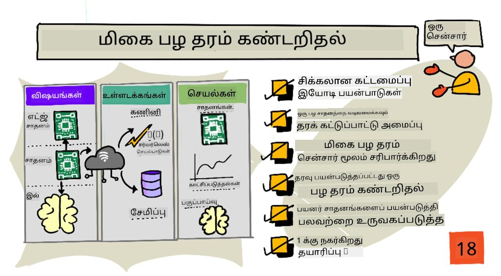
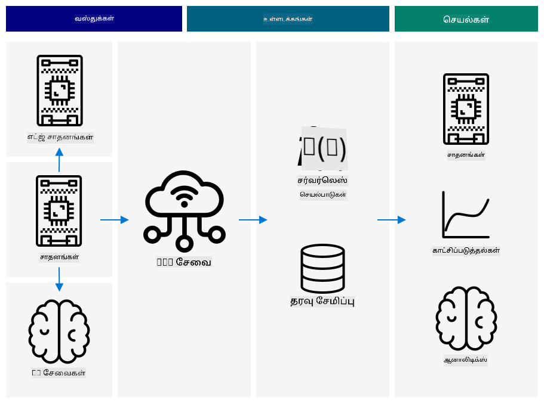
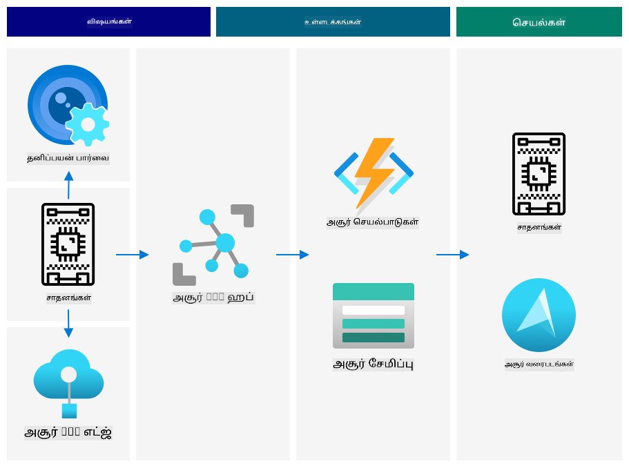
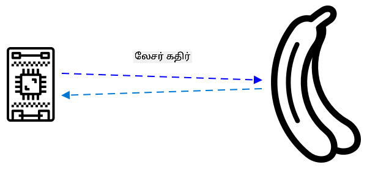
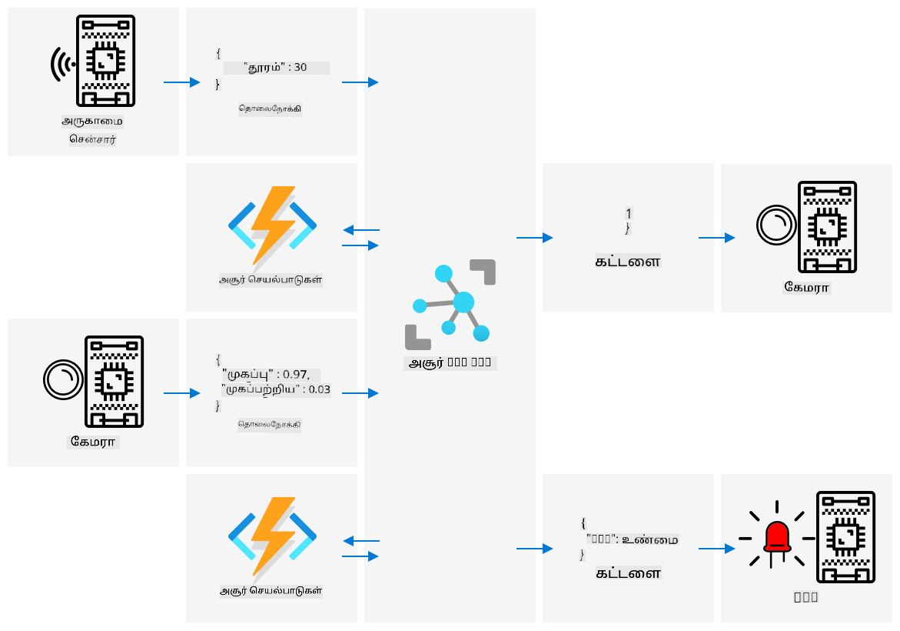

<!--
CO_OP_TRANSLATOR_METADATA:
{
  "original_hash": "f74f4ccb61f00e5f7e9f49c3ed416e36",
  "translation_date": "2025-10-11T11:51:04+00:00",
  "source_file": "4-manufacturing/lessons/4-trigger-fruit-detector/README.md",
  "language_code": "ta"
}
-->
# சென்சார் மூலம் பழத்தின் தரத்தை கண்டறிதல் தொடங்குதல்



> ஸ்கெட்ச் நோட்: [நித்யா நரசிம்மன்](https://github.com/nitya). படத்தை கிளிக் செய்து பெரிய பதிப்பைப் பாருங்கள்.

## முன்னோட்ட கேள்வி

[முன்னோட்ட கேள்வி](https://black-meadow-040d15503.1.azurestaticapps.net/quiz/35)

## அறிமுகம்

IoT பயன்பாடுகள் என்பது ஒரு சாதனம் மட்டும் தரவுகளைப் பிடித்து மேகத்துக்கு அனுப்புவது அல்ல, பல சாதனங்கள் ஒன்றாக இணைந்து சென்சார்களின் மூலம் புவியியல் உலகத்திலிருந்து தரவுகளைப் பிடித்து, அந்த தரவின் அடிப்படையில் முடிவுகளை எடுத்து, செயல்பாடுகள் அல்லது காட்சிப்படுத்தல்களின் மூலம் புவியியல் உலகத்துடன் தொடர்பு கொள்ளும் செயல்பாடுகளாக இருக்கும்.

இந்த பாடத்தில், பல சென்சார்கள், பல மேக சேவைகளை இணைத்து தரவுகளை பகுப்பாய்வு செய்து சேமித்து, செயல்பாடுகளை காட்டும் ஒரு சிக்கலான IoT பயன்பாட்டை வடிவமைப்பது பற்றி நீங்கள் கற்றுக்கொள்வீர்கள். பழத்தின் தரத்தை கட்டுப்படுத்தும் ஒரு சோதனை அமைப்பை வடிவமைப்பது, IoT பயன்பாட்டை தொடங்குவதற்கு அருகாமை சென்சார்கள் பயன்படுத்துவது, மற்றும் இந்த சோதனை அமைப்பின் கட்டமைப்பு எப்படி இருக்கும் என்பதைப் பற்றி நீங்கள் கற்றுக்கொள்வீர்கள்.

இந்த பாடத்தில் நாம் கவரும் விஷயங்கள்:

* [சிக்கலான IoT பயன்பாடுகளை வடிவமைத்தல்](../../../../../4-manufacturing/lessons/4-trigger-fruit-detector)
* [பழத்தின் தரத்தை கட்டுப்படுத்தும் அமைப்பை வடிவமைத்தல்](../../../../../4-manufacturing/lessons/4-trigger-fruit-detector)
* [சென்சார் மூலம் பழத்தின் தரத்தைச் சோதனை செய்ய தொடங்குதல்](../../../../../4-manufacturing/lessons/4-trigger-fruit-detector)
* [பழத்தின் தரத்தை கண்டறிய பயன்படுத்தப்படும் தரவுகள்](../../../../../4-manufacturing/lessons/4-trigger-fruit-detector)
* [பல IoT சாதனங்களை சிமுலேட் செய்ய டெவலப்பர் சாதனங்களைப் பயன்படுத்துதல்](../../../../../4-manufacturing/lessons/4-trigger-fruit-detector)
* [தயாரிப்பில் செல்லுதல்](../../../../../4-manufacturing/lessons/4-trigger-fruit-detector)

> 🗑 இந்த திட்டத்தின் கடைசி பாடம் இது, எனவே இந்த பாடத்தையும் பணியையும் முடித்த பிறகு உங்கள் மேக சேவைகளை சுத்தம் செய்ய மறக்காதீர்கள். பணியை முடிக்க சேவைகள் தேவைப்படும், எனவே முதலில் அதை முடிக்க உறுதியாக இருக்கவும்.
>
> [திட்டத்தை சுத்தம் செய்யும் வழிகாட்டி](../../../clean-up.md) தேவையானால் அதற்கான வழிமுறைகளைப் பார்க்கவும்.

## சிக்கலான IoT பயன்பாடுகளை வடிவமைத்தல்

IoT பயன்பாடுகள் பல கூறுகளால் ஆனவை. இது பலவகையான பொருட்கள் மற்றும் இணைய சேவைகளை உள்ளடக்கியது.

IoT பயன்பாடுகளை *பொருட்கள்* (சாதனங்கள்) தரவுகளை அனுப்பி *உள்ளடக்கங்களை* உருவாக்குவது என்று விவரிக்கலாம். இந்த *உள்ளடக்கங்கள்* ஒரு வணிகம் அல்லது செயல்முறையை மேம்படுத்த *செயல்பாடுகளை* உருவாக்குகின்றன. உதாரணமாக, ஒரு இயந்திரம் (பொருள்) வெப்பநிலை தரவுகளை அனுப்புகிறது. இந்த தரவுகள் இயந்திரம் எதிர்பார்த்தபடி செயல்படுகிறதா என்பதை மதிப்பீடு செய்ய பயன்படுத்தப்படுகிறது (உள்ளடக்கம்). இந்த உள்ளடக்கம் இயந்திரத்தின் பராமரிப்பு அட்டவணையை முன்னுரிமை அளிக்க பயன்படுத்தப்படுகிறது (செயல்பாடு).

* வெவ்வேறு பொருட்கள் வெவ்வேறு தரவங்களைப் பெறுகின்றன.
* IoT சேவைகள் அந்த தரவுகளின் மீது உள்ளடக்கங்களை வழங்குகின்றன, சில நேரங்களில் கூடுதல் மூலங்களிலிருந்து தரவுகளை சேர்த்துக் கொள்கின்றன.
* இந்த உள்ளடக்கங்கள் செயல்பாடுகளை இயக்குகின்றன, சாதனங்களில் செயல்படுத்தும் கட்டளைகளை கட்டுப்படுத்துதல் அல்லது தரவுகளை காட்சிப்படுத்துதல் போன்றவை.

### IoT கட்டமைப்புக்கான குறிப்புகள்



மேலே உள்ள வரைபடம் IoT கட்டமைப்புக்கான குறிப்புகளை காட்டுகிறது.

> 🎓 *குறிப்பு கட்டமைப்பு* என்பது புதிய அமைப்புகளை வடிவமைக்கும் போது குறிப்பாக பயன்படுத்தக்கூடிய ஒரு உதாரண கட்டமைப்பாகும். இந்த வழக்கில், நீங்கள் ஒரு புதிய IoT அமைப்பை உருவாக்கினால், உங்கள் சொந்த சாதனங்கள் மற்றும் சேவைகளை பொருத்தமான இடங்களில் மாற்றி குறிப்புக் கட்டமைப்பைப் பின்பற்றலாம்.

* **பொருட்கள்** என்பது சென்சார்களிலிருந்து தரவுகளைப் பெறும் சாதனங்கள், புகைப்பட தரவுகளைப் புரிந்துகொள்ள படப் வகைப்பாட்டாளர்களைப் போன்ற எட்ஜ் சேவைகளுடன் தொடர்பு கொள்ளலாம். சாதனங்களிலிருந்து தரவுகள் IoT சேவைக்கு அனுப்பப்படுகிறது.
* **உள்ளடக்கங்கள்** என்பது சேமிக்கப்பட்ட தரவின் மீது செயல்படுத்தப்படும் சர்வர்லெஸ் பயன்பாடுகள் அல்லது பகுப்பாய்வுகளிலிருந்து வருகிறது.
* **செயல்பாடுகள்** என்பது சாதனங்களுக்கு அனுப்பப்படும் கட்டளைகள் அல்லது மனிதர்கள் முடிவுகளை எடுக்க அனுமதிக்கும் தரவின் காட்சிப்படுத்தலாக இருக்கலாம்.



மேலே உள்ள வரைபடம் இந்த பாடங்களில் இதுவரை கவரப்பட்ட கூறுகள் மற்றும் சேவைகளை, IoT கட்டமைப்புக்கான குறிப்புகளில் எப்படி இணைக்கப்படுகின்றன என்பதை காட்டுகிறது.

* **பொருட்கள்** - நீங்கள் சென்சார்களிலிருந்து தரவுகளைப் பிடிக்க சாதனக் குறியீடுகளை எழுதினீர்கள், மற்றும் Custom Vision பயன்படுத்தி மேகத்திலும் எட்ஜ் சாதனத்திலும் படங்களை பகுப்பாய்வு செய்தீர்கள். இந்த தரவுகள் IoT Hubக்கு அனுப்பப்பட்டது.
* **உள்ளடக்கங்கள்** - நீங்கள் Azure Functions பயன்படுத்தி IoT Hubக்கு அனுப்பப்பட்ட செய்திகளுக்கு பதிலளித்தீர்கள், மற்றும் Azure Storageல் தரவுகளை சேமித்தீர்கள்.
* **செயல்பாடுகள்** - மேகத்தில் எடுக்கப்பட்ட முடிவுகளின் அடிப்படையில் சாதனங்களை கட்டுப்படுத்தும் கட்டளைகளை அனுப்பினீர்கள், மற்றும் Azure Maps பயன்படுத்தி தரவுகளை காட்சிப்படுத்தினீர்கள்.

✅ நீங்கள் பயன்படுத்திய பிற IoT சாதனங்களைப் பற்றி சிந்திக்கவும், உதாரணமாக ஸ்மார்ட் ஹோம் சாதனங்கள். அந்த சாதனத்தின் மற்றும் அதன் மென்பொருளின் பொருட்கள், உள்ளடக்கங்கள் மற்றும் செயல்பாடுகள் என்ன?

இந்த முறை உங்கள் தேவைக்கு ஏற்ப பெரியதாக அல்லது சிறியதாக விரிவாக்கப்படலாம், மேலும் சாதனங்கள் மற்றும் சேவைகளைச் சேர்க்கலாம்.

### தரவுகள் மற்றும் பாதுகாப்பு

உங்கள் அமைப்பின் கட்டமைப்பை வரையறுத்தபோது, நீங்கள் தொடர்ந்து தரவுகள் மற்றும் பாதுகாப்பைப் பரிசீலிக்க வேண்டும்.

* உங்கள் சாதனம் அனுப்பும் மற்றும் பெறும் தரவுகள் என்ன?
* அந்த தரவுகளை எப்படி பாதுகாக்க வேண்டும்?
* சாதனத்திற்கும் மேக சேவைக்கும் அணுகலை எப்படி கட்டுப்படுத்த வேண்டும்?

✅ உங்கள் சொந்த IoT சாதனங்களின் தரவுப் பாதுகாப்பைப் பற்றி சிந்திக்கவும். அந்த தரவுகளில் எவ்வளவு தனிப்பட்டது, மற்றும் அது அனுப்பும் போது அல்லது சேமிக்கப்படும் போது தனிப்பட்டதாக வைத்திருக்க வேண்டும்? எந்த தரவுகள் சேமிக்கப்படக்கூடாது?

## பழத்தின் தரத்தை கட்டுப்படுத்தும் அமைப்பை வடிவமைத்தல்

இப்போது பொருட்கள், உள்ளடக்கங்கள் மற்றும் செயல்பாடுகளின் இந்த யோசனையை எடுத்து, பழத்தின் தரத்தை கண்டறிய உங்கள் சோதனை அமைப்பை வடிவமைக்க பயன்படுத்துவோம்.

ஒரு செயலாக்க ஆலையில் பயன்படுத்த ஒரு பழத்தின் தரத்தை கண்டறியும் அமைப்பை உருவாக்க உங்களுக்கு பணிக்கொடுக்கப்பட்டுள்ளது என்று கற்பனை செய்யுங்கள். பழங்கள் ஒரு கன்வேயர் பெல்ட் அமைப்பில் பயணம் செய்கின்றன, இப்போது ஊழியர்கள் கையால் பழங்களைச் சோதித்து, வந்தவுடன் எந்தவொரு பழுத்தாத பழங்களையும் அகற்ற நேரத்தை செலவிடுகின்றனர். செலவுகளை குறைக்க, ஆலை உரிமையாளர் ஒரு தானியங்கி அமைப்பை விரும்புகிறார்.

✅ IoT (மற்றும் பொதுவாக தொழில்நுட்பம்) வளர்ச்சியுடன் கூடிய ஒரு போக்கு என்னவென்றால், கையேடு வேலைகள் இயந்திரங்களால் மாற்றப்படுகின்றன. சில ஆராய்ச்சி செய்யுங்கள்: IoT மூலம் எத்தனை வேலைகள் இழக்கப்படும் என்று மதிப்பிடப்பட்டுள்ளது? IoT சாதனங்களை உருவாக்க புதிய வேலைகள் எத்தனை உருவாக்கப்படும்?

பழங்கள் கன்வேயர் பெல்டில் வந்தவுடன் கண்டறியப்படும் ஒரு அமைப்பை நீங்கள் உருவாக்க வேண்டும், பின்னர் அவை புகைப்படம் எடுக்கப்பட்டு எட்ஜில் இயங்கும் AI மாடல் மூலம் சோதிக்கப்படும். முடிவுகள் மேகத்துக்கு சேமிக்க அனுப்பப்படும், மற்றும் பழுத்தாத பழம் இருந்தால், பழுத்தாத பழம் அகற்றப்பட வேண்டும் என்பதற்கான அறிவிப்பு வழங்கப்படும்.

|   |   |
| - | - |
| **பொருட்கள்** | கன்வேயர் பெல்டில் பழம் வருகை தருவதற்கான கண்டறியப்பட்ட சாதனம்<br>பழத்தை புகைப்படம் எடுத்து வகைப்படுத்தும் கேமரா<br>வகைப்படுத்தும் எட்ஜ் சாதனம்<br>பழுத்தாத பழத்திற்கான அறிவிப்பை வழங்கும் சாதனம் |
| **உள்ளடக்கங்கள்** | பழத்தின் பழுத்த தன்மையைச் சோதிக்க முடிவு செய்யுங்கள்<br>வகைப்படுத்தலின் முடிவுகளை சேமிக்கவும்<br>பழுத்தாத பழம் பற்றிய அறிவிப்பு தேவையா என்பதைத் தீர்மானிக்கவும் |
| **செயல்பாடுகள்** | பழத்தை புகைப்படம் எடுத்து, பட வகைப்படுத்தலுடன் சோதிக்க சாதனத்திற்கு கட்டளையை அனுப்புங்கள்<br>பழம் பழுத்தாதது என்பதை அறிவிக்க சாதனத்திற்கு கட்டளையை அனுப்புங்கள் |

### உங்கள் பயன்பாட்டை சோதனை செய்ய வடிவமைத்தல்


மேலே உள்ள வரைபடம் இந்த சோதனை பயன்பாட்டுக்கான குறிப்புக் கட்டமைப்பை காட்டுகிறது.

* ஒரு IoT சாதனம் அருகாமை சென்சாருடன் பழத்தின் வருகையை கண்டறிகிறது. இது மேகத்துக்கு ஒரு செய்தியை அனுப்புகிறது, பழம் கண்டறியப்பட்டது என்று கூறுகிறது.
* மேகத்தில் உள்ள ஒரு சர்வர்லெஸ் பயன்பாடு மற்றொரு சாதனத்திற்கு புகைப்படம் எடுத்து வகைப்படுத்த கட்டளையை அனுப்புகிறது.
* கேமரா கொண்ட IoT சாதனம் ஒரு படம் எடுத்து, எட்ஜில் இயங்கும் பட வகைப்படுத்தலுக்கு அனுப்புகிறது. முடிவுகள் பின்னர் மேகத்துக்கு அனுப்பப்படும்.
* மேகத்தில் உள்ள ஒரு சர்வர்லெஸ் பயன்பாடு இந்த தகவலை சேமிக்கிறது, பின்னர் பகுப்பாய்வு செய்ய பழுத்தாத பழத்தின் சதவீதத்தை காண. பழம் பழுத்தாதது என்றால், LED மூலம் தொழிலாளர்களுக்கு அறிவிக்க மற்றொரு IoT சாதனத்திற்கு கட்டளையை அனுப்புகிறது.

> 💁 இந்த IoT பயன்பாடு முழுவதும் ஒரு சாதனமாக செயல்படுத்தப்படலாம், பட வகைப்படுத்தலையும் LED கட்டுப்பாட்டையும் தொடங்குவதற்கான அனைத்து தரவுகளும் உள்ளடக்கமாக. இது IoT Hub பயன்படுத்தி பழுத்தாத பழங்களின் எண்ணிக்கையை கண்காணிக்க மற்றும் சாதனத்தை அமைக்க மட்டுமே பயன்படுத்தலாம். இந்த பாடத்தில், பெரிய அளவிலான IoT பயன்பாடுகளுக்கான கருத்துகளை விளக்குவதற்காக இது விரிவாக்கப்பட்டுள்ளது.

சோதனைக்கான, நீங்கள் இதை ஒரு சாதனத்தில் செயல்படுத்துவீர்கள். நீங்கள் ஒரு மைக்ரோகண்ட்ரோலரைப் பயன்படுத்தினால், பட வகைப்படுத்தலை இயக்க ஒரு தனி எட்ஜ் சாதனத்தைப் பயன்படுத்துவீர்கள். இதை உருவாக்க நீங்கள் தேவையான பல விஷயங்களை ஏற்கனவே கற்றுக்கொண்டுள்ளீர்கள்.

## சென்சார் மூலம் பழத்தின் தரத்தைச் சோதனை செய்ய தொடங்குதல்

IoT சாதனத்திற்கு பழம் வகைப்படுத்த தயாராக இருக்கும்போது ஒரு வகையான தொடக்கத்தை தேவைப்படும். இதற்கான ஒரு தொடக்கம் கன்வேயர் பெல்டில் பழம் சரியான இடத்தில் இருக்கும்போது, சென்சாருக்கு தொலைவை அளவிடுவதன் மூலம் இருக்கலாம்.



அருகாமை சென்சார்கள் சென்சாருக்கு ஒரு பொருளின் தொலைவை அளவிட பயன்படுத்தப்படலாம். அவை பொதுவாக ஒரு மின்காந்த கதிர், உதாரணமாக லேசர் கதிர் அல்லது இன்ஃப்ரா-ரெட் ஒளியை அனுப்பி, பின்னர் ஒரு பொருளில் bounce ஆகும் கதிரை கண்டறிகின்றன. லேசர் கதிர் அனுப்பப்பட்டு bounce ஆகும் நேரம் சென்சாருக்கு தொலைவை கணக்கிட பயன்படுத்தப்படலாம்.

> 💁 நீங்கள் அருகாமை சென்சார்கள் பயன்படுத்தியிருக்கலாம், ஆனால் அதை பற்றி தெரியாமல் இருக்கலாம். பெரும்பாலான ஸ்மார்ட்போன்கள் உங்கள் காதுக்கு வைத்தால் திரையை அணைக்கின்றன, உங்கள் காதின் மூலம் அழைப்பை முடிக்க தவறாமல் இருக்க, இது ஒரு அருகாமை சென்சார் பயன்படுத்தி செயல்படுகிறது, அழைப்பு நேரத்தில் திரைக்கு அருகில் ஒரு பொருளை கண்டறிந்து, தொலைபேசி ஒரு குறிப்பிட்ட தொலைவில் இருக்கும்வரை தொடுதிறன்களை முடக்குகிறது.

### பணிகள் - தொலைவு சென்சாரின் மூலம் பழத்தின் தரத்தைச் சோதனை செய்ய தொடங்குதல்

உங்கள் IoT சாதனத்தைப் பயன்படுத்தி ஒரு பொருளை கண்டறிய அருகாமை சென்சார் பயன்படுத்துவதற்கான தொடர்புடைய வழிகாட்டியைப் பின்பற்றுங்கள்:

* [Arduino - Wio Terminal](wio-terminal-proximity.md)
* [Single-board computer - Raspberry Pi](pi-proximity.md)
* [Single-board computer - Virtual device](virtual-device-proximity.md)

## பழத்தின் தரத்தை கண்டறிய பயன்படுத்தப்படும் தரவுகள்

சோதனை பழ கண்டறிய அமைப்பில் பல கூறுகள் ஒன்றுடன் ஒன்று தொடர்பு கொள்கின்றன.



* ஒரு அருகாமை சென்சார் பழத்திற்கான தொலைவை அளவிட்டு, அதை IoT Hubக்கு அனுப்புகிறது
* IoT Hubல் இருந்து கேமரா சாதனத்தை கட்டுப்படுத்தும் கட்டளை
* பட வகைப்படுத்தலின் முடிவுகள் IoT Hubக்கு அனுப்பப்படுகின்றன
* பழம் பழுத்தாதது என்பதை அறிவிக்க LED கொண்ட சாதனத்திற்கு IoT Hubல் இருந்து கட்டளை அனுப்பப்படுகிறது

இந்த செய்திகளின் அமைப்பை நீங்கள் உருவாக்குவதற்கு முன், முன்னதாக வரையறுத்தல் நல்லது.

> 💁 அனுப்பப்படும் தரவுகள் எதிர்பார்க்கப்படும் தரவுகளுடன் வேறுபடுவதால் ஏற்படும் பிழைகளைத் தேடுவதில் அனுபவம் வாய்ந்த ஒவ்வொரு டெவலப்பரும் ஒரு கட்டத்தில், பல மணி நேரங்கள், நாட்கள் அல்லது வாரங்களை செலவிட்டுள்ளனர்.

உதாரணமாக - நீங்கள் வெப்பநிலை தகவலை அனுப்பினால், JSONஐ எப்படி வரையறிப்பீர்கள்? நீங்கள் `temperature` என்ற ஒரு புலம் வைத்திருக்கலாம், அல்லது பொதுவாக பயன்படுத்தப்படும் சுருக்கமான `temp`ஐ பயன்படுத்தலாம்.

```json
{
    "temperature": 20.7
}
```

இதை ஒப்பிடுக:

```json
{
    "temp": 20.7
}
```

நீங்கள் அலகுகளைப் பரிசீலிக்க வேண்டும் - வெப்பநிலை °C அல்லது °Fல் இருக்கிறதா? நீங்கள் ஒரு நுகர்வோர் சாதனத்தைப் பயன்படுத்தி வெப்பநிலை அளவிடுகிறீர்கள், அவர்கள் காட்சி அலகுகளை மாற்றினால், மேகத்துக்கு அனுப்பப்படும் அலகுகள் நிலையானதாக இருக்க வேண்டும் என்பதை உறுதிப்படுத்த வேண்டும்.

✅ சில ஆராய்ச்சி செய்யுங்கள்: $125 மில்லியன் Mars Climate Orbiter எப்படி அலகு பிரச்சினைகளால் விபத்துக்குள்ளானது?

பழத்தின் தரத்தை கண்டறிய அனுப்பப்படும் தரவுகளைப் பற்றி சிந்திக்கவும். ஒவ்வொரு செய்தியையும் நீங்கள் எப்படி வரையறிப்பீர்கள்? எந்த இடத்தில் நீங்கள் தரவுகளை பகுப்பாய்வு செய்து, எந்த தரவுகளை அனுப்ப முடிவெடுப்பீர்கள்?

உதாரணமாக - அருகாமை சென்சாரின் மூலம் பட வகைப்படுத்தலை தொடங்குதல். IoT சாதனம் தொலைவை அளவிடுகிறது, ஆனால் முடிவு எங்கு எடுக்கப்படுகிறது? சாதனம் பழம் அருகில் இருக்கிறது என்று முடிவு செய்து, IoT Hubக்கு வகைப்படுத்தலை தொடங்கச் சொல்லும் செய்தியை அனுப்புகிறதா? அல்லது அது அருகாமை அளவீடுகளை அனுப்பி, IoT Hub முடிவெடுக்கிறதா?

இந்த கேள்விகளுக்கான பதில் - அது சார்ந்தது. ஒவ்வொரு பயன்பாடும் வேறுபட்டது, அதனால் IoT டெவலப்பராக நீங்கள் உருவாக்கும் அமைப்பை, அது எப்படி பயன்படுத்தப்படுகிறது, மற்றும் கண்டறியப்படும் தரவுகளைப் புரிந்துகொள்ள வேண்டும்.

* முடிவு IoT Hub மூலம் எடுக்கப்பட்டால், நீங்கள் பல தொலைவு அளவீடுகளை அனுப்ப வேண்டும்.
* நீங்கள் அதிகமான செய்திகளை அனுப்பினால், IoT Hub செலவுகளை அதிகரிக்கிறது, மற்றும் உங்கள் IoT சாதனங்களின் (சிறப்பாக ஒரு தொழிற்சாலையில் மில்லியன் சாதனங்களுடன்) தேவையான பரந்தபட்டத்தை அதிகரிக்கிறது. இது உங்கள் சாதனத்தை மெதுவாக்கவும் செய்யலாம்.
* நீங்கள் சாதனத்தில் முடிவெடுப்பீர்கள் என்றால், இயந்திரத்தை நன்றாக அமைக்க சாதனத்தை அமைப்பதற்கான வழியை வழங்க வேண்டும்.

## பல IoT சாதனங்களை சிமுலேட் செய்ய டெவலப்பர் சாதனங்களைப் பயன்படுத்துதல்

உங்கள் சோத
* ஒவ்வொரு IoT சாதனத்திற்கும் ஒரு அல்லது அதற்கு மேற்பட்ட வகுப்புகளை உருவாக்கவும் - உதாரணமாக `DistanceSensor`, `ClassifierCamera`, `LEDController` என்ற வகுப்புகளை உருவாக்கலாம். ஒவ்வொரு வகுப்பிற்கும் அதன் சொந்த `setup` மற்றும் `loop` முறை இருக்கும், அவற்றை முக்கிய `setup` மற்றும் `loop` செயல்பாடுகள் அழைக்கும்.
* கட்டளைகளை ஒரே இடத்தில் கையாளவும், அவற்றை தேவையான சாதன வகுப்பிற்கு அனுப்பவும்.
* முக்கிய `loop` செயல்பாட்டில், ஒவ்வொரு சாதனத்திற்கும் தேவையான நேரத்தை கவனிக்க வேண்டும். உதாரணமாக, ஒரு சாதன வகுப்பு ஒவ்வொரு 10 வினாடிகளிலும் செயல்பட வேண்டும், மற்றொன்று ஒவ்வொரு 1 வினாடிகளிலும் செயல்பட வேண்டும் என்றால், முக்கிய `loop` செயல்பாட்டில் 1 வினாடி தாமதத்தை பயன்படுத்தவும். ஒவ்வொரு `loop` அழைப்பும் ஒவ்வொரு வினாடிக்கு செயல்பட வேண்டிய சாதனத்திற்கான குறியீட்டை இயக்கும், மற்றும் ஒரு கவுண்டரை பயன்படுத்தி ஒவ்வொரு `loop` ஐ எண்ணி, கவுண்டர் 10 ஆகும் போது மற்ற சாதனத்தை செயல்படுத்தவும் (கவுண்டரை பின்னர் மீட்டமைக்கவும்).

## உற்பத்திக்கு நகர்வு

முன்மாதிரி இறுதி உற்பத்தி அமைப்பின் அடிப்படையாக இருக்கும். உற்பத்திக்கு நகரும் போது சில வேறுபாடுகள் இருக்கும்:

* வலுவான கூறுகள் - தொழிற்சாலையின் சத்தம், வெப்பம், அதிர்வு மற்றும் அழுத்தத்தை தாங்கும் வகையில் வடிவமைக்கப்பட்ட ஹார்ட்வேரைப் பயன்படுத்துதல்.
* உள்நாட்டு தொடர்புகளைப் பயன்படுத்துதல் - சில கூறுகள் நேரடியாக தொடர்பு கொள்ளும், கிளவுட் வழியாக செல்லாமல், தரவுகளை கிளவுடில் சேமிக்க மட்டுமே அனுப்பும். இது தொழிற்சாலை அமைப்பின் அடிப்படையில் செய்யப்படும், நேரடி தொடர்புகள் அல்லது ஒரு கேட்வே சாதனத்தைப் பயன்படுத்தி IoT சேவையின் ஒரு பகுதியை எட்ஜில் இயக்குவதன் மூலம்.
* கட்டமைப்பு விருப்பங்கள் - ஒவ்வொரு தொழிற்சாலை மற்றும் பயன்பாடு வெவ்வேறு, எனவே ஹார்ட்வேரை கட்டமைக்க முடியும். உதாரணமாக, நெருக்கம் சென்சார் வெவ்வேறு தூரங்களில் வெவ்வேறு பழங்களை கண்டறிய வேண்டும். வகைப்பாட்டைத் தொடங்க தூரத்தை கடினமாக குறியிடுவதற்குப் பதிலாக, இது கிளவுட் மூலம், உதாரணமாக ஒரு சாதன ட்வின் பயன்படுத்தி, கட்டமைக்க முடியும்.
* தானியங்க பழம் அகற்றல் - பழம் பச்சையாக இருப்பதை LED மூலம் எச்சரிக்கின்றதற்கு பதிலாக, தானியங்க சாதனங்கள் அதை அகற்றும்.

✅ சில ஆராய்ச்சி செய்யவும்: உற்பத்தி சாதனங்கள் டெவலப்பர் கிட்களிலிருந்து வேறுபடுவதற்கான பிற வழிகள் என்ன?

---

## 🚀 சவால்

இந்த பாடத்தில் IoT அமைப்பை எப்படி வடிவமைக்க வேண்டும் என்பதைப் பற்றிய சில கருத்துகளை நீங்கள் கற்றுக்கொண்டீர்கள். முந்தைய திட்டங்களை நினைவில் கொள்ளுங்கள். அவை மேலே காட்டப்பட்டுள்ள குறிப்பு அமைப்பில் எப்படி பொருந்துகின்றன?

இப்போது வரை உள்ள திட்டங்களில் ஒன்றைத் தேர்ந்தெடுத்து, பல திறன்களை ஒருங்கிணைக்கும் ஒரு சிக்கலான தீர்வின் வடிவமைப்பைப் பற்றி யோசிக்கவும், இது திட்டங்களில் உள்ளதை விட அதிகமாக இருக்கும். அமைப்பை வரைந்து, உங்களுக்கு தேவையான அனைத்து சாதனங்கள் மற்றும் சேவைகளை யோசிக்கவும்.

உதாரணமாக - GPS உடன் சென்சார்களை இணைத்து ஒரு வாகன கண்காணிப்பு சாதனம் உருவாக்குவது, இது குளிர்சாதன லாரியில் வெப்பநிலைகளை கண்காணிக்க, என்ஜின் ஆன் மற்றும் ஆஃப் நேரங்களை, மற்றும் ஓட்டுநரின் அடையாளத்தை கண்காணிக்க உதவும். இதில் உள்ள சாதனங்கள், சேவைகள், பரிமாறப்படும் தரவுகள் மற்றும் பாதுகாப்பு மற்றும் தனியுரிமை கருத்துக்கள் என்ன?

## பாடத்திற்குப் பிந்தைய வினாடி வினா

[பாடத்திற்குப் பிந்தைய வினாடி வினா](https://black-meadow-040d15503.1.azurestaticapps.net/quiz/36)

## மதிப்பீடு & சுயபடிப்பு

* IoT அமைப்பைப் பற்றிய மேலும் வாசிக்க [Azure IoT reference architecture documentation on Microsoft docs](https://docs.microsoft.com/azure/architecture/reference-architectures/iot?WT.mc_id=academic-17441-jabenn)
* சாதன ட்வின்களைப் பற்றிய மேலும் வாசிக்க [understand and use device twins in IoT Hub documentation on Microsoft docs](https://docs.microsoft.com/azure/iot-hub/iot-hub-devguide-device-twins?WT.mc_id=academic-17441-jabenn)
* தொழில்துறை தானியங்கத்தில் பயன்படுத்தப்படும் இயந்திரத்திற்கும் இயந்திரத்திற்கும் தொடர்பு முறைமையான OPC-UA பற்றி [OPC-UA page on Wikipedia](https://wikipedia.org/wiki/OPC_Unified_Architecture) இல் வாசிக்கவும்

## பணிக்கட்டளை

[Build a fruit quality detector](assignment.md)

---

**அறிவிப்பு**:  
இந்த ஆவணம் [Co-op Translator](https://github.com/Azure/co-op-translator) என்ற AI மொழிபெயர்ப்பு சேவையை பயன்படுத்தி மொழிபெயர்க்கப்பட்டுள்ளது. நாங்கள் துல்லியத்திற்காக முயற்சிக்கிறோம், ஆனால் தானியங்கி மொழிபெயர்ப்புகளில் பிழைகள் அல்லது தவறுகள் இருக்கக்கூடும் என்பதை கவனத்தில் கொள்ளவும். அதன் சொந்த மொழியில் உள்ள மூல ஆவணம் அதிகாரப்பூர்வ ஆதாரமாக கருதப்பட வேண்டும். முக்கியமான தகவல்களுக்கு, தொழில்முறை மனித மொழிபெயர்ப்பு பரிந்துரைக்கப்படுகிறது. இந்த மொழிபெயர்ப்பைப் பயன்படுத்துவதால் ஏற்படும் எந்த தவறான புரிதல்களுக்கும் அல்லது தவறான விளக்கங்களுக்கும் நாங்கள் பொறுப்பல்ல.