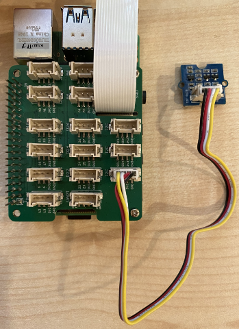

<!--
CO_OP_TRANSLATOR_METADATA:
{
  "original_hash": "6145a1d791731c8a9d0afd0a1bae5108",
  "translation_date": "2025-10-11T11:53:06+00:00",
  "source_file": "4-manufacturing/lessons/4-trigger-fruit-detector/pi-proximity.md",
  "language_code": "ta"
}
-->
# அருகாமை கண்டறிதல் - ராஸ்பெர்ரி பை

இந்த பாடத்தின் இந்த பகுதியில், நீங்கள் உங்கள் ராஸ்பெர்ரி பையில் ஒரு அருகாமை சென்சரை சேர்த்து, அதிலிருந்து தூரத்தை படிக்கப் போகிறீர்கள்.

## ஹார்ட்வேர்கள்

ராஸ்பெர்ரி பைக்கு ஒரு அருகாமை சென்சர் தேவை.

நீங்கள் பயன்படுத்தப் போகும் சென்சர் [Grove Time of Flight distance sensor](https://www.seeedstudio.com/Grove-Time-of-Flight-Distance-Sensor-VL53L0X.html) ஆகும். இந்த சென்சர் லேசர் ரேஞ்சிங் மாட்யூலை பயன்படுத்தி தூரத்தை கண்டறிகிறது. இந்த சென்சரின் வரம்பு 10mm முதல் 2000mm (1cm - 2m) வரை உள்ளது, மேலும் 1000mm க்கு மேல் உள்ள தூரங்களை 8109mm என அறிக்கையிடும்.

லேசர் ரேஞ்ச்ஃபைண்டர் சென்சரின் பின்புறத்தில் உள்ளது, Grove சாக்கெட்டின் எதிர்முனையில்.

இது ஒரு I<sup>2</sup>C சென்சர்.

### டைம் ஆஃப் ஃப்லைட் சென்சரை இணைக்கவும்

Grove டைம் ஆஃப் ஃப்லைட் சென்சரை ராஸ்பெர்ரி பைக்கு இணைக்கலாம்.

#### பணிகள் - டைம் ஆஃப் ஃப்லைட் சென்சரை இணைக்கவும்

டைம் ஆஃப் ஃப்லைட் சென்சரை இணைக்கவும்.


1. Grove கேபிளின் ஒரு முனையை டைம் ஆஃப் ஃப்லைட் சென்சரின் சாக்கெட்டில் செருகவும். இது ஒரு வழியில் மட்டுமே செருகப்படும்.

1. ராஸ்பெர்ரி பை ஆஃப் நிலையில் இருக்கும் போது, Grove கேபிளின் மற்ற முனையை பை-யில் இணைக்கப்பட்ட Grove Base ஹாட்டின் **I<sup>2</sup>C** என குறிக்கப்பட்ட I<sup>2</sup>C சாக்கெட்டுகளில் ஒன்றில் இணைக்கவும். இந்த சாக்கெட்டுகள் கீழ் வரிசையில் உள்ளன, GPIO பின்களின் எதிர்முனையில் மற்றும் கேமரா கேபிள் ஸ்லாட்டின் அருகில் உள்ளன.



## டைம் ஆஃப் ஃப்லைட் சென்சரை நிரலாக்கவும்

இப்போது ராஸ்பெர்ரி பை இணைக்கப்பட்ட டைம் ஆஃப் ஃப்லைட் சென்சரை பயன்படுத்த நிரலாக்கப்படலாம்.

### பணிகள் - டைம் ஆஃப் ஃப்லைட் சென்சரை நிரலாக்கவும்

சாதனத்தை நிரலாக்கவும்.

1. பையை ஆன் செய்து, அது தொடங்கும் வரை காத்திருக்கவும்.

1. `fruit-quality-detector` குறியீட்டை VS Code-ல் திறக்கவும், நேரடியாக பையில் அல்லது Remote SSH நீட்டிப்பு மூலம் இணைக்கவும்.

1. VL53L0X டைம்-ஆஃப்-ஃப்லைட் தூர சென்சருடன் தொடர்பு கொள்ளும் Python தொகுப்பு rpi-vl53l0x Pip தொகுப்பை நிறுவவும். இதை பின்வரும் pip கட்டளையைப் பயன்படுத்தி நிறுவவும்:

    ```sh
    pip install rpi-vl53l0x
    ```

1. இந்த திட்டத்தில் `distance-sensor.py` என்ற புதிய கோப்பை உருவாக்கவும்.

    > 💁 பல IoT சாதனங்களை ச模拟ிக்க ஒரு எளிய வழி ஒவ்வொன்றையும் தனித்த Python கோப்பில் செய்யவும், பின்னர் அவற்றை ஒரே நேரத்தில் இயக்கவும்.

1. இந்த கோப்பில் பின்வரும் குறியீட்டை சேர்க்கவும்:

    ```python
    import time
    
    from grove.i2c import Bus
    from rpi_vl53l0x.vl53l0x import VL53L0X
    ```

    இது Grove I<sup>2</sup>C பஸ் நூலகத்தை மற்றும் Grove டைம் ஆஃப் ஃப்லைட் சென்சரின் மைய சென்சர் ஹார்ட்வேருக்கான சென்சர் நூலகத்தை இறக்குமதி செய்கிறது.

1. இதற்கு கீழே, சென்சரை அணுக பின்வரும் குறியீட்டை சேர்க்கவும்:

    ```python
    distance_sensor = VL53L0X(bus = Bus().bus)
    distance_sensor.begin()    
    ```

    இந்த குறியீடு Grove I<sup>2</sup>C பஸைப் பயன்படுத்தி ஒரு தூர சென்சரை அறிவிக்கிறது, பின்னர் சென்சரை தொடங்குகிறது.

1. இறுதியாக, தூரங்களை படிக்க ஒரு முடிவில்லா மடக்கத்தைச் சேர்க்கவும்:

    ```python
    while True:
        distance_sensor.wait_ready()
        print(f'Distance = {distance_sensor.get_distance()} mm')
        time.sleep(1)
    ```

    இந்த குறியீடு சென்சரிலிருந்து படிக்க ஒரு மதிப்பு தயாராக இருக்கும் வரை காத்திருக்கிறது, பின்னர் அதை கன்சோலில் அச்சிடுகிறது.

1. இந்த குறியீட்டை இயக்கவும்.

    > 💁 இந்த கோப்பு `distance-sensor.py` என அழைக்கப்படுகிறது என்பதை மறக்க வேண்டாம்! இதை Python மூலம் இயக்கவும், `app.py` அல்ல.

1. நீங்கள் கன்சோலில் தூர அளவீடுகளை காண்பீர்கள். சென்சரின் அருகில் பொருட்களை வைத்துப் பாருங்கள், நீங்கள் தூர அளவீட்டை காண்பீர்கள்:

    ```output
    pi@raspberrypi:~/fruit-quality-detector $ python3 distance_sensor.py 
    Distance = 29 mm
    Distance = 28 mm
    Distance = 30 mm
    Distance = 151 mm
    ```

    ரேஞ்ச்ஃபைண்டர் சென்சரின் பின்புறத்தில் உள்ளது, எனவே தூரத்தை அளவிடும் போது சரியான பக்கத்தை பயன்படுத்துவது உறுதிசெய்க.

    

> 💁 இந்த குறியீட்டை [code-proximity/pi](../../../../../4-manufacturing/lessons/4-trigger-fruit-detector/code-proximity/pi) கோப்பகத்தில் காணலாம்.

😀 உங்கள் அருகாமை சென்சர் நிரல் வெற்றிகரமாக முடிந்தது!

---

**குறிப்பு**:  
இந்த ஆவணம் [Co-op Translator](https://github.com/Azure/co-op-translator) என்ற AI மொழிபெயர்ப்பு சேவையைப் பயன்படுத்தி மொழிபெயர்க்கப்பட்டுள்ளது. நாங்கள் துல்லியத்திற்காக முயற்சிக்கின்றோம், ஆனால் தானியங்கி மொழிபெயர்ப்புகளில் பிழைகள் அல்லது தவறான தகவல்கள் இருக்கக்கூடும் என்பதை தயவுசெய்து கவனத்தில் கொள்ளவும். அதன் தாய்மொழியில் உள்ள மூல ஆவணம் அதிகாரப்பூர்வ ஆதாரமாக கருதப்பட வேண்டும். முக்கியமான தகவல்களுக்கு, தொழில்முறை மனித மொழிபெயர்ப்பு பரிந்துரைக்கப்படுகிறது. இந்த மொழிபெயர்ப்பைப் பயன்படுத்துவதால் ஏற்படும் எந்த தவறான புரிதல்கள் அல்லது தவறான விளக்கங்களுக்கு நாங்கள் பொறுப்பல்ல.