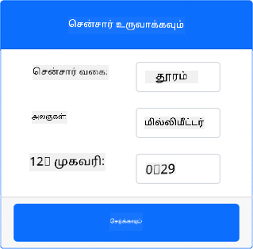
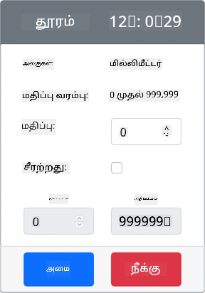

<!--
CO_OP_TRANSLATOR_METADATA:
{
  "original_hash": "7e9f05bdc50a40fd924b1d66934471bf",
  "translation_date": "2025-10-11T11:50:38+00:00",
  "source_file": "4-manufacturing/lessons/4-trigger-fruit-detector/virtual-device-proximity.md",
  "language_code": "ta"
}
-->
# அருகாமை கண்டறிதல் - மெய்நிகர் IoT சாதனம்

இந்த பாடத்தின் இந்த பகுதியில், உங்கள் மெய்நிகர் IoT சாதனத்தில் ஒரு அருகாமை சென்சரை சேர்த்து, அதிலிருந்து தூரத்தை படிக்கப் போகிறீர்கள்.

## ஹார்ட்வேர்கள்

மெய்நிகர் IoT சாதனம் ஒரு சிமுலேட்டட் தூர சென்சரைப் பயன்படுத்தும்.

ஒரு இயல்பான IoT சாதனத்தில், தூரத்தை கண்டறிய ஒரு லேசர் ரேஞ்சிங் மாட்யூல் கொண்ட சென்சரைப் பயன்படுத்துவீர்கள்.

### CounterFit-இல் தூர சென்சரைச் சேர்க்கவும்

மெய்நிகர் தூர சென்சரைப் பயன்படுத்த, நீங்கள் CounterFit பயன்பாட்டில் ஒன்றைச் சேர்க்க வேண்டும்.

#### பணிகள் - CounterFit-இல் தூர சென்சரைச் சேர்க்கவும்

CounterFit பயன்பாட்டில் தூர சென்சரைச் சேர்க்கவும்.

1. VS Code-இல் `fruit-quality-detector` குறியீட்டைத் திறக்கவும், மற்றும் மெய்நிகர் சூழல் செயல்படுத்தப்பட்டுள்ளதை உறுதிப்படுத்தவும்.

1. CounterFit shim-ஐ நிறுவ ஒரு கூடுதல் Pip தொகுப்பை நிறுவவும், இது [rpi-vl53l0x Pip package](https://pypi.org/project/rpi-vl53l0x/) ஐ சிமுலேட் செய்து தூர சென்சர்களுடன் தொடர்பு கொள்ள உதவுகிறது. இது [VL53L0X time-of-flight distance sensor](https://wiki.seeedstudio.com/Grove-Time_of_Flight_Distance_Sensor-VL53L0X/) உடன் தொடர்பு கொள்ளும் Python தொகுப்பு ஆகும். மெய்நிகர் சூழல் செயல்படுத்தப்பட்டுள்ள ஒரு டெர்மினலில் இருந்து இதை நிறுவுகிறீர்கள் என்பதை உறுதிப்படுத்தவும்.

    ```sh
    pip install counterfit-shims-rpi-vl53l0x
    ```

1. CounterFit வலை பயன்பாடு இயங்கிக் கொண்டிருக்கிறதா என்பதை உறுதிப்படுத்தவும்.

1. ஒரு தூர சென்சரை உருவாக்கவும்:

    1. *Sensors* பகுதியின் *Create sensor* பெட்டியில், *Sensor type* பெட்டியைத் திறந்து *Distance* ஐத் தேர்ந்தெடுக்கவும்.

    1. *Units* ஐ `Millimeter` ஆகவே விடவும்.

    1. இந்த சென்சர் ஒரு I<sup>2</sup>C சென்சர் ஆகும், எனவே முகவரியை `0x29` ஆக அமைக்கவும். நீங்கள் ஒரு இயல்பான VL53L0X சென்சரைப் பயன்படுத்தினால், இது இந்த முகவரியில் ஹார்ட்கோடு செய்யப்படும்.

    1. தூர சென்சரை உருவாக்க **Add** பொத்தானைத் தேர்ந்தெடுக்கவும்.

    

    தூர சென்சர் உருவாக்கப்பட்டு சென்சர்கள் பட்டியலில் தோன்றும்.

    

## தூர சென்சரை நிரலாக்கவும்

மெய்நிகர் IoT சாதனம் இப்போது சிமுலேட்டட் தூர சென்சரைப் பயன்படுத்த நிரலாக்கப்படலாம்.

### பணிகள் - time of flight சென்சரை நிரலாக்கவும்

1. `fruit-quality-detector` திட்டத்தில் `distance-sensor.py` என்ற புதிய கோப்பை உருவாக்கவும்.

    > 💁 பல IoT சாதனங்களை சிமுலேட் செய்ய எளிய வழி, ஒவ்வொன்றையும் தனித்த Python கோப்பில் செய்யவும், பின்னர் அவற்றை ஒரே நேரத்தில் இயக்கவும்.

1. CounterFit-இல் ஒரு இணைப்பை தொடங்க கீழே உள்ள குறியீட்டை சேர்க்கவும்:

    ```python
    from counterfit_connection import CounterFitConnection
    CounterFitConnection.init('127.0.0.1', 5000)
    ```

1. இதற்கு கீழே உள்ள குறியீட்டைச் சேர்க்கவும்:

    ```python
    import time
    
    from counterfit_shims_rpi_vl53l0x.vl53l0x import VL53L0X
    ```

    இது VL53L0X time of flight சென்சருக்கான சென்சர் நூலக ஷிமை இறக்குமதி செய்கிறது.

1. இதற்கு கீழே சென்சரை அணுக கீழே உள்ள குறியீட்டைச் சேர்க்கவும்:

    ```python
    distance_sensor = VL53L0X()
    distance_sensor.begin()
    ```

    இந்த குறியீடு ஒரு தூர சென்சரை அறிவிக்கிறது, பின்னர் சென்சரை தொடங்குகிறது.

1. இறுதியாக, தூரங்களைப் படிக்க ஒரு முடிவில்லா மடக்கத்தைச் சேர்க்கவும்:

    ```python
    while True:
        distance_sensor.wait_ready()
        print(f'Distance = {distance_sensor.get_distance()} mm')
        time.sleep(1)
    ```

    இந்த குறியீடு சென்சரிலிருந்து படிக்க ஒரு மதிப்பு தயாராக இருக்கும் வரை காத்திருக்கிறது, பின்னர் அதை கன்சோலில் அச்சிடுகிறது.

1. இந்த குறியீட்டை இயக்கவும்.

    > 💁 இந்த கோப்பு `distance-sensor.py` என்று அழைக்கப்படுகிறது என்பதை மறக்க வேண்டாம்! இதை Python மூலம் இயக்கவும், `app.py` மூலம் அல்ல.

1. நீங்கள் கன்சோலில் தூர அளவீடுகளைப் பார்க்க முடியும். CounterFit-இல் மதிப்பை மாற்றவும் அல்லது சீரற்ற மதிப்புகளைப் பயன்படுத்தவும்.

    ```output
    (.venv) ➜  fruit-quality-detector python distance-sensor.py 
    Distance = 37 mm
    Distance = 42 mm
    Distance = 29 mm
    ```

> 💁 இந்த குறியீட்டை [code-proximity/virtual-iot-device](../../../../../4-manufacturing/lessons/4-trigger-fruit-detector/code-proximity/virtual-iot-device) கோப்பகத்தில் காணலாம்.

😀 உங்கள் அருகாமை சென்சர் நிரல் வெற்றிகரமாக முடிந்தது!

---

**குறிப்பு**:  
இந்த ஆவணம் [Co-op Translator](https://github.com/Azure/co-op-translator) என்ற AI மொழிபெயர்ப்பு சேவையை பயன்படுத்தி மொழிபெயர்க்கப்பட்டுள்ளது. நாங்கள் துல்லியத்திற்காக முயற்சிக்கின்றோம், ஆனால் தானியங்கி மொழிபெயர்ப்புகளில் பிழைகள் அல்லது தவறான தகவல்கள் இருக்கக்கூடும் என்பதை கவனத்தில் கொள்ளவும். அதன் தாய்மொழியில் உள்ள மூல ஆவணம் அதிகாரப்பூர்வ ஆதாரமாக கருதப்பட வேண்டும். முக்கியமான தகவல்களுக்கு, தொழில்முறை மனித மொழிபெயர்ப்பு பரிந்துரைக்கப்படுகிறது. இந்த மொழிபெயர்ப்பைப் பயன்படுத்துவதால் ஏற்படும் எந்த தவறான புரிதல்கள் அல்லது தவறான விளக்கங்களுக்கு நாங்கள் பொறுப்பல்ல.