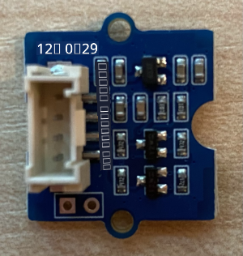

<!--
CO_OP_TRANSLATOR_METADATA:
{
  "original_hash": "288aebb0c59f7be1d2719b8f9660a313",
  "translation_date": "2025-10-11T11:52:44+00:00",
  "source_file": "4-manufacturing/lessons/4-trigger-fruit-detector/wio-terminal-proximity.md",
  "language_code": "ta"
}
-->
# நெருக்கத்தை கண்டறிதல் - Wio Terminal

இந்த பாடத்தின் இந்த பகுதியில், நீங்கள் உங்கள் Wio Terminal-க்கு ஒரு நெருக்கம் சென்சரை சேர்த்து, அதிலிருந்து தூரத்தை படிக்கப் போகிறீர்கள்.

## ஹார்ட்வேர்கள்

Wio Terminal-க்கு ஒரு நெருக்கம் சென்சர் தேவை.

நீங்கள் பயன்படுத்தப் போகும் சென்சர் [Grove Time of Flight distance sensor](https://www.seeedstudio.com/Grove-Time-of-Flight-Distance-Sensor-VL53L0X.html) ஆகும். இந்த சென்சர் தூரத்தை கண்டறிய லேசர் ரேஞ்சிங் மாட்யூலை பயன்படுத்துகிறது. இந்த சென்சரின் வரம்பு 10mm முதல் 2000mm (1cm - 2m) வரை உள்ளது, மேலும் 1000mm மேல் உள்ள தூரங்களை 8109mm என அறிக்கையிடும்.

லேசர் ரேஞ்ச்ஃபைண்டர் சென்சரின் பின்புறத்தில் உள்ளது, Grove சாக்கெட்டின் எதிர்மறை பக்கம்.

இது ஒரு I<sup>2</sup>C சென்சர்.

### Time of Flight சென்சரை இணைத்தல்

Grove Time of Flight சென்சரை Wio Terminal-க்கு இணைக்கலாம்.

#### பணிகள் - Time of Flight சென்சரை இணைத்தல்

Time of Flight சென்சரை இணைக்கவும்.



1. Grove கேபிளின் ஒரு முனையை Time of Flight சென்சரின் சாக்கெட்டில் செருகவும். இது ஒரு வழியில் மட்டுமே செருகப்படும்.

1. Wio Terminal உங்கள் கணினி அல்லது பிற மின்சார ஆதாரத்திலிருந்து துண்டிக்கப்பட்ட நிலையில், Grove கேபிளின் மற்ற முனையை Wio Terminal-ல் திரையின் இடது பக்கம் உள்ள Grove சாக்கெட்டில் இணைக்கவும். இது மின்மயமாக்கப்பட்ட மற்றும் I<sup>2</sup>C சாக்கெட் ஆகும்.


1. இப்போது Wio Terminal-ஐ உங்கள் கணினிக்கு இணைக்கலாம்.

## Time of Flight சென்சரை நிரலாக்குதல்

இப்போது Wio Terminal இணைக்கப்பட்ட Time of Flight சென்சரை பயன்படுத்த நிரலாக்கப்படலாம்.

### பணிகள் - Time of Flight சென்சரை நிரலாக்குதல்

1. PlatformIO-வைப் பயன்படுத்தி புதிய Wio Terminal திட்டத்தை உருவாக்கவும். இந்த திட்டத்திற்கு `distance-sensor` என பெயரிடவும். `setup` செயல்பாட்டில் சீரியல் போர்ட்டை அமைக்க குறியீட்டைச் சேர்க்கவும்.

1. Seeed Grove Time of Flight distance sensor நூலகத்திற்கான நூலக சார்பை திட்டத்தின் `platformio.ini` கோப்பில் சேர்க்கவும்:

    ```ini
    lib_deps =
        seeed-studio/Grove Ranging sensor - VL53L0X @ ^1.1.1
    ```

1. `main.cpp`-இல், உள்ளடக்கப்பட்ட இயக்கவியல் கீழே உள்ளதைச் சேர்த்து, Time of Flight சென்சருடன் தொடர்பு கொள்ள `Seeed_vl53l0x` வகுப்பின் ஒரு உதாரணத்தை அறிவிக்கவும்:

    ```cpp
    #include "Seeed_vl53l0x.h"
    
    Seeed_vl53l0x VL53L0X;
    ```

1. சென்சரை ஆரம்பிக்க `setup` செயல்பாட்டின் கீழே இதைச் சேர்க்கவும்:

    ```cpp
    VL53L0X.VL53L0X_common_init();
    VL53L0X.VL53L0X_high_accuracy_ranging_init();
    ```

1. `loop` செயல்பாட்டில், சென்சரிலிருந்து ஒரு மதிப்பை வாசிக்கவும்:

    ```cpp
    VL53L0X_RangingMeasurementData_t RangingMeasurementData;
    memset(&RangingMeasurementData, 0, sizeof(VL53L0X_RangingMeasurementData_t));

    VL53L0X.PerformSingleRangingMeasurement(&RangingMeasurementData);
    ```

    இந்த குறியீடு தரவுகளை வாசிக்க ஒரு தரவமைப்பை ஆரம்பிக்கிறது, பின்னர் அதை `PerformSingleRangingMeasurement` முறைமையில் அனுப்புகிறது, அங்கு அது தூர அளவீட்டுடன் நிரப்பப்படும்.

1. இதற்குப் பிறகு, தூர அளவீட்டை எழுதவும், பின்னர் 1 வினாடி தாமதிக்கவும்:

    ```cpp
    Serial.print("Distance = ");
    Serial.print(RangingMeasurementData.RangeMilliMeter);
    Serial.println(" mm");

    delay(1000);
    ```

1. இந்த குறியீட்டை உருவாக்கி, பதிவேற்றி, இயக்கவும். நீங்கள் சீரியல் மானிட்டரில் தூர அளவீடுகளைப் பார்க்க முடியும். சென்சரின் அருகில் பொருட்களை வைத்துப் பாருங்கள், நீங்கள் தூர அளவீட்டை காணலாம்:

    ```output
    Distance = 29 mm
    Distance = 28 mm
    Distance = 30 mm
    Distance = 151 mm
    ```

    ரேஞ்ச்ஃபைண்டர் சென்சரின் பின்புறத்தில் உள்ளது, எனவே தூரத்தை அளவிட சரியான பக்கத்தை பயன்படுத்த உறுதிப்படுத்தவும்.

    

> 💁 இந்த குறியீட்டை [code-proximity/wio-terminal](../../../../../4-manufacturing/lessons/4-trigger-fruit-detector/code-proximity/wio-terminal) கோப்பகத்தில் காணலாம்.

😀 உங்கள் நெருக்கம் சென்சர் நிரல் வெற்றிகரமாக முடிந்தது!

---

**குறிப்பு**:  
இந்த ஆவணம் [Co-op Translator](https://github.com/Azure/co-op-translator) என்ற AI மொழிபெயர்ப்பு சேவையைப் பயன்படுத்தி மொழிபெயர்க்கப்பட்டுள்ளது. நாங்கள் துல்லியத்திற்காக முயற்சிக்கின்றோம், ஆனால் தானியங்கி மொழிபெயர்ப்புகளில் பிழைகள் அல்லது தவறான தகவல்கள் இருக்கக்கூடும் என்பதை கவனத்தில் கொள்ளவும். அதன் தாய்மொழியில் உள்ள மூல ஆவணம் அதிகாரப்பூர்வ ஆதாரமாக கருதப்பட வேண்டும். முக்கியமான தகவல்களுக்கு, தொழில்முறை மனித மொழிபெயர்ப்பு பரிந்துரைக்கப்படுகிறது. இந்த மொழிபெயர்ப்பைப் பயன்படுத்துவதால் ஏற்படும் எந்த தவறான புரிதல்கள் அல்லது தவறான விளக்கங்களுக்கு நாங்கள் பொறுப்பல்ல.