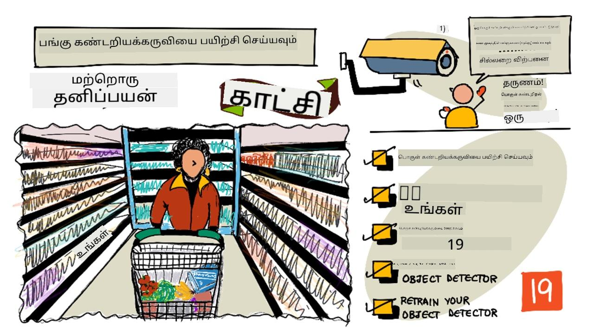
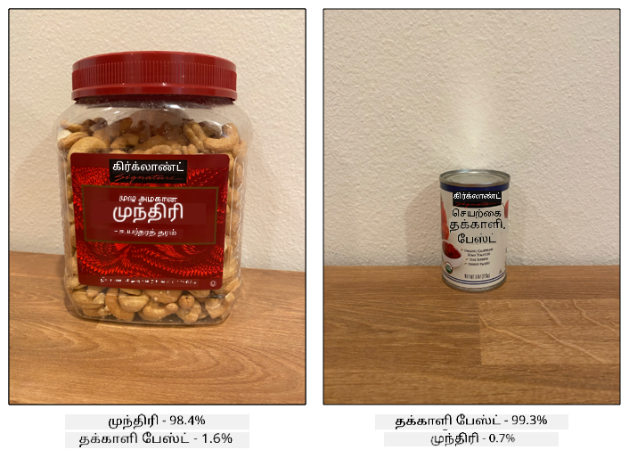
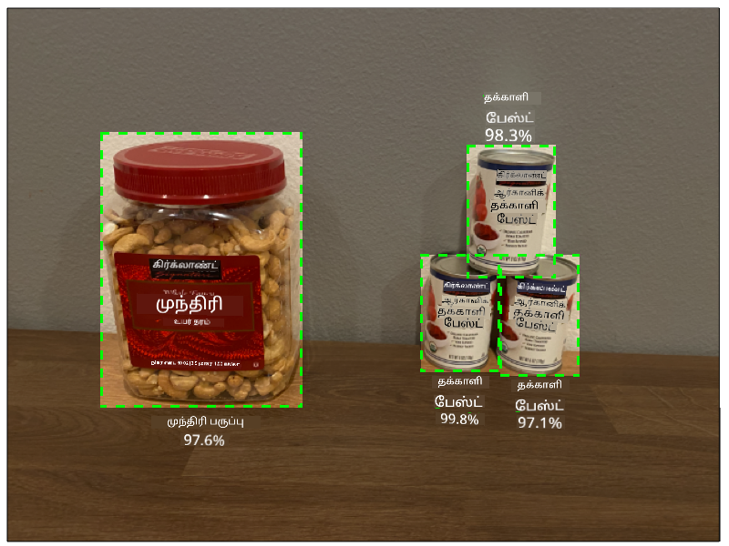
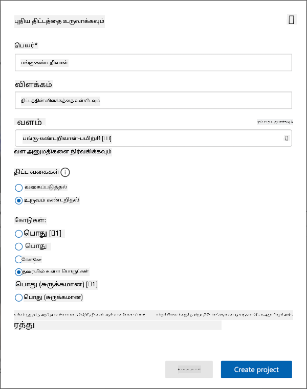
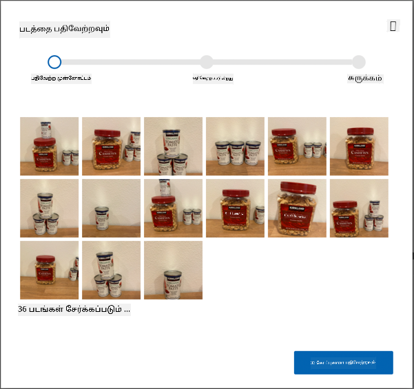
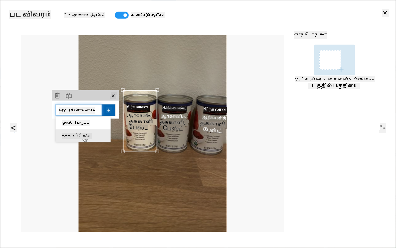
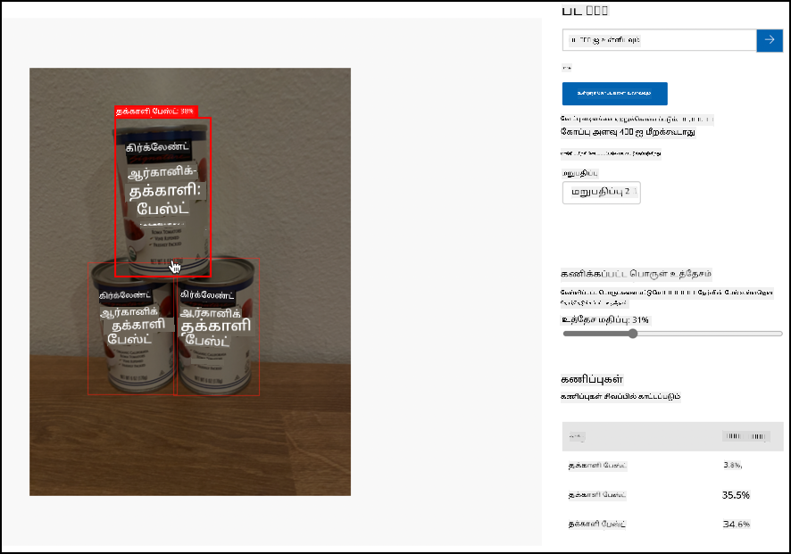

<!--
CO_OP_TRANSLATOR_METADATA:
{
  "original_hash": "8df310a42f902139a01417dacb1ffbef",
  "translation_date": "2025-10-11T12:51:35+00:00",
  "source_file": "5-retail/lessons/1-train-stock-detector/README.md",
  "language_code": "ta"
}
-->
# பங்கு கண்டறியக்கூடிய மாடலை பயிற்சி செய்யுங்கள்

> சித்திரம்: [நித்யா நரசிம்மன்](https://github.com/nitya). பெரிய பதிப்பை பார்க்க படத்தை கிளிக் செய்யவும்.

இந்த வீடியோ Azure Custom Vision சேவையின் பொருள் கண்டறிதல் பற்றிய ஒரு சுருக்கத்தை வழங்குகிறது. இந்த பாடத்தில் இந்த சேவை பற்றி விரிவாக கற்போம்.

> 🎥 மேலே உள்ள படத்தை கிளிக் செய்து வீடியோவைப் பாருங்கள்

## பாடத்திற்கு முன் கேள்வி

[பாடத்திற்கு முன் கேள்வி](https://black-meadow-040d15503.1.azurestaticapps.net/quiz/37)

## அறிமுகம்

முந்தைய திட்டத்தில், நீங்கள் AI-யை பயன்படுத்தி ஒரு படத்தை வகைப்படுத்தும் மாடலை உருவாக்கினீர்கள் - ஒரு படம் பழுத்த பழம் அல்லது பழுத்தாத பழம் போன்றவற்றை உள்ளடக்கியதா என்பதை சொல்லும் மாடல். படங்களுடன் பயன்படுத்தக்கூடிய மற்றொரு வகையான AI மாடல் பொருள் கண்டறிதல் ஆகும். இந்த மாடல்கள் படத்தை முழுமையாக வகைப்படுத்துவதற்குப் பதிலாக, பொருள்களை அடையாளம் காண பயிற்சி பெறுகின்றன, மேலும் அவற்றை படங்களில் கண்டறிய முடியும். இது படங்களில் உள்ள பொருள்களை எண்ணுவதற்கு உதவுகிறது.

இந்த பாடத்தில் நீங்கள் பொருள் கண்டறிதல் பற்றி கற்றுக்கொள்வீர்கள், குறிப்பாக இது சில்லறை வணிகத்தில் எப்படி பயன்படுத்தப்படுகிறது என்பதை. மேலும், நீங்கள் மேகத்தில் ஒரு பொருள் கண்டறியக்கூடிய மாடலை பயிற்சி செய்ய கற்றுக்கொள்வீர்கள்.

இந்த பாடத்தில் நாம் கற்றுக்கொள்ளப் போவது:

* [பொருள் கண்டறிதல்](../../../../../5-retail/lessons/1-train-stock-detector)
* [சில்லறை வணிகத்தில் பொருள் கண்டறிதல்](../../../../../5-retail/lessons/1-train-stock-detector)
* [ஒரு பொருள் கண்டறியக்கூடிய மாடலை பயிற்சி செய்யுங்கள்](../../../../../5-retail/lessons/1-train-stock-detector)
* [உங்கள் மாடலை சோதிக்கவும்](../../../../../5-retail/lessons/1-train-stock-detector)
* [மீண்டும் உங்கள் மாடலை பயிற்சி செய்யுங்கள்](../../../../../5-retail/lessons/1-train-stock-detector)

## பொருள் கண்டறிதல்

பொருள் கண்டறிதல் என்பது AI-யை பயன்படுத்தி படங்களில் உள்ள பொருள்களை கண்டறிவது. நீங்கள் முந்தைய திட்டத்தில் பயிற்சி செய்த பட வகைப்படுத்தும் மாடலைப் போல அல்லாமல், இது ஒரு படத்தின் முழுமையான டேக் (tag) கணிப்புகளைப் பற்றியது அல்ல, ஆனால் ஒரு படத்தில் ஒரு அல்லது அதற்கு மேற்பட்ட பொருள்களை கண்டறிவது.

### பொருள் கண்டறிதல் vs பட வகைப்படுத்தல்

பட வகைப்படுத்தல் என்பது ஒரு படத்தை முழுமையாக வகைப்படுத்துவது - அந்த படம் ஒவ்வொரு டேக்கிற்கும் பொருந்தும் சாத்தியக்கூறுகள் என்ன. நீங்கள் மாடலை பயிற்சி செய்ய பயன்படுத்திய ஒவ்வொரு டேக்கிற்கும் சாத்தியக்கூறுகளைப் பெறுவீர்கள்.

மேலே உள்ள உதாரணத்தில், இரண்டு படங்கள் கஜு பருப்பு அல்லது தக்காளி பேஸ்ட் வகைப்படுத்துவதற்கான மாடலைப் பயன்படுத்தி வகைப்படுத்தப்பட்டுள்ளன. முதல் படம் கஜு பருப்பு கொண்டது, மற்றும் அதன் வகைப்படுத்தல் முடிவுகள்:

| டேக்            | சாத்தியக்கூறு |
| ---------------- | ------------: |
| `கஜு பருப்பு`   | 98.4%         |
| `தக்காளி பேஸ்ட்` | 1.6%          |

இரண்டாவது படம் தக்காளி பேஸ்ட் கொண்டது, மற்றும் அதன் முடிவுகள்:

| டேக்            | சாத்தியக்கூறு |
| ---------------- | ------------: |
| `கஜு பருப்பு`   | 0.7%          |
| `தக்காளி பேஸ்ட்` | 99.3%         |

இந்த மதிப்புகளை ஒரு சாத்தியக்கூறு விகிதத்துடன் பயன்படுத்தி படத்தில் என்ன இருக்கிறது என்பதை கணிக்கலாம். ஆனால் ஒரு படத்தில் பல தக்காளி பேஸ்ட் கேன்கள் அல்லது கஜு பருப்பு மற்றும் தக்காளி பேஸ்ட் இரண்டும் இருந்தால் என்ன? முடிவுகள் உங்களுக்கு தேவையானதை வழங்காது. இதுதான் பொருள் கண்டறிதல் எங்கு உதவுகிறது.

பொருள் கண்டறிதல் என்பது ஒரு மாடலை பொருள்களை அடையாளம் காண பயிற்சி செய்வது. படங்களை பொருளுடன் கொடுத்து, ஒவ்வொரு படமும் ஒரு டேக் அல்லது மற்றொன்றாக உள்ளது என்று சொல்லுவதற்குப் பதிலாக, நீங்கள் ஒரு படத்தில் குறிப்பிட்ட பொருளை உள்ளடக்கிய பகுதியை அடையாளம் காண வேண்டும், மற்றும் அதை டேக் செய்ய வேண்டும். ஒரு படத்தில் ஒரு பொருளை அல்லது பலவற்றை டேக் செய்யலாம். இந்த வழியில் மாடல் பொருளின் தோற்றத்தை கற்றுக்கொள்கிறது, பொருளை உள்ளடக்கிய படங்கள் எப்படி தோன்றுகின்றன என்பதை மட்டும் அல்ல.

பின்னர் நீங்கள் அதை கணிக்க பயன்படுத்தும்போது, டேக்குகள் மற்றும் சாத்தியக்கூறுகளின் பட்டியலைப் பெறுவதற்குப் பதிலாக, கண்டறியப்பட்ட பொருள்களின் பட்டியலைப் பெறுவீர்கள், அவற்றின் *பவுண்டிங் பாக்ஸ்* மற்றும் அந்த பொருள் ஒதுக்கப்பட்ட டேக்கிற்கு பொருந்தும் சாத்தியக்கூறு.

> 🎓 *பவுண்டிங் பாக்ஸ்* என்பது ஒரு பொருளைச் சுற்றியுள்ள பெட்டிகள்.

மேலே உள்ள படத்தில் கஜு பருப்பு மற்றும் மூன்று தக்காளி பேஸ்ட் கேன்கள் உள்ளன. பொருள் கண்டறியக்கூடிய மாடல் கஜு பருப்பை கண்டறிந்தது, கஜு பருப்பை உள்ளடக்கிய பவுண்டிங் பாக்ஸை 97.6% சாத்தியக்கூறுடன் திருப்புகிறது. பொருள் கண்டறியக்கூடிய மாடல் மூன்று தக்காளி பேஸ்ட் கேன்களையும் கண்டறிந்துள்ளது, மற்றும் ஒவ்வொரு கண்டறியப்பட்ட கேனுக்கும் தனித்தனியான பவுண்டிங் பாக்ஸ்களை வழங்குகிறது, ஒவ்வொன்றும் தக்காளி பேஸ்ட் கேனை உள்ளடக்கிய சாத்தியக்கூறுடன்.

✅ பட அடிப்படையிலான AI மாடல்களை நீங்கள் எந்த சூழல்களில் பயன்படுத்த விரும்புகிறீர்கள் என்று சிந்தியுங்கள். எந்தவகை வகைப்படுத்தல் தேவைப்படும், மற்றும் எந்தவகை பொருள் கண்டறிதல் தேவைப்படும்?

### பொருள் கண்டறிதல் எப்படி செயல்படுகிறது

பொருள் கண்டறிதல் சிக்கலான ML மாடல்களைப் பயன்படுத்துகிறது. இந்த மாடல்கள் படத்தை பல செல் பகுதிகளாகப் பிரிக்கின்றன, பின்னர் பவுண்டிங் பாக்ஸின் மையம் மாடலை பயிற்சி செய்ய பயன்படுத்திய படங்களின் மையத்துடன் பொருந்துகிறதா என்பதை சரிபார்க்கின்றன. இது ஒரு வகைப்படுத்தும் மாடலை படத்தின் பல பகுதிகளில் இயக்கி பொருத்தங்களைத் தேடுவது போன்றது.

> 💁 இது மிகவும் எளிமைப்படுத்தப்பட்ட விளக்கம். பொருள் கண்டறிதலுக்கான பல தொழில்நுட்பங்கள் உள்ளன, மேலும் [விக்கிபீடியாவின் பொருள் கண்டறிதல் பக்கம்](https://wikipedia.org/wiki/Object_detection) பற்றி மேலும் படிக்கலாம்.

பொருள் கண்டறிதலுக்கான பல மாடல்கள் உள்ளன. குறிப்பாக பிரபலமான மாடல் [YOLO (You only look once)](https://pjreddie.com/darknet/yolo/) ஆகும், இது மிகவும் வேகமாக செயல்படுகிறது மற்றும் மனிதர்கள், நாய்கள், பாட்டில்கள் மற்றும் கார்கள் போன்ற 20 வகையான பொருள்களை கண்டறிய முடியும்.

✅ [pjreddie.com/darknet/yolo/](https://pjreddie.com/darknet/yolo/) பக்கத்தில் YOLO மாடல் பற்றி படிக்கவும்.

பொருள் கண்டறியக்கூடிய மாடல்களை மாற்று கற்றல் (transfer learning) மூலம் தனிப்பயன் பொருள்களை கண்டறிய பயிற்சி செய்யலாம்.

## சில்லறை வணிகத்தில் பொருள் கண்டறிதல்

சில்லறை வணிகத்தில் பொருள் கண்டறிதல் பல பயன்பாடுகளை கொண்டுள்ளது. சிலவற்றைச் சேர்த்தால்:

* **பங்கு சரிபார்ப்பு மற்றும் எண்ணிக்கை** - தட்டுகளில் பங்கு குறைவாக இருக்கும் போது அடையாளம் காணுதல். பங்கு மிகவும் குறைவாக இருந்தால், ஊழியர்கள் அல்லது ரோபோட்களுக்கு தட்டுகளை மீண்டும் நிரப்ப அறிவிப்புகள் அனுப்பப்படலாம்.
* **முகக்கவசம் கண்டறிதல்** - பொது சுகாதார நிகழ்வுகளின் போது முகக்கவச கொள்கைகள் உள்ள கடைகளில், முகக்கவசம் அணிந்தவர்கள் மற்றும் அணியாதவர்களை அடையாளம் காண முடியும்.
* **தானியங்க Billing** - தட்டுகளில் இருந்து பொருட்களை எடுத்தல் மற்றும் வாடிக்கையாளர்களுக்கு சரியான கட்டணம் வசூலித்தல்.
* **ஆபத்து கண்டறிதல்** - தரையில் உடைந்த பொருட்கள் அல்லது சிந்திய திரவங்களை அடையாளம் காணுதல், சுத்தம் செய்யும் குழுக்களுக்கு எச்சரிக்கை அனுப்புதல்.

✅ ஆராய்ச்சி செய்யுங்கள்: சில்லறை வணிகத்தில் பொருள் கண்டறிதலுக்கான மேலும் என்ன பயன்பாடுகள் உள்ளன?

## ஒரு பொருள் கண்டறியக்கூடிய மாடலை பயிற்சி செய்யுங்கள்

Custom Vision-ஐ பயன்படுத்தி ஒரு பொருள் கண்டறியக்கூடிய மாடலை உருவாக்கலாம், நீங்கள் முந்தைய பட வகைப்படுத்தும் மாடலை உருவாக்கியதைப் போலவே.

### பணிகள் - ஒரு பொருள் கண்டறியக்கூடிய மாடலை உருவாக்குங்கள்

1. இந்த திட்டத்திற்கான ஒரு Resource Group உருவாக்குங்கள், இதற்கு `stock-detector` என்று பெயரிடுங்கள்.

1. `stock-detector` Resource Group-இல் ஒரு இலவச Custom Vision பயிற்சி resource மற்றும் ஒரு இலவச Custom Vision கணிப்பு resource உருவாக்குங்கள். அவற்றிற்கு `stock-detector-training` மற்றும் `stock-detector-prediction` என்று பெயரிடுங்கள்.

    > 💁 நீங்கள் ஒரு இலவச பயிற்சி மற்றும் கணிப்பு resource மட்டுமே வைத்திருக்க முடியும், எனவே முந்தைய பாடங்களில் இருந்து உங்கள் திட்டத்தை சுத்தம் செய்துள்ளீர்கள் என்பதை உறுதிப்படுத்துங்கள்.

    > ⚠️ [திட்டம் 4, பாடம் 1-இல் பயிற்சி மற்றும் கணிப்பு resource-களை உருவாக்குவதற்கான வழிமுறைகளை](../../../4-manufacturing/lessons/1-train-fruit-detector/README.md#task---create-a-cognitive-services-resource) தேவையானால் பார்க்கலாம்.

1. [CustomVision.ai](https://customvision.ai) Custom Vision போர்ட்டலைத் தொடங்குங்கள், மற்றும் உங்கள் Azure கணக்கிற்குப் பயன்படுத்திய Microsoft கணக்குடன் உள்நுழையுங்கள்.

1. Microsoft Docs-இல் உள்ள [Build an object detector quickstart-இன் புதிய திட்டத்தை உருவாக்கும் பகுதியை](https://docs.microsoft.com/azure/cognitive-services/custom-vision-service/get-started-build-detector?WT.mc_id=academic-17441-jabenn#create-a-new-project) பின்பற்றுங்கள். UI மாற்றப்படலாம், மேலும் இந்த ஆவணங்கள் எப்போதும் சமீபத்தியவை.

    உங்கள் திட்டத்திற்கு `stock-detector` என்று பெயரிடுங்கள்.

    உங்கள் திட்டத்தை உருவாக்கும்போது, நீங்கள் முந்தைய `stock-detector-training` resource-ஐ பயன்படுத்த வேண்டும். *Object Detection* திட்ட வகையை மற்றும் *Products on Shelves* டொமைனை தேர்ந்தெடுக்கவும்.

    

    ✅ கடை தட்டுகளில் பங்குகளை கண்டறிய *Products on Shelves* டொமைன் குறிப்பாக வடிவமைக்கப்பட்டுள்ளது. [Microsoft Docs-இல் Select a domain ஆவணத்தில்](https://docs.microsoft.com/azure/cognitive-services/custom-vision-service/select-domain?WT.mc_id=academic-17441-jabenn#object-detection) டொமைன்கள் பற்றிய மேலும் தகவலைப் படிக்கவும்.

✅ உங்கள் பொருள் கண்டறியக்கூடிய மாடலுக்கான Custom Vision UI-யை ஆராய்வதற்கு சில நேரம் செலவிடுங்கள்.

### பணிகள் - உங்கள் மாடலை பயிற்சி செய்யுங்கள்

உங்கள் மாடலை பயிற்சி செய்ய, நீங்கள் கண்டறிய வேண்டிய பொருள்களை உள்ளடக்கிய படங்களின் தொகுப்பை தேவைப்படும்.

1. கண்டறிய வேண்டிய பொருளை உள்ளடக்கிய படங்களை சேகரிக்கவும். ஒவ்வொரு பொருளுக்கும் குறைந்தது 15 படங்கள் தேவைப்படும், பல்வேறு கோணங்களில் மற்றும் வெவ்வேறு ஒளி நிலைகளில். ஆனால் அதிகமாக இருந்தால் நல்லது. இந்த பொருள் கண்டறியக்கூடிய மாடல் *Products on shelves* டொமைனைப் பயன்படுத்துகிறது, எனவே பொருள்களை கடை தட்டில் உள்ளதைப் போல அமைக்க முயற்சிக்கவும். மேலும் மாடலை சோதிக்க சில படங்கள் தேவைப்படும். நீங்கள் பல பொருள்களை கண்டறிய முயற்சிக்கிறீர்கள் என்றால், அனைத்து பொருள்களையும் உள்ளடக்கிய சோதனை படங்கள் தேவைப்படும்.

    > 💁 பல்வேறு பொருள்களை உள்ளடக்கிய படங்கள், படத்தில் உள்ள அனைத்து பொருள்களுக்கும் 15 படங்களின் குறைந்தபட்ச எண்ணிக்கைக்கு கணக்கிடப்படும்.

    உங்கள் படங்கள் png அல்லது jpeg வடிவில் இருக்க வேண்டும், 6MB-க்கு குறைவாக. உதாரணமாக, iPhone-இல் உருவாக்கப்பட்ட படங்கள் உயர்-தீர்மான HEIC படங்களாக இருக்கலாம், எனவே அவற்றை மாற்றவும் மற்றும் சுருக்கவும் தேவைப்படும். அதிக படங்கள் இருந்தால் நல்லது, மேலும் பழுத்த மற்றும் பழுத்தாத பொருள்களின் எண்ணிக்கை சமமாக இருக்க வேண்டும்.

    மாடல் தட்டுகளில் உள்ள பொருள்களுக்காக வடிவமைக்கப்பட்டுள்ளது, எனவே பொருள்களின் படங்களை தட்டுகளில் எடுத்துக்கொள்ள முயற்சிக்கவும்.

    நீங்கள் பயன்படுத்தக்கூடிய சில உதாரண படங்களை [images](../../../../../5-retail/lessons/1-train-stock-detector/images) கோப்பகத்தில் காணலாம், கஜு பருப்பு மற்றும் தக்காளி பேஸ்ட்.

1. Microsoft Docs-இல் உள்ள [Build an object detector quickstart-இன் படங்களைப் பதிவேற்றம் மற்றும் டேக் செய்யும் பகுதியை](https://docs.microsoft.com/azure/cognitive-services/custom-vision-service/get-started-build-detector?WT.mc_id=academic-17441-jabenn#upload-and-tag-images) பின்பற்றுங்கள். நீங்கள் கண்டறிய விரும்பும் பொருள்களின் வகைகளுக்கு ஏற்ப டேக்குகளை உருவாக்குங்கள்.

    

    பொருள்களுக்கு பவுண்டிங் பாக்ஸ்களை வரையும்போது, அவற்றை பொருளின் சுற்றியுள்ள பகுதிக்கு நெருக்கமாக வைத்திருக்கவும். அனைத்து படங்களையும் வரைய எடுக்கும் நேரம் அதிகமாக இருக்கலாம், ஆனால் கருவி பவுண்டிங் பாக்ஸ்கள் என்னவென்று கண்டறிய முயற்சிக்கும், இது வேகமாக செய்ய உதவும்.

    

    > 💁 ஒவ்வொரு பொருளுக்கும் 15 படங்களுக்கும் மேல் இருந்தால், நீங்கள் 15 படங்களுக்குப் பிறகு பயிற்சி செய்யலாம், பின்னர் **Suggested tags** அம்சத்தைப் பயன்படுத்தலாம். இது பயிற்சி செய்யப்பட்ட மாடலை பயன்படுத்தி டேக் செய்யப்படாத படங்களில் பொருள்களை கண்டறிய உதவும். பின்னர் நீங்கள் கண்டறியப்பட்ட பொருள்களை உறுதிப்படுத்தலாம் அல்லது நிராகரித்து பவுண்டிங் பாக்ஸ்களை மீண்டும் வரையலாம். இது *மிகவும்* நேரத்தை மிச்சப்படுத்தும்.

1. Microsoft Docs-இல் உள்ள [Build an object detector quickstart-இன் மாடலை பயிற்சி செய்யும் பகுதியை](https://docs.microsoft.com/azure/cognitive-services/custom-vision-service/get-started-build-detector?WT.mc_id=academic-17441-jabenn#train-the-detector) பின்பற்றுங்கள், உங்கள் டேக் செய்யப்பட்ட படங்களில் பொருள் கண்டறியக்கூடிய மாடலை பயிற்சி செய்ய.

    பயிற்சி வகையை தேர்ந்தெடுக்கும்போது, **Quick Training**-ஐ தேர்ந்தெடுக்கவும்.

பொருள் கண்டறியக்கூடிய மாடல் பயிற்சி செய்யும். பயிற்சி முடிவடைய சில நிமிடங்கள் ஆகும்.

## உங்கள் மாடலை சோதிக்கவும்

உங்கள் மாடல் பயிற்சி செய்யப்பட்ட பிறகு, புதிய படங்களை கொடுத்து பொருள்களை கண்டறிய சோதிக்கலாம்.

### பணிகள் - உங்கள் மாடலை சோதிக்கவும்

1. **Quick Test** பொத்தானை பயன்படுத்தி சோதனை படங்களைப் பதிவேற்றவும் மற்றும் பொருள்கள் கண்டறியப்பட்டுள்ளதா என்பதை உறுதிப்படுத்தவும். நீங்கள் முன்பே உருவாக்கிய சோதனை படங்களைப் பயன்படுத்தவும், பயிற்சி செய்ய பயன்படுத்திய எந்த படங்களையும் பயன்படுத்த வேண்டாம்.

    

1. உங்களிடம் உள்ள அனைத்து சோதனை படங்களையும் முயற்சிக்கவும் மற்றும் சாத்தியக்கூறுகளை கவனிக்கவும்.

## மீண்டும் உங்கள் மாடலை பயிற்சி செய்யுங்கள்

உங்கள் மாடலை சோதிக்கும்போது, அது நீங்கள் எதிர்பார்த்த முடிவுகளை வழங்காமல் இருக்கலாம், முந்தைய திட்டத்தில் உள்ள பட வகைப்படுத்தும் மாடல்களைப் போல. உங்கள் மாடலை அது தவறாக பெறும் படங்களுடன் மீண்டும் பயிற்சி செய்து மேம்படுத்தலாம்.

**Quick Test** விருப்பத்தைப் பயன்படுத்தி ஒவ்வொரு முறையும் கணிப்பு செய்யும்போது, படம் மற்றும் முடிவுகள் சேமிக்கப்படும். இந்த படங்களை உங்கள் மாடலை மீண்டும் பயிற்சி செய்ய பயன்படுத்தலாம்.

1. **Predictions** தாவலைப் பயன்படுத்தி
ஒரே மாதிரியான பொருட்களுடன், உதாரணமாக ஒரே பிராண்ட் டமாட்டோ பேஸ்ட் மற்றும் நறுக்கிய டமாட்டோ கான்களை, பொருள் கண்டறியக்கூடிய கருவியை பயன்படுத்தினால் என்ன நடக்கும்?

உங்களிடம் ஒரே மாதிரியான பொருட்கள் இருந்தால், அவற்றின் படங்களை உங்கள் பொருள் கண்டறியக்கூடிய கருவியில் சேர்த்து சோதிக்கவும்.

## பாடத்திற்குப் பிந்தைய வினாடி வினா

[பாடத்திற்குப் பிந்தைய வினாடி வினா](https://black-meadow-040d15503.1.azurestaticapps.net/quiz/38)

## மதிப்பீடு & சுயபயிற்சி

* உங்கள் பொருள் கண்டறியக்கூடிய கருவியை நீங்கள் பயிற்சி செய்தபோது, *Precision*, *Recall*, மற்றும் *mAP* போன்ற மதிப்பீடுகளை நீங்கள் பார்த்திருப்பீர்கள், இது உருவாக்கப்பட்ட மாடலை மதிப்பீடு செய்கிறது. இவை என்ன என்பதைப் பற்றி [Microsoft ஆவணங்களில் உள்ள Build an object detector quickstart இன் Evaluate the detector பகுதியை](https://docs.microsoft.com/azure/cognitive-services/custom-vision-service/get-started-build-detector?WT.mc_id=academic-17441-jabenn#evaluate-the-detector) பயன்படுத்தி படிக்கவும்.
* [Wikipedia-யின் Object detection பக்கம்](https://wikipedia.org/wiki/Object_detection) மூலம் பொருள் கண்டறிதல் பற்றிய மேலும் தகவல்களை படிக்கவும்.

## பணிக்கட்டளை

[களங்களை ஒப்பிடவும்](assignment.md)

---

**குறிப்பு**:  
இந்த ஆவணம் [Co-op Translator](https://github.com/Azure/co-op-translator) என்ற AI மொழிபெயர்ப்பு சேவையைப் பயன்படுத்தி மொழிபெயர்க்கப்பட்டுள்ளது. நாங்கள் துல்லியத்திற்காக முயற்சிக்கின்றோம், ஆனால் தானியங்கி மொழிபெயர்ப்புகளில் பிழைகள் அல்லது தவறான தகவல்கள் இருக்கக்கூடும் என்பதை தயவுசெய்து கவனத்தில் கொள்ளுங்கள். அதன் தாய்மொழியில் உள்ள மூல ஆவணம் அதிகாரப்பூர்வ ஆதாரமாக கருதப்பட வேண்டும். முக்கியமான தகவல்களுக்கு, தொழில்முறை மனித மொழிபெயர்ப்பு பரிந்துரைக்கப்படுகிறது. இந்த மொழிபெயர்ப்பைப் பயன்படுத்துவதால் ஏற்படும் எந்த தவறான புரிதல்கள் அல்லது தவறான விளக்கங்களுக்கு நாங்கள் பொறுப்பல்ல.