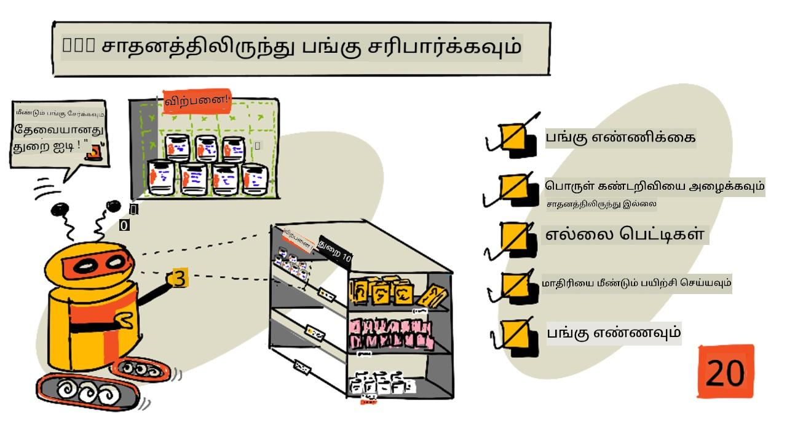
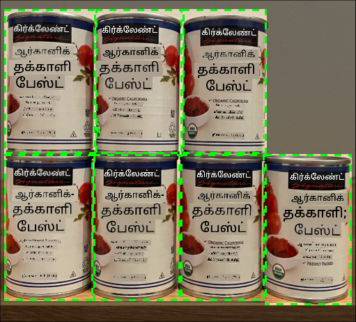
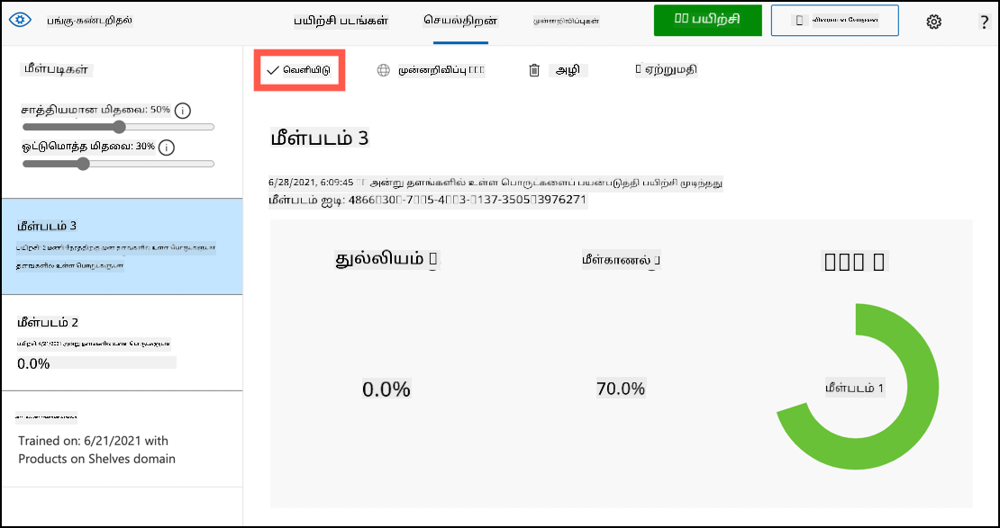
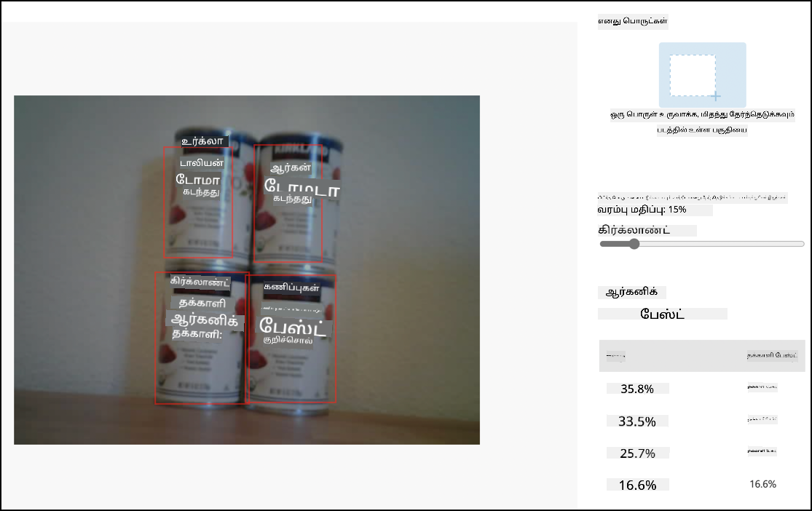
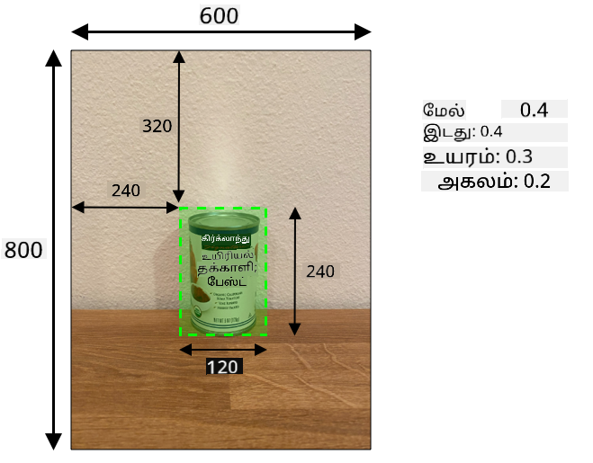
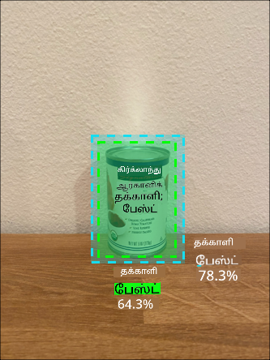

<!--
CO_OP_TRANSLATOR_METADATA:
{
  "original_hash": "1c9e5fa8b7be726c75a97232b1e41c97",
  "translation_date": "2025-10-11T12:49:22+00:00",
  "source_file": "5-retail/lessons/2-check-stock-device/README.md",
  "language_code": "ta"
}
-->
# IoT சாதனத்திலிருந்து பங்கு சரிபார்க்கவும்



> ஸ்கெட்ச் நோட்: [நித்யா நரசிம்மன்](https://github.com/nitya). படத்தை கிளிக் செய்து பெரிய பதிப்பைப் பார்க்கவும்.

## முன்னோட்ட கேள்வி

[முன்னோட்ட கேள்வி](https://black-meadow-040d15503.1.azurestaticapps.net/quiz/39)

## அறிமுகம்

முந்தைய பாடத்தில், வணிகத்தில் பொருள் கண்டறிதல் எப்படி பயன்படுத்தப்படுகிறது என்பதைப் பற்றி நீங்கள் கற்றுக்கொண்டீர்கள். மேலும், பங்குகளை அடையாளம் காண ஒரு பொருள் கண்டறிவகை (object detector) எப்படி பயிற்சி செய்ய வேண்டும் என்பதையும் கற்றுக்கொண்டீர்கள். இந்த பாடத்தில், உங்கள் IoT சாதனத்திலிருந்து உங்கள் பொருள் கண்டறிவகையைப் பயன்படுத்தி பங்குகளை எண்ணுவது எப்படி என்பதை நீங்கள் கற்றுக்கொள்வீர்கள்.

இந்த பாடத்தில் நாம் கவரும் தலைப்புகள்:

* [பங்கு எண்ணல்](../../../../../5-retail/lessons/2-check-stock-device)
* [உங்கள் IoT சாதனத்திலிருந்து உங்கள் பொருள் கண்டறிவகையை அழைக்கவும்](../../../../../5-retail/lessons/2-check-stock-device)
* [Bounding boxes](../../../../../5-retail/lessons/2-check-stock-device)
* [மாதிரியை மீண்டும் பயிற்சி செய்யவும்](../../../../../5-retail/lessons/2-check-stock-device)
* [பங்குகளை எண்ணவும்](../../../../../5-retail/lessons/2-check-stock-device)

> 🗑 இந்த திட்டத்தின் கடைசி பாடம் இது. எனவே, இந்த பாடத்தையும் பணியையும் முடித்த பிறகு, உங்கள் கிளவுட் சேவைகளை சுத்தம் செய்ய மறக்க வேண்டாம். பணியை முடிக்க சேவைகள் தேவைப்படும், எனவே முதலில் அதை முடிக்க உறுதியாக இருக்கவும்.
>
> [திட்டத்தை சுத்தம் செய்யும் வழிகாட்டி](../../../clean-up.md) தேவையானால் இதைப் பார்க்கவும்.

## பங்கு எண்ணல்

பொருள் கண்டறிவகைகள் பங்குகளை சரிபார்க்க பயன்படுத்தப்படலாம், பங்குகளை எண்ணுவதற்கோ அல்லது பங்குகள் சரியான இடத்தில் உள்ளதா என்பதை உறுதிப்படுத்துவதற்கோ. IoT கேமராக்கள் கடை முழுவதும் பரவலாக அமைக்கப்படலாம், குறிப்பாக முக்கிய இடங்களில், அங்கு பொருட்களை மீண்டும் நிரப்புவது முக்கியம்.

உதாரணமாக, ஒரு கேமரா 8 டின்கள் டொமாட்டோ பேஸ்ட் வைத்திருக்கும் தட்டுகளை நோக்கி இருக்கிறது. ஆனால் பொருள் கண்டறிவகை 7 டின்களையே கண்டறிகிறது. இதனால் ஒன்று காணாமல் போயுள்ளது, அதை மீண்டும் நிரப்ப வேண்டும்.



மேலே உள்ள படத்தில், ஒரு பொருள் கண்டறிவகை 8 டின்கள் வைத்திருக்கும் தட்டில் 7 டின்களை மட்டுமே கண்டறிந்துள்ளது. IoT சாதனம் பங்கு நிரப்ப வேண்டிய தேவையை அறிவிக்க மட்டுமல்லாமல், காணாமல் போன பொருளின் இருப்பிடத்தைச் சுட்டிக்காட்டவும் முடியும். இது தானியங்கி ரோபோக்களைப் பயன்படுத்தி தட்டுகளை நிரப்புவதில் முக்கியமான தகவலாக இருக்கும்.

> 💁 கடை மற்றும் பொருளின் பிரபலத்தைக் கருத்தில் கொண்டு, ஒரு டின் மட்டும் காணாமல் போனால், பங்கு நிரப்பப்படாது. உங்கள் பொருட்கள், வாடிக்கையாளர்கள் மற்றும் பிற அளவுகோள்களை அடிப்படையாகக் கொண்டு பங்கு நிரப்ப வேண்டிய நேரத்தை தீர்மானிக்கும் ஒரு அல்காரிதத்தை உருவாக்க வேண்டும்.

✅ பொருள் கண்டறிவகை மற்றும் ரோபோக்களை இணைத்து வேறு எந்த சூழல்களில் பயன்படுத்தலாம்?

சில நேரங்களில் தவறான பொருட்கள் தட்டுகளில் இருக்கலாம். இது பங்கு நிரப்பும் போது மனித தவறாக இருக்கலாம் அல்லது வாடிக்கையாளர்கள் பொருளை வாங்குவதில் மனம் மாறி அதை முதல் கிடைக்கும் இடத்தில் வைக்கலாம். இது கான்டினர்ஸ் போன்ற மாறாத பொருட்கள் என்றால், இது ஒரு தொந்தரவு. ஆனால் இது உறைபொருட்கள் அல்லது குளிர்ந்த பொருட்கள் என்றால், பொருள் உறைவிலிருந்து எவ்வளவு நேரம் வெளியே இருந்தது என்பதைத் தீர்மானிக்க முடியாததால், அதை விற்க முடியாது.

பொருள் கண்டறிவகை எதிர்பாராத பொருட்களை கண்டறிய பயன்படுத்தப்படலாம், மேலும் ஒரு மனிதனுக்கு அல்லது ரோபோவுக்கு பொருளை திரும்பச் செய்ய அறிவிக்கலாம்.


மேலே உள்ள படத்தில், ஒரு குழந்தை மக்கா டின் டொமாட்டோ பேஸ்ட் தட்டில் வைக்கப்பட்டுள்ளது. பொருள் கண்டறிவகை இதை கண்டறிந்துள்ளது, இதனால் IoT சாதனம் ஒரு மனிதனுக்கு அல்லது ரோபோவுக்கு டினை அதன் சரியான இடத்திற்கு திரும்பச் செய்ய அறிவிக்க முடியும்.

## உங்கள் IoT சாதனத்திலிருந்து உங்கள் பொருள் கண்டறிவகையை அழைக்கவும்

முந்தைய பாடத்தில் நீங்கள் பயிற்சி செய்த பொருள் கண்டறிவகையை உங்கள் IoT சாதனத்திலிருந்து அழைக்கலாம்.

### பணிகள் - உங்கள் பொருள் கண்டறிவகையின் iteration ஐ வெளியிடவும்

Iterations Custom Vision போர்ட்டலிலிருந்து வெளியிடப்படுகின்றன.

1. [CustomVision.ai](https://customvision.ai) போர்ட்டலைத் தொடங்கவும், உள்நுழையவும். உங்கள் `stock-detector` திட்டத்தைத் திறக்கவும்.

1. மேலே உள்ள விருப்பங்களில் **Performance** தாவலைத் தேர்ந்தெடுக்கவும்.

1. பக்கத்தில் உள்ள *Iterations* பட்டியலில் இருந்து சமீபத்திய iteration ஐத் தேர்ந்தெடுக்கவும்.

1. iteration க்கான **Publish** பொத்தானைத் தேர்ந்தெடுக்கவும்.

    

1. *Publish Model* உரையாடலில், *Prediction resource* ஐ நீங்கள் முந்தைய பாடத்தில் உருவாக்கிய `stock-detector-prediction` resource ஆக அமைக்கவும். பெயரை `Iteration2` ஆகவே விட்டு, **Publish** பொத்தானைத் தேர்ந்தெடுக்கவும்.

1. வெளியிடப்பட்டவுடன், **Prediction URL** பொத்தானைத் தேர்ந்தெடுக்கவும். இது prediction API விவரங்களை காட்டும், மேலும் உங்கள் IoT சாதனத்திலிருந்து மாதிரியை அழைக்க இதை நீங்கள் தேவைப்படும். கீழே உள்ள பகுதி *If you have an image file* என்று லேபிள் செய்யப்பட்டுள்ளது, இதுவே நீங்கள் தேவைப்படும் விவரங்கள். URL ஐ நகலெடுக்கவும், இது கீழே போன்றதாக இருக்கும்:

    ```output
    https://<location>.api.cognitive.microsoft.com/customvision/v3.0/Prediction/<id>/detect/iterations/Iteration2/image
    ```

    இங்கு `<location>` நீங்கள் உங்கள் custom vision resource ஐ உருவாக்கிய இடமாக இருக்கும், `<id>` எழுத்துகள் மற்றும் எண்களால் ஆன நீண்ட ID ஆக இருக்கும்.

    *Prediction-Key* மதிப்பையும் நகலெடுக்கவும். இது ஒரு பாதுகாப்பான key ஆகும், இது மாதிரியை அழைக்கும் போது நீங்கள் அனுப்ப வேண்டும். இந்த key ஐ அனுப்பும் பயன்பாடுகள் மட்டுமே மாதிரியைப் பயன்படுத்த அனுமதிக்கப்படும், மற்ற பயன்பாடுகள் நிராகரிக்கப்படும்.

    

✅ புதிய iteration வெளியிடப்படும் போது, அது வேறு பெயருடன் இருக்கும். IoT சாதனம் எந்த iteration ஐ பயன்படுத்த வேண்டும் என்பதை நீங்கள் எப்படி மாற்றுவீர்கள்?

### பணிகள் - உங்கள் IoT சாதனத்திலிருந்து உங்கள் பொருள் கண்டறிவகையை அழைக்கவும்

உங்கள் IoT சாதனத்திலிருந்து பொருள் கண்டறிவகையைப் பயன்படுத்த கீழே உள்ள வழிகாட்டியைப் பின்பற்றவும்:

* [Arduino - Wio Terminal](wio-terminal-object-detector.md)
* [Single-board computer - Raspberry Pi/Virtual device](single-board-computer-object-detector.md)

## Bounding boxes

பொருள் கண்டறிவகையை நீங்கள் பயன்படுத்தும்போது, கண்டறியப்பட்ட பொருட்கள் மற்றும் அவற்றின் tags மற்றும் probabilities மட்டுமல்லாமல், bounding boxes ஐயும் பெறுவீர்கள். இது பொருள் கண்டறிவகை பொருளை எந்த probability உடன் கண்டறிந்தது என்பதை வரையறுக்கிறது.

> 💁 Bounding box என்பது கண்டறியப்பட்ட பொருளை உள்ளடக்கிய பகுதியை வரையறுக்கும் ஒரு பெட்டியாகும், பொருளின் எல்லையை வரையறுக்கும் ஒரு பெட்டி.

Custom Vision இல் **Predictions** தாவலில் prediction முடிவுகள், bounding boxes ஐ prediction க்கு அனுப்பப்பட்ட படத்தில் வரைந்து காட்டுகின்றன.



மேலே உள்ள படத்தில், 4 டின்கள் டொமாட்டோ பேஸ்ட் கண்டறியப்பட்டுள்ளது. முடிவுகளில், ஒவ்வொரு பொருளுக்கும் ஒரு சிவப்பு சதுரம் படத்தில் ஒட்டப்பட்டுள்ளது, இது படத்திற்கான bounding box ஐ குறிக்கிறது.

✅ Custom Vision இல் predictions ஐ திறந்து bounding boxes ஐப் பாருங்கள்.

Bounding boxes 4 மதிப்புகளால் வரையறுக்கப்படுகின்றன - top, left, height மற்றும் width. இந்த மதிப்புகள் 0-1 அளவுகோலில் உள்ளன, படத்தின் அளவின் சதவீதமாக இடங்களை பிரதிநிதித்துவம் செய்கின்றன. origin (0,0 இடம்) படத்தின் மேல் இடது மூலையில் உள்ளது, எனவே top மதிப்பு மேல் இருந்து தூரம், மற்றும் bounding box இன் கீழே top மற்றும் height ஐ சேர்த்த மதிப்பாக இருக்கும்.



மேலே உள்ள படம் 600 pixels அகலம் மற்றும் 800 pixels உயரம் கொண்டது. bounding box 320 pixels கீழே தொடங்குகிறது, இது top coordinate ஐ 0.4 ஆக (800 x 0.4 = 320) தருகிறது. இடது பக்கம் bounding box 240 pixels அகலத்தில் தொடங்குகிறது, இது left coordinate ஐ 0.4 ஆக (600 x 0.4 = 240) தருகிறது. bounding box இன் height 240 pixels ஆக உள்ளது, இது height மதிப்பை 0.3 ஆக (800 x 0.3 = 240) தருகிறது. bounding box இன் width 120 pixels ஆக உள்ளது, இது width மதிப்பை 0.2 ஆக (600 x 0.2 = 120) தருகிறது.

| Coordinate | Value |
| ---------- | ----: |
| Top        | 0.4   |
| Left       | 0.4   |
| Height     | 0.3   |
| Width      | 0.2   |

0-1 சதவீத மதிப்புகளைப் பயன்படுத்துவதால், படம் எந்த அளவுக்கு மாறினாலும் bounding box 0.4 அளவுக்கு மேலே மற்றும் கீழே தொடங்குகிறது, மேலும் 0.3 உயரம் மற்றும் 0.2 அகலமாக இருக்கும்.

Bounding boxes ஐ probabilities உடன் இணைத்து ஒரு detection எவ்வளவு துல்லியமாக உள்ளது என்பதை மதிப்பீடு செய்யலாம். உதாரணமாக, ஒரு பொருள் கண்டறிவகை ஒரே பொருளை பல இடங்களில் கண்டறியலாம், உதாரணமாக ஒரு டின் மற்றொன்றின் உள்ளே இருப்பதாக. உங்கள் code bounding boxes ஐப் பார்க்கலாம், இது சாத்தியமற்றது என்பதைப் புரிந்து கொள்ளலாம், மேலும் மற்ற பொருள்களுடன் முக்கியமான ஒட்டுமொத்தம் உள்ள எந்த பொருளையும் புறக்கணிக்கலாம்.



மேலே உள்ள உதாரணத்தில், ஒரு bounding box 78.3% probability உடன் ஒரு டினை குறிக்கிறது. மற்றொரு bounding box சிறிது சிறியது, மேலும் முதல் bounding box இன் உள்ளே 64.3% probability உடன் உள்ளது. உங்கள் code bounding boxes ஐச் சரிபார்க்கலாம், அவை முழுமையாக ஒட்டியுள்ளதைப் பார்க்கலாம், மேலும் குறைந்த probability ஐ புறக்கணிக்கலாம், ஏனெனில் ஒரு டின் மற்றொன்றின் உள்ளே இருக்க முடியாது.

✅ ஒரு பொருள் மற்றொன்றின் உள்ளே இருப்பது செல்லுபடியாக இருக்கும் சூழலை நீங்கள் யோசிக்க முடியுமா?

## மாதிரியை மீண்டும் பயிற்சி செய்யவும்

பட classifier போல, உங்கள் IoT சாதனத்தால் பிடிக்கப்பட்ட தரவுகளைப் பயன்படுத்தி உங்கள் மாதிரியை மீண்டும் பயிற்சி செய்யலாம். இந்த உண்மையான உலக தரவுகளைப் பயன்படுத்துவது உங்கள் மாதிரி IoT சாதனத்திலிருந்து பயன்படுத்தும்போது நன்றாக வேலை செய்யும் என்பதை உறுதிப்படுத்தும்.

பட classifier போல, நீங்கள் ஒரு படத்தை tag செய்ய முடியாது. மாறாக, மாதிரியால் கண்டறியப்பட்ட bounding boxes ஐ ஒவ்வொன்றையும் மதிப்பீடு செய்ய வேண்டும். பெட்டி தவறான பொருளைச் சுற்றி இருந்தால், அதை நீக்க வேண்டும், தவறான இடத்தில் இருந்தால், அதை சரிசெய்ய வேண்டும்.

### பணிகள் - மாதிரியை மீண்டும் பயிற்சி செய்யவும்

1. உங்கள் IoT சாதனத்தைப் பயன்படுத்தி பல படங்களைப் பிடித்திருக்க உறுதிப்படுத்தவும்.

1. **Predictions** தாவலில் இருந்து ஒரு படத்தைத் தேர்ந்தெடுக்கவும். நீங்கள் கண்டறியப்பட்ட bounding boxes ஐ சிவப்பு பெட்டிகளாக காண்பீர்கள்.

1. ஒவ்வொரு bounding box ஐயும் மதிப்பீடு செய்யவும். முதலில் அதைத் தேர்ந்தெடுக்கவும், பின்னர் tag ஐ காட்டும் pop-up ஐ நீங்கள் காண்பீர்கள். bounding box இன் அளவை சரிசெய்ய corners இல் உள்ள handles ஐப் பயன்படுத்தவும். tag தவறாக இருந்தால், **X** பொத்தானை பயன்படுத்தி அதை நீக்கவும், சரியான tag ஐ சேர்க்கவும். bounding box பொருளை உள்ளடக்கவில்லை என்றால், அதை trashcan பொத்தானை பயன்படுத்தி நீக்கவும்.

1. editor ஐ மூடும்போது, படம் **Predictions** தாவலிலிருந்து **Training Images** தாவலுக்கு நகரும். அனைத்து predictions க்கும் இந்த செயல்முறையை மீண்டும் செய்யவும்.

1. **Train** பொத்தானை பயன்படுத்தி உங்கள் மாதிரியை மீண்டும் பயிற்சி செய்யவும். இது பயிற்சி முடிந்தவுடன், iteration ஐ வெளியிடவும், உங்கள் IoT சாதனம் புதிய iteration URL ஐப் பயன்படுத்த update செய்யவும்.

1. உங்கள் code ஐ மீண்டும் deploy செய்யவும், உங்கள் IoT சாதனத்தைச் சோதிக்கவும்.

## பங்குகளை எண்ணவும்

கண்டறியப்பட்ட பொருட்களின் எண்ணிக்கையும் bounding boxes ஐயும் இணைத்து, தட்டில் உள்ள பங்குகளை எண்ணலாம்.

### பணிகள் - பங்குகளை எண்ணவும்

உங்கள் IoT சாதனத்திலிருந்து பொருள் கண்டறிவகையின் முடிவுகளைப் பயன்படுத்தி பங்குகளை எண்ண கீழே உள்ள வழிகாட்டியைப் பின்பற்றவும்:

* [Arduino - Wio Terminal](wio-terminal-count-stock.md)
* [Single-board computer - Raspberry Pi/Virtual device](single-board-computer-count-stock.md)

---

## 🚀 சவால்

தவறான பங்குகளை நீங்கள் கண்டறிய முடியுமா? உங்கள் மாதிரியை பல பொருட்களில் பயிற்சி செய்யவும், பின்னர் தவறான பங்கு கண்டறியப்பட்டால் உங்கள் பயன்பாட்டை update செய்யவும்.

இதைக் கூட மேலும் எடுத்துச் சென்று, ஒரே தட்டில் பக்கத்தில் பங்கு கண்டறியவும், bounding boxes இல் வரையறை அமைப்பதன் மூலம் பொருள் தவறான இடத்தில் வைக்கப்பட்டதா என்பதைப் பாருங்கள்.

## பாடத்திற்குப் பின் கேள்வி

[பாடத்திற்குப் பின் கேள்வி](https://black-meadow-040d15503.1.azurestaticapps.net/quiz/40)

## மதிப்பீடு & சுயபடிப்பு

* [Microsoft Docs இல் Out of stock detection at the edge pattern guide](https://docs.microsoft.com/hybrid/app-solutions/pattern-out-of-stock-at-edge?WT.mc_id=academic-17441-jabenn) ஐப் படித்து, ஒரு முழுமையான பங்கு கண்டறிதல் அமைப்பை எப்படி வடிவமைப்பது என்பதைப் பற்றி மேலும் அறிக.
* IoT மற்றும் கிளவுட் சேவைகளை இணைத்து முழுமையான வணிக தீர்வுகளை உருவாக்குவதற்கான பிற வழிகளை [Behind the scenes of a retail solution - Hands On! YouTube வீடியோ](https://www.youtube.com/watch?v=m3Pc300x2Mw) ஐப் பார்த்து கற்றுக்கொள்ளுங்கள்.

## பணிக்கட்டளை

[Use your object detector on the edge](assignment.md)

---

**குறிப்பு**:  
இந்த ஆவணம் AI மொழிபெயர்ப்பு சேவை [Co-op Translator](https://github.com/Azure/co-op-translator) பயன்படுத்தி மொழிபெயர்க்கப்பட்டுள்ளது. எங்கள் நோக்கம் துல்லியமான மொழிபெயர்ப்பு வழங்குவதாக இருந்தாலும், தானியக்க மொழிபெயர்ப்புகளில் பிழைகள் அல்லது துல்லியமற்ற தகவல்கள் இருக்கக்கூடும் என்பதை தயவுசெய்து கவனத்தில் கொள்ளவும். அதன் தாய்மொழியில் உள்ள மூல ஆவணம் அதிகாரப்பூர்வ ஆதாரமாக கருதப்பட வேண்டும். முக்கியமான தகவல்களுக்கு, தொழில்முறை மனித மொழிபெயர்ப்பு பரிந்துரைக்கப்படுகிறது. இந்த மொழிபெயர்ப்பைப் பயன்படுத்துவதால் ஏற்படும் எந்த தவறான புரிதல்கள் அல்லது தவறான விளக்கங்களுக்கு நாங்கள் பொறுப்பல்ல.