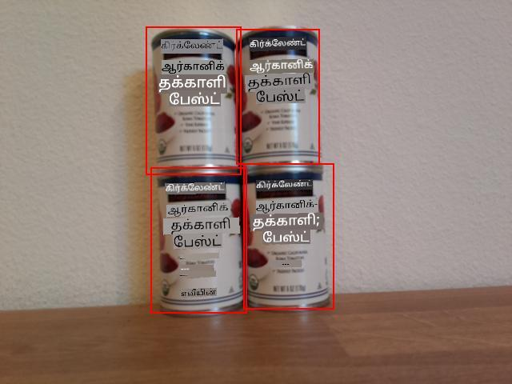

<!--
CO_OP_TRANSLATOR_METADATA:
{
  "original_hash": "9c4320311c0f2c1884a6a21265d98a51",
  "translation_date": "2025-10-11T12:48:43+00:00",
  "source_file": "5-retail/lessons/2-check-stock-device/single-board-computer-count-stock.md",
  "language_code": "ta"
}
-->
# உங்கள் IoT சாதனத்திலிருந்து பங்கு எண்ணுக - மெய்நிகர் IoT ஹார்ட்வேரும் Raspberry Pi-யும்

முன்னறிவிப்புகள் மற்றும் அவற்றின் எல்லை பெட்டிகளை இணைத்து ஒரு படத்தில் பங்குகளை எண்ண முடியும்.

## எல்லை பெட்டிகளை காட்டவும்

பயனுள்ள பிழைதிருத்த நடவடிக்கையாக, எல்லை பெட்டிகளை அச்சிடுவதுடன், படம் பிடிக்கப்பட்டபோது டிஸ்க்கில் எழுதப்பட்ட படத்தில் அவற்றை வரைந்து காட்டவும் முடியும்.

### பணிகள் - எல்லை பெட்டிகளை அச்சிடவும்

1. `stock-counter` திட்டம் VS Code-இல் திறக்கப்பட்டிருப்பதை உறுதிப்படுத்தவும், மேலும் நீங்கள் மெய்நிகர் IoT சாதனத்தைப் பயன்படுத்தினால் மெய்நிகர் சூழல் செயல்படுத்தப்பட்டிருக்க வேண்டும்.

1. `for` மடக்குக்குள் உள்ள `print` அறிக்கையை கீழே உள்ளவாறு மாற்றி எல்லை பெட்டிகளை கன்சோலில் அச்சிடவும்:

    ```python
    print(f'{prediction.tag_name}:\t{prediction.probability * 100:.2f}%\t{prediction.bounding_box}')
    ```

1. கேமராவை ஒரு தட்டில் உள்ள பங்குகளின் மீது சுட்டி வைத்து செயலியை இயக்கவும். எல்லை பெட்டிகள் கன்சோலில் அச்சிடப்படும், இடது, மேல், அகலம் மற்றும் உயரம் மதிப்புகள் 0-1 வரை இருக்கும்.

    ```output
    pi@raspberrypi:~/stock-counter $ python3 app.py 
    tomato paste:   33.42%  {'additional_properties': {}, 'left': 0.3455171, 'top': 0.09916268, 'width': 0.14175442, 'height': 0.29405564}
    tomato paste:   34.41%  {'additional_properties': {}, 'left': 0.48283678, 'top': 0.10242918, 'width': 0.11782813, 'height': 0.27467814}
    tomato paste:   31.25%  {'additional_properties': {}, 'left': 0.4923783, 'top': 0.35007596, 'width': 0.13668466, 'height': 0.28304994}
    tomato paste:   31.05%  {'additional_properties': {}, 'left': 0.36416405, 'top': 0.37494493, 'width': 0.14024884, 'height': 0.26880276}
    ```

### பணிகள் - படத்தில் எல்லை பெட்டிகளை வரை

1. [Pillow](https://pypi.org/project/Pillow/) என்ற Pip தொகுப்பு படங்களில் வரைதல் செய்ய பயன்படுத்தலாம். இதை கீழே உள்ள கட்டளையைப் பயன்படுத்தி நிறுவவும்:

    ```sh
    pip3 install pillow
    ```

    நீங்கள் மெய்நிகர் IoT சாதனத்தைப் பயன்படுத்தினால், செயல்படுத்தப்பட்ட மெய்நிகர் சூழலுக்குள் இதை இயக்கவும்.

1. `app.py` கோப்பின் மேல் பகுதியில் கீழே உள்ள இறக்குமதி அறிக்கையைச் சேர்க்கவும்:

    ```python
    from PIL import Image, ImageDraw, ImageColor
    ```

    இது படத்தைத் திருத்த தேவையான குறியீட்டை இறக்குமதி செய்கிறது.

1. `app.py` கோப்பின் இறுதியில் கீழே உள்ள குறியீட்டைச் சேர்க்கவும்:

    ```python
    with Image.open('image.jpg') as im:
        draw = ImageDraw.Draw(im)
    
        for prediction in predictions:
            scale_left = prediction.bounding_box.left
            scale_top = prediction.bounding_box.top
            scale_right = prediction.bounding_box.left + prediction.bounding_box.width
            scale_bottom = prediction.bounding_box.top + prediction.bounding_box.height
            
            left = scale_left * im.width
            top = scale_top * im.height
            right = scale_right * im.width
            bottom = scale_bottom * im.height
    
            draw.rectangle([left, top, right, bottom], outline=ImageColor.getrgb('red'), width=2)
    
        im.save('image.jpg')
    ```

    இந்த குறியீடு முன்பே சேமிக்கப்பட்ட படத்தைத் திருத்துவதற்காக திறக்கிறது. பின்னர், முன்னறிவிப்புகளை மடக்கி எல்லை பெட்டிகளைப் பெறுகிறது, மேலும் 0-1 மதிப்புகளிலிருந்து கீழ் வலது கோர்டினேட்டை கணக்கிடுகிறது. இவை பின்னர் படத்தின் தொடர்புடைய பரிமாணத்தால் பெருக்கப்பட்டு பட கோர்டினேட்டுகளாக மாற்றப்படுகின்றன. உதாரணமாக, இடது மதிப்பு 0.5 ஆக இருந்தால், 600 பிக்சல்கள் அகலமான படத்தில் இது 300 ஆக மாறும் (0.5 x 600 = 300).

    ஒவ்வொரு எல்லை பெட்டியும் ஒரு சிவப்பு கோடுடன் படத்தில் வரையப்படுகிறது. இறுதியாக திருத்தப்பட்ட படம் சேமிக்கப்படுகிறது, மூலப்படத்தை மீண்டும் எழுதுகிறது.

1. கேமராவை ஒரு தட்டில் உள்ள பங்குகளின் மீது சுட்டி வைத்து செயலியை இயக்கவும். நீங்கள் VS Code எக்ஸ்ப்ளோரரில் `image.jpg` கோப்பைப் பார்க்க முடியும், மேலும் எல்லை பெட்டிகளைப் பார்க்க அதைத் தேர்ந்தெடுக்கவும்.

    

## பங்கு எண்ணுக

மேலே காட்டப்பட்ட படத்தில், எல்லை பெட்டிகள் சிறிய ஓவர்லாப்பை கொண்டுள்ளன. இந்த ஓவர்லாப்பு மிகவும் பெரியதாக இருந்தால், எல்லை பெட்டிகள் ஒரே பொருளைக் குறிக்கலாம். பொருட்களை சரியாக எண்ண, முக்கியமான ஓவர்லாப்பைக் கொண்ட பெட்டிகளை புறக்கணிக்க வேண்டும்.

### பணிகள் - ஓவர்லாப்பை புறக்கணித்து பங்கு எண்ணுக

1. [Shapely](https://pypi.org/project/Shapely/) என்ற Pip தொகுப்பு இடைச்சேர்க்கையை கணக்கிட பயன்படுத்தலாம். நீங்கள் Raspberry Pi-யைப் பயன்படுத்தினால், முதலில் ஒரு நூலக சார்பை நிறுவ வேண்டும்:

    ```sh
    sudo apt install libgeos-dev
    ```

1. Shapely Pip தொகுப்பை நிறுவவும்:

    ```sh
    pip3 install shapely
    ```

    நீங்கள் மெய்நிகர் IoT சாதனத்தைப் பயன்படுத்தினால், செயல்படுத்தப்பட்ட மெய்நிகர் சூழலுக்குள் இதை இயக்கவும்.

1. `app.py` கோப்பின் மேல் பகுதியில் கீழே உள்ள இறக்குமதி அறிக்கையைச் சேர்க்கவும்:

    ```python
    from shapely.geometry import Polygon
    ```

    இது ஓவர்லாப்பை கணக்கிட பாளீகன்களை உருவாக்க தேவையான குறியீட்டை இறக்குமதி செய்கிறது.

1. எல்லை பெட்டிகளை வரையும் குறியீட்டின் மேல் பகுதியில் கீழே உள்ள குறியீட்டைச் சேர்க்கவும்:

    ```python
    overlap_threshold = 0.20
    ```

    இது எல்லை பெட்டிகள் ஒரே பொருளாகக் கருதப்படும் முன் அனுமதிக்கப்பட்ட சதவீத ஓவர்லாப்பை வரையறுக்கிறது. 0.20 என்பது 20% ஓவர்லாப்பை வரையறுக்கிறது.

1. Shapely-யைப் பயன்படுத்தி ஓவர்லாப்பை கணக்கிட, எல்லை பெட்டிகள் Shapely பாளீகன்களாக மாற்றப்பட வேண்டும். இதைச் செய்ய கீழே உள்ள செயல்பாட்டைச் சேர்க்கவும்:

    ```python
    def create_polygon(prediction):
        scale_left = prediction.bounding_box.left
        scale_top = prediction.bounding_box.top
        scale_right = prediction.bounding_box.left + prediction.bounding_box.width
        scale_bottom = prediction.bounding_box.top + prediction.bounding_box.height
    
        return Polygon([(scale_left, scale_top), (scale_right, scale_top), (scale_right, scale_bottom), (scale_left, scale_bottom)])
    ```

    இது முன்னறிவிப்பு எல்லை பெட்டியைப் பயன்படுத்தி ஒரு பாளீகனை உருவாக்குகிறது.

1. ஓவர்லாப்பை நீக்குவதற்கான தர்க்கம் எல்லா எல்லை பெட்டிகளையும் ஒப்பிடுவதில் உள்ளது. எந்த ஜோடி முன்னறிவிப்புகளின் எல்லை பெட்டிகள் தகுதிக்கு மீறிய ஓவர்லாப்பை கொண்டிருந்தாலும், ஒரு முன்னறிவிப்பை நீக்க வேண்டும். அனைத்து முன்னறிவிப்புகளையும் ஒப்பிட, முன்னறிவிப்பு 1 ஐ 2, 3, 4, போன்றவற்றுடன் ஒப்பிட வேண்டும், பின்னர் 2 ஐ 3, 4 போன்றவற்றுடன் ஒப்பிட வேண்டும். இதைச் செய்ய கீழே உள்ள குறியீட்டைச் சேர்க்கவும்:

    ```python
    to_delete = []

    for i in range(0, len(predictions)):
        polygon_1 = create_polygon(predictions[i])
    
        for j in range(i+1, len(predictions)):
            polygon_2 = create_polygon(predictions[j])
            overlap = polygon_1.intersection(polygon_2).area

            smallest_area = min(polygon_1.area, polygon_2.area)
    
            if overlap > (overlap_threshold * smallest_area):
                to_delete.append(predictions[i])
                break
    
    for d in to_delete:
        predictions.remove(d)

    print(f'Counted {len(predictions)} stock items')
    ```

    Shapely `Polygon.intersection` முறை மூலம் ஓவர்லாப்பை கணக்கிடப்படுகிறது, இது ஓவர்லாப்பைக் கொண்ட பாளீகனைத் திருப்புகிறது. இந்த பாளீகனிலிருந்து பகுதி கணக்கிடப்படுகிறது. இந்த ஓவர்லாப்பு ஒரு முழுமையான மதிப்பாக இல்லை, ஆனால் இது எல்லை பெட்டியின் சதவீதமாக இருக்க வேண்டும். எனவே, சிறிய எல்லை பெட்டி கண்டறியப்படுகிறது, மேலும் ஓவர்லாப்பு தகுதிக்கு மீறாத அளவுக்கு சிறிய எல்லை பெட்டியின் சதவீத ஓவர்லாப்பு தகுதியை கணக்கிட பயன்படுத்தப்படுகிறது. ஓவர்லாப்பு இதை மீறினால், முன்னறிவிப்பு நீக்கத்திற்காக குறிக்கப்படுகிறது.

    ஒரு முன்னறிவிப்பு நீக்கத்திற்காக குறிக்கப்பட்டவுடன், அதை மீண்டும் சரிபார்க்க தேவையில்லை, எனவே உள்ளடக்க மடக்கு அடுத்த முன்னறிவிப்பைச் சரிபார்க்க உடைந்து விடுகிறது. ஒரு பட்டியலில் உள்ள உருப்படிகளை மடக்குவதில் நீக்க முடியாது, எனவே தகுதிக்கு மீறிய ஓவர்லாப்பைக் கொண்ட எல்லை பெட்டிகள் `to_delete` பட்டியலில் சேர்க்கப்பட்டு, பின்னர் இறுதியில் நீக்கப்படுகின்றன.

    இறுதியாக பங்கு எண்ணிக்கை கன்சோலில் அச்சிடப்படுகிறது. இது பங்கு நிலைகள் குறைவாக இருந்தால் எச்சரிக்க IoT சேவைக்கு அனுப்பப்படலாம். இந்த குறியீடு எல்லை பெட்டிகள் வரையப்படும் முன் உள்ளது, எனவே நீங்கள் உருவாக்கப்பட்ட படங்களில் ஓவர்லாப்பில்லாத பங்கு முன்னறிவிப்புகளைப் பார்க்க முடியும்.

    > 💁 இது ஓவர்லாப்புகளை நீக்க மிகவும் எளிமையான வழி, ஓவர்லாப்பில் உள்ள ஜோடியில் முதல் ஒன்றை மட்டும் நீக்குகிறது. உற்பத்தி குறியீட்டிற்காக, நீங்கள் இங்கு மேலும் தர்க்கத்தைச் சேர்க்க விரும்புவீர்கள், பல பொருட்களுக்கிடையிலான ஓவர்லாப்புகளைப் பரிசீலிப்பது போன்றவை, அல்லது ஒரு எல்லை பெட்டி மற்றொன்றால் உள்ளடக்கப்பட்டிருந்தால்.

1. கேமராவை ஒரு தட்டில் உள்ள பங்குகளின் மீது சுட்டி வைத்து செயலியை இயக்கவும். வெளியீடு தகுதிக்கு மீறிய ஓவர்லாப்பில்லாத எல்லை பெட்டிகளின் எண்ணிக்கையைக் குறிக்கிறது. `overlap_threshold` மதிப்பை மாற்றி முன்னறிவிப்புகள் புறக்கணிக்கப்படுவதைப் பாருங்கள்.

> 💁 இந்த குறியீட்டை [code-count/pi](../../../../../5-retail/lessons/2-check-stock-device/code-count/pi) அல்லது [code-count/virtual-iot-device](../../../../../5-retail/lessons/2-check-stock-device/code-count/virtual-iot-device) கோப்புறையில் காணலாம்.

😀 உங்கள் பங்கு எண்ணும் செயலி வெற்றிகரமாக முடிந்தது!

---

**அறிவிப்பு**:  
இந்த ஆவணம் [Co-op Translator](https://github.com/Azure/co-op-translator) என்ற AI மொழிபெயர்ப்பு சேவையை பயன்படுத்தி மொழிபெயர்க்கப்பட்டுள்ளது. நாங்கள் துல்லியத்திற்காக முயற்சிக்கிறோம், ஆனால் தானியங்கி மொழிபெயர்ப்புகளில் பிழைகள் அல்லது தவறுகள் இருக்கக்கூடும் என்பதை தயவுசெய்து கவனத்தில் கொள்ளவும். அதன் சொந்த மொழியில் உள்ள மூல ஆவணம் அதிகாரப்பூர்வ ஆதாரமாக கருதப்பட வேண்டும். முக்கியமான தகவல்களுக்கு, தொழில்முறை மனித மொழிபெயர்ப்பு பரிந்துரைக்கப்படுகிறது. இந்த மொழிபெயர்ப்பைப் பயன்படுத்துவதால் ஏற்படும் எந்த தவறான புரிதல்களுக்கும் அல்லது தவறான விளக்கங்களுக்கும் நாங்கள் பொறுப்பல்ல.