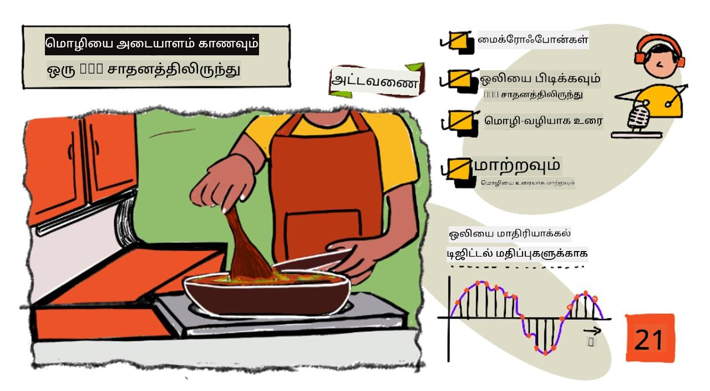
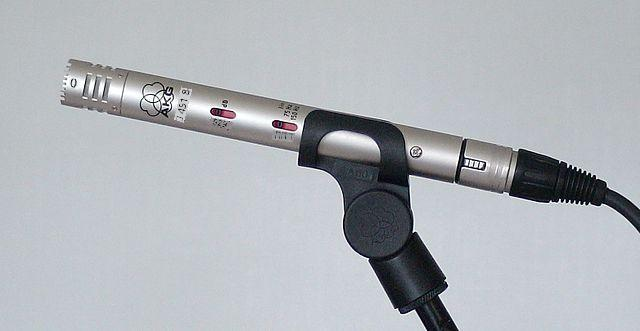
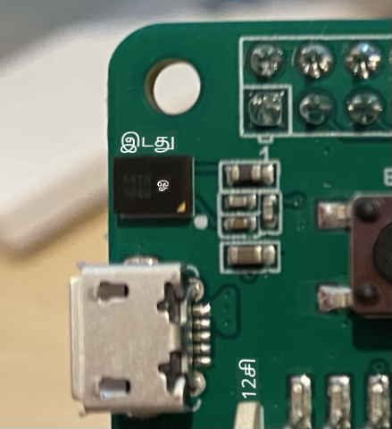

<!--
CO_OP_TRANSLATOR_METADATA:
{
  "original_hash": "6d6aa1be033625d201a190fc9c5cbfb4",
  "translation_date": "2025-10-11T12:20:20+00:00",
  "source_file": "6-consumer/lessons/1-speech-recognition/README.md",
  "language_code": "ta"
}
-->
# IoT சாதனத்துடன் பேச்சை அடையாளம் காணவும்



> ஸ்கெட்ச் நோட்: [நித்யா நரசிம்மன்](https://github.com/nitya). படத்தை கிளிக் செய்து பெரிய பதிப்பைப் பாருங்கள்.

இந்த வீடியோ Azure பேச்சு சேவையின் கண்ணோட்டத்தை வழங்குகிறது, இது இந்த பாடத்தில் கற்றுக்கொள்ளப்படும் ஒரு தலைப்பு:

[](https://www.youtube.com/watch?v=iW0Fw0l3mrA)

> 🎥 மேலே உள்ள படத்தை கிளிக் செய்து வீடியோவைப் பாருங்கள்

## முன்னோட்ட வினாடி வினா

[முன்னோட்ட வினாடி வினா](https://black-meadow-040d15503.1.azurestaticapps.net/quiz/41)

## அறிமுகம்

'அலெக்ஸா, 12 நிமிட டைமரை அமைக்கவும்'

'அலெக்ஸா, டைமர் நிலை'

'அலெக்ஸா, 8 நிமிட டைமரை "steam broccoli" என்று அழைக்கவும்'

ஸ்மார்ட் சாதனங்கள் நாளுக்கு நாள் பரவலாகி வருகின்றன. HomePods, Echos மற்றும் Google Homes போன்ற ஸ்மார்ட் ஸ்பீக்கர்கள் மட்டுமல்லாமல், அவை எங்கள் தொலைபேசிகள், கடிகாரங்கள், மற்றும் விளக்கு பொருத்துதல்கள் மற்றும் வெப்பநிலை கட்டுப்படுத்திகள் போன்றவற்றில் கூட உள்ளன.

> 💁 எனது வீட்டில் குரல் உதவியாளர்களைக் கொண்ட குறைந்தது 19 சாதனங்கள் உள்ளன, மேலும் நான் அறிந்தவை மட்டுமே இவை!

குரல் கட்டுப்பாடு, குறைந்த இயக்கத்துடன் உள்ளவர்களுக்கு சாதனங்களுடன் தொடர்பு கொள்ள அனுமதிப்பதன் மூலம் அணுகலை அதிகரிக்கிறது. இது பிறப்பிலேயே கை இல்லாமல் இருப்பது போன்ற நிரந்தர மாற்றுத்திறன்களிலிருந்து, உடைந்த கைகள் போன்ற தற்காலிக மாற்றுத்திறன்கள், அல்லது பொருட்கள் அல்லது குழந்தைகளால் கைகள் நிரம்பியிருப்பது போன்ற சூழல்களுக்கு உதவுகிறது. கைகளைப் பயன்படுத்தாமல் குரலின் மூலம் எங்கள் வீடுகளை கட்டுப்படுத்த முடிவது அணுகலுக்கான புதிய உலகத்தைத் திறக்கிறது. 'ஹே சிரி, என் கேரேஜ் கதவை மூடுங்கள்' என்று ஒரு குழந்தையை மாற்றுவதிலும், மற்றொரு குழந்தையை சமாளிப்பதிலும் கூச்சலிடுவது வாழ்க்கையில் சிறிய ஆனால் பயனுள்ள முன்னேற்றமாக இருக்கலாம்.

குரல் உதவியாளர்களின் மிகவும் பிரபலமான பயன்பாடுகளில் ஒன்றாக டைமர்களை அமைத்தல் உள்ளது, குறிப்பாக சமையலறை டைமர்கள். உங்கள் குரலின் மூலம் பல டைமர்களை அமைக்க முடிவது சமையலறையில் பெரிய உதவியாக இருக்கும் - மைதையை பிசைவது, சூப் கலக்குவது, அல்லது டம்ப்ளிங் பூரிப்பு உங்கள் கைகளில் இருந்து சுத்தம் செய்யாமல் ஒரு பிசிகல் டைமரைப் பயன்படுத்த தேவையில்லை.

இந்த பாடத்தில் IoT சாதனங்களில் குரல் அடையாளத்தை உருவாக்குவது பற்றி நீங்கள் கற்றுக்கொள்வீர்கள். மைக்ரோஃபோன்களை சென்சார்களாகப் பயன்படுத்துவது, IoT சாதனத்துடன் இணைக்கப்பட்ட மைக்ரோஃபோனில் இருந்து ஆடியோவைப் பிடிப்பது, மற்றும் கேட்கப்பட்டதை AI மூலம் உரையாக மாற்றுவது எப்படி என்பதை நீங்கள் கற்றுக்கொள்வீர்கள். இந்த திட்டத்தின் மீதமுள்ள பகுதிகளில், நீங்கள் பல மொழிகளில் உங்கள் குரலின் மூலம் டைமர்களை அமைக்க முடியும் என்ற ஸ்மார்ட் சமையலறை டைமரை உருவாக்குவீர்கள்.

இந்த பாடத்தில் நாம் கற்றுக்கொள்ளப் போவது:

* [மைக்ரோஃபோன்கள்](../../../../../6-consumer/lessons/1-speech-recognition)
* [உங்கள் IoT சாதனத்திலிருந்து ஆடியோவைப் பிடிக்கவும்](../../../../../6-consumer/lessons/1-speech-recognition)
* [Speech to text](../../../../../6-consumer/lessons/1-speech-recognition)
* [Speech to text ஐ மாற்றவும்](../../../../../6-consumer/lessons/1-speech-recognition)

## மைக்ரோஃபோன்கள்

மைக்ரோஃபோன்கள் ஒலி அலைகளை மின்சார சிக்னல்களாக மாற்றும் அனலாக் சென்சார்கள் ஆகும். காற்றில் உள்ள அதிர்வுகள் மைக்ரோஃபோனில் உள்ள கூறுகளை சிறிய அளவில் நகர்த்த வைக்கின்றன, மேலும் இவை மின்சார சிக்னல்களில் சிறிய மாற்றங்களை ஏற்படுத்துகின்றன. இந்த மாற்றங்கள் மின்சார வெளியீட்டை உருவாக்க பெருக்கப்படுகின்றன.

### மைக்ரோஃபோன் வகைகள்

மைக்ரோஃபோன்கள் பல வகைகளில் கிடைக்கின்றன:

* டைனமிக் - டைனமிக் மைக்ரோஃபோன்களில் காந்தம் ஒரு இயக்கப்படும் டயாப்ரக்ம் (diaphragm) உடன் இணைக்கப்பட்டுள்ளது, இது கம்பி குவியலில் மின்சாரத்தை உருவாக்கும். இது பெரும்பாலான லவுட்ஸ்பீக்கர்களின் எதிர்மறை ஆகும், அவை மின்சாரத்தை காந்தத்தை நகர்த்த பயன்படுத்துகின்றன. இதனால், ஸ்பீக்கர்கள் டைனமிக் மைக்ரோஃபோன்களாகவும், டைனமிக் மைக்ரோஃபோன்கள் ஸ்பீக்கர்களாகவும் செயல்பட முடியும். Intercom போன்ற சாதனங்களில், ஒரு பயனர் கேட்கவோ அல்லது பேசவோ செய்கிறார், ஆனால் இரண்டையும் ஒரே நேரத்தில் செய்ய முடியாது, ஒரு சாதனம் ஸ்பீக்கர் மற்றும் மைக்ரோஃபோனாக இரண்டையும் செயல்பட முடியும்.

    டைனமிக் மைக்ரோஃபோன்கள் செயல்பட மின்சாரத்தை தேவையில்லை, மின்சார சிக்னல் முழுவதும் மைக்ரோஃபோனிலிருந்து உருவாக்கப்படுகிறது.

    

* ரிப்பன் - ரிப்பன் மைக்ரோஃபோன்கள் டைனமிக் மைக்ரோஃபோன்களைப் போன்றவை, ஆனால் அவற்றில் டயாப்ரக்ம் பதிலாக ஒரு உலோக ரிப்பன் உள்ளது. இந்த ரிப்பன் காந்த புலத்தில் நகர்ந்து மின்சாரத்தை உருவாக்குகிறது. டைனமிக் மைக்ரோஃபோன்களைப் போலவே, ரிப்பன் மைக்ரோஃபோன்கள் செயல்பட மின்சாரத்தை தேவையில்லை.

    

* கண்டென்சர் - கண்டென்சர் மைக்ரோஃபோன்களில் ஒரு மெல்லிய உலோக டயாப்ரக்ம் மற்றும் ஒரு நிலையான உலோக பின்பலகை உள்ளது. இரண்டிற்கும் மின்சாரம் வழங்கப்படுகிறது, மேலும் டயாப்ரக்ம் அதிர்வதால் பிளேடுகளுக்கு இடையிலான நிலையான மின்சார மாற்றம் சிக்னலாக உருவாகிறது. கண்டென்சர் மைக்ரோஃபோன்கள் செயல்பட மின்சாரத்தை தேவையாகிறது - இதை *Phantom power* என்று அழைக்கப்படுகிறது.

    

* MEMS - மைக்ரோஎலெக்ட்ரோமேக்கானிக்கல் சிஸ்டம்ஸ் மைக்ரோஃபோன்கள், அல்லது MEMS, சிப் மீது உள்ள மைக்ரோஃபோன்கள் ஆகும். அவற்றில் ஒரு அழுத்தத்தை உணரும் டயாப்ரக்ம் சிலிகான் சிப்பில் எச்சிங் செய்யப்பட்டு, கண்டென்சர் மைக்ரோஃபோனுக்கு ஒத்த முறையில் செயல்படுகிறது. இந்த மைக்ரோஃபோன்கள் மிகச் சிறியதாக இருக்க முடியும், மற்றும் சிர்க்யூட்டில் ஒருங்கிணைக்கப்பட முடியும்.

    

    மேலே உள்ள படத்தில், **LEFT** என்று லேபிள் செய்யப்பட்ட சிப் ஒரு MEMS மைக்ரோஃபோன் ஆகும், அதில் ஒரு மில்லிமீட்டருக்கு குறைவான ஒரு சிறிய டயாப்ரக்ம் உள்ளது.

✅ சில ஆராய்ச்சி செய்யுங்கள்: உங்கள் கணினி, தொலைபேசி, ஹெட்செட் அல்லது பிற சாதனங்களில் உள்ள மைக்ரோஃபோன்கள் என்ன? அவை எந்த வகை மைக்ரோஃபோன்கள்?

### டிஜிட்டல் ஆடியோ

ஆடியோ என்பது மிக நுணுக்கமான தகவல்களை கொண்ட அனலாக் சிக்னல் ஆகும். இந்த சிக்னலை டிஜிட்டலாக மாற்ற, ஆடியோவை ஒரு வினாடிக்கு ஆயிரக்கணக்கான முறை மாதிரியாக்க வேண்டும்.

> 🎓 மாதிரியாக்கல் என்பது ஆடியோ சிக்னலை ஒரு குறிப்பிட்ட நேரத்தில் அந்த சிக்னலின் டிஜிட்டல் மதிப்பாக மாற்றுவது.


டிஜிட்டல் ஆடியோ Pulse Code Modulation, அல்லது PCM பயன்படுத்தி மாதிரியாக்கப்படுகிறது. PCM என்பது சிக்னலின் மின்னழுத்தத்தைப் படித்து, ஒரு வரையறுக்கப்பட்ட அளவின் அடிப்படையில் அந்த மின்னழுத்தத்திற்கு அருகிலுள்ள தனித்த மதிப்பைத் தேர்ந்தெடுப்பதாகும்.

> 💁 PCM ஐ pulse width modulation, அல்லது PWM (PWM [திட்டத்தின் 3வது பாடத்தில்](../../../1-getting-started/lessons/3-sensors-and-actuators/README.md#pulse-width-modulation) கற்றுக்கொள்ளப்பட்டது) சென்சார் பதிப்பாகக் கருதலாம். PCM என்பது அனலாக் சிக்னலை டிஜிட்டலாக மாற்றுவது, PWM என்பது டிஜிட்டல் சிக்னலை அனலாக் சிக்னலாக மாற்றுவது.

உதாரணமாக, பெரும்பாலான ஸ்ட்ரீமிங் மியூசிக் சேவைகள் 16-bit அல்லது 24-bit ஆடியோ வழங்குகின்றன. இது மின்னழுத்தத்தை 16-bit integer அல்லது 24-bit integer ஆக மாற்றுகிறது. 16-bit ஆடியோ -32,768 முதல் 32,767 வரையிலான மதிப்பில் பொருந்துகிறது, 24-bit -8,388,608 முதல் 8,388,607 வரையிலான மதிப்பில் பொருந்துகிறது. அதிக பிட்கள், மாதிரிகள் எங்கள் காதுகள் உணரக்கூடியதை நெருக்கமாக மாற்றுகின்றன.

> 💁 நீங்கள் 8-bit ஆடியோ பற்றி கேள்விப்பட்டிருக்கலாம், இது பொதுவாக LoFi என்று அழைக்கப்படுகிறது. இது 8-bit மட்டுமே பயன்படுத்தி மாதிரியாக்கப்படும் ஆடியோ, -128 முதல் 127 வரை. முதல் கணினி ஆடியோ ஹார்ட்வேரின் வரம்புகளால் 8-bit ஆக மட்டுப்படுத்தப்பட்டது, எனவே இது பழமையான கேமிங்கில் அடிக்கடி காணப்படுகிறது.

இந்த மாதிரிகள் ஒரு வினாடிக்கு ஆயிரக்கணக்கான முறை எடுத்துக்கொள்ளப்படுகின்றன, KHz (ஒரு வினாடிக்கு ஆயிரம் வாசிப்புகள்) அளவுகளில் அளவிடப்படும் நன்கு வரையறுக்கப்பட்ட மாதிரி விகிதங்களைப் பயன்படுத்தி. ஸ்ட்ரீமிங் மியூசிக் சேவைகள் பெரும்பாலான ஆடியோவுக்கு 48KHz பயன்படுத்துகின்றன, ஆனால் சில 'lossless' ஆடியோ 96KHz அல்லது 192KHz வரை பயன்படுத்துகிறது. மாதிரி விகிதம் அதிகமாக இருக்கும் போது, ஆடியோ மூலத்திற்கும் நெருக்கமாக இருக்கும், ஒரு புள்ளிக்கு. 48KHz க்கு மேல் மனிதர்கள் வேறுபாட்டை உணர முடியுமா என்பது விவாதமாக உள்ளது.

✅ சில ஆராய்ச்சி செய்யுங்கள்: நீங்கள் ஸ்ட்ரீமிங் மியூசிக் சேவையைப் பயன்படுத்தினால், அது எந்த மாதிரி விகிதம் மற்றும் அளவைக் கொண்டுள்ளது? நீங்கள் CDs பயன்படுத்தினால், CD ஆடியோவின் மாதிரி விகிதம் மற்றும் அளவு என்ன?

ஆடியோ தரவிற்கான பல்வேறு வடிவங்கள் உள்ளன. நீங்கள் mp3 கோப்புகளைப் பற்றி கேள்விப்பட்டிருக்கலாம் - தரத்தை இழக்காமல் ஆடியோ தரவை சுருக்கி சிறியதாக மாற்றுவது. சுருக்கப்படாத ஆடியோ பொதுவாக WAV கோப்பாக சேமிக்கப்படுகிறது - இது 44 பைட்டுகள் தலைப்பு தகவலுடன் கூடிய ஒரு கோப்பு, பின்னர் மூல ஆடியோ தரவுடன். தலைப்பு மாதிரி விகிதம் (உதாரணமாக 16000 16KHz க்கு), மாதிரி அளவு (16 16-bit க்கு), மற்றும் சேனல்கள் போன்ற தகவல்களை கொண்டுள்ளது. தலைப்புக்குப் பிறகு, WAV கோப்பு மூல ஆடியோ தரவைக் கொண்டுள்ளது.

> 🎓 சேனல்கள் என்பது ஆடியோவை உருவாக்கும் பல்வேறு ஆடியோ ஸ்ட்ரீம்களின் எண்ணிக்கையை குறிக்கிறது. உதாரணமாக, இடது மற்றும் வலது ஸ்டீரியோ ஆடியோவுக்கு 2 சேனல்கள் இருக்கும். 7.1 சர்ரவுண்ட் சவுண்டுக்கு 8 சேனல்கள் இருக்கும்.

### ஆடியோ தரவின் அளவு

ஆடியோ தரவு ஒப்பீட்டளவில் பெரியது. உதாரணமாக, 16KHz இல் 16-bit சுருக்கப்படாத ஆடியோவைப் பிடிப்பது (speech to text மாடலுடன் பயன்படுத்துவதற்கு போதுமான விகிதம்), ஒரு வினாடிக்கு 32KB தரவை எடுத்துக்கொள்ளும்:

* 16-bit என்பது மாதிரி ஒன்றுக்கு 2 பைட்டுகள் (1 பைட் என்பது 8-bit).
* 16KHz என்பது ஒரு வினாடிக்கு 16,000 மாதிரிகள்.
* 16,000 x 2 பைட்டுகள் = 32,000 பைட்டுகள் ஒரு வினாடிக்கு.

இது ஒரு சிறிய அளவு தரவாகத் தோன்றலாம், ஆனால் நீங்கள் குறைந்த நினைவகத்துடன் ஒரு மைக்ரோகண்ட்ரோலரைப் பயன்படுத்தினால், இது அதிகமாக இருக்கலாம். உதாரணமாக, Wio Terminal 192KB நினைவகத்தை கொண்டுள்ளது, மேலும் அது நிரல்குறியீடு மற்றும் மாறிகள் சேமிக்க வேண்டும். உங்கள் நிரல்குறியீடு மிகச் சிறியதாக இருந்தாலும், நீங்கள் 5 வினாடிகளுக்கு மேல் ஆடியோவைப் பிடிக்க முடியாது.

மைக்ரோகண்ட்ரோலர்கள் கூடுதல் சேமிப்பகத்தை அணுக முடியும், உதாரணமாக SD கார்டுகள் அல்லது ஃப்ளாஷ் நினைவகம். ஆடியோவைப் பிடிக்கும் IoT சாதனத்தை உருவாக்கும்போது, நீங்கள் கூடுதல் சேமிப்பகத்தை மட்டுமல்லாமல், உங்கள் குறியீடு மைக்ரோஃபோனிலிருந்து பிடிக்கப்பட்ட ஆடியோவை நேரடியாக அந்த சேமிப்பகத்திற்கு எழுதுகிறது என்பதை உறுதிப்படுத்த வேண்டும், மேலும் அதை கிளவுட் அனுப்பும்போது, சேமிப்பகத்திலிருந்து வலை கோரிக்கைக்கு ஸ்ட்ரீம் செய்ய வேண்டும். அதனால், ஆடியோ தரவின் முழு தொகுதியை ஒரே நேரத்தில் நினைவகத்தில் வைத்திருப்பதால் நினைவகம் குறைவதைக் தவிர்க்க முடியும்.

## உங்கள் IoT சாதனத்திலிருந்து ஆடியோவைப் பிடிக்கவும்

உங்கள் IoT சாதனம் மைக்ரோஃபோனுடன் இணைக்கப்பட்டு ஆடியோவைப் பிடிக்க முடியும், உரையாக மாற்ற தயாராக. இது ஆடியோவை வெளியிட ஸ்பீக்கர்களுடன் இணைக்கப்படவும் முடியும். பின்னர் பாடங்களில் இது ஆடியோ பின்னூட்டத்தை வழங்க பயன்படுத்தப்படும், ஆனால் மைக்ரோஃபோனை சோதிக்க ஸ்பீக்கர்களை அமைப்பது பயனுள்ளதாக இருக்கும்.

### பணிகள் - உங்கள் மைக்ரோஃபோன் மற்றும் ஸ்பீக்கர்களை அமைக்கவும்

உங்கள் IoT சாதனத்திற்கான மைக்ரோஃபோன் மற்றும் ஸ்பீக்கர்களை அமைக்க தொடர்புடைய வழிகாட்டுதலைப் பின்பற்றவும்:

* [Arduino - Wio Terminal](wio-terminal-microphone.md)
* [Single-board computer - Raspberry Pi](pi-microphone.md)
* [Single-board computer - Virtual device](virtual-device-microphone.md)

### பணிகள் - ஆடியோவைப் பிடிக்கவும்

உங்கள் IoT சாதனத்தில் ஆடியோவைப் பிடிக்க தொடர்புடைய வழிகாட்டுதலைப் பின்பற்றவும்:

* [Arduino - Wio Terminal](wio-terminal-audio.md)
* [Single-board computer - Raspberry Pi](pi-audio.md)
* [Single-board computer - Virtual device](virtual-device-audio.md)

## Speech to text

Speech to text, அல்லது பேச்சு அடையாளம் காணுதல், ஆடியோ சிக்னலில் உள்ள வார்த்தைகளை உரையாக மாற்ற AI ஐ பயன்படுத்துவது.

### பேச்சு அடையாளம் காணும் மாடல்கள்

Speech to text மாற்ற, ஆடியோ சிக்னலிலிருந்து மாதிரிகள் குழுவாகக் கொண்டு, Recurrent Neural Network (RNN) அடிப்படையிலான மெஷின் லெர்னிங் மாடலுக்கு அனுப்பப்படுகிறது. இது முந்தைய தரவுகளைப் பயன்படுத்தி வரும் தரவின் முடிவை எடுக்க முடியும். உதாரணமாக, RNN ஒரு ஆடியோ மாதிரிகளை 'Hel' என்ற ஒலியாக கண்டறிய முடியும், மேலும் 'lo' என்ற ஒலியாக மற்றொரு மாதிரியைப் பெறும்போது, முந்தைய ஒலியுடன் இணைத்து, 'Hello' என்பது ஒரு செல்லுபடியாகும் வார்த்தை என்பதை கண்டறிந்து அதை முடிவாகத் தேர்ந்தெடுக்க முடியும்.

ML மாடல்கள் ஒவ்வொரு முறையும் ஒரே அளவிலான தரவுகளை ஏற்க வேண்டும். நீங்கள் முந்தைய பாடத்தில் உருவாக்கிய படத்தை வகைப்படுத்தும் மாடல் பட
நீங்கள் உங்கள் ஸ்மார்ட் சாதனம் உங்கள் வீட்டில் ஒலியை கேட்கும்போது, ​​அது மேகத்தில் ஒலியை அனுப்பாமல், நீங்கள் அதை பயன்படுத்தும் போது மட்டுமே மேகத்தில் ஒலியை அனுப்ப வேண்டும். பெரும்பாலான ஸ்மார்ட் சாதனங்கள் *வெக் வார்டு* என்ற முக்கிய சொற்றொடருடன் செயல்படுகின்றன, உதாரணமாக "Alexa", "Hey Siri", அல்லது "OK Google", இது சாதனத்தை 'வெக்அப்' செய்து, நீங்கள் சாதனத்துடன் பேசுவதை நிறுத்தியதை குறிக்கும்போது உங்கள் பேச்சில் இடைவெளியை கண்டறியும் வரை கேட்கும்.

> 🎓 வெக் வார்டு கண்டறிதல் *கீவேர்ட் ஸ்பாட்டிங்* அல்லது *கீவேர்ட் ரெகக்னிஷன்* என்றும் அழைக்கப்படுகிறது.

இந்த வெக் வார்டுகள் சாதனத்தில் கண்டறியப்படுகின்றன, மேகத்தில் அல்ல. இந்த ஸ்மார்ட் சாதனங்களில் சிறிய AI மாடல்கள் உள்ளன, அவை வெக் வார்டை கேட்கும், மற்றும் அது கண்டறியப்பட்டவுடன், ஒலியை மேகத்திற்கு அனுப்பத் தொடங்கும். இந்த மாடல்கள் மிகவும் சிறப்பு வாய்ந்தவை, மற்றும் வெக் வார்டை மட்டுமே கேட்கும்.

> 💁 சில தொழில்நுட்ப நிறுவனங்கள் தங்கள் சாதனங்களில் மேலும் தனியுரிமையை சேர்த்து, பேச்சை உரை மாற்றத்தை சாதனத்தில் செய்ய முயற்சிக்கின்றன. ஆப்பிள் 2021 iOS மற்றும் macOS புதுப்பிப்புகளின் ஒரு பகுதியாக, பேச்சை உரை மாற்றத்தை சாதனத்தில் செய்ய முடியும், மற்றும் மேகத்தை பயன்படுத்தாமல் பல கோரிக்கைகளை கையாள முடியும் என்று அறிவித்துள்ளது. இது அவர்களின் சாதனங்களில் ML மாடல்களை இயக்கக்கூடிய சக்திவாய்ந்த செயலிகள் இருப்பதற்கான நன்றி.

✅ மேகத்திற்கு அனுப்பப்படும் ஒலியை சேமிப்பதற்கான தனியுரிமை மற்றும் நெறிமுறை விளைவுகள் என்ன? இந்த ஒலி சேமிக்கப்பட வேண்டுமா, இருந்தால் எப்படி? சட்ட அமலாக்கத்திற்காக பதிவுகளை பயன்படுத்துவது தனியுரிமை இழப்புக்கு நல்ல பரிமாற்றமாக இருக்கிறதா?

வெக் வார்டு கண்டறிதல் பொதுவாக TinyML எனப்படும் ஒரு தொழில்நுட்பத்தை பயன்படுத்துகிறது, அதாவது ML மாடல்களை மைக்ரோகண்ட்ரோலர்களில் இயக்கக்கூடியதாக மாற்றுவது. இந்த மாடல்கள் சிறிய அளவில் இருக்கும், மற்றும் இயக்குவதற்கு மிகவும் குறைந்த சக்தியை பயன்படுத்தும்.

வெக் வார்டு மாடலை பயிற்சி மற்றும் பயன்படுத்துவதற்கான சிக்கல்களை தவிர்க்க, இந்த பாடத்தில் நீங்கள் உருவாக்கும் ஸ்மார்ட் டைமர் பேச்சு அங்கீகாரத்தை இயக்க ஒரு பொத்தானை பயன்படுத்தும்.

> 💁 Wio Terminal அல்லது Raspberry Pi-ல் இயக்க ஒரு வெக் வார்டு கண்டறிதல் மாடலை உருவாக்க முயற்சிக்க விரும்பினால், Edge Impulse-இன் [உங்கள் குரலுக்கு பதிலளிக்கும் டுடோரியல்](https://docs.edgeimpulse.com/docs/responding-to-your-voice) பார்க்கவும். உங்கள் கணினியை இதற்காக பயன்படுத்த விரும்பினால், Microsoft Docs-இல் [Custom Keyword quickstart](https://docs.microsoft.com/azure/cognitive-services/speech-service/keyword-recognition-overview?WT.mc_id=academic-17441-jabenn) முயற்சிக்கலாம்.

## பேச்சை உரையாக மாற்றவும்


முந்தைய திட்டத்தில் படத்தின் வகைப்படுத்தலுடன் போலவே, பேச்சை ஒலி கோப்பாக எடுத்து உரையாக மாற்ற pre-built AI சேவைகள் உள்ளன. அவற்றில் ஒன்று Speech Service, Cognitive Services-இன் ஒரு பகுதியாக, உங்கள் பயன்பாடுகளில் பயன்படுத்த pre-built AI சேவைகள்.

### பணிகள் - பேச்சு AI வளத்தை அமைக்கவும்

1. இந்த திட்டத்திற்கான ஒரு Resource Group உருவாக்கவும், `smart-timer` என அழைக்கவும்.

1. இலவச பேச்சு வளத்தை உருவாக்க கீழே உள்ள கட்டளையை பயன்படுத்தவும்:

    ```sh
    az cognitiveservices account create --name smart-timer \
                                        --resource-group smart-timer \
                                        --kind SpeechServices \
                                        --sku F0 \
                                        --yes \
                                        --location <location>
    ```

    Resource Group உருவாக்கிய இடத்தை `<location>`-இல் மாற்றவும்.

1. உங்கள் குறியீட்டில் பேச்சு வளத்தை அணுக API key தேவைப்படும். கீழே உள்ள கட்டளையை இயக்கி key பெறவும்:

    ```sh
    az cognitiveservices account keys list --name smart-timer \
                                           --resource-group smart-timer \
                                           --output table
    ```

    key-களில் ஒன்றை நகலெடுக்கவும்.

### பணிகள் - பேச்சை உரையாக மாற்றவும்

உங்கள் IoT சாதனத்தில் பேச்சை உரையாக மாற்ற தொடர்புடைய வழிகாட்டுதலை பின்பற்றவும்:

* [Arduino - Wio Terminal](wio-terminal-speech-to-text.md)
* [Single-board computer - Raspberry Pi](pi-speech-to-text.md)
* [Single-board computer - Virtual device](virtual-device-speech-to-text.md)

---

## 🚀 சவால்

பேச்சு அங்கீகாரம் நீண்ட காலமாக உள்ளது, மற்றும் தொடர்ந்து மேம்படுத்தப்படுகிறது. தற்போதைய திறன்களை ஆராய்ந்து, அவை காலப்போக்கில் எப்படி வளர்ந்துள்ளன என்பதை ஒப்பிடவும், மனிதர்களுடன் ஒப்பிடும்போது இயந்திர மாற்றங்கள் எவ்வளவு துல்லியமாக உள்ளன என்பதை ஆராயவும்.

பேச்சு அங்கீகாரத்தின் எதிர்காலம் என்னவாக இருக்கும் என்று நீங்கள் நினைக்கிறீர்கள்?

## பாடத்திற்குப் பிந்தைய வினாடி வினா

[பாடத்திற்குப் பிந்தைய வினாடி வினா](https://black-meadow-040d15503.1.azurestaticapps.net/quiz/42)

## மதிப்பீடு & சுயபயிற்சி

* மைக்ரோஃபோன்களின் வகைகள் மற்றும் அவை எப்படி வேலை செய்கின்றன என்பதை [Musician's HQ-இல் உள்ள "dynamic மற்றும் condenser மைக்ரோஃபோன்களின் வித்தியாசம் என்ன" என்ற கட்டுரையில்](https://musicianshq.com/whats-the-difference-between-dynamic-and-condenser-microphones/) படிக்கவும்.
* Microsoft Docs-இல் உள்ள [speech service documentation](https://docs.microsoft.com/azure/cognitive-services/speech-service/?WT.mc_id=academic-17441-jabenn) மூலம் Cognitive Services பேச்சு சேவையைப் பற்றி மேலும் படிக்கவும்.
* Microsoft Docs-இல் உள்ள [keyword recognition documentation](https://docs.microsoft.com/azure/cognitive-services/speech-service/keyword-recognition-overview?WT.mc_id=academic-17441-jabenn) மூலம் கீவேர்ட் ஸ்பாட்டிங் பற்றி படிக்கவும்.

## பணிக்குறிப்பு

[](assignment.md)

---

**குறிப்பு**:  
இந்த ஆவணம் [Co-op Translator](https://github.com/Azure/co-op-translator) என்ற AI மொழிபெயர்ப்பு சேவையை பயன்படுத்தி மொழிபெயர்க்கப்பட்டுள்ளது. எங்கள் நோக்கம் துல்லியமாக இருக்க வேண்டும் என்பதுதான், ஆனால் தானியங்கி மொழிபெயர்ப்புகளில் பிழைகள் அல்லது துல்லியமின்மைகள் இருக்கக்கூடும் என்பதை தயவுசெய்து கவனத்தில் கொள்ளவும். அதன் தாய்மொழியில் உள்ள மூல ஆவணம் அதிகாரப்பூர்வ ஆதாரமாக கருதப்பட வேண்டும். முக்கியமான தகவல்களுக்கு, தொழில்முறை மனித மொழிபெயர்ப்பு பரிந்துரைக்கப்படுகிறது. இந்த மொழிபெயர்ப்பைப் பயன்படுத்துவதால் ஏற்படும் எந்த தவறான புரிதல்கள் அல்லது தவறான விளக்கங்களுக்கு நாங்கள் பொறுப்பல்ல.