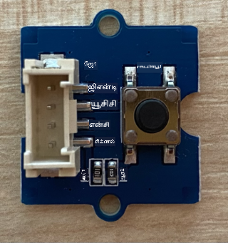
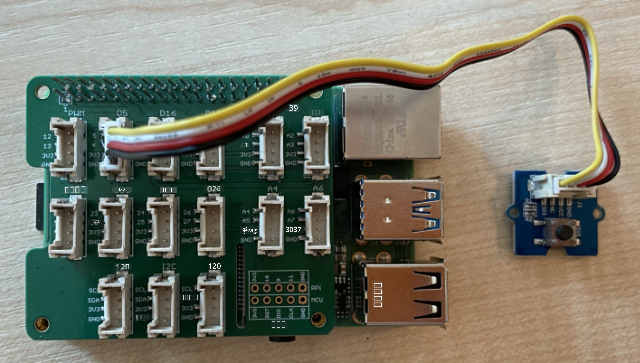

<!--
CO_OP_TRANSLATOR_METADATA:
{
  "original_hash": "0ac0afcfb40cb5970ef4cb74f01c32e9",
  "translation_date": "2025-10-11T12:23:43+00:00",
  "source_file": "6-consumer/lessons/1-speech-recognition/pi-audio.md",
  "language_code": "ta"
}
-->
# ஆடியோ பதிவு - ராஸ்பெர்ரி பை

இந்த பாடத்தின் இந்த பகுதியில், நீங்கள் ராஸ்பெர்ரி பை-யில் ஆடியோ பதிவை செய்யும் குறியீட்டை எழுதுவீர்கள். ஆடியோ பதிவு ஒரு பொத்தானால் கட்டுப்படுத்தப்படும்.

## ஹார்ட்வேர்கள்

ராஸ்பெர்ரி பை-க்கு ஆடியோ பதிவை கட்டுப்படுத்த ஒரு பொத்தான் தேவை.

நீங்கள் பயன்படுத்தும் பொத்தான் ஒரு Grove பொத்தான். இது ஒரு டிஜிட்டல் சென்சார் ஆகும், இது சிக்னலை ஆன் அல்லது ஆஃப் செய்யும். இந்த பொத்தான்கள் பொத்தான் அழுத்தப்பட்டால் உயர் சிக்னல் அனுப்பவும், அழுத்தப்படாத போது குறைந்த சிக்னல் அனுப்பவும் அல்லது அழுத்தப்பட்டால் குறைந்த சிக்னல் அனுப்பவும், அழுத்தப்படாத போது உயர் சிக்னல் அனுப்பவும் அமைக்கப்படலாம்.

நீங்கள் ReSpeaker 2-Mics Pi HAT-ஐ மைக்ரோஃபோனாக பயன்படுத்தினால், இந்த HAT-ல் ஏற்கனவே ஒரு பொத்தான் பொருத்தப்பட்டிருப்பதால், ஒரு பொத்தானை இணைக்க தேவையில்லை. அடுத்த பகுதிக்கு செல்லவும்.

### பொத்தானை இணைக்கவும்

பொத்தான் Grove base hat-க்கு இணைக்கப்படலாம்.

#### பணிகள் - பொத்தானை இணைக்கவும்



1. Grove கேபிளின் ஒரு முனையை பொத்தான் மாட்யூலில் உள்ள சாக்கெட்டில் செருகவும். இது ஒரு வழியில் மட்டுமே செருகப்படும்.

1. ராஸ்பெர்ரி பை ஆஃப் நிலையில் இருக்கும் போது, Grove கேபிளின் மற்ற முனையை பை-யில் பொருத்தப்பட்ட Grove Base hat-ல் **D5** என்று குறிக்கப்பட்ட டிஜிட்டல் சாக்கெட்டில் இணைக்கவும். இந்த சாக்கெட் GPIO பின்களுக்குப் பக்கத்தில் உள்ள சாக்கெட்டுகளின் வரிசையில் இடதுபுறத்திலிருந்து இரண்டாவது சாக்கெட்டாகும்.



## ஆடியோ பதிவு

Python குறியீட்டை பயன்படுத்தி மைக்ரோஃபோனிலிருந்து ஆடியோ பதிவை செய்யலாம்.

### பணிகள் - ஆடியோ பதிவு

1. பை-யை பவர் ஆன் செய்து, அது தொடங்கும் வரை காத்திருக்கவும்.

1. பை-யில் நேரடியாக அல்லது Remote SSH extension மூலம் இணைந்து VS Code-ஐ தொடங்கவும்.

1. PyAudio Pip package-ல் ஆடியோ பதிவும், மீண்டும் ஒலிக்கவும் செய்யும் செயல்பாடுகள் உள்ளன. இந்த பாக்கேஜ் சில ஆடியோ நூலகங்களை முதலில் நிறுவ வேண்டும். இந்த கட்டளைகளை டெர்மினலில் இயக்கவும்:

    ```sh
    sudo apt update
    sudo apt install libportaudio0 libportaudio2 libportaudiocpp0 portaudio19-dev libasound2-plugins --yes 
    ```

1. PyAudio Pip package-ஐ நிறுவவும்.

    ```sh
    pip3 install pyaudio
    ```

1. `smart-timer` என்ற புதிய கோப்புறையை உருவாக்கி, இந்த கோப்புறையில் `app.py` என்ற கோப்பை சேர்க்கவும்.

1. இந்த கோப்பின் மேல் பாகத்தில் பின்வரும் இறக்குமதிகளை சேர்க்கவும்:

    ```python
    import io
    import pyaudio
    import time
    import wave
    
    from grove.factory import Factory
    ```

    இது `pyaudio` மாட்யூலை, wave கோப்புகளை கையாள சில Python மாட்யூல்களை, மற்றும் `grove.factory` மாட்யூலை இறக்குமதி செய்யும் `Factory`-ஐ இறக்குமதி செய்யும்.

1. இதற்கு கீழே, Grove பொத்தானை உருவாக்க குறியீட்டை சேர்க்கவும்.

    நீங்கள் ReSpeaker 2-Mics Pi HAT-ஐ பயன்படுத்தினால், பின்வரும் குறியீட்டை பயன்படுத்தவும்:

    ```python
    # The button on the ReSpeaker 2-Mics Pi HAT
    button = Factory.getButton("GPIO-LOW", 17)
    ```

    இது **D17** போர்டில் ஒரு பொத்தானை உருவாக்குகிறது, ReSpeaker 2-Mics Pi HAT-ல் உள்ள பொத்தான் இணைக்கப்பட்ட போர்ட். இந்த பொத்தான் அழுத்தப்பட்டால் குறைந்த சிக்னல் அனுப்பும் வகையில் அமைக்கப்பட்டுள்ளது.

    நீங்கள் ReSpeaker 2-Mics Pi HAT-ஐ பயன்படுத்தவில்லை, மற்றும் Grove base hat-க்கு இணைக்கப்பட்ட Grove பொத்தானை பயன்படுத்தினால், இந்த குறியீட்டை பயன்படுத்தவும்.

    ```python
    button = Factory.getButton("GPIO-HIGH", 5)
    ```

    இது **D5** போர்டில் ஒரு பொத்தானை உருவாக்குகிறது, இது அழுத்தப்பட்டால் உயர் சிக்னல் அனுப்பும் வகையில் அமைக்கப்பட்டுள்ளது.

1. இதற்கு கீழே, ஆடியோவை கையாள PyAudio வகுப்பின் ஒரு உதாரணத்தை உருவாக்கவும்:

    ```python
    audio = pyaudio.PyAudio()
    ```

1. மைக்ரோஃபோன் மற்றும் ஸ்பீக்கருக்கான ஹார்ட்வேர கார்டு எண்ணை அறிவிக்கவும். இது இந்த பாடத்தில் முன்பு `arecord -l` மற்றும் `aplay -l` இயக்கி கண்டறிந்த கார்டு எண் ஆகும்.

    ```python
    microphone_card_number = <microphone card number>
    speaker_card_number = <speaker card number>
    ```

    `<microphone card number>`-ஐ உங்கள் மைக்ரோஃபோனின் கார்டு எண்ணால் மாற்றவும்.

    `<speaker card number>`-ஐ உங்கள் ஸ்பீக்கரின் கார்டு எண்ணால் மாற்றவும், இதே எண்ணை `alsa.conf` கோப்பில் அமைத்தீர்கள்.

1. இதற்கு கீழே, ஆடியோ பதிவு மற்றும் மீண்டும் ஒலிக்க பயன்படுத்தப்படும் மாதிரியின் விகிதத்தை அறிவிக்கவும். நீங்கள் பயன்படுத்தும் ஹார்ட்வேரை பொறுத்து இதை மாற்ற வேண்டி இருக்கலாம்.

    ```python
    rate = 48000 #48KHz
    ```

    நீங்கள் இந்த குறியீட்டை இயக்கும் போது மாதிரி விகித பிழைகள் வந்தால், இந்த மதிப்பை `44100` அல்லது `16000` ஆக மாற்றவும். மதிப்பு அதிகமாக இருந்தால், ஒலியின் தரம் மேம்படும்.

1. இதற்கு கீழே, `capture_audio` என்ற புதிய செயல்பாட்டை உருவாக்கவும். இது மைக்ரோஃபோனிலிருந்து ஆடியோ பதிவை செய்ய அழைக்கப்படும்:

    ```python
    def capture_audio():
    ```

1. இந்த செயல்பாட்டுக்குள், ஆடியோ பதிவை செய்ய பின்வருவனவற்றை சேர்க்கவும்:

    ```python
    stream = audio.open(format = pyaudio.paInt16,
                        rate = rate,
                        channels = 1, 
                        input_device_index = microphone_card_number,
                        input = True,
                        frames_per_buffer = 4096)

    frames = []

    while button.is_pressed():
        frames.append(stream.read(4096))

    stream.stop_stream()
    stream.close()
    ```

    இந்த குறியீடு PyAudio பொருளைப் பயன்படுத்தி ஒரு ஆடியோ உள்ளீட்டு ஸ்ட்ரீமை திறக்கிறது. இந்த ஸ்ட்ரீம் மைக்ரோஃபோனிலிருந்து 16KHz-ல் ஆடியோ பதிவை செய்கிறது, 4096 பைட்டுகளின் அளவிலான பஃபர்களில் பதிவை செய்கிறது.

    குறியீடு Grove பொத்தான் அழுத்தப்பட்ட வரை மடக்கி, ஒவ்வொரு முறையும் இந்த 4096 பைட் பஃபர்களை ஒரு வரிசையில் படிக்கிறது.

    > 💁 `open` முறைமைக்கு அனுப்பப்படும் விருப்பங்களை [PyAudio ஆவணங்களில்](https://people.csail.mit.edu/hubert/pyaudio/docs/) மேலும் படிக்கலாம்.

    பொத்தான் விடப்பட்டவுடன், ஸ்ட்ரீம் நிறுத்தப்பட்டு மூடப்படும்.

1. இந்த செயல்பாட்டின் இறுதியில் பின்வருவனவற்றை சேர்க்கவும்:

    ```python
    wav_buffer = io.BytesIO()
    with wave.open(wav_buffer, 'wb') as wavefile:
        wavefile.setnchannels(1)
        wavefile.setsampwidth(audio.get_sample_size(pyaudio.paInt16))
        wavefile.setframerate(rate)
        wavefile.writeframes(b''.join(frames))
        wav_buffer.seek(0)

    return wav_buffer
    ```

    இந்த குறியீடு ஒரு பைனரி பஃபரை உருவாக்கி, பதிவுசெய்யப்பட்ட அனைத்து ஆடியோவை [WAV கோப்பாக](https://wikipedia.org/wiki/WAV) எழுதுகிறது. இது ஒரு கோப்பில் சுருக்கப்படாத ஆடியோவை எழுதுவதற்கான ஒரு நிலையான வழியாகும். இந்த பஃபர் பின்னர் திருப்பி அனுப்பப்படும்.

1. ஆடியோ பஃபரை மீண்டும் ஒலிக்க `play_audio` செயல்பாட்டை சேர்க்கவும்:

    ```python
    def play_audio(buffer):
        stream = audio.open(format = pyaudio.paInt16,
                            rate = rate,
                            channels = 1,
                            output_device_index = speaker_card_number,
                            output = True)
    
        with wave.open(buffer, 'rb') as wf:
            data = wf.readframes(4096)
    
            while len(data) > 0:
                stream.write(data)
                data = wf.readframes(4096)
    
            stream.close()
    ```

    இந்த செயல்பாடு மற்றொரு ஆடியோ ஸ்ட்ரீமை திறக்கிறது, இந்த முறை வெளியீட்டுக்காக - ஆடியோவை ஒலிக்க. இது உள்ளீட்டு ஸ்ட்ரீமின் அதே அமைப்புகளைப் பயன்படுத்துகிறது. பஃபர் ஒரு wave கோப்பாக திறக்கப்பட்டு, 4096 பைட் துண்டுகளில் வெளியீட்டு ஸ்ட்ரீமில் எழுதப்படுகிறது, ஆடியோ ஒலிக்கிறது. ஸ்ட்ரீம் பின்னர் மூடப்படும்.

1. `capture_audio` செயல்பாட்டின் கீழே பின்வரும் குறியீட்டை சேர்க்கவும், பொத்தான் அழுத்தப்படும் வரை மடக்கி. பொத்தான் அழுத்தப்பட்டவுடன், ஆடியோ பதிவு செய்யப்படும், பின்னர் ஒலிக்கப்படும்.

    ```python
    while True:
        while not button.is_pressed():
            time.sleep(.1)
        
        buffer = capture_audio()
        play_audio(buffer)
    ```

1. குறியீட்டை இயக்கவும். பொத்தானை அழுத்தி மைக்ரோஃபோனில் பேசவும். நீங்கள் முடித்தவுடன் பொத்தானை விடவும், நீங்கள் பதிவு செய்ததை கேட்கலாம்.

    PyAudio பொருள் உருவாக்கப்படும் போது சில ALSA பிழைகள் வரலாம். இது உங்கள் பை-யில் இல்லாத ஆடியோ சாதனங்களுக்கான கட்டமைப்பின் காரணமாகும். இந்த பிழைகளை நீங்கள் புறக்கணிக்கலாம்.

    ```output
    pi@raspberrypi:~/smart-timer $ python3 app.py 
    ALSA lib pcm.c:2565:(snd_pcm_open_noupdate) Unknown PCM cards.pcm.front
    ALSA lib pcm.c:2565:(snd_pcm_open_noupdate) Unknown PCM cards.pcm.rear
    ALSA lib pcm.c:2565:(snd_pcm_open_noupdate) Unknown PCM cards.pcm.center_lfe
    ALSA lib pcm.c:2565:(snd_pcm_open_noupdate) Unknown PCM cards.pcm.side
    ```

    நீங்கள் பின்வரும் பிழையை பெற்றால்:

    ```output
    OSError: [Errno -9997] Invalid sample rate
    ```

    `rate`-ஐ 44100 அல்லது 16000 ஆக மாற்றவும்.

> 💁 இந்த குறியீட்டை [code-record/pi](../../../../../6-consumer/lessons/1-speech-recognition/code-record/pi) கோப்புறையில் காணலாம்.

😀 உங்கள் ஆடியோ பதிவு செயலி வெற்றிகரமாக முடிந்தது!

---

**அறிவிப்பு**:  
இந்த ஆவணம் [Co-op Translator](https://github.com/Azure/co-op-translator) என்ற AI மொழிபெயர்ப்பு சேவையை பயன்படுத்தி மொழிபெயர்க்கப்பட்டுள்ளது. நாங்கள் துல்லியத்திற்காக முயற்சித்தாலும், தானியங்கி மொழிபெயர்ப்புகளில் பிழைகள் அல்லது துல்லியக்குறைபாடுகள் இருக்கக்கூடும் என்பதை கவனத்தில் கொள்ளவும். அதன் சொந்த மொழியில் உள்ள மூல ஆவணம் அதிகாரப்பூர்வ ஆதாரமாக கருதப்பட வேண்டும். முக்கியமான தகவல்களுக்கு, தொழில்முறை மனித மொழிபெயர்ப்பு பரிந்துரைக்கப்படுகிறது. இந்த மொழிபெயர்ப்பைப் பயன்படுத்துவதால் ஏற்படும் எந்த தவறான புரிதல்களுக்கும் அல்லது தவறான விளக்கங்களுக்கும் நாங்கள் பொறுப்பல்ல.