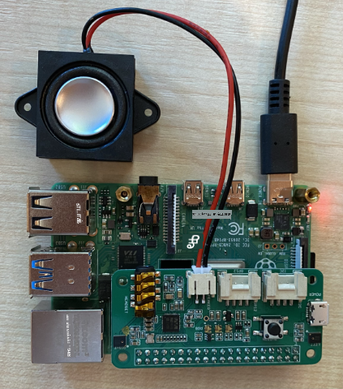

<!--
CO_OP_TRANSLATOR_METADATA:
{
  "original_hash": "7e45d884493c5222348b43fbc4481b6a",
  "translation_date": "2025-10-11T12:22:30+00:00",
  "source_file": "6-consumer/lessons/1-speech-recognition/pi-microphone.md",
  "language_code": "ta"
}
-->
# உங்கள் மைக்ரோஃபோன் மற்றும் ஸ்பீக்கர்களை அமைக்கவும் - ராஸ்பெர்ரி பை

இந்த பாடத்தின் இந்த பகுதியில், நீங்கள் உங்கள் ராஸ்பெர்ரி பையில் மைக்ரோஃபோன் மற்றும் ஸ்பீக்கர்களை சேர்க்கப் போகிறீர்கள்.

## ஹார்ட்வேர்கள்

ராஸ்பெர்ரி பைக்கு மைக்ரோஃபோன் தேவை.

பை-யில் மைக்ரோஃபோன் உள்ளமைக்கப்படவில்லை, எனவே நீங்கள் வெளிப்புற மைக்ரோஃபோனை சேர்க்க வேண்டும். இதைச் செய்ய பல வழிகள் உள்ளன:

* USB மைக்ரோஃபோன்
* USB ஹெட்செட்
* USB அனைத்தும் ஒரே இடத்தில் உள்ள speakerphone
* USB ஆடியோ அடாப்டர் மற்றும் 3.5mm ஜாக் கொண்ட மைக்ரோஃபோன்
* [ReSpeaker 2-Mics Pi HAT](https://www.seeedstudio.com/ReSpeaker-2-Mics-Pi-HAT.html)

> 💁 ராஸ்பெர்ரி பை-யில் அனைத்து ப்ளூடூத் மைக்ரோஃபோன்களும் ஆதரிக்கப்படவில்லை, எனவே உங்களிடம் ப்ளூடூத் மைக்ரோஃபோன் அல்லது ஹெட்செட் இருந்தால், ஜோடி செய்ய அல்லது ஆடியோ பிடிக்க சிக்கல்கள் இருக்கலாம்.

ராஸ்பெர்ரி பை-களில் 3.5mm ஹெட்போன் ஜாக் உள்ளது. இதை ஹெட்போன்கள், ஹெட்செட் அல்லது ஸ்பீக்கரை இணைக்க பயன்படுத்தலாம். மேலும், ஸ்பீக்கர்களை கீழ்க்காணும் முறையில் சேர்க்கலாம்:

* HDMI ஆடியோ மூலம் மானிட்டர் அல்லது டிவி
* USB ஸ்பீக்கர்கள்
* USB ஹெட்செட்
* USB அனைத்தும் ஒரே இடத்தில் உள்ள speakerphone
* [ReSpeaker 2-Mics Pi HAT](https://www.seeedstudio.com/ReSpeaker-2-Mics-Pi-HAT.html) மற்றும் 3.5mm ஜாக் அல்லது JST போர்ட் மூலம் இணைக்கப்பட்ட ஸ்பீக்கர்

## மைக்ரோஃபோன் மற்றும் ஸ்பீக்கர்களை இணைத்து அமைக்கவும்

மைக்ரோஃபோன் மற்றும் ஸ்பீக்கர்கள் இணைக்கப்பட்டு, அமைக்கப்பட வேண்டும்.

### பணிகள் - மைக்ரோஃபோனை இணைத்து அமைக்கவும்

1. மைக்ரோஃபோனை சரியான முறையில் இணைக்கவும். உதாரணமாக, USB போர்ட்களில் ஒன்றின் மூலம் அதை இணைக்கவும்.

1. நீங்கள் ReSpeaker 2-Mics Pi HAT-ஐ பயன்படுத்தினால், Grove அடிப்படை ஹாட்-ஐ அகற்றலாம், பின்னர் ReSpeaker ஹாட்-ஐ அதன் இடத்தில் பொருத்தலாம்.

    

    இந்த பாடத்தின் பின்னர் உங்களுக்கு Grove பொத்தான் தேவைப்படும், ஆனால் இந்த ஹாட்-இல் ஒன்று உள்ளமைக்கப்பட்டுள்ளது, எனவே Grove அடிப்படை ஹாட் தேவையில்லை.

    ஹாட் பொருத்தப்பட்ட பிறகு, நீங்கள் சில டிரைவர்களை நிறுவ வேண்டும். டிரைவர்களை நிறுவ [Seeed ஆரம்ப வழிகாட்டுதல்களை](https://wiki.seeedstudio.com/ReSpeaker_2_Mics_Pi_HAT_Raspberry/#getting-started) பார்க்கவும்.

    > ⚠️ இந்த வழிகாட்டுதல்கள் `git`-ஐ பயன்படுத்தி ஒரு repository-ஐ clone செய்கின்றன. உங்கள் பை-யில் `git` நிறுவப்படவில்லை என்றால், கீழே உள்ள கட்டளையை இயக்கி அதை நிறுவலாம்:
    >
    > ```sh
    > sudo apt install git --yes
    > ```

1. பை-யில் அல்லது VS Code மற்றும் ஒரு remote SSH session மூலம் இணைக்கப்பட்டு, மைக்ரோஃபோன் பற்றிய தகவலைப் பார்க்க கீழே உள்ள கட்டளையை உங்கள் Terminal-ல் இயக்கவும்:

    ```sh
    arecord -l
    ```

    நீங்கள் இணைக்கப்பட்ட மைக்ரோஃபோன்களின் பட்டியலைப் பார்க்கலாம். இது கீழே உள்ள மாதிரியானதாக இருக்கும்:

    ```output
    pi@raspberrypi:~ $ arecord -l
    **** List of CAPTURE Hardware Devices ****
    card 1: M0 [eMeet M0], device 0: USB Audio [USB Audio]
      Subdevices: 1/1
      Subdevice #0: subdevice #0
    ```

    நீங்கள் ஒரே ஒரு மைக்ரோஃபோனை வைத்திருந்தால், நீங்கள் ஒரே ஒரு பதிவை மட்டுமே காணலாம். Linux-ல் மைக்ரோஃபோன்களை அமைப்பது சிக்கலாக இருக்கலாம், எனவே ஒரே ஒரு மைக்ரோஃபோனை மட்டுமே பயன்படுத்தி மற்றவற்றை அணைக்கவும்.

    கார்டு எண்ணை குறித்துக் கொள்ளவும், இது உங்களுக்கு பின்னர் தேவைப்படும். மேலே உள்ள வெளியீட்டில் கார்டு எண் 1 ஆகும்.

### பணிகள் - ஸ்பீக்கரை இணைத்து அமைக்கவும்

1. ஸ்பீக்கர்களை சரியான முறையில் இணைக்கவும்.

1. பை-யில் அல்லது VS Code மற்றும் ஒரு remote SSH session மூலம் இணைக்கப்பட்டு, ஸ்பீக்கர்களைப் பற்றிய தகவலைப் பார்க்க கீழே உள்ள கட்டளையை உங்கள் Terminal-ல் இயக்கவும்:

    ```sh
    aplay -l
    ```

    நீங்கள் இணைக்கப்பட்ட ஸ்பீக்கர்களின் பட்டியலைப் பார்க்கலாம். இது கீழே உள்ள மாதிரியானதாக இருக்கும்:

    ```output
    pi@raspberrypi:~ $ aplay -l
    **** List of PLAYBACK Hardware Devices ****
    card 0: Headphones [bcm2835 Headphones], device 0: bcm2835 Headphones [bcm2835 Headphones]
      Subdevices: 8/8
      Subdevice #0: subdevice #0
      Subdevice #1: subdevice #1
      Subdevice #2: subdevice #2
      Subdevice #3: subdevice #3
      Subdevice #4: subdevice #4
      Subdevice #5: subdevice #5
      Subdevice #6: subdevice #6
      Subdevice #7: subdevice #7
    card 1: M0 [eMeet M0], device 0: USB Audio [USB Audio]
      Subdevices: 1/1
      Subdevice #0: subdevice #0
    ```

    நீங்கள் எப்போதும் `card 0: Headphones` என்பதைப் பார்க்கலாம், இது உள்ளமைக்கப்பட்ட ஹெட்போன் ஜாக் ஆகும். நீங்கள் கூடுதல் ஸ்பீக்கர்களை சேர்த்திருந்தால், உதாரணமாக USB ஸ்பீக்கர், இது பட்டியலில் காணப்படும்.

1. நீங்கள் கூடுதல் ஸ்பீக்கரை பயன்படுத்தினால், மற்றும் உள்ளமைக்கப்பட்ட ஹெட்போன் ஜாக்-க்கு இணைக்கப்பட்ட ஸ்பீக்கர் அல்லது ஹெட்போன்களை பயன்படுத்தவில்லை என்றால், அதை இயல்புநிலை ஆக அமைக்க வேண்டும். இதைச் செய்ய கீழே உள்ள கட்டளையை இயக்கவும்:

    ```sh
    sudo nano /usr/share/alsa/alsa.conf
    ```

    இது `nano`, ஒரு terminal-அடிப்படையிலான text editor-ல் ஒரு configuration file-ஐ திறக்கும். உங்கள் keyboard-ல் உள்ள arrow keys-ஐ பயன்படுத்தி கீழேスク்ரோல் செய்து, கீழே உள்ள வரியைப் பாருங்கள்:

    ```output
    defaults.pcm.card 0
    ```

    `0` என்ற மதிப்பை `aplay -l` அழைப்பில் இருந்து வந்த பட்டியலில் உள்ள கார்டு எண்ணுக்கு மாற்றவும். உதாரணமாக, மேலே உள்ள வெளியீட்டில் `card 1: M0 [eMeet M0], device 0: USB Audio [USB Audio]` என்ற இரண்டாவது சவுண்ட் கார்டு உள்ளது, இது card 1 ஆகும். இதைப் பயன்படுத்த, நான் வரியை இவ்வாறு புதுப்பிப்பேன்:

    ```output
    defaults.pcm.card 1
    ```

    இந்த மதிப்பை சரியான கார்டு எண்ணுக்கு அமைக்கவும். உங்கள் keyboard-ல் உள்ள arrow keys-ஐ பயன்படுத்தி எண்ணைச் சென்றடையலாம், பின்னர் text files-ஐ edit செய்யும் போது வழக்கமாக delete செய்து புதிய எண்ணை type செய்யலாம்.

1. மாற்றங்களைச் சேமித்து, `Ctrl+x` அழுத்தி file-ஐ மூடவும். file-ஐ சேமிக்க `y` அழுத்தி, பின்னர் file name-ஐ தேர்ந்தெடுக்க `return` அழுத்தவும்.

### பணிகள் - மைக்ரோஃபோன் மற்றும் ஸ்பீக்கரை சோதிக்கவும்

1. மைக்ரோஃபோனில் 5 விநாடிகள் ஆடியோ பதிவு செய்ய கீழே உள்ள கட்டளையை இயக்கவும்:

    ```sh
    arecord --format=S16_LE --duration=5 --rate=16000 --file-type=wav out.wav
    ```

    இந்த கட்டளை இயங்கும் போது, மைக்ரோஃபோனில் சத்தம் செய்யவும், உதாரணமாக பேசுதல், பாடுதல், beat boxing, ஒரு இசைக்கருவி வாசித்தல் அல்லது உங்களுக்கு விருப்பமானது.

1. 5 விநாடிகள் கழித்து, பதிவு நிறுத்தப்படும். ஆடியோவை மீண்டும் play செய்ய கீழே உள்ள கட்டளையை இயக்கவும்:

    ```sh
    aplay --format=S16_LE --rate=16000 out.wav
    ```

    நீங்கள் ஸ்பீக்கர்களில் ஆடியோவை மீண்டும் play செய்யும் சத்தத்தை கேட்கலாம். உங்கள் speaker-ல் output volume-ஐ தேவையான அளவுக்கு சரிசெய்க.

1. உள்ளமைக்கப்பட்ட மைக்ரோஃபோன் போர்டின் volume-ஐ சரிசெய்ய அல்லது மைக்ரோஃபோனின் gain-ஐ சரிசெய்ய, `alsamixer` utility-ஐ பயன்படுத்தலாம். இந்த utility பற்றிய மேலும் தகவலுக்கு [Linux alsamixer man page](https://linux.die.net/man/1/alsamixer) பார்க்கவும்.

1. ஆடியோவை மீண்டும் play செய்யும் போது errors வந்தால், `alsa.conf` file-ல் `defaults.pcm.card` ஆக அமைத்த card-ஐ சரிபார்க்கவும்.

---

**குறிப்பு**:  
இந்த ஆவணம் [Co-op Translator](https://github.com/Azure/co-op-translator) என்ற AI மொழிபெயர்ப்பு சேவையை பயன்படுத்தி மொழிபெயர்க்கப்பட்டுள்ளது. எங்கள் தரத்தை உறுதிப்படுத்த முயற்சிக்கிறோம், ஆனால் தானியக்க மொழிபெயர்ப்புகளில் பிழைகள் அல்லது தவறுகள் இருக்கக்கூடும் என்பதை கவனத்தில் கொள்ளவும். அதன் தாய்மொழியில் உள்ள மூல ஆவணம் அதிகாரப்பூர்வ ஆதாரமாக கருதப்பட வேண்டும். முக்கியமான தகவல்களுக்கு, தொழில்முறை மனித மொழிபெயர்ப்பு பரிந்துரைக்கப்படுகிறது. இந்த மொழிபெயர்ப்பைப் பயன்படுத்துவதால் ஏற்படும் எந்த தவறான புரிதல்கள் அல்லது தவறான விளக்கங்களுக்கு நாங்கள் பொறுப்பல்ல.