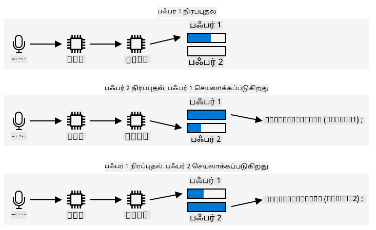

<!--
CO_OP_TRANSLATOR_METADATA:
{
  "original_hash": "2f336726b9410e97c3aaed76cc89b0d8",
  "translation_date": "2025-10-11T12:17:21+00:00",
  "source_file": "6-consumer/lessons/1-speech-recognition/wio-terminal-audio.md",
  "language_code": "ta"
}
-->
# ஆடியோ பதிவு - Wio Terminal

இந்த பாடத்தின் இந்த பகுதியில், Wio Terminal-ல் ஆடியோ பதிவு செய்ய நீங்கள் குறியீடு எழுதுவீர்கள். ஆடியோ பதிவு Wio Terminal-ன் மேல் உள்ள பொத்துகளில் ஒன்றால் கட்டுப்படுத்தப்படும்.

## சாதனத்தை ஆடியோ பதிவு செய்ய நிரலாக்கம் செய்யுங்கள்

மைக்ரோஃபோனிலிருந்து C++ குறியீட்டைப் பயன்படுத்தி ஆடியோ பதிவு செய்யலாம். Wio Terminal-க்கு 192KB RAM மட்டுமே உள்ளது, இது இரண்டு விநாடிகளுக்கு மேல் ஆடியோ பதிவு செய்ய போதுமானது அல்ல. இது 4MB ஃப்ளாஷ் மெமரியையும் கொண்டுள்ளது, எனவே இதை பயன்படுத்தி, பதிவு செய்யப்பட்ட ஆடியோவை ஃப்ளாஷ் மெமரியில் சேமிக்கலாம்.

உள்ளமைக்கப்பட்ட மைக்ரோஃபோன் ஒரு அனலாக் சிக்னலைப் பதிவு செய்கிறது, இது Wio Terminal பயன்படுத்தக்கூடிய டிஜிட்டல் சிக்னலாக மாற்றப்படுகிறது. ஆடியோவை பதிவு செய்யும்போது, தரவுகளை சரியான நேரத்தில் பதிவு செய்ய வேண்டும் - உதாரணமாக, 16KHz-ல் ஆடியோ பதிவு செய்ய, ஆடியோவை சரியாக 16,000 முறை ஒரு வினாடிக்கு பதிவு செய்ய வேண்டும், ஒவ்வொரு மாதிரிக்கும் இடையில் சம இடைவெளியுடன். உங்கள் குறியீட்டை இதைச் செய்ய பயன்படுத்துவதற்கு பதிலாக, நீங்கள் நேரடி மெமரி அணுகல் கட்டுப்பாட்டியை (DMAC) பயன்படுத்தலாம். இது ஒரு சிக்னலை எங்கிருந்தோ பதிவு செய்து மெமரியில் எழுத உதவக்கூடிய சுற்று அமைப்பு, உங்கள் குறியீடு செயலியில் இயங்குவதில் இடையூறு செய்யாமல்.

✅ DMA பற்றி மேலும் அறிய [Wikipedia-இல் நேரடி மெமரி அணுகல் பக்கம்](https://wikipedia.org/wiki/Direct_memory_access) பார்க்கவும்.



DMAC ADC-இலிருந்து 16,000 முறை ஒரு வினாடிக்கு 16KHz ஆடியோவுக்கு போன்ற நிலையான இடைவெளிகளில் ஆடியோ பதிவு செய்ய முடியும். இது பதிவு செய்யப்பட்ட தரவுகளை முன்கூட்டியே ஒதுக்கப்பட்ட மெமரி பஃபருக்கு எழுத முடியும், மேலும் இது நிரம்பியதும், உங்கள் குறியீடு செயலாக்கத்திற்கு கிடைக்கச் செய்ய முடியும். இந்த மெமரியைப் பயன்படுத்துவது ஆடியோ பதிவை தாமதப்படுத்தலாம், ஆனால் நீங்கள் பல பஃபர்களை அமைக்கலாம். DMAC பஃபர் 1-க்கு எழுதுகிறது, பின்னர் இது நிரம்பியதும், உங்கள் குறியீடு பஃபர் 1-ஐ செயலாக்க அறிவிக்கிறது, அதே நேரத்தில் DMAC பஃபர் 2-க்கு எழுதுகிறது. பஃபர் 2 நிரம்பியதும், உங்கள் குறியீடு அறிவிக்கப்படுகிறது, மேலும் பஃபர் 1-க்கு மீண்டும் எழுதுகிறது. இவ்வாறு ஒவ்வொரு பஃபரையும் நிரப்புவதற்கு குறைவான நேரத்தில் செயலாக்கினால், எந்தவொரு தரவையும் இழக்கமாட்டீர்கள்.

ஒவ்வொரு பஃபரும் பதிவு செய்யப்பட்டதும், இது ஃப்ளாஷ் மெமரிக்கு எழுதப்படலாம். ஃப்ளாஷ் மெமரியை குறிப்பிட்ட முகவரிகளைப் பயன்படுத்தி எழுத வேண்டும், எங்கு எழுத வேண்டும் மற்றும் எவ்வளவு பெரியதாக எழுத வேண்டும் என்பதை குறிப்பிட வேண்டும், இது மெமரியில் பைட்டுகளின் வரிசையைப் புதுப்பிப்பதைப் போன்றது. ஃப்ளாஷ் மெமரியில் தானியக்கத்தன்மை உள்ளது, அதாவது அழிக்க மற்றும் எழுதும் செயல்பாடுகள் ஒரு நிலையான அளவில் மட்டுமல்லாமல், அந்த அளவுக்கு ஒழுங்குபடுத்தப்படுவதிலும் சார்ந்துள்ளது. உதாரணமாக, தானியக்கத்தன்மை 4096 பைட்டுகள் என்றால், நீங்கள் முகவரி 4200-ல் அழிக்க கோரினால், இது முகவரி 4096 முதல் 8192 வரை உள்ள அனைத்து தரவுகளையும் அழிக்கலாம். இதனால், ஆடியோ தரவுகளை ஃப்ளாஷ் மெமரியில் எழுதும்போது, இது சரியான அளவுகளில் துண்டுகளாக இருக்க வேண்டும்.

### பணிகள் - ஃப்ளாஷ் மெமரியை அமைக்கவும்

1. PlatformIO-ஐப் பயன்படுத்தி புதிய Wio Terminal திட்டத்தை உருவாக்கவும். இந்த திட்டத்தை `smart-timer` என்று அழைக்கவும். `setup` செயல்பாட்டில் சீரியல் போர்ட்டை அமைக்க குறியீட்டைச் சேர்க்கவும்.

1. ஃப்ளாஷ் மெமரிக்கு அணுகலை வழங்க `platformio.ini` கோப்பில் பின்வரும் நூலக சார்புகளைச் சேர்க்கவும்:

    ```ini
    lib_deps =
        seeed-studio/Seeed Arduino FS @ 2.1.1
        seeed-studio/Seeed Arduino SFUD @ 2.0.2
    ```

1. `main.cpp` கோப்பைத் திறந்து, ஃப்ளாஷ் மெமரி நூலகத்திற்கான பின்வரும் சேர்க்கல் இயக்கத்தை கோப்பின் மேல் சேர்க்கவும்:

    ```cpp
    #include <sfud.h>
    #include <SPI.h>
    ```

    > 🎓 SFUD என்பது Serial Flash Universal Driver-ஐ குறிக்கிறது, மேலும் இது அனைத்து ஃப்ளாஷ் மெமரி சிப்களுடன் வேலை செய்ய வடிவமைக்கப்பட்ட ஒரு நூலகமாகும்.

1. `setup` செயல்பாட்டில், ஃப்ளாஷ் சேமிப்பு நூலகத்தை அமைக்க பின்வரும் குறியீட்டைச் சேர்க்கவும்:

    ```cpp
    while (!(sfud_init() == SFUD_SUCCESS))
        ;

    sfud_qspi_fast_read_enable(sfud_get_device(SFUD_W25Q32_DEVICE_INDEX), 2);
    ```

    இது SFUD நூலகம் தொடங்கும் வரை மடங்குகிறது, பின்னர் வேகமான வாசிப்புகளை இயக்குகிறது. உள்ளமைக்கப்பட்ட ஃப்ளாஷ் மெமரியை Queued Serial Peripheral Interface (QSPI) பயன்படுத்தி அணுகலாம், இது குறைந்த செயலி பயன்பாட்டுடன் ஒரு வரிசை மூலம் தொடர்ச்சியான அணுகலை அனுமதிக்கும் SPI கட்டுப்பாட்டியின் ஒரு வகை. இது ஃப்ளாஷ் மெமரியை வாசிக்கவும் எழுதவும் வேகமாக செய்கிறது.

1. `src` கோப்புறையில் `flash_writer.h` என்ற புதிய கோப்பை உருவாக்கவும்.

1. இந்த கோப்பின் மேல் பின்வருவனவற்றைச் சேர்க்கவும்:

    ```cpp
    #pragma once

    #include <Arduino.h>
    #include <sfud.h>
    ```

    இது ஃப்ளாஷ் மெமரியுடன் தொடர்பு கொள்ள SFUD நூலகத்திற்கான தலைப்பு கோப்பை உட்பட சில தேவையான தலைப்பு கோப்புகளைச் சேர்க்கிறது.

1. இந்த புதிய தலைப்பு கோப்பில் `FlashWriter` என்ற வகையை வரையறுக்கவும்:

    ```cpp
    class FlashWriter
    {
    public:
    
    private:
    };
    ```

1. `private` பிரிவில் பின்வரும் குறியீட்டைச் சேர்க்கவும்:

    ```cpp
    byte *_sfudBuffer;
    size_t _sfudBufferSize;
    size_t _sfudBufferPos;
    size_t _sfudBufferWritePos;

    const sfud_flash *_flash;
    ```

    இது ஃப்ளாஷ் மெமரியில் தரவுகளை எழுதுவதற்கு முன் பயன்படுத்த பஃபருக்கான சில புலங்களை வரையறுக்கிறது. ஒரு பைட் வரிசை, `_sfudBuffer`, தரவுகளை எழுதுவதற்கு உள்ளது, மேலும் இது நிரம்பியதும், தரவுகள் ஃப்ளாஷ் மெமரியில் எழுதப்படும். `_sfudBufferPos` புலம் இந்த பஃபரில் எழுத текகCURRENT_LOCATION-ஐ சேமிக்கிறது, மேலும் `_sfudBufferWritePos` ஃப்ளாஷ் மெமரியில் எழுத இடத்தை சேமிக்கிறது. `_flash` என்பது எழுத ஃப்ளாஷ் மெமரிக்கு ஒரு சுட்டி - சில மைக்ரோகண்ட்ரோலர்களுக்கு பல ஃப்ளாஷ் மெமரி சிப்கள் உள்ளன.

1. இந்த வகையின் `public` பிரிவில் பின்வரும் முறைசார்ந்த குறியீட்டைச் சேர்க்கவும்:

    ```cpp
    void init()
    {
        _flash = sfud_get_device_table() + 0;
        _sfudBufferSize = _flash->chip.erase_gran;
        _sfudBuffer = new byte[_sfudBufferSize];
        _sfudBufferPos = 0;
        _sfudBufferWritePos = 0;
    }
    ```

    இது Wio Terminal-ல் ஃப்ளாஷ் மெமரியை எழுத அமைக்கிறது, மேலும் ஃப்ளாஷ் மெமரியின் தானியக்கத்தன்மை அளவை அடிப்படையாகக் கொண்ட பஃபர்களை அமைக்கிறது. இது ஒரு `init` முறையில் உள்ளது, கட்டமைப்பாளருக்கு பதிலாக, இது `setup` செயல்பாட்டில் ஃப்ளாஷ் மெமரி அமைக்கப்பட்ட பிறகு அழைக்கப்பட வேண்டும்.

1. `public` பிரிவில் பின்வரும் குறியீட்டைச் சேர்க்கவும்:

    ```cpp
    void writeSfudBuffer(byte b)
    {
        _sfudBuffer[_sfudBufferPos++] = b;
        if (_sfudBufferPos == _sfudBufferSize)
        {
            sfud_erase_write(_flash, _sfudBufferWritePos, _sfudBufferSize, _sfudBuffer);
            _sfudBufferWritePos += _sfudBufferSize;
            _sfudBufferPos = 0;
        }
    }

    void writeSfudBuffer(byte *b, size_t len)
    {
        for (size_t i = 0; i < len; ++i)
        {
            writeSfudBuffer(b[i]);
        }
    }

    void flushSfudBuffer()
    {
        if (_sfudBufferPos > 0)
        {
            sfud_erase_write(_flash, _sfudBufferWritePos, _sfudBufferSize, _sfudBuffer);
            _sfudBufferWritePos += _sfudBufferSize;
            _sfudBufferPos = 0;
        }
    }
    ```

    இந்த குறியீடு பைட்டுகளை ஃப்ளாஷ் சேமிப்பு அமைப்புக்கு எழுத முறைசார்ந்த முறைகளை வரையறுக்கிறது. இது ஃப்ளாஷ் மெமரிக்கு சரியான அளவுடைய ஒரு நினைவக பஃபருக்கு எழுதுவதன் மூலம் செயல்படுகிறது, மேலும் இது நிரம்பியதும், இது ஃப்ளாஷ் மெமரிக்கு எழுதப்படுகிறது, அந்த இடத்தில் ஏற்கனவே உள்ள தரவுகளை அழிக்கிறது. `flushSfudBuffer` என்ற முறை ஒரு முழுமையற்ற பஃபரை எழுதுகிறது, ஏனெனில் பதிவு செய்யப்படும் தரவுகள் தானியக்கத்தன்மை அளவுகளின் சரியான பலமில்லாமல் இருக்கும், எனவே தரவின் இறுதி பகுதி எழுதப்பட வேண்டும்.

    > 💁 இறுதி பகுதி தேவையற்ற கூடுதல் தரவுகளை எழுதும், ஆனால் இது சரி, தேவையான தரவுகள் மட்டுமே வாசிக்கப்படும்.

### பணிகள் - ஆடியோ பதிவை அமைக்கவும்

1. `src` கோப்புறையில் `config.h` என்ற புதிய கோப்பை உருவாக்கவும்.

1. இந்த கோப்பின் மேல் பின்வருவனவற்றைச் சேர்க்கவும்:

    ```cpp
    #pragma once

    #define RATE 16000
    #define SAMPLE_LENGTH_SECONDS 4
    #define SAMPLES RATE * SAMPLE_LENGTH_SECONDS
    #define BUFFER_SIZE (SAMPLES * 2) + 44
    #define ADC_BUF_LEN 1600
    ```

    இந்த குறியீடு ஆடியோ பதிவுக்கான சில நிலையான மதிப்புகளை அமைக்கிறது.

    | நிலையானது              | மதிப்பு  | விளக்கம் |
    | --------------------- | -----: | - |
    | RATE                  | 16000  | ஆடியோவுக்கான மாதிரி விகிதம். 16,000 என்பது 16KHz |
    | SAMPLE_LENGTH_SECONDS | 4      | பதிவு செய்ய வேண்டிய ஆடியோ நீளம். இது 4 விநாடிகளாக அமைக்கப்பட்டுள்ளது. நீண்ட ஆடியோ பதிவு செய்ய, இதை அதிகரிக்கவும். |
    | SAMPLES               | 64000  | பதிவு செய்யப்படும் மொத்த ஆடியோ மாதிரிகள். மாதிரி விகிதம் * விநாடிகளின் எண்ணிக்கை |
    | BUFFER_SIZE           | 128044 | ஆடியோ பஃபரின் அளவு. ஆடியோ WAV கோப்பாக பதிவு செய்யப்படும், இது 44 பைட்டுகள் தலைப்பு, பின்னர் 128,000 பைட்டுகள் ஆடியோ தரவுகள் (ஒவ்வொரு மாதிரியும் 2 பைட்டுகள்) |
    | ADC_BUF_LEN           | 1600   | DMAC-இலிருந்து ஆடியோ பதிவு செய்ய பயன்படுத்த பஃபர்களின் அளவு |

    > 💁 4 விநாடிகள் ஒரு டைமரை கோருவதற்கு குறைவாக இருந்தால், `SAMPLE_LENGTH_SECONDS` மதிப்பை அதிகரிக்கவும், மேலும் மற்ற மதிப்புகள் அனைத்தும் மீளெழுதப்படும்.

1. `src` கோப்புறையில் `mic.h` என்ற புதிய கோப்பை உருவாக்கவும்.

1. இந்த கோப்பின் மேல் பின்வருவனவற்றைச் சேர்க்கவும்:

    ```cpp
    #pragma once

    #include <Arduino.h>

    #include "config.h"
    #include "flash_writer.h"
    ```

    இது `config.h` மற்றும் `FlashWriter` தலைப்பு கோப்புகளை உட்பட சில தேவையான தலைப்பு கோப்புகளைச் சேர்க்கிறது.

1. மைக்ரோஃபோனிலிருந்து பதிவு செய்ய `Mic` வகையை வரையறுக்க பின்வருவனவற்றைச் சேர்க்கவும்:

    ```cpp
    class Mic
    {
    public:
        Mic()
        {
            _isRecording = false;
            _isRecordingReady = false;
        }
    
        void startRecording()
        {
            _isRecording = true;
            _isRecordingReady = false;
        }
    
        bool isRecording()
        {
            return _isRecording;
        }
    
        bool isRecordingReady()
        {
            return _isRecordingReady;
        }
    
    private:
        volatile bool _isRecording;
        volatile bool _isRecordingReady;
        FlashWriter _writer;
    };
    
    Mic mic;
    ```

    இந்த வகை தற்போது பதிவு தொடங்கியதா, மற்றும் ஒரு பதிவு பயன்படுத்த தயாராக உள்ளதா என்பதை கண்காணிக்க சில புலங்களை மட்டுமே கொண்டுள்ளது. DMAC அமைக்கப்பட்ட பிறகு, இது தொடர்ந்து நினைவக பஃபர்களுக்கு எழுதுகிறது, எனவே `_isRecording` கொடி இந்த பஃபர்களை செயலாக்க வேண்டுமா அல்லது புறக்கணிக்க வேண்டுமா என்பதை தீர்மானிக்கிறது. `_isRecordingReady` கொடி தேவையான 4 விநாடிகளின் ஆடியோ பதிவு செய்யப்பட்டதும் அமைக்கப்படும். `_writer` புலம் ஆடியோ தரவுகளை ஃப்ளாஷ் மெமரியில் சேமிக்க பயன்படுத்தப்படுகிறது.

    பின்னர் `Mic` வகையின் ஒரு எடுத்துக்காட்டிற்கான ஒரு உலகளாவிய மாறி அறிவிக்கப்படுகிறது.

1. `Mic` வகையின் `private` பிரிவில் பின்வரும் குறியீட்டைச் சேர்க்கவும்:

    ```cpp
    typedef struct
    {
        uint16_t btctrl;
        uint16_t btcnt;
        uint32_t srcaddr;
        uint32_t dstaddr;
        uint32_t descaddr;
    } dmacdescriptor;

    // Globals - DMA and ADC
    volatile dmacdescriptor _wrb[DMAC_CH_NUM] __attribute__((aligned(16)));
    dmacdescriptor _descriptor_section[DMAC_CH_NUM] __attribute__((aligned(16)));
    dmacdescriptor _descriptor __attribute__((aligned(16)));

    void configureDmaAdc()
    {
        // Configure DMA to sample from ADC at a regular interval (triggered by timer/counter)
        DMAC->BASEADDR.reg = (uint32_t)_descriptor_section;                    // Specify the location of the descriptors
        DMAC->WRBADDR.reg = (uint32_t)_wrb;                                    // Specify the location of the write back descriptors
        DMAC->CTRL.reg = DMAC_CTRL_DMAENABLE | DMAC_CTRL_LVLEN(0xf);           // Enable the DMAC peripheral
        DMAC->Channel[1].CHCTRLA.reg = DMAC_CHCTRLA_TRIGSRC(TC5_DMAC_ID_OVF) | // Set DMAC to trigger on TC5 timer overflow
                                        DMAC_CHCTRLA_TRIGACT_BURST;             // DMAC burst transfer

        _descriptor.descaddr = (uint32_t)&_descriptor_section[1];                    // Set up a circular descriptor
        _descriptor.srcaddr = (uint32_t)&ADC1->RESULT.reg;                           // Take the result from the ADC0 RESULT register
        _descriptor.dstaddr = (uint32_t)_adc_buf_0 + sizeof(uint16_t) * ADC_BUF_LEN; // Place it in the adc_buf_0 array
        _descriptor.btcnt = ADC_BUF_LEN;                                             // Beat count
        _descriptor.btctrl = DMAC_BTCTRL_BEATSIZE_HWORD |                            // Beat size is HWORD (16-bits)
                                DMAC_BTCTRL_DSTINC |                                    // Increment the destination address
                                DMAC_BTCTRL_VALID |                                     // Descriptor is valid
                                DMAC_BTCTRL_BLOCKACT_SUSPEND;                           // Suspend DMAC channel 0 after block transfer
        memcpy(&_descriptor_section[0], &_descriptor, sizeof(_descriptor));          // Copy the descriptor to the descriptor section

        _descriptor.descaddr = (uint32_t)&_descriptor_section[0];                    // Set up a circular descriptor
        _descriptor.srcaddr = (uint32_t)&ADC1->RESULT.reg;                           // Take the result from the ADC0 RESULT register
        _descriptor.dstaddr = (uint32_t)_adc_buf_1 + sizeof(uint16_t) * ADC_BUF_LEN; // Place it in the adc_buf_1 array
        _descriptor.btcnt = ADC_BUF_LEN;                                             // Beat count
        _descriptor.btctrl = DMAC_BTCTRL_BEATSIZE_HWORD |                            // Beat size is HWORD (16-bits)
                                DMAC_BTCTRL_DSTINC |                                    // Increment the destination address
                                DMAC_BTCTRL_VALID |                                     // Descriptor is valid
                                DMAC_BTCTRL_BLOCKACT_SUSPEND;                           // Suspend DMAC channel 0 after block transfer
        memcpy(&_descriptor_section[1], &_descriptor, sizeof(_descriptor));          // Copy the descriptor to the descriptor section

        // Configure NVIC
        NVIC_SetPriority(DMAC_1_IRQn, 0); // Set the Nested Vector Interrupt Controller (NVIC) priority for DMAC1 to 0 (highest)
        NVIC_EnableIRQ(DMAC_1_IRQn);      // Connect DMAC1 to Nested Vector Interrupt Controller (NVIC)

        // Activate the suspend (SUSP) interrupt on DMAC channel 1
        DMAC->Channel[1].CHINTENSET.reg = DMAC_CHINTENSET_SUSP;

        // Configure ADC
        ADC1->INPUTCTRL.bit.MUXPOS = ADC_INPUTCTRL_MUXPOS_AIN12_Val; // Set the analog input to ADC0/AIN2 (PB08 - A4 on Metro M4)
        while (ADC1->SYNCBUSY.bit.INPUTCTRL)
            ;                              // Wait for synchronization
        ADC1->SAMPCTRL.bit.SAMPLEN = 0x00; // Set max Sampling Time Length to half divided ADC clock pulse (2.66us)
        while (ADC1->SYNCBUSY.bit.SAMPCTRL)
            ;                                         // Wait for synchronization
        ADC1->CTRLA.reg = ADC_CTRLA_PRESCALER_DIV128; // Divide Clock ADC GCLK by 128 (48MHz/128 = 375kHz)
        ADC1->CTRLB.reg = ADC_CTRLB_RESSEL_12BIT |    // Set ADC resolution to 12 bits
                            ADC_CTRLB_FREERUN;          // Set ADC to free run mode
        while (ADC1->SYNCBUSY.bit.CTRLB)
            ;                       // Wait for synchronization
        ADC1->CTRLA.bit.ENABLE = 1; // Enable the ADC
        while (ADC1->SYNCBUSY.bit.ENABLE)
            ;                       // Wait for synchronization
        ADC1->SWTRIG.bit.START = 1; // Initiate a software trigger to start an ADC conversion
        while (ADC1->SYNCBUSY.bit.SWTRIG)
            ; // Wait for synchronization

        // Enable DMA channel 1
        DMAC->Channel[1].CHCTRLA.bit.ENABLE = 1;

        // Configure Timer/Counter 5
        GCLK->PCHCTRL[TC5_GCLK_ID].reg = GCLK_PCHCTRL_CHEN |     // Enable peripheral channel for TC5
                                            GCLK_PCHCTRL_GEN_GCLK1; // Connect generic clock 0 at 48MHz

        TC5->COUNT16.WAVE.reg = TC_WAVE_WAVEGEN_MFRQ; // Set TC5 to Match Frequency (MFRQ) mode
        TC5->COUNT16.CC[0].reg = 3000 - 1;            // Set the trigger to 16 kHz: (4Mhz / 16000) - 1
        while (TC5->COUNT16.SYNCBUSY.bit.CC0)
            ; // Wait for synchronization

        // Start Timer/Counter 5
        TC5->COUNT16.CTRLA.bit.ENABLE = 1; // Enable the TC5 timer
        while (TC5->COUNT16.SYNCBUSY.bit.ENABLE)
            ; // Wait for synchronization
    }

    uint16_t _adc_buf_0[ADC_BUF_LEN];
    uint16_t _adc_buf_1[ADC_BUF_LEN];
    ```

    இந்த குறியீடு DMAC-ஐ அமைக்க, அதை ADC-க்கு இணைத்து, `_adc_buf_0` மற்றும் `_adc_buf_1` என்ற இரண்டு மாறுபட்ட பஃபர்களை நிரப்ப அமைக்க `configureDmaAdc` முறையை வரையறுக்கிறது.

    > 💁 மைக்ரோகண்ட்ரோலர் மேம்பாட்டின் குறைபாடுகளில் ஒன்று, ஹார்ட்வேருடன் தொடர்பு கொள்ள தேவையான குறியீட்டின் சிக்கல்தன்மை, உங்கள் குறியீடு மிகவும் குறைந்த நிலைமையில் ஹார்ட்வேருடன் நேரடியாக தொடர்பு கொள்ள இயங்குகிறது. ஒரே-போர்டு கணினி அல்லது டெஸ்க்டாப் கணினிக்கான நீங்கள் எழுதும் குறியீட்டைவிட இந்த குறியீடு சிக்கலானது, ஏனெனில் உதவ ஒரு இயக்க முறைமை இல்லை. இதை எளிமைப்படுத்த சில நூலகங்கள் கிடைக்கின்றன, ஆனால் இன்னும் நிறைய சிக்கல்தன்மை உள்ளது.

1. இதற்கு கீழே பின்வரும் குறியீட்டைச் சேர்க்கவும்:

    ```cpp
    // WAV files have a header. This struct defines that header
    struct wavFileHeader
    {
        char riff[4];         /* "RIFF"                                  */
        long flength;         /* file length in bytes                    */
        char wave[4];         /* "WAVE"                                  */
        char fmt[4];          /* "fmt "                                  */
        long chunk_size;      /* size of FMT chunk in bytes (usually 16) */
        short format_tag;     /* 1=PCM, 257=Mu-Law, 258=A-Law, 259=ADPCM */
        short num_chans;      /* 1=mono, 2=stereo                        */
        long srate;           /* Sampling rate in samples per second     */
        long bytes_per_sec;   /* bytes per second = srate*bytes_per_samp */
        short bytes_per_samp; /* 2=16-bit mono, 4=16-bit stereo          */
        short bits_per_samp;  /* Number of bits per sample               */
        char data[4];         /* "data"                                  */
        long dlength;         /* data length in bytes (filelength - 44)  */
    };

    void initBufferHeader()
    {
        wavFileHeader wavh;

        strncpy(wavh.riff, "RIFF", 4);
        strncpy(wavh.wave, "WAVE", 4);
        strncpy(wavh.fmt, "fmt ", 4);
        strncpy(wavh.data, "data", 4);

        wavh.chunk_size = 16;
        wavh.format_tag = 1; // PCM
        wavh.num_chans = 1;  // mono
        wavh.srate = RATE;
        wavh.bytes_per_sec = (RATE * 1 * 16 * 1) / 8;
        wavh.bytes_per_samp = 2;
        wavh.bits_per_samp = 16;
        wavh.dlength = RATE * 2 * 1 * 16 / 2;
        wavh.flength = wavh.dlength + 44;

        _writer.writeSfudBuffer((byte *)&wavh, 44);
    }
    ```

    இந்த குறியீடு WAV தலைப்பை 44 பைட்டுகள் நினைவகத்தை எடுத்துக்கொள்ளும் ஒரு அமைப்பாக வரையறுக்கிறது. இது ஆடியோ கோப்பு விகிதம், அளவு, மற்றும் சேனல்களின் எண்ணிக்கை பற்றிய விவரங்களை எழுதுகிறது. இந்த தலைப்பு பின்னர் ஃப்ளாஷ் மெமரியில் எழுதப்படுகிறது.

1. இந்த குறியீட்டின் கீழே, ஆடியோ பஃபர்கள் செயலாக்க தயாராக இருக்கும் போது அழைக்கப்படும் முறையை அறிவிக்க பின்வருவனவற்றைச் சேர்க்கவும்:

    ```cpp
    void audioCallback(uint16_t *buf, uint32_t buf_len)
    {
        static uint32_t idx = 44;

        if (_isRecording)
        {
            for (uint32_t i = 0; i < buf_len; i++)
            {
                int16_t audio_value = ((int16_t)buf[i] - 2048) * 16;

                _writer.writeSfudBuffer(audio_value & 0xFF);
                _writer.writeSfudBuffer((audio_value >> 8) & 0xFF);
            }

            idx += buf_len;
                
            if (idx >= BUFFER_SIZE)
            {
                _writer.flushSfudBuffer();
                idx = 44;
                _isRecording = false;
                _isRecordingReady = true;
            }
        }
    }
    ```

    ஆடியோ பஃபர்கள் ADC-இலிருந்து ஆடியோ கொண்ட 16-பிட் முழு எண்களின் வரிசைகள். ADC 12-பிட் கையொப்பமற்ற மதிப்புகளை (0-1023) திருப்புகிறது, எனவே இவை 16-பிட் கையொப்பமற்ற மதிப்புகளாக மாற்றப்பட வேண்டும், பின்னர் இரு பைட்டுகளாக மாற்றி மூல பைனரி தரவாக சேமிக்க வேண்டும்.

    இந்த பைட்டுகள் ஃப்ளாஷ் மெமரி பஃபர்களுக்கு எழுதப்படுகின்றன. எழுதுதல் 44-ல் தொடங்குகிறது - இது WAV கோப்பு தலைப்பாக எழுதப்பட்ட 44 பைட்டுகளின் இடமாற்றம். தேவையான ஆடியோ நீளத்திற்கான அனைத்து பைட்டுகளும் பதிவு செய்யப்பட்ட பிறகு, மீதமுள்ள தரவுகள் ஃப்ளாஷ் மெமரியில் எழுதப்படுகின்றன.

1. `Mic` வகையின் `public` பிரிவில் பின்வரும் குறியீட்டைச் சேர்க்கவும்:

    ```cpp
    void dmaHandler()
    {
        static uint8_t count = 0;

        if (DMAC->Channel[1].CHINTFLAG.bit.SUSP)
        {
            DMAC->Channel[1].CHCTRLB.reg = DMAC_CHCTRLB_CMD_RESUME;
            DMAC->Channel[1].CHINTFLAG.bit.SUSP = 1;

            if (count)
            {
                audioCallback(_adc_buf_0, ADC_BUF_LEN);
            }
            else
            {
                audioCallback(_adc_buf_1, ADC_BUF_LEN);
            }

            count = (count + 1) % 2;
        }
    }
    ```

    DMAC உங்கள் குறியீட்டை பஃபர்களை செயலாக்க அழைக்க இந்த குறியீடு அழைக்கப்படும். செயலாக்கத்திற்கான தரவுகள் உள்ளதா என்பதை சரிபார்க்கிறது, மேலும் தொடர்புடைய பஃபருடன் `audioCallback` முறையை அழைக்கிறது.

1. வகைக்கு வெளியே, `Mic mic;` அறிவிப்புக்குப் பிறகு, பின்வரும் குறியீட்டைச் சேர்க்கவும்:

    ```cpp
    void DMAC_1_Handler()
    {
        mic.dmaHandler();
    }
    ```

    `DMAC_1_Handler` DMAC மூலம் அழைக்கப்படும், பஃபர்கள் செயலாக்கத்திற்கு தயாராக இருக்கும் போது. இந்த செயல்பாடு பெயரால் கண்டுபிடிக்கப்படுகிறது, எனவே அழைக்க இது இருக்க வேண்டும்.

1. `Mic` வகையின் `public` பிரிவில் பின்வரும் இரண்டு முறைகளைச் சேர்க்கவும்:

    ```cpp
    void init()
    {
        analogReference(AR_INTERNAL2V23);

        _writer.init();

        initBufferHeader();
        configureDmaAdc();
    }

    void reset()
    {
        _isRecordingReady = false;
        _isRecording = false;

        _writer.reset();

        initBufferHeader();
    }
    ```

    `init` முறை `Mic` வகையை தொடங்க குறியீட்டை கொண்டுள்ளது. இந்த முறை Mic பின் சரியான மின்னழுத்தத்தை அமைக்கிறது, ஃப்ளாஷ் மெமரி எழுத்தாளரை அமைக்கிறது, WAV கோப்பு தலைப்பை எழுதுகிறது, மேலும் DMAC-ஐ அமைக்கிறது. `reset` முறை ஃப்ளாஷ் மெமரியை மீட்டமைக்கிறது மற்றும் ஆடியோ பதிவு செய்யப்பட்டு பயன்படுத்தப்பட்ட பிறகு தலைப்பை மீண்டும் எழுதுகிறது.

### பணிகள் - ஆடியோ பதிவு

1. `main.cpp` கோப்பில், `mic.h` தலைப்பு கோப்புக்கான ஒரு சேர்க்கல் இயக்கத்தைச் சேர்க்கவும்:

    ```cpp
    #include "mic.h"
    ```

1. `setup` செயல்பாட்டில், C பொத்தானை தொடங்குங்கள். இந்த பொத்தானை அழுத்தும்போது ஆடியோ பதிவு தொடங்கும், மேலும் 4 விநாடிகள் தொடரும்:

    ```cpp
    pinMode(WIO_KEY_C, INPUT_PULLUP);
    ```

1. இதற்கு கீழே, மைக்ரோஃபோனை தொடங்குங்கள், பின்னர் ஆடியோ பதிவு செய்ய தயாராக உள்ளது என்பதை கன்சோலில் அச்சிடுங்கள்:

    ```cpp
    mic.init();

    Serial.println("Ready.");
    ```

1. `loop` செயல்பாட்டுக்கு மேலே, பதிவு செய்யப்பட்ட ஆடியோவை செயலாக்க ஒரு செயல்பாட்டை வரையறுக்கவும். தற்போது இது எதையும் செய்யாது, ஆனால் இந்த பாடத்தில் பின்னர் இது உரையாக மாற்ற அனுப்பப்படும்:

    ```cpp
    void processAudio()
    {
    
    }
    ```

1. `loop` செயல்பாட்டில் பின்வருவனவற்றைச் சேர்க்கவும்:

    ```cpp
    void loop()
    {
        if (digitalRead(WIO_KEY_C) == LOW && !mic.isRecording())
        {
            Serial.println("Starting recording...");
            mic.startRecording();
        }
    
        if (!mic.isRecording() && mic.isRecordingReady())
        {
            Serial.println("Finished recording");
    
            processAudio();
    
            mic.reset();
        }
    }
    ```

    இந்த குறியீடு C பொத்தானைச் சரிபார்க்கிறது, மேலும் இது அழுத்தப்பட்டு பதிவு தொடங்கவில்லை என்றால், `Mic` வகையின் `_isRecording` புலம் உண்மையாக அமைக்கப்படுகிறது. இது `Mic` வகையின் `audioCallback` முறையை 4 விநாடிகள் பதிவு செய்யும் வரை ஆடியோ சேமிக்கச் செய்யும். 4 விநாடிகள் ஆடியோ பதிவு செய்யப்பட்ட பிறகு, `_isRecording` புலம் பொய்யாக அமைக்கப்படுகிறது, மேலும் `_isRecordingReady` புலம் உண்மையாக அமைக்கப்படுகிறது. இது பின்னர் `loop` செயல

---

**குறிப்பு**:  
இந்த ஆவணம் [Co-op Translator](https://github.com/Azure/co-op-translator) என்ற AI மொழிபெயர்ப்பு சேவையை பயன்படுத்தி மொழிபெயர்க்கப்பட்டுள்ளது. எங்கள் தரத்தை உறுதிப்படுத்த முயற்சிக்கிறோம், ஆனால் தானியங்கி மொழிபெயர்ப்புகளில் பிழைகள் அல்லது தவறுகள் இருக்கக்கூடும் என்பதை கவனத்தில் கொள்ளவும். அதன் தாய்மொழியில் உள்ள மூல ஆவணம் அதிகாரப்பூர்வ ஆதாரமாக கருதப்பட வேண்டும். முக்கியமான தகவல்களுக்கு, தொழில்முறை மனித மொழிபெயர்ப்பு பரிந்துரைக்கப்படுகிறது. இந்த மொழிபெயர்ப்பைப் பயன்படுத்துவதால் ஏற்படும் எந்த தவறான புரிதல்கள் அல்லது தவறான விளக்கங்களுக்கு நாங்கள் பொறுப்பல்ல.