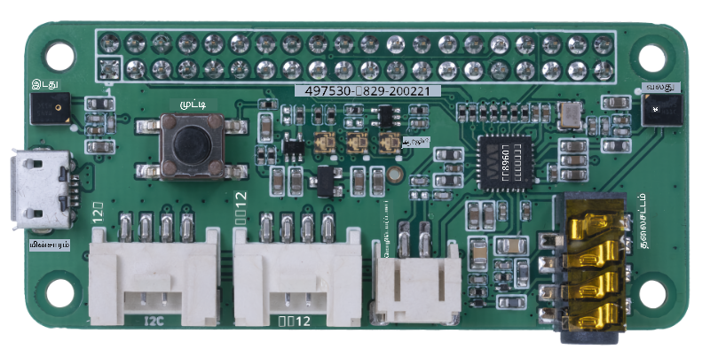
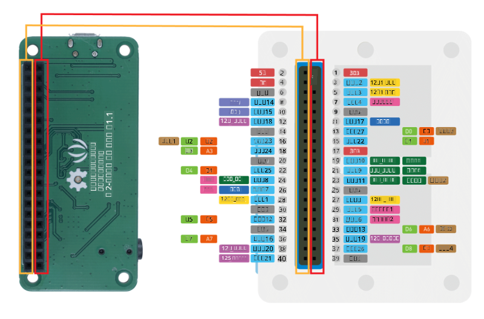
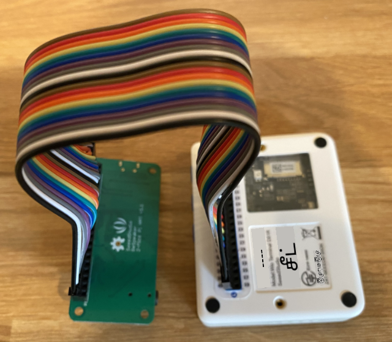
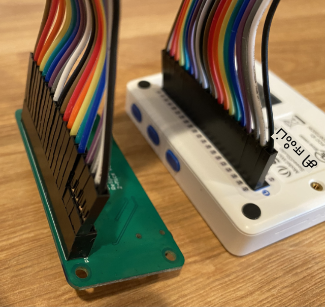
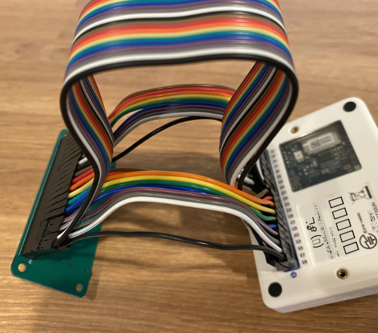
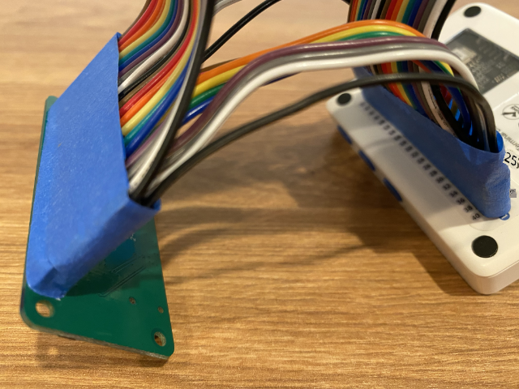
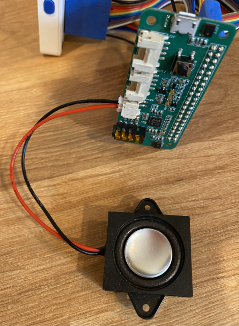
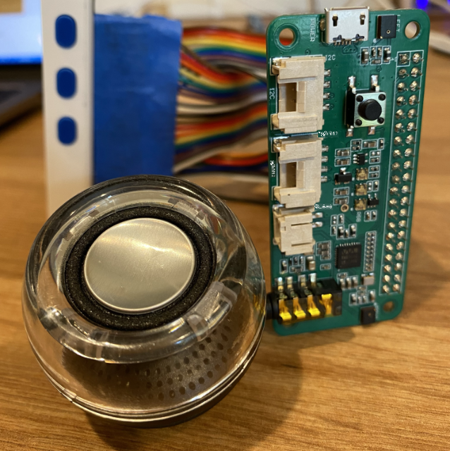

<!--
CO_OP_TRANSLATOR_METADATA:
{
  "original_hash": "93d352de36526b8990e41dd538100324",
  "translation_date": "2025-10-11T12:19:36+00:00",
  "source_file": "6-consumer/lessons/1-speech-recognition/wio-terminal-microphone.md",
  "language_code": "ta"
}
-->
# உங்கள் மைக்ரோஃபோன் மற்றும் ஸ்பீக்கர்களை அமைக்கவும் - Wio Terminal

இந்த பாடத்தின் இந்த பகுதியில், நீங்கள் உங்கள் Wio Terminal-க்கு ஸ்பீக்கர்களை சேர்க்க வேண்டும். Wio Terminal-ல் ஏற்கனவே ஒரு மைக்ரோஃபோன் உள்ளதால், இது பேச்சை பதிவு செய்ய பயன்படுத்தப்படலாம்.

## ஹார்ட்வேர்கள்

Wio Terminal-ல் ஏற்கனவே ஒரு மைக்ரோஃபோன் உள்ளதால், இது பேச்சு அடையாளம் காணும் ஆடியோவை பதிவு செய்ய பயன்படுத்தப்படலாம்.

ஸ்பீக்கரை சேர்க்க, நீங்கள் [ReSpeaker 2-Mics Pi Hat](https://www.seeedstudio.com/ReSpeaker-2-Mics-Pi-HAT.html) பயன்படுத்தலாம். இது 2 MEMS மைக்ரோஃபோன்களையும், ஸ்பீக்கர் இணைப்பையும், ஹெட்போன் சாக்கெட்டையும் கொண்ட ஒரு வெளிப்புற போர்டு.

நீங்கள் ஹெட்போன்கள், 3.5mm ஜாக் கொண்ட ஸ்பீக்கர், அல்லது [Mono Enclosed Speaker - 2W 6 Ohm](https://www.seeedstudio.com/Mono-Enclosed-Speaker-2W-6-Ohm-p-2832.html) போன்ற JST இணைப்புடன் ஸ்பீக்கரை சேர்க்க வேண்டும்.

ReSpeaker 2-Mics Pi Hat-ஐ இணைக்க, 40 பின்-டூ-பின் (அல்லது மேல்-டூ-மேல்) ஜம்பர் கேபிள்கள் தேவைப்படும்.

> 💁 நீங்கள் சால்டரிங் செய்ய வசதியாக இருந்தால், [40 Pin Raspberry Pi Hat Adapter Board For Wio Terminal](https://www.seeedstudio.com/40-Pin-Raspberry-Pi-Hat-Adapter-Board-For-Wio-Terminal-p-4730.html) பயன்படுத்தி ReSpeaker-ஐ இணைக்கலாம்.

ஆடியோ பதிவிறக்கம் மற்றும் பிளேபேக்கிற்காக SD கார்டும் தேவைப்படும். Wio Terminal 16GB வரை SD கார்டுகளை மட்டுமே ஆதரிக்கிறது, மேலும் அவை FAT32 அல்லது exFAT வடிவமைப்பில் இருக்க வேண்டும்.

### பணிகள் - ReSpeaker Pi Hat-ஐ இணைக்க

1. Wio Terminal-ஐ ஆஃப் நிலையில் வைத்துக் கொண்டு, ஜம்பர் கேபிள்கள் மற்றும் Wio Terminal-ன் பின்புறத்தில் உள்ள GPIO சாக்கெட்டுகளைப் பயன்படுத்தி ReSpeaker 2-Mics Pi Hat-ஐ Wio Terminal-க்கு இணைக்கவும்:

    பின்கள் இந்த முறையில் இணைக்கப்பட வேண்டும்:

    

1. GPIO சாக்கெட்டுகள் மேலே நோக்கி இருக்கும் வகையில் ReSpeaker மற்றும் Wio Terminal-ஐ இடமாற்றம் செய்யவும், மேலும் இடது பக்கம் இருக்கும்.

1. ReSpeaker-ன் GPIO சாக்கெட்டின் இடது பக்கம் மேலே இருக்கும் முதல் சாக்கெட்டிலிருந்து தொடங்கவும். ReSpeaker-ன் மேலே இருக்கும் இடது சாக்கெட்டிலிருந்து Wio Terminal-ன் மேலே இருக்கும் இடது சாக்கெட்டுக்கு பின்-டூ-பின் ஜம்பர் கேபிளை இணைக்கவும்.

1. இடது பக்கம் முழுவதும் GPIO சாக்கெட்டுகளை இணைக்கவும். பின்கள் உறுதியாக உள்ளதா என்பதை உறுதிப்படுத்தவும்.

    

    

    > 💁 உங்கள் ஜம்பர் கேபிள்கள் ரிப்பன்களாக இணைக்கப்பட்டிருந்தால், அவற்றை ஒன்றாக வைத்திருங்கள் - இது அனைத்து கேபிள்களையும் சரியான வரிசையில் இணைக்க உதவும்.

1. ReSpeaker மற்றும் Wio Terminal-ன் வலது பக்கம் GPIO சாக்கெட்டுகளைப் பயன்படுத்தி செயல்முறையை மீண்டும் செய்யவும். இந்த கேபிள்கள் ஏற்கனவே உள்ள கேபிள்களின் சுற்றிலும் செல்ல வேண்டும்.

    

    

    > 💁 உங்கள் ஜம்பர் கேபிள்கள் ரிப்பன்களாக இணைக்கப்பட்டிருந்தால், அவற்றை இரண்டு ரிப்பன்களாகப் பிரிக்கவும். ஏற்கனவே உள்ள கேபிள்களின் இரு பக்கங்களிலும் ஒவ்வொன்றைச் செலுத்தவும்.

    > 💁 அனைத்து பின்களையும் இணைக்கும் போது அவை வெளியேறாமல் இருக்க உதவ, பின்களை ஒரு தொகுதியாக ஒட்டுவதற்கு ஸ்டிக்கி டேப் பயன்படுத்தலாம்.
    >
    > 

1. நீங்கள் ஒரு ஸ்பீக்கரை சேர்க்க வேண்டும்.

    * JST கேபிள் கொண்ட ஸ்பீக்கரைப் பயன்படுத்தினால், அதை ReSpeaker-ன் JST போர்டுக்கு இணைக்கவும்.

      

    * 3.5mm ஜாக் கொண்ட ஸ்பீக்கர் அல்லது ஹெட்போன்களைப் பயன்படுத்தினால், அவற்றை 3.5mm ஜாக் சாக்கெட்டில் செருகவும்.

      

### பணிகள் - SD கார்டை அமைக்க

1. உங்கள் கணினியில் SD கார்டை இணைக்கவும், SD கார்டு ஸ்லாட் இல்லாவிட்டால் வெளிப்புற ரீடரைப் பயன்படுத்தவும்.

1. FAT32 அல்லது exFAT கோப்பு அமைப்பைப் பயன்படுத்தி, உங்கள் கணினியில் சரியான கருவியைப் பயன்படுத்தி SD கார்டை வடிவமைக்கவும்.

1. SD கார்டை Wio Terminal-ன் இடது பக்கம், பவர் பொத்தானின் கீழே உள்ள SD கார்டு ஸ்லாட்டில் செருகவும். கார்டு முழுவதும் உள்ளே சென்று கிளிக் செய்ய வேண்டும் - இதைச் செய்ய ஒரு மெல்லிய கருவி அல்லது மற்றொரு SD கார்டு தேவைப்படலாம்.

    

    > 💁 SD கார்டை வெளியேற்ற, அதை சிறிது தள்ளி அழுத்த வேண்டும், பின்னர் அது வெளியேறும். இதைச் செய்ய ஒரு மெல்லிய கருவி, உதாரணமாக ஒரு பிளாட்-ஹெட் ஸ்க்ரூ டிரைவர் அல்லது மற்றொரு SD கார்டு தேவைப்படும்.

---

**அறிவிப்பு**:  
இந்த ஆவணம் [Co-op Translator](https://github.com/Azure/co-op-translator) என்ற AI மொழிபெயர்ப்பு சேவையை பயன்படுத்தி மொழிபெயர்க்கப்பட்டுள்ளது. நாங்கள் துல்லியத்திற்காக முயற்சிக்கிறோம், ஆனால் தானியங்கி மொழிபெயர்ப்புகளில் பிழைகள் அல்லது தவறுகள் இருக்கக்கூடும் என்பதை கவனத்தில் கொள்ளவும். அதன் சொந்த மொழியில் உள்ள மூல ஆவணம் அதிகாரப்பூர்வ ஆதாரமாக கருதப்பட வேண்டும். முக்கியமான தகவல்களுக்கு, தொழில்முறை மனித மொழிபெயர்ப்பு பரிந்துரைக்கப்படுகிறது. இந்த மொழிபெயர்ப்பைப் பயன்படுத்துவதால் ஏற்படும் எந்த தவறான புரிதல்களுக்கும் அல்லது தவறான விளக்கங்களுக்கும் நாங்கள் பொறுப்பல்ல.