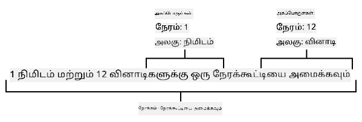
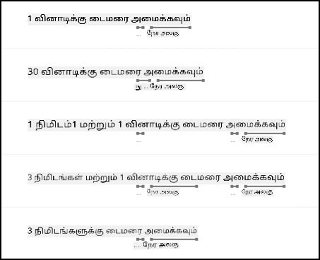

<!--
CO_OP_TRANSLATOR_METADATA:
{
  "original_hash": "6f4ba69d77f16c4a5110623a96a215c3",
  "translation_date": "2025-10-11T12:10:44+00:00",
  "source_file": "6-consumer/lessons/2-language-understanding/README.md",
  "language_code": "ta"
}
-->
# மொழியைப் புரிந்துகொள்


> சித்திரக்குறிப்பு: [நித்யா நரசிம்மன்](https://github.com/nitya). படத்தை கிளிக் செய்து பெரிய பதிப்பைப் பாருங்கள்.

## முன்னோட்ட வினாடி வினா

[முன்னோட்ட வினாடி வினா](https://black-meadow-040d15503.1.azurestaticapps.net/quiz/43)

## அறிமுகம்

கடந்த பாடத்தில் நீங்கள் பேச்சை எழுத்தாக மாற்றினீர்கள். இதை ஒரு புத்திசாலி டைமரை நிரலாக்க பயன்படுத்த, உங்கள் குறியீடு கூறப்பட்டதைப் புரிந்துகொள்ள வேண்டும். பயனர் "3 நிமிட டைமரை அமைக்கவும்" போன்ற ஒரு நிரந்தர வாக்கியத்தைப் பேசுவார் என்று நீங்கள் கருதலாம், மற்றும் அந்த வாக்கியத்தைப் பகுப்பாய்வு செய்து டைமர் எவ்வளவு நேரம் இருக்க வேண்டும் என்பதைப் பெறலாம். ஆனால் இது பயனர் நட்பு முறையாக இருக்காது. ஒரு பயனர் "3 நிமிடங்களுக்கு டைமரை அமைக்கவும்" என்று கூறினால், நீங்கள் அல்லது நான் அவர்கள் என்ன பொருள் கூறுகிறார்கள் என்பதைப் புரிந்துகொள்வோம், ஆனால் உங்கள் குறியீடு புரிந்துகொள்ளாது, அது ஒரு நிரந்தர வாக்கியத்தை எதிர்பார்க்கும்.

இங்கே மொழி புரிதல் உதவுகிறது, AI மாதிரிகளைப் பயன்படுத்தி உரையைப் புரிந்து, தேவையான விவரங்களைத் திரும்பப் பெறுகிறது. உதாரணமாக, "3 நிமிட டைமரை அமைக்கவும்" மற்றும் "3 நிமிடங்களுக்கு டைமரை அமைக்கவும்" ஆகியவற்றை எடுத்துக்கொண்டு, 3 நிமிடங்களுக்கு ஒரு டைமர் தேவை என்று புரிந்துகொள்வது.

இந்த பாடத்தில், நீங்கள் மொழி புரிதல் மாதிரிகள், அவற்றை உருவாக்குவது, பயிற்சி அளிப்பது மற்றும் உங்கள் குறியீட்டில் அவற்றைப் பயன்படுத்துவது பற்றி கற்றுக்கொள்வீர்கள்.

இந்த பாடத்தில் நாம் கவரும் தலைப்புகள்:

* [மொழி புரிதல்](../../../../../6-consumer/lessons/2-language-understanding)
* [மொழி புரிதல் மாதிரியை உருவாக்கவும்](../../../../../6-consumer/lessons/2-language-understanding)
* [நோக்கங்கள் மற்றும் பொருட்கள்](../../../../../6-consumer/lessons/2-language-understanding)
* [மொழி புரிதல் மாதிரியைப் பயன்படுத்தவும்](../../../../../6-consumer/lessons/2-language-understanding)

## மொழி புரிதல்

மனிதர்கள் நூற்றுக்கணக்கான ஆண்டுகளாக மொழியை தொடர்பு கொள்ள பயன்படுத்தி வருகின்றனர். நாம் வார்த்தைகள், ஒலிகள் அல்லது செயல்களைக் கொண்டு தொடர்பு கொள்கிறோம், மற்றும் கூறப்பட்டதைப் புரிந்துகொள்கிறோம், வார்த்தைகள், ஒலிகள் அல்லது செயல்களின் பொருள் மட்டுமல்ல, அவற்றின் சூழலையும். நம் குரலின் சத்தத்தைக் கொண்டு உண்மையையும் கிண்டலையும் புரிந்துகொள்கிறோம், அதே வார்த்தைகள் வேறுபட்ட பொருள் கொண்டிருக்கலாம்.

✅ சமீபத்தில் நீங்கள் மேற்கொண்ட சில உரையாடல்களைப் பற்றி யோசிக்கவும். ஒரு கணினிக்கு அவற்றைச் சூழலால் புரிந்துகொள்வது எவ்வளவு கடினமாக இருக்கும்?

மொழி புரிதல், இயற்கை மொழி புரிதல் என்றும் அழைக்கப்படுகிறது, இது இயற்கை மொழி செயலாக்கம் (NLP) எனப்படும் செயற்கை நுண்ணறிவின் ஒரு பகுதி, மற்றும் வாசிப்பு புரிதலைக் கையாளுகிறது, வார்த்தைகள் அல்லது வாக்கியங்களின் விவரங்களைப் புரிந்துகொள்ள முயற்சிக்கிறது. நீங்கள் Alexa அல்லது Siri போன்ற குரல் உதவியாளர்களைப் பயன்படுத்தினால், நீங்கள் மொழி புரிதல் சேவைகளைப் பயன்படுத்தியுள்ளீர்கள். "Alexa, Taylor Swift இன் சமீபத்திய ஆல்பத்தை வாசிக்கவும்" என்பதைக் கொண்டு என் மகள் தனது விருப்பமான பாடல்களுக்கு நடனமாடுவதை உருவாக்கும் பின்னணி AI சேவைகள் இவை.

> 💁 கணினிகள், அனைத்து முன்னேற்றங்களையும் மீறி, உரையை உண்மையாகப் புரிந்துகொள்ள இன்னும் நீண்ட வழி செல்ல வேண்டும். கணினிகளுடன் மொழி புரிதலைக் குறிப்பிடும்போது, ​​மனித தொடர்பு அளவுக்கு எதுவும் இல்லை, ஆனால் சில வார்த்தைகளை எடுத்து முக்கியமான விவரங்களைப் பெறுவது என்று பொருள்.

மனிதர்களாக, நாம் மொழியை யோசிக்காமல் புரிந்துகொள்கிறோம். நான் மற்றொரு மனிதரிடம் "Taylor Swift இன் சமீபத்திய ஆல்பத்தை வாசிக்கவும்" என்று கேட்டால், அவர்கள் என்ன பொருள் கூறுகிறேன் என்பதை உடனடியாகப் புரிந்துகொள்வார்கள். கணினிக்கு இது கடினம். அது வார்த்தைகளை எடுத்து, பேச்சிலிருந்து எழுத்தாக மாற்றி, பின்வரும் தகவல்களைப் புரிந்துகொள்ள வேண்டும்:

* இசை வாசிக்க வேண்டும்
* இசை Taylor Swift என்ற கலைஞரின்து
* குறிப்பிட்ட இசை பல பாடல்களைக் கொண்ட முழு ஆல்பம்
* Taylor Swift பல ஆல்பங்களை வைத்திருக்கிறார், எனவே அவை காலவரிசைப்படி வரிசைப்படுத்தப்பட வேண்டும், மற்றும் சமீபத்தில் வெளியிடப்பட்டது தேவை

✅ நீங்கள் காபி ஆர்டர் செய்யும்போது அல்லது குடும்ப உறுப்பினரிடம் ஏதாவது கேட்கும்போது பேசிய சில வாக்கியங்களை நினைவில் கொள்ளுங்கள். அந்த வாக்கியத்தைப் புரிந்துகொள்ள கணினி எவ்வாறு தகவல்களைப் பிரிக்க வேண்டும் என்று யோசிக்கவும்.

மொழி புரிதல் மாதிரிகள் AI மாதிரிகள் ஆகும், அவை மொழியில் இருந்து குறிப்பிட்ட விவரங்களைப் பெற பயிற்சி அளிக்கப்படுகின்றன, பின்னர் உங்கள் தேவைகளுக்கு ஏற்ப பயிற்சி அளிக்கப்படுகின்றன. Custom Vision மாதிரியை சில படங்களைக் கொண்டு பயிற்சி அளித்தது போல, நீங்கள் ஒரு மாதிரியை எடுத்து, நீங்கள் புரிந்துகொள்ள விரும்பும் உரையைப் பயன்படுத்தி அதை பயிற்சி அளிக்கலாம்.

## மொழி புரிதல் மாதிரியை உருவாக்கவும்


Microsoft இன் Cognitive Services இன் ஒரு பகுதியாக இருக்கும் LUIS (Language Understanding Intelligent Service) மூலம் மொழி புரிதல் மாதிரிகளை உருவாக்கலாம்.

### பணிகள் - எழுத்தாளர் வளத்தை உருவாக்கவும்

LUIS ஐப் பயன்படுத்த, நீங்கள் ஒரு எழுத்தாளர் வளத்தை உருவாக்க வேண்டும்.

1. உங்கள் `smart-timer` resource group இல் எழுத்தாளர் வளத்தை உருவாக்க பின்வரும் கட்டளையைப் பயன்படுத்தவும்:

    ```python
    az cognitiveservices account create --name smart-timer-luis-authoring \
                                        --resource-group smart-timer \
                                        --kind LUIS.Authoring \
                                        --sku F0 \
                                        --yes \
                                        --location <location>
    ```

    `<location>` ஐ Resource Group உருவாக்கிய இடத்துடன் மாற்றவும்.

    > ⚠️ LUIS அனைத்து பகுதிகளிலும் கிடைக்கவில்லை, எனவே நீங்கள் பின்வரும் பிழையைப் பெறினால்:
    >
    > ```output
    > InvalidApiSetId: The account type 'LUIS.Authoring' is either invalid or unavailable in given region.
    > ```
    >
    > வேறு பகுதியைத் தேர்ந்தெடுக்கவும்.

    இது இலவச-தர LUIS எழுத்தாளர் வளத்தை உருவாக்கும்.

### பணிகள் - மொழி புரிதல் பயன்பாட்டை உருவாக்கவும்

1. உங்கள் உலாவியில் [luis.ai](https://luis.ai?WT.mc_id=academic-17441-jabenn) LUIS போர்ட்டலைத் திறக்கவும், மற்றும் Azure க்காக நீங்கள் பயன்படுத்திய அதே கணக்கில் உள்நுழையவும்.

1. உரையாடல் வழிகாட்டுதலின் படி உங்கள் Azure சந்தாவைத் தேர்ந்தெடுக்கவும், பின்னர் நீங்கள் உருவாக்கிய `smart-timer-luis-authoring` வளத்தைத் தேர்ந்தெடுக்கவும்.

1. *Conversation apps* பட்டியலில் இருந்து **New app** பொத்தானைத் தேர்ந்தெடுத்து புதிய பயன்பாட்டை உருவாக்கவும். புதிய பயன்பாட்டிற்கு `smart-timer` என்று பெயரிடவும், மற்றும் *Culture* ஐ உங்கள் மொழியாக அமைக்கவும்.

    > 💁 ஒரு கணிப்பு வளத்திற்கான புலம் உள்ளது. நீங்கள் கணிப்பிற்காக ஒரு இரண்டாவது வளத்தை உருவாக்கலாம், ஆனால் இலவச எழுத்தாளர் வளம் மாதத்திற்கு 1,000 கணிப்புகளை அனுமதிக்கிறது, இது மேம்பாட்டிற்கு போதுமானதாக இருக்கும், எனவே இதை காலியாக விடலாம்.

1. பயன்பாட்டை உருவாக்கியவுடன் தோன்றும் வழிகாட்டுதலைப் படித்து, மொழி புரிதல் மாதிரியைப் பயிற்சி அளிக்க நீங்கள் எடுக்க வேண்டிய படிகளைப் புரிந்துகொள்ளவும். இந்த வழிகாட்டுதலை முடித்தவுடன் மூடவும்.

## நோக்கங்கள் மற்றும் பொருட்கள்

மொழி புரிதல் *நோக்கங்கள்* மற்றும் *பொருட்கள்* அடிப்படையில் அமைந்துள்ளது. நோக்கங்கள் என்பது வார்த்தைகளின் நோக்கம், உதாரணமாக இசை வாசிக்க, டைமரை அமைக்க, அல்லது உணவை ஆர்டர் செய்ய. பொருட்கள் என்பது அந்த நோக்கம் எதனை குறிக்கிறது, உதாரணமாக ஆல்பம், டைமரின் நீளம், அல்லது உணவின் வகை. மாதிரி புரிந்துகொள்ளும் ஒவ்வொரு வாக்கியத்திலும் குறைந்தது ஒரு நோக்கம், மற்றும் விருப்பமாக ஒரு அல்லது அதற்கு மேற்பட்ட பொருட்கள் இருக்க வேண்டும்.

சில உதாரணங்கள்:

| வாக்கியம்                                            | நோக்கம்           | பொருட்கள்                                   |
| --------------------------------------------------- | ---------------- | ------------------------------------------ |
| "Taylor Swift இன் சமீபத்திய ஆல்பத்தை வாசிக்கவும்"   | *இசை வாசிக்க*     | *Taylor Swift இன் சமீபத்திய ஆல்பம்*         |
| "3 நிமிட டைமரை அமைக்கவும்"                          | *டைமரை அமைக்க*    | *3 நிமிடங்கள்*                              |
| "என் டைமரை ரத்து செய்யவும்"                         | *டைமரை ரத்து செய்ய* | இல்லை                                       |
| "3 பெரிய அன்னாசி பீட்சா மற்றும் ஒரு சீசர் சாலட் ஆர்டர் செய்யவும்" | *உணவு ஆர்டர் செய்ய* | *3 பெரிய அன்னாசி பீட்சா*, *சீசர் சாலட்*     |

✅ நீங்கள் முன்பு யோசித்த வாக்கியங்களில், அந்த வாக்கியத்தின் நோக்கம் மற்றும் பொருட்கள் என்னவாக இருக்கும்?

LUIS ஐப் பயிற்சி அளிக்க, முதலில் பொருட்களை அமைக்க வேண்டும். இவை ஒரு நிரந்தர வார்த்தைகளின் பட்டியலாக இருக்கலாம், அல்லது உரையிலிருந்து கற்றுக்கொள்ளலாம். உதாரணமாக, உங்கள் மெனுவிலிருந்து கிடைக்கும் உணவின் நிரந்தர பட்டியலை வழங்கலாம், ஒவ்வொரு வார்த்தையின் மாறுபாடுகளுடன் (அல்லது ஒத்த பொருள்), உதாரணமாக *egg plant* மற்றும் *aubergine* ஆகியவை *aubergine* இன் மாறுபாடுகள். LUIS இல் எண்கள் மற்றும் இடங்கள் போன்ற முன்பதிவுசெய்யப்பட்ட பொருட்களும் உள்ளன.

டைமரை அமைக்க, நீங்கள் நேரத்திற்கான (நிமிடங்கள் அல்லது விநாடிகள்) முன்பதிவுசெய்யப்பட்ட எண் பொருட்களுக்கான ஒரு பொருள் மற்றும் மற்றொன்றை யூனிட் (நிமிடங்கள் மற்றும் விநாடிகள்) க்கான பொருளாகக் கொண்டிருக்கலாம். ஒவ்வொரு யூனிட்டிற்கும் ஒற்றை மற்றும் பன்மை வடிவங்களை உள்ளடக்க பல மாறுபாடுகள் இருக்கும் - உதாரணமாக நிமிடம் மற்றும் நிமிடங்கள்.

பொருட்களை வரையறுத்த பிறகு, நீங்கள் நோக்கங்களை உருவாக்க வேண்டும். இவை நீங்கள் வழங்கும் உதாரண வாக்கியங்களின் அடிப்படையில் (உரையாடல்கள் என்று அழைக்கப்படும்) மாதிரியால் கற்றுக்கொள்ளப்படும். உதாரணமாக, *set timer* நோக்கத்திற்காக, நீங்கள் பின்வரும் வாக்கியங்களை வழங்கலாம்:

* `1 விநாடி டைமரை அமைக்கவும்`
* `1 நிமிட மற்றும் 12 விநாடிகளுக்கு டைமரை அமைக்கவும்`
* `3 நிமிடங்களுக்கு டைமரை அமைக்கவும்`
* `9 நிமிட 30 விநாடி டைமரை அமைக்கவும்`

பின்னர் LUIS இல் இந்த வாக்கியங்களில் எந்த பகுதிகள் பொருட்களுடன் தொடர்புடையவை என்பதை நீங்கள் குறிப்பிட வேண்டும்:



`1 நிமிட மற்றும் 12 விநாடிகளுக்கு டைமரை அமைக்கவும்` என்ற வாக்கியத்தின் நோக்கம் `set timer`. இது 2 பொருட்களுடன் 2 மதிப்புகளைக் கொண்டுள்ளது:

|            | நேரம் | யூனிட்   |
| ---------- | ---: | ------ |
| 1 நிமிடம்   | 1    | நிமிடம் |
| 12 விநாடிகள் | 12   | விநாடி |

ஒரு நல்ல மாதிரியைப் பயிற்சி அளிக்க, ஒரே விஷயத்தை கேட்க பல்வேறு வழிகளில் யாராவது கேட்கும் பல்வேறு உதாரண வாக்கியங்களை நீங்கள் வழங்க வேண்டும்.

> 💁 எந்த AI மாதிரிக்கும், நீங்கள் பயிற்சி அளிக்க பயன்படுத்தும் தரவின் அளவு மற்றும் துல்லியம் அதிகமாக இருந்தால், மாதிரி சிறந்ததாக இருக்கும்.

✅ நீங்கள் ஒரே விஷயத்தை கேட்க பல்வேறு வழிகளில் யோசிக்கவும், மற்றும் ஒரு மனிதர் அதை புரிந்துகொள்வார் என்று எதிர்பார்க்கவும்.

### பணிகள் - மொழி புரிதல் மாதிரிகளுக்கு பொருட்களைச் சேர்க்கவும்

டைமருக்காக, நீங்கள் 2 பொருட்களைச் சேர்க்க வேண்டும் - ஒன்று நேர யூனிட்டிற்காக (நிமிடங்கள் அல்லது விநாடிகள்), மற்றொன்று நிமிடங்கள் அல்லது விநாடிகளின் எண்ணிக்கைக்காக.

Microsoft Docs இல் உள்ள [Quickstart: Build your app in LUIS portal documentation](https://docs.microsoft.com/azure/cognitive-services/luis/luis-get-started-create-app?WT.mc_id=academic-17441-jabenn) இல் LUIS போர்ட்டலைப் பயன்படுத்துவதற்கான வழிகாட்டுதல்களைப் பார்க்கலாம்.

1. LUIS போர்ட்டிலிருந்து, *Entities* தாவலைத் தேர்ந்தெடுத்து **Add prebuilt entity** பொத்தானைத் தேர்ந்தெடுத்து *number* ஐ பட்டியலில் இருந்து தேர்ந்தெடுத்து *number* முன்பதிவுசெய்யப்பட்ட பொருளைச் சேர்க்கவும்.

1. **Create** பொத்தானை பயன்படுத்தி நேர யூனிட்டிற்கான புதிய பொருளை உருவாக்கவும். பொருளுக்கு `time unit` என்று பெயரிடவும், மற்றும் வகையை *List* ஆக அமைக்கவும். *Normalized values* பட்டியலில் `minute` மற்றும் `second` மதிப்புகளைச் சேர்க்கவும், *synonyms* பட்டியலில் ஒற்றை மற்றும் பன்மை வடிவங்களைச் சேர்க்கவும். ஒவ்வொரு ஒத்த பொருளையும் பட்டியலில் சேர்க்க `return` ஐ அழுத்தவும்.

    | Normalized value | Synonyms        |
    | ---------------- | --------------- |
    | minute           | minute, minutes |
    | second           | second, seconds |

### பணிகள் - மொழி புரிதல் மாதிரிகளுக்கு நோக்கங்களைச் சேர்க்கவும்

1. *Intents* தாவலில் இருந்து **Create** பொத்தானைத் தேர்ந்தெடுத்து புதிய நோக்கத்தை உருவாக்கவும். இந்த நோக்கத்திற்கு `set timer` என்று பெயரிடவும்.

1. உதாரணங்களில், நிமிடங்கள், விநாடிகள் மற்றும் இணைந்த நிமிடங்கள் மற்றும் விநாடிகளைப் பயன்படுத்தி டைமரை அமைக்க பல்வேறு வழிகளை உள்ளிடவும். உதாரணங்கள்:

    * `1 விநாடி டைமரை அமைக்கவும்`
    * `4 நிமிட டைமரை அமைக்கவும்`
    * `நான்கு நிமிட ஆறு விநாடி டைமரை அமைக்கவும்`
    * `9 நிமிட 30 விநாடி டைமரை அமைக்கவும்`
    * `1 நிமிட மற்றும் 12 விநாடிகளுக்கு டைமரை அமைக்கவும்`
    * `3 நிமிடங்களுக்கு டைமரை அமைக்கவும்`
    * `3 நிமிடங்கள் மற்றும் 1 விநாடிக்கு டைமரை அமைக்கவும்`
    * `மூன்று நிமிடங்கள் மற்றும் ஒரு விநாடிக்கு டைமரை அமைக்கவும்`
    * `1 நிமிட மற்றும் 1 விநாடிக்கு டைமரை அமைக்கவும்`
    * `30 விநாடிகளுக்கு டைமரை அமைக்கவும்`
    * `1 விநாடி டைமரை அமைக்கவும்`

    மாதிரி வார்த்தைகளையும் எண்களையும் கையாள கற்றுக்கொள்ளும் வகையில் வார்த்தைகள் மற்றும் எண்களை கலக்கவும்.

1. ஒவ்வொரு உதாரணத்தை உள்ளிடும் போது, LUIS பொருட்களை கண்டறியத் தொடங்கும், மற்றும் கண்டறிந்தவற்றை அடிக்கோடிட்டு லேபிள் செய்யும்.

    

### பணிகள் - மாதிரியைப் பயிற்சி அளிக்கவும் மற்றும் சோதிக்கவும்

1. பொருட்கள் மற்றும் நோக்கங்கள் அமைக்கப்பட்ட பிறகு, மேல் மெனுவில் உள்ள **Train** பொத்தானை பயன்படுத்தி மாதிரியைப் பயிற்சி அளிக்கலாம். இந்த பொத்தானைத் தேர்ந்தெடுக்கவும், மற்றும் மாதிரி சில விநாடிகளில் பயிற்சி அளிக்கப்படும். பயிற்சி அளிக்கும் போது பொத்தான் சாம்பல் நிறமாக இருக்கும், மற்றும் முடிந்தவுடன் மீண்டும் செயல்படுத்தப்படும்.

1. மேல் மெனுவில் உள்ள **Test** பொத்தானைத் தேர்ந்தெடுத்து மொழி புரிதல் மாதிரியைச் சோதிக்கவும். `5 நிமிடங்கள் மற்றும் 4 விநாடிகளுக்கு டைமரை அமைக்கவும்` போன்ற உரையை உள்ளிடவும், மற்றும் return ஐ அழுத்தவும். நீங்கள் உள்ளிட்ட உரை, நீங்கள் உள்ளிட்ட உரை பெட்டியின் கீழ் தோன்றும், மற்றும் அதன் கீழ் *top intent* அல்லது அதிக சாத்தியக்கூறுகளுடன் கண்டறியப்பட்ட நோக்கம் தோன்றும். இது `set timer` ஆக இருக்க வேண்டும். நோக்கத்தின் பெயருக்கு பின்பு, கண்டறியப்பட்ட நோக்கம் சரியானது என்ற சாத்தியக்கூறுகள் இருக்கும்.

1. **Inspect** விருப்பத்தைத் தேர்ந்தெடுத்து முடிவுகளின் விவரக்குறிப்பைப் பாருங்கள். நீங்கள் அதிக சாத்தியக்கூறுகளுடன் உள்ள நோக்கத்தை அதன் சதவீத சாத்தியக்கூறுகளுடன் காண்பீர்கள், மற்றும்
1. நீங்கள் இதை `curl` பயன்படுத்தி சோதிக்கலாம். `curl` கட்டளையை உருவாக்க, மூன்று மதிப்புகள் தேவை - `endpoint`, `application ID` (App ID) மற்றும் API key. இவை மேலே உள்ள **MANAGE** தாவலில் இருந்து அணுகலாம்.

    1. *Settings* பிரிவில் இருந்து App ID ஐ நகலெடுக்கவும்.

    1. *Azure Resources* பிரிவில் இருந்து *Authoring Resource* ஐ தேர்ந்தெடுத்து, *Primary Key* மற்றும் *Endpoint URL* ஐ நகலெடுக்கவும்.

1. கீழே உள்ள `curl` கட்டளையை உங்கள் கட்டளை முறை அல்லது டெர்மினலில் இயக்கவும்:

    ```sh
    curl "<endpoint url>/luis/prediction/v3.0/apps/<app id>/slots/staging/predict" \
          --request GET \
          --get \
          --data "subscription-key=<primary key>" \
          --data "verbose=false" \
          --data "show-all-intents=true" \
          --data-urlencode "query=<sentence>"
    ```

    `<endpoint url>` ஐ *Azure Resources* பிரிவில் இருந்து Endpoint URL மூலம் மாற்றவும்.

    `<app id>` ஐ *Settings* பிரிவில் இருந்து App ID மூலம் மாற்றவும்.

    `<primary key>` ஐ *Azure Resources* பிரிவில் இருந்து Primary Key மூலம் மாற்றவும்.

    `<sentence>` ஐ நீங்கள் சோதிக்க விரும்பும் வாக்கியத்துடன் மாற்றவும்.

1. இந்த அழைப்பின் வெளியீடு JSON ஆவணமாக இருக்கும், இது கேள்வி, முக்கிய intent மற்றும் வகைப்படுத்தப்பட்ட entity-களின் பட்டியலை விவரிக்கும்.

    ```JSON
    {
        "query": "set a timer for 45 minutes and 12 seconds",
        "prediction": {
            "topIntent": "set timer",
            "intents": {
                "set timer": {
                    "score": 0.97031575
                },
                "None": {
                    "score": 0.02205793
                }
            },
            "entities": {
                "number": [
                    45,
                    12
                ],
                "time-unit": [
                    [
                        "minute"
                    ],
                    [
                        "second"
                    ]
                ]
            }
        }
    }
    ```

    மேலே உள்ள JSON `set a timer for 45 minutes and 12 seconds` என்ற கேள்வியிலிருந்து வந்தது:

    * `set timer` 97% சாத்தியத்துடன் முக்கிய intent ஆக இருந்தது.
    * இரண்டு *number* entity-கள் கண்டறியப்பட்டன, `45` மற்றும் `12`.
    * இரண்டு *time-unit* entity-கள் கண்டறியப்பட்டன, `minute` மற்றும் `second`.

## மொழி புரிதல் மாதிரியை பயன்படுத்தவும்

ஒரு முறை வெளியிடப்பட்ட பிறகு, LUIS மாதிரியை கோடில் இருந்து அழைக்கலாம். முந்தைய பாடங்களில், நீங்கள் IoT Hub ஐ பயன்படுத்தி மேக சேவைகளுடன் தொடர்பு கொள்ள, டெலிமெட்ரி அனுப்பவும், கட்டளைகளை கேட்கவும் பயன்படுத்தியுள்ளீர்கள். இது மிகவும் அசிங்க்ரோனஸ் - டெலிமெட்ரி அனுப்பப்பட்ட பிறகு உங்கள் கோடு பதிலை காத்திருக்காது, மேலும் மேக சேவை செயலிழந்தால், நீங்கள் அதை அறிய முடியாது.

ஒரு சாமார்த்தியமான டைமருக்கு, பதிலை உடனடியாக வேண்டும், இதனால் ஒரு டைமர் அமைக்கப்பட்டதாக பயனருக்கு தெரிவிக்கலாம் அல்லது மேக சேவைகள் கிடைக்கவில்லை என்று எச்சரிக்கலாம். இதை செய்ய, IoT சாதனம் நேரடியாக ஒரு வலை `endpoint` ஐ அழைக்கும், IoT Hub ஐ நம்பாமல்.

LUIS ஐ IoT சாதனத்திலிருந்து அழைப்பதற்குப் பதிலாக, HTTP trigger போன்ற வேறொரு வகை trigger உடன் serverless code ஐ பயன்படுத்தலாம். இது உங்கள் function app ஐ REST கோரிக்கைகளை கேட்கவும், அவற்றுக்கு பதிலளிக்கவும் அனுமதிக்கிறது. இந்த function உங்கள் சாதனம் அழைக்கக்கூடிய REST endpoint ஆக இருக்கும்.

> 💁 நீங்கள் உங்கள் IoT சாதனத்திலிருந்து நேரடியாக LUIS ஐ அழைக்கலாம், ஆனால் serverless code போன்ற ஒன்றை பயன்படுத்துவது சிறந்தது. இதனால் நீங்கள் அழைக்கும் LUIS app ஐ மாற்ற விரும்பும்போது, உதாரணமாக நீங்கள் ஒரு சிறந்த மாதிரியை பயிற்சி செய்யும்போது அல்லது வேறொரு மொழியில் ஒரு மாதிரியை பயிற்சி செய்யும்போது, உங்கள் மேக கோடுகளை மட்டுமே புதுப்பிக்க வேண்டும், ஆயிரக்கணக்கான அல்லது கோடிக்கணக்கான IoT சாதனங்களில் கோடுகளை மீண்டும் வெளியிட வேண்டிய அவசியமில்லை.

### பணிகள் - serverless functions app ஐ உருவாக்கவும்

1. `smart-timer-trigger` என்ற Azure Functions app ஐ உருவாக்கி, இதை VS Code இல் திறக்கவும்.

1. இந்த app இல் `speech-trigger` என்ற HTTP trigger ஐ கீழே உள்ள கட்டளையை VS Code டெர்மினலின் உள்ளே இயக்கி சேர்க்கவும்:

    ```sh
    func new --name text-to-timer --template "HTTP trigger"
    ```

    இது `text-to-timer` என்ற HTTP trigger ஐ உருவாக்கும்.

1. Functions app ஐ இயக்கி HTTP trigger ஐ சோதிக்கவும். இது இயக்கப்படும் போது, வெளியீட்டில் `endpoint` பட்டியலிடப்பட்டிருக்கும்:

    ```output
    Functions:
    
            text-to-timer: [GET,POST] http://localhost:7071/api/text-to-timer
    ```

    இதை [http://localhost:7071/api/text-to-timer](http://localhost:7071/api/text-to-timer) URL ஐ உங்கள் உலாவியில் ஏற்றுவதன் மூலம் சோதிக்கவும்.

    ```output
    This HTTP triggered function executed successfully. Pass a name in the query string or in the request body for a personalized response.
    ```

### பணிகள் - மொழி புரிதல் மாதிரியை பயன்படுத்தவும்

1. LUIS க்கான SDK ஒரு Pip package மூலம் கிடைக்கிறது. `requirements.txt` கோப்பில் கீழே உள்ள வரியை சேர்த்து இந்த package க்கான சார்பை சேர்க்கவும்:

    ```sh
    azure-cognitiveservices-language-luis
    ```

1. VS Code டெர்மினலில் virtual environment செயல்படுத்தப்பட்டுள்ளதா என்பதை உறுதிப்படுத்தி, Pip packages ஐ நிறுவ கீழே உள்ள கட்டளையை இயக்கவும்:

    ```sh
    pip install -r requirements.txt
    ```

    > 💁 பிழைகள் ஏற்பட்டால், கீழே உள்ள கட்டளையை பயன்படுத்தி `pip` ஐ மேம்படுத்த வேண்டும்:
    >
    > ```sh
    > pip install --upgrade pip
    > ```

1. உங்கள் LUIS API Key, Endpoint URL மற்றும் App ID ஐ **MANAGE** தாவலின் *Azure Resources* பிரிவில் இருந்து `local.settings.json` கோப்பில் புதிய பதிவுகளைச் சேர்க்கவும்:

    ```JSON
    "LUIS_KEY": "<primary key>",
    "LUIS_ENDPOINT_URL": "<endpoint url>",
    "LUIS_APP_ID": "<app id>"
    ```

    `<endpoint url>` ஐ *Azure Resources* பிரிவில் இருந்து Endpoint URL மூலம் மாற்றவும். இது `https://<location>.api.cognitive.microsoft.com/` ஆக இருக்கும்.

    `<app id>` ஐ *Settings* பிரிவில் இருந்து App ID மூலம் மாற்றவும்.

    `<primary key>` ஐ *Azure Resources* பிரிவில் இருந்து Primary Key மூலம் மாற்றவும்.

1. `__init__.py` கோப்பில் கீழே உள்ள imports ஐ சேர்க்கவும்:

    ```python
    import json
    import os
    from azure.cognitiveservices.language.luis.runtime import LUISRuntimeClient
    from msrest.authentication import CognitiveServicesCredentials
    ```

    இது சில system libraries மற்றும் LUIS உடன் தொடர்பு கொள்ள libraries ஐ இறக்குமதி செய்கிறது.

1. `main` முறை உள்ளடக்கங்களை நீக்கி, கீழே உள்ள கோடுகளைச் சேர்க்கவும்:

    ```python
    luis_key = os.environ['LUIS_KEY']
    endpoint_url = os.environ['LUIS_ENDPOINT_URL']
    app_id = os.environ['LUIS_APP_ID']
    
    credentials = CognitiveServicesCredentials(luis_key)
    client = LUISRuntimeClient(endpoint=endpoint_url, credentials=credentials)
    ```

    இது உங்கள் LUIS app க்கான `local.settings.json` கோப்பில் சேர்க்கப்பட்ட மதிப்புகளை ஏற்றுகிறது, உங்கள் API key உடன் credentials object ஐ உருவாக்குகிறது, பின்னர் உங்கள் LUIS app உடன் தொடர்பு கொள்ள LUIS client object ஐ உருவாக்குகிறது.

1. இந்த HTTP trigger JSON ஆக text ஐ புரிந்துகொள்ள அனுப்பப்படும், `text` என்ற property இல் text உடன். HTTP கோரிக்கையின் body இல் இருந்து மதிப்பை எடுக்கவும், மற்றும் console இல் பதிவு செய்யவும். இந்த கோடுகளை `main` செயல்பாட்டில் சேர்க்கவும்:

    ```python
    req_body = req.get_json()
    text = req_body['text']
    logging.info(f'Request - {text}')
    ```

1. Prediction கோரிக்கைகள் LUIS க்கு அனுப்பப்படுகின்றன - prediction செய்ய text உடன் JSON ஆவணத்தை உருவாக்கவும். இதை கீழே உள்ள கோடுடன் உருவாக்கவும்:

    ```python
    prediction_request = { 'query' : text }
    ```

1. இந்த கோரிக்கையை staging slot ஐ பயன்படுத்தி LUIS க்கு அனுப்பலாம், உங்கள் app வெளியிடப்பட்ட இடம்:

    ```python
    prediction_response = client.prediction.get_slot_prediction(app_id, 'Staging', prediction_request)
    ```

1. Prediction பதில் முக்கிய intent ஐ கொண்டுள்ளது - prediction score அதிகமாக உள்ள intent, entity-களுடன். முக்கிய intent `set timer` என்றால், entity-களைப் படித்து டைமருக்குத் தேவையான நேரத்தைப் பெறலாம்:

    ```python
    if prediction_response.prediction.top_intent == 'set timer':
        numbers = prediction_response.prediction.entities['number']
        time_units = prediction_response.prediction.entities['time unit']
        total_seconds = 0
    ```

    `number` entity-கள் எண்களின் வரிசையாக இருக்கும். உதாரணமாக, நீங்கள் *"Set a four minute 17 second timer."* என்று சொன்னால், `number` வரிசையில் 2 integer-கள் இருக்கும் - 4 மற்றும் 17.

    `time unit` entity-கள் string-களின் வரிசைகளின் வரிசையாக இருக்கும், ஒவ்வொரு நேர அலகும் வரிசையின் உள்ளே ஒரு வரிசையாக இருக்கும். உதாரணமாக, நீங்கள் *"Set a four minute 17 second timer."* என்று சொன்னால், `time unit` வரிசையில் 2 வரிசைகள் ஒவ்வொன்றும் ஒரு மதிப்புடன் இருக்கும் - `['minute']` மற்றும் `['second']`.

    *"Set a four minute 17 second timer."* க்கான entity-களின் JSON பதிப்பு:

    ```json
    {
        "number": [4, 17],
        "time unit": [
            ["minute"],
            ["second"]
        ]
    }
    ```

    இந்த கோடு டைமருக்கான மொத்த நேரத்தை வினாடிகளில் வரையறுக்கிறது. இது entity-களின் மதிப்புகளால் நிரப்பப்படும்.

1. Entity-கள் இணைக்கப்படவில்லை, ஆனால் அவற்றைப் பற்றி சில கருதுகோள்களை உருவாக்கலாம். அவை பேசப்பட்ட வரிசையில் இருக்கும், எனவே வரிசையில் உள்ள நிலை எந்த எண் எந்த நேர அலகுடன் பொருந்துகிறது என்பதை தீர்மானிக்க பயன்படுத்தலாம். உதாரணமாக:

    * *"Set a 30 second timer"* - இது ஒரு எண், `30`, மற்றும் ஒரு நேர அலகு, `second` கொண்டிருக்கும், எனவே ஒற்றை எண் ஒற்றை நேர அலகுடன் பொருந்தும்.
    * *"Set a 2 minute and 30 second timer"* - இது இரண்டு எண்கள், `2` மற்றும் `30`, மற்றும் இரண்டு நேர அலகுகள், `minute` மற்றும் `second` கொண்டிருக்கும், எனவே முதல் எண் முதல் நேர அலகுக்காக (2 minutes), மற்றும் இரண்டாவது எண் இரண்டாவது நேர அலகுக்காக (30 seconds).

    கீழே உள்ள கோடு `number` entity-களின் பொருட்களின் எண்ணிக்கையைப் பெறுகிறது, மற்றும் அதை பயன்படுத்தி ஒவ்வொரு வரிசையிலிருந்து முதல் பொருளை எடுக்கிறது, பின்னர் இரண்டாவது மற்றும் அதேபோல். இதை `if` தொகுதிக்குள் சேர்க்கவும்.

    ```python
    for i in range(0, len(numbers)):
        number = numbers[i]
        time_unit = time_units[i][0]
    ```

    *"Set a four minute 17 second timer."* க்கான, இது இரண்டு முறை மடங்கும், கீழே உள்ள மதிப்புகளை வழங்கும்:

    | மடங்கு எண்ணிக்கை | `number` | `time_unit` |
    | -----------------: | -------: | ----------- |
    | 0                  | 4        | minute      |
    | 1                  | 17       | second      |

1. இந்த மடங்கின் உள்ளே, எண் மற்றும் நேர அலகை பயன்படுத்தி டைமருக்கான மொத்த நேரத்தை கணக்கிடவும், ஒவ்வொரு நிமிடத்திற்கும் 60 வினாடிகளைச் சேர்த்து, எந்த வினாடிகளுக்கும் வினாடிகளின் எண்ணிக்கையைச் சேர்க்கவும்.

    ```python
    if time_unit == 'minute':
        total_seconds += number * 60
    else:
        total_seconds += number
    ```

1. Entity-களின் மடங்கின் வெளியே, டைமருக்கான மொத்த நேரத்தை பதிவு செய்யவும்:

    ```python
    logging.info(f'Timer required for {total_seconds} seconds')
    ```

1. வினாடிகளின் எண்ணிக்கையை HTTP பதிலாக செயல்பாட்டிலிருந்து திருப்ப வேண்டும். `if` தொகுதியின் முடிவில் கீழே உள்ளதைச் சேர்க்கவும்:

    ```python
    payload = {
        'seconds': total_seconds
    }
    return func.HttpResponse(json.dumps(payload), status_code=200)
    ```

    இந்த கோடு டைமருக்கான மொத்த வினாடிகளின் payload ஐ உருவாக்குகிறது, அதை JSON string ஆக மாற்றுகிறது மற்றும் HTTP முடிவாக 200 என்ற நிலை குறியீட்டுடன் திருப்புகிறது, இது அழைப்பு வெற்றிகரமாக இருந்தது என்று பொருள்.

1. இறுதியாக, intent அடையாளம் காணப்படவில்லை என்றால், பிழை குறியீட்டை திருப்ப `if` தொகுதியின் வெளியே கையாளவும்:

    ```python
    return func.HttpResponse(status_code=404)
    ```

    404 என்பது *not found* என்ற நிலை குறியீடு.

1. Functions app ஐ இயக்கி, `curl` பயன்படுத்தி சோதிக்கவும்.

    ```sh
    curl --request POST 'http://localhost:7071/api/text-to-timer' \
         --header 'Content-Type: application/json' \
         --include \
         --data '{"text":"<text>"}'
    ```

    `<text>` ஐ உங்கள் கோரிக்கையின் text உடன் மாற்றவும், உதாரணமாக `set a 2 minutes 27 second timer`.

    Functions app இல் இருந்து கீழே உள்ள வெளியீட்டை நீங்கள் காண்பீர்கள்:

    ```output
    Functions:

            text-to-timer: [GET,POST] http://localhost:7071/api/text-to-timer
    
    For detailed output, run func with --verbose flag.
    [2021-06-26T19:45:14.502Z] Worker process started and initialized.
    [2021-06-26T19:45:19.338Z] Host lock lease acquired by instance ID '000000000000000000000000951CAE4E'.
    [2021-06-26T19:45:52.059Z] Executing 'Functions.text-to-timer' (Reason='This function was programmatically called via the host APIs.', Id=f68bfb90-30e4-47a5-99da-126b66218e81)
    [2021-06-26T19:45:53.577Z] Timer required for 147 seconds
    [2021-06-26T19:45:53.746Z] Executed 'Functions.text-to-timer' (Succeeded, Id=f68bfb90-30e4-47a5-99da-126b66218e81, Duration=1750ms)
    ```

    `curl` அழைப்பு கீழே உள்ளதை திருப்பும்:

    ```output
    HTTP/1.1 200 OK
    Date: Tue, 29 Jun 2021 01:14:11 GMT
    Content-Type: text/plain; charset=utf-8
    Server: Kestrel
    Transfer-Encoding: chunked
    
    {"seconds": 147}
    ```

    டைமருக்கான வினாடிகளின் எண்ணிக்கை `"seconds"` மதிப்பில் இருக்கும்.

> 💁 இந்த கோடுகளை [code/functions](../../../../../6-consumer/lessons/2-language-understanding/code/functions) கோப்புறையில் காணலாம்.

### பணிகள் - உங்கள் IoT சாதனத்திற்கு உங்கள் function ஐ கிடைக்கச் செய்யவும்

1. உங்கள் IoT சாதனம் உங்கள் REST endpoint ஐ அழைக்க, URL ஐ தெரிந்துகொள்ள வேண்டும். நீங்கள் இதை முன்பு அணுகியபோது, `localhost` ஐ பயன்படுத்தினீர்கள், இது உங்கள் உள்ளூர் கணினியில் REST endpoint ஐ அணுக shortcut ஆகும். உங்கள் IoT சாதனத்திற்கு அணுக அனுமதிக்க, நீங்கள் மேகத்தில் வெளியிட வேண்டும் அல்லது உங்கள் IP முகவரியை உள்ளூர் அளவில் அணுக வேண்டும்.

    > ⚠️ நீங்கள் Wio Terminal ஐ பயன்படுத்தினால், function app ஐ உள்ளூர் அளவில் இயக்குவது எளிதாக இருக்கும், ஏனெனில் சில libraries க்கு சார்பு இருக்கும், இதனால் function app ஐ நீங்கள் முன்பு செய்தது போல வெளியிட முடியாது. function app ஐ உள்ளூர் அளவில் இயக்கி, உங்கள் கணினியின் IP முகவரியைப் பயன்படுத்தி அணுகவும். மேகத்தில் வெளியிட விரும்பினால், அதை செய்யும் வழி பற்றிய தகவல் பின்னர் பாடத்தில் வழங்கப்படும்.

    * Functions app ஐ வெளியிடவும் - உங்கள் functions app ஐ மேகத்தில் வெளியிட முந்தைய பாடங்களில் உள்ள வழிமுறைகளைப் பின்பற்றவும். வெளியிடப்பட்ட பிறகு, URL `https://<APP_NAME>.azurewebsites.net/api/text-to-timer` ஆக இருக்கும், இங்கு `<APP_NAME>` உங்கள் functions app இன் பெயராக இருக்கும். உங்கள் உள்ளூர் அமைப்புகளையும் வெளியிட உறுதிப்படுத்தவும்.

      HTTP trigger களைப் பயன்படுத்தும்போது, அவை இயல்பாக function app key மூலம் பாதுகாக்கப்படும். இந்த key ஐ பெற, கீழே உள்ள கட்டளையை இயக்கவும்:

      ```sh
      az functionapp keys list --resource-group smart-timer \
                               --name <APP_NAME>                               
      ```

      `functionKeys` பிரிவில் இருந்து `default` பதிவின் மதிப்பை நகலெடுக்கவும்.

      ```output
      {
        "functionKeys": {
          "default": "sQO1LQaeK9N1qYD6SXeb/TctCmwQEkToLJU6Dw8TthNeUH8VA45hlA=="
        },
        "masterKey": "RSKOAIlyvvQEQt9dfpabJT018scaLpQu9p1poHIMCxx5LYrIQZyQ/g==",
        "systemKeys": {}
      }
      ```

      இந்த key URL க்கு query parameter ஆக சேர்க்க வேண்டும், எனவே இறுதி URL `https://<APP_NAME>.azurewebsites.net/api/text-to-timer?code=<FUNCTION_KEY>` ஆக இருக்கும், இங்கு `<APP_NAME>` உங்கள் functions app இன் பெயராக இருக்கும், மற்றும் `<FUNCTION_KEY>` உங்கள் default function key ஆக இருக்கும்.

      > 💁 HTTP trigger இன் authorization வகையை `function.json` கோப்பில் உள்ள `authlevel` அமைப்பைப் பயன்படுத்தி மாற்றலாம். இதைப் பற்றி மேலும் Microsoft docs இல் உள்ள Azure Functions HTTP trigger ஆவணத்தின் [configuration section](https://docs.microsoft.com/azure/azure-functions/functions-bindings-http-webhook-trigger?WT.mc_id=academic-17441-jabenn&tabs=python#configuration) இல் படிக்கலாம்.

    * Functions app ஐ உள்ளூர் அளவில் இயக்கி, IP முகவரியைப் பயன்படுத்தி அணுகவும் - உங்கள் கணினியின் IP முகவரியை உங்கள் உள்ளூர் நெட்வொர்க்கில் பெறவும், அதை URL ஐ உருவாக்க பயன்படுத்தவும்.

      உங்கள் IP முகவரியை கண்டறியவும்:

      * Windows 10 இல், [find your IP address guide](https://support.microsoft.com/windows/find-your-ip-address-f21a9bbc-c582-55cd-35e0-73431160a1b9?WT.mc_id=academic-17441-jabenn) ஐ பின்பற்றவும்.
      * macOS இல், [how to find you IP address on a Mac guide](https://www.hellotech.com/guide/for/how-to-find-ip-address-on-mac) ஐ பின்பற்றவும்.
      * linux இல், [how to find your IP address in Linux guide](https://opensource.com/article/18/5/how-find-ip-address-linux) இல் உங்கள் private IP address ஐ கண்டறியும் பிரிவை பின்பற்றவும்.

      உங்கள் IP முகவரியைப் பெற்ற பிறகு, function ஐ `http://<IP_ADDRESS>:7071/api/text-to-timer` இல் அணுக முடியும், இங்கு `<IP_ADDRESS>` உங்கள் IP முகவரியாக இருக்கும், உதாரணமாக `http://192.168.1.10:7071/api/text-to-timer`.

      > 💁 இது port 7071 ஐ பயன்படுத்துகிறது, எனவே IP முகவரிக்குப் பிறகு `:7071` இருக்க வேண்டும்.
> 💁 இது உங்கள் IoT சாதனம் உங்கள் கணினியுடன் ஒரே நெட்வொர்க்கில் இருந்தால் மட்டுமே வேலை செய்யும்.

1. curl பயன்படுத்தி endpoint ஐ சோதிக்கவும்.

---

## 🚀 சவால்

ஒரே விஷயத்தை கேட்க பல வழிகள் உள்ளன, உதாரணமாக ஒரு டைமரை அமைத்தல். இதை செய்ய பல்வேறு வழிகளை யோசிக்கவும், மற்றும் அவற்றை உங்கள் LUIS பயன்பாட்டில் உதாரணங்களாக பயன்படுத்தவும். உங்கள் மாதிரி பல்வேறு வழிகளில் டைமரை கேட்கும் திறனை எவ்வளவு நன்றாக கையாள முடிகிறது என்பதை சோதிக்கவும்.

## பாடத்திற்குப் பிந்தைய வினாடி வினா

[பாடத்திற்குப் பிந்தைய வினாடி வினா](https://black-meadow-040d15503.1.azurestaticapps.net/quiz/44)

## மதிப்பீடு & சுயபடிப்பு

* LUIS மற்றும் அதன் திறன்கள் பற்றிய மேலும் அறிய [Microsoft docs இல் உள்ள Language Understanding (LUIS) ஆவணப்பக்கத்தில்](https://docs.microsoft.com/azure/cognitive-services/luis/?WT.mc_id=academic-17441-jabenn) படிக்கவும்.
* மொழி புரிதல் பற்றிய மேலும் அறிய [Wikipedia இல் உள்ள natural-language understanding பக்கத்தில்](https://wikipedia.org/wiki/Natural-language_understanding) படிக்கவும்.
* HTTP triggers பற்றிய மேலும் அறிய [Microsoft docs இல் உள்ள Azure Functions HTTP trigger ஆவணப்பக்கத்தில்](https://docs.microsoft.com/azure/azure-functions/functions-bindings-http-webhook-trigger?WT.mc_id=academic-17441-jabenn&tabs=python) படிக்கவும்.

## பணிக்கான ஒதுக்கீடு

[டைமரை ரத்து செய்யவும்](assignment.md)

---

**குறிப்பு**:  
இந்த ஆவணம் [Co-op Translator](https://github.com/Azure/co-op-translator) என்ற AI மொழிபெயர்ப்பு சேவையை பயன்படுத்தி மொழிபெயர்க்கப்பட்டுள்ளது. எங்கள் நோக்கம் துல்லியமாக இருக்க வேண்டும் என்பதுதான், ஆனால் தானியங்கி மொழிபெயர்ப்புகளில் பிழைகள் அல்லது துல்லியமின்மைகள் இருக்கக்கூடும் என்பதை தயவுசெய்து கவனத்தில் கொள்ளவும். அதன் தாய்மொழியில் உள்ள மூல ஆவணம் அதிகாரப்பூர்வ ஆதாரமாக கருதப்பட வேண்டும். முக்கியமான தகவல்களுக்கு, தொழில்முறை மனித மொழிபெயர்ப்பு பரிந்துரைக்கப்படுகிறது. இந்த மொழிபெயர்ப்பைப் பயன்படுத்துவதால் ஏற்படும் எந்த தவறான புரிதல்கள் அல்லது தவறான விளக்கங்களுக்கு நாங்கள் பொறுப்பல்ல.