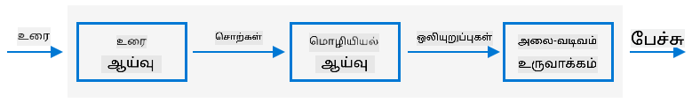

<!--
CO_OP_TRANSLATOR_METADATA:
{
  "original_hash": "b73fe10ec6b580fba2affb6f6e0a5c4d",
  "translation_date": "2025-10-11T12:08:03+00:00",
  "source_file": "6-consumer/lessons/3-spoken-feedback/README.md",
  "language_code": "ta"
}
-->
# டைமரை அமைத்து பேசும் கருத்துகளை வழங்குங்கள்


> ஸ்கெட்ச்நோட்: [நித்யா நரசிம்மன்](https://github.com/nitya). படத்தை கிளிக் செய்து பெரிய பதிப்பைப் பாருங்கள்.

## முன்னோட்ட கேள்வி

[முன்னோட்ட கேள்வி](https://black-meadow-040d15503.1.azurestaticapps.net/quiz/45)

## அறிமுகம்

ஸ்மார்ட் உதவியாளர்கள் ஒரு வழி தொடர்பு சாதனங்கள் அல்ல. நீங்கள் அவர்களிடம் பேசுகிறீர்கள், அவர்கள் பதிலளிக்கிறார்கள்:

"அலெக்ஸா, 3 நிமிட டைமரை அமைக்கவும்"

"சரி, உங்கள் டைமர் 3 நிமிடங்களுக்கு அமைக்கப்பட்டது"

கடந்த 2 பாடங்களில், நீங்கள் பேச்சை எடுத்து உரையாக மாற்றுவது மற்றும் அந்த உரையிலிருந்து டைமரை அமைக்க வேண்டிய கோரிக்கையை எடுப்பது எப்படி என்பதை கற்றுக்கொண்டீர்கள். இந்த பாடத்தில், IoT சாதனத்தில் டைமரை அமைக்கவும், பயனருக்கு அவர்களின் டைமர் உறுதிப்படுத்தப்பட்டதாக பேசும் வார்த்தைகளுடன் பதிலளிக்கவும், டைமர் முடிந்ததும் அவர்களை எச்சரிக்கவும் எப்படி செய்வது என்பதை நீங்கள் கற்றுக்கொள்வீர்கள்.

இந்த பாடத்தில் நாம் கவரும் தலைப்புகள்:

* [உரை முதல் பேச்சு](../../../../../6-consumer/lessons/3-spoken-feedback)
* [டைமரை அமைக்கவும்](../../../../../6-consumer/lessons/3-spoken-feedback)
* [உரை முதல் பேச்சு மாற்றம்](../../../../../6-consumer/lessons/3-spoken-feedback)

## உரை முதல் பேச்சு

உரை முதல் பேச்சு என்பது, பெயர் சொல்வதுபோல், உரையை ஆடியோவாக மாற்றி, அந்த உரையை பேசும் வார்த்தைகளாக கொண்டிருக்கும் செயல்முறையாகும். அடிப்படை கொள்கை, உரையில் உள்ள வார்த்தைகளை அதன் ஒலிகளாக (phonemes என அழைக்கப்படும்) பிரித்து, முன்பே பதிவு செய்யப்பட்ட ஆடியோ அல்லது AI மாடல்களால் உருவாக்கப்பட்ட ஆடியோவுடன் இணைக்க வேண்டும்.



உரை முதல் பேச்சு அமைப்புகள் பொதுவாக 3 நிலைகளைக் கொண்டுள்ளன:

* உரை பகுப்பாய்வு
* மொழியியல் பகுப்பாய்வு
* அலை வடிவ உருவாக்கம்

### உரை பகுப்பாய்வு

உரை பகுப்பாய்வு என்பது வழங்கப்பட்ட உரையை எடுத்து, பேச்சு உருவாக்க பயன்படும் வார்த்தைகளாக மாற்றுவது. உதாரணமாக, "Hello world" என்பதை மாற்றினால், உரை பகுப்பாய்வு தேவையில்லை, இரண்டு வார்த்தைகளும் நேரடியாக பேச்சாக மாற்றப்படலாம். ஆனால் "1234" என்றால், இது "ஒரு ஆயிரம், இரண்டு நூறு முப்பத்து நான்கு" அல்லது "ஒன்று, இரண்டு, மூன்று, நான்கு" என மாற்றப்பட வேண்டும், சூழலுக்கு ஏற்ப. "I have 1234 apples" என்றால் "ஒரு ஆயிரம், இரண்டு நூறு முப்பத்து நான்கு" ஆகும், ஆனால் "The child counted 1234" என்றால் "ஒன்று, இரண்டு, மூன்று, நான்கு" ஆகும்.

வார்த்தைகள் மொழி மட்டுமல்ல, அந்த மொழியின் இடத்திற்கும் மாறுபடுகின்றன. உதாரணமாக, அமெரிக்க ஆங்கிலத்தில் 120 "One hundred twenty" ஆகும், ஆனால் பிரிட்டிஷ் ஆங்கிலத்தில் "One hundred and twenty" ஆகும், "and" பயன்படுத்தப்படுகிறது.

✅ சில மற்ற உதாரணங்கள்: "in" என்பது inch (அளவீடு) குறிக்கவும், "st" என்பது saint அல்லது street குறிக்கவும் பயன்படுத்தப்படும். உங்கள் மொழியில் சூழலின்றி தெளிவில்லாத வார்த்தைகளின் உதாரணங்களை யோசிக்கவும்.

வார்த்தைகள் வரையறுக்கப்பட்டதும், அவை மொழியியல் பகுப்பாய்வுக்கு அனுப்பப்படும்.

### மொழியியல் பகுப்பாய்வு

மொழியியல் பகுப்பாய்வு வார்த்தைகளை phonemes ஆக பிரிக்கிறது. Phonemes என்பது எழுத்துக்களின் அடிப்படையில் மட்டுமல்ல, வார்த்தையில் உள்ள மற்ற எழுத்துக்களின் அடிப்படையிலும் அமைகிறது. உதாரணமாக, ஆங்கிலத்தில் 'car' மற்றும் 'care' என்ற வார்த்தைகளில் 'a' ஒலி வேறுபடுகிறது. ஆங்கில மொழியில் 26 எழுத்துக்களுக்கு 44 phonemes உள்ளன, சில phonemes பல எழுத்துக்களால் பகிரப்படுகிறது, உதாரணமாக 'circle' மற்றும் 'serpent' ஆகியவற்றின் தொடக்க ஒலி ஒரே phoneme ஆகும்.

✅ ஆராய்ச்சி செய்யுங்கள்: உங்கள் மொழிக்கான phonemes என்ன?

Phonemes உருவாக்கப்பட்டதும், அவற்றுக்கு intonation போன்ற கூடுதல் தகவல்கள் தேவைப்படும், சூழலுக்கு ஏற்ப tone அல்லது duration மாற்றம் செய்ய. உதாரணமாக, ஆங்கிலத்தில் pitch உயர்த்துவது ஒரு வாக்கியத்தை கேள்வியாக மாற்ற உதவுகிறது, இறுதியில் pitch உயர்த்துவது கேள்வியை குறிக்கிறது.

உதாரணமாக - "You have an apple" என்பது ஒரு வாக்கியம். ஆனால் "You have an apple?" என்று pitch உயர்த்தினால், இது கேள்வியாக மாறுகிறது. மொழியியல் பகுப்பாய்வு கேள்விக்குறி அடிப்படையில் pitch உயர்த்த முடிவு செய்ய வேண்டும்.

Phonemes உருவாக்கப்பட்டதும், அவை wave-form உருவாக்கத்துக்கு அனுப்பப்படும்.

### அலை வடிவ உருவாக்கம்

முதல் மின்னணு உரை முதல் பேச்சு அமைப்புகள் ஒவ்வொரு phoneme க்கும் தனித்தனியான ஆடியோ பதிவுகளை பயன்படுத்தியது, இது மிகவும் monotone, ரோபோடிக் ஒலிகளாக இருந்தது. மொழியியல் பகுப்பாய்வு phonemes உருவாக்கும், அவை sounds database இல் இருந்து ஏற்றப்பட்டு, ஆடியோ உருவாக்க இணைக்கப்படும்.

✅ ஆராய்ச்சி செய்யுங்கள்: பழைய பேச்சு உருவாக்க அமைப்புகளின் ஆடியோ பதிவுகளை கண்டறியுங்கள். ஸ்மார்ட் உதவியாளர்களில் பயன்படுத்தப்படும் நவீன பேச்சு உருவாக்கத்துடன் ஒப்பிடுங்கள்.

நவீன wave-form உருவாக்கம் ML மாடல்களை பயன்படுத்துகிறது, இது deep learning (மிகப் பெரிய நரம்பு வலையமைப்புகள்) மூலம் இயற்கையான ஒலிகளை உருவாக்குகிறது, மனிதர்களைப் போலவே ஒலிக்கிறது.

> 💁 இந்த ML மாடல்கள் transfer learning மூலம் உண்மையான மனிதர்களைப் போல ஒலிக்க re-train செய்யப்படலாம். இதனால், வொய்ஸ் பாதுகாப்பு முறையாக பயன்படுத்துவது நல்ல யோசனை அல்ல, ஏனெனில் உங்கள் குரலின் சில நிமிட பதிவுகளை வைத்துக் கொண்டு யாரும் உங்களை போல நடிக்க முடியும்.

இந்த பெரிய ML மாடல்கள் மூன்று நிலைகளையும் ஒருங்கிணைத்து end-to-end பேச்சு synthesizers ஆக பயிற்சி பெறுகின்றன.

## டைமரை அமைக்கவும்

டைமரை அமைக்க, உங்கள் IoT சாதனம் serverless code மூலம் உருவாக்கிய REST endpoint ஐ அழைக்க வேண்டும், பின்னர் பெறப்பட்ட விநாடிகளின் எண்ணிக்கையை பயன்படுத்தி டைமரை அமைக்க வேண்டும்.

### பணிகள் - serverless function ஐ அழைத்து டைமர் நேரத்தை பெறுங்கள்

உங்கள் IoT சாதனத்திலிருந்து REST endpoint ஐ அழைத்து தேவையான நேரத்திற்கு டைமரை அமைக்க தொடர்புடைய வழிகாட்டுதலைப் பின்பற்றவும்:

* [Arduino - Wio Terminal](wio-terminal-set-timer.md)
* [Single-board computer - Raspberry Pi/Virtual IoT device](single-board-computer-set-timer.md)

## உரை முதல் பேச்சு மாற்றம்

உங்கள் IoT சாதனத்தில் உள்ள speaker மூலம் பேச்சு சேவையை பயன்படுத்தி உரையை மீண்டும் பேச்சாக மாற்றலாம். உரையை மாற்றுவதற்கான கோரிக்கை பேச்சு சேவைக்கு அனுப்பப்படும், அதனுடன் தேவையான ஆடியோ வகை (உதாரணமாக sample rate) மற்றும் binary data கொண்ட ஆடியோ திரும்ப பெறப்படும்.

இந்த கோரிக்கையை அனுப்பும்போது, *Speech Synthesis Markup Language* (SSML) பயன்படுத்தப்படுகிறது, இது பேச்சு synthesizer பயன்பாடுகளுக்கான XML அடிப்படையிலான markup language ஆகும். இது உரையை மட்டுமல்ல, உரையின் மொழி, பயன்படுத்த வேண்டிய குரல், மற்றும் சில அல்லது அனைத்து வார்த்தைகளுக்கான வேகம், ஒலி, pitch ஆகியவற்றை வரையறுக்கவும் பயன்படுத்தப்படுகிறது.

உதாரணமாக, இந்த SSML "Your 3 minute 5 second time has been set" உரையை British English குரல் `en-GB-MiaNeural` பயன்படுத்தி பேச்சாக மாற்ற கோரிக்கையை வரையறுக்கிறது:

```xml
<speak version='1.0' xml:lang='en-GB'>
    <voice xml:lang='en-GB' name='en-GB-MiaNeural'>
        Your 3 minute 5 second time has been set
    </voice>
</speak>
```

> 💁 பெரும்பாலான உரை முதல் பேச்சு அமைப்புகளில் பல மொழிகளுக்கான பல குரல்கள் உள்ளன, தொடர்புடைய accents உடன், உதாரணமாக British English குரல் English accent உடன் மற்றும் New Zealand English குரல் New Zealand accent உடன்.

### பணிகள் - உரையை பேச்சாக மாற்றுங்கள்

உங்கள் IoT சாதனத்தைப் பயன்படுத்தி உரையை பேச்சாக மாற்ற தொடர்புடைய வழிகாட்டுதலைப் பின்பற்றவும்:

* [Arduino - Wio Terminal](wio-terminal-text-to-speech.md)
* [Single-board computer - Raspberry Pi](pi-text-to-speech.md)
* [Single-board computer - Virtual device](virtual-device-text-to-speech.md)

---

## 🚀 சவால்

SSML வார்த்தைகள் பேசப்படும் விதத்தை மாற்ற வழிகள் கொண்டுள்ளது, குறிப்பாக சில வார்த்தைகளுக்கு முக்கியத்துவம் சேர்க்க, இடைவெளிகளை சேர்க்க, அல்லது pitch மாற்ற. உங்கள் IoT சாதனத்திலிருந்து SSML அனுப்பி output ஐ ஒப்பிட்டு பாருங்கள். SSML மற்றும் வார்த்தைகள் பேசப்படும் விதத்தை மாற்றுவது பற்றிய மேலும் தகவலுக்கு [World Wide Web consortium இன் Speech Synthesis Markup Language (SSML) Version 1.1 specification](https://www.w3.org/TR/speech-synthesis11/) ஐப் படிக்கவும்.

## பாடத்திற்குப் பின் கேள்வி

[பாடத்திற்குப் பின் கேள்வி](https://black-meadow-040d15503.1.azurestaticapps.net/quiz/46)

## மதிப்பீடு & சுயபயிற்சி

* [Wikipedia இல் உள்ள speech synthesis பக்கம்](https://wikipedia.org/wiki/Speech_synthesis) பற்றி மேலும் படிக்கவும்
* [BBC news இல் உள்ள fake voices 'help cyber crooks steal cash' கதை](https://www.bbc.com/news/technology-48908736) மூலம் குற்றவாளிகள் பேச்சு synthesizer ஐ பயன்படுத்தி பணம் திருடுவது பற்றிய தகவல்களை படிக்கவும்
* [Vice இல் உள்ள this TikTok lawsuit is highlighting how AI is screwing over voice actors கட்டுரை](https://www.vice.com/en/article/z3xqwj/this-tiktok-lawsuit-is-highlighting-how-ai-is-screwing-over-voice-actors) மூலம் synthesized குரல்களால் voice actors க்கு ஏற்படும் அபாயங்களைப் பற்றி மேலும் அறிக.

## பணிகள்

[டைமரை ரத்து செய்யுங்கள்](assignment.md)

---

**குறிப்பு**:  
இந்த ஆவணம் [Co-op Translator](https://github.com/Azure/co-op-translator) என்ற AI மொழிபெயர்ப்பு சேவையைப் பயன்படுத்தி மொழிபெயர்க்கப்பட்டுள்ளது. நாங்கள் துல்லியத்திற்காக முயற்சிக்கின்றோம், ஆனால் தானியங்கி மொழிபெயர்ப்புகளில் பிழைகள் அல்லது தவறான தகவல்கள் இருக்கக்கூடும் என்பதை கவனத்தில் கொள்ளவும். அதன் தாய்மொழியில் உள்ள மூல ஆவணம் அதிகாரப்பூர்வ ஆதாரமாக கருதப்பட வேண்டும். முக்கியமான தகவல்களுக்கு, தொழில்முறை மனித மொழிபெயர்ப்பு பரிந்துரைக்கப்படுகிறது. இந்த மொழிபெயர்ப்பைப் பயன்படுத்துவதால் ஏற்படும் எந்த தவறான புரிதல்கள் அல்லது தவறான விளக்கங்களுக்கு நாங்கள் பொறுப்பல்ல.