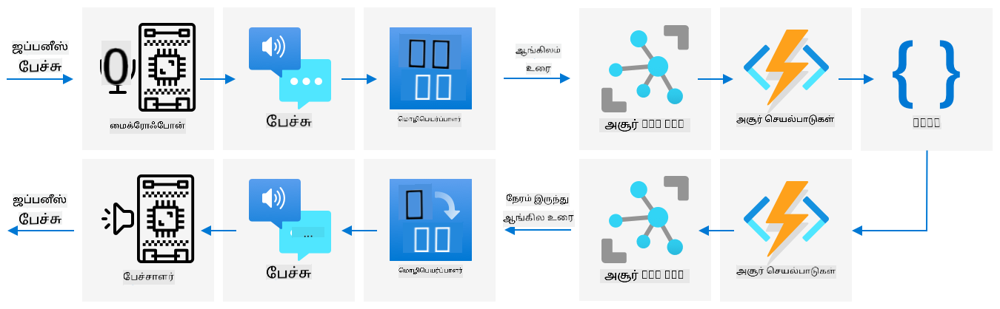

<!--
CO_OP_TRANSLATOR_METADATA:
{
  "original_hash": "c16de27b0074abe81d6a8bad5e5b1a6b",
  "translation_date": "2025-10-11T12:14:54+00:00",
  "source_file": "6-consumer/lessons/4-multiple-language-support/README.md",
  "language_code": "ta"
}
-->
# பல மொழிகளை ஆதரிக்கவும்


> ஸ்கெட்ச் நோட்: [நித்யா நரசிம்மன்](https://github.com/nitya). பெரிய பதிப்பை பார்க்க படத்தை கிளிக் செய்யவும்.

இந்த வீடியோ, Azure பேச்சு சேவைகளின் மேல் ஒரு பார்வையை வழங்குகிறது. முந்தைய பாடங்களில் உள்ள பேச்சை எழுத்தாகவும், எழுத்தை பேச்சாகவும் மாற்றுவது பற்றியும், இந்த பாடத்தில் உள்ள பேச்சு மொழிபெயர்ப்பு பற்றியும் விவரிக்கிறது:

[](https://www.youtube.com/watch?v=h6xbpMPSGEA)

> 🎥 வீடியோவை பார்க்க மேலே உள்ள படத்தை கிளிக் செய்யவும்

## பாடத்திற்கு முன் வினாடி வினா

[பாடத்திற்கு முன் வினாடி வினா](https://black-meadow-040d15503.1.azurestaticapps.net/quiz/47)

## அறிமுகம்

கடந்த 3 பாடங்களில், நீங்கள் பேச்சை எழுத்தாக மாற்றுவது, மொழி புரிதல், மற்றும் எழுத்தை பேச்சாக மாற்றுவது ஆகியவற்றைப் பற்றி கற்றுக்கொண்டீர்கள், இவை அனைத்தும் செயற்கை நுண்ணறிவால் இயக்கப்படுகின்றன. மனித தொடர்பின் மற்றொரு முக்கிய பகுதி மொழி மொழிபெயர்ப்பு ஆகும் - இது ஒரு மொழியிலிருந்து மற்றொரு மொழிக்கு மாற்றம் செய்ய உதவுகிறது, உதாரணமாக ஆங்கிலத்திலிருந்து பிரெஞ்சுக்குத் தானியங்கி மொழிபெயர்ப்பு.

இந்த பாடத்தில், உங்கள் ஸ்மார்ட் டைமர் பல மொழிகளில் பயனர்களுடன் தொடர்பு கொள்ள செயற்கை நுண்ணறிவு மூலம் எழுத்துகளை மொழிபெயர்க்க கற்றுக்கொள்வீர்கள்.

இந்த பாடத்தில் நாம் கற்றுக்கொள்ளப்போகிறோம்:

* [எழுத்துகளை மொழிபெயர்க்கவும்](../../../../../6-consumer/lessons/4-multiple-language-support)
* [மொழிபெயர்ப்பு சேவைகள்](../../../../../6-consumer/lessons/4-multiple-language-support)
* [மொழிபெயர்ப்பாளர் வளத்தை உருவாக்கவும்](../../../../../6-consumer/lessons/4-multiple-language-support)
* [மொழிபெயர்ப்புகளுடன் பயன்பாடுகளில் பல மொழிகளை ஆதரிக்கவும்](../../../../../6-consumer/lessons/4-multiple-language-support)
* [செயற்கை நுண்ணறிவு சேவையைப் பயன்படுத்தி எழுத்துகளை மொழிபெயர்க்கவும்](../../../../../6-consumer/lessons/4-multiple-language-support)

> 🗑 இந்த திட்டத்தின் கடைசி பாடம் இது, எனவே இந்த பாடத்தையும் பணியையும் முடித்த பிறகு, உங்கள் கிளவுட் சேவைகளை சுத்தம் செய்ய மறக்காதீர்கள். பணியை முடிக்க சேவைகள் தேவைப்படும், எனவே முதலில் அதை முடிக்க உறுதிசெய்யவும்.
>
> [உங்கள் திட்டத்தை சுத்தம் செய்யும் வழிகாட்டி](../../../clean-up.md) தேவைப்பட்டால் அதற்கான வழிமுறைகளைப் பார்க்கவும்.

## எழுத்துகளை மொழிபெயர்க்கவும்

எழுத்து மொழிபெயர்ப்பு என்பது கடந்த 70 ஆண்டுகளுக்கும் மேலாக ஆராயப்பட்ட கணினி அறிவியல் பிரச்சினையாகும், மற்றும் தற்போது செயற்கை நுண்ணறிவு மற்றும் கணினி சக்தியின் முன்னேற்றங்களின் காரணமாக, இது மனித மொழிபெயர்ப்பாளர்களுக்கு நிகராக தீர்க்கப்பட்ட நிலைக்கு அருகில் உள்ளது.

> 💁 இதன் தோற்றத்தை 9ஆம் நூற்றாண்டின் அரபு குறியீட்டாளர் [அல்-கிந்தி](https://wikipedia.org/wiki/Al-Kindi) வரைத் திரும்பி காணலாம், அவர் மொழி மொழிபெயர்ப்புக்கான நுட்பங்களை உருவாக்கினார்.

### இயந்திர மொழிபெயர்ப்புகள்

எழுத்து மொழிபெயர்ப்பு முதலில் இயந்திர மொழிபெயர்ப்பு (Machine Translation - MT) எனப்படும் தொழில்நுட்பமாக தொடங்கியது, இது வெவ்வேறு மொழி ஜோடிகளுக்கு இடையே மொழிபெயர்க்க முடியும். MT ஒரு மொழியில் உள்ள சொற்களை மற்றொரு மொழியில் மாற்றுவதன் மூலம் செயல்படுகிறது, எளிய சொல்-மாற்றம் பொருள் தராதபோது சொற்றொடர்கள் அல்லது வாக்கியங்களின் பகுதிகளை மொழிபெயர்க்க சரியான வழிகளைத் தேர்ந்தெடுக்க சில நுட்பங்களைச் சேர்க்கிறது.

> 🎓 மொழிபெயர்ப்பாளர்கள் ஒரு மொழியிலிருந்து மற்றொரு மொழிக்கு மொழிபெயர்க்கும் திறனை ஆதரிக்கும்போது, அவை *மொழி ஜோடிகள்* என அழைக்கப்படுகின்றன. வெவ்வேறு கருவிகள் வெவ்வேறு மொழி ஜோடிகளை ஆதரிக்கின்றன, மேலும் அவை முழுமையாக இருக்காது. உதாரணமாக, ஒரு மொழிபெயர்ப்பாளர் ஆங்கிலத்திலிருந்து ஸ்பானிஷ் மற்றும் ஸ்பானிஷ் முதல் இத்தாலியன் வரை மொழிபெயர்ப்பை ஆதரிக்கலாம், ஆனால் ஆங்கிலத்திலிருந்து இத்தாலியன் வரை மொழிபெயர்ப்பை ஆதரிக்காது.

உதாரணமாக, ஆங்கிலத்தில் "Hello world" என்பதை பிரெஞ்சுக்குத் மொழிபெயர்க்கும்போது, "Hello" என்பதற்குப் பதிலாக "Bonjour" மற்றும் "world" என்பதற்குப் பதிலாக "le monde" என மாற்றி, "Bonjour le monde" என சரியான மொழிபெயர்ப்பை பெறலாம்.

சொல் மாற்றங்கள் வேலை செய்யாத இடங்களில், வெவ்வேறு மொழிகள் ஒரே விஷயத்தைச் சொல்ல வெவ்வேறு வழிகளைப் பயன்படுத்தும். உதாரணமாக, ஆங்கில வாக்கியம் "My name is Jim" பிரெஞ்சில் "Je m'appelle Jim" என மொழிபெயர்க்கப்படுகிறது - இது "நான் என்னை ஜிம் என்று அழைக்கிறேன்" என்று பொருள். 

> 💁 சில சொற்கள் ஒருபோதும் மொழிபெயர்க்கப்படுவதில்லை - என் பெயர் ஜிம் என்றால், நான் என்ன மொழியில் அறிமுகப்படுத்தினாலும் அது ஜிம் என்றே இருக்கும். 

மொழிபெயர்ப்பு இயந்திரங்கள், குறிப்பிட்ட சொற்றொடர்கள் மற்றும் பழமொழிகளை மொழிபெயர்க்கும் விதங்களை விவரிக்கும் விதிமுறைகளின் பெரிய தரவுத்தொகுப்புகளின் மீது நம்பிக்கையுடன் செயல்படுகின்றன. 

### நரம்பியல் மொழிபெயர்ப்புகள்

நரம்பியல் மொழிபெயர்ப்புகள், செயற்கை நுண்ணறிவின் சக்தியைப் பயன்படுத்தி மொழிபெயர்க்கின்றன, பொதுவாக ஒரு மாதிரியைப் பயன்படுத்தி முழு வாக்கியங்களை மொழிபெயர்க்கின்றன. 

நரம்பியல் மொழிபெயர்ப்பு மாதிரிகள், சொற்றொடர்கள் மற்றும் பழமொழிகளின் பெரிய தரவுத்தொகுப்புகளை தேவைப்படுத்தாததால், இயந்திர மொழிபெயர்ப்பு மாதிரிகளைவிட சிறியதாக இருக்கும். 

✅ [Bing Translate](https://www.bing.com/translator), [Google Translate](https://translate.google.com), அல்லது Apple translate போன்ற ஆன்லைன் மொழிபெயர்ப்பாளர்களை முயற்சிக்கவும். 

## மொழிபெயர்ப்பு சேவைகள்

உங்கள் பயன்பாடுகளில் இருந்து பேச்சு மற்றும் எழுத்துகளை மொழிபெயர்க்க பல செயற்கை நுண்ணறிவு சேவைகள் உள்ளன.

### காக்னிடிவ் சேவைகள் பேச்சு சேவை


கடந்த சில பாடங்களில் நீங்கள் பயன்படுத்திய பேச்சு சேவைக்கு பேச்சு அடையாளம் காணும் மொழிபெயர்ப்பு திறன்கள் உள்ளன. 

> 💁 இது பேச்சு SDK-ல் மட்டுமே கிடைக்கிறது, REST API-க்கு மொழிபெயர்ப்புகள் உள்ளடக்கமாக இல்லை.

### காக்னிடிவ் சேவைகள் மொழிபெயர்ப்பாளர் சேவை


மொழிபெயர்ப்பாளர் சேவை என்பது ஒரு தனிப்பட்ட மொழிபெயர்ப்பு சேவையாகும், இது ஒரு மொழியிலிருந்து மற்றொரு அல்லது பல இலக்கு மொழிகளுக்கு எழுத்துகளை மொழிபெயர்க்க முடியும். 

## மொழிபெயர்ப்பாளர் வளத்தை உருவாக்கவும்

இந்த பாடத்திற்காக, உங்களுக்கு ஒரு மொழிபெயர்ப்பாளர் வளம் தேவைப்படும். 

### பணிகள் - மொழிபெயர்ப்பாளர் வளத்தை உருவாக்கவும்

1. உங்கள் டெர்மினல் அல்லது கமாண்ட் ப்ராம்ப்டிலிருந்து, கீழே உள்ள கட்டளையை இயக்கி உங்கள் `smart-timer` வளக் குழுவில் ஒரு மொழிபெயர்ப்பாளர் வளத்தை உருவாக்கவும்.

    ```sh
    az cognitiveservices account create --name smart-timer-translator \
                                        --resource-group smart-timer \
                                        --kind TextTranslation \
                                        --sku F0 \
                                        --yes \
                                        --location <location>
    ```

    `<location>` ஐ நீங்கள் Resource Group உருவாக்கிய இடத்துடன் மாற்றவும்.

1. மொழிபெயர்ப்பாளர் சேவைக்கான விசையைப் பெறவும்:

    ```sh
    az cognitiveservices account keys list --name smart-timer-translator \
                                           --resource-group smart-timer \
                                           --output table
    ```

    விசைகளில் ஒன்றை நகலெடுக்கவும்.

## மொழிபெயர்ப்புகளுடன் பயன்பாடுகளில் பல மொழிகளை ஆதரிக்கவும்

உங்கள் முழு பயன்பாடு பல்வேறு மொழிகளைப் புரிந்துகொள்ள வேண்டும். 



உங்கள் ஸ்மார்ட் டைமர் ஆங்கிலத்தில் இருந்து ஜப்பானிய மொழிக்கு மொழிபெயர்க்கும் திறனை விரைவாகச் சேர்க்க முடியும். 

> 💁 இயந்திர மொழிபெயர்ப்பின் குறைபாடு என்னவென்றால், வெவ்வேறு மொழிகள் மற்றும் கலாச்சாரங்கள் ஒரே விஷயத்தைச் சொல்ல வெவ்வேறு வழிகளைப் பயன்படுத்துகின்றன.

✅ சில ஆராய்ச்சிகளைச் செய்யவும்: எந்த மொழிபெயர்ப்பு IoT சாதனங்கள் வணிக ரீதியாக கிடைக்கின்றன? 

> 👽 உண்மையான யுனிவர்சல் மொழிபெயர்ப்பாளர்கள் இல்லாவிட்டாலும், [Microsoft Translator கிலிங்கான் மொழியை ஆதரிக்கிறது](https://www.microsoft.com/translator/blog/2013/05/14/announcing-klingon-for-bing-translator/?WT.mc_id=academic-17441-jabenn). Qapla’!

## செயற்கை நுண்ணறிவு சேவையைப் பயன்படுத்தி எழுத்துகளை மொழிபெயர்க்கவும்

இந்த மொழிபெயர்ப்பு திறனை உங்கள் ஸ்மார்ட் டைமருக்கு சேர்க்க ஒரு செயற்கை நுண்ணறிவு சேவையைப் பயன்படுத்தலாம்.

### பணிகள் - செயற்கை நுண்ணறிவு சேவையைப் பயன்படுத்தி எழுத்துகளை மொழிபெயர்க்கவும்

உங்கள் IoT சாதனத்தில் எழுத்துகளை மொழிபெயர்க்க தொடர்புடைய வழிகாட்டியைப் பின்பற்றவும்:

* [Arduino - Wio Terminal](wio-terminal-translate-speech.md)
* [Single-board computer - Raspberry Pi](pi-translate-speech.md)
* [Single-board computer - Virtual device](virtual-device-translate-speech.md)

---

## 🚀 சவால்

ஸ்மார்ட் சாதனங்களைத் தவிர, மற்ற IoT பயன்பாடுகளுக்கு இயந்திர மொழிபெயர்ப்புகள் எப்படி பயனளிக்க முடியும்? 

## பாடத்திற்குப் பிந்தைய வினாடி வினா

[பாடத்திற்குப் பிந்தைய வினாடி வினா](https://black-meadow-040d15503.1.azurestaticapps.net/quiz/48)

## மதிப்பீடு & சுயபயிற்சி

* [விக்கிபீடியாவில் உள்ள இயந்திர மொழிபெயர்ப்பு பக்கம்](https://wikipedia.org/wiki/Machine_translation) பற்றி மேலும் படிக்கவும்.
* [விக்கிபீடியாவில் உள்ள நரம்பியல் மொழிபெயர்ப்பு பக்கம்](https://wikipedia.org/wiki/Neural_machine_translation) பற்றி மேலும் படிக்கவும்.
* Microsoft பேச்சு சேவைகளுக்கான ஆதரிக்கப்படும் மொழிகளின் பட்டியலை [Microsoft Docs-ல்](https://docs.microsoft.com/azure/cognitive-services/speech-service/language-support?WT.mc_id=academic-17441-jabenn) பார்க்கவும்.

## பணிக்குறிப்பு

[ஒரு யுனிவர்சல் மொழிபெயர்ப்பாளரை உருவாக்கவும்](assignment.md)

---

**குறிப்பு**:  
இந்த ஆவணம் [Co-op Translator](https://github.com/Azure/co-op-translator) என்ற AI மொழிபெயர்ப்பு சேவையைப் பயன்படுத்தி மொழிபெயர்க்கப்பட்டுள்ளது. நாங்கள் துல்லியத்திற்காக முயற்சிக்கின்றோம், ஆனால் தானியக்க மொழிபெயர்ப்புகளில் பிழைகள் அல்லது தவறான தகவல்கள் இருக்கக்கூடும் என்பதை தயவுசெய்து கவனத்தில் கொள்ளுங்கள். அதன் தாய்மொழியில் உள்ள மூல ஆவணம் அதிகாரப்பூர்வ ஆதாரமாக கருதப்பட வேண்டும். முக்கியமான தகவல்களுக்கு, தொழில்முறை மனித மொழிபெயர்ப்பு பரிந்துரைக்கப்படுகிறது. இந்த மொழிபெயர்ப்பைப் பயன்படுத்துவதால் ஏற்படும் எந்தவொரு தவறான புரிதல்கள் அல்லது தவறான விளக்கங்களுக்கு நாங்கள் பொறுப்பல்ல.