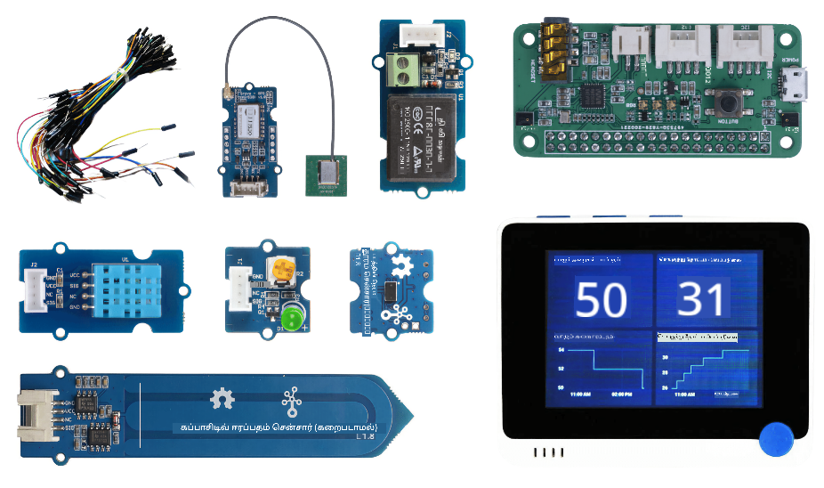
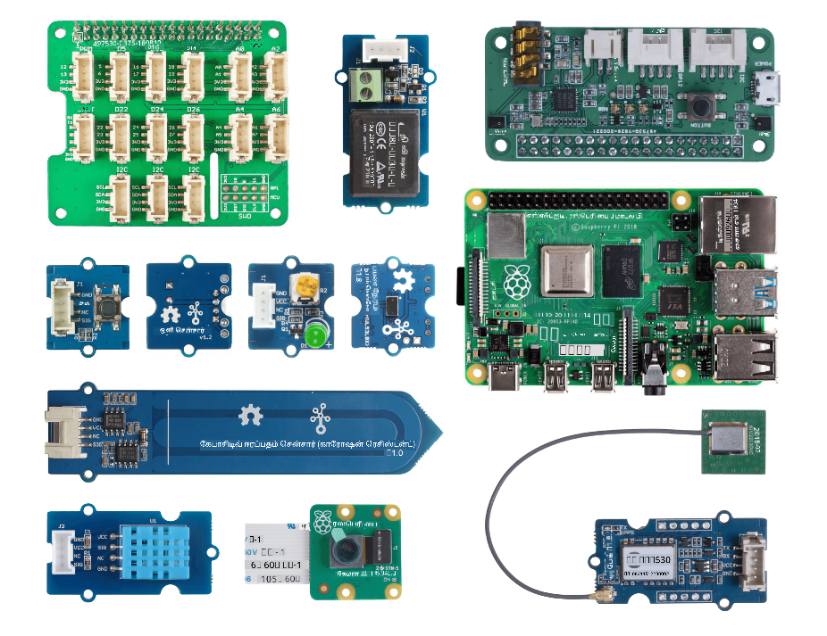

<!--
CO_OP_TRANSLATOR_METADATA:
{
  "original_hash": "3dce18fab38adf93ff30b8c221b1eec5",
  "translation_date": "2025-10-11T11:16:39+00:00",
  "source_file": "hardware.md",
  "language_code": "ta"
}
-->
# ஹார்ட்வேர்கள்

IoT இல் **T** என்பது **வஸ்துக்கள்** என்பதைக் குறிக்கிறது, இது நம்மைச் சுற்றியுள்ள உலகத்துடன் தொடர்பு கொள்ளும் சாதனங்களை குறிக்கிறது. ஒவ்வொரு திட்டமும் மாணவர்கள் மற்றும் பொழுதுபோக்கு ஆர்வலர்களுக்கு கிடைக்கும் உண்மையான உலக ஹார்ட்வேர்களை அடிப்படையாகக் கொண்டது. நாங்கள் IoT ஹார்ட்வேரை பயன்படுத்த இரண்டு தேர்வுகளை வழங்குகிறோம், இது தனிப்பட்ட விருப்பம், நிரலாக்க மொழி அறிவு அல்லது விருப்பங்கள், கற்றல் இலக்குகள் மற்றும் கிடைக்கும் தன்மை ஆகியவற்றின் அடிப்படையில் இருக்கும். ஹார்ட்வேரை அணுக முடியாதவர்கள் அல்லது வாங்குவதற்கு முன் மேலும் அறிய விரும்புகிறவர்கள் ஆகியோருக்காக 'மெய்நிகர் ஹார்ட்வேர' பதிப்பையும் வழங்கியுள்ளோம்.

> 💁 நீங்கள் பணிகளை முடிக்க எந்த IoT ஹார்ட்வேரையும் வாங்க வேண்டிய அவசியமில்லை. நீங்கள் எல்லாவற்றையும் மெய்நிகர் IoT ஹார்ட்வேரைப் பயன்படுத்தி செய்யலாம்.

உண்மையான ஹார்ட்வேர தேர்வுகள் Arduino அல்லது Raspberry Pi ஆகும். ஒவ்வொரு தளத்திற்கும் அதன் சொந்த நன்மைகள் மற்றும் குறைகள் உள்ளன, மேலும் இவை ஆரம்ப பாடங்களில் ஒன்றில் விரிவாகக் கூறப்பட்டுள்ளன. நீங்கள் இன்னும் எந்த ஹார்ட்வேர தளத்தை தேர்ந்தெடுக்கவில்லை என்றால், [முதல் திட்டத்தின் இரண்டாவது பாடத்தை](./1-getting-started/lessons/2-deeper-dive/README.md) பார்வையிட்டு, நீங்கள் கற்றல் ஆர்வம் கொண்டுள்ள ஹார்ட்வேர தளத்தைத் தேர்ந்தெடுக்கலாம்.

குறிப்பிட்ட ஹார்ட்வேரம் பாடங்கள் மற்றும் பணிகளின் சிக்கல்களை குறைக்க தேர்ந்தெடுக்கப்பட்டது. மற்ற ஹார்ட்வேரங்கள் வேலை செய்யக்கூடும், ஆனால் கூடுதல் ஹார்ட்வேர இல்லாமல் உங்கள் சாதனத்தில் அனைத்து பணிகளும் ஆதரிக்கப்படும் என்று நாங்கள் உறுதியாகக் கூற முடியாது. உதாரணமாக, பல Arduino சாதனங்களில் WiFi இல்லை, இது மேகத்துடன் இணைவதற்கு தேவை - Wio terminal WiFi உடன் உள்ளதால் தேர்ந்தெடுக்கப்பட்டது.

நீங்கள் சில தொழில்நுட்பமற்ற பொருட்களையும் தேவைப்படும், உதாரணமாக மண் அல்லது ஒரு செடி, மற்றும் பழங்கள் அல்லது காய்கறிகள்.

## கிட்களை வாங்கவும்

Seeed Studios மிகவும் அன்புடன் அனைத்து ஹார்ட்வேரங்களையும் எளிதில் வாங்கக்கூடிய கிட்களாகக் கொடுத்துள்ளது:

### Arduino - Wio Terminal

**[Seeed மற்றும் Microsoft உடன் தொடக்கநிலை IoT - Wio Terminal Starter Kit](https://www.seeedstudio.com/IoT-for-beginners-with-Seeed-and-Microsoft-Wio-Terminal-Starter-Kit-p-5006.html)**

### Raspberry Pi

**[Seeed மற்றும் Microsoft உடன் தொடக்கநிலை IoT - Raspberry Pi 4 Starter Kit](https://www.seeedstudio.com/IoT-for-beginners-with-Seeed-and-Microsoft-Raspberry-Pi-Starter-Kit-p-5004.html)**

## Arduino

Arduino க்கான அனைத்து சாதன குறியீடுகளும் C++ இல் உள்ளது. அனைத்து பணிகளையும் முடிக்க நீங்கள் பின்வருவன தேவைப்படும்:

### Arduino ஹார்ட்வேர

* [Wio Terminal](https://www.seeedstudio.com/Wio-Terminal-p-4509.html)
* *விருப்பம்* - USB-C கேபிள் அல்லது USB-A to USB-C அடாப்டர். Wio terminal இல் USB-C போர்ட் உள்ளது மற்றும் USB-C to USB-A கேபிள் உடன் வருகிறது. உங்கள் PC அல்லது Mac இல் USB-C போர்ட்கள் மட்டுமே இருந்தால், நீங்கள் USB-C கேபிள் அல்லது USB-A to USB-C அடாப்டர் தேவைப்படும்.

### Arduino குறிப்பிட்ட சென்சார்கள் மற்றும் செயல்படுத்திகள்

இவை Wio terminal Arduino சாதனத்தைப் பயன்படுத்துவதற்கானவை, Raspberry Pi ஐப் பயன்படுத்துவதற்கு பொருத்தமற்றவை.

* [ArduCam Mini 2MP Plus - OV2640](https://www.arducam.com/product/arducam-2mp-spi-camera-b0067-arduino/)
* [ReSpeaker 2-Mics Pi HAT](https://www.seeedstudio.com/ReSpeaker-2-Mics-Pi-HAT.html)
* [Breadboard Jumper Wires](https://www.seeedstudio.com/Breadboard-Jumper-Wire-Pack-241mm-200mm-160mm-117m-p-234.html)
* 3.5mm ஜாக் கொண்ட ஹெட்போன்கள் அல்லது மற்ற ஸ்பீக்கர், அல்லது JST ஸ்பீக்கர் போன்றவை:
  * [Mono Enclosed Speaker - 2W 6 Ohm](https://www.seeedstudio.com/Mono-Enclosed-Speaker-2W-6-Ohm-p-2832.html)
* 16GB அல்லது அதற்கு குறைவான microSD கார்டு, உங்கள் கணினியுடன் SD கார்டை பயன்படுத்த இணைப்பி இல்லாவிட்டால், ஒரு இணைப்பி தேவைப்படும். **குறிப்பு** - Wio Terminal 16GB வரை SD கார்டுகளை மட்டுமே ஆதரிக்கிறது, அதிக திறன் கொண்டவை ஆதரிக்கப்படாது.

## Raspberry Pi

Raspberry Pi க்கான அனைத்து சாதன குறியீடுகளும் Python இல் உள்ளது. அனைத்து பணிகளையும் முடிக்க நீங்கள் பின்வருவன தேவைப்படும்:

### Raspberry Pi ஹார்ட்வேர

* [Raspberry Pi](https://www.raspberrypi.org/products/raspberry-pi-4-model-b/)
  > 💁 Pi 2B மற்றும் அதற்கு மேல் உள்ள பதிப்புகள் இந்த பாடங்களில் உள்ள பணிகளுடன் வேலை செய்ய வேண்டும். நீங்கள் VS Code ஐ Pi இல் நேரடியாக இயக்க திட்டமிட்டால், 2GB அல்லது அதற்கு மேல் RAM கொண்ட Pi 4 தேவைப்படும். நீங்கள் Pi ஐ தொலைதூரமாக அணுக திட்டமிட்டால், Pi 2B மற்றும் அதற்கு மேல் உள்ள எந்த பதிப்பும் வேலை செய்யும்.
* microSD கார்டு (Raspberry Pi கிட்களில் microSD கார்டு உடன் கிடைக்கலாம்), உங்கள் கணினியுடன் SD கார்டை பயன்படுத்த இணைப்பி இல்லாவிட்டால், ஒரு இணைப்பி தேவைப்படும்.
* USB பவர் சப்ளை (Raspberry Pi 4 கிட்களில் பவர் சப்ளை உடன் கிடைக்கலாம்). நீங்கள் Raspberry Pi 4 ஐப் பயன்படுத்தினால் USB-C பவர் சப்ளை தேவைப்படும், முந்தைய சாதனங்களுக்கு micro-USB பவர் சப்ளை தேவைப்படும்.

### Raspberry Pi குறிப்பிட்ட சென்சார்கள் மற்றும் செயல்படுத்திகள்

இவை Raspberry Pi ஐப் பயன்படுத்துவதற்கானவை, Arduino சாதனத்தைப் பயன்படுத்துவதற்கு பொருத்தமற்றவை.

* [Grove Pi base hat](https://www.seeedstudio.com/Grove-Base-Hat-for-Raspberry-Pi.html)
* [Raspberry Pi Camera module](https://www.raspberrypi.org/products/camera-module-v2/)
* மைக்ரோஃபோன் மற்றும் ஸ்பீக்கர்:

  பின்வருவனவற்றில் ஒன்றை (அல்லது அதற்கு இணையானவை) பயன்படுத்தவும்:
  * USB மைக்ரோஃபோன் மற்றும் USB ஸ்பீக்கர், அல்லது 3.5mm ஜாக் கேபிள் கொண்ட ஸ்பீக்கர், அல்லது HDMI ஆடியோ அவுட்புட் பயன்படுத்தவும், உங்கள் Raspberry Pi ஒரு மானிட்டர் அல்லது TV உடன் இணைக்கப்பட்டிருந்தால்.
  * மைக்ரோஃபோன் கொண்ட USB ஹெட்செட்
  * [ReSpeaker 2-Mics Pi HAT](https://www.seeedstudio.com/ReSpeaker-2-Mics-Pi-HAT.html) உடன்
    * 3.5mm ஜாக் கொண்ட ஹெட்போன்கள் அல்லது மற்ற ஸ்பீக்கர், அல்லது JST ஸ்பீக்கர் போன்றவை:
    * [Mono Enclosed Speaker - 2W 6 Ohm](https://www.seeedstudio.com/Mono-Enclosed-Speaker-2W-6-Ohm-p-2832.html)
  * [USB Speakerphone](https://www.amazon.com/USB-Speakerphone-Conference-Business-Microphones/dp/B07Q3D7F8S/ref=sr_1_1?dchild=1&keywords=m0&qid=1614647389&sr=8-1)
* [Grove Light sensor](https://www.seeedstudio.com/Grove-Light-Sensor-v1-2-LS06-S-phototransistor.html)
* [Grove button](https://www.seeedstudio.com/Grove-Button.html)

## சென்சார்கள் மற்றும் செயல்படுத்திகள்

அதிகபட்சமாக தேவைப்படும் சென்சார்கள் மற்றும் செயல்படுத்திகள் Arduino மற்றும் Raspberry Pi கற்றல் பாதைகளில் பயன்படுத்தப்படுகின்றன:

* [Grove LED](https://www.seeedstudio.com/Grove-LED-Pack-p-4364.html) x 2
* [Grove ஈரப்பதம் மற்றும் வெப்பநிலை சென்சார்](https://www.seeedstudio.com/Grove-Temperature-Humidity-Sensor-DHT11.html)
* [Grove மண் ஈரத்தன்மை சென்சார்](https://www.seeedstudio.com/Grove-Capacitive-Moisture-Sensor-Corrosion-Resistant.html)
* [Grove ரிலே](https://www.seeedstudio.com/Grove-Relay.html)
* [Grove GPS (Air530)](https://www.seeedstudio.com/Grove-GPS-Air530-p-4584.html)
* [Grove Time of flight Distance Sensor](https://www.seeedstudio.com/Grove-Time-of-Flight-Distance-Sensor-VL53L0X.html)

## விருப்பமான ஹார்ட்வேர

தானியங்கி நீர்ப்பாசனத்தைப் பற்றிய பாடங்கள் ரிலேவைப் பயன்படுத்தி வேலை செய்கின்றன. விருப்பமாக, நீங்கள் USB மூலம் இயக்கப்படும் நீர்ப்பம்பை கீழே உள்ள ஹார்ட்வேரத்தைப் பயன்படுத்தி இந்த ரிலேவுடன் இணைக்கலாம்.

* [6V நீர்ப்பம்ப்](https://www.seeedstudio.com/6V-Mini-Water-Pump-p-1945.html)
* [USB terminal](https://www.adafruit.com/product/3628)
* சிலிகான் குழாய்கள்
* சிவப்பு மற்றும் கருப்பு கம்பிகள்
* சிறிய பிளாட்-ஹெட் ஸ்க்ரூ டிரைவர்

## மெய்நிகர் ஹார்ட்வேர

மெய்நிகர் ஹார்ட்வேர வழி Python இல் செயல்படுத்தப்பட்ட சென்சார்கள் மற்றும் செயல்படுத்திகளுக்கான சிமுலேட்டர்களை வழங்கும். உங்கள் ஹார்ட்வேர கிடைக்கும் தன்மையின் அடிப்படையில், நீங்கள் உங்கள் சாதாரண மேம்பாட்டு சாதனத்தில், உதாரணமாக Mac, PC, அல்லது Raspberry Pi இல் இதை இயக்கலாம் மற்றும் உங்களிடம் இல்லாத ஹார்ட்வேரத்தை மட்டுமே சிமுலேட் செய்யலாம். உதாரணமாக, உங்கள் Raspberry Pi காமரா இருந்தால் ஆனால் Grove சென்சார்கள் இல்லாவிட்டால், நீங்கள் உங்கள் Pi இல் மெய்நிகர் சாதன குறியீட்டை இயக்கி Grove சென்சார்களை சிமுலேட் செய்யலாம், ஆனால் உண்மையான காமராவைப் பயன்படுத்தலாம்.

மெய்நிகர் ஹார்ட்வேரம் [CounterFit project](https://github.com/CounterFit-IoT/CounterFit) ஐப் பயன்படுத்தும்.

இந்த பாடங்களை முடிக்க, உங்களிடம் ஒரு வெப் கேம், மைக்ரோஃபோன் மற்றும் ஆடியோ அவுட்புட், உதாரணமாக ஸ்பீக்கர்கள் அல்லது ஹெட்போன்கள் தேவைப்படும். இவை உள்ளமைக்கப்பட்ட அல்லது வெளிப்புறமாக இருக்கலாம், மற்றும் உங்கள் இயக்க முறைமையுடன் வேலை செய்யவும் மற்றும் அனைத்து பயன்பாடுகளிலும் பயன்படுத்த தயாராக இருக்க வேண்டும்.

---

**குறிப்பு**:  
இந்த ஆவணம் [Co-op Translator](https://github.com/Azure/co-op-translator) என்ற AI மொழிபெயர்ப்பு சேவையைப் பயன்படுத்தி மொழிபெயர்க்கப்பட்டுள்ளது. நாங்கள் துல்லியத்திற்காக முயற்சிக்கின்றோம், ஆனால் தானியங்கி மொழிபெயர்ப்புகளில் பிழைகள் அல்லது தவறான தகவல்கள் இருக்கக்கூடும் என்பதை கவனத்தில் கொள்ளவும். அதன் தாய்மொழியில் உள்ள மூல ஆவணம் அதிகாரப்பூர்வ ஆதாரமாக கருதப்பட வேண்டும். முக்கியமான தகவல்களுக்கு, தொழில்முறை மனித மொழிபெயர்ப்பு பரிந்துரைக்கப்படுகிறது. இந்த மொழிபெயர்ப்பைப் பயன்படுத்துவதால் ஏற்படும் எந்த தவறான புரிதல்கள் அல்லது தவறான விளக்கங்களுக்கு நாங்கள் பொறுப்பல்ல.