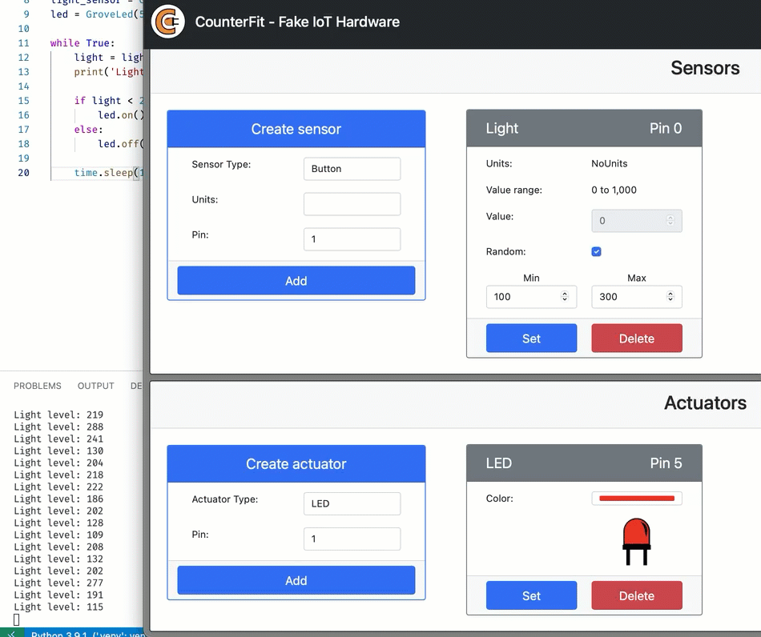

<!--
CO_OP_TRANSLATOR_METADATA:
{
  "original_hash": "9c640f93263fd9adbfda920739e09feb",
  "translation_date": "2026-01-07T02:08:38+00:00",
  "source_file": "1-getting-started/lessons/3-sensors-and-actuators/virtual-device-actuator.md",
  "language_code": "te"
}
-->
# రాత్రి లైట్ తయారు చేయండి - వర్చువల్ IoT హార్డ్‌వేర్

ఈ భాగంలో, మీరు మీ వర్చువల్ IoT డివైస్‌కు ఒక LED ని జోడించి దానిని రాత్రి లైట్‌గా ఉపయోగిస్తారు.

## వర్చువల్ హార్డ్‌వేర్

రాత్రి లైట్‌కు కౌంటర్‌ఫిట్ యాప్‌లో సృష్టించిన ఒక actuator అవసరం.

actuator అనేది **LED**. భౌతిక IoT డివైస్‌లో, ఇది కరెంట్ ప్రయాణించినప్పుడు వెలుగును ఉత్పత్తి చేసే [లైట్-ఎమిట్టింగ్ డయోడ్](https://wikipedia.org/wiki/Light-emitting_diode) అవుతుంది. ఇది ఒక డిజిటల్ actuator, దీని 2 స్థితులు ఉంటాయి: ఆన్ మరియు ఆఫ్. 1 విలువను పంపితే LED ఆన్ అవుతుంది, 0 అయితే ఆఫ్ అవుతుంది.

రాత్రి లైట్ లాజిక్ సూటి కోడ్‌లో:

```output
Check the light level.
If the light is less than 300
    Turn the LED on
Otherwise
    Turn the LED off
```

### కౌంటర్‌ఫిట్‌లో actuator ను జోడించండి

వర్చువల్ LED ఉపయోగించడానికి, దాన్ని కౌంటర్‌ఫిట్ యాప్‌లో జోడించాలి

#### పని - actuator ను కౌంటర్‌ఫిట్‌కు జోడించండి

LED ను కౌంటర్‌ఫిట్ యాప్‌కు జోడించండి.

1. ఈ అసైన్మెంట్లోని గత భాగముల నుండి కౌంటర్‌ఫిట్ వెబ్ యాప్ నడుస్తున్నదని నిర్ధారించుకోండి. లేరనుకుంటే, దాన్ని ప్రారంభించి లైట్ సెన్సర్‌ను మళ్ళీ జోడించండి.

1. LED ను సృష్టించండి:

    1. *Actuator* బోక్స్ లో *Create actuator* డైలాగ్‌లో, *Actuator type* డ్రాప్‌డౌన్ నుండి *LED* ఎంచుకోండి.

    1. *Pin* ను *5* గా సెట్ చేయండి

    1. పిన్ 5 వద్ద LED సృష్టించేందుకు **Add** బటన్‌ను ఎంచుకోండి

    

    LED సృష్టించి actuator‌ల జాబితాలో కనిపిస్తుంది.

    

    LED సృష్టించిన తర్వాత, మీరు *Color* పికర్ ద్వారా రంగు మార్చవచ్చు. రంగును ఎంచుకున్న తర్వాత **Set** బటన్‌లో క్లిక్ చేయండి.

### రాత్రి లైట్‌ను ప్రోగ్రామ్ చేయండి

ఇప్పుడు రాత్రి లైట్‌ను కౌంటర్‌ఫిట్ లైట్ సెన్సర్ మరియు LED ఉపయోగించి ప్రోగ్రాం చేయవచ్చు.

#### పని - రాత్రి లైట్‌ను ప్రోగ్రామ్ చేయండి

రాత్రి లైట్‌ను ప్రోగ్రామ్ చేయండి.

1. ఈ అసైన్మెంట్లోని గత భాగంలో సృష్టించిన రాత్రి లైట్ ప్రాజెక్ట్‌ను VS కోడ్‌లో ఓపెన్ చేయండి. అవసరమైతే, టెర్మినల్‌ను కిల్ చేసి వర్చువల్ ఎన్విరాన్‌మెంట్‌తో నడుస్తున్నాడా చూడటానికి మళ్ళీ సృష్టించండి.

1. `app.py` ఫైల్‌ను ఓపెన్ చేయండి

1. అవసరమైన లైబ్రరీని దిగుమతి చేసుకోవడానికి ఈ క్రింది కోడ్‌ను `app.py` ఫైల్‌లో పైభాగంలో, మిగతా `import` లైన్ల కింద జోడించండి.

    ```python
    from counterfit_shims_grove.grove_led import GroveLed
    ```

    `from counterfit_shims_grove.grove_led import GroveLed` స్టేట్మెంట్ కౌంటర్‌ఫిట్ గ్రోవ్ షిమ్ పాథాన్ లైబ్రరీల నుంచి `GroveLed` ను దిగుమతి చేస్తుంది. ఈ లైబ్రరీ కౌంటర్‌ఫిట్ యాప్‌లో సృష్టించిన LED తో ఇంటరాక్ట్ చేయడానికి కోడ్ కలిగి ఉంది.

1. `light_sensor` డిక్లరేషన్ తర్వాత ఈ క్రింది కోడ్ జోడించి LED ను నిర్వహించే క్లాస్ యొక్క ఇన్స్టెన్స్ సృష్టించండి:

    ```python
    led = GroveLed(5)
    ```

    `led = GroveLed(5)` లైన్ క్లాస్ యొక్క ఇన్స్టెన్స్‌ను సృష్టిస్తుంది, ఇది కౌంటర్‌ఫిట్ గ్రోవ్ పిన్ 5 కి కనెక్ట్ అయిన LED కి సంబంధించినది.

1. `while` లూప్ లో, `time.sleep` ముందు ఈ క్రింది చెక్ ఐటమ్ జోడించి లైట్ లెవల్స్ తనిఖీ చేసి LED ఆన్ లేదా ఆఫ్ చేయండి:

    ```python
    if light < 300:
        led.on()
    else:
        led.off()
    ```

    ఈ కోడ్ `light` విలువను తనిఖీ చేస్తుంది. ఇది 300 కన్నా తక్కువ అయితే `GroveLed` క్లాస్ యొక్క `on` మెథడ్ ను పిలుస్తుంది, ఇది LED కి 1 విలువ పంపి దీన్ని ఆన్ చేస్తుంది. లైట్ విలువ 300 కి సమానం లేదా ఎక్కువ అయితే `off` మెథడ్ ను పిలుస్తుంది, అది LED కి 0 విలువ పంపి దీన్ని ఆఫ్ చేస్తుంది.

    > 💁 ఈ కోడ్ `print('Light level:', light)` లైన్ తో సమస్థాయిలో ఇండెంటయ్యి while లూప్ లో ఉండాలి!

1. VS కోడ్ టెర్మినల్ నుండి క్రింద ఇచ్చినట్లు మీ పాథాన్ యాప్‌ను నడపండి:

    ```sh
    python3 app.py
    ```

    లైట్ విలువలు కన్సోల్ కు ప్రింట్ అవుతాయి.

    ```output
    (.venv) ➜  GroveTest python3 app.py 
    Light level: 143
    Light level: 244
    Light level: 246
    Light level: 253
    ```

1. *Value* లేదా *Random* సెట్టింగ్‌లను మార్చి లైట్ స్థాయిని 300 పైకి మరియు కిందికి మార్చండి. LED ఆన్ మరియు ఆఫ్ అవుతుంది.



> 💁 ఈ కోడ్‌ను [code-actuator/virtual-device](../../../../../1-getting-started/lessons/3-sensors-and-actuators/code-actuator/virtual-device) ఫోల్డర్‌లో కనుగొనవచ్చు.

😀 మీ రాత్రి లైట్ ప్రోగ్రామ్ విజయవంతమైంది!

---

<!-- CO-OP TRANSLATOR DISCLAIMER START -->
**విడుదలను**:
ఈ పత్రం AI అనువాద సేవ [కో-ఆప్ ట్రాన్స్లేటర్](https://github.com/Azure/co-op-translator) ఉపయోగించి అనువదించబడింది. మేము ఖచ్చితత్వానికి ప్రయత్నిస్తే కూడా, స్వయంచాలక అనువాదాలలో తప్పులు లేదా అస్పష్టతలు ఉండవచ్చు అని దయచేసి గమనించండి. స్థానిక భాషలో ఉన్న ఒరిజినల్ పత్రాన్ని అధికారిక మూలంగా పరిగణించాలి. ముఖ్య సమాచారం కోసం, వృత్తిపరమైన మానవ అనువాదం చేయించడం మంచిది. ఈ అనువాదం ఉపయోగంతో సంభవించే ఏవైనా అపార్థాలు లేదా తప్పైన అర్థబోధలకి మేము బాధ్యులు కాదు.
<!-- CO-OP TRANSLATOR DISCLAIMER END -->