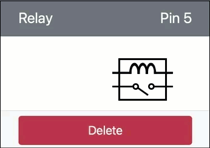

<!--
CO_OP_TRANSLATOR_METADATA:
{
  "original_hash": "f8f541ee945545017a51aaf309aa37c3",
  "translation_date": "2026-01-07T05:22:34+00:00",
  "source_file": "2-farm/lessons/3-automated-plant-watering/virtual-device-relay.md",
  "language_code": "te"
}
-->
# రిలేను నియంత్రించండి - వర్చువల్ IoT హార్డ్‌వేర్

పాఠం యొక్క ఈ భాగంలో, మీరు మీ వర్చువల్ IoT డివైస్‌లో మీ మట్టి తేమ సెన్సార్‌కు అదనంగా ఒక రిలేను చేర్చి, మట్టి తేమ స్థాయిపై ఆధారపడి ఆrelaeను నియంత్రించనున్నారు.

## వర్చువల్ హార్డ్‌వేర్

వర్చువల్ IoT డివైస్ ఒక అనుకరించిన Grove రిలేను ఉపయోగిస్తుంది. ఇది ఈ ప్రయోగాన్ని రాస్ప్బెర్రీ పైతో ఫిజికల్ Grove రిలేను ఉపయోగించడం వలెనే ఉంచుతుంది.

ఫిజికల్ IoT డివైస్‌లో, రిలే సాధారణంగా- ఓపెన్ రిలే ఉండేది (అంటే, సంకేతం రిలేకు పంపబడనప్పుడు అవుట్‌పుట్ సర్క్యూట్ తెరవబడిన లేదా డిస్కనెక్ట్ అయిన ఉంటుంది). ఇలాంటి రిలే 250V మరియు 10A వరకు అవుట్‌పుట్ సర్క్యూట్లను హ్యాండిల్ చేయగలదు.

### CounterFitకి రిలేను చేర్చడం

వర్చువల్ రిలేను ఉపయోగించడానికి, మీరు దాన్ని CounterFit యాప్‌లో చేర్చాలి

#### కార్యం

రిలేను CounterFit యాప్‌లో చేర్చండి.

1. చివరి పాఠంలో ఉన్న `soil-moisture-sensor` ప్రాజెక్ట్‌ను VS Codeలో ఇదివరకే ఓపెన్ కాని ఉంటే ఓపెన్ చేయండి. మీరు ఈ ప్రాజెక్టులో చేర్చడం చేయనున్నారు.

1. CounterFit వెబ్ యాప్ నడుస్తోందని నిర్ధారించుకోండి

1. ఒక రిలే సృష్టించండి:

    1. *Actuators* పేన్‌లో ఉన్న *Create actuator* బాక్సులో, *Actuator type* బాక్సును డ్రాప్ డౌన్ చేసి *Relay*ను ఎంచుకోండి.

    1. *Pin* ను *5* గా సెట్ చేయండి

    1. Pin 5 మీద రిలేను సృష్టించడానికి **Add** బటన్‌ను ఎంచుకోండి

    

    రిలే సృష్టించబడుతుంది మరియు actuators జాబితాలో కనిపిస్తుంది.

    

## రిలేను ప్రోగ్రామింగ్ చేయండి

ఇప్పుడు మట్టి తేమ సెన్సార్ యాప్ వర్చువల్ రిలేను ఉపయోగించేందుకు ప్రోగ్రామ్ చేయబడుతుంది.

### కార్యం

వర్చువల్ డివైస్‌ను ప్రోగ్రామ్ చేయండి.

1. చివరి పాఠంలో ఉన్న `soil-moisture-sensor` ప్రాజెక్ట్‌ను VS Codeలో ఇదివరకే ఓపెన్ కాని ఉంటే ఓపెన్ చేయండి. మీరు ఈ ప్రాజెక్టులో చేర్చడం చేయనున్నారు.

1. `app.py` ఫైల్లో ఉన్న ఇంపోర్ట్ల కింద క్రింద ఉన్న కోడ్‌ను చేర్చండి:

    ```python
    from counterfit_shims_grove.grove_relay import GroveRelay
    ```

    ఈ స్టేట్మెంట్ వర్చువల్ Grove రిలేతో ఇంటరాక్ట్ కావడానికి Grove Python షిమ్ లైబ్రరీల నుండి `GroveRelay`ను ఇంపోర్ట్ చేస్తుంది.

1. `ADC` క్లాస్ డిక్లరేషన్ కింద క్రింది కోడ్‌ను చేర్చించి ఒక `GroveRelay` ఇన్స్టెన్స్ సృష్టించండి:

    ```python
    relay = GroveRelay(5)
    ```

    ఇది మీరు రిలే ని కనెక్ట్ చేసిన పిన్ **5** ఉపయోగించి ఒక రిలేను సృష్టిస్తుంది.

1. రిలే సరిగ్గా పని చేస్తున్నదని పరీక్షించడానికి, `while True:` లూప్‌లో క్రింది కోడ్‌ను చేర్చండి:

    ```python
    relay.on()
    time.sleep(.5)
    relay.off()
    ```

    కోడ్ రిలేను ఆన్ చేస్తుంది, 0.5 సెకన్లు వేచి RELAYని ఆఫ్ చేస్తుంది.

1. Python యాప్‌ను రన్ చేయండి. రిలే ప్రతిసారీ 10 సెకన్ల వ్యవధి తర్వాత ఆన్ మరియు ఆఫ్ అవుతుంది, ఆన్ అవడం మరియు ఆఫ్ అవడం మధ్య 0.5 సెకన్ల ఆలస్యం ఉంటుంది. మీరు CounterFit యాప్‌లో వర్చువల్ రిలేకే ఇవ్వబడిన ఆన్ మరియు ఆఫ్ ఆదేశాలు చోటుచేసుకుని తెరవబడుతున్నదీ చూడగలరు.

    

## మట్టి తేమ ఆధారంగా రిలేను నియంత్రించండి

ఇప్పుడు రిలే పనిచేస్తోంది, దానిని మట్టి తేమ రీడింగ్స్‌కు స్పందిస్తూ నియంత్రించవచ్చు.

### కార్యం

రిలేను నియంత్రించండి.

1. మీరు రిలేను పరీక్షించడానికి చేర్చిన 3 కోడ్ రేఖలను తొలగించి, దానిని క్రింది కోడ్‌తో భర్తీ చేయండి:

    ```python
    if soil_moisture > 450:
        print("Soil Moisture is too low, turning relay on.")
        relay.on()
    else:
        print("Soil Moisture is ok, turning relay off.")
        relay.off()
    ```

    ఈ కోడ్ మట్టి తేమ సెన్సార్ నుండి మట్టి తేమ స్థాయిని తనిఖీ చేస్తుంది. అది 450 కంటే ఎక్కువ ఉంటే రిలేను ఆన్ చేస్తుంది, 450 కంటే తక్కువైనప్పుడు ఆపేస్తుంది.

    > 💁 గుర్తుంచుకోండి capacitive మట్టి తేమ సెన్సార్ తక్కువ విలువను చూపినప్పుడు మట్టిలో తేమ ఎక్కువగా ఉంటుంది మరియు విరుద్ధంగా ఉంటుంది.

1. Python యాప్‌ను రన్ చేయండి. మీరు మట్టి తేమ స్థాయిల ఆధారంగా రిలే ఆన్ లేదా ఆఫ్ అవుతున్నదీ చూడగలరు. మట్టి తేమ సెన్సార్ యొక్క *Value* లేదా *Random* సెట్టింగ్స్ మార్చి విలువ మార్పును పరిశీలించండి.

    ```output
    Soil Moisture: 638
    Soil Moisture is too low, turning relay on.
    Soil Moisture: 452
    Soil Moisture is too low, turning relay on.
    Soil Moisture: 347
    Soil Moisture is ok, turning relay off.
    ```

> 💁 మీరు ఈ కోడ్‌ను [code-relay/virtual-device](../../../../../2-farm/lessons/3-automated-plant-watering/code-relay/virtual-device) ఫోల్డర్‌లో కనుగొనవచ్చు.

😀 మీ వర్చువల్ మట్టి తేమ సెన్సార్ ఒక రిలేను నియంత్రించే ప్రోగ్రామ్ విజయవంతమైంది!

---

<!-- CO-OP TRANSLATOR DISCLAIMER START -->
**వ్యతిరేకత**:
ఈ పత్రాన్ని AI అనువాద సేవ [Co-op Translator](https://github.com/Azure/co-op-translator) ఉపయోగించి అనువదించబడింది. మేము ఖచ్చితత్వానికి ప్రయత్నిస్తున్నప్పటికీ, స్వయంచాలక అనువాదాలలో పొరపాట్లు లేదా తప్పిదాలుండే అవకాశం ఉంటుంది. స్థానిక భాషలో ఉన్న మౌలిక పత్రాన్ని అధికారిక మూలంగా పరిగణించాలి. కీలక సమాచారానికి, ప్రొఫెషనల్ మానవ అనువాదం చేయించుకోవడం మంచిది. ఈ అనువాదం వలన వచ్చిన ఏవైనా అవగాహనలో తప్పులు లేదా తప్పుదోవలకు మేము బాధ్యత వహించము.
<!-- CO-OP TRANSLATOR DISCLAIMER END -->