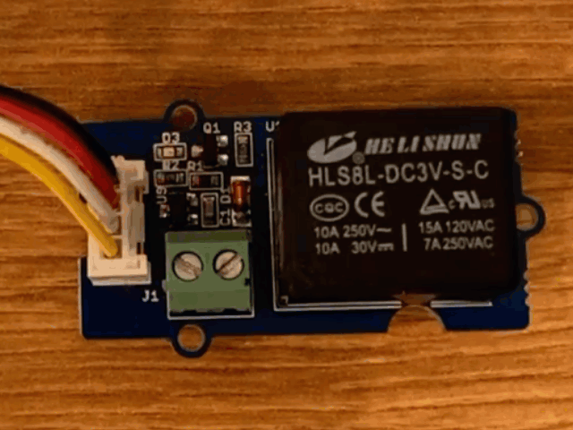

<!--
CO_OP_TRANSLATOR_METADATA:
{
  "original_hash": "f3c5d8afa2ef6a0b425ef8ff20615cb4",
  "translation_date": "2026-01-07T05:24:22+00:00",
  "source_file": "2-farm/lessons/3-automated-plant-watering/wio-terminal-relay.md",
  "language_code": "te"
}
-->
# రీలే ను నియంత్రించండి - Wio టెర్మినల్

పాఠం ఈ భాగంలో, మీరు మీ Wio టెర్మినల్ కు ఒక రీలే ను చాటు నీటిని మోతాదును ఆధారపడి నియంత్రించడం కోసం నేర్చుకుంటారు, నేల తేమ సెన్సార్ తో పాటు.

## హార్డ్వేర్

Wio టెర్మినల్ కు ఒక రీలే అవసరం.

మీరు ఉపయోగించబోయే రీలే ఒక [Grove relay](https://www.seeedstudio.com/Grove-Relay.html), ఇది సాధారణంగా-పెద్దదిగా ఉంటుంది (అంటే, రీలే కి సిగ్ని ల్ పంపించని పక్షంలో అవుట్‌పుట్ సర్క్యూట్ తెరిచి ఉంటుంది లేదా అనుసంధానింపబడలేదు), ఇది 250V మరియు 10A వరకు అవుట్‌పుట్ సర్క్యూట్లను నిర్వహించగలదు.

ఇది ఒక డిజిటల్ యాక్ట్యుయేటర్, అందువలన Wio టెర్మినల్ యొక్క డిజిటల్ పిన్స్‌కు కనెక్ట్ అవుతుంది. మిశ్రమ అనలాగ్/డిజిటల్ పోర్ట్ ఇప్పటికే నేల తేమ సెన్సార్ తో ఉపయోగంలో ఉంది, కాబట్టి ఇది మరొక పోర్ట్ లో కనెక్ట్ అవుతుంది, ఇది I<sub>2</sub>C మరియు డిజిటల్ పోర్ట్ కలిపినది.

### రీలే కనెక్ట్ చేయండి

Grove రీలే Wio టెర్మినల్ డిజిటల్ పోర్టుకు కనెక్ట్ చేయవచ్చు.

#### పని

రీలే కనెక్ట్ చేయండి.


1. Grove కేబుల్ ఒక చివరని రీలే上的 సాకెట్ లో నెట్టండి. అది ఒకదానితో మాత్రమే సరిపోతుంది.

1. Wio టెర్మినల్ ను మీ కంప్యూటర్ లేదా ఇతర పవర్ సరఫరా నుండి డిస్కనెక్ట్ చేసి, కేబుల్ యొక్క మరో చివరని Wio టెర్మినల్ స్క్రీన్ వైపు చూసినప్పుడు ఎడమ వైపు ఉన్న Grove సాకెట్ కు కనెక్ట్ చేయండి. నేల తేమ సెన్సార్ ను కుడి వైపు సాకెట్ లో ఉంచి ఉంచండి.


1. నేల తేమ సెన్సార్ ను నేలలో పోసుకోండి, అది పూర్వ పాఠం నుండీ ఇలుగా ఇప్పటికే లేకపోతే.

## రీలే కోసం ప్రోగ్రామ్ చేయండి

Wio టెర్మినల్ ఇప్పుడు జతచేసిన రీలేని ఉపయోగించడానికి ప్రోగ్రామ్ చేయవచ్చు.

### పని

పరికరాన్ని ప్రోగ్రామ్ చేయండి.

1. గత పాఠంలోని `soil-moisture-sensor` ప్రాజెక్ట్ ను VS కోడ్ లో తెరవండి, ఇది ఇప్పటికే తెరవబడకపోతే. మీరు ఈ ప్రాజెక్ట్ కు జత చేయనున్నార.

2. ఈ యాక్ట్యుయేటర్ కోసం లైబ్రరీ లేదు - ఇది డిజిటల్ యాక్ట్యుయేటర్, ఒక హై లేదా లో సిగ్నల్ తో నియంత్రించబడుతుంది. దీన్ని ఆన్ చేయడానికి, పిన్ కి హై సిగ్నల్ పంపుతారు (3.3V), ఆఫ్ చేయడానికి లో సిగ్నల్ (0V) పంపుతారు. మీరు దీనిని బిల్ట్-ఇన్ ఆర్డినో [`digitalWrite`](https://www.arduino.cc/reference/en/language/functions/digital-io/digitalwrite/) ఫంక్షన్ ఉపయోగించి చేయవచ్చు. నీటి రీలేకి వోల్టేజ్ పంపడానికి I<sub>2</sub>C/డిజిటల్ పోర్ట్ ను అవుట్‌పుట్ పిన్ గా సెట్ చేయడానికి `setup` ఫంక్షన్ కింద ఈ కోడ్ ను జత చేయండి:

    ```cpp
    pinMode(PIN_WIRE_SCL, OUTPUT);
    ```

    `PIN_WIRE_SCL` అనేది I<sub>2</sub>C/డిజిటల్ పోర్ట్ యొక్క పోర్ట్ నంబర్.

1. రీలే పనిచేస్తుందో లేదో పరీక్షించడానికి, `loop` ఫంక్షన్ లో చివరి `delay` కింద ఈ కోడ్ జత చేయండి:

    ```cpp
    digitalWrite(PIN_WIRE_SCL, HIGH);
    delay(500);
    digitalWrite(PIN_WIRE_SCL, LOW);
    ```

    రీలే కనెక్ట్ అయిన పిన్ కు హై సిగ్నల్ రాస్తుంది రీలే ఆన్ చేసేందుకు, 500 మిల్లీసెకన్ల (అరు సెకను) ఆగి, అప్పుడు తక్కువ సిగ్నల్ రాయడం ద్వారా రీలే ఆఫ్ అవుతుంది.

1. కోడ్ ను కంపైల్ చేసి Wio టెర్మినల్‌కు అప్‌లోడ్ చేయండి.

1. అప్‌లోడ్ అయిన తర్వాత, రీలే ప్రతి 10 సెకన్లకి ఆన్/ఆఫ్ అవుతుంది, ఆన్ మరియు ఆఫ్ మధ్యలో అర సెకను ఆలస్యం ఉంటుంది. మీరు రీలే టిక్ అన్, టిక్ ఆఫ్ శబ్దాన్ని వినిపిస్తారు. Grove బోర్డు పై LED రీలే ఆన్ ఉన్నప్పుడు వెలిగుతుంది, ఆఫ్ ఉన్నప్పుడు ఆపై వెలుతురు ఆగిపోతుంది.

    

## నేల తేమ ఆధారంగా రీలే నియంత్రణ

ఇప్పుడు రీలే పనిచేస్తుంది, దీనిని నేల తేమ పఠనం ఆధారంగా నియంత్రించవచ్చు.

### పని

రీలే నియంత్రించండి.

1. రీలే పరీక్ష కోసం జత చేసిన 3 కోడ్ లైన్స్ ను డిలీట్ చేయండి. వాటి స్థానంలో ఈ కింది కోడ్ అమర్చండి:

    ```cpp
    if (soil_moisture > 450)
    {
        Serial.println("Soil Moisture is too low, turning relay on.");
        digitalWrite(PIN_WIRE_SCL, HIGH);
    }
    else
    {
        Serial.println("Soil Moisture is ok, turning relay off.");
        digitalWrite(PIN_WIRE_SCL, LOW);
    }
    ```

    ఈ కోడ్ నేల తేమ సెన్సార్ నుండి నేల తేమ స్థాయిని తనిఖీ చేస్తుంది. ఇది 450 కంటే ఎక్కువ అయితే రీలే ఆన్ చేస్తుంది, 450 కంటే తక్కువ అయితే ఆఫ్ చేస్తుంది.

    > 💁 గుర్తుంచుకోండి, కాపాసిటివ్ నేల తేమ సెన్సార్ తక్కువ తేమ స్థాయిని చదవగా, నేలలో తేమ ఎక్కువగా ఉందని అర్థం, మరియు వ్యతిరేకం.

1. కోడ్ ను కంపైల్ చేసి Wio టెర్మినల్ లో అప్‌లోడ్ చేయండి.

1. సీరియల్ మానిటర్ ద్వారా పరికరాన్ని మానిటర్ చేయండి. నేల తేమ స్థాయి ఆధారంగా రీలే ఆన్ లేదా ఆఫ్ అవుతుంది. పొడి నేలలో ప్రయత్నించి, తర్వాత నీరు యీర్చండి.

    ```output
    Soil Moisture: 638
    Soil Moisture is too low, turning relay on.
    Soil Moisture: 452
    Soil Moisture is too low, turning relay on.
    Soil Moisture: 347
    Soil Moisture is ok, turning relay off.
    ```

> 💁 మీరు ఈ కోడ్ ను [code-relay/wio-terminal](../../../../../2-farm/lessons/3-automated-plant-watering/code-relay/wio-terminal) ఫోల్డర్ లో చూడవచ్చు.

😀 మీ నేల తేమ సెన్సార్ రీలే నియంత్రణ ప్రోగ్రామ్ విజయవంతం అయింది!

---

<!-- CO-OP TRANSLATOR DISCLAIMER START -->
**బడ్జెట్ నిషేధం**:  
ఈ డాక్యుమెంట్‌ను AI అనువాద సేవ [Co-op Translator](https://github.com/Azure/co-op-translator) ఉపయోగించి అనువదించాం. మనం ఖచ్చితత్వానికోసం ప్రయత్నిస్తున్నప్పటికీ, ավտోమేటెడ్ అనువాదాల్లో పొరపాట్లు లేదా తప్పులు ఉండవచ్చు. మూల భాషలో ఉన్న అసలు డాక్యుమెంట్‌ను అధికారిక మూలంగా పరిగణించాలి. ముఖ్యమైన సమాచారానికి, వృత్తిపరమైన మానవ అనువాదాన్ని సూచిస్తున్నాము. ఈ అనువాదం ఉపయోగంలో నిత్యం ఏర్పడే ఏనైనా తప్పుదోవలు లేదా అపర్థాలకు మేము బాధ్యత వహించము.
<!-- CO-OP TRANSLATOR DISCLAIMER END -->